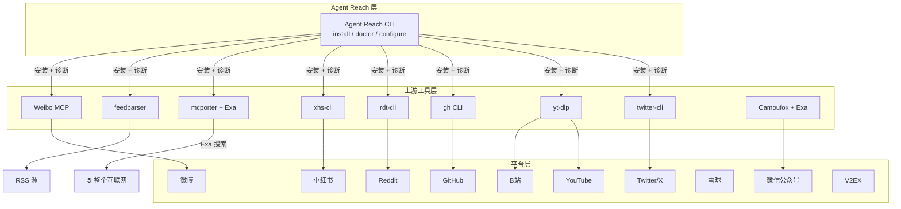

# 架构设计

<details>
<summary>相关源码文件</summary>

- [agent_reach/core.py](https://github.com/Panniantong/Agent-Reach/blob/17624268/agent_reach/core.py)
- [agent_reach/channels/base.py](https://github.com/Panniantong/Agent-Reach/blob/17624268/agent_reach/channels/base.py)
- [agent_reach/channels/__init__.py](https://github.com/Panniantong/Agent-Reach/blob/17624268/agent_reach/channels/__init__.py)
- [CLAUDE.md](https://github.com/Panniantong/Agent-Reach/blob/17624268/CLAUDE.md)
</details>

# 架构设计

## 核心定位：脚手架（Scaffolding），不是框架

Agent Reach 的核心哲学是 **"只做选型和配置，不做封装"**。

每个平台背后是一个独立的上游工具。**不满意？换掉就行。**



## Channel 抽象

每个平台在 `agent_reach/channels/` 下对应一个文件，继承自 `Channel` 基类。

```python
# agent_reach/channels/base.py
class Channel(ABC):
    name: str = ""          # 唯一标识，如 "youtube"
    description: str = ""   # 中文描述，如 "YouTube 视频和字幕"
    backends: List[str] = [] # 上游工具列表，如 ["yt-dlp"]
    tier: int = 0           # 0=零配置, 1=需免费Key, 2=需登录配置

    @abstractmethod
    def can_handle(self, url: str) -> bool:
        """判断此 URL 是否属于本平台"""
        ...

    def check(self, config=None) -> Tuple[str, str]:
        """检查上游工具是否可用"""
        return "ok", f"{'、'.join(self.backends) if self.backends else '内置'}"
```

**渠道注册机制：**

```python
# agent_reach/channels/__init__.py
ALL_CHANNELS = [
    GitHubChannel(),
    TwitterChannel(),
    YouTubeChannel(),
    # ... 共16个
]
```

Doctor 引擎通过遍历 `ALL_CHANNELS` 调用各渠道的 `check()` 方法来生成诊断报告。

## Tier 分层设计

| Tier | 说明 | 渠道示例 |
|------|------|---------|
| 0 | 零配置，装好即用 | 网页、YouTube字幕、RSS、GitHub公开、B站、微博、V2EX、雪球 |
| 1 | 需要免费 API Key 或 Cookie | Twitter读推文、Reddit、小红书、抖音、LinkedIn |
| 2 | 需要复杂配置或付费代理 | B站服务器代理、小宇宙播客（Groq Key） |

## 设计原则

1. **不重复造轮子** — 所有功能都通过调用上游开源工具实现
2. **可插拔** — 任何渠道文件不满意，直接替换，不影响其他渠道
3. **本地优先** — Cookie/Token 只存在 `~/.agent-reach/config.yaml`，权限 600，不上传
4. **幂等安装** — 重复安装不会重复配置，只报"已安装"
5. **零配置渠道优先** — 默认安装零配置渠道，需要复杂配置的渠道需要显式指定

## 安全设计

- **配置目录权限：** `~/.agent-reach/` 仅所有者可读写（`chmod 700`）
- **Cookie 不上传** — 只存本地
- **安全模式：** `agent-reach install --safe` 只列出需要什么，不自动修改系统
- **Dry Run：** `agent-reach install --dry-run` 预览所有操作，不做任何改动

## 相关页面

- [快速上手](./quickstart.html)
- [CLI 命令参考](./cli-reference.html)
- [配置系统](./config.html)
