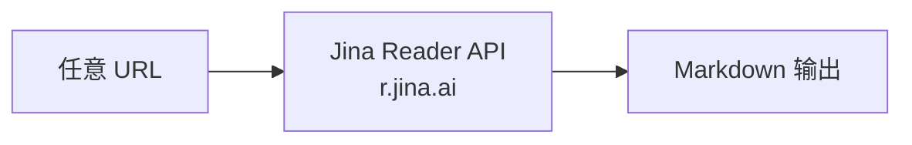

# 渠道详解

<details>
<summary>相关源码文件</summary>

- [agent_reach/channels/__init__.py](https://github.com/Panniantong/Agent-Reach/blob/17624268/agent_reach/channels/__init__.py)
- [agent_reach/channels/base.py](https://github.com/Panniantong/Agent-Reach/blob/17624268/agent_reach/channels/base.py)
- [config/mcporter.json](https://github.com/Panniantong/Agent-Reach/blob/17624268/config/mcporter.json)
</details>

# 渠道详解（16个平台）

## 渠道总表

```python
# ALL_CHANNELS 注册顺序
ALL_CHANNELS = [
    GitHubChannel(),      # 0
    TwitterChannel(),     # 1
    YouTubeChannel(),     # 2
    RedditChannel(),      # 3
    BilibiliChannel(),    # 4
    XiaoHongShuChannel(), # 5
    DouyinChannel(),      # 6
    LinkedInChannel(),    # 7
    WeChatChannel(),      # 8
    WeiboChannel(),       # 9
    XiaoyuzhouChannel(),  # 10
    V2EXChannel(),        # 11
    XueqiuChannel(),      # 12
    RSSChannel(),         # 13
    ExaSearchChannel(),   # 14
    WebChannel(),         # 15
]
```

## Tier 0 — 零配置渠道

### 🌐 WebChannel — 任意网页

- **Backend:** Jina Reader（`curl https://r.jina.ai/<URL>`）
- **Check:** `shutil.which("curl")`
- **无需任何认证**
- **适用场景：** 任意公开网页的 Markdown 化读取



### 📺 YouTubeChannel — YouTube + B站

- **Backend:** yt-dlp
- **Check:** `shutil.which("yt-dlp")`
- **功能：** 字幕提取、视频元数据、视频搜索
- **配置：** Node.js 作为 JS runtime（`--js-runtimes node`）

```bash
# 提取字幕
yt-dlp --write-sub --skip-download "URL"
# 提取元数据
yt-dlp --dump-json "URL"
```

### 📡 RSSChannel — 任意 RSS/Atom 源

- **Backend:** feedparser
- **Check:** `import feedparser`
- **无需任何认证**

### 📦 GitHubChannel — GitHub 公开 API

- **Backend:** gh CLI
- **Check:** `shutil.which("gh")`
- **零配置功能：** 公开仓库读取、搜索
- **需 Token：** 私有仓库、Issue/PR 操作、Fork
- **Token 配置：** `agent-reach configure github-token <TOKEN>`

```bash
# 公开仓库
gh repo view owner/repo
# 搜索
gh search repos "LLM framework"
```

### 📺 BilibiliChannel — B站

- **Backend:** yt-dlp（本地）、bili-cli
- **Tier 0（本地）：** 字幕提取、视频搜索
- **Tier 2（服务器）：** 需要 residential 代理（~$1/月）
- **代理配置：** `agent-reach configure proxy http://user:pass@ip:port`

### 📰 WeiboChannel — 微博

- **Backend:** Weibo MCP（Panniantong fork，带 visitor passport auth 修复）
- **Check:** `mcporter config list` 中有 "weibo"
- **功能：** 热搜、搜索内容/用户/话题、用户动态、评论
- **安装：** `mcporter config add weibo --command mcp-server-weibo`

### 💻 V2EXChannel — V2EX

- **Backend:** 内置（无外部工具）
- **功能：** 热门帖子、节点帖子、帖子详情+回复、用户信息

### 📈 XueqiuChannel — 雪球

- **Backend:** 内置（无外部工具）
- **功能：** 股票行情、搜索股票、热门帖子、热门股票排行

## Tier 1 — 需认证渠道

### 🐦 TwitterChannel — Twitter/X

- **Backend:** twitter-cli
- **安装：** `pipx install twitter-cli`
- **零配置：** 读单条推文（`twitter tweet URL`）
- **需 Cookie：** 搜索推文、浏览时间线、发推
- **Cookie 格式：** `auth_token` + `ct0`
- **配置方式：**
  ```bash
  agent-reach configure twitter-cookies "AUTH_TOKEN CT0"
  # 或
  agent-reach configure --from-browser chrome
  ```

### 📖 RedditChannel — Reddit

- **Backend:** rdt-cli
- **安装：** `pipx install rdt-cli`
- **无需代理：** rdt-cli 本身已解决访问问题
- **登录：** `rdt login`（从浏览器提取 Cookie）
- **功能：** 搜索帖子、读帖子全文和评论

### 📕 XiaoHongShuChannel — 小红书

- **Backend:** xhs-cli（xiaohongshu-cli）
- **安装：** `pipx install xiaohongshu-cli`
- **登录：** `xhs login`（Cookie-Editor 导出）
- **功能：** 搜索笔记、阅读详情、查看评论、发帖
- **Docker 容器：** `xpzouying/xiaohongshu-mcp`

### 🎵 DouyinChannel — 抖音

- **Backend:** douyin-mcp-server（MCPorter MCP）
- **无需登录：** 只需分享链接
- **功能：** 视频信息解析、无水印下载链接获取

### 💼 LinkedInChannel — LinkedIn

- **Backend:** linkedin-mcp-server
- **功能：** 公开页面（无需登录）、Profile详情（需Cookie）
- **安装：** mcporter 配置

### 💬 WeChatChannel — 微信公众号

- **Backend:** Exa（搜索）+ Camoufox（可选，浏览器自动化）
- **零配置：** 搜索 + 阅读公众号文章（全文 Markdown）
- **可选：** Camoufox 增强登录态访问

### 🎙️ XiaoyuzhouChannel — 小宇宙播客

- **Backend:** `transcribe_xiaoyuzhou.sh` + Whisper（Groq API）
- **安装：** `agent-reach install --channels=xiaoyuzhou`
- **依赖：** ffmpeg、Groq API Key（免费额度）
- **功能：** 播客音频转文字

## Tier 2 — 需复杂配置

### 🔍 ExaSearchChannel — 全网语义搜索

- **Backend:** mcporter + Exa MCP（`https://mcp.exa.ai/mcp`）
- **特点：** AI 语义搜索，MCP 接入免 Key，免费
- **安装：** `mcporter config add exa https://mcp.exa.ai/mcp`
- **check：** `mcporter config list` 中有 "exa"

## MCP 工具配置（mcporter.json）

```json
// config/mcporter.json
{
  "mcpServers": {
    "exa": "https://mcp.exa.ai/mcp",
    "xiaohongshu": "xpzouying/xiaohongshu-mcp",
    "weibo": "Panniantong/mcp-server-weibo#main",
    "douyin": "yzfly/douyin-mcp-server"
  }
}
```

## 相关页面

- [架构设计](./architecture.html)
- [CLI 命令参考](./cli-reference.html)
