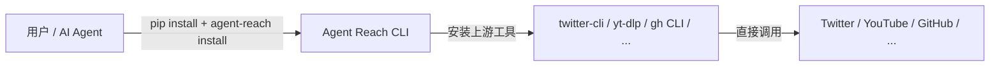

# 项目概览

<details>
<summary>相关源码文件</summary>

- [README.md](https://github.com/Panniantong/Agent-Reach/blob/17624268/README.md)
- [CLAUDE.md](https://github.com/Panniantong/Agent-Reach/blob/17624268/CLAUDE.md)
- [pyproject.toml](https://github.com/Panniantong/Agent-Reach/blob/17624268/pyproject.toml)
</details>

# 👁️ Agent Reach — 项目概览

## 项目定位

**一句话描述：** 给你的 AI Agent 一键装上互联网能力。

Agent Reach 是一个 **Python CLI 安装器 + 诊断工具**，不是 wrapper 层。安装完成后，Agent 直接调用上游工具（twitter-cli、yt-dlp、gh CLI 等），无需经过 Agent Reach 的封装。

**源码：** `agent_reach/cli.py`（CLI入口）、`agent_reach/core.py`（核心类）、`agent_reach/doctor.py`（诊断引擎）



## 核心价值主张

| 痛点 | Agent Reach 解决方案 |
|------|-------------------|
| 每个平台 API 配置繁琐 | 一句话安装：`agent-reach install --env=auto` |
| Cookie 认证流程复杂 | Cookie-Editor 浏览器导出 → 发给 Agent 即可 |
| 平台封禁/反爬不断变化 | 底层工具（yt-dlp、twitter-cli等）持续追踪更新 |
| 部署在服务器上缺代理 | 自动识别服务器环境，给出代理建议 |
| 不知道哪个渠道通了 | `agent-reach doctor` 一键诊断 |

## 支持的平台（16个）

| 平台 | 零配置 | 需配置 | 认证方式 | 底层工具 |
|------|--------|--------|----------|---------|
| 🌐 网页 | ✅ | — | 无 | Jina Reader |
| 📺 YouTube | ✅ | — | 无 | yt-dlp |
| 📡 RSS | ✅ | — | 无 | feedparser |
| 🔍 全网搜索 | — | ✅ | MCP (Exa, 免费) | mcporter + Exa |
| 📦 GitHub | ✅ 公开 | ✅ 私有 | Token | gh CLI |
| 🐦 Twitter/X | ✅ 读单条 | ✅ 搜索/发推 | Cookie | twitter-cli |
| 📺 B站 | ✅ 本地 | ✅ 服务器 | 代理 | yt-dlp |
| 📖 Reddit | ✅ 搜索+阅读 | ✅ Cookie | rdt-cli | |
| 📕 小红书 | — | ✅ | Cookie | xhs-cli |
| 🎵 抖音 | — | ✅ | 无需登录 | douyin-mcp-server |
| 💼 LinkedIn | ✅ 公开页 | ✅ Profile详情 | Cookie | linkedin-mcp |
| 💬 微信公众号 | ✅ | — | 无 | Exa + Camoufox |
| 📰 微博 | ✅ | — | 无 | Weibo MCP (Panniantong fork) |
| 💻 V2EX | ✅ | — | 无 | 内置 |
| 📈 雪球 | ✅ | — | 无 | 内置 |
| 🎙️ 小宇宙播客 | — | ✅ | Groq API Key | 脚本 + Whisper |

## 版本与依赖

- **当前版本：** 1.3.0
- **Python 版本：** 3.10+
- **关键依赖：** loguru（日志）、rich（CLI输出）、pyyaml（配置）、pytest（测试）
- **系统依赖：** gh CLI、Node.js（mcporter）、ffmpeg（播客转录）

## 目录结构

```
agent_reach/
├── cli.py              # CLI 入口（argparse）
├── core.py             # AgentReach 核心类
├── config.py           # YAML 配置管理
├── doctor.py           # 渠道健康检查引擎
├── cookie_extract.py   # 浏览器 Cookie 自动提取
├── channels/           # 16个平台渠道（各一个文件）
│   ├── base.py         # Channel 基类
│   ├── twitter.py      # twitter-cli
│   ├── youtube.py      # yt-dlp
│   ├── github.py       # gh CLI
│   └── ...
├── integrations/      # MCP server 集成
├── guides/             # 使用指南
└── skill/             # OpenClaw/Claude Code Skill 文件
```

## 快速安装命令

```bash
# 一句话安装
pip install -e .
agent-reach install --env=auto

# 诊断
agent-reach doctor

# 安装可选渠道
agent-reach install --channels=twitter,weibo,xiaohongshu --env=auto
```

## 相关页面

- [架构设计](./architecture.html) — 脚手架 vs 框架、可插拔设计
- [渠道详解](./channels.html) — 每个渠道的 check 机制和 backends
- [CLI 命令参考](./cli-reference.html) — 所有子命令详解
