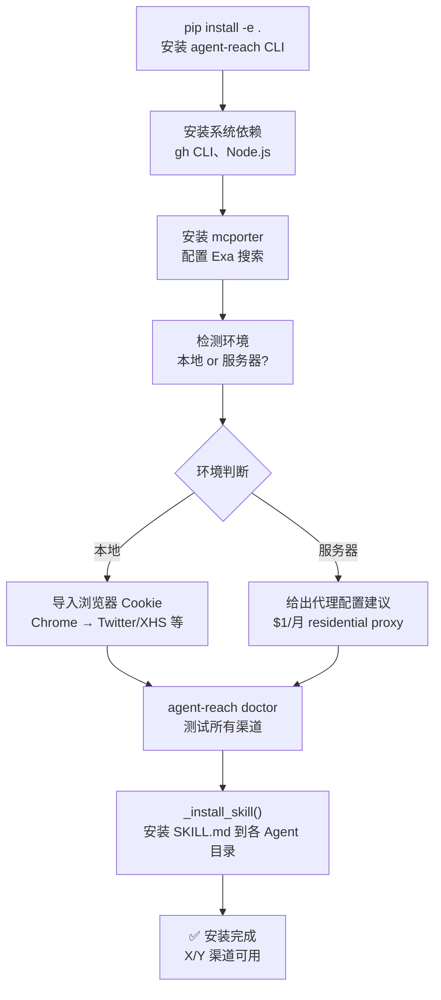

# 快速上手

<details>
<summary>相关源码文件</summary>

- [agent_reach/cli.py](https://github.com/Panniantong/Agent-Reach/blob/17624268/agent_reach/cli.py)（特别是 `_cmd_install`、`_detect_environment`、`_install_skill` 函数）
- [docs/install.md](https://github.com/Panniantong/Agent-Reach/blob/17624268/docs/install.md)
- [docs/update.md](https://github.com/Panniantong/Agent-Reach/blob/17624268/docs/update.md)
</details>

# 快速上手

## 一句话安装（适合 AI Agent）

把这句话发给任何 AI Agent（Claude Code、OpenClaw、Cursor 等）：

```
帮我安装 Agent Reach：https://raw.githubusercontent.com/Panniantong/agent-reach/main/docs/install.md
```

> ⚠️ **OpenClaw 用户：** 首次安装前需确认 exec 权限已开启：
> ```bash
> openclaw config set tools.profile "coding"
> openclaw gateway restart
> ```

## 安装步骤分解

Agent 收到命令后会依次执行：



## 安装模式

| 模式 | 命令 | 说明 |
|------|------|------|
| 全自动 | `agent-reach install --env=auto` | 自动检测环境，安装所有零配置渠道 |
| 安全模式 | `agent-reach install --env=auto --safe` | 不修改系统，只列出需要什么 |
| 预览 | `agent-reach install --env=auto --dry-run` | 预览所有操作，不实际安装 |
| 指定渠道 | `agent-reach install --channels=twitter,weibo,xiaohongshu` | 只安装指定渠道 |

## 环境自动检测逻辑

```python
def _detect_environment():
    """返回 'local' 或 'server'"""
    indicators = 0
    # SSH session → indicators += 2
    # Docker/.container → indicators += 2
    # 无 DISPLAY → indicators += 1
    # 云厂商特征 → indicators += 2
    # systemd-detect-virt != none → indicators += 1
    return "server" if indicators >= 2 else "local"
```

**服务器环境特殊处理：**
- B站需要代理（rdt-cli for Reddit 无需代理）
- 提示用户配置 residential proxy（~$1/月）

## 安装后验证

```bash
# 一键诊断
agent-reach doctor

# 预期输出示例
# ✅ GitHub — gh CLI
# ✅ Twitter — twitter-cli
# ✅ YouTube — yt-dlp
# -- Reddit — rdt-cli 未安装（运行 pipx install rdt-cli）
# ✅ Bilibili — yt-dlp
# ...
```

## 装好后怎么用

**不需要记命令。** Agent 读完 SKILL.md 后自己知道该调什么：

- "帮我看看这个链接" → Jina Reader
- "这个 GitHub 仓库是做什么的" → gh CLI
- "这个视频讲了什么" → yt-dlp
- "帮我看看这条推文" → twitter-cli
- "订阅这个 RSS" → feedparser

## 更新 Agent Reach

```
帮我更新 Agent Reach：https://raw.githubusercontent.com/Panniantong/agent-reach/main/docs/update.md
```

## 完整命令参考

```bash
# 开发安装
pip install -e .

# 安装
agent-reach install --env=auto
agent-reach install --channels=twitter,weibo,xiaohongshu --env=auto

# 诊断
agent-reach doctor

# 配置
agent-reach configure twitter-cookies "AUTH_TOKEN CT0"
agent-reach configure github-token ghp_xxxxx
agent-reach configure --from-browser chrome

# 卸载
agent-reach uninstall
agent-reach uninstall --dry-run
agent-reach uninstall --keep-config  # 只删skill，保留token

# 检查更新
agent-reach check-update

# 健康检查（无输出=一切正常）
agent-reach watch
```

## 相关页面

- [CLI 命令参考](./cli-reference.html)
- [架构设计](./architecture.html)
- [配置系统](./config.html)
