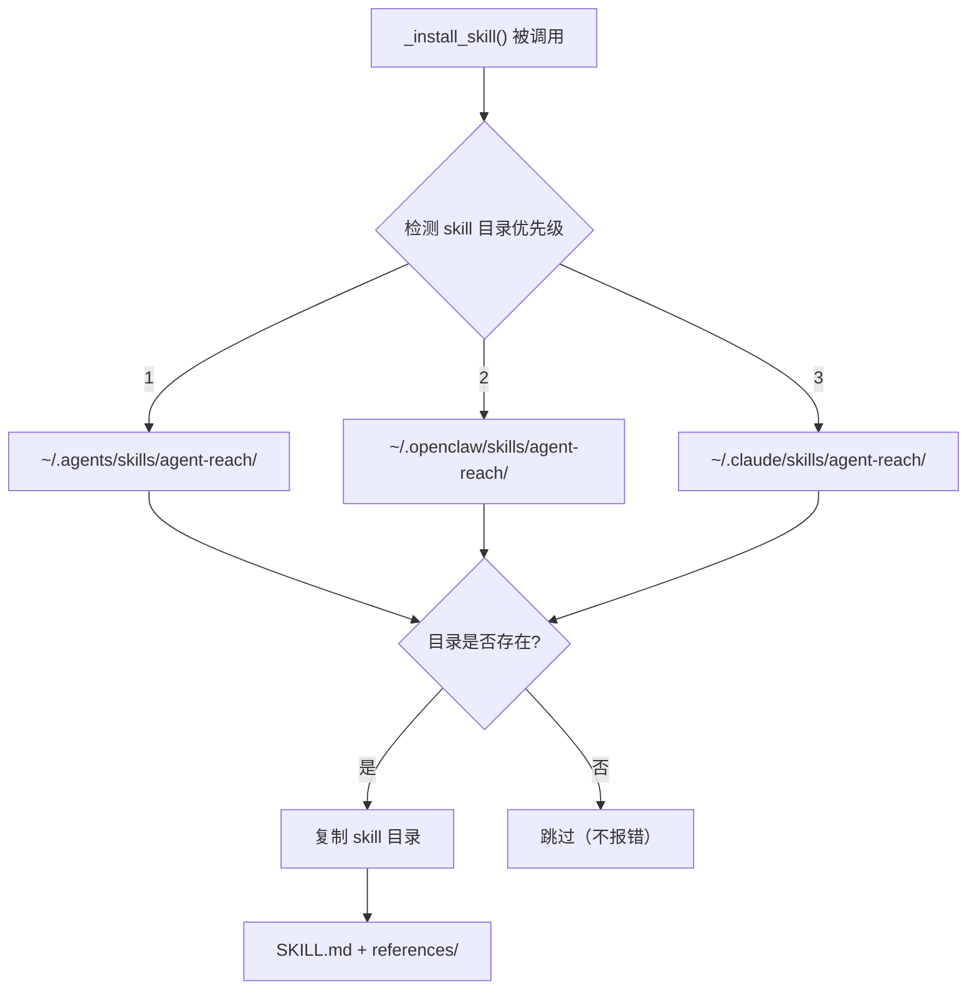

# Agent Skill 集成

<details>
<summary>相关源码文件</summary>

- [agent_reach/cli.py](https://github.com/Panniantong/Agent-Reach/blob/17624268/agent_reach/cli.py)（`_install_skill`、`_uninstall_skill` 函数）
- [agent_reach/skill/](https://github.com/Panniantong/Agent-Reach/tree/17624268/agent_reach/skill/)
</details>

# Agent Skill 集成

## 安装流程

Agent Reach 安装完成后会自动调用 `_install_skill()`，将 `SKILL.md` 安装到各 Agent 的 skills 目录：



## Skill 安装目标（按优先级）

```python
skill_dirs = [
    os.path.expanduser("~/.agents/skills"),    # 1. 通用 agents（最高优先级）
    os.path.expanduser("~/.openclaw/skills"),  # 2. OpenClaw
    os.path.expanduser("~/.claude/skills"),    # 3. Claude Code
]
```

**同时检查 `OPENCLAW_HOME` 环境变量：**
```python
if openclaw_home := os.environ.get("OPENCLAW_HOME"):
    skill_dirs.insert(0, os.path.join(openclaw_home, ".openclaw", "skills"))
```

## 多语言 SKILL.md

```python
def _skill_resource_name() -> str:
    locale_candidates = (
        os.environ.get("AGENT_REACH_LANG", ""),
        os.environ.get("LC_ALL", ""),
        os.environ.get("LC_MESSAGES", ""),
        os.environ.get("LANG", ""),
    )
    # 系统语言为英文 → SKILL_en.md
    # 其他语言 → SKILL.md（中文）
```

**文件结构：**
```
agent_reach/skill/
├── SKILL.md           # 中文版（默认）
├── SKILL_en.md        # 英文版
└── references/        # 参考文档
    ├── twitter.md
    ├── youtube.md
    └── ...
```

## Skill 安装内容

```python
def _copy_skill_dir(target: str) -> bool:
    # 1. 清空已存在的安装
    if os.path.exists(target):
        shutil.rmtree(target)

    # 2. 复制 SKILL.md（根据语言选择版本）
    # 3. 复制 references/ 目录
```

## 卸载 Skill

```bash
agent-reach skill --uninstall
```

卸载范围：
- `~/.openclaw/skills/agent-reach/`
- `~/.claude/skills/agent-reach/`
- `~/.agents/skills/agent-reach/`

**注意：** `agent-reach uninstall` 也会自动调用 `_uninstall_skill()`

## SKILL.md 能做什么

安装 SKILL.md 后，Agent 知道：

1. **每个平台怎么调用** — 不需要你记命令
2. **什么时候用 Cookie** — Twitter、小红书等需要认证的平台
3. **安全注意事项** — 专用小号、不上传凭据
4. **遇到问题怎么办** — `agent-reach doctor` 诊断

## 版本号一致性要求

> ⚠️ **重要：** 版本号必须在三处保持一致：
> 1. `pyproject.toml` 的 `version`
> 2. `agent_reach/__init__.py` 的 `__version__`
> 3. `tests/test_cli.py` 中的预期版本

## 相关页面

- [CLI 命令参考](./cli-reference.html)
- [配置系统](./config.html)
