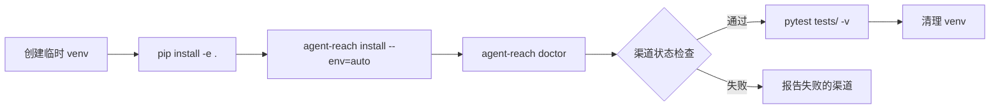

# 测试体系

<details>
<summary>相关源码文件</summary>

- [tests/](https://github.com/Panniantong/Agent-Reach/tree/17624268/tests/)
- [.github/workflows/pytest.yml](https://github.com/Panniantong/Agent-Reach/blob/17624268/.github/workflows/pytest.yml)
- [test.sh](https://github.com/Panniantong/Agent-Reach/blob/17624268/test.sh)
</details>

# 测试体系

## 测试文件结构

```
tests/
├── test_channel_contracts.py   # 渠道契约测试
├── test_channels.py            # 各渠道逻辑测试
├── test_cli.py                 # CLI 命令测试
├── test_config.py              # 配置系统测试
├── test_core.py                # 核心类测试
├── test_doctor.py              # 诊断引擎测试
├── test_skill_command.py       # Skill 命令测试
├── test_twitter_channel.py      # Twitter 特定测试
├── test_xhs_format.py          # 小红书格式化测试
└── test_xiaoyuzhou_install.py  # 小宇宙安装测试
```

## pytest 测试

```bash
# 运行所有测试
pytest tests/ -v

# 运行特定测试文件
pytest tests/test_cli.py -v

# 运行特定测试用例
pytest tests/test_cli.py::test_doctor_command -v
```

## test.sh 集成测试

```bash
bash test.sh
```

完整集成测试流程：



## CI 配置

`.github/workflows/pytest.yml` — GitHub Actions 自动化测试：

```yaml
on:
  push:
    branches: [main]
  pull_request:
    branches: [main]

jobs:
  test:
    runs-on: ubuntu-latest
    steps:
      - uses: actions/checkout@v4
      - uses: actions/setup-python@v5
        with:
          python-version: '3.10'
      - run: pip install -e .
      - run: pytest tests/ -v
```

## CLI 测试要点

```python
# tests/test_cli.py 测试覆盖的子命令
def test_install_command(): ...
def test_doctor_command(): ...
def test_configure_command(): ...
def test_uninstall_command(): ...
def test_skill_command(): ...
def test_version_command(): ...
```

**版本号一致性检查：**
```python
def test_version():
    # 确保 pyproject.toml、__init__.py、test_cli.py 版本一致
    assert __version__ == "1.3.0"
```

## 渠道契约测试

每个渠道必须实现的契约：

```python
# test_channel_contracts.py
def test_all_channels_have_required_methods():
    for ch in get_all_channels():
        assert hasattr(ch, 'can_handle')
        assert hasattr(ch, 'check')
        assert isinstance(ch.name, str)
        assert isinstance(ch.tier, int)

def test_can_handle_patterns():
    # YouTube 渠道必须能处理 youtube.com/watch?v=xxx
    yt = YouTubeChannel()
    assert yt.can_handle("https://www.youtube.com/watch?v=dQw4w9WgXcQ")
    assert not yt.can_handle("https://twitter.com/xxx")
```

## Doctor 引擎测试

```python
def test_check_all_returns_dict():
    results = check_all(Config())
    assert isinstance(results, dict)
    for name, result in results.items():
        assert 'status' in result
        assert result['status'] in ('ok', 'warn', 'off', 'error')

def test_format_report_non_empty():
    results = check_all(Config())
    report = format_report(results)
    assert len(report) > 0
```

## 配置系统测试

```python
def test_config_default_path():
    c = Config()
    assert c.config_path.name == "config.yaml"

def test_set_and_get():
    c = Config()
    c.set("test_key", "test_value")
    assert c.get("test_key") == "test_value"

def test_env_override():
    os.environ["TEST_KEY"] = "env_value"
    c = Config()
    assert c.get("test_key") == "env_value"  # env 覆盖 config
```

## 相关页面

- [CLI 命令参考](./cli-reference.html)
- [架构设计](./architecture.html)
