# CLI-Anything DeepWiki — 完整导出

> 让所有软件变为 Agent 原生 — 通过自动化 CLI 生成桥接 AI Agent 与世界软件的鸿沟

**来源**: https://github.com/HKUDS/CLI-Anything @ `26bd973`
**生成日期**: 2026-04-30
**模式**: comprehensive
**语言**: zh-CN

---

## 目录

1. [项目概览](pages/overview.md)
2. [系统架构](pages/system-architecture.md)
3. [七阶段生成流水线](pages/seven-phase-pipeline.md)
4. [Harness 包结构与实现模式](pages/harness-structure.md)
5. [CLI-Hub 包管理器](pages/cli-hub.md)
6. [SKILL.md 技能系统](pages/skill-system.md)
7. [多 Agent 平台集成](pages/agent-platform-integration.md)
8. [预览与轨迹系统](pages/preview-system.md)
9. [测试与质量保障](pages/testing-and-quality.md)
10. [CI/CD 与注册表基础设施](pages/ci-cd-and-registry.md)


---

<details>
<summary>相关源文件</summary>

生成本页时使用的主要源文件：

- [README.md](../../../project-repos/CLI-Anything/README.md)
- [README_CN.md](../../../project-repos/CLI-Anything/README_CN.md)
- [CONTRIBUTING.md](../../../project-repos/CLI-Anything/CONTRIBUTING.md)
- [registry.json](../../../project-repos/CLI-Anything/registry.json)
- [LICENSE](../../../project-repos/CLI-Anything/LICENSE)

</details>

# 项目概览

CLI-Anything 是 HKUDS 实验室发布的开源框架，核心命题是：**让任意软件对 AI Agent 原生可用**。它通过自动化 CLI 生成流水线，将现有应用程序（GUI、库、服务）转化为 Agent 可直接调用的命令行接口，无需修改被封装软件的任何源代码。

> "今天的软件服务人类，明天的用户将是 Agent。"
>
> — CLI-Anything README

Sources: [README.md:1-20](../../../project-repos/CLI-Anything/README.md#L1-L20)

<details class="source-snippets">
<summary>引用源码</summary>

<!-- source-snippets:start -->

#### `README.md:1-20`

```markdown
<h1 align="center">&nbsp; CLI-Anything: Making ALL Software Agent-Native</h1>

<p align="center">
  <strong>Today's Software Serves Humans👨‍💻. Tomorrow's Users will be Agents🤖.<br>
CLI-Anything: Bridging the Gap Between AI Agents and the World's Software</strong><br>
</p>

**🌐 [CLI-Hub](https://hkuds.github.io/CLI-Anything/)**: `pip install cli-anything-hub` then `cli-hub install <name>` — browse, install, and manage all community-built CLIs. Want to add your own? [Open a PR](https://github.com/HKUDS/CLI-Anything/blob/main/CONTRIBUTING.md) — the hub updates instantly.

**🎬 [See Demos](#-real-world-demos)**: Watch AI agents use generated CLIs plus preview, live preview, and trajectory loops to produce real artifacts — CAD builds, 3D scenes, diagrams, gameplay, subtitles, and more.

**🙋 [Become a Contributor, or Request a CLI]**: [Join us](https://github.com/HKUDS/CLI-Anything/issues/new?template=contributor-signup.yml)! Sign up to build a new CLI harness — once reviewed and merged, you'll gain access as one of our community contributors! Wish CLI-Anything supported a specific software or service? Submit a [wishlist request](https://github.com/HKUDS/CLI-Anything/issues/new?template=cli-wishlist.yml)!

<p align="center">
  <a href="#-quick-start"></a>
  <a href="https://hkuds.github.io/CLI-Anything/"></a>
  <a href="#-demonstrations"></a>
  <a href="#-test-results"></a>
  <a href="LICENSE"></a>
</p>
```

<!-- source-snippets:end -->
</details>
---

## 1. 项目定位与愿景

### Agent-Software 鸿沟

当前绝大多数软件是为人类交互而设计的：图形界面、菜单导航、对话框确认。AI Agent 在调用这类软件时面临三大障碍：

1. **接口不确定性** — GUI 状态难以被程序化感知，自动化脚本极易因版本升级而失效。
2. **能力发现缺失** — Agent 不知道某个软件"能做什么"，只能靠预置知识或反复试错。
3. **输出格式混乱** — 人类可读的文本输出对 Agent 下游处理不友好。

CLI-Anything 的解法是在软件与 Agent 之间插入一层**结构化 CLI 适配器**，使任意软件具备：

- 机器可发现的命令目录（`SKILL.md`）
- 严格入参校验（`argparse` / `click`）
- JSON 格式的确定性输出
- 幂等、无副作用的子命令设计

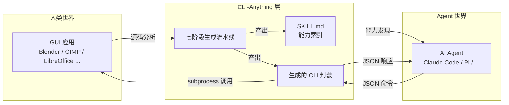

Sources: [README.md:30-80](../../../project-repos/CLI-Anything/README.md#L30-L80)

<details class="source-snippets">
<summary>引用源码</summary>

<!-- source-snippets:start -->

#### `README.md:30-80`

```markdown
</p>

**One Command Line**: Make any software agent-ready for Pi, OpenClaw, nanobot, Cursor, Claude Code, etc.&nbsp;&nbsp;[**中文文档**](README_CN.md) | [**日本語ドキュメント**](README_JA.md)

<p align="center">
  
</p>

<p align="center">
  
</p>

---

## 📰 News

> Thanks to all invaluable efforts from the community! More updates continuously on the way everyday..

- **2026-04-18** 🧩 **All SKILL.md files are now being unified under the top-level `skills/` directory** — every CLI skill can be installed from one canonical source with `npx skills add HKUDS/CLI-Anything --skill <skill-name> -g -y`. We also added root-skill validation CI, synced contribution / PR docs and REPL skill-path hints to the new layout, and refreshed the **CLI-Hub** install-first frontend around the new `npx skills` flow.

- **2026-04-17** 🌐 **CLI-Hub** received another install UX pass — public registry metadata and skill coverage were tightened, visit counting was corrected, and the web hub was further refined. 🧪 **Shotcut** render output duration was fixed (#92). 📝 **SKILL** contribution paths were corrected for the new docs flow (#224), and the skill generator now safely handles empty intros (#203).

- **2026-04-16** 🗺️ **QGIS CLI** merged (#207) — a full GIS / map authoring harness landed. 🧬 **UniMol Tools CLI** merged (#219) for molecular modeling workflows. 🌐 **CLI-Hub** also added more public CLIs, including **py4csr**, refreshed its generated meta-skill, corrected SKILL contribution docs, and fixed `apt-get` package extraction in skill generation (#204).

- **2026-04-16** 📈 **Unreal Insights CLI** expanded — added background capture session control (`capture start/status/snapshot/stop`), engine-root-matched `UnrealInsights.exe` resolution/build flows, and refreshed docs/tests for the new orchestration workflow.

- **2026-04-15** 🌐 **CLI-Hub** updated to **v0.2.0** — the PyPI package now supports public CLIs from multiple install sources (`pip`, `npm`, `brew`, bundled/system tools), backed by a new `public_registry.json`. The Hub frontend was redesigned with separate **CLI-Anything CLIs** and **Public CLIs** decks, and live end-to-end checks now cover real install, update, and uninstall flows across both pip and npm packages.

- **2026-04-14** 🧭 **Safari CLI** merged (#212) and added to the Hub registry — browser automation via `safari-mcp`. 🎬 **Kdenlive** also received compatibility fixes for Gen 5 project output and invalid project generation.

- **2026-04-13** 📓 **Obsidian CLI** merged (#211) — knowledge management harness via the Local REST API, with 48 unit tests and 7 E2E tests. ⛓️ **Eth2-Quickstart CLI** merged (#195) — Ethereum staking node management harness. 📚 **Zotero CLI** updated to v0.4.1 (#201) — now shipped from its standalone repo, and CLI-Hub gained support for remote `skill_md` URLs.

- **2026-04-11** 🔗 **n8n CLI** merged (#188) — workflow automation harness for self-hosted automation flows. 🔧 **Exa CLI** fix (#205) added the `x-exa-integration` header for usage tracking. 📦 **CLI-Hub** also gained its PyPI auto-publish workflow and package refresh pipeline.

- **2026-04-10** 📦 **CLI-Hub package manager** launched — `pip install cli-anything-hub` to browse, search, install, update, and uninstall CLI-Anything harnesses from one command. The web Hub also shipped its first install-focused frontend refresh and "Empower yourself" toolkit card.

<details>
<summary>Earlier news (Apr 1–9)</summary>

- **2026-04-09** 🧹 Cleanup and docs pass (#200) — fixed Openscreen test subtotals, added Openscreen to the Chinese README and project structure, and clarified `/cli-anything` command syntax in the docs.

- **2026-04-08** 🎬 **Openscreen CLI** merged (#183) — screen recording editor harness with 101 tests. ☁️ **CloudAnalyzer CLI** merged (#181) — cloud cost analysis harness with 27 commands. 🌊 **SeaClip / PM2 / ChromaDB** harnesses merged (#129).

- **2026-04-07** 🔄 **Dify Workflow CLI** merged (#191) — workflow automation wrapper. 🔧 **Inkscape** auto-save fix (#193, fixes #182). 🛡️ **DomShell security hardening** (#156) — URL validation and DOM sanitization for the browser CLI. 🥧 **Pi Coding Agent extension** merged (#178).

- **2026-04-06** 🔍 **Exa CLI** merged (#172) — AI-powered web search and answers harness. 🎮 **Godot CLI** merged (#140) — game engine harness with a full demo-game E2E pipeline. ☁️ **CloudAnalyzer** review fixes and frontend improvements also landed.

- **2026-04-03** 🧪 **WireMock CLI** merged (#170) — HTTP mock server harness for API testing. 🥧 **Pi Coding Agent** extension support also landed, and CLI demo recordings were added to the docs.

- **2026-04-01** ⚔️ **Slay the Spire II CLI** merged (#148) — deck-building roguelike harness. 🎥 **VideoCaptioner CLI** merged (#166) — AI-powered video captioning harness. 🛰️ **IntelWatch** was added to the registry for B2B OSINT workflows.

```

<!-- source-snippets:end -->
</details>
---

## 2. 核心理念：为什么选择 CLI？

CLI（命令行接口）是 Agent 与软件协作的天然契约层。CLI-Anything 选择 CLI 作为适配层有五个关键原因：

| 特性 | 说明 |
|------|------|
| **结构化** | 子命令 + 具名参数构成清晰的调用契约，消除歧义 |
| **可组合** | Unix 管道哲学：小命令串联完成复杂任务 |
| **自描述** | `--help` 输出即文档，Agent 可动态查询能力边界 |
| **确定性** | 相同输入产生相同输出，便于测试与回归验证 |
| **Agent-first JSON 输出** | 所有子命令返回结构化 JSON，Agent 无需解析自然语言 |

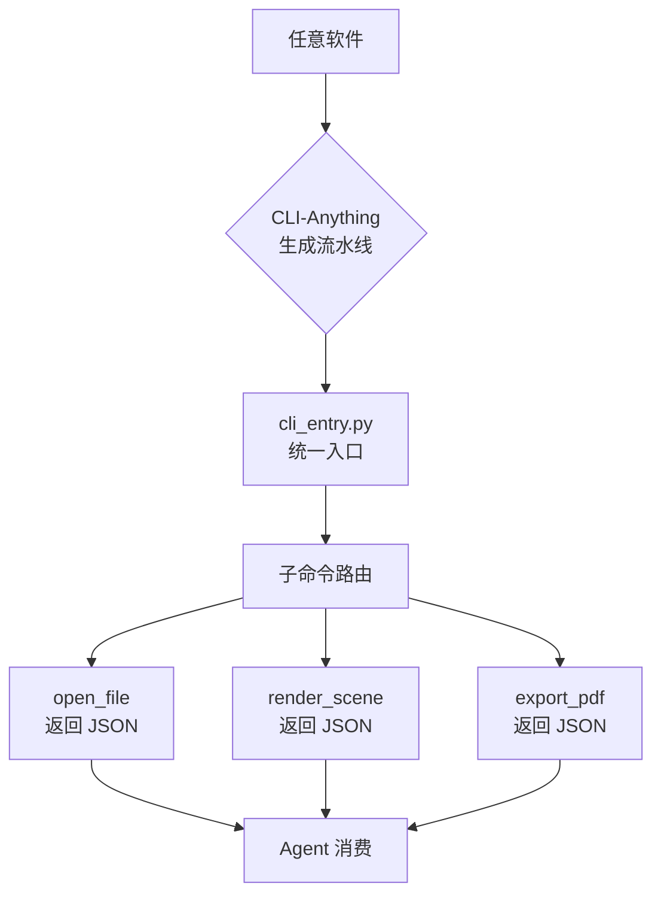

Sources: [README.md:85-130](../../../project-repos/CLI-Anything/README.md#L85-L130)  [README_CN.md:40-90](../../../project-repos/CLI-Anything/README_CN.md#L40-L90)

<details class="source-snippets">
<summary>引用源码</summary>

<!-- source-snippets:start -->

#### `README.md:85-130`

```markdown

- **2026-03-30** 🏗️ **CLI-Anything v0.2.0** — HARNESS.md progressive disclosure redesign. Detailed guides extracted into `guides/` for on-demand loading. Phases 1–7 now contiguous. Key Principles and Rules merged into a single authoritative section.

- **2026-03-29** 📐 Blender skill docs updated — enforce absolute render paths and correct prerequisites.

- **2026-03-28** 🌐 **CLIBrowser** added to CLI-Hub registry for agent-accessible browser automation.

- **2026-03-27** 📚 Zotero SKILL.md enhanced with agent-facing constraints; REPL config and executable resolution fixes.

- **2026-03-26** 📖 **Zotero CLI** harness landed for Zotero desktop (library management, collections, citations). Draw.io custom ID bugfix (#132) and registry.json syntax fix.

- **2026-03-25** 🎮 **RenderDoc CLI** merged for GPU frame capture analysis. FreeCAD updated for v1.1. Blender EEVEE engine name corrected. Zoom token permissions hardened.

- **2026-03-24** 🏭 **FreeCAD CLI** added with 258 commands across 17 groups. **iTerm2** and **Teltonika RMS** harnesses added to registry.

- **2026-03-23** 🤖 Launched **CLI-Hub meta-skill** — agents can now discover and install CLIs autonomously. **Krita CLI** harness merged for digital painting.

</details>

<details>
<summary>Earlier news (Mar 11–22)</summary>

- **2026-03-22** 🎵 **MuseScore CLI** merged with transpose, export, and instrument management.

- **2026-03-21** 🔧 Infrastructure improvements — refined test harnesses and documentation across multiple CLIs. Enhanced Windows compatibility for several backends.

- **2026-03-20** 🌐 **Novita AI** CLI added for OpenAI-compatible API access. Registry metadata improvements for better hub discovery.

- **2026-03-19** 📦 Package structure refinements across harnesses. Improved SKILL.md generation with better command documentation.

- **2026-03-18** 🧪 Test coverage expansion — additional E2E scenarios and edge case validation across multiple CLIs.

- **2026-03-17** 🌐 Launched the **[CLI-Hub](https://hkuds.github.io/CLI-Anything/)** — a central registry where you can browse, search, and install any CLI with a single `pip` command.

- **2026-03-16** 🤖 Added **SKILL.md generation** (Phase 6.5) — every generated CLI now ships with an AI-discoverable skill definition.

- **2026-03-15** 🐾 Support for **OpenClaw** from the community! Merged Windows `cygpath` guard for cross-platform support.

- **2026-03-14** 🔒 Fixed a GIMP Script-Fu path injection vulnerability and added **Japanese README** translation.

- **2026-03-13** 🔌 **Qodercli** plugin officially merged as a community contribution with dedicated setup scripts.

- **2026-03-12** 📦 **Codex skill** integration landed, bringing CLI-Anything to yet another AI coding platform.

- **2026-03-11** 📞 **Zoom** video conferencing harness added as the 11th supported application.

```

#### `README_CN.md:40-90`

````markdown

CLI 是人类和 AI Agent 共通的万能接口：

• **结构化、可组合** - 文本命令天然匹配 LLM 的输入格式，可自由串联成复杂工作流

• **轻量且通用** - 几乎零开销，跨平台运行，不依赖额外环境

• **自描述** - 一个 `--help` 就能让 Agent 自动发现所有功能

• **久经验证** - Claude Code 每天通过 CLI 执行数以千计的真实任务

• **Agent 友好** - 结构化 JSON 输出，Agent 无需任何额外解析

• **确定且可靠** - 输出稳定一致，Agent 行为可预测

## 🚀 快速上手

### 环境要求

- **Python 3.10+**
- 目标软件已安装（如 GIMP、Blender、LibreOffice 或你自己的应用）
- 支持的 AI 编程工具之一：[Claude Code](#-claude-code) | [OpenClaw](#-openclaw) | [OpenCode](#-opencode) | [Codex](#-codex) | [Qodercli](#-qodercli) | [GitHub Copilot CLI](#-github-copilot-cli) | [更多平台](#-更多平台即将支持)

### 选择你的平台

<details open>
<summary><h4 id="-claude-code">⚡ Claude Code</h4></summary>

**第一步：添加插件市场**

CLI-Anything 以 Claude Code 插件市场的形式托管在 GitHub 上。

```bash
# 添加 CLI-Anything 插件市场
/plugin marketplace add HKUDS/CLI-Anything
```

**第二步：安装插件**

```bash
# 从市场安装 cli-anything 插件
/plugin install cli-anything
```

搞定。插件已经在你的 Claude Code 会话中可用了。

**Windows 注意：** Claude Code 通过 `bash` 执行命令。Windows 下请安装 Git for Windows（包含 `bash` 和 `cygpath`）
或使用 WSL，否则可能出现 `cygpath: command not found`。

**第三步：一行命令生成 CLI**

````

<!-- source-snippets:end -->
</details>
---

## 3. 支持的软件目录

截至 commit `26bd973`，CLI-Hub 注册表（`registry.json`）收录 **50+ 款软件**的 CLI 封装，覆盖创意、视频、办公、开发、AI、图表、网络、科学八大类别。

Sources: [registry.json](../../../project-repos/CLI-Anything/registry.json)

<details class="source-snippets">
<summary>引用源码</summary>

<!-- source-snippets:start -->

#### `registry.json`

```json
{
  "meta": {
    "repo": "https://github.com/HKUDS/CLI-Anything",
    "description": "CLI-Hub — Agent-native stateful CLI interfaces for softwares, codebases, and Web Services",
    "updated": "2026-04-16"
  },
  "clis": [
    {
      "name": "wiremock",
      "display_name": "WireMock",
      "version": "0.1.0",
      "description": "HTTP mock server management — create stubs, inspect requests, record traffic, and manage scenarios via WireMock REST API",
      "requires": "WireMock server running (java -jar wiremock-standalone.jar)",
      "homepage": "https://wiremock.org",
      "source_url": null,
      "install_cmd": "pip install git+https://github.com/HKUDS/CLI-Anything.git#subdirectory=wiremock/agent-harness",
      "entry_point": "cli-anything-wiremock",
      "skill_md": "skills/cli-anything-wiremock/SKILL.md",
      "category": "testing",
      "contributors": [
        {
          "name": "fabiomantel",
          "url": "https://github.com/fabiomantel"
        }
      ]
    },
    {
      "name": "anygen",
      "display_name": "AnyGen",
      "version": "1.0.0",
      "description": "Generate docs, slides, websites and more via AnyGen cloud API",
      "requires": "ANYGEN_API_KEY",
      "homepage": "https://anygen.com",
      "source_url": null,
      "install_cmd": "pip install git+https://github.com/HKUDS/CLI-Anything.git#subdirectory=anygen/agent-harness",
      "entry_point": "cli-anything-anygen",
      "skill_md": "skills/cli-anything-anygen/SKILL.md",
      "category": "generation",
      "contributors": [
        {
          "name": "koltyu-anygen",
          "url": "https://github.com/koltyu-anygen"
        }
      ]
    },
    {
      "name": "adguardhome",
      "display_name": "AdGuardHome",
      "version": "1.0.0",
      "description": "DNS ad-blocking and network infrastructure management via AdGuardHome REST API",
      "requires": "AdGuardHome instance running",
      "homepage": "https://adguard.com/adguard-home/overview.html",
      "source_url": null,
      "install_cmd": "pip install git+https://github.com/HKUDS/CLI-Anything.git#subdirectory=adguardhome/agent-harness",
      "entry_point": "cli-anything-adguardhome",
      "skill_md": null,
      "category": "network",
      "contributors": [
        {
          "name": "pyxl-dev",
          "url": "https://github.com/pyxl-dev"
        }
      ]
    },
    {
      "name": "audacity",
      "display_name": "Audacity",
      "version": "1.0.0",
      "description": "Audio editing and processing via sox",
      "requires": "sox (apt install sox)",
      "homepage": "https://www.audacityteam.org",
      "source_url": null,
      "install_cmd": "pip install git+https://github.com/HKUDS/CLI-Anything.git#subdirectory=audacity/agent-harness",
      "entry_point": "cli-anything-audacity",
      "skill_md": "skills/cli-anything-audacity/SKILL.md",
      "category": "audio",
      "contributors": [
        {
          "name": "CLI-Anything-Team",
          "url": "https://github.com/HKUDS/CLI-Anything"
        }
      ]
    },
    {
      "name": "blender",
      "display_name": "Blender",
      "version": "1.0.0",
      "description": "3D modeling, animation, and rendering via blender --background --python",
      "requires": "blender >= 4.2",
      "homepage": "https://www.blender.org",
      "source_url": null,
      "install_cmd": "pip install git+https://github.com/HKUDS/CLI-Anything.git#subdirectory=blender/agent-harness",
      "entry_point": "cli-anything-blender",
      "skill_md": "skills/cli-anything-blender/SKILL.md",
      "category": "3d",
      "contributors": [
        {
          "name": "CLI-Anything-Team",
          "url": "https://github.com/HKUDS/CLI-Anything"
        }
      ]
    },
    {
      "name": "browser",
      "display_name": "Browser",
      "version": "1.0.0",
      "description": "Browser automation via DOMShell MCP server. Maps Chrome's Accessibility Tree to a virtual filesystem for agent-native navigation.",
      "requires": "Node.js, npx, Chrome + DOMShell extension",
      "homepage": "https://github.com/apireno/DOMShell",
      "source_url": null,
      "install_cmd": "pip install git+https://github.com/HKUDS/CLI-Anything.git#subdirectory=browser/agent-harness",
      "entry_point": "cli-anything-browser",
      "skill_md": "skills/cli-anything-browser/SKILL.md",
      "category": "web",
      "contributors": [
        {
          "name": "furkankoykiran",
          "url": "https://github.com/furkankoykiran"
        }
      ]
```

<!-- source-snippets:end -->
</details>
### 创意工具

| 软件 | 类别 | 典型能力 |
|------|------|---------|
| GIMP | 图像编辑 | 批量处理、滤镜、格式转换 |
| Blender | 3D 建模/渲染 | 场景渲染、几何操作、动画导出 |
| Inkscape | 矢量图形 | SVG 编辑、路径操作、批量导出 |
| Krita | 数字绘画 | 图层管理、笔刷操作、色彩模式转换 |
| Darktable | RAW 后期 | 色调映射、降噪、导出流水线 |
| RawTherapee | RAW 转换 | 批量 RAW 处理、色彩科学 |

### 视频与直播

| 软件 | 类别 | 典型能力 |
|------|------|---------|
| Kdenlive | 视频剪辑 | 时间线操作、转场、字幕 |
| Shotcut | 视频编辑 | 滤镜叠加、多轨混合 |
| OBS Studio | 直播/录屏 | 场景切换、源管理、录制控制 |
| HandBrake | 视频转码 | 格式转换、字幕嵌入 |
| FFmpeg | 媒体处理 | 转码、裁剪、流操作 |

### 音频

| 软件 | 类别 | 典型能力 |
|------|------|---------|
| Audacity | 音频编辑 | 降噪、裁剪、效果链 |
| MuseScore | 乐谱编辑 | 乐谱生成、MIDI 导出、PDF 渲染 |

### 办公套件

| 软件 | 类别 | 典型能力 |
|------|------|---------|
| LibreOffice | 全套办公 | 文档生成、格式转换、宏执行 |

### 开发工具

| 软件 | 类别 | 典型能力 |
|------|------|---------|
| LLDB | 调试器 | 断点管理、堆栈追踪、内存检查 |
| Godot | 游戏引擎 | 场景导入、脚本执行、构建打包 |
| s&box | 游戏开发平台 | 资产管理、服务器控制 |

### AI 与机器学习

| 软件 | 类别 | 典型能力 |
|------|------|---------|
| ComfyUI | AI 图像生成 | 工作流执行、模型切换、批量推理 |
| Ollama | 本地 LLM 运行时 | 模型拉取、推理调用、上下文管理 |
| Exa | AI 搜索引擎 | 语义搜索、文档检索 |

### 图表与可视化

| 软件 | 类别 | 典型能力 |
|------|------|---------|
| Draw.io | 流程图编辑 | 图形导入导出、布局计算 |
| Mermaid | 文本图表 | 图表渲染、格式转换 |

### 网络与基础设施

| 软件 | 类别 | 典型能力 |
|------|------|---------|
| AdGuardHome | DNS 过滤 | 规则管理、统计查询 |
| WireMock | API Mock | 桩配置、请求匹配、响应模板 |

### 科学与工程

| 软件 | 类别 | 典型能力 |
|------|------|---------|
| FreeCAD | CAD 建模 | 参数化建模、工程图导出 |
| QGIS | 地理信息系统 | 图层操作、坐标变换、地图导出 |
| UniMol | 分子建模 | 分子结构预测、性质计算 |

---

## 4. 项目规模

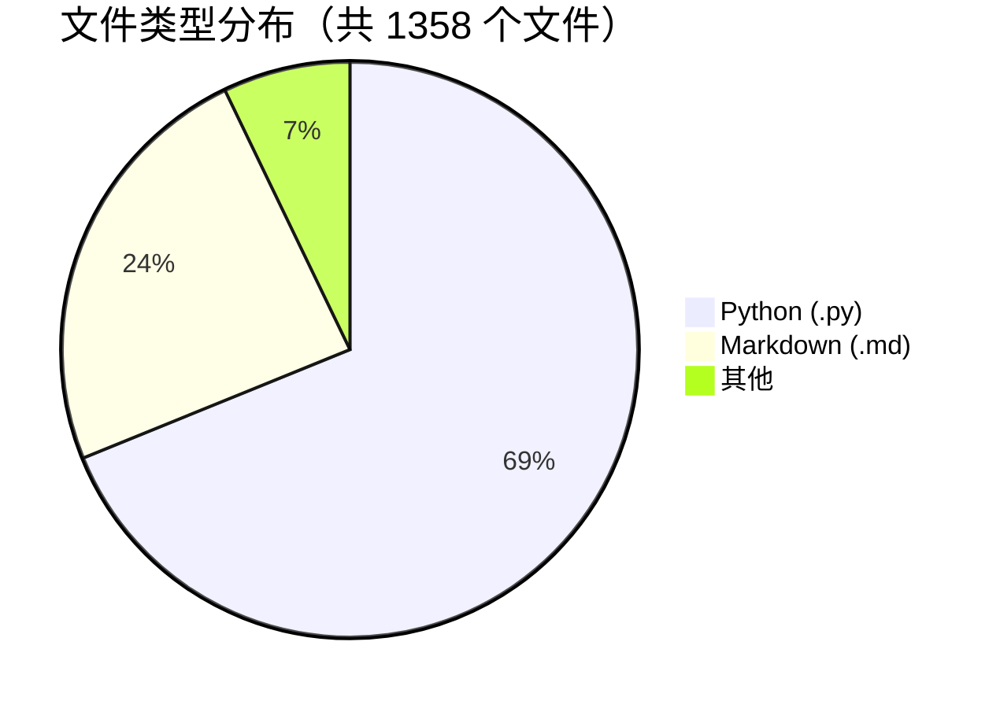

| 指标 | 数值 |
|------|------|
| 总文件数 | 1,358 |
| Python 源文件 | 935 |
| Markdown 文档 | 326 |
| 已注册 CLI 封装（SKILL） | 50+ |
| 测试用例（全部通过） | 2,280 |
| 支持的 Agent 平台 | Claude Code、Pi 等多平台 |
| 发布的 PyPI 包 | `cli-anything-hub` |

Sources: [README.md:150-180](../../../project-repos/CLI-Anything/README.md#L150-L180)  [CONTRIBUTING.md:1-30](../../../project-repos/CLI-Anything/CONTRIBUTING.md#L1-L30)

<details class="source-snippets">
<summary>引用源码</summary>

<!-- source-snippets:start -->

#### `README.md:150-180`

````markdown

## 🚀 Quick Start

### Prerequisites

- **Python 3.10+**
- Target software installed (e.g., GIMP, Blender, LibreOffice, or your own application)
- A supported AI coding agent: [Claude Code](#-claude-code) | [Pi](#-pi-coding-agent) | [OpenClaw](#-openclaw) | [OpenCode](#-opencode) | [Codex](#-codex) | [Qodercli](#-qodercli) | [GitHub Copilot CLI](#-github-copilot-cli) | [More Platforms](#-more-platforms-coming-soon)

### Pick Your Platform

<details open>
<summary><h4 id="-claude-code">⚡ Claude Code</h4></summary>

**Step 1: Add the Marketplace**

CLI-Anything is distributed as a Claude Code plugin marketplace hosted on GitHub.

```bash
# Add the CLI-Anything marketplace
/plugin marketplace add HKUDS/CLI-Anything
```

**Step 2: Install the Plugin**

```bash
# Install the cli-anything plugin from the marketplace
/plugin install cli-anything
```

That's it. The plugin is now available in your Claude Code session.
````

#### `CONTRIBUTING.md:1-30`

```markdown
# Contributing to CLI-Anything

Thank you for your interest in contributing to CLI-Anything! This guide will help you get started.

## Types of Contributions

We welcome three main categories of contributions:

### A) CLIs for New Software

Adding a new CLI harness is the most impactful contribution. You can either add the harness **inside this monorepo** or host it in your own **standalone repository** — both are first-class citizens on the CLI-Hub.

#### Option 1: In-repo harness

Place your code under `<software>/agent-harness/` and ensure the following:

1. **`<SOFTWARE>.md`** — the SOP document exists at `<software>/agent-harness/<SOFTWARE>.md` describing the harness architecture.
2. **`SKILL.md`** — the canonical AI-discoverable skill definition exists at `skills/cli-anything-<software>/SKILL.md`, and the packaged compatibility copy exists at `cli_anything/<software>/skills/SKILL.md`.
3. **Tests** — unit tests (`test_core.py`, passable without backend) and E2E tests (`test_full_e2e.py`) are present and passing.
4. **`README.md`** — the project README includes the new software with a link to its harness directory.
5. **`registry.json`** — add an entry for the new software (see [Registry fields](#registry-fields) below).
6. **`repl_skin.py`** — an unmodified copy from the plugin exists in `utils/`.

#### Option 2: Standalone repository (external)

Host your CLI in your own repo and submit a **registry-only PR** to this repo. Your PR only needs to add an entry to `registry.json` — no code in this monorepo is required. This is ideal if you want full control over releases, CI, and versioning.

Requirements for standalone CLIs:

1. **Published package** — your CLI must be installable via `pip install <package-name>` (PyPI) or a `pip install git+https://...` URL.
```

<!-- source-snippets:end -->
</details>
### CLI-Hub 包管理器

CLI-Anything 提供配套的包管理工具，一行命令安装任意软件的 CLI 封装：

```bash
pip install cli-anything-hub

# 安装 Blender 封装
cli-hub install blender

# 列出所有可用封装
cli-hub list

# 在 Agent 会话中加载 SKILL.md
cli-hub skill blender
```

### SKILL.md 能力发现系统

每个 CLI 封装都附带一份 `SKILL.md`，这是专为 Agent 设计的机器可读能力索引：

```markdown
# SKILL: blender
## Commands
- render_scene  : 渲染指定场景到图片
- import_obj    : 导入 OBJ 格式模型
- export_glb    : 导出 GLB 格式文件
## Input: JSON  Output: JSON
```

Agent 只需在上下文中注入对应软件的 `SKILL.md`，即可获得完整的调用知识，无需预训练。

Sources: [README.md:200-250](../../../project-repos/CLI-Anything/README.md#L200-L250)  [README_CN.md:100-150](../../../project-repos/CLI-Anything/README_CN.md#L100-L150)

<details class="source-snippets">
<summary>引用源码</summary>

<!-- source-snippets:start -->

#### `README.md:200-250`

````markdown
2. Verify the plugin is loaded: `/help cli-anything` (CLI-Anything help/commands should appear)
3. Reinstall from marketplace if needed:
   - `/plugin marketplace add HKUDS/CLI-Anything`
   - `/plugin install cli-anything`
4. After confirming the plugin is available, retry the entry command:
   - Preferred: `/cli-anything ./gimp`
   - Older builds only: `/cli-anything:cli-anything ./gimp`

This runs the full pipeline:
1. 🔍 **Analyze** — Scans source code, maps GUI actions to APIs
2. 📐 **Design** — Architects command groups, state model, output formats
3. 🔨 **Implement** — Builds Click CLI with REPL, JSON output, undo/redo
4. 📋 **Plan Tests** — Creates TEST.md with unit + E2E test plans
5. 🧪 **Write Tests** — Implements comprehensive test suite
6. 📝 **Document** — Updates TEST.md with results
7. 📦 **Publish** — Creates `setup.py`, installs to PATH

**Step 4 (Optional): Refine and Improve the CLI**

After the initial build, you can iteratively refine the CLI to expand coverage and add missing capabilities:

```bash
# Broad refinement — agent analyzes gaps across all capabilities
/cli-anything:refine ./gimp

# Focused refinement — target a specific functionality area
/cli-anything:refine ./gimp "I want more CLIs on image batch processing and filters"
```

The refine command performs gap analysis between the software's full capabilities and current CLI coverage, then implements new commands, tests, and documentation for the identified gaps. You can run it multiple times to steadily expand coverage — each run is incremental and non-destructive.

<details>
<summary><strong>Alternative: Manual Installation</strong></summary>

If you prefer not to use the marketplace:

```bash
# Clone the repo
git clone https://github.com/HKUDS/CLI-Anything.git

# Copy plugin to Claude Code plugins directory
cp -r CLI-Anything/cli-anything-plugin ~/.claude/plugins/cli-anything

# Reload plugins
/reload-plugins
```

</details>

</details>

````

#### `README_CN.md:100-150`

````markdown
Claude Code 不同版本的命令兼容说明：
- 优先使用 `/cli-anything` 作为主入口。
- 在已**确认插件已安装并加载**的情况下，若旧版本的 Claude Code 不识别 `/cli-anything`，可尝试兼容写法 `/cli-anything:cli-anything`。
- 其他辅助命令保持 `:子命令` 形式（例如 `/cli-anything:refine`）。

如果出现 `Unknown skill: cli-anything`，两种写法都引用同一个 skill 名称，切换写法无法解决，请优先排查插件是否已安装/加载：
1. 重新加载插件命令：`/reload-plugins`
2. 验证插件是否已加载：`/help cli-anything`（能看到 CLI-Anything 帮助即表示已加载）
3. 如仍未识别，重新从市场安装：
   - `/plugin marketplace add HKUDS/CLI-Anything`
   - `/plugin install cli-anything`
4. 确认插件可用后，再重试入口命令：
   - 推荐：`/cli-anything ./gimp`
   - 仅旧版本：`/cli-anything:cli-anything ./gimp`

完整流水线自动执行：
1. 🔍 **分析** — 扫描源码，将 GUI 操作映射到 API
2. 📐 **设计** — 规划命令分组、状态模型、输出格式
3. 🔨 **实现** — 构建 Click CLI，包含 REPL、JSON 输出、撤销/重做
4. 📋 **规划测试** — 生成 TEST.md，涵盖单元测试和端到端测试计划
5. 🧪 **编写测试** — 实现完整测试套件
6. 📝 **文档** — 更新 TEST.md，写入测试结果
7. 📦 **发布** — 生成 `setup.py`，安装到 PATH

**第四步（可选）：优化和扩展 CLI**

初始构建完成后，你可以迭代优化 CLI，扩展覆盖面并补充缺失的功能：

```bash
# 全面优化 — Agent 分析所有功能的覆盖差距
/cli-anything:refine ./gimp

# 定向优化 — 指定特定功能领域
/cli-anything:refine ./gimp "我需要更多图像批处理和滤镜相关的 CLI"
```

优化命令会对软件的完整功能与当前 CLI 覆盖范围进行差距分析，然后为识别到的差距实现新命令、测试和文档。你可以多次运行该命令，逐步扩大功能覆盖范围 — 每次运行都是增量的、非破坏性的。

<details>
<summary><strong>备选方案：手动安装</strong></summary>

如果你不想用插件市场：

```bash
# 克隆仓库
git clone https://github.com/HKUDS/CLI-Anything.git

# 复制插件到 Claude Code 插件目录
cp -r CLI-Anything/cli-anything-plugin ~/.claude/plugins/cli-anything

# 重新加载插件
````

<!-- source-snippets:end -->
</details>
---

## 5. 阅读路线

以下是推荐给新维护者的阅读顺序：

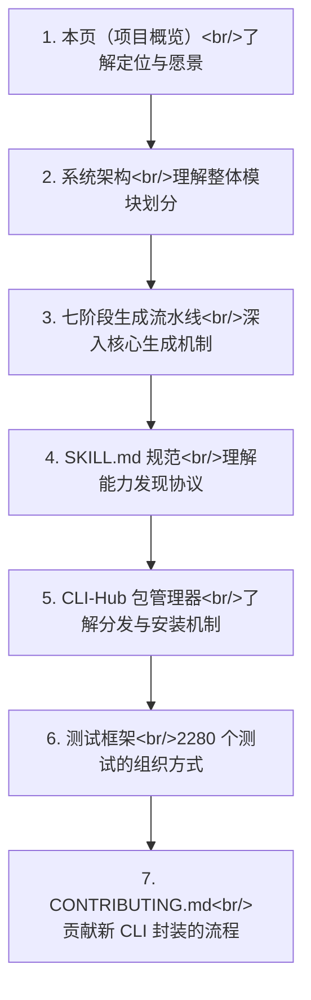

| 阶段 | 文档 | 目标 |
|------|------|------|
| 第 1 步 | 本页 | 建立全局认知，理解"为什么是 CLI" |
| 第 2 步 | [系统架构](system-architecture.md) | 掌握模块间依赖关系与数据流 |
| 第 3 步 | [七阶段生成流水线](seven-phase-pipeline.md) | 理解从源码到 CLI 的自动化过程 |
| 第 4 步 | SKILL.md 规范 | 学习如何为 Agent 编写能力索引 |
| 第 5 步 | CLI-Hub 使用指南 | 掌握封装的发布与安装流程 |
| 第 6 步 | 测试框架 | 了解如何为新封装编写测试 |
| 第 7 步 | [CONTRIBUTING.md](../../../project-repos/CLI-Anything/CONTRIBUTING.md) | 提交 PR 的完整规范 |

Sources: [CONTRIBUTING.md](../../../project-repos/CLI-Anything/CONTRIBUTING.md)  [README.md:260-300](../../../project-repos/CLI-Anything/README.md#L260-L300)

<details class="source-snippets">
<summary>引用源码</summary>

<!-- source-snippets:start -->

#### `CONTRIBUTING.md`

````markdown
# Contributing to CLI-Anything

Thank you for your interest in contributing to CLI-Anything! This guide will help you get started.

## Types of Contributions

We welcome three main categories of contributions:

### A) CLIs for New Software

Adding a new CLI harness is the most impactful contribution. You can either add the harness **inside this monorepo** or host it in your own **standalone repository** — both are first-class citizens on the CLI-Hub.

#### Option 1: In-repo harness

Place your code under `<software>/agent-harness/` and ensure the following:

1. **`<SOFTWARE>.md`** — the SOP document exists at `<software>/agent-harness/<SOFTWARE>.md` describing the harness architecture.
2. **`SKILL.md`** — the canonical AI-discoverable skill definition exists at `skills/cli-anything-<software>/SKILL.md`, and the packaged compatibility copy exists at `cli_anything/<software>/skills/SKILL.md`.
3. **Tests** — unit tests (`test_core.py`, passable without backend) and E2E tests (`test_full_e2e.py`) are present and passing.
4. **`README.md`** — the project README includes the new software with a link to its harness directory.
5. **`registry.json`** — add an entry for the new software (see [Registry fields](#registry-fields) below).
6. **`repl_skin.py`** — an unmodified copy from the plugin exists in `utils/`.

#### Option 2: Standalone repository (external)

Host your CLI in your own repo and submit a **registry-only PR** to this repo. Your PR only needs to add an entry to `registry.json` — no code in this monorepo is required. This is ideal if you want full control over releases, CI, and versioning.

Requirements for standalone CLIs:

1. **Published package** — your CLI must be installable via `pip install <package-name>` (PyPI) or a `pip install git+https://...` URL.
2. **`SKILL.md`** — an AI-discoverable skill definition exists somewhere in your repo.
3. **Tests** — your repo should have its own test suite.
4. **`registry.json`** — add an entry with `source_url` pointing to your repo and `skill_md` pointing to the raw URL of your SKILL.md (see [Registry fields](#registry-fields) below).

### B) New Features

Feature contributions improve existing harnesses or the plugin framework. Examples include new CLI commands, output formats, backend improvements, or cross-platform fixes.

- Open an issue first to discuss the feature before starting work.
- Follow existing code patterns and conventions in the target harness.
- Include tests for any new functionality.

### C) Bug Fixes

Bug fixes resolve incorrect behavior in existing harnesses or the plugin.

- Reference the related issue in your PR (e.g., `Fixes #123`).
- Include a test that reproduces the bug and verifies the fix.
- Ensure all existing tests for the affected harness still pass.

## CLI-Hub & Registry

All available CLIs are listed in `registry.json` at the repo root and displayed on the [CLI-Hub](https://hkuds.github.io/CLI-Anything/hub/). The hub reads `registry.json` directly from `main`, so it updates immediately when a PR is merged.

### Registry fields

Include an entry in `registry.json` as part of your PR. Each field is described below:

| Field | Required | Description |
|-------|----------|-------------|
| `name` | Yes | Lowercase identifier (e.g. `"my-software"`). Must be unique. |
| `display_name` | Yes | Human-readable name shown on the hub (e.g. `"My Software"`). |
| `version` | Yes | Semantic version string (e.g. `"1.0.0"`). |
| `description` | Yes | One-line description of what the CLI does. |
| `requires` | Yes | Runtime dependencies the user needs (e.g. `"Docker"`) or `null`. |
| `homepage` | Yes | Official homepage of the **target software** (not your repo). |
| `source_url` | Yes | For standalone repos: URL to your repo (e.g. `"https://github.com/user/repo"`). For in-repo harnesses: `null` (the hub auto-links to `<name>/agent-harness/`). |
| `install_cmd` | Yes | Full pip install command. PyPI: `"pip install cli-anything-my-software"`. In-repo: `"pip install git+https://github.com/HKUDS/CLI-Anything.git#subdirectory=my-software/agent-harness"`. |
| `entry_point` | Yes | CLI command name (e.g. `"cli-anything-my-software"`). |
| `skill_md` | Yes | Path to canonical SKILL.md. For standalone repos: full URL (e.g. `"https://github.com/user/repo/blob/main/.../SKILL.md"`). For in-repo: relative path under the repo-root `skills/` tree (e.g. `"skills/cli-anything-my-software/SKILL.md"`). Set to `null` if not yet available. |
| `category` | Yes | One of the existing categories (check `registry.json` for examples). |
| `contributors` | Yes | Array of `{"name": "...", "url": "..."}` objects listing all contributors. |

**In-repo example:**

```json
{
  "name": "my-software",
  "display_name": "My Software",
  "version": "1.0.0",
  "description": "Short description of what the CLI does",
  "requires": "backend software or null",
  "homepage": "https://my-software.org",
  "source_url": null,
  "install_cmd": "pip install git+https://github.com/HKUDS/CLI-Anything.git#subdirectory=my-software/agent-harness",
  "entry_point": "cli-anything-my-software",
  "skill_md": "skills/cli-anything-my-software/SKILL.md",
  "category": "category-name",
  "contributors": [
    {"name": "your-github-username", "url": "https://github.com/your-github-username"}
  ]
}
```

**Standalone repo example (multiple contributors):**

```json
{
  "name": "my-software",
  "display_name": "My Software",
  "version": "2.0.0",
  "description": "Short description of what the CLI does",
  "requires": "backend software or null",
  "homepage": "https://my-software.org",
  "source_url": "https://github.com/your-username/cli-anything-my-software",
  "install_cmd": "pip install cli-anything-my-software",
  "entry_point": "cli-anything-my-software",
  "skill_md": "https://github.com/your-username/cli-anything-my-software/blob/main/cli_anything/my_software/skills/SKILL.md",
  "category": "category-name",
  "contributors": [
    {"name": "original-author", "url": "https://github.com/original-author"},
    {"name": "current-maintainer", "url": "https://github.com/current-maintainer"}
  ]
}
```

### Updating an existing CLI on the Hub

When you modify an existing harness, update its `registry.json` entry in the same PR:

````

#### `README.md:260-300`

````markdown
git clone https://github.com/HKUDS/CLI-Anything.git
cd CLI-Anything

# Install globally into Pi's extensions directory
bash .pi-extension/cli-anything/install.sh
```

To uninstall:

```bash
bash .pi-extension/cli-anything/install.sh --uninstall
```

> **How it works:** `install.sh` copies the extension files (including HARNESS.md, commands, guides, scripts, and templates from `cli-anything-plugin/`) into `~/.pi/agent/extensions/cli-anything/`, which Pi auto-discovers on startup. Run `/reload` in Pi or restart Pi to activate.

**Step 2: Build a CLI in One Command**

Once the extension is loaded, the following commands are available:

```bash
# Generate a complete CLI for GIMP (all 7 phases)
/cli-anything ./gimp

# Build from a GitHub repo
/cli-anything https://github.com/blender/blender
```

**Step 3 (Optional): Refine and Improve the CLI**

```bash
# Broad refinement — agent analyzes gaps across all capabilities
/cli-anything:refine ./gimp

# Focused refinement — target a specific functionality area
/cli-anything:refine ./gimp "batch processing and filters"
```

**Available Commands**

| Command | Description |
|---------|-------------|
````

<!-- source-snippets:end -->
</details>
---

## 相关页面

- [系统架构](system-architecture.md)
- [七阶段生成流水线](seven-phase-pipeline.md)

---

<details>
<summary>相关源文件</summary>

生成本页时使用的主要源文件：

- [cli-anything-plugin/HARNESS.md](../../../project-repos/CLI-Anything/cli-anything-plugin/HARNESS.md)
- [cli-hub/cli_hub/cli.py](../../../project-repos/CLI-Anything/cli-hub/cli_hub/cli.py)
- [cli-hub/cli_hub/registry.py](../../../project-repos/CLI-Anything/cli-hub/cli_hub/registry.py)
- [cli-hub/cli_hub/installer.py](../../../project-repos/CLI-Anything/cli-hub/cli_hub/installer.py)
- [cli-anything-plugin/repl_skin.py](../../../project-repos/CLI-Anything/cli-anything-plugin/repl_skin.py)
- [registry.json](../../../project-repos/CLI-Anything/registry.json)

</details>

# 系统架构

## 整体分层

CLI-Anything 的架构分为六个垂直层次，从底向上依次是：注册表层、生成的 Harness 层、方法论层、Agent 平台层、技能层和 CLI-Hub 包管理层。每一层的职责边界清晰，层间通过文件系统路径、JSON 注册表和 GitHub Pages API 解耦。

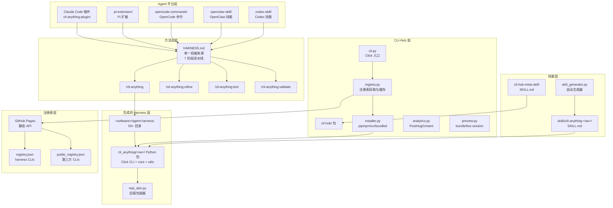

Sources: [cli-anything-plugin/HARNESS.md](../../../project-repos/CLI-Anything/cli-anything-plugin/HARNESS.md), [cli-hub/cli_hub/cli.py](../../../project-repos/CLI-Anything/cli-hub/cli_hub/cli.py), [registry.json](../../../project-repos/CLI-Anything/registry.json)

<details class="source-snippets">
<summary>引用源码</summary>

<!-- source-snippets:start -->

#### `cli-anything-plugin/HARNESS.md`

````markdown
# Agent Harness: GUI-to-CLI for Open Source Software

## Purpose

This harness provides a standard operating procedure (SOP) and toolkit for coding
agents (Claude Code, Codex, etc.) to build powerful, stateful CLI interfaces for
open-source GUI applications. The goal: let AI agents operate software that was
designed for humans, without needing a display or mouse.

## General SOP: Turning Any GUI App into an Agent-Usable CLI

### Phase 1: Codebase Analysis

1. **Identify the backend engine** — Most GUI apps separate presentation from logic.
   Find the core library/framework (e.g., MLT for Shotcut, ImageMagick for GIMP).
2. **Map GUI actions to API calls** — Every button click, drag, and menu item
   corresponds to a function call. Catalog these mappings.
3. **Identify the data model** — What file formats does it use? How is project state
   represented? (XML, JSON, binary, database?)
4. **Find existing CLI tools** — Many backends ship their own CLI (`melt`, `ffmpeg`,
   `convert`). These are building blocks.
5. **Catalog the command/undo system** — If the app has undo/redo, it likely uses a
   command pattern. These commands are your CLI operations.

### Phase 2: CLI Architecture Design

1. **Choose the interaction model**:
   - **Stateful REPL** for interactive sessions (agents that maintain context)
   - **Subcommand CLI** for one-shot operations (scripting, pipelines)
   - **Both** (recommended) — a CLI that works in both modes

2. **Define command groups** matching the app's logical domains:
   - Project management (new, open, save, close)
   - Core operations (the app's primary purpose)
   - Import/Export (file I/O, format conversion)
   - Configuration (settings, preferences, profiles)
   - Session/State management (undo, redo, history, status)

3. **Design the state model**:
   - What must persist between commands? (open project, cursor position, selection)
   - Where is state stored? (in-memory for REPL, file-based for CLI)
   - How does state serialize? (JSON session files)

4. **Plan the output format**:
   - Human-readable (tables, colors) for interactive use
   - Machine-readable (JSON) for agent consumption
   - Both, controlled by `--json` flag

### Phase 3: Implementation

1. **Start with the data layer** — XML/JSON manipulation of project files
2. **Add probe/info commands** — Let agents inspect before they modify
3. **Add mutation commands** — One command per logical operation
4. **Add the backend integration** — A `utils/<software>_backend.py` module that
   wraps the real software's CLI. This module handles:
   - Finding the software executable (`shutil.which()`)
   - Invoking it with proper arguments (`subprocess.run()`)
   - Error handling with clear install instructions if not found
   - Example (LibreOffice):
     ```python
     # utils/lo_backend.py
     def convert_odf_to(odf_path, output_format, output_path=None, overwrite=False):
         lo = find_libreoffice()  # raises RuntimeError with install instructions
         subprocess.run([lo, "--headless", "--convert-to", output_format, ...])
         return {"output": final_path, "format": output_format, "method": "libreoffice-headless"}
     ```
5. **Add rendering/export** — The export pipeline calls the backend module.
   Generate valid intermediate files, then invoke the real software for conversion.
6. **Add session management** — State persistence, undo/redo

   **Session file locking** — Use exclusive file locking for session JSON saves
   to prevent concurrent write corruption. See [`guides/session-locking.md`](guides/session-locking.md)
   for the `_locked_save_json` pattern (open `"r+"`, lock, then truncate inside the lock).
7. **Add the REPL with unified skin** — Interactive mode wrapping the subcommands.
   - Copy `repl_skin.py` from the plugin (`cli-anything-plugin/repl_skin.py`) into
     `utils/repl_skin.py` in your CLI package
   - Import and use `ReplSkin` for the REPL interface:
     ```python
     from cli_anything.<software>.utils.repl_skin import ReplSkin

     skin = ReplSkin("<software>", version="1.0.0")
     skin.print_banner()          # Branded startup box (prefers repo-root skills/, falls back to package)
     pt_session = skin.create_prompt_session()  # prompt_toolkit with history + styling
     line = skin.get_input(pt_session, project_name="my_project", modified=True)
     skin.help(commands_dict)     # Formatted help listing
     skin.success("Saved")        # ✓ green message
     skin.error("Not found")      # ✗ red message
     skin.warning("Unsaved")      # ⚠ yellow message
     skin.info("Processing...")   # ● blue message
     skin.status("Key", "value")  # Key-value status line
     skin.table(headers, rows)    # Formatted table
     skin.progress(3, 10, "...")  # Progress bar
     skin.print_goodbye()         # Styled exit message
     ```
   - ReplSkin prefers the repo-root canonical `skills/cli-anything-<software>/SKILL.md`
     when running inside this monorepo, and falls back to the packaged
     `cli_anything/<software>/skills/SKILL.md` copy when installed elsewhere.
     AI agents can read the skill file at the displayed absolute path.
   - Make REPL the default behavior: use `invoke_without_command=True` on the main
     Click group, and invoke the `repl` command when no subcommand is given:
     ```python
     @click.group(invoke_without_command=True)
     @click.pass_context
     def cli(ctx, ...):
         ...
         if ctx.invoked_subcommand is None:
             ctx.invoke(repl, project_path=None)
     ```
   - This ensures `cli-anything-<software>` with no arguments enters the REPL

### Phase 4: Test Planning (TEST.md - Part 1)

**BEFORE writing any test code**, create a `TEST.md` file in the
`agent-harness/cli_anything/<software>/tests/` directory. This file serves as your test plan and
MUST contain:

1. **Test Inventory Plan** — List planned test files and estimated test counts:
   - `test_core.py`: XX unit tests planned
   - `test_full_e2e.py`: XX E2E tests planned

````

#### `cli-hub/cli_hub/cli.py`

```python
"""cli-hub — CLI entry point."""

import os
import shutil
import sys
import json as json_mod
from pathlib import Path

import click

from cli_hub import __version__
from cli_hub.registry import fetch_all_clis, get_cli, search_clis, list_categories
from cli_hub.installer import install_cli, uninstall_cli, get_installed, update_cli
from cli_hub.analytics import (
    detect_invocation_context,
    track_first_run,
    track_install,
    track_launch,
    track_uninstall,
    track_visit,
)
from cli_hub.preview import (
    inspect_bundle,
    inspect_session,
    is_live_session_ref,
    load_session,
    open_in_browser,
    render_html,
    render_inspect_text,
    render_live_html,
    render_session_text,
    start_static_server,
)


def _invocation_command(ctx, version):
    """Return a compact label for the current invocation."""
    argv = sys.argv[1:]
    if version:
        return "--version"
    if ctx.invoked_subcommand:
        return ctx.invoked_subcommand
    if any(arg in ("--help", "-h") for arg in argv):
        return "--help"
    if argv:
        return argv[0]
    return "root"


@click.group(invoke_without_command=True)
@click.option("--version", is_flag=True, help="Show version.")
@click.pass_context
def main(ctx, version):
    """cli-hub — Download and manage CLI-Anything harnesses and public CLIs."""
    track_first_run()
    track_visit(command=_invocation_command(ctx, version), detection=detect_invocation_context())
    if version:
        click.echo(f"cli-hub {__version__}")
        return
    if ctx.invoked_subcommand is None:
        click.echo(ctx.get_help())


def _source_tag(cli):
    """Return a styled source indicator for display."""
    source = cli.get("_source", "harness")
    if source == "public":
        manager = cli.get("package_manager") or cli.get("install_strategy") or "public"
        return click.style(f" {manager}", fg="yellow")
    return ""


@main.command()
@click.argument("name")
def install(name):
    """Install a CLI by name."""
    click.echo(f"Installing {name}...")
    success, msg = install_cli(name)
    if success:
        cli = get_cli(name)
        track_install(name, cli["version"] if cli else "unknown")
        click.secho(f"✓ {msg}", fg="green")
        if cli:
            click.echo(f"  Run it with: {cli['entry_point']}")
            click.echo(f"  Or launch:   cli-hub launch {cli['name']}")
            if cli.get("_source") == "public" and cli.get("npx_cmd"):
                click.echo(f"  Or use npx:  {cli['npx_cmd']}")
    else:
        click.secho(f"✗ {msg}", fg="red", err=True)
        raise SystemExit(1)


@main.command()
@click.argument("name")
def uninstall(name):
    """Uninstall a CLI by name."""
    success, msg = uninstall_cli(name)
    if success:
        track_uninstall(name)
        click.secho(f"✓ {msg}", fg="green")
    else:
        click.secho(f"✗ {msg}", fg="red", err=True)
        raise SystemExit(1)


@main.command()
@click.argument("name")
def update(name):
    """Update a CLI to the latest version."""
    click.echo(f"Updating {name}...")
    success, msg = update_cli(name)
    if success:
        cli = get_cli(name)
        track_install(name, cli["version"] if cli else "unknown")
        click.secho(f"✓ {msg}", fg="green")
    else:
        click.secho(f"✗ {msg}", fg="red", err=True)
        raise SystemExit(1)


```

#### `registry.json`

```json
{
  "meta": {
    "repo": "https://github.com/HKUDS/CLI-Anything",
    "description": "CLI-Hub — Agent-native stateful CLI interfaces for softwares, codebases, and Web Services",
    "updated": "2026-04-16"
  },
  "clis": [
    {
      "name": "wiremock",
      "display_name": "WireMock",
      "version": "0.1.0",
      "description": "HTTP mock server management — create stubs, inspect requests, record traffic, and manage scenarios via WireMock REST API",
      "requires": "WireMock server running (java -jar wiremock-standalone.jar)",
      "homepage": "https://wiremock.org",
      "source_url": null,
      "install_cmd": "pip install git+https://github.com/HKUDS/CLI-Anything.git#subdirectory=wiremock/agent-harness",
      "entry_point": "cli-anything-wiremock",
      "skill_md": "skills/cli-anything-wiremock/SKILL.md",
      "category": "testing",
      "contributors": [
        {
          "name": "fabiomantel",
          "url": "https://github.com/fabiomantel"
        }
      ]
    },
    {
      "name": "anygen",
      "display_name": "AnyGen",
      "version": "1.0.0",
      "description": "Generate docs, slides, websites and more via AnyGen cloud API",
      "requires": "ANYGEN_API_KEY",
      "homepage": "https://anygen.com",
      "source_url": null,
      "install_cmd": "pip install git+https://github.com/HKUDS/CLI-Anything.git#subdirectory=anygen/agent-harness",
      "entry_point": "cli-anything-anygen",
      "skill_md": "skills/cli-anything-anygen/SKILL.md",
      "category": "generation",
      "contributors": [
        {
          "name": "koltyu-anygen",
          "url": "https://github.com/koltyu-anygen"
        }
      ]
    },
    {
      "name": "adguardhome",
      "display_name": "AdGuardHome",
      "version": "1.0.0",
      "description": "DNS ad-blocking and network infrastructure management via AdGuardHome REST API",
      "requires": "AdGuardHome instance running",
      "homepage": "https://adguard.com/adguard-home/overview.html",
      "source_url": null,
      "install_cmd": "pip install git+https://github.com/HKUDS/CLI-Anything.git#subdirectory=adguardhome/agent-harness",
      "entry_point": "cli-anything-adguardhome",
      "skill_md": null,
      "category": "network",
      "contributors": [
        {
          "name": "pyxl-dev",
          "url": "https://github.com/pyxl-dev"
        }
      ]
    },
    {
      "name": "audacity",
      "display_name": "Audacity",
      "version": "1.0.0",
      "description": "Audio editing and processing via sox",
      "requires": "sox (apt install sox)",
      "homepage": "https://www.audacityteam.org",
      "source_url": null,
      "install_cmd": "pip install git+https://github.com/HKUDS/CLI-Anything.git#subdirectory=audacity/agent-harness",
      "entry_point": "cli-anything-audacity",
      "skill_md": "skills/cli-anything-audacity/SKILL.md",
      "category": "audio",
      "contributors": [
        {
          "name": "CLI-Anything-Team",
          "url": "https://github.com/HKUDS/CLI-Anything"
        }
      ]
    },
    {
      "name": "blender",
      "display_name": "Blender",
      "version": "1.0.0",
      "description": "3D modeling, animation, and rendering via blender --background --python",
      "requires": "blender >= 4.2",
      "homepage": "https://www.blender.org",
      "source_url": null,
      "install_cmd": "pip install git+https://github.com/HKUDS/CLI-Anything.git#subdirectory=blender/agent-harness",
      "entry_point": "cli-anything-blender",
      "skill_md": "skills/cli-anything-blender/SKILL.md",
      "category": "3d",
      "contributors": [
        {
          "name": "CLI-Anything-Team",
          "url": "https://github.com/HKUDS/CLI-Anything"
        }
      ]
    },
    {
      "name": "browser",
      "display_name": "Browser",
      "version": "1.0.0",
      "description": "Browser automation via DOMShell MCP server. Maps Chrome's Accessibility Tree to a virtual filesystem for agent-native navigation.",
      "requires": "Node.js, npx, Chrome + DOMShell extension",
      "homepage": "https://github.com/apireno/DOMShell",
      "source_url": null,
      "install_cmd": "pip install git+https://github.com/HKUDS/CLI-Anything.git#subdirectory=browser/agent-harness",
      "entry_point": "cli-anything-browser",
      "skill_md": "skills/cli-anything-browser/SKILL.md",
      "category": "web",
      "contributors": [
        {
          "name": "furkankoykiran",
          "url": "https://github.com/furkankoykiran"
        }
      ]
```

<!-- source-snippets:end -->
</details>
## Agent 平台层

Agent 平台层是所有 AI Agent 触达 CLI-Anything 方法论的入口。五个平台适配器都读取同一份 `HARNESS.md`，确保行为一致。

| 平台适配器 | 路径 | 接入方式 |
|---|---|---|
| Claude Code 插件 | `cli-anything-plugin/` | `.claude/commands/` 注册斜杠命令 |
| Pi 扩展 | `.pi-extension/` | Pi agent 原生扩展协议 |
| OpenCode 命令 | `opencode-commands/` | OpenCode 命令定义目录 |
| OpenClaw 技能 | `openclaw-skill/SKILL.md` | OpenClaw SKILL 描述文件 |
| Codex 技能 | `codex-skill/SKILL.md` | Codex 技能描述文件 |

每个适配器只是一个薄封装层，核心逻辑不在适配器内 — 所有阶段定义、质量门控和验收标准全部在 `HARNESS.md` 中规范，适配器负责把 HARNESS.md 中的指令传递给对应的 Agent 运行时。  
Sources: [cli-anything-plugin/HARNESS.md](../../../project-repos/CLI-Anything/cli-anything-plugin/HARNESS.md)

<details class="source-snippets">
<summary>引用源码</summary>

<!-- source-snippets:start -->

#### `cli-anything-plugin/HARNESS.md`

````markdown
# Agent Harness: GUI-to-CLI for Open Source Software

## Purpose

This harness provides a standard operating procedure (SOP) and toolkit for coding
agents (Claude Code, Codex, etc.) to build powerful, stateful CLI interfaces for
open-source GUI applications. The goal: let AI agents operate software that was
designed for humans, without needing a display or mouse.

## General SOP: Turning Any GUI App into an Agent-Usable CLI

### Phase 1: Codebase Analysis

1. **Identify the backend engine** — Most GUI apps separate presentation from logic.
   Find the core library/framework (e.g., MLT for Shotcut, ImageMagick for GIMP).
2. **Map GUI actions to API calls** — Every button click, drag, and menu item
   corresponds to a function call. Catalog these mappings.
3. **Identify the data model** — What file formats does it use? How is project state
   represented? (XML, JSON, binary, database?)
4. **Find existing CLI tools** — Many backends ship their own CLI (`melt`, `ffmpeg`,
   `convert`). These are building blocks.
5. **Catalog the command/undo system** — If the app has undo/redo, it likely uses a
   command pattern. These commands are your CLI operations.

### Phase 2: CLI Architecture Design

1. **Choose the interaction model**:
   - **Stateful REPL** for interactive sessions (agents that maintain context)
   - **Subcommand CLI** for one-shot operations (scripting, pipelines)
   - **Both** (recommended) — a CLI that works in both modes

2. **Define command groups** matching the app's logical domains:
   - Project management (new, open, save, close)
   - Core operations (the app's primary purpose)
   - Import/Export (file I/O, format conversion)
   - Configuration (settings, preferences, profiles)
   - Session/State management (undo, redo, history, status)

3. **Design the state model**:
   - What must persist between commands? (open project, cursor position, selection)
   - Where is state stored? (in-memory for REPL, file-based for CLI)
   - How does state serialize? (JSON session files)

4. **Plan the output format**:
   - Human-readable (tables, colors) for interactive use
   - Machine-readable (JSON) for agent consumption
   - Both, controlled by `--json` flag

### Phase 3: Implementation

1. **Start with the data layer** — XML/JSON manipulation of project files
2. **Add probe/info commands** — Let agents inspect before they modify
3. **Add mutation commands** — One command per logical operation
4. **Add the backend integration** — A `utils/<software>_backend.py` module that
   wraps the real software's CLI. This module handles:
   - Finding the software executable (`shutil.which()`)
   - Invoking it with proper arguments (`subprocess.run()`)
   - Error handling with clear install instructions if not found
   - Example (LibreOffice):
     ```python
     # utils/lo_backend.py
     def convert_odf_to(odf_path, output_format, output_path=None, overwrite=False):
         lo = find_libreoffice()  # raises RuntimeError with install instructions
         subprocess.run([lo, "--headless", "--convert-to", output_format, ...])
         return {"output": final_path, "format": output_format, "method": "libreoffice-headless"}
     ```
5. **Add rendering/export** — The export pipeline calls the backend module.
   Generate valid intermediate files, then invoke the real software for conversion.
6. **Add session management** — State persistence, undo/redo

   **Session file locking** — Use exclusive file locking for session JSON saves
   to prevent concurrent write corruption. See [`guides/session-locking.md`](guides/session-locking.md)
   for the `_locked_save_json` pattern (open `"r+"`, lock, then truncate inside the lock).
7. **Add the REPL with unified skin** — Interactive mode wrapping the subcommands.
   - Copy `repl_skin.py` from the plugin (`cli-anything-plugin/repl_skin.py`) into
     `utils/repl_skin.py` in your CLI package
   - Import and use `ReplSkin` for the REPL interface:
     ```python
     from cli_anything.<software>.utils.repl_skin import ReplSkin

     skin = ReplSkin("<software>", version="1.0.0")
     skin.print_banner()          # Branded startup box (prefers repo-root skills/, falls back to package)
     pt_session = skin.create_prompt_session()  # prompt_toolkit with history + styling
     line = skin.get_input(pt_session, project_name="my_project", modified=True)
     skin.help(commands_dict)     # Formatted help listing
     skin.success("Saved")        # ✓ green message
     skin.error("Not found")      # ✗ red message
     skin.warning("Unsaved")      # ⚠ yellow message
     skin.info("Processing...")   # ● blue message
     skin.status("Key", "value")  # Key-value status line
     skin.table(headers, rows)    # Formatted table
     skin.progress(3, 10, "...")  # Progress bar
     skin.print_goodbye()         # Styled exit message
     ```
   - ReplSkin prefers the repo-root canonical `skills/cli-anything-<software>/SKILL.md`
     when running inside this monorepo, and falls back to the packaged
     `cli_anything/<software>/skills/SKILL.md` copy when installed elsewhere.
     AI agents can read the skill file at the displayed absolute path.
   - Make REPL the default behavior: use `invoke_without_command=True` on the main
     Click group, and invoke the `repl` command when no subcommand is given:
     ```python
     @click.group(invoke_without_command=True)
     @click.pass_context
     def cli(ctx, ...):
         ...
         if ctx.invoked_subcommand is None:
             ctx.invoke(repl, project_path=None)
     ```
   - This ensures `cli-anything-<software>` with no arguments enters the REPL

### Phase 4: Test Planning (TEST.md - Part 1)

**BEFORE writing any test code**, create a `TEST.md` file in the
`agent-harness/cli_anything/<software>/tests/` directory. This file serves as your test plan and
MUST contain:

1. **Test Inventory Plan** — List planned test files and estimated test counts:
   - `test_core.py`: XX unit tests planned
   - `test_full_e2e.py`: XX E2E tests planned

````

<!-- source-snippets:end -->
</details>
## 方法论层

`HARNESS.md` 是整个项目的单一权威来源（Single Source of Truth），定义了七个串行阶段的 CLI 生成方法论。四条命令从不同角度触发这个方法论：

| 命令 | 触发时机 | 职责 |
|---|---|---|
| `/cli-anything <path>` | 新 harness 首次生成 | 执行全部 7 个阶段 |
| `/cli-anything:refine` | 命令覆盖率不足或质量问题 | 重新执行分析与扩展阶段 |
| `/cli-anything:test` | 需要补充测试 | 聚焦测试生成与修复 |
| `/cli-anything:validate` | PR/CI 质量门控 | 校验包结构与测试通过率 |

七个阶段的完整定义见 [七阶段生成流水线](seven-phase-pipeline.md)。  
Sources: [cli-anything-plugin/HARNESS.md](../../../project-repos/CLI-Anything/cli-anything-plugin/HARNESS.md)

<details class="source-snippets">
<summary>引用源码</summary>

<!-- source-snippets:start -->

#### `cli-anything-plugin/HARNESS.md`

````markdown
# Agent Harness: GUI-to-CLI for Open Source Software

## Purpose

This harness provides a standard operating procedure (SOP) and toolkit for coding
agents (Claude Code, Codex, etc.) to build powerful, stateful CLI interfaces for
open-source GUI applications. The goal: let AI agents operate software that was
designed for humans, without needing a display or mouse.

## General SOP: Turning Any GUI App into an Agent-Usable CLI

### Phase 1: Codebase Analysis

1. **Identify the backend engine** — Most GUI apps separate presentation from logic.
   Find the core library/framework (e.g., MLT for Shotcut, ImageMagick for GIMP).
2. **Map GUI actions to API calls** — Every button click, drag, and menu item
   corresponds to a function call. Catalog these mappings.
3. **Identify the data model** — What file formats does it use? How is project state
   represented? (XML, JSON, binary, database?)
4. **Find existing CLI tools** — Many backends ship their own CLI (`melt`, `ffmpeg`,
   `convert`). These are building blocks.
5. **Catalog the command/undo system** — If the app has undo/redo, it likely uses a
   command pattern. These commands are your CLI operations.

### Phase 2: CLI Architecture Design

1. **Choose the interaction model**:
   - **Stateful REPL** for interactive sessions (agents that maintain context)
   - **Subcommand CLI** for one-shot operations (scripting, pipelines)
   - **Both** (recommended) — a CLI that works in both modes

2. **Define command groups** matching the app's logical domains:
   - Project management (new, open, save, close)
   - Core operations (the app's primary purpose)
   - Import/Export (file I/O, format conversion)
   - Configuration (settings, preferences, profiles)
   - Session/State management (undo, redo, history, status)

3. **Design the state model**:
   - What must persist between commands? (open project, cursor position, selection)
   - Where is state stored? (in-memory for REPL, file-based for CLI)
   - How does state serialize? (JSON session files)

4. **Plan the output format**:
   - Human-readable (tables, colors) for interactive use
   - Machine-readable (JSON) for agent consumption
   - Both, controlled by `--json` flag

### Phase 3: Implementation

1. **Start with the data layer** — XML/JSON manipulation of project files
2. **Add probe/info commands** — Let agents inspect before they modify
3. **Add mutation commands** — One command per logical operation
4. **Add the backend integration** — A `utils/<software>_backend.py` module that
   wraps the real software's CLI. This module handles:
   - Finding the software executable (`shutil.which()`)
   - Invoking it with proper arguments (`subprocess.run()`)
   - Error handling with clear install instructions if not found
   - Example (LibreOffice):
     ```python
     # utils/lo_backend.py
     def convert_odf_to(odf_path, output_format, output_path=None, overwrite=False):
         lo = find_libreoffice()  # raises RuntimeError with install instructions
         subprocess.run([lo, "--headless", "--convert-to", output_format, ...])
         return {"output": final_path, "format": output_format, "method": "libreoffice-headless"}
     ```
5. **Add rendering/export** — The export pipeline calls the backend module.
   Generate valid intermediate files, then invoke the real software for conversion.
6. **Add session management** — State persistence, undo/redo

   **Session file locking** — Use exclusive file locking for session JSON saves
   to prevent concurrent write corruption. See [`guides/session-locking.md`](guides/session-locking.md)
   for the `_locked_save_json` pattern (open `"r+"`, lock, then truncate inside the lock).
7. **Add the REPL with unified skin** — Interactive mode wrapping the subcommands.
   - Copy `repl_skin.py` from the plugin (`cli-anything-plugin/repl_skin.py`) into
     `utils/repl_skin.py` in your CLI package
   - Import and use `ReplSkin` for the REPL interface:
     ```python
     from cli_anything.<software>.utils.repl_skin import ReplSkin

     skin = ReplSkin("<software>", version="1.0.0")
     skin.print_banner()          # Branded startup box (prefers repo-root skills/, falls back to package)
     pt_session = skin.create_prompt_session()  # prompt_toolkit with history + styling
     line = skin.get_input(pt_session, project_name="my_project", modified=True)
     skin.help(commands_dict)     # Formatted help listing
     skin.success("Saved")        # ✓ green message
     skin.error("Not found")      # ✗ red message
     skin.warning("Unsaved")      # ⚠ yellow message
     skin.info("Processing...")   # ● blue message
     skin.status("Key", "value")  # Key-value status line
     skin.table(headers, rows)    # Formatted table
     skin.progress(3, 10, "...")  # Progress bar
     skin.print_goodbye()         # Styled exit message
     ```
   - ReplSkin prefers the repo-root canonical `skills/cli-anything-<software>/SKILL.md`
     when running inside this monorepo, and falls back to the packaged
     `cli_anything/<software>/skills/SKILL.md` copy when installed elsewhere.
     AI agents can read the skill file at the displayed absolute path.
   - Make REPL the default behavior: use `invoke_without_command=True` on the main
     Click group, and invoke the `repl` command when no subcommand is given:
     ```python
     @click.group(invoke_without_command=True)
     @click.pass_context
     def cli(ctx, ...):
         ...
         if ctx.invoked_subcommand is None:
             ctx.invoke(repl, project_path=None)
     ```
   - This ensures `cli-anything-<software>` with no arguments enters the REPL

### Phase 4: Test Planning (TEST.md - Part 1)

**BEFORE writing any test code**, create a `TEST.md` file in the
`agent-harness/cli_anything/<software>/tests/` directory. This file serves as your test plan and
MUST contain:

1. **Test Inventory Plan** — List planned test files and estimated test counts:
   - `test_core.py`: XX unit tests planned
   - `test_full_e2e.py`: XX E2E tests planned

````

<!-- source-snippets:end -->
</details>
## 生成的 Harness 层

每次成功运行 `/cli-anything <path>` 都会在对应软件目录下生成一个 `agent-harness/` 子目录，形成标准化的 Python 包结构：

```
<software>/agent-harness/
├── cli_anything/<software>/
│   ├── __init__.py
│   ├── cli.py          # Click CLI 入口，所有子命令注册于此
│   ├── core.py         # 核心功能模块
│   ├── utils.py        # 工具函数（含 repl_skin.py 后端包装）
│   └── tests/
│       ├── test_core.py
│       └── test_cli.py
├── setup.py            # pip install -e . 入口
└── <SOFTWARE>.md       # 架构文档与 SOP
```

`repl_skin.py` 是后端包装器的关键实现：它把原始软件的 REPL 或 API 接口包装成统一的 Python 可调用界面，让上层 Click CLI 不需要关心底层软件的通信协议差异。  
Sources: [cli-anything-plugin/HARNESS.md](../../../project-repos/CLI-Anything/cli-anything-plugin/HARNESS.md), [cli-anything-plugin/repl_skin.py](../../../project-repos/CLI-Anything/cli-anything-plugin/repl_skin.py)

<details class="source-snippets">
<summary>引用源码</summary>

<!-- source-snippets:start -->

#### `cli-anything-plugin/HARNESS.md`

````markdown
# Agent Harness: GUI-to-CLI for Open Source Software

## Purpose

This harness provides a standard operating procedure (SOP) and toolkit for coding
agents (Claude Code, Codex, etc.) to build powerful, stateful CLI interfaces for
open-source GUI applications. The goal: let AI agents operate software that was
designed for humans, without needing a display or mouse.

## General SOP: Turning Any GUI App into an Agent-Usable CLI

### Phase 1: Codebase Analysis

1. **Identify the backend engine** — Most GUI apps separate presentation from logic.
   Find the core library/framework (e.g., MLT for Shotcut, ImageMagick for GIMP).
2. **Map GUI actions to API calls** — Every button click, drag, and menu item
   corresponds to a function call. Catalog these mappings.
3. **Identify the data model** — What file formats does it use? How is project state
   represented? (XML, JSON, binary, database?)
4. **Find existing CLI tools** — Many backends ship their own CLI (`melt`, `ffmpeg`,
   `convert`). These are building blocks.
5. **Catalog the command/undo system** — If the app has undo/redo, it likely uses a
   command pattern. These commands are your CLI operations.

### Phase 2: CLI Architecture Design

1. **Choose the interaction model**:
   - **Stateful REPL** for interactive sessions (agents that maintain context)
   - **Subcommand CLI** for one-shot operations (scripting, pipelines)
   - **Both** (recommended) — a CLI that works in both modes

2. **Define command groups** matching the app's logical domains:
   - Project management (new, open, save, close)
   - Core operations (the app's primary purpose)
   - Import/Export (file I/O, format conversion)
   - Configuration (settings, preferences, profiles)
   - Session/State management (undo, redo, history, status)

3. **Design the state model**:
   - What must persist between commands? (open project, cursor position, selection)
   - Where is state stored? (in-memory for REPL, file-based for CLI)
   - How does state serialize? (JSON session files)

4. **Plan the output format**:
   - Human-readable (tables, colors) for interactive use
   - Machine-readable (JSON) for agent consumption
   - Both, controlled by `--json` flag

### Phase 3: Implementation

1. **Start with the data layer** — XML/JSON manipulation of project files
2. **Add probe/info commands** — Let agents inspect before they modify
3. **Add mutation commands** — One command per logical operation
4. **Add the backend integration** — A `utils/<software>_backend.py` module that
   wraps the real software's CLI. This module handles:
   - Finding the software executable (`shutil.which()`)
   - Invoking it with proper arguments (`subprocess.run()`)
   - Error handling with clear install instructions if not found
   - Example (LibreOffice):
     ```python
     # utils/lo_backend.py
     def convert_odf_to(odf_path, output_format, output_path=None, overwrite=False):
         lo = find_libreoffice()  # raises RuntimeError with install instructions
         subprocess.run([lo, "--headless", "--convert-to", output_format, ...])
         return {"output": final_path, "format": output_format, "method": "libreoffice-headless"}
     ```
5. **Add rendering/export** — The export pipeline calls the backend module.
   Generate valid intermediate files, then invoke the real software for conversion.
6. **Add session management** — State persistence, undo/redo

   **Session file locking** — Use exclusive file locking for session JSON saves
   to prevent concurrent write corruption. See [`guides/session-locking.md`](guides/session-locking.md)
   for the `_locked_save_json` pattern (open `"r+"`, lock, then truncate inside the lock).
7. **Add the REPL with unified skin** — Interactive mode wrapping the subcommands.
   - Copy `repl_skin.py` from the plugin (`cli-anything-plugin/repl_skin.py`) into
     `utils/repl_skin.py` in your CLI package
   - Import and use `ReplSkin` for the REPL interface:
     ```python
     from cli_anything.<software>.utils.repl_skin import ReplSkin

     skin = ReplSkin("<software>", version="1.0.0")
     skin.print_banner()          # Branded startup box (prefers repo-root skills/, falls back to package)
     pt_session = skin.create_prompt_session()  # prompt_toolkit with history + styling
     line = skin.get_input(pt_session, project_name="my_project", modified=True)
     skin.help(commands_dict)     # Formatted help listing
     skin.success("Saved")        # ✓ green message
     skin.error("Not found")      # ✗ red message
     skin.warning("Unsaved")      # ⚠ yellow message
     skin.info("Processing...")   # ● blue message
     skin.status("Key", "value")  # Key-value status line
     skin.table(headers, rows)    # Formatted table
     skin.progress(3, 10, "...")  # Progress bar
     skin.print_goodbye()         # Styled exit message
     ```
   - ReplSkin prefers the repo-root canonical `skills/cli-anything-<software>/SKILL.md`
     when running inside this monorepo, and falls back to the packaged
     `cli_anything/<software>/skills/SKILL.md` copy when installed elsewhere.
     AI agents can read the skill file at the displayed absolute path.
   - Make REPL the default behavior: use `invoke_without_command=True` on the main
     Click group, and invoke the `repl` command when no subcommand is given:
     ```python
     @click.group(invoke_without_command=True)
     @click.pass_context
     def cli(ctx, ...):
         ...
         if ctx.invoked_subcommand is None:
             ctx.invoke(repl, project_path=None)
     ```
   - This ensures `cli-anything-<software>` with no arguments enters the REPL

### Phase 4: Test Planning (TEST.md - Part 1)

**BEFORE writing any test code**, create a `TEST.md` file in the
`agent-harness/cli_anything/<software>/tests/` directory. This file serves as your test plan and
MUST contain:

1. **Test Inventory Plan** — List planned test files and estimated test counts:
   - `test_core.py`: XX unit tests planned
   - `test_full_e2e.py`: XX E2E tests planned

````

#### `cli-anything-plugin/repl_skin.py`

```python
"""cli-anything REPL Skin — Unified terminal interface for all CLI harnesses.

Copy this file into your CLI package at:
    cli_anything/<software>/utils/repl_skin.py

Usage:
    from cli_anything.<software>.utils.repl_skin import ReplSkin

    skin = ReplSkin("shotcut", version="1.0.0")
    skin.print_banner()  # auto-detects repo-root or packaged SKILL.md
    prompt_text = skin.prompt(project_name="my_video.mlt", modified=True)
    skin.success("Project saved")
    skin.error("File not found")
    skin.warning("Unsaved changes")
    skin.info("Processing 24 clips...")
    skin.status("Track 1", "3 clips, 00:02:30")
    skin.table(headers, rows)
    skin.print_goodbye()
"""

import os
import sys
from pathlib import Path

# ── ANSI color codes (no external deps for core styling) ──────────────

_RESET = "\033[0m"
_BOLD = "\033[1m"
_DIM = "\033[2m"
_ITALIC = "\033[3m"
_UNDERLINE = "\033[4m"

# Brand colors
_CYAN = "\033[38;5;80m"       # cli-anything brand cyan
_CYAN_BG = "\033[48;5;80m"
_WHITE = "\033[97m"
_GRAY = "\033[38;5;245m"
_DARK_GRAY = "\033[38;5;240m"
_LIGHT_GRAY = "\033[38;5;250m"

# Software accent colors — each software gets a unique accent
_ACCENT_COLORS = {
    "gimp":        "\033[38;5;214m",   # warm orange
    "blender":     "\033[38;5;208m",   # deep orange
    "inkscape":    "\033[38;5;39m",    # bright blue
    "audacity":    "\033[38;5;33m",    # navy blue
    "libreoffice": "\033[38;5;40m",    # green
    "obs_studio":  "\033[38;5;55m",    # purple
    "kdenlive":    "\033[38;5;69m",    # slate blue
    "shotcut":     "\033[38;5;35m",    # teal green
}
_DEFAULT_ACCENT = "\033[38;5;75m"      # default sky blue

# Status colors
_GREEN = "\033[38;5;78m"
_YELLOW = "\033[38;5;220m"
_RED = "\033[38;5;196m"
_BLUE = "\033[38;5;75m"
_MAGENTA = "\033[38;5;176m"

_SKILL_SOURCE_REPO = os.environ.get("CLI_ANYTHING_SKILL_REPO", "HKUDS/CLI-Anything")

# ── Brand icon ────────────────────────────────────────────────────────

# The cli-anything icon: a small colored diamond/chevron mark
_ICON = f"{_CYAN}{_BOLD}◆{_RESET}"
_ICON_SMALL = f"{_CYAN}▸{_RESET}"

# ── Box drawing characters ────────────────────────────────────────────

_H_LINE = "─"
_V_LINE = "│"
_TL = "╭"
_TR = "╮"
_BL = "╰"
_BR = "╯"
_T_DOWN = "┬"
_T_UP = "┴"
_T_RIGHT = "├"
_T_LEFT = "┤"
_CROSS = "┼"


def _strip_ansi(text: str) -> str:
    """Remove ANSI escape codes for length calculation."""
    import re
    return re.sub(r"\033\[[^m]*m", "", text)


def _visible_len(text: str) -> int:
    """Get visible length of text (excluding ANSI codes)."""
    return len(_strip_ansi(text))


def _display_home_path(path: str) -> str:
    """Display a path relative to the home directory when possible."""
    expanded = Path(path).expanduser().resolve()
    home = Path.home().resolve()
    try:
        relative = expanded.relative_to(home)
        return f"~/{relative.as_posix()}"
    except ValueError:
        return str(expanded)


class ReplSkin:
    """Unified REPL skin for cli-anything CLIs.

    Provides consistent branding, prompts, and message formatting
    across all CLI harnesses built with the cli-anything methodology.
    """

    def __init__(self, software: str, version: str = "1.0.0",
                 history_file: str | None = None, skill_path: str | None = None):
        """Initialize the REPL skin.

        Args:
            software: Software name (e.g., "gimp", "shotcut", "blender").
            version: CLI version string.
            history_file: Path for persistent command history.
```

<!-- source-snippets:end -->
</details>
## CLI-Hub 层

CLI-Hub 是面向最终用户和 Agent 的包管理器，负责从注册表发现、安装和预览各种 CLI harness。

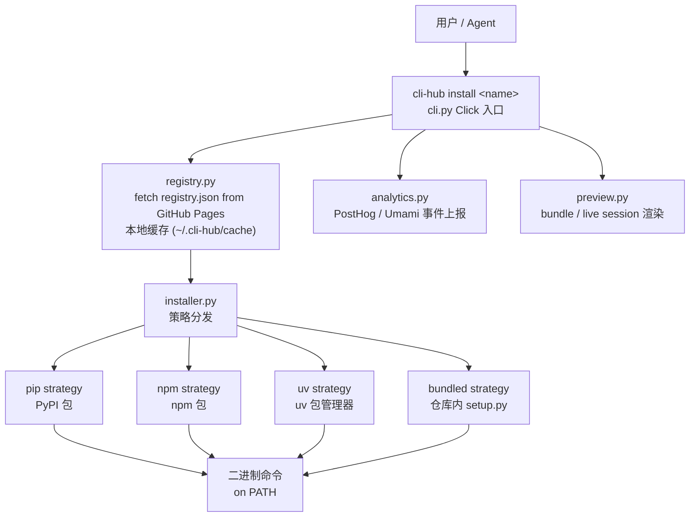

`registry.py` 从 GitHub Pages 拉取 `registry.json` 和 `public_registry.json`，并在本地做时间戳缓存，避免每次都发起网络请求。`installer.py` 根据注册表条目中的 `install_strategy` 字段选择安装路径，支持 `pip`、`npm`、`uv` 和 `bundled` 四种策略。  
Sources: [cli-hub/cli_hub/registry.py](../../../project-repos/CLI-Anything/cli-hub/cli_hub/registry.py), [cli-hub/cli_hub/installer.py](../../../project-repos/CLI-Anything/cli-hub/cli_hub/installer.py), [cli-hub/cli_hub/cli.py](../../../project-repos/CLI-Anything/cli-hub/cli_hub/cli.py)

<details class="source-snippets">
<summary>引用源码</summary>

<!-- source-snippets:start -->

#### `cli-hub/cli_hub/registry.py`

```python
"""Fetch, cache, and merge the CLI-Anything registries (harness + public)."""

import json
import time
from pathlib import Path

import requests

REGISTRY_URL = "https://hkuds.github.io/CLI-Anything/registry.json"
PUBLIC_REGISTRY_URL = "https://hkuds.github.io/CLI-Anything/public_registry.json"
CACHE_DIR = Path.home() / ".cli-hub"
CACHE_FILE = CACHE_DIR / "registry_cache.json"
PUBLIC_CACHE_FILE = CACHE_DIR / "public_registry_cache.json"
CACHE_TTL = 3600  # 1 hour


def _ensure_cache_dir():
    CACHE_DIR.mkdir(parents=True, exist_ok=True)


def _load_cached_data(cache_file):
    """Return cached registry data if the cache file is valid."""
    if not cache_file.exists():
        return None
    try:
        cached = json.loads(cache_file.read_text())
        return cached["data"]
    except (json.JSONDecodeError, KeyError):
        return None


def _fetch_json(url, cache_file, force_refresh=False):
    """Fetch a JSON URL with local file caching."""
    _ensure_cache_dir()

    if not force_refresh and cache_file.exists():
        try:
            cached = json.loads(cache_file.read_text())
            if time.time() - cached.get("_cached_at", 0) < CACHE_TTL:
                return cached["data"]
        except (json.JSONDecodeError, KeyError):
            pass

    try:
        resp = requests.get(url, timeout=15)
        resp.raise_for_status()
        data = resp.json()
    except (requests.RequestException, ValueError):
        cached_data = _load_cached_data(cache_file)
        if cached_data is not None:
            return cached_data
        raise

    cache_payload = {"_cached_at": time.time(), "data": data}
    cache_file.write_text(json.dumps(cache_payload, indent=2))

    return data


def fetch_registry(force_refresh=False):
    """Fetch the harness registry.json."""
    return _fetch_json(REGISTRY_URL, CACHE_FILE, force_refresh)


def fetch_public_registry(force_refresh=False):
    """Fetch the public CLI registry. Returns None on failure."""
    try:
        return _fetch_json(PUBLIC_REGISTRY_URL, PUBLIC_CACHE_FILE, force_refresh)
    except Exception:
        return None


def fetch_all_clis(force_refresh=False):
    """Fetch and merge both registries. Each CLI is tagged with _source."""
    registry = fetch_registry(force_refresh)
    all_clis = []

    for cli in registry["clis"]:
        cli["_source"] = "harness"
        all_clis.append(cli)

    public = fetch_public_registry(force_refresh)
    if public:
        for cli in public["clis"]:
            cli["_source"] = "public"
            all_clis.append(cli)

    return all_clis


def get_cli(name, force_refresh=False):
    """Look up a CLI entry by name (case-insensitive) across both registries."""
    name_lower = name.lower()
    for cli in fetch_all_clis(force_refresh):
        if cli["name"].lower() == name_lower:
            return cli
    return None


def search_clis(query, force_refresh=False):
    """Search CLIs by name, description, or category across both registries."""
    query_lower = query.lower()
    results = []
    for cli in fetch_all_clis(force_refresh):
        if (query_lower in cli["name"].lower()
                or query_lower in cli["description"].lower()
                or query_lower in cli.get("category", "").lower()
                or query_lower in cli.get("display_name", "").lower()):
            results.append(cli)
    return results


def list_categories(force_refresh=False):
    """Return sorted list of unique categories across both registries."""
    return sorted(set(cli.get("category", "uncategorized") for cli in fetch_all_clis(force_refresh)))
```

#### `cli-hub/cli_hub/installer.py`

```python
"""Install, uninstall, and manage CLIs — dispatches to pip or npm based on source."""

import json
import shlex
import shutil
import subprocess
import sys
from pathlib import Path

from cli_hub.registry import get_cli

INSTALLED_FILE = Path.home() / ".cli-hub" / "installed.json"


def _load_installed():
    if INSTALLED_FILE.exists():
        try:
            return json.loads(INSTALLED_FILE.read_text())
        except json.JSONDecodeError:
            pass
    return {}


def _save_installed(data):
    INSTALLED_FILE.parent.mkdir(parents=True, exist_ok=True)
    INSTALLED_FILE.write_text(json.dumps(data, indent=2))


def _find_npm():
    """Find npm executable. Returns path or None."""
    return shutil.which("npm")


def _find_uv():
    """Find uv executable. Returns path or None."""
    return shutil.which("uv")


_UV_INSTALL_HINT = (
    "uv is not installed. Install it first:\n"
    "  macOS / Linux: curl -LsSf https://astral.sh/uv/install.sh | sh\n"
    "  Windows:       powershell -ExecutionPolicy ByPass -c \"irm https://astral.sh/uv/install.ps1 | iex\"\n"
    "  pip:           pip install uv\n"
    "  brew:          brew install uv\n"
    "  See also:      https://docs.astral.sh/uv/getting-started/installation/"
)


_SHELL_METACHARACTERS = ("|", "&&", "||", ";", "$(", "`")


def _run_command(cmd):
    """Run a command string.

    Uses shell=True when the command contains shell operators (pipes, &&, etc.)
    so that script-type installs like ``curl … | bash`` work correctly.
    Commands come from the trusted registry, not from user input.
    """
    use_shell = any(c in cmd for c in _SHELL_METACHARACTERS)
    try:
        return subprocess.run(
            cmd if use_shell else shlex.split(cmd),
            capture_output=True,
            text=True,
            shell=use_shell,
        )
    except FileNotFoundError as exc:
        missing = exc.filename or shlex.split(cmd)[0]
        return subprocess.CompletedProcess(
            args=cmd,
            returncode=127,
            stdout="",
            stderr=f"Command not found: {missing}",
        )


def _command_exists(cmd):
    """Check whether the executable for a command string exists on PATH."""
    try:
        parts = shlex.split(cmd)
    except ValueError:
        return False
    if not parts:
        return False
    return shutil.which(parts[0]) is not None


def _install_strategy(cli):
    """Return the install strategy for a CLI entry."""
    strategy = cli.get("install_strategy")
    if strategy:
        return strategy
    if cli.get("_source", "harness") == "harness":
        return "pip"
    if cli.get("npm_package") or cli.get("package_manager") == "npm":
        return "npm"
    if cli.get("package_manager") == "uv":
        return "uv"
    if cli.get("package_manager") == "bundled":
        return "bundled"
    return "command"


def _generic_install(cli):
    install_cmd = cli.get("install_cmd")
    if not install_cmd:
        return False, f"No install command is defined for {cli['display_name']}."
    result = _run_command(install_cmd)
    if result.returncode == 0:
        return True, f"Installed {cli['display_name']} ({cli['entry_point']})"
    return False, f"Install failed:\n{result.stderr or result.stdout}"


def _generic_uninstall(cli):
    uninstall_cmd = cli.get("uninstall_cmd")
    if not uninstall_cmd:
        note = cli.get("uninstall_notes") or f"No uninstall command is defined for {cli['display_name']}."
        return False, note
    result = _run_command(uninstall_cmd)
    if result.returncode == 0:
```

#### `cli-hub/cli_hub/cli.py`

```python
"""cli-hub — CLI entry point."""

import os
import shutil
import sys
import json as json_mod
from pathlib import Path

import click

from cli_hub import __version__
from cli_hub.registry import fetch_all_clis, get_cli, search_clis, list_categories
from cli_hub.installer import install_cli, uninstall_cli, get_installed, update_cli
from cli_hub.analytics import (
    detect_invocation_context,
    track_first_run,
    track_install,
    track_launch,
    track_uninstall,
    track_visit,
)
from cli_hub.preview import (
    inspect_bundle,
    inspect_session,
    is_live_session_ref,
    load_session,
    open_in_browser,
    render_html,
    render_inspect_text,
    render_live_html,
    render_session_text,
    start_static_server,
)


def _invocation_command(ctx, version):
    """Return a compact label for the current invocation."""
    argv = sys.argv[1:]
    if version:
        return "--version"
    if ctx.invoked_subcommand:
        return ctx.invoked_subcommand
    if any(arg in ("--help", "-h") for arg in argv):
        return "--help"
    if argv:
        return argv[0]
    return "root"


@click.group(invoke_without_command=True)
@click.option("--version", is_flag=True, help="Show version.")
@click.pass_context
def main(ctx, version):
    """cli-hub — Download and manage CLI-Anything harnesses and public CLIs."""
    track_first_run()
    track_visit(command=_invocation_command(ctx, version), detection=detect_invocation_context())
    if version:
        click.echo(f"cli-hub {__version__}")
        return
    if ctx.invoked_subcommand is None:
        click.echo(ctx.get_help())


def _source_tag(cli):
    """Return a styled source indicator for display."""
    source = cli.get("_source", "harness")
    if source == "public":
        manager = cli.get("package_manager") or cli.get("install_strategy") or "public"
        return click.style(f" {manager}", fg="yellow")
    return ""


@main.command()
@click.argument("name")
def install(name):
    """Install a CLI by name."""
    click.echo(f"Installing {name}...")
    success, msg = install_cli(name)
    if success:
        cli = get_cli(name)
        track_install(name, cli["version"] if cli else "unknown")
        click.secho(f"✓ {msg}", fg="green")
        if cli:
            click.echo(f"  Run it with: {cli['entry_point']}")
            click.echo(f"  Or launch:   cli-hub launch {cli['name']}")
            if cli.get("_source") == "public" and cli.get("npx_cmd"):
                click.echo(f"  Or use npx:  {cli['npx_cmd']}")
    else:
        click.secho(f"✗ {msg}", fg="red", err=True)
        raise SystemExit(1)


@main.command()
@click.argument("name")
def uninstall(name):
    """Uninstall a CLI by name."""
    success, msg = uninstall_cli(name)
    if success:
        track_uninstall(name)
        click.secho(f"✓ {msg}", fg="green")
    else:
        click.secho(f"✗ {msg}", fg="red", err=True)
        raise SystemExit(1)


@main.command()
@click.argument("name")
def update(name):
    """Update a CLI to the latest version."""
    click.echo(f"Updating {name}...")
    success, msg = update_cli(name)
    if success:
        cli = get_cli(name)
        track_install(name, cli["version"] if cli else "unknown")
        click.secho(f"✓ {msg}", fg="green")
    else:
        click.secho(f"✗ {msg}", fg="red", err=True)
        raise SystemExit(1)


```

<!-- source-snippets:end -->
</details>
## 注册表层

注册表层通过 GitHub Pages 以静态 JSON 文件对外服务，分两个文件管理不同来源的 CLI：

| 文件 | 内容 | 来源 |
|---|---|---|
| `registry.json` | CLI-Anything 生成的 harness CLIs | 仓库内 `<software>/agent-harness/` |
| `public_registry.json` | 第三方社区贡献的 CLIs | 外部 PR 合入 |

两份注册表都由 GitHub Actions 的 `deploy-pages.yml` 部署到 GitHub Pages，形成不依赖任何后端服务的只读 API 端点。  
Sources: [registry.json](../../../project-repos/CLI-Anything/registry.json)

<details class="source-snippets">
<summary>引用源码</summary>

<!-- source-snippets:start -->

#### `registry.json`

```json
{
  "meta": {
    "repo": "https://github.com/HKUDS/CLI-Anything",
    "description": "CLI-Hub — Agent-native stateful CLI interfaces for softwares, codebases, and Web Services",
    "updated": "2026-04-16"
  },
  "clis": [
    {
      "name": "wiremock",
      "display_name": "WireMock",
      "version": "0.1.0",
      "description": "HTTP mock server management — create stubs, inspect requests, record traffic, and manage scenarios via WireMock REST API",
      "requires": "WireMock server running (java -jar wiremock-standalone.jar)",
      "homepage": "https://wiremock.org",
      "source_url": null,
      "install_cmd": "pip install git+https://github.com/HKUDS/CLI-Anything.git#subdirectory=wiremock/agent-harness",
      "entry_point": "cli-anything-wiremock",
      "skill_md": "skills/cli-anything-wiremock/SKILL.md",
      "category": "testing",
      "contributors": [
        {
          "name": "fabiomantel",
          "url": "https://github.com/fabiomantel"
        }
      ]
    },
    {
      "name": "anygen",
      "display_name": "AnyGen",
      "version": "1.0.0",
      "description": "Generate docs, slides, websites and more via AnyGen cloud API",
      "requires": "ANYGEN_API_KEY",
      "homepage": "https://anygen.com",
      "source_url": null,
      "install_cmd": "pip install git+https://github.com/HKUDS/CLI-Anything.git#subdirectory=anygen/agent-harness",
      "entry_point": "cli-anything-anygen",
      "skill_md": "skills/cli-anything-anygen/SKILL.md",
      "category": "generation",
      "contributors": [
        {
          "name": "koltyu-anygen",
          "url": "https://github.com/koltyu-anygen"
        }
      ]
    },
    {
      "name": "adguardhome",
      "display_name": "AdGuardHome",
      "version": "1.0.0",
      "description": "DNS ad-blocking and network infrastructure management via AdGuardHome REST API",
      "requires": "AdGuardHome instance running",
      "homepage": "https://adguard.com/adguard-home/overview.html",
      "source_url": null,
      "install_cmd": "pip install git+https://github.com/HKUDS/CLI-Anything.git#subdirectory=adguardhome/agent-harness",
      "entry_point": "cli-anything-adguardhome",
      "skill_md": null,
      "category": "network",
      "contributors": [
        {
          "name": "pyxl-dev",
          "url": "https://github.com/pyxl-dev"
        }
      ]
    },
    {
      "name": "audacity",
      "display_name": "Audacity",
      "version": "1.0.0",
      "description": "Audio editing and processing via sox",
      "requires": "sox (apt install sox)",
      "homepage": "https://www.audacityteam.org",
      "source_url": null,
      "install_cmd": "pip install git+https://github.com/HKUDS/CLI-Anything.git#subdirectory=audacity/agent-harness",
      "entry_point": "cli-anything-audacity",
      "skill_md": "skills/cli-anything-audacity/SKILL.md",
      "category": "audio",
      "contributors": [
        {
          "name": "CLI-Anything-Team",
          "url": "https://github.com/HKUDS/CLI-Anything"
        }
      ]
    },
    {
      "name": "blender",
      "display_name": "Blender",
      "version": "1.0.0",
      "description": "3D modeling, animation, and rendering via blender --background --python",
      "requires": "blender >= 4.2",
      "homepage": "https://www.blender.org",
      "source_url": null,
      "install_cmd": "pip install git+https://github.com/HKUDS/CLI-Anything.git#subdirectory=blender/agent-harness",
      "entry_point": "cli-anything-blender",
      "skill_md": "skills/cli-anything-blender/SKILL.md",
      "category": "3d",
      "contributors": [
        {
          "name": "CLI-Anything-Team",
          "url": "https://github.com/HKUDS/CLI-Anything"
        }
      ]
    },
    {
      "name": "browser",
      "display_name": "Browser",
      "version": "1.0.0",
      "description": "Browser automation via DOMShell MCP server. Maps Chrome's Accessibility Tree to a virtual filesystem for agent-native navigation.",
      "requires": "Node.js, npx, Chrome + DOMShell extension",
      "homepage": "https://github.com/apireno/DOMShell",
      "source_url": null,
      "install_cmd": "pip install git+https://github.com/HKUDS/CLI-Anything.git#subdirectory=browser/agent-harness",
      "entry_point": "cli-anything-browser",
      "skill_md": "skills/cli-anything-browser/SKILL.md",
      "category": "web",
      "contributors": [
        {
          "name": "furkankoykiran",
          "url": "https://github.com/furkankoykiran"
        }
      ]
```

<!-- source-snippets:end -->
</details>
## 技能层

技能层让 AI Agent 能自动发现并调用已安装的 CLI harness。每个 software 有对应的 `SKILL.md`，Agent 读取后知道该 CLI 的命令签名和 `--json` 输出格式：

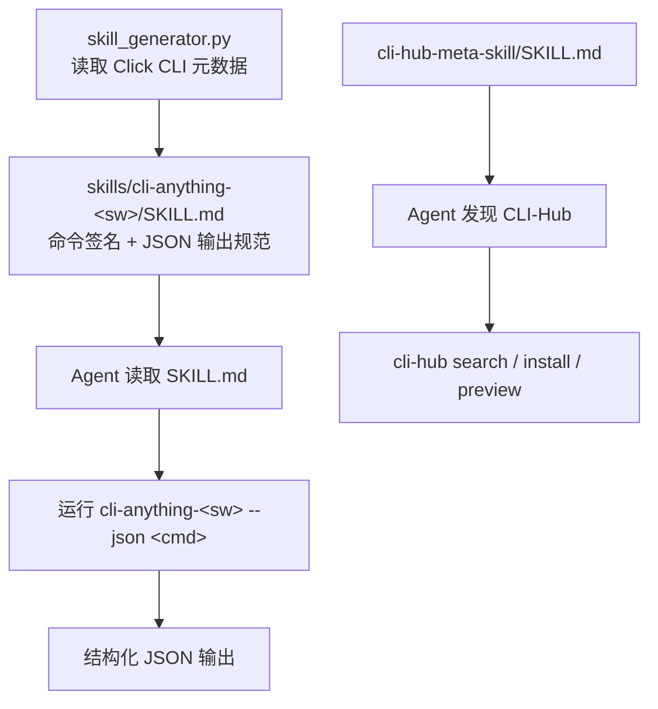

`cli-hub-meta-skill/SKILL.md` 是元技能：它描述 CLI-Hub 本身的能力，让 Agent 能够先通过 CLI-Hub 发现和安装新的 CLI harness，再通过对应的 SKILL.md 使用它。  
Sources: [cli-anything-plugin/HARNESS.md](../../../project-repos/CLI-Anything/cli-anything-plugin/HARNESS.md)

<details class="source-snippets">
<summary>引用源码</summary>

<!-- source-snippets:start -->

#### `cli-anything-plugin/HARNESS.md`

````markdown
# Agent Harness: GUI-to-CLI for Open Source Software

## Purpose

This harness provides a standard operating procedure (SOP) and toolkit for coding
agents (Claude Code, Codex, etc.) to build powerful, stateful CLI interfaces for
open-source GUI applications. The goal: let AI agents operate software that was
designed for humans, without needing a display or mouse.

## General SOP: Turning Any GUI App into an Agent-Usable CLI

### Phase 1: Codebase Analysis

1. **Identify the backend engine** — Most GUI apps separate presentation from logic.
   Find the core library/framework (e.g., MLT for Shotcut, ImageMagick for GIMP).
2. **Map GUI actions to API calls** — Every button click, drag, and menu item
   corresponds to a function call. Catalog these mappings.
3. **Identify the data model** — What file formats does it use? How is project state
   represented? (XML, JSON, binary, database?)
4. **Find existing CLI tools** — Many backends ship their own CLI (`melt`, `ffmpeg`,
   `convert`). These are building blocks.
5. **Catalog the command/undo system** — If the app has undo/redo, it likely uses a
   command pattern. These commands are your CLI operations.

### Phase 2: CLI Architecture Design

1. **Choose the interaction model**:
   - **Stateful REPL** for interactive sessions (agents that maintain context)
   - **Subcommand CLI** for one-shot operations (scripting, pipelines)
   - **Both** (recommended) — a CLI that works in both modes

2. **Define command groups** matching the app's logical domains:
   - Project management (new, open, save, close)
   - Core operations (the app's primary purpose)
   - Import/Export (file I/O, format conversion)
   - Configuration (settings, preferences, profiles)
   - Session/State management (undo, redo, history, status)

3. **Design the state model**:
   - What must persist between commands? (open project, cursor position, selection)
   - Where is state stored? (in-memory for REPL, file-based for CLI)
   - How does state serialize? (JSON session files)

4. **Plan the output format**:
   - Human-readable (tables, colors) for interactive use
   - Machine-readable (JSON) for agent consumption
   - Both, controlled by `--json` flag

### Phase 3: Implementation

1. **Start with the data layer** — XML/JSON manipulation of project files
2. **Add probe/info commands** — Let agents inspect before they modify
3. **Add mutation commands** — One command per logical operation
4. **Add the backend integration** — A `utils/<software>_backend.py` module that
   wraps the real software's CLI. This module handles:
   - Finding the software executable (`shutil.which()`)
   - Invoking it with proper arguments (`subprocess.run()`)
   - Error handling with clear install instructions if not found
   - Example (LibreOffice):
     ```python
     # utils/lo_backend.py
     def convert_odf_to(odf_path, output_format, output_path=None, overwrite=False):
         lo = find_libreoffice()  # raises RuntimeError with install instructions
         subprocess.run([lo, "--headless", "--convert-to", output_format, ...])
         return {"output": final_path, "format": output_format, "method": "libreoffice-headless"}
     ```
5. **Add rendering/export** — The export pipeline calls the backend module.
   Generate valid intermediate files, then invoke the real software for conversion.
6. **Add session management** — State persistence, undo/redo

   **Session file locking** — Use exclusive file locking for session JSON saves
   to prevent concurrent write corruption. See [`guides/session-locking.md`](guides/session-locking.md)
   for the `_locked_save_json` pattern (open `"r+"`, lock, then truncate inside the lock).
7. **Add the REPL with unified skin** — Interactive mode wrapping the subcommands.
   - Copy `repl_skin.py` from the plugin (`cli-anything-plugin/repl_skin.py`) into
     `utils/repl_skin.py` in your CLI package
   - Import and use `ReplSkin` for the REPL interface:
     ```python
     from cli_anything.<software>.utils.repl_skin import ReplSkin

     skin = ReplSkin("<software>", version="1.0.0")
     skin.print_banner()          # Branded startup box (prefers repo-root skills/, falls back to package)
     pt_session = skin.create_prompt_session()  # prompt_toolkit with history + styling
     line = skin.get_input(pt_session, project_name="my_project", modified=True)
     skin.help(commands_dict)     # Formatted help listing
     skin.success("Saved")        # ✓ green message
     skin.error("Not found")      # ✗ red message
     skin.warning("Unsaved")      # ⚠ yellow message
     skin.info("Processing...")   # ● blue message
     skin.status("Key", "value")  # Key-value status line
     skin.table(headers, rows)    # Formatted table
     skin.progress(3, 10, "...")  # Progress bar
     skin.print_goodbye()         # Styled exit message
     ```
   - ReplSkin prefers the repo-root canonical `skills/cli-anything-<software>/SKILL.md`
     when running inside this monorepo, and falls back to the packaged
     `cli_anything/<software>/skills/SKILL.md` copy when installed elsewhere.
     AI agents can read the skill file at the displayed absolute path.
   - Make REPL the default behavior: use `invoke_without_command=True` on the main
     Click group, and invoke the `repl` command when no subcommand is given:
     ```python
     @click.group(invoke_without_command=True)
     @click.pass_context
     def cli(ctx, ...):
         ...
         if ctx.invoked_subcommand is None:
             ctx.invoke(repl, project_path=None)
     ```
   - This ensures `cli-anything-<software>` with no arguments enters the REPL

### Phase 4: Test Planning (TEST.md - Part 1)

**BEFORE writing any test code**, create a `TEST.md` file in the
`agent-harness/cli_anything/<software>/tests/` directory. This file serves as your test plan and
MUST contain:

1. **Test Inventory Plan** — List planned test files and estimated test counts:
   - `test_core.py`: XX unit tests planned
   - `test_full_e2e.py`: XX E2E tests planned

````

<!-- source-snippets:end -->
</details>
## 核心数据流

### 数据流 1：生成新 harness

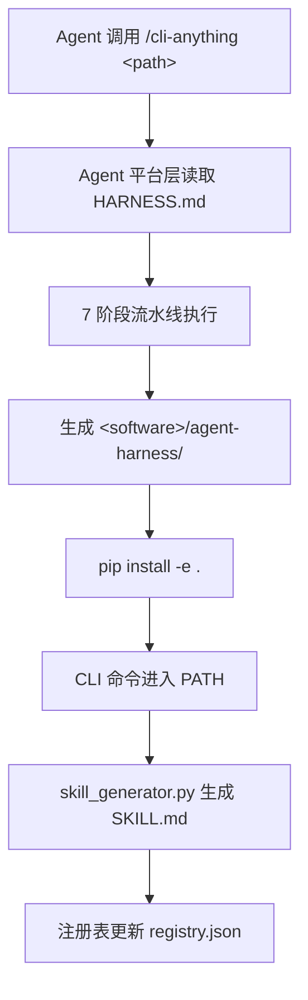

### 数据流 2：用户安装已有 CLI

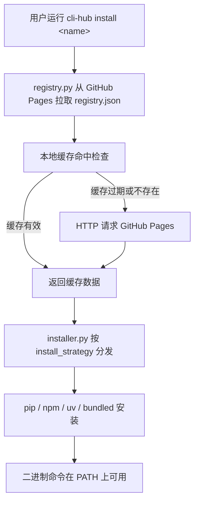

### 数据流 3：Agent 通过技能使用 CLI

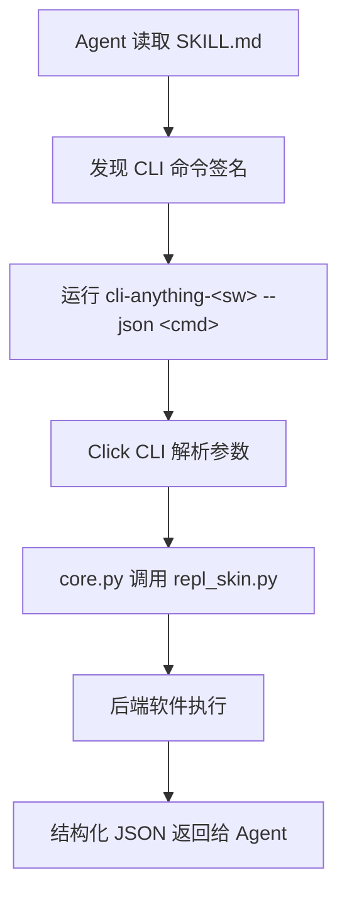

Sources: [cli-hub/cli_hub/registry.py](../../../project-repos/CLI-Anything/cli-hub/cli_hub/registry.py), [cli-hub/cli_hub/installer.py](../../../project-repos/CLI-Anything/cli-hub/cli_hub/installer.py), [cli-anything-plugin/repl_skin.py](../../../project-repos/CLI-Anything/cli-anything-plugin/repl_skin.py)

<details class="source-snippets">
<summary>引用源码</summary>

<!-- source-snippets:start -->

#### `cli-hub/cli_hub/registry.py`

```python
"""Fetch, cache, and merge the CLI-Anything registries (harness + public)."""

import json
import time
from pathlib import Path

import requests

REGISTRY_URL = "https://hkuds.github.io/CLI-Anything/registry.json"
PUBLIC_REGISTRY_URL = "https://hkuds.github.io/CLI-Anything/public_registry.json"
CACHE_DIR = Path.home() / ".cli-hub"
CACHE_FILE = CACHE_DIR / "registry_cache.json"
PUBLIC_CACHE_FILE = CACHE_DIR / "public_registry_cache.json"
CACHE_TTL = 3600  # 1 hour


def _ensure_cache_dir():
    CACHE_DIR.mkdir(parents=True, exist_ok=True)


def _load_cached_data(cache_file):
    """Return cached registry data if the cache file is valid."""
    if not cache_file.exists():
        return None
    try:
        cached = json.loads(cache_file.read_text())
        return cached["data"]
    except (json.JSONDecodeError, KeyError):
        return None


def _fetch_json(url, cache_file, force_refresh=False):
    """Fetch a JSON URL with local file caching."""
    _ensure_cache_dir()

    if not force_refresh and cache_file.exists():
        try:
            cached = json.loads(cache_file.read_text())
            if time.time() - cached.get("_cached_at", 0) < CACHE_TTL:
                return cached["data"]
        except (json.JSONDecodeError, KeyError):
            pass

    try:
        resp = requests.get(url, timeout=15)
        resp.raise_for_status()
        data = resp.json()
    except (requests.RequestException, ValueError):
        cached_data = _load_cached_data(cache_file)
        if cached_data is not None:
            return cached_data
        raise

    cache_payload = {"_cached_at": time.time(), "data": data}
    cache_file.write_text(json.dumps(cache_payload, indent=2))

    return data


def fetch_registry(force_refresh=False):
    """Fetch the harness registry.json."""
    return _fetch_json(REGISTRY_URL, CACHE_FILE, force_refresh)


def fetch_public_registry(force_refresh=False):
    """Fetch the public CLI registry. Returns None on failure."""
    try:
        return _fetch_json(PUBLIC_REGISTRY_URL, PUBLIC_CACHE_FILE, force_refresh)
    except Exception:
        return None


def fetch_all_clis(force_refresh=False):
    """Fetch and merge both registries. Each CLI is tagged with _source."""
    registry = fetch_registry(force_refresh)
    all_clis = []

    for cli in registry["clis"]:
        cli["_source"] = "harness"
        all_clis.append(cli)

    public = fetch_public_registry(force_refresh)
    if public:
        for cli in public["clis"]:
            cli["_source"] = "public"
            all_clis.append(cli)

    return all_clis


def get_cli(name, force_refresh=False):
    """Look up a CLI entry by name (case-insensitive) across both registries."""
    name_lower = name.lower()
    for cli in fetch_all_clis(force_refresh):
        if cli["name"].lower() == name_lower:
            return cli
    return None


def search_clis(query, force_refresh=False):
    """Search CLIs by name, description, or category across both registries."""
    query_lower = query.lower()
    results = []
    for cli in fetch_all_clis(force_refresh):
        if (query_lower in cli["name"].lower()
                or query_lower in cli["description"].lower()
                or query_lower in cli.get("category", "").lower()
                or query_lower in cli.get("display_name", "").lower()):
            results.append(cli)
    return results


def list_categories(force_refresh=False):
    """Return sorted list of unique categories across both registries."""
    return sorted(set(cli.get("category", "uncategorized") for cli in fetch_all_clis(force_refresh)))
```

#### `cli-hub/cli_hub/installer.py`

```python
"""Install, uninstall, and manage CLIs — dispatches to pip or npm based on source."""

import json
import shlex
import shutil
import subprocess
import sys
from pathlib import Path

from cli_hub.registry import get_cli

INSTALLED_FILE = Path.home() / ".cli-hub" / "installed.json"


def _load_installed():
    if INSTALLED_FILE.exists():
        try:
            return json.loads(INSTALLED_FILE.read_text())
        except json.JSONDecodeError:
            pass
    return {}


def _save_installed(data):
    INSTALLED_FILE.parent.mkdir(parents=True, exist_ok=True)
    INSTALLED_FILE.write_text(json.dumps(data, indent=2))


def _find_npm():
    """Find npm executable. Returns path or None."""
    return shutil.which("npm")


def _find_uv():
    """Find uv executable. Returns path or None."""
    return shutil.which("uv")


_UV_INSTALL_HINT = (
    "uv is not installed. Install it first:\n"
    "  macOS / Linux: curl -LsSf https://astral.sh/uv/install.sh | sh\n"
    "  Windows:       powershell -ExecutionPolicy ByPass -c \"irm https://astral.sh/uv/install.ps1 | iex\"\n"
    "  pip:           pip install uv\n"
    "  brew:          brew install uv\n"
    "  See also:      https://docs.astral.sh/uv/getting-started/installation/"
)


_SHELL_METACHARACTERS = ("|", "&&", "||", ";", "$(", "`")


def _run_command(cmd):
    """Run a command string.

    Uses shell=True when the command contains shell operators (pipes, &&, etc.)
    so that script-type installs like ``curl … | bash`` work correctly.
    Commands come from the trusted registry, not from user input.
    """
    use_shell = any(c in cmd for c in _SHELL_METACHARACTERS)
    try:
        return subprocess.run(
            cmd if use_shell else shlex.split(cmd),
            capture_output=True,
            text=True,
            shell=use_shell,
        )
    except FileNotFoundError as exc:
        missing = exc.filename or shlex.split(cmd)[0]
        return subprocess.CompletedProcess(
            args=cmd,
            returncode=127,
            stdout="",
            stderr=f"Command not found: {missing}",
        )


def _command_exists(cmd):
    """Check whether the executable for a command string exists on PATH."""
    try:
        parts = shlex.split(cmd)
    except ValueError:
        return False
    if not parts:
        return False
    return shutil.which(parts[0]) is not None


def _install_strategy(cli):
    """Return the install strategy for a CLI entry."""
    strategy = cli.get("install_strategy")
    if strategy:
        return strategy
    if cli.get("_source", "harness") == "harness":
        return "pip"
    if cli.get("npm_package") or cli.get("package_manager") == "npm":
        return "npm"
    if cli.get("package_manager") == "uv":
        return "uv"
    if cli.get("package_manager") == "bundled":
        return "bundled"
    return "command"


def _generic_install(cli):
    install_cmd = cli.get("install_cmd")
    if not install_cmd:
        return False, f"No install command is defined for {cli['display_name']}."
    result = _run_command(install_cmd)
    if result.returncode == 0:
        return True, f"Installed {cli['display_name']} ({cli['entry_point']})"
    return False, f"Install failed:\n{result.stderr or result.stdout}"


def _generic_uninstall(cli):
    uninstall_cmd = cli.get("uninstall_cmd")
    if not uninstall_cmd:
        note = cli.get("uninstall_notes") or f"No uninstall command is defined for {cli['display_name']}."
        return False, note
    result = _run_command(uninstall_cmd)
    if result.returncode == 0:
```

#### `cli-anything-plugin/repl_skin.py`

```python
"""cli-anything REPL Skin — Unified terminal interface for all CLI harnesses.

Copy this file into your CLI package at:
    cli_anything/<software>/utils/repl_skin.py

Usage:
    from cli_anything.<software>.utils.repl_skin import ReplSkin

    skin = ReplSkin("shotcut", version="1.0.0")
    skin.print_banner()  # auto-detects repo-root or packaged SKILL.md
    prompt_text = skin.prompt(project_name="my_video.mlt", modified=True)
    skin.success("Project saved")
    skin.error("File not found")
    skin.warning("Unsaved changes")
    skin.info("Processing 24 clips...")
    skin.status("Track 1", "3 clips, 00:02:30")
    skin.table(headers, rows)
    skin.print_goodbye()
"""

import os
import sys
from pathlib import Path

# ── ANSI color codes (no external deps for core styling) ──────────────

_RESET = "\033[0m"
_BOLD = "\033[1m"
_DIM = "\033[2m"
_ITALIC = "\033[3m"
_UNDERLINE = "\033[4m"

# Brand colors
_CYAN = "\033[38;5;80m"       # cli-anything brand cyan
_CYAN_BG = "\033[48;5;80m"
_WHITE = "\033[97m"
_GRAY = "\033[38;5;245m"
_DARK_GRAY = "\033[38;5;240m"
_LIGHT_GRAY = "\033[38;5;250m"

# Software accent colors — each software gets a unique accent
_ACCENT_COLORS = {
    "gimp":        "\033[38;5;214m",   # warm orange
    "blender":     "\033[38;5;208m",   # deep orange
    "inkscape":    "\033[38;5;39m",    # bright blue
    "audacity":    "\033[38;5;33m",    # navy blue
    "libreoffice": "\033[38;5;40m",    # green
    "obs_studio":  "\033[38;5;55m",    # purple
    "kdenlive":    "\033[38;5;69m",    # slate blue
    "shotcut":     "\033[38;5;35m",    # teal green
}
_DEFAULT_ACCENT = "\033[38;5;75m"      # default sky blue

# Status colors
_GREEN = "\033[38;5;78m"
_YELLOW = "\033[38;5;220m"
_RED = "\033[38;5;196m"
_BLUE = "\033[38;5;75m"
_MAGENTA = "\033[38;5;176m"

_SKILL_SOURCE_REPO = os.environ.get("CLI_ANYTHING_SKILL_REPO", "HKUDS/CLI-Anything")

# ── Brand icon ────────────────────────────────────────────────────────

# The cli-anything icon: a small colored diamond/chevron mark
_ICON = f"{_CYAN}{_BOLD}◆{_RESET}"
_ICON_SMALL = f"{_CYAN}▸{_RESET}"

# ── Box drawing characters ────────────────────────────────────────────

_H_LINE = "─"
_V_LINE = "│"
_TL = "╭"
_TR = "╮"
_BL = "╰"
_BR = "╯"
_T_DOWN = "┬"
_T_UP = "┴"
_T_RIGHT = "├"
_T_LEFT = "┤"
_CROSS = "┼"


def _strip_ansi(text: str) -> str:
    """Remove ANSI escape codes for length calculation."""
    import re
    return re.sub(r"\033\[[^m]*m", "", text)


def _visible_len(text: str) -> int:
    """Get visible length of text (excluding ANSI codes)."""
    return len(_strip_ansi(text))


def _display_home_path(path: str) -> str:
    """Display a path relative to the home directory when possible."""
    expanded = Path(path).expanduser().resolve()
    home = Path.home().resolve()
    try:
        relative = expanded.relative_to(home)
        return f"~/{relative.as_posix()}"
    except ValueError:
        return str(expanded)


class ReplSkin:
    """Unified REPL skin for cli-anything CLIs.

    Provides consistent branding, prompts, and message formatting
    across all CLI harnesses built with the cli-anything methodology.
    """

    def __init__(self, software: str, version: str = "1.0.0",
                 history_file: str | None = None, skill_path: str | None = None):
        """Initialize the REPL skin.

        Args:
            software: Software name (e.g., "gimp", "shotcut", "blender").
            version: CLI version string.
            history_file: Path for persistent command history.
```

<!-- source-snippets:end -->
</details>
## 模块依赖关系

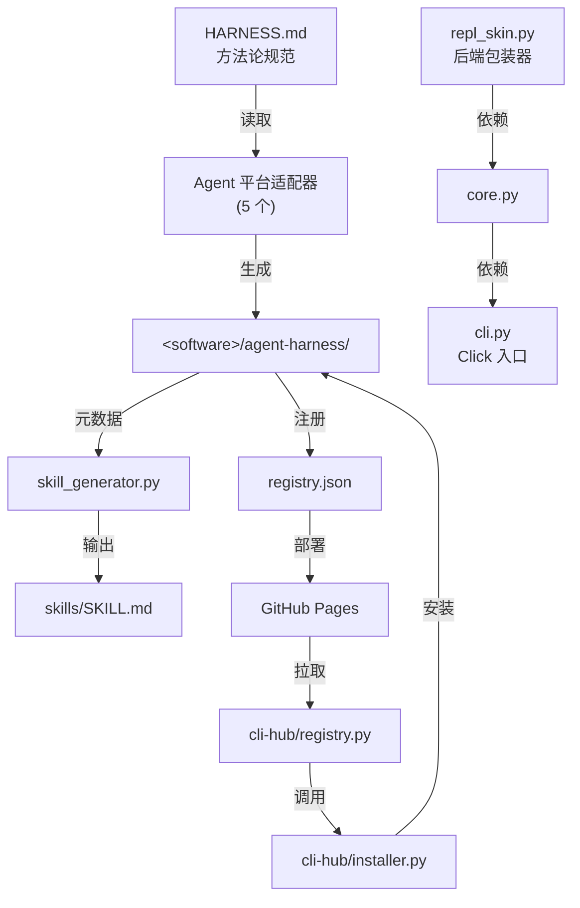

Sources: [cli-anything-plugin/HARNESS.md](../../../project-repos/CLI-Anything/cli-anything-plugin/HARNESS.md), [cli-hub/cli_hub/registry.py](../../../project-repos/CLI-Anything/cli-hub/cli_hub/registry.py), [cli-hub/cli_hub/installer.py](../../../project-repos/CLI-Anything/cli-hub/cli_hub/installer.py), [cli-anything-plugin/repl_skin.py](../../../project-repos/CLI-Anything/cli-anything-plugin/repl_skin.py), [registry.json](../../../project-repos/CLI-Anything/registry.json)

<details class="source-snippets">
<summary>引用源码</summary>

<!-- source-snippets:start -->

#### `cli-anything-plugin/HARNESS.md`

````markdown
# Agent Harness: GUI-to-CLI for Open Source Software

## Purpose

This harness provides a standard operating procedure (SOP) and toolkit for coding
agents (Claude Code, Codex, etc.) to build powerful, stateful CLI interfaces for
open-source GUI applications. The goal: let AI agents operate software that was
designed for humans, without needing a display or mouse.

## General SOP: Turning Any GUI App into an Agent-Usable CLI

### Phase 1: Codebase Analysis

1. **Identify the backend engine** — Most GUI apps separate presentation from logic.
   Find the core library/framework (e.g., MLT for Shotcut, ImageMagick for GIMP).
2. **Map GUI actions to API calls** — Every button click, drag, and menu item
   corresponds to a function call. Catalog these mappings.
3. **Identify the data model** — What file formats does it use? How is project state
   represented? (XML, JSON, binary, database?)
4. **Find existing CLI tools** — Many backends ship their own CLI (`melt`, `ffmpeg`,
   `convert`). These are building blocks.
5. **Catalog the command/undo system** — If the app has undo/redo, it likely uses a
   command pattern. These commands are your CLI operations.

### Phase 2: CLI Architecture Design

1. **Choose the interaction model**:
   - **Stateful REPL** for interactive sessions (agents that maintain context)
   - **Subcommand CLI** for one-shot operations (scripting, pipelines)
   - **Both** (recommended) — a CLI that works in both modes

2. **Define command groups** matching the app's logical domains:
   - Project management (new, open, save, close)
   - Core operations (the app's primary purpose)
   - Import/Export (file I/O, format conversion)
   - Configuration (settings, preferences, profiles)
   - Session/State management (undo, redo, history, status)

3. **Design the state model**:
   - What must persist between commands? (open project, cursor position, selection)
   - Where is state stored? (in-memory for REPL, file-based for CLI)
   - How does state serialize? (JSON session files)

4. **Plan the output format**:
   - Human-readable (tables, colors) for interactive use
   - Machine-readable (JSON) for agent consumption
   - Both, controlled by `--json` flag

### Phase 3: Implementation

1. **Start with the data layer** — XML/JSON manipulation of project files
2. **Add probe/info commands** — Let agents inspect before they modify
3. **Add mutation commands** — One command per logical operation
4. **Add the backend integration** — A `utils/<software>_backend.py` module that
   wraps the real software's CLI. This module handles:
   - Finding the software executable (`shutil.which()`)
   - Invoking it with proper arguments (`subprocess.run()`)
   - Error handling with clear install instructions if not found
   - Example (LibreOffice):
     ```python
     # utils/lo_backend.py
     def convert_odf_to(odf_path, output_format, output_path=None, overwrite=False):
         lo = find_libreoffice()  # raises RuntimeError with install instructions
         subprocess.run([lo, "--headless", "--convert-to", output_format, ...])
         return {"output": final_path, "format": output_format, "method": "libreoffice-headless"}
     ```
5. **Add rendering/export** — The export pipeline calls the backend module.
   Generate valid intermediate files, then invoke the real software for conversion.
6. **Add session management** — State persistence, undo/redo

   **Session file locking** — Use exclusive file locking for session JSON saves
   to prevent concurrent write corruption. See [`guides/session-locking.md`](guides/session-locking.md)
   for the `_locked_save_json` pattern (open `"r+"`, lock, then truncate inside the lock).
7. **Add the REPL with unified skin** — Interactive mode wrapping the subcommands.
   - Copy `repl_skin.py` from the plugin (`cli-anything-plugin/repl_skin.py`) into
     `utils/repl_skin.py` in your CLI package
   - Import and use `ReplSkin` for the REPL interface:
     ```python
     from cli_anything.<software>.utils.repl_skin import ReplSkin

     skin = ReplSkin("<software>", version="1.0.0")
     skin.print_banner()          # Branded startup box (prefers repo-root skills/, falls back to package)
     pt_session = skin.create_prompt_session()  # prompt_toolkit with history + styling
     line = skin.get_input(pt_session, project_name="my_project", modified=True)
     skin.help(commands_dict)     # Formatted help listing
     skin.success("Saved")        # ✓ green message
     skin.error("Not found")      # ✗ red message
     skin.warning("Unsaved")      # ⚠ yellow message
     skin.info("Processing...")   # ● blue message
     skin.status("Key", "value")  # Key-value status line
     skin.table(headers, rows)    # Formatted table
     skin.progress(3, 10, "...")  # Progress bar
     skin.print_goodbye()         # Styled exit message
     ```
   - ReplSkin prefers the repo-root canonical `skills/cli-anything-<software>/SKILL.md`
     when running inside this monorepo, and falls back to the packaged
     `cli_anything/<software>/skills/SKILL.md` copy when installed elsewhere.
     AI agents can read the skill file at the displayed absolute path.
   - Make REPL the default behavior: use `invoke_without_command=True` on the main
     Click group, and invoke the `repl` command when no subcommand is given:
     ```python
     @click.group(invoke_without_command=True)
     @click.pass_context
     def cli(ctx, ...):
         ...
         if ctx.invoked_subcommand is None:
             ctx.invoke(repl, project_path=None)
     ```
   - This ensures `cli-anything-<software>` with no arguments enters the REPL

### Phase 4: Test Planning (TEST.md - Part 1)

**BEFORE writing any test code**, create a `TEST.md` file in the
`agent-harness/cli_anything/<software>/tests/` directory. This file serves as your test plan and
MUST contain:

1. **Test Inventory Plan** — List planned test files and estimated test counts:
   - `test_core.py`: XX unit tests planned
   - `test_full_e2e.py`: XX E2E tests planned

````

#### `cli-hub/cli_hub/registry.py`

```python
"""Fetch, cache, and merge the CLI-Anything registries (harness + public)."""

import json
import time
from pathlib import Path

import requests

REGISTRY_URL = "https://hkuds.github.io/CLI-Anything/registry.json"
PUBLIC_REGISTRY_URL = "https://hkuds.github.io/CLI-Anything/public_registry.json"
CACHE_DIR = Path.home() / ".cli-hub"
CACHE_FILE = CACHE_DIR / "registry_cache.json"
PUBLIC_CACHE_FILE = CACHE_DIR / "public_registry_cache.json"
CACHE_TTL = 3600  # 1 hour


def _ensure_cache_dir():
    CACHE_DIR.mkdir(parents=True, exist_ok=True)


def _load_cached_data(cache_file):
    """Return cached registry data if the cache file is valid."""
    if not cache_file.exists():
        return None
    try:
        cached = json.loads(cache_file.read_text())
        return cached["data"]
    except (json.JSONDecodeError, KeyError):
        return None


def _fetch_json(url, cache_file, force_refresh=False):
    """Fetch a JSON URL with local file caching."""
    _ensure_cache_dir()

    if not force_refresh and cache_file.exists():
        try:
            cached = json.loads(cache_file.read_text())
            if time.time() - cached.get("_cached_at", 0) < CACHE_TTL:
                return cached["data"]
        except (json.JSONDecodeError, KeyError):
            pass

    try:
        resp = requests.get(url, timeout=15)
        resp.raise_for_status()
        data = resp.json()
    except (requests.RequestException, ValueError):
        cached_data = _load_cached_data(cache_file)
        if cached_data is not None:
            return cached_data
        raise

    cache_payload = {"_cached_at": time.time(), "data": data}
    cache_file.write_text(json.dumps(cache_payload, indent=2))

    return data


def fetch_registry(force_refresh=False):
    """Fetch the harness registry.json."""
    return _fetch_json(REGISTRY_URL, CACHE_FILE, force_refresh)


def fetch_public_registry(force_refresh=False):
    """Fetch the public CLI registry. Returns None on failure."""
    try:
        return _fetch_json(PUBLIC_REGISTRY_URL, PUBLIC_CACHE_FILE, force_refresh)
    except Exception:
        return None


def fetch_all_clis(force_refresh=False):
    """Fetch and merge both registries. Each CLI is tagged with _source."""
    registry = fetch_registry(force_refresh)
    all_clis = []

    for cli in registry["clis"]:
        cli["_source"] = "harness"
        all_clis.append(cli)

    public = fetch_public_registry(force_refresh)
    if public:
        for cli in public["clis"]:
            cli["_source"] = "public"
            all_clis.append(cli)

    return all_clis


def get_cli(name, force_refresh=False):
    """Look up a CLI entry by name (case-insensitive) across both registries."""
    name_lower = name.lower()
    for cli in fetch_all_clis(force_refresh):
        if cli["name"].lower() == name_lower:
            return cli
    return None


def search_clis(query, force_refresh=False):
    """Search CLIs by name, description, or category across both registries."""
    query_lower = query.lower()
    results = []
    for cli in fetch_all_clis(force_refresh):
        if (query_lower in cli["name"].lower()
                or query_lower in cli["description"].lower()
                or query_lower in cli.get("category", "").lower()
                or query_lower in cli.get("display_name", "").lower()):
            results.append(cli)
    return results


def list_categories(force_refresh=False):
    """Return sorted list of unique categories across both registries."""
    return sorted(set(cli.get("category", "uncategorized") for cli in fetch_all_clis(force_refresh)))
```

#### `cli-hub/cli_hub/installer.py`

```python
"""Install, uninstall, and manage CLIs — dispatches to pip or npm based on source."""

import json
import shlex
import shutil
import subprocess
import sys
from pathlib import Path

from cli_hub.registry import get_cli

INSTALLED_FILE = Path.home() / ".cli-hub" / "installed.json"


def _load_installed():
    if INSTALLED_FILE.exists():
        try:
            return json.loads(INSTALLED_FILE.read_text())
        except json.JSONDecodeError:
            pass
    return {}


def _save_installed(data):
    INSTALLED_FILE.parent.mkdir(parents=True, exist_ok=True)
    INSTALLED_FILE.write_text(json.dumps(data, indent=2))


def _find_npm():
    """Find npm executable. Returns path or None."""
    return shutil.which("npm")


def _find_uv():
    """Find uv executable. Returns path or None."""
    return shutil.which("uv")


_UV_INSTALL_HINT = (
    "uv is not installed. Install it first:\n"
    "  macOS / Linux: curl -LsSf https://astral.sh/uv/install.sh | sh\n"
    "  Windows:       powershell -ExecutionPolicy ByPass -c \"irm https://astral.sh/uv/install.ps1 | iex\"\n"
    "  pip:           pip install uv\n"
    "  brew:          brew install uv\n"
    "  See also:      https://docs.astral.sh/uv/getting-started/installation/"
)


_SHELL_METACHARACTERS = ("|", "&&", "||", ";", "$(", "`")


def _run_command(cmd):
    """Run a command string.

    Uses shell=True when the command contains shell operators (pipes, &&, etc.)
    so that script-type installs like ``curl … | bash`` work correctly.
    Commands come from the trusted registry, not from user input.
    """
    use_shell = any(c in cmd for c in _SHELL_METACHARACTERS)
    try:
        return subprocess.run(
            cmd if use_shell else shlex.split(cmd),
            capture_output=True,
            text=True,
            shell=use_shell,
        )
    except FileNotFoundError as exc:
        missing = exc.filename or shlex.split(cmd)[0]
        return subprocess.CompletedProcess(
            args=cmd,
            returncode=127,
            stdout="",
            stderr=f"Command not found: {missing}",
        )


def _command_exists(cmd):
    """Check whether the executable for a command string exists on PATH."""
    try:
        parts = shlex.split(cmd)
    except ValueError:
        return False
    if not parts:
        return False
    return shutil.which(parts[0]) is not None


def _install_strategy(cli):
    """Return the install strategy for a CLI entry."""
    strategy = cli.get("install_strategy")
    if strategy:
        return strategy
    if cli.get("_source", "harness") == "harness":
        return "pip"
    if cli.get("npm_package") or cli.get("package_manager") == "npm":
        return "npm"
    if cli.get("package_manager") == "uv":
        return "uv"
    if cli.get("package_manager") == "bundled":
        return "bundled"
    return "command"


def _generic_install(cli):
    install_cmd = cli.get("install_cmd")
    if not install_cmd:
        return False, f"No install command is defined for {cli['display_name']}."
    result = _run_command(install_cmd)
    if result.returncode == 0:
        return True, f"Installed {cli['display_name']} ({cli['entry_point']})"
    return False, f"Install failed:\n{result.stderr or result.stdout}"


def _generic_uninstall(cli):
    uninstall_cmd = cli.get("uninstall_cmd")
    if not uninstall_cmd:
        note = cli.get("uninstall_notes") or f"No uninstall command is defined for {cli['display_name']}."
        return False, note
    result = _run_command(uninstall_cmd)
    if result.returncode == 0:
```

#### `cli-anything-plugin/repl_skin.py`

```python
"""cli-anything REPL Skin — Unified terminal interface for all CLI harnesses.

Copy this file into your CLI package at:
    cli_anything/<software>/utils/repl_skin.py

Usage:
    from cli_anything.<software>.utils.repl_skin import ReplSkin

    skin = ReplSkin("shotcut", version="1.0.0")
    skin.print_banner()  # auto-detects repo-root or packaged SKILL.md
    prompt_text = skin.prompt(project_name="my_video.mlt", modified=True)
    skin.success("Project saved")
    skin.error("File not found")
    skin.warning("Unsaved changes")
    skin.info("Processing 24 clips...")
    skin.status("Track 1", "3 clips, 00:02:30")
    skin.table(headers, rows)
    skin.print_goodbye()
"""

import os
import sys
from pathlib import Path

# ── ANSI color codes (no external deps for core styling) ──────────────

_RESET = "\033[0m"
_BOLD = "\033[1m"
_DIM = "\033[2m"
_ITALIC = "\033[3m"
_UNDERLINE = "\033[4m"

# Brand colors
_CYAN = "\033[38;5;80m"       # cli-anything brand cyan
_CYAN_BG = "\033[48;5;80m"
_WHITE = "\033[97m"
_GRAY = "\033[38;5;245m"
_DARK_GRAY = "\033[38;5;240m"
_LIGHT_GRAY = "\033[38;5;250m"

# Software accent colors — each software gets a unique accent
_ACCENT_COLORS = {
    "gimp":        "\033[38;5;214m",   # warm orange
    "blender":     "\033[38;5;208m",   # deep orange
    "inkscape":    "\033[38;5;39m",    # bright blue
    "audacity":    "\033[38;5;33m",    # navy blue
    "libreoffice": "\033[38;5;40m",    # green
    "obs_studio":  "\033[38;5;55m",    # purple
    "kdenlive":    "\033[38;5;69m",    # slate blue
    "shotcut":     "\033[38;5;35m",    # teal green
}
_DEFAULT_ACCENT = "\033[38;5;75m"      # default sky blue

# Status colors
_GREEN = "\033[38;5;78m"
_YELLOW = "\033[38;5;220m"
_RED = "\033[38;5;196m"
_BLUE = "\033[38;5;75m"
_MAGENTA = "\033[38;5;176m"

_SKILL_SOURCE_REPO = os.environ.get("CLI_ANYTHING_SKILL_REPO", "HKUDS/CLI-Anything")

# ── Brand icon ────────────────────────────────────────────────────────

# The cli-anything icon: a small colored diamond/chevron mark
_ICON = f"{_CYAN}{_BOLD}◆{_RESET}"
_ICON_SMALL = f"{_CYAN}▸{_RESET}"

# ── Box drawing characters ────────────────────────────────────────────

_H_LINE = "─"
_V_LINE = "│"
_TL = "╭"
_TR = "╮"
_BL = "╰"
_BR = "╯"
_T_DOWN = "┬"
_T_UP = "┴"
_T_RIGHT = "├"
_T_LEFT = "┤"
_CROSS = "┼"


def _strip_ansi(text: str) -> str:
    """Remove ANSI escape codes for length calculation."""
    import re
    return re.sub(r"\033\[[^m]*m", "", text)


def _visible_len(text: str) -> int:
    """Get visible length of text (excluding ANSI codes)."""
    return len(_strip_ansi(text))


def _display_home_path(path: str) -> str:
    """Display a path relative to the home directory when possible."""
    expanded = Path(path).expanduser().resolve()
    home = Path.home().resolve()
    try:
        relative = expanded.relative_to(home)
        return f"~/{relative.as_posix()}"
    except ValueError:
        return str(expanded)


class ReplSkin:
    """Unified REPL skin for cli-anything CLIs.

    Provides consistent branding, prompts, and message formatting
    across all CLI harnesses built with the cli-anything methodology.
    """

    def __init__(self, software: str, version: str = "1.0.0",
                 history_file: str | None = None, skill_path: str | None = None):
        """Initialize the REPL skin.

        Args:
            software: Software name (e.g., "gimp", "shotcut", "blender").
            version: CLI version string.
            history_file: Path for persistent command history.
```

#### `registry.json`

```json
{
  "meta": {
    "repo": "https://github.com/HKUDS/CLI-Anything",
    "description": "CLI-Hub — Agent-native stateful CLI interfaces for softwares, codebases, and Web Services",
    "updated": "2026-04-16"
  },
  "clis": [
    {
      "name": "wiremock",
      "display_name": "WireMock",
      "version": "0.1.0",
      "description": "HTTP mock server management — create stubs, inspect requests, record traffic, and manage scenarios via WireMock REST API",
      "requires": "WireMock server running (java -jar wiremock-standalone.jar)",
      "homepage": "https://wiremock.org",
      "source_url": null,
      "install_cmd": "pip install git+https://github.com/HKUDS/CLI-Anything.git#subdirectory=wiremock/agent-harness",
      "entry_point": "cli-anything-wiremock",
      "skill_md": "skills/cli-anything-wiremock/SKILL.md",
      "category": "testing",
      "contributors": [
        {
          "name": "fabiomantel",
          "url": "https://github.com/fabiomantel"
        }
      ]
    },
    {
      "name": "anygen",
      "display_name": "AnyGen",
      "version": "1.0.0",
      "description": "Generate docs, slides, websites and more via AnyGen cloud API",
      "requires": "ANYGEN_API_KEY",
      "homepage": "https://anygen.com",
      "source_url": null,
      "install_cmd": "pip install git+https://github.com/HKUDS/CLI-Anything.git#subdirectory=anygen/agent-harness",
      "entry_point": "cli-anything-anygen",
      "skill_md": "skills/cli-anything-anygen/SKILL.md",
      "category": "generation",
      "contributors": [
        {
          "name": "koltyu-anygen",
          "url": "https://github.com/koltyu-anygen"
        }
      ]
    },
    {
      "name": "adguardhome",
      "display_name": "AdGuardHome",
      "version": "1.0.0",
      "description": "DNS ad-blocking and network infrastructure management via AdGuardHome REST API",
      "requires": "AdGuardHome instance running",
      "homepage": "https://adguard.com/adguard-home/overview.html",
      "source_url": null,
      "install_cmd": "pip install git+https://github.com/HKUDS/CLI-Anything.git#subdirectory=adguardhome/agent-harness",
      "entry_point": "cli-anything-adguardhome",
      "skill_md": null,
      "category": "network",
      "contributors": [
        {
          "name": "pyxl-dev",
          "url": "https://github.com/pyxl-dev"
        }
      ]
    },
    {
      "name": "audacity",
      "display_name": "Audacity",
      "version": "1.0.0",
      "description": "Audio editing and processing via sox",
      "requires": "sox (apt install sox)",
      "homepage": "https://www.audacityteam.org",
      "source_url": null,
      "install_cmd": "pip install git+https://github.com/HKUDS/CLI-Anything.git#subdirectory=audacity/agent-harness",
      "entry_point": "cli-anything-audacity",
      "skill_md": "skills/cli-anything-audacity/SKILL.md",
      "category": "audio",
      "contributors": [
        {
          "name": "CLI-Anything-Team",
          "url": "https://github.com/HKUDS/CLI-Anything"
        }
      ]
    },
    {
      "name": "blender",
      "display_name": "Blender",
      "version": "1.0.0",
      "description": "3D modeling, animation, and rendering via blender --background --python",
      "requires": "blender >= 4.2",
      "homepage": "https://www.blender.org",
      "source_url": null,
      "install_cmd": "pip install git+https://github.com/HKUDS/CLI-Anything.git#subdirectory=blender/agent-harness",
      "entry_point": "cli-anything-blender",
      "skill_md": "skills/cli-anything-blender/SKILL.md",
      "category": "3d",
      "contributors": [
        {
          "name": "CLI-Anything-Team",
          "url": "https://github.com/HKUDS/CLI-Anything"
        }
      ]
    },
    {
      "name": "browser",
      "display_name": "Browser",
      "version": "1.0.0",
      "description": "Browser automation via DOMShell MCP server. Maps Chrome's Accessibility Tree to a virtual filesystem for agent-native navigation.",
      "requires": "Node.js, npx, Chrome + DOMShell extension",
      "homepage": "https://github.com/apireno/DOMShell",
      "source_url": null,
      "install_cmd": "pip install git+https://github.com/HKUDS/CLI-Anything.git#subdirectory=browser/agent-harness",
      "entry_point": "cli-anything-browser",
      "skill_md": "skills/cli-anything-browser/SKILL.md",
      "category": "web",
      "contributors": [
        {
          "name": "furkankoykiran",
          "url": "https://github.com/furkankoykiran"
        }
      ]
```

<!-- source-snippets:end -->
</details>
## 设计原则

CLI-Anything 的架构体现了三个核心设计取舍：

1. **方法论与实现分离**：HARNESS.md 定义"做什么"，Python 代码负责"怎么做"。这让整个方法论可以跨 5 个 Agent 平台复用，同时允许各平台独立维护接入层。

2. **零后端静态服务**：注册表层完全依赖 GitHub Pages 静态文件，没有数据库或动态 API。本地缓存由 `registry.py` 管理，既能离线使用也避免了服务运维负担。

3. **结构化输出作为 Agent 接口**：每个 harness CLI 都支持 `--json` 标志，返回机器可读的结构化输出。`repl_skin.py` 确保即使底层软件使用 REPL 交互模式，Agent 也能得到可解析的结果。

## 相关页面

- [项目概览](overview.md) — CLI-Anything 的定位与支持的软件目录
- [七阶段生成流水线](seven-phase-pipeline.md) — HARNESS.md 定义的七阶段方法论详解
- [Harness 包结构与实现模式](harness-structure.md) — agent-harness 标准目录布局与 Click CLI 架构
- [CLI-Hub 包管理器](cli-hub.md) — registry.py、installer.py 和安装策略的深度解析
- [SKILL.md 技能系统](skill-system.md) — 技能自动生成与 Agent 发现机制
- [多 Agent 平台集成](agent-platform-integration.md) — 五个平台适配器的接入细节

---

<details>
<summary>相关源文件</summary>

- `cli-anything-plugin/HARNESS.md`
- `cli-anything-plugin/commands/cli-anything.md`
- `cli-anything-plugin/commands/refine.md`
- `cli-anything-plugin/skill_generator.py`

</details>

# 七阶段生成流水线

七阶段生成流水线（Seven-Phase Pipeline）是 CLI-Anything 的核心方法论，由 `HARNESS.md` 完整定义，并通过 `/cli-anything <path>` 命令驱动执行。其目标是：对任意一款 GUI 软件，在不修改其源码的前提下，自动产出一套生产可用的、Agent 可调用的 CLI 封装。

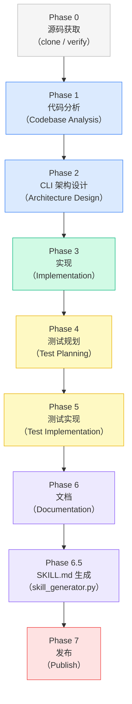

Sources: [HARNESS.md](../../../project-repos/CLI-Anything/HARNESS.md)  [commands/cli-anything.md](../../../project-repos/CLI-Anything/commands/cli-anything.md)

<details class="source-snippets">
<summary>引用源码</summary>

<!-- source-snippets:start -->

#### `HARNESS.md`

> 未找到引用文件：`HARNESS.md`

#### `commands/cli-anything.md`

> 未找到引用文件：`commands/cli-anything.md`

<!-- source-snippets:end -->
</details>
---

## 触发方式

### `/cli-anything <path>` — 全量构建

接收软件本地路径或 GitHub URL，从 Phase 0 开始执行所有阶段直到 Phase 7。

```bash
# 从本地源码构建
/cli-anything /home/user/gimp

# 从 GitHub 仓库构建（自动 clone）
/cli-anything https://github.com/blender/blender
```

参数只接受**源码路径或仓库 URL**，软件名称（如 `"gimp"`）不被接受——Agent 必须能够访问源代码才能完成 Phase 1 的静态分析。

### `/cli-anything:refine <path> [focus]` — 增量精化

在已有 harness 的基础上执行差距分析（Gap Analysis），添加缺失命令，扩充测试。

```bash
# 宽泛精化 — 全面扫描所有能力缺口
/cli-anything:refine /home/user/gimp

# 聚焦精化 — 锁定特定功能域
/cli-anything:refine /home/user/shotcut "vid-in-vid and picture-in-picture features"
/cli-anything:refine /home/user/gimp "all batch processing and scripting filters"
```

`refine` 命令永远只增不减：新增命令、扩充测试、更新文档，不删除已有接口。

Sources: [commands/cli-anything.md](../../../project-repos/CLI-Anything/commands/cli-anything.md)  [commands/refine.md](../../../project-repos/CLI-Anything/cli-anything-plugin/commands/refine.md)

<details class="source-snippets">
<summary>引用源码</summary>

<!-- source-snippets:start -->

#### `commands/cli-anything.md`

> 未找到引用文件：`commands/cli-anything.md`

#### `commands/refine.md`

````markdown
# cli-anything:refine Command

Refine an existing CLI harness to improve coverage of the software's functions and usage patterns.

## CRITICAL: Read HARNESS.md First

**Before refining, read `./HARNESS.md`.** All new commands and tests must follow the same standards as the original build. HARNESS.md is the single source of truth for architecture, patterns, and quality requirements.

## Usage

```bash
/cli-anything:refine <software-path> [focus]
```

## Arguments

- `<software-path>` - **Required.** Local path to the software source code (e.g., `/home/user/gimp`, `./blender`). Must be the same source tree used during the original build.

  **Note:** Only local paths are accepted. If you need to work from a GitHub repo, clone it first with `/cli-anything`, then refine.

- `[focus]` - **Optional.** A natural-language description of the functionality area to focus on. When provided, the agent skips broad gap analysis and instead targets the specified capability area.

  Examples:
  - `/cli-anything:refine /home/user/shotcut "vid-in-vid and picture-in-picture features"`
  - `/cli-anything:refine /home/user/gimp "all batch processing and scripting filters"`
  - `/cli-anything:refine /home/user/blender "particle systems and physics simulation"`
  - `/cli-anything:refine /home/user/inkscape "path boolean operations and clipping"`

  When `[focus]` is provided:
  - Step 2 (Analyze Software Capabilities) narrows to only the specified area
  - Step 3 (Gap Analysis) compares only the focused capabilities against current coverage
  - The agent should still present findings before implementing, but scoped to the focus area

## What This Command Does

This command is used **after** a CLI harness has already been built with `/cli-anything`. It analyzes gaps between the software's full capabilities and what the current CLI covers, then iteratively expands coverage. If a `[focus]` is given, the agent narrows its analysis and implementation to that specific functionality area.

### Step 1: Inventory Current Coverage
- Read the existing CLI entry point (`<software>_cli.py`) and all core modules
- List every command, subcommand, and option currently implemented
- Read the existing test suite to understand what's tested
- Build a coverage map: `{ function_name: covered | not_covered }`

### Step 2: Analyze Software Capabilities
- Re-scan the software source at `<software-path>`
- Identify all public APIs, CLI tools, scripting interfaces, and batch-mode operations
- Focus on functions that produce observable output (renders, exports, transforms, conversions)
- Categorize by domain (e.g., for GIMP: filters, color adjustments, layer ops, selection tools)

### Step 3: Gap Analysis
- Compare current CLI coverage against the software's full capability set
- Prioritize gaps by:
  1. **High impact** — commonly used functions missing from the CLI
  2. **Easy wins** — functions with simple APIs that can be wrapped quickly
  3. **Composability** — functions that unlock new workflows when combined with existing commands
- Present the gap report to the user and confirm which gaps to address

### Step 4: Implement New Commands
- Add new commands/subcommands to the CLI for the selected gaps
- Follow the same patterns as existing commands (as defined in HARNESS.md):
  - Click command groups
  - `--json` output support
  - Session state integration
  - Error handling with `handle_error`
- Add corresponding core module functions in `core/` or `utils/`

### Step 5: Expand Tests
- Add unit tests for every new function in `test_core.py`
- Add E2E tests for new commands in `test_full_e2e.py`
- Add workflow tests that combine new commands with existing ones
- Run all tests (old + new) to ensure no regressions

### Step 6: Update Documentation
- Update `README.md` with new commands and usage examples
- Update `TEST.md` with new test results
- Update the SOP document (`<SOFTWARE>.md`) with new coverage notes

## Example

```bash
# Broad refinement — agent finds gaps across all capabilities
/cli-anything:refine /home/user/gimp

# Focused refinement — agent targets a specific functionality area
/cli-anything:refine /home/user/shotcut "vid-in-vid and picture-in-picture compositing"
/cli-anything:refine /home/user/gimp "batch processing and Script-Fu filters"
/cli-anything:refine /home/user/blender "particle systems and physics simulation"
/cli-anything:refine /home/user/inkscape "path boolean operations and clipping masks"
```

## Success Criteria

- All existing tests still pass (no regressions)
- New commands follow the same architectural patterns (per HARNESS.md)
- New tests achieve 100% pass rate
- Coverage meaningfully improved (new functions exposed via CLI)
- Documentation updated to reflect changes

## Notes

- Refine is incremental — run it multiple times to steadily expand coverage
- Each run should focus on a coherent set of related functions rather than trying to cover everything at once
- The agent should present the gap analysis before implementing, so the user can steer priorities
- Refine never removes existing commands — it only adds or enhances
````

<!-- source-snippets:end -->
</details>
---

## Phase 1：代码分析（Codebase Analysis）

在对软件做任何设计决策之前，必须先读懂它。Phase 1 完成五项分析任务：

| 分析项 | 目标 |
|--------|------|
| **识别后端引擎** | 找出 GUI 背后的核心库/框架（如 Shotcut 背后是 MLT，LibreOffice 内嵌 UNO API） |
| **映射 GUI 操作到 API** | 每一个按钮点击、菜单项都对应一次函数调用；将这些映射关系列表 |
| **识别数据模型** | 理解项目文件格式（XML、JSON、二进制、数据库？）及其状态表示 |
| **发现已有 CLI 工具** | 许多后端自带可执行文件（`melt`、`ffmpeg`、`libreoffice --headless`），这些是构建 CLI 的基础积木 |
| **梳理命令/撤销系统** | 如果应用有撤销/重做功能，它大概率使用了命令模式——这些命令就是 CLI 操作的蓝图 |

分析结果沉淀为一份软件专属的 SOP 文档（如 `GIMP.md`、`BLENDER.md`），供后续阶段参考。

Sources: [HARNESS.md — Phase 1](../../../project-repos/CLI-Anything/HARNESS.md%20%E2%80%94%20Phase%201)

<details class="source-snippets">
<summary>引用源码</summary>

<!-- source-snippets:start -->

#### `HARNESS.md — Phase 1`

> 未找到引用文件：`HARNESS.md — Phase 1`

<!-- source-snippets:end -->
</details>
---

## Phase 2：CLI 架构设计（Architecture Design）

基于分析结论，确定 CLI 的交互模型、命令分组、状态模型和输出格式。

### 交互模型

推荐同时支持两种模式：

- **有状态 REPL**：维护会话上下文，适合 Agent 的多步骤交互
- **单次子命令 CLI**：每次调用无状态，适合脚本化流水线

实现方式是在 Click 主组上设置 `invoke_without_command=True`，当没有子命令时自动进入 REPL：

```python
@click.group(invoke_without_command=True)
@click.pass_context
def cli(ctx, ...):
    if ctx.invoked_subcommand is None:
        ctx.invoke(repl, project_path=None)
```

### 命令分组设计

```
project    — 项目管理（new / open / save / close）
<core-ops> — 软件核心操作（因软件而异）
import     — 导入（文件 I/O、格式转换）
export     — 导出（渲染流水线）
config     — 配置（设置、偏好、配置文件）
session    — 会话/状态管理（undo / redo / history / status）
```

### 状态模型设计

| 问题 | 设计决策 |
|------|---------|
| 哪些状态需要跨命令持久化？ | 打开的项目、光标位置、当前选区 |
| 状态存储在哪里？ | REPL 模式：内存；单次 CLI：JSON 会话文件 |
| 状态如何序列化？ | JSON 会话文件（配合文件锁防并发写入损坏） |

### 输出格式

所有命令**必须**支持 `--json` 标志以输出机器可读格式：

```bash
# 人类可读（表格 + 颜色）
cli-anything-gimp layer list

# Agent 可消费（确定性 JSON）
cli-anything-gimp --json layer list
```

Sources: [HARNESS.md — Phase 2](../../../project-repos/CLI-Anything/HARNESS.md%20%E2%80%94%20Phase%202)

<details class="source-snippets">
<summary>引用源码</summary>

<!-- source-snippets:start -->

#### `HARNESS.md — Phase 2`

> 未找到引用文件：`HARNESS.md — Phase 2`

<!-- source-snippets:end -->
</details>
---

## Phase 3：实现（Implementation）

按照七个子步骤依次构建，从数据层向上叠加：

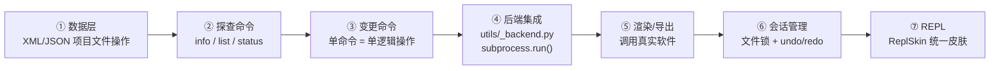

### ④ 后端集成：`utils/<software>_backend.py`

后端模块用 `shutil.which()` 定位可执行文件，用 `subprocess.run()` 调用，并在软件未安装时给出清晰的错误提示：

```python
# utils/lo_backend.py（LibreOffice 示例）
def convert_odf_to(odf_path, output_format, output_path=None, overwrite=False):
    lo = find_libreoffice()   # 未找到时抛出 RuntimeError + 安装指引
    subprocess.run([lo, "--headless", "--convert-to", output_format, ...])
    return {"output": final_path, "format": output_format, "method": "libreoffice-headless"}
```

这是 CLI-Anything **第一原则**的实现：CLI 是软件的命令行接口，而非其替代品。禁止用 Pillow 替代 GIMP、用纯 Python 替代 Blender 渲染。

### ⑥ 会话文件锁（`_locked_save_json`）

防止并发写入损坏 JSON 会话文件的标准模式：以 `"r+"` 打开，加排他锁，在锁内截断后写入：

```python
# 参见 guides/session-locking.md
with open(session_path, "r+") as f:
    fcntl.flock(f, fcntl.LOCK_EX)
    f.seek(0)
    f.truncate()
    json.dump(session_data, f, indent=2)
```

### ⑦ REPL 统一皮肤（`ReplSkin`）

将 `cli-anything-plugin/repl_skin.py` 复制到 `utils/repl_skin.py`，提供品牌化 Banner、样式化提示符、命令历史、格式化帮助和状态展示：

```python
from cli_anything.<software>.utils.repl_skin import ReplSkin

skin = ReplSkin("<software>", version="1.0.0")
skin.print_banner()                          # 品牌化启动框
pt_session = skin.create_prompt_session()    # prompt_toolkit + 历史记录
line = skin.get_input(pt_session, project_name="my_project", modified=True)
skin.success("Saved")    # ✓ 绿色
skin.error("Not found")  # ✗ 红色
skin.warning("Unsaved")  # ⚠ 黄色
skin.table(headers, rows)
skin.progress(3, 10, "Rendering...")
```

`ReplSkin` 优先读取仓库根目录的 `skills/cli-anything-<software>/SKILL.md`，安装到其他位置时回退到包内的 `skills/SKILL.md` 副本。

Sources: [HARNESS.md — Phase 3](../../../project-repos/CLI-Anything/HARNESS.md%20%E2%80%94%20Phase%203)

<details class="source-snippets">
<summary>引用源码</summary>

<!-- source-snippets:start -->

#### `HARNESS.md — Phase 3`

> 未找到引用文件：`HARNESS.md — Phase 3`

<!-- source-snippets:end -->
</details>
---

## Phase 4：测试规划（Test Planning）

**在写任何测试代码之前**，先在 `tests/TEST.md` 中建立完整的测试计划。这份文档必须包含：

1. **测试清单**：列出计划的测试文件及预计用例数（`test_core.py` XX 条、`test_full_e2e.py` XX 条）
2. **单元测试计划**：每个核心模块测什么函数、覆盖哪些边界条件
3. **E2E 测试计划**：将验证哪些真实工作流、生成哪些真实文件、如何做格式校验
4. **真实工作流场景**：多步骤场景的详细描述（YouTube 风格剪辑、蒙太奇拼接、PiP 合成等）

先规划再实现，确保测试覆盖在动手之前就被系统性地思考过。

Sources: [HARNESS.md — Phase 4](../../../project-repos/CLI-Anything/HARNESS.md%20%E2%80%94%20Phase%204)

<details class="source-snippets">
<summary>引用源码</summary>

<!-- source-snippets:start -->

#### `HARNESS.md — Phase 4`

> 未找到引用文件：`HARNESS.md — Phase 4`

<!-- source-snippets:end -->
</details>
---

## Phase 5：测试实现（Test Implementation）

按照 `TEST.md` 计划，分四个层级实现测试：

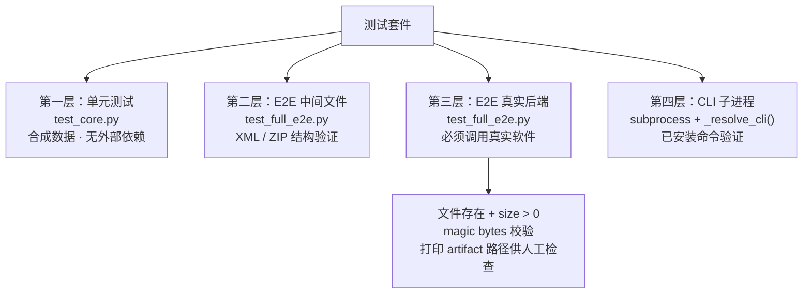

### 真实后端测试（不可妥协）

退出码 0 不等于测试通过。必须对输出物做程序化验证：

```python
# PDF 验证
with open(result["output"], "rb") as f:
    assert f.read(5) == b"%PDF-"

# DOCX/XLSX/PPTX（OOXML = ZIP）
import zipfile
assert zipfile.is_zipfile(result["output"])

# 视频：用 ffmpeg probe 特定帧
# 音频：检查 RMS 电平与时长
```

**必须打印 artifact 路径**以便人工抽检：

```python
print(f"\n  PDF: {result['output']} ({result['file_size']:,} bytes)")
```

### `_resolve_cli` 子进程测试辅助函数

子进程测试通过 `_resolve_cli()` 调用已安装命令，而非硬编码 `sys.executable`：

```python
def _resolve_cli(name):
    """优先使用已安装命令；开发时回退到 python -m。"""
    force = os.environ.get("CLI_ANYTHING_FORCE_INSTALLED", "").strip() == "1"
    path = shutil.which(name)
    if path:
        return [path]
    if force:
        raise RuntimeError(f"{name} not found in PATH. Install with: pip install -e .")
    module = name.replace("cli-anything-", "cli_anything.") + "..." 
    return [sys.executable, "-m", module]
```

在 CI/发布验证时，通过 `CLI_ANYTHING_FORCE_INSTALLED=1` 强制使用已安装命令而非源码回退：

```bash
CLI_ANYTHING_FORCE_INSTALLED=1 python3 -m pytest cli_anything/<software>/tests/ -v -s
```

`-s` 标志可以看到 `[_resolve_cli]` 打印的后端路径确认信息及 artifact 路径。

Sources: [HARNESS.md — Phase 5](../../../project-repos/CLI-Anything/HARNESS.md%20%E2%80%94%20Phase%205)

<details class="source-snippets">
<summary>引用源码</summary>

<!-- source-snippets:start -->

#### `HARNESS.md — Phase 5`

> 未找到引用文件：`HARNESS.md — Phase 5`

<!-- source-snippets:end -->
</details>
---

## Phase 6：文档（Documentation）

运行完所有测试之后，将结果**追加**到已有的 `TEST.md`（而非覆盖）：

1. `pytest -v --tb=no` 的完整输出（所有测试名称与状态）
2. 汇总统计（总数、通过率、执行时间）
3. 覆盖说明（未覆盖的函数或场景）

`TEST.md` 由此成为**测试计划（Phase 4 写入）+ 测试结果（Phase 6 追加）**的完整记录，是每个 harness 必须包含的强制文档。

Sources: [HARNESS.md — Phase 6](../../../project-repos/CLI-Anything/HARNESS.md%20%E2%80%94%20Phase%206)

<details class="source-snippets">
<summary>引用源码</summary>

<!-- source-snippets:start -->

#### `HARNESS.md — Phase 6`

> 未找到引用文件：`HARNESS.md — Phase 6`

<!-- source-snippets:end -->
</details>
---

## Phase 6.5：SKILL.md 生成

SKILL.md 是专为 AI Agent 设计的机器可读能力索引，使 Agent 无需预训练即可发现并正确调用 CLI。

### 生成工具：`skill_generator.py`

`skill_generator.py` 从 harness 目录中自动提取元数据，生成标准化的 SKILL.md 文件：

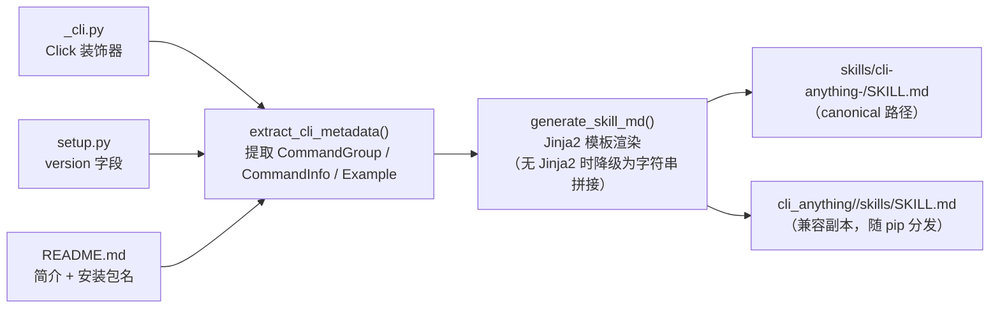

提取逻辑：
- **命令组**：通过正则匹配 `@xxx.group(...)` 装饰器及函数 docstring
- **子命令**：通过正则匹配 `@xxx.command(...)` 装饰器及函数 docstring
- **版本**：从 `setup.py` 的 `version=` 字段提取
- **系统依赖**：从 `README.md` 提取 `apt install` / `brew install` 模式

### SKILL.md 结构

```markdown
---
name: "cli-anything-<software>"
description: "..."
---

# cli-anything-<software>

## Installation
## Usage
## Command Groups
## Examples
## For AI Agents
```

YAML frontmatter 是 skill-creator 发现机制的触发元数据。每个 CLI 封装**必须**包含：

- `--json` 模式的使用说明（Agent 专用）
- 所有命令组的简要描述
- 能演示常见工作流的真实示例

### 两处输出路径

| 路径 | 用途 |
|------|------|
| `skills/cli-anything-<software>/SKILL.md` | 仓库 canonical 路径，ReplSkin Banner 优先读取 |
| `cli_anything/<software>/skills/SKILL.md` | 兼容副本，随 `pip install` 分发到用户机器 |

`setup.py` 中需声明 package_data 以确保副本随包发布：

```python
package_data={
    "cli_anything.<software>": ["skills/*.md"],
},
```

手动调用生成器：

```bash
python3 skill_generator.py /path/to/agent-harness
python3 skill_generator.py /path/to/agent-harness -o /custom/output/SKILL.md
python3 skill_generator.py /path/to/agent-harness -t /custom/template.md
```

Sources: [HARNESS.md — Phase 6.5](../../../project-repos/CLI-Anything/HARNESS.md%20%E2%80%94%20Phase%206.5)  [skill_generator.py](../../../project-repos/CLI-Anything/skill_generator.py)

<details class="source-snippets">
<summary>引用源码</summary>

<!-- source-snippets:start -->

#### `HARNESS.md — Phase 6.5`

> 未找到引用文件：`HARNESS.md — Phase 6.5`

#### `skill_generator.py`

> 未找到引用文件：`skill_generator.py`

<!-- source-snippets:end -->
</details>
---

## Phase 7：发布（Publish）

利用 **PEP 420 命名空间包**，将 CLI 封装发布为独立的 PyPI 包，同时与其他封装共享 `cli_anything` 命名空间。

### 目录结构规则

```
agent-harness/
├── setup.py                   # PyPI 配置（Phase 7 创建）
└── cli_anything/              # 命名空间包——禁止 __init__.py
    └── <software>/            # 子包——必须有 __init__.py
        ├── __init__.py
        ├── <software>_cli.py
        ├── core/
        ├── utils/
        └── tests/
```

`cli_anything/` **必须没有** `__init__.py`——这是 PEP 420 命名空间包的关键。多个独立安装的包（`cli-anything-gimp`、`cli-anything-blender`）可以在同一 Python 环境中共存，各自贡献 `cli_anything/gimp/` 和 `cli_anything/blender/` 而不冲突。

### `setup.py` 核心配置

```python
from setuptools import setup, find_namespace_packages

setup(
    name="cli-anything-<software>",
    version="1.0.0",
    packages=find_namespace_packages(include=["cli_anything.*"]),
    package_data={"cli_anything.<software>": ["skills/*.md"]},
    entry_points={
        "console_scripts": [
            "cli-anything-<software>=cli_anything.<software>.<software>_cli:cli",
        ],
    },
)
```

### 安装与验证

```bash
# 本地可编辑安装
pip install -e .

# 验证 CLI 已在 PATH 中
which cli-anything-<software>
cli-anything-<software> --help
```

Sources: [HARNESS.md — Phase 7](../../../project-repos/CLI-Anything/HARNESS.md%20%E2%80%94%20Phase%207)  [commands/cli-anything.md](../../../project-repos/CLI-Anything/commands/cli-anything.md)

<details class="source-snippets">
<summary>引用源码</summary>

<!-- source-snippets:start -->

#### `HARNESS.md — Phase 7`

> 未找到引用文件：`HARNESS.md — Phase 7`

#### `commands/cli-anything.md`

> 未找到引用文件：`commands/cli-anything.md`

<!-- source-snippets:end -->
</details>
---

## 架构陷阱与关键原则

### 第一原则：必须调用真实软件

这是整个 harness 方法论最核心也最常被违反的规则。

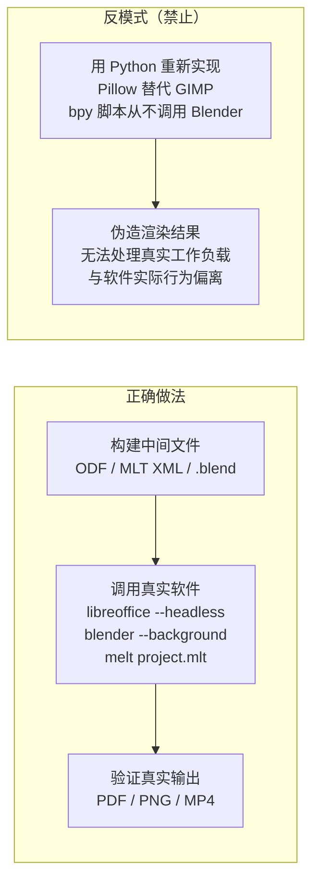

软件是硬依赖，不是可选项。未安装时必须报错并给出安装指引，而非降级到 fallback 库。

### 第二陷阱：渲染缺口（Rendering Gap）

CLI 修改了项目文件中的滤镜/效果，但渲染时若使用简单工具（如 `ffmpeg concat demuxer`），这些效果会被静默忽略，输出与输入一模一样。

解决方案（优先级从高到低）：
1. **使用软件原生渲染器**（`melt` 读取 MLT 项目文件并应用所有效果）
2. **滤镜翻译层**（将项目格式的效果转换为渲染工具的原生语法，例如 MLT 滤镜 → ffmpeg `-filter_complex`）
3. **生成渲染脚本**（让用户手动执行）

每一个注册到效果仓库的滤镜，**必须**有对应的渲染映射，或明确标注为"仅限项目文件，不参与渲染"。

### 其他关键注意事项

| 场景 | 规则 |
|------|------|
| 非整数帧率（29.97fps） | 用 `round()` 而非 `int()`，使用整数算术显示时间码，允许 ±1 帧误差 |
| 滤镜翻译 | 注意重复滤镜合并、交错流排序、参数量纲差异、无法映射的效果 |
| 输出验证 | 视频：用 ffmpeg probe 特定帧；音频：检查 RMS 电平；PDF：magic bytes `%PDF-`；OOXML：验证 ZIP 结构 |
| MCP 后端 | 对没有原生 CLI 但暴露 MCP 服务器的软件（如 DOMShell），参见 `guides/mcp-backend.md` |

Sources: [HARNESS.md — Architecture Patterns & Pitfalls](../../../project-repos/CLI-Anything/HARNESS.md%20%E2%80%94%20Architecture%20Patterns%20%26%20Pitfalls)

<details class="source-snippets">
<summary>引用源码</summary>

<!-- source-snippets:start -->

#### `HARNESS.md — Architecture Patterns & Pitfalls`

> 未找到引用文件：`HARNESS.md — Architecture Patterns & Pitfalls`

<!-- source-snippets:end -->
</details>
---

## 完整目录结构参考

```
<software>/
└── agent-harness/
    ├── <SOFTWARE>.md              # 软件专属 SOP（Phase 1/2 产出）
    ├── setup.py                   # PyPI 配置（Phase 7 创建）
    └── cli_anything/              # 命名空间包（禁止 __init__.py）
        └── <software>/            # 子包（必须有 __init__.py）
            ├── __init__.py
            ├── __main__.py        # python3 -m cli_anything.<software>
            ├── README.md          # 安装与使用指南（强制）
            ├── <software>_cli.py  # Click 入口点 + REPL
            ├── core/              # 核心模块（每个域一个文件）
            │   ├── __init__.py
            │   ├── project.py     # 项目 create/open/save/info
            │   ├── export.py      # 渲染流水线 + 滤镜翻译
            │   ├── session.py     # 有状态会话、undo/redo
            │   └── ...
            ├── utils/             # 共享工具
            │   ├── __init__.py
            │   ├── <software>_backend.py  # 后端：调用真实软件
            │   └── repl_skin.py           # 统一 REPL 皮肤（从插件复制）
            └── tests/             # 测试套件
                ├── TEST.md        # 测试计划 + 结果（强制）
                ├── test_core.py   # 单元测试（合成数据）
                └── test_full_e2e.py  # E2E 测试（真实文件）

# Canonical skill 路径（仓库根）
skills/
└── cli-anything-<software>/
    └── SKILL.md
```

Sources: [HARNESS.md — Directory Structure](../../../project-repos/CLI-Anything/HARNESS.md%20%E2%80%94%20Directory%20Structure)

<details class="source-snippets">
<summary>引用源码</summary>

<!-- source-snippets:start -->

#### `HARNESS.md — Directory Structure`

> 未找到引用文件：`HARNESS.md — Directory Structure`

<!-- source-snippets:end -->
</details>
---

## 相关页面

- [项目概览](overview.md)
- [测试与质量保障](testing-and-quality.md)

---

<details>
<summary>相关源文件</summary>

生成本页时使用的主要源文件：

- [cli-anything-plugin/HARNESS.md](../../../project-repos/CLI-Anything/cli-anything-plugin/HARNESS.md)
- [cli-anything-plugin/repl_skin.py](../../../project-repos/CLI-Anything/cli-anything-plugin/repl_skin.py)
- [blender/agent-harness/setup.py](../../../project-repos/CLI-Anything/blender/agent-harness/setup.py)
- [gimp/agent-harness/GIMP.md](../../../project-repos/CLI-Anything/gimp/agent-harness/GIMP.md)

</details>

# Harness 包结构与实现模式

每个 CLI Harness 是一个独立的 Python 包，遵循统一的目录约定、命名规范与实现模式。本页详细说明该结构的各组成部分，以及背后的设计决策。

---

## 1. 目录结构总览

每个 Harness 部署在 `<software>/agent-harness/` 目录下，布局如下：

```
<software>/agent-harness/
├── setup.py                             # pip 安装入口，定义 cli-anything-<software> 命令
├── <SOFTWARE>.md                        # 针对该应用的架构分析与 SOP
├── cli_anything/                        # PEP 420 命名空间包（无 __init__.py）
│   └── <software>/                      # 子包（有 __init__.py）
│       ├── __init__.py
│       ├── __main__.py                  # python3 -m cli_anything.<software> 入口
│       ├── README.md                    # 安装与使用说明（必需）
│       ├── <software>_cli.py            # Click CLI 主入口（@click.group + REPL）
│       ├── core/                        # 核心逻辑模块
│       │   ├── __init__.py
│       │   ├── project.py               # 项目状态管理
│       │   ├── export.py                # 渲染流水线
│       │   ├── session.py               # 有状态会话、undo/redo
│       │   └── ...                      # 领域特定模块
│       ├── utils/
│       │   ├── __init__.py
│       │   ├── repl_skin.py             # 统一 REPL 皮肤（从插件复制）
│       │   ├── <software>_backend.py    # 后端封装（发现并调用真实软件）
│       │   └── helpers.py
│       ├── skills/
│       │   └── SKILL.md                 # 包内兼容副本（安装后可用）
│       └── tests/
│           ├── TEST.md                  # 测试计划 + 结果文档（必需）
│           ├── test_core.py             # 单元测试
│           └── test_full_e2e.py         # 端到端测试
└── examples/                            # 示例脚本与工作流
```

> **关键约束**：`cli_anything/` 目录**不能包含** `__init__.py`。这使其成为 PEP 420 命名空间包——多个独立安装的 PyPI 包可以分别向 `cli_anything/` 命名空间贡献子包（如 `cli_anything.gimp`、`cli_anything.blender`），互不冲突。

Sources: [HARNESS.md:674-710](../../../project-repos/CLI-Anything/HARNESS.md#L674-L710)

<details class="source-snippets">
<summary>引用源码</summary>

<!-- source-snippets:start -->

#### `HARNESS.md:674-710`

> 未找到引用文件：`HARNESS.md`

<!-- source-snippets:end -->
</details>
---

## 2. 包结构与命名空间

### 2.1 命名约定

所有 Harness 包遵循统一命名规则：

| 层次 | 规则 | 示例 |
|------|------|------|
| PyPI 包名 | `cli-anything-<software>` | `cli-anything-blender` |
| Python 导入路径 | `cli_anything.<software>` | `cli_anything.blender` |
| 命令行入口 | `cli-anything-<software>` | `cli-anything-blender` |
| 主模块 | `cli_anything/<software>/<software>_cli.py` | `blender_cli.py` |

### 2.2 setup.py 结构

`setup.py` 是 Harness 可安装性的核心，以 Blender 为例：

```python
setup(
    name="cli-anything-blender",
    version="1.0.0",
    packages=find_namespace_packages(include=("cli_anything.*",)),
    entry_points={
        "console_scripts": [
            "cli-anything-blender=cli_anything.blender.blender_cli:main",
        ],
    },
    package_data={
        "cli_anything.blender": ["skills/*.md"],   # 随包发布 SKILL.md
    },
    install_requires=[
        "click>=8.1",
        "prompt-toolkit>=3.0",
    ],
    python_requires=">=3.10",
)
```

`find_namespace_packages(include=("cli_anything.*",))` 会自动发现所有 `cli_anything/` 下的子包，而不会将 `cli_anything/` 本身注册为普通包——这是实现命名空间共存的关键。

Sources: [blender/agent-harness/setup.py:23-88](../../../project-repos/CLI-Anything/blender/agent-harness/setup.py#L23-L88)

<details class="source-snippets">
<summary>引用源码</summary>

<!-- source-snippets:start -->

#### `blender/agent-harness/setup.py:23-88`

```python
setup(
    name="cli-anything-blender",
    version="1.0.0",
    description="CLI harness for Blender - run 3D modeling, animation, and rendering via blender --background --python",
    long_description=long_description,
    long_description_content_type="text/markdown",

    author="cli-anything contributors",
    author_email="",
    url="https://github.com/HKUDS/CLI-Anything",

    project_urls={
        "Source": "https://github.com/HKUDS/CLI-Anything",
        "Tracker": "https://github.com/HKUDS/CLI-Anything/issues",
    },

    license="MIT",

    packages=find_namespace_packages(include=("cli_anything.*",)),

    python_requires=">=3.10",

    install_requires=[
        "click>=8.1",
        "prompt-toolkit>=3.0",
    ],

    extras_require={
        "dev": [
            "pytest>=7",
            "pytest-cov>=4",
        ],
    },

    entry_points={
        "console_scripts": [
            "cli-anything-blender=cli_anything.blender.blender_cli:main",
        ],
    },
    package_data={
        "cli_anything.blender": ["skills/*.md"],
    },
    include_package_data=True,
    zip_safe=False,

    keywords=[
        "cli",
        "blender",
        "3d",
        "rendering",
        "automation",
    ],

    classifiers=[
        "Development Status :: 4 - Beta",
        "Intended Audience :: Developers",
        "Topic :: Multimedia :: Graphics :: 3D Modeling",
        "Topic :: Software Development :: Libraries :: Python Modules",
        "License :: OSI Approved :: MIT License",

        "Programming Language :: Python :: 3",
        "Programming Language :: Python :: 3.10",
        "Programming Language :: Python :: 3.11",
        "Programming Language :: Python :: 3.12",
    ],
)
```

<!-- source-snippets:end -->
</details>
---

## 3. 包组件关系图

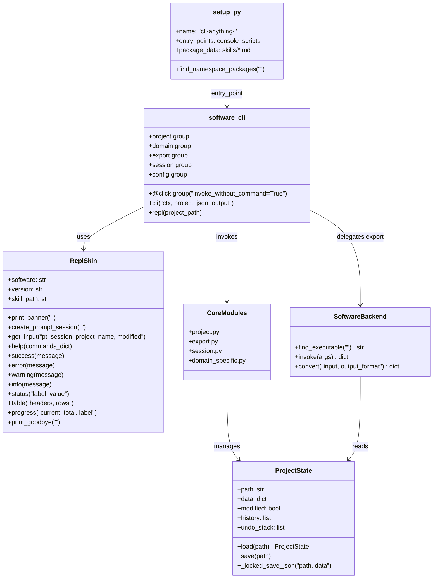

---

## 4. Click CLI 架构

### 4.1 主入口模式

每个 Harness 的主 CLI 文件使用 `invoke_without_command=True`——当用户不带子命令运行时，自动进入 REPL 交互模式：

```python
@click.group(invoke_without_command=True)
@click.option("--project", "-p", default=None, help="项目文件路径")
@click.option("--json", "json_output", is_flag=True, help="以 JSON 格式输出")
@click.pass_context
def cli(ctx, project, json_output):
    ctx.ensure_object(dict)
    ctx.obj["json_output"] = json_output
    ctx.obj["project"] = project

    if ctx.invoked_subcommand is None:
        # 没有子命令 → 进入 REPL
        ctx.invoke(repl, project_path=project)
```

这确保了 `cli-anything-<software>`（不带参数）默认进入交互式 REPL，而 `cli-anything-<software> project new` 则直接执行子命令并退出。

### 4.2 标准命令组

每个 Harness 按逻辑域组织命令，形成以下标准命令组：

| 命令组 | 职责 | 典型子命令 |
|--------|------|-----------|
| `project` | 项目文件管理 | `new`, `open`, `save`, `info`, `close` |
| `<domain>` | 应用核心操作 | 领域特定（如 `layer`, `track`, `scene`） |
| `export` | 渲染与格式转换 | `render`, `list-formats`, `preview` |
| `session` | 会话与历史 | `undo`, `redo`, `history`, `status` |
| `config` | 设置与偏好 | `get`, `set`, `list`, `reset` |

### 4.3 `--json` 双输出模式

每个命令都必须支持 `--json` 标志，实现双输出：

```python
@cli.command("info")
@click.pass_context
def project_info(ctx):
    proj = load_project(ctx.obj["project"])
    data = {
        "name": proj["name"],
        "layers": len(proj["layers"]),
        "modified": proj.get("modified", False),
    }
    if ctx.obj["json_output"]:
        click.echo(json.dumps(data, indent=2))   # Agent 消费：结构化 JSON
    else:
        skin.status("Name", data["name"])        # 人类消费：带颜色的表格
        skin.status("Layers", str(data["layers"]))
```

这一模式使同一个 CLI 既能在终端交互使用，也能被 AI Agent 以程序化方式调用并解析输出。

Sources: [HARNESS.md:28-48, 99-109](../../../project-repos/CLI-Anything/HARNESS.md:28-48%2C%2099-109)

<details class="source-snippets">
<summary>引用源码</summary>

<!-- source-snippets:start -->

#### `HARNESS.md:28-48, 99-109`

> 未找到引用文件：`HARNESS.md:28-48, 99-109`

<!-- source-snippets:end -->
</details>
---

## 5. ReplSkin：统一 REPL 皮肤

`repl_skin.py` 是所有 Harness 共享的 REPL 界面层，从插件复制到每个包的 `utils/` 目录。

### 5.1 初始化与主题

```python
from cli_anything.<software>.utils.repl_skin import ReplSkin

skin = ReplSkin("<software>", version="1.0.0")
```

每个软件有专属的强调色，实现视觉区分：

| 软件 | 颜色 | ANSI 代码 |
|------|------|-----------|
| gimp | 暖橙色 | `\033[38;5;214m` |
| blender | 深橙色 | `\033[38;5;208m` |
| inkscape | 亮蓝色 | `\033[38;5;39m` |
| libreoffice | 绿色 | `\033[38;5;40m` |
| shotcut | 蓝绿色 | `\033[38;5;35m` |
| 默认 | 天蓝色 | `\033[38;5;75m` |

### 5.2 Banner 与技能路径发现

`print_banner()` 在 REPL 启动时显示品牌框，并自动解析 `SKILL.md` 路径供 AI Agent 读取：

```
╭────────────────────────────────────────────────────────────────────────╮
│ ◆  cli-anything · Blender                                              │
│    v1.0.0                                                              │
│ ◇ Install:      npx skills add HKUDS/CLI-Anything --skill cli-any...  │
│ ◇ Global skill: ~/.agents/skills/cli-anything-blender/SKILL.md        │
│                                                                        │
│    Type help for commands, quit to exit                                │
╰────────────────────────────────────────────────────────────────────────╯
```

**路径解析优先级**（`ReplSkin.__init__` 中实现）：

1. 优先：仓库根目录的 `skills/cli-anything-<software>/SKILL.md`（monorepo 开发环境）
2. 降级：包内副本 `cli_anything/<software>/skills/SKILL.md`（pip 安装后）

```python
# repl_skin.py 路径解析逻辑
package_skill = Path(__file__).resolve().parent.parent / "skills" / "SKILL.md"
repo_skill = None
for parent in Path(__file__).resolve().parents:
    candidate = parent / "skills" / self.skill_id / "SKILL.md"
    if candidate.is_file():
        repo_skill = candidate
        break
skill_path = str(repo_skill) if repo_skill else str(package_skill)
```

### 5.3 完整 API 参考

| 方法 | 输出样式 | 用途 |
|------|----------|------|
| `print_banner()` | 品牌边框 | REPL 启动时调用一次 |
| `create_prompt_session()` | — | 创建 prompt_toolkit 会话（含历史记录） |
| `get_input(pt_session, project_name, modified)` | 彩色提示符 | REPL 主循环获取用户输入 |
| `help(commands_dict)` | 对齐列表 | 显示命令帮助 |
| `success(message)` | `✓` 绿色 | 操作成功 |
| `error(message)` | `✗` 红色（stderr） | 操作失败 |
| `warning(message)` | `⚠` 黄色 | 注意事项 |
| `info(message)` | `●` 蓝色 | 进度信息 |
| `status(label, value)` | 键值对 | 显示状态字段 |
| `status_block(items, title)` | 对齐键值块 | 批量状态显示 |
| `table(headers, rows)` | 框线表格 | 列表数据 |
| `progress(current, total, label)` | `█░` 进度条 | 长时操作进度 |
| `print_goodbye()` | `▸ Goodbye!` | REPL 退出时调用 |

### 5.4 REPL 主循环典型结构

```python
@cli.command("repl")
@click.pass_context
def repl(ctx, project_path):
    skin = ReplSkin("<software>", version="1.0.0")
    skin.print_banner()
    pt_session = skin.create_prompt_session()

    while True:
        try:
            line = skin.get_input(pt_session,
                                  project_name=current_project_name(),
                                  modified=is_modified())
        except (KeyboardInterrupt, EOFError):
            break

        if not line or line in ("exit", "quit"):
            break
        if line == "help":
            skin.help(COMMANDS)
            continue

        # 将输入转发给 Click 命令解析
        try:
            args = shlex.split(line)
            cli.main(args=args, obj=ctx.obj, standalone_mode=False)
        except Exception as e:
            skin.error(str(e))

    skin.print_goodbye()
```

Sources: [repl_skin.py:106-568](../../../project-repos/CLI-Anything/repl_skin.py#L106-L568), [HARNESS.md:77-110](../../../project-repos/CLI-Anything/HARNESS.md#L77-L110)

<details class="source-snippets">
<summary>引用源码</summary>

<!-- source-snippets:start -->

#### `repl_skin.py:106-568`

> 未找到引用文件：`repl_skin.py`

#### `HARNESS.md:77-110`

> 未找到引用文件：`HARNESS.md`

<!-- source-snippets:end -->
</details>
---

## 6. 后端集成模式

### 6.1 Backend 模块职责

每个 Harness 的 `utils/<software>_backend.py` 封装对真实软件的调用，承担三项职责：

1. **可执行文件发现** — 使用 `shutil.which()` 定位软件，找不到时抛出含安装指南的 `RuntimeError`
2. **参数构建与调用** — 通过 `subprocess.run()` 调用真实软件
3. **输出结构化** — 将调用结果封装为 dict，便于上层 JSON 输出

```python
# utils/lo_backend.py（LibreOffice 示例）
import shutil, subprocess

def find_libreoffice():
    for name in ("libreoffice", "soffice"):
        path = shutil.which(name)
        if path:
            return path
    raise RuntimeError(
        "LibreOffice not found. Install: sudo apt install libreoffice"
    )

def convert_odf_to(odf_path, output_format, output_dir=None, overwrite=False):
    lo = find_libreoffice()
    cmd = [lo, "--headless", "--convert-to", output_format]
    if output_dir:
        cmd += ["--outdir", output_dir]
    cmd.append(odf_path)
    subprocess.run(cmd, check=True, capture_output=True)
    return {
        "output": final_path,
        "format": output_format,
        "method": "libreoffice-headless",
    }
```

### 6.2 主要软件的后端调用方式

| 软件 | 后端模块 | 调用方式 |
|------|----------|----------|
| LibreOffice | `lo_backend.py` | `libreoffice --headless --convert-to <fmt>` |
| Blender | `blender_backend.py` | `blender --background --python script.py` |
| GIMP | `gimp_backend.py` | `gimp -i -b '(script-fu-console-eval ...)'` |
| Inkscape | `inkscape_backend.py` | `inkscape --actions="..." --export-filename=...` |
| Shotcut | `shotcut_backend.py` | `melt project.mlt -consumer avformat:output.mp4` |
| Audacity | `audacity_backend.py` | `sox` 命令处理音频 |

> **核心原则**：CLI 是软件的接口层，而非替代品。必须调用真实软件完成渲染和导出，禁止用 Python 重新实现软件功能。

Sources: [HARNESS.md:308-347](../../../project-repos/CLI-Anything/HARNESS.md#L308-L347)

<details class="source-snippets">
<summary>引用源码</summary>

<!-- source-snippets:start -->

#### `HARNESS.md:308-347`

> 未找到引用文件：`HARNESS.md`

<!-- source-snippets:end -->
</details>
---

## 7. 状态模型与会话锁定

### 7.1 JSON 会话文件

项目状态以 JSON 文件存储，包含 undo/redo 栈：

```json
{
  "version": "1.0",
  "name": "my_project",
  "modified": false,
  "history": [
    {"action": "layer_add", "params": {"name": "Background"}, "timestamp": "..."}
  ],
  "undo_stack": [...],
  "data": { ... }
}
```

### 7.2 文件锁定写入

并发写入保护通过 `_locked_save_json` 实现——以 `"r+"` 模式打开文件，在锁内截断再写入，防止多进程同时修改会话文件时数据损坏：

```python
import fcntl, json

def _locked_save_json(path: str, data: dict):
    """使用文件锁安全写入 JSON 会话文件。"""
    with open(path, "r+") as f:
        fcntl.flock(f, fcntl.LOCK_EX)   # 独占锁
        try:
            f.seek(0)
            f.truncate()                  # 在锁内截断
            json.dump(data, f, indent=2, ensure_ascii=False)
        finally:
            fcntl.flock(f, fcntl.LOCK_UN)
```

Sources: [HARNESS.md:69-73](../../../project-repos/CLI-Anything/HARNESS.md#L69-L73)

<details class="source-snippets">
<summary>引用源码</summary>

<!-- source-snippets:start -->

#### `HARNESS.md:69-73`

> 未找到引用文件：`HARNESS.md`

<!-- source-snippets:end -->
</details>
---

## 8. 已有 Harness 的统计概览

| 软件 | 测试数 | 后端类型 | 原生格式 |
|------|--------|----------|----------|
| Blender | 208 | `bpy` 脚本 + `blender --background` | `.blend-cli.json` |
| GIMP | 107 | Pillow + Script-Fu | `.gimp-cli.json` |
| LibreOffice | 158 | ODF XML + `libreoffice --headless` | `.odt/.ods/.odp` |
| sbox (Source 2) | 244 | Source 2 JSON | `.vmap/.vmat` |

GIMP 的架构文档（`GIMP.md`）详细记录了为何选择 Pillow 而非直接操作 XCF 二进制格式——XCF 的 `xcf-load.c` 超过 5000 行 C 代码，解析成本极高，因此改用 JSON 清单 + Pillow 内存层栈 + GIMP batch 导出的三层策略。

Sources: [HARNESS.md:715-730](../../../project-repos/CLI-Anything/HARNESS.md#L715-L730), [GIMP.md:38-57](../../../project-repos/CLI-Anything/gimp/agent-harness/GIMP.md#L38-L57)

<details class="source-snippets">
<summary>引用源码</summary>

<!-- source-snippets:start -->

#### `HARNESS.md:715-730`

> 未找到引用文件：`HARNESS.md`

#### `GIMP.md:38-57`

```markdown
Unlike Shotcut (which manipulates XML project files), GIMP's native .xcf format
is a complex binary format. Our strategy:

1. **Pillow** — Python's standard imaging library. Handles image I/O (PNG, JPEG,
   TIFF, BMP, GIF, WebP, etc.), pixel manipulation, basic filters, color
   adjustments, drawing, and compositing. This is our primary engine.
2. **GEGL CLI** — If available, use `gegl` command for advanced operations.
3. **GIMP batch mode** — If `gimp` is installed, use `gimp -i -b` for XCF
   operations and advanced filters via Script-Fu/Python-Fu.

### Why Not XCF Directly?

XCF is a tile-based binary format with compression, layers, channels, paths,
and GEGL filter graphs. Parsing it from scratch is extremely complex (5000+ lines
of C in GIMP's xcf-load.c). Instead:
- For new projects, we build layer stacks in memory using Pillow
- For XCF import/export, we delegate to GIMP batch mode if available
- Our "project file" is a JSON manifest tracking layers, operations, and history

## The Project Format (.gimp-cli.json)
```

<!-- source-snippets:end -->
</details>
---

## 9. 文档必备文件

每个 Harness 目录下有两个必需文档：

### `README.md`（位于 `cli_anything/<software>/`）

必须说明：
- 如何安装软件依赖（`apt install`、`brew install` 等）
- 如何以开发模式安装 CLI（`pip install -e .`）
- 如何运行测试
- 基本使用示例

### `TEST.md`（位于 `cli_anything/<software>/tests/`）

采用"先计划，后填写结果"的两阶段写法：

**Phase 4（写测试代码前）**：
- 测试文件清单及预估测试数
- 每个模块的单元测试计划（测哪些函数、哪些边界条件）
- E2E 测试计划（测哪些真实工作流、验证哪些输出属性）

**Phase 6（所有测试通过后追加）**：
- 完整的 `pytest -v --tb=no` 输出
- 汇总统计（总测试数、通过率、耗时）
- 覆盖缺口说明

这使 TEST.md 同时承担测试计划与测试结果文档的双重角色。

Sources: [HARNESS.md:111-231](../../../project-repos/CLI-Anything/HARNESS.md#L111-L231)

<details class="source-snippets">
<summary>引用源码</summary>

<!-- source-snippets:start -->

#### `HARNESS.md:111-231`

> 未找到引用文件：`HARNESS.md`

<!-- source-snippets:end -->
</details>
---

## 10. 包安装与命名空间共存

多个 Harness 可以在同一 Python 环境中共存，互不干扰：

```bash
pip install cli-anything-gimp
pip install cli-anything-blender
pip install cli-anything-libreoffice

# 三个命令均可用，模块路径各自独立
cli-anything-gimp --help
cli-anything-blender --help
cli-anything-libreoffice --help

# Python 导入互不冲突
from cli_anything.gimp import ...
from cli_anything.blender import ...
```

这依赖 PEP 420 命名空间包机制：`cli_anything/` 不包含 `__init__.py`，Python 会将所有安装包中的 `cli_anything/` 子目录合并为同一命名空间，各子包独立注册。

Sources: [HARNESS.md:296-305](../../../project-repos/CLI-Anything/HARNESS.md#L296-L305)

<details class="source-snippets">
<summary>引用源码</summary>

<!-- source-snippets:start -->

#### `HARNESS.md:296-305`

> 未找到引用文件：`HARNESS.md`

<!-- source-snippets:end -->
</details>
## 相关页面

- [七阶段生成流水线](seven-phase-pipeline.md) — Harness 是如何通过流水线自动生成的
- [系统架构](system-architecture.md) — Harness 层在整体架构中的位置
- [测试与质量���障](testing-and-quality.md) — Harness 的多层测试���略

---

<details>
<summary>相关源文件</summary>

生成本页时使用的主要源文件：

- [cli-hub/cli_hub/cli.py](../../../project-repos/CLI-Anything/cli-hub/cli_hub/cli.py)
- [cli-hub/cli_hub/registry.py](../../../project-repos/CLI-Anything/cli-hub/cli_hub/registry.py)
- [cli-hub/cli_hub/installer.py](../../../project-repos/CLI-Anything/cli-hub/cli_hub/installer.py)
- [cli-hub/cli_hub/analytics.py](../../../project-repos/CLI-Anything/cli-hub/cli_hub/analytics.py)
- [cli-hub/setup.py](../../../project-repos/CLI-Anything/cli-hub/setup.py)
- [registry.json](../../../project-repos/CLI-Anything/registry.json)
- [public_registry.json](../../../project-repos/CLI-Anything/public_registry.json)

</details>

# CLI-Hub 包管理器

CLI-Hub 是 CLI-Anything 生态的官方包管理器，以 `pip install cli-anything-hub` 发布（PyPI 包名 `cli-anything-hub`，入口命令 `cli-hub`）。它负责从两个互补的注册表中发现、安装、更新和启动各类 CLI，支持 pip、npm、uv、bundled 和通用命令五种安装策略，并内置 PostHog/Umami 双提供商分析模块以及自动 Agent 身份识别能力。

---

## 1. 整体定位

CLI-Hub 在 CLI-Anything 架构中处于"用户接触层"——Agent 或人类开发者与其交互，通过它获取所有已索引的 CLI 封装。其核心功能链条如下：

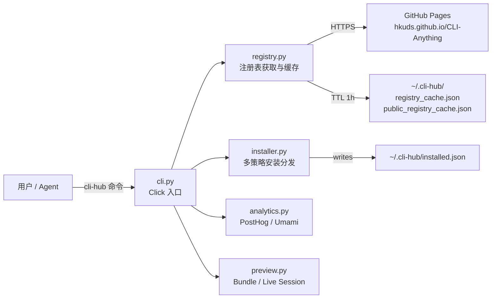

Sources: `cli-hub/cli_hub/cli.py:1-34`, `cli-hub/setup.py:1-49`

---

## 2. 安装与入口

```bash
pip install cli-anything-hub
```

安装后获得 `cli-hub` 命令。`setup.py` 中声明的关键元数据：

| 字段 | 值 |
|---|---|
| PyPI 包名 | `cli-anything-hub` |
| 入口命令 | `cli-hub` |
| Python 版本要求 | >= 3.10 |
| 运行时依赖 | `click>=8.0`, `requests>=2.28` |
| 当前版本 | 0.3.0 |
| 许可证 | MIT |

Sources: `cli-hub/setup.py:5-49`

---

## 3. 命令参考

所有命令均通过 Click 框架注册于 `cli.py` 中的 `main` Click group。

### 3.1 顶层入口

```
cli-hub [--version]
```

无子命令时输出帮助。`--version` 打印当前版本号。每次调用都会触发：

1. `track_first_run()` — 首次运行时发送一次性 `cli-anything-hub-installed` 事件
2. `track_visit(command=..., detection=...)` — 记录每次调用及 Agent 身份识别结果

Sources: `cli-hub/cli_hub/cli.py:50-61`

---

### 3.2 install

```
cli-hub install <name>
```

按名称安装 CLI。流程：

1. 调用 `install_cli(name)`，内部查找注册表 → 决定策略 → 执行安装
2. 安装成功后写入 `~/.cli-hub/installed.json`
3. 发送 `cli-install` 分析事件（携带版本号和平台信息）
4. 输出 `entry_point` 和 `cli-hub launch <name>` 提示

对于 public npm CLIs，还会额外提示 `npx_cmd`。

Sources: `cli-hub/cli_hub/cli.py:73-90`

---

### 3.3 uninstall

```
cli-hub uninstall <name>
```

卸载已安装的 CLI。成功后从 `installed.json` 移除记录并发送 `cli-uninstall` 事件。

Sources: `cli-hub/cli_hub/cli.py:93-103`

---

### 3.4 update

```
cli-hub update <name>
```

强制刷新注册表缓存（`force_refresh=True`）后执行更新操作。pip 策略使用 `--upgrade --force-reinstall`，npm 策略追加 `@latest`，uv 策略调用 `update_cmd`。

Sources: `cli-hub/cli_hub/cli.py:106-118`, `cli-hub/cli_hub/installer.py:188-196`

---

### 3.5 list

```
cli-hub list [--category <cat>] [--source harness|public|npm|all] [--json]
```

列出所有可用 CLI，默认按 category 分组显示。

- `--category` / `-c`：按类别过滤（大小写不敏感）
- `--source` / `-s`：按来源过滤；`npm` 为 `public` 的别名
- `--json`：输出完整 JSON 数组，适合脚本消费

输出末尾显示汇总统计（total / harness / public 数量，已安装数，全部类别列表）。已安装的 CLI 旁边显示绿色 `●` 标记，public CLIs 显示黄色来源标签。

Sources: `cli-hub/cli_hub/cli.py:121-174`

---

### 3.6 search

```
cli-hub search <query> [--json]
```

在 name、description、category、display_name 四个字段上做大小写不敏感子串匹配。结果按注册表顺序排列，每条结果显示安装状态标记、类别标签和来源标签，并附上 `cli-hub install <name>` 快捷提示。

Sources: `cli-hub/cli_hub/cli.py:177-200`, `cli-hub/cli_hub/registry.py:100-110`

---

### 3.7 info

```
cli-hub info <name>
```

显示单个 CLI 的完整详情：display_name、description、category、source、package_manager、version、requires、entry_point、homepage、contributors、安装状态。public CLIs 额外显示 npm_package、npx_cmd、install_cmd、install_notes。

Sources: `cli-hub/cli_hub/cli.py:203-241`

---

### 3.8 launch

```
cli-hub launch <name> [args...]
```

通过 `os.execvp()` 以进程替换方式启动已安装的 CLI，所有额外参数透传给目标进程。启动前检查 `entry_point` 是否在 PATH 上；未找到时打印安装提示后退出。调用成功时发送 `cli-launch` 事件。

```python
os.execvp(entry, [entry] + list(args))
```

Sources: `cli-hub/cli_hub/cli.py:244-264`

---

### 3.9 previews 子命令组

```
cli-hub previews inspect  <preview_ref> [--json]
cli-hub previews html     <preview_ref> [-o output.html] [--poll-ms 1500]
cli-hub previews watch    <session_ref> [--poll-ms 1500] [--port 0] [--open]
cli-hub previews open     <preview_ref> [-o output.html] [--poll-ms 1500] [--port 0]
```

用于检查 preview bundle 或实时 session 的内容，不负责发布预览。`is_live_session_ref()` 区分静态 bundle 和实时 session 两条处理路径。

Sources: `cli-hub/cli_hub/cli.py:267-368`

---

## 4. 注册表系统

### 4.1 双注册表架构

CLI-Hub 维护两个独立注册表，均以 JSON 格式托管在 GitHub Pages：

| 注册表 | URL | 说明 |
|---|---|---|
| `registry.json` | `https://hkuds.github.io/CLI-Anything/registry.json` | CLI-Anything 官方 Harness CLIs |
| `public_registry.json` | `https://hkuds.github.io/CLI-Anything/public_registry.json` | 第三方 / 官方 CLIs（npm、uv、bundled 等） |

两个注册表都有同样的顶层结构：`meta` 对象 + `clis` 数组。

Sources: `cli-hub/cli_hub/registry.py:9-14`

---

### 4.2 注册表条目字段

每个 CLI 条目包含以下标准字段：

| 字段 | 类型 | 说明 |
|---|---|---|
| `name` | string | 唯一标识符（全小写，用于命令行） |
| `display_name` | string | 人类可读的展示名称 |
| `version` | string | 语义化版本号或 `"latest"` |
| `description` | string | 简要功能描述 |
| `requires` | string/null | 运行时依赖说明 |
| `homepage` | string | 官方主页 URL |
| `source_url` | string/null | 源码仓库地址 |
| `install_cmd` | string | 安装命令（pip/npm/curl/custom） |
| `entry_point` | string | 安装后的可执行文件名 |
| `skill_md` | string/null | SKILL.md 路径或 npx 命令 |
| `category` | string | 功能分类（如 image、audio、web） |
| `contributors` | array | `{name, url}` 贡献者列表 |

public_registry 条目额外支持：

| 字段 | 说明 |
|---|---|
| `package_manager` | `"npm"` / `"uv"` / `"bundled"` |
| `npm_package` | npm 包名（如 `@larksuite/cli`） |
| `npx_cmd` | npx 快捷启动命令 |
| `install_strategy` | 显式覆盖安装策略 |
| `install_notes` | 安装后提示信息 |
| `uninstall_cmd` / `update_cmd` | 卸载/更新命令 |

Sources: `registry.json:7-64`, `public_registry.json:7-80`

---

### 4.3 缓存机制与获取流程

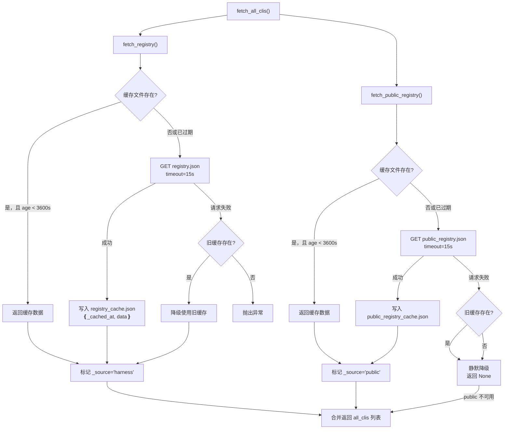

缓存 TTL 为 **3600 秒（1 小时）**，缓存文件路径：
- `~/.cli-hub/registry_cache.json`
- `~/.cli-hub/public_registry_cache.json`

`fetch_all_clis()` 合并两个注册表，为每个条目注入 `_source: "harness" | "public"` 标签。public 注册表获取失败时**静默降级**（返回 `None`），不影响 harness 注册表的正常使用。

Sources: `cli-hub/cli_hub/registry.py:17-88`

---

### 4.4 查找与搜索

- **`get_cli(name)`** — 大小写不敏感的精确匹配，遍历合并后的完整列表
- **`search_clis(query)`** — 在 name、description、category、display_name 四个字段中做子串搜索
- **`list_categories()`** — 返回去重排序后的所有类别名称列表

Sources: `cli-hub/cli_hub/registry.py:91-115`

---

## 5. 安装器

### 5.1 策略分发逻辑

`_install_strategy(cli)` 按如下优先级决定安装策略：

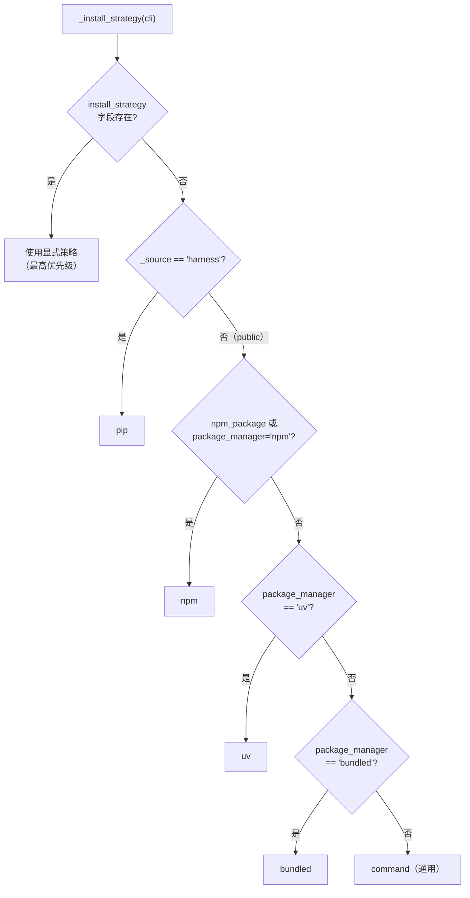

Sources: `cli-hub/cli_hub/installer.py:88-101`

---

### 5.2 各策略实现细节

#### pip（Harness CLIs）

使用当前 Python 解释器（`sys.executable -m pip`）执行 `install_cmd` 中的安装命令。更新时附加 `--upgrade --force-reinstall` 标志。卸载包名固定为 `cli-anything-<name>`。

```python
subprocess.run([sys.executable, "-m", "pip", "install"] + pkg_args, ...)
```

Sources: `cli-hub/cli_hub/installer.py:166-197`

#### npm（Public JS CLIs）

使用 `shutil.which("npm")` 定位 npm 可执行文件。全局安装（`npm install -g <npm_package>`）。未找到 npm 时返回内含 Node.js 安装提示的错误消息。

Sources: `cli-hub/cli_hub/installer.py:239-280`

#### uv（Python CLIs）

使用 `shutil.which("uv")` 定位 uv。未找到时返回含多平台安装指引的错误消息（macOS/Linux curl、Windows PowerShell、pip、brew 四种方式）。

Sources: `cli-hub/cli_hub/installer.py:203-233`

#### bundled（系统工具）

检查 `detect_cmd` 或 `entry_point` 是否已在 PATH 上。已存在则报告"已可用"；否则返回 `install_notes` 中的上游安装提示。更新时建议更新父级应用。

Sources: `cli-hub/cli_hub/installer.py:136-162`

#### command（通用）

直接执行 `install_cmd` / `uninstall_cmd` / `update_cmd` 字符串。包含 Shell 元字符（`|`、`&&`、`||`、`;`、`$(`、` ` `）时自动切换为 `shell=True` 模式，以支持 `curl | bash 类脚本安装。

```python
_SHELL_METACHARACTERS = ("|", "&&", "||", ";", "$(", "`")
use_shell = any(c in cmd for c in _SHELL_METACHARACTERS)
```

Sources: `cli-hub/cli_hub/installer.py:49-74`

---

### 5.3 已安装状态追踪

每次安装/更新成功后，`installer.py` 将以下信息写入 `~/.cli-hub/installed.json`：

```json
{
  "<cli-name>": {
    "version": "1.0.0",
    "entry_point": "cli-anything-gimp",
    "source": "harness",
    "strategy": "pip",
    "install_cmd": "pip install git+...",
    "uninstall_cmd": null,
    "update_cmd": null
  }
}
```

`get_installed()` 返回此字典，供 `list`、`search`、`info` 命令显示已安装标记。

Sources: `cli-hub/cli_hub/installer.py:297-373`

---

## 6. 分析模块

### 6.1 事件类型

| 事件名 | 触发时机 | 主要属性 |
|---|---|---|
| `cli-anything-hub-installed` | 首次运行（一次性） | version, platform |
| `cli-hub call` | 每次 cli-hub 调用 | command, is_agent, traffic_type, agent_category, agent_signals |
| `cli-install` | 安装成功 | cli, version, platform |
| `cli-uninstall` | 卸载成功 | cli, platform |
| `cli-launch` | launch 命令执行 | cli, platform |

Sources: `cli-hub/cli_hub/analytics.py:284-349`

---

### 6.2 提供商切换

默认使用 **PostHog**，可通过环境变量切换：

```bash
export CLI_HUB_ANALYTICS_PROVIDER=umami   # 切换到 Umami
export CLI_HUB_NO_ANALYTICS=1             # 完全关闭分析
```

两个提供商的 API 端点和 Payload 构造逻辑封装在 `_build_posthog_payload()` 和 `_build_umami_payload()` 中，`track_event()` 统一分发。

Sources: `cli-hub/cli_hub/analytics.py:84-90`, `cli-hub/cli_hub/analytics.py:218-244`

---

### 6.3 Agent 身份识别

`detect_invocation_context()` 通过两类信号判断当前调用者是人类还是 Agent：

**环境变量信号（17 个规则）**：检查 `CLAUDE_CODE`、`CLAUDECODE`、`CODEX`、`CURSOR_SESSION`、`CLINE_SESSION`、`AIDER`、`OPENHANDS_AGENT`、`BROWSER_USE`、`STAGEHAND`、`GOOSE_AGENT`、`ROO_CODE`、`WINDSURF_AGENT` 等环境变量是否存在。

**父进程名称信号（20 个正则规则）**：读取 `/proc/<pid>/cmdline`，沿进程树向上最多追溯 4 层，匹配 `claude-code`、`codex`、`copilot`、`cursor`、`cline`、`aider`、`gemini-cli`、`augment`、`opencode` 等进程名称。

**兜底规则**：stdin 非 TTY（`not sys.stdin.isatty()`）时归类为 `scripted_client`。

返回结构：

```python
{
    "is_agent": True,
    "traffic_type": "agent",          # "agent" | "human"
    "category": "agent_tool",         # "agent_tool" | "scripted_client" | "human"
    "reason": "claude-code-env",      # 触发的第一个信号 ID
    "signals": ["claude-code-env"],   # 所有触发信号（最多 12 个）
    "stdin_tty": False,
    "is_interactive": False,
}
```

Sources: `cli-hub/cli_hub/analytics.py:28-191`

---

### 6.4 非阻塞发送

所有分析事件均在独立守护线程中发送（fire-and-forget），绝不阻塞主流程。进程退出时通过 `atexit` 钩子等待所有线程完成（每线程最长等待 3 秒）。

```python
t = threading.Thread(target=_send_event, args=(payload,), daemon=True)
t.start()
```

Sources: `cli-hub/cli_hub/analytics.py:267-281`, `cli-hub/cli_hub/analytics.py:73-81`

---

## 7. 数据目录结构

CLI-Hub 的所有持久化数据均存放在用户主目录的 `.cli-hub/` 下：

```
~/.cli-hub/
├── registry_cache.json        # harness 注册表缓存（含 _cached_at 时间戳）
├── public_registry_cache.json # public 注册表缓存
├── installed.json             # 已安装 CLI 记录
├── .analytics_id              # 匿名用户 UUID（首次运行时生成）
└── .first_run_sent            # 首次运行标记文件（内容为版本号）
```

---

## 8. 相关页面

- [系统架构](./system-architecture.md) — CLI-Hub 在整体架构中的位置
- [CI/CD 与注册表基础设施](./ci-cd-and-registry.md) — registry.json 的自动更新机制
- [预览与轨迹系统](./preview-system.md) — `cli-hub previews` 子命令的后端实现

---

<details>
<summary>相关源文件</summary>

生成本页时使用的主要源文件：

- [cli-anything-plugin/skill_generator.py](../../../project-repos/CLI-Anything/cli-anything-plugin/skill_generator.py)
- [cli-anything-plugin/templates/SKILL.md.template](../../../project-repos/CLI-Anything/cli-anything-plugin/templates/SKILL.md.template)
- [skills/cli-anything-blender/SKILL.md](../../../project-repos/CLI-Anything/skills/cli-anything-blender/SKILL.md)
- [skills/README.md](../../../project-repos/CLI-Anything/skills/README.md)
- [cli-hub-meta-skill/SKILL.md](../../../project-repos/CLI-Anything/cli-hub-meta-skill/SKILL.md)
- [.github/workflows/check-root-skills.yml](../../../project-repos/CLI-Anything/.github/workflows/check-root-skills.yml)
- [.github/scripts/validate_root_skills.py](../../../project-repos/CLI-Anything/.github/scripts/validate_root_skills.py)
- [.github/scripts/sync_root_skills.py](../../../project-repos/CLI-Anything/.github/scripts/sync_root_skills.py)
- [.github/scripts/generate_meta_skill.py](../../../project-repos/CLI-Anything/.github/scripts/generate_meta_skill.py)

</details>

# SKILL.md 技能系统

`SKILL.md` 是 CLI-Anything 框架的**能力发现协议**：每个 CLI 封装随包附带一份机器可读的技能定义文件，AI Agent 读取该文件即可获得完整的调用知识，无需预训练、无需人工文档。

`SKILL.md` 在流水线 **Phase 6.5** 由 `cli-anything-plugin/skill_generator.py` 自动生成，是连接"软件能做什么"与"Agent 如何调用"的桥梁。

Sources: [cli-anything-plugin/skill_generator.py:1-12](../../../project-repos/CLI-Anything/cli-anything-plugin/skill_generator.py#L1-L12)  [skills/README.md:1-30](../../../project-repos/CLI-Anything/skills/README.md#L1-L30)

<details class="source-snippets">
<summary>引用源码</summary>

<!-- source-snippets:start -->

#### `cli-anything-plugin/skill_generator.py:1-12`

```python
"""
SKILL.md Generator for CLI-Anything

This module extracts metadata from CLI-Anything harnesses and generates
SKILL.md files following the skill-creator methodology.

The generated SKILL.md files contain:
- YAML frontmatter with name and description (triggering metadata)
- Markdown body with usage instructions
- Command documentation
- Examples for AI agents
"""
```

#### `skills/README.md:1-30`

````markdown
# CLI-Anything Skills

This directory is the canonical `npx skills` surface for in-repo CLI-Anything
harnesses.

Layout:

```text
skills/
  cli-anything-audacity/SKILL.md
  cli-anything-blender/SKILL.md
  ...
```

Typical usage:

```bash
npx skills add HKUDS/CLI-Anything --list
npx skills add HKUDS/CLI-Anything --skill cli-anything-audacity -g -y
```

The `SKILL.md` files here are the canonical repo-root copies. Installed harness
packages still ship compatibility copies inside `cli_anything/<software>/skills/`
for local runtime discovery.

CI rule:

- If a harness keeps a deep packaged `SKILL.md`, it must also have a matching
  repo-root `skills/<skill-id>/SKILL.md`.
- A future harness that only defines its canonical skill directly in `skills/`
````

<!-- source-snippets:end -->
</details>
---

## 1. 整体架构

```mermaid
flowchart TD
    subgraph SG_["输入层"]
        HP["agent-harness/<br/>目录结构"]
        README["cli_anything/&lt;sw&gt;/README.md<br/>简介 + 系统包"]
        SETUP["setup.py<br/>版本号"]
        CLI_PY["&lt;software&gt;_cli.py<br/>Click 命令定义"]
    end

    subgraph Phase_6_5["Phase 6.5 — skill_generator.py"]
        EX["extract_cli_metadata<br/>→ SkillMetadata"]
        TMPL{"Jinja2 模板<br/>可用？"}
        JINJA["generate_skill_md<br/>Jinja2 渲染"]
        SIMPLE["generate_skill_md_simple<br/>字符串拼接回退"]
        CONTENT["SKILL.md 内容"]
    end

    subgraph SG__1["输出层"]
        CANON["skills/cli-anything-&lt;sw&gt;/SKILL.md<br/>（仓库根 · 规范副本）"]
        COMPAT["cli_anything/&lt;sw&gt;/skills/SKILL.md<br/>（包内 · 兼容副本）"]
    end

    subgraph SG__2["消费层"]
        NPXSKILLS["npx skills add<br/>HKUDS/CLI-Anything"]
        REPLSKIN["ReplSkin 横幅<br/>启动时展示"]
        AGENT["AI Agent<br/>能力发现"]
        META["Meta-Skill<br/>CDN 目录"]
    end

    HP --> EX
    README --> EX
    SETUP --> EX
    CLI_PY --> EX
    EX --> TMPL
    TMPL -->|"是"| JINJA
    TMPL -->|"否"| SIMPLE
    JINJA --> CONTENT
    SIMPLE --> CONTENT
    CONTENT --> CANON
    CONTENT --> COMPAT

    CANON --> NPXSKILLS
    CANON --> AGENT
    COMPAT --> REPLSKIN
    CANON --> META

    style Phase_6_5 fill:#f0f4ff,stroke:#4a6fa5
    style 输入层 fill:#f9f9f9,stroke:#aaa
    style 输出层 fill:#f0fff4,stroke:#4a9f6f
    style 消费层 fill:#fff8f0,stroke:#c87941
```

Sources: [cli-anything-plugin/skill_generator.py:69-142](../../../project-repos/CLI-Anything/cli-anything-plugin/skill_generator.py#L69-L142)  [cli-anything-plugin/skill_generator.py:476-514](../../../project-repos/CLI-Anything/cli-anything-plugin/skill_generator.py#L476-L514)

<details class="source-snippets">
<summary>引用源码</summary>

<!-- source-snippets:start -->

#### `cli-anything-plugin/skill_generator.py:69-142`

```python
def extract_cli_metadata(harness_path: str) -> SkillMetadata:
    """
    Extract metadata from a CLI-Anything harness directory.

    Args:
        harness_path: Path to the agent-harness directory

    Returns:
        SkillMetadata containing extracted information
    """
    harness_path = Path(harness_path)

    # Find the cli_anything/<software> directory
    cli_anything_dir = harness_path / "cli_anything"
    if not cli_anything_dir.exists():
        raise ValueError(
            f"cli_anything directory not found in {harness_path}. "
            "Ensure the harness structure includes cli_anything/<software>/"
        )
    software_dirs = [d for d in cli_anything_dir.iterdir()
                     if d.is_dir() and (d / "__init__.py").exists()]

    if not software_dirs:
        raise ValueError(f"No CLI package found in {harness_path}")

    software_dir = software_dirs[0]
    software_name = software_dir.name

    # Extract metadata from README.md
    readme_path = software_dir / "README.md"
    skill_intro = ""
    system_package = None

    if readme_path.exists():
        readme_content = readme_path.read_text(encoding="utf-8")
        skill_intro = extract_intro_from_readme(readme_content)
        system_package = extract_system_package(readme_content)

    # Extract version from setup.py
    setup_path = harness_path / "setup.py"
    version = "1.0.0"

    if setup_path.exists():
        version = extract_version_from_setup(setup_path)

    # Extract commands from CLI file
    cli_file = software_dir / f"{software_name}_cli.py"
    command_groups = []

    if cli_file.exists():
        command_groups = extract_commands_from_cli(cli_file)

    # Generate examples based on software type
    examples = generate_examples(software_name, command_groups)

    # Build skill name and description
    skill_name = _canonical_skill_name(harness_path, software_name)
    if skill_intro:
        intro_snippet = skill_intro[:100]
        suffix = "..." if len(skill_intro) > 100 else ""
        skill_description = f"Command-line interface for {_format_display_name(software_name)} - {intro_snippet}{suffix}"
    else:
        skill_description = f"Command-line interface for {_format_display_name(software_name)}"

    return SkillMetadata(
        skill_name=skill_name,
        skill_description=skill_description,
        software_name=software_name,
        skill_intro=skill_intro,
        version=version,
        system_package=system_package,
        command_groups=command_groups,
        examples=examples
    )
```

#### `cli-anything-plugin/skill_generator.py:476-514`

```python
def generate_skill_file(harness_path: str, output_path: Optional[str] = None,
                        template_path: Optional[str] = None) -> str:
    """
    Generate a SKILL.md file for a CLI-Anything harness.

    Args:
        harness_path: Path to the agent-harness directory
        output_path: Optional output path for SKILL.md
                     (default: skills/cli-anything-<software>/SKILL.md)
        template_path: Optional path to custom Jinja2 template

    Returns:
        Path to the generated SKILL.md file
    """
    # Extract metadata
    metadata = extract_cli_metadata(harness_path)

    # Generate content
    content = generate_skill_md(metadata, template_path)

    # Determine output path
    harness_path_obj = Path(harness_path)
    compatibility_path = harness_path_obj / "cli_anything" / metadata.software_name / "skills" / "SKILL.md"
    if output_path is None:
        repo_root = harness_path_obj.parent.parent
        output_path = repo_root / "skills" / metadata.skill_name / "SKILL.md"
    else:
        output_path = Path(output_path)

    # Ensure output directory exists
    output_path.parent.mkdir(parents=True, exist_ok=True)

    # Write file
    output_path.write_text(content, encoding="utf-8")
    if compatibility_path != output_path:
        compatibility_path.parent.mkdir(parents=True, exist_ok=True)
        compatibility_path.write_text(content, encoding="utf-8")

    return str(output_path)
```

<!-- source-snippets:end -->
</details>
---

## 2. 元数据提取：`extract_cli_metadata()`

`extract_cli_metadata(harness_path)` 是生成流程的入口，它扫描一个 agent-harness 目录，返回填充完整的 `SkillMetadata` 数据类。

### 2.1 SkillMetadata 数据类

```python
@dataclass
class SkillMetadata:
    skill_name: str          # 规范技能 ID，如 "cli-anything-blender"
    skill_description: str   # YAML frontmatter description
    software_name: str       # 包目录名，如 "blender"
    skill_intro: str         # 从 README.md 提取的简介段落
    version: str             # 从 setup.py 提取的版本号
    system_package: str      # 系统包安装命令（可选）
    command_groups: list[CommandGroup]
    examples: list[Example]
```

以及嵌套结构：

| 数据类 | 字段 | 说明 |
|--------|------|------|
| `CommandGroup` | `name`, `description`, `commands` | Click group 对应一组命令 |
| `CommandInfo` | `name`, `description` | 单条 Click command |
| `Example` | `title`, `description`, `code` | 自动生成的用法示例 |

Sources: [cli-anything-plugin/skill_generator.py:33-67](../../../project-repos/CLI-Anything/cli-anything-plugin/skill_generator.py#L33-L67)

<details class="source-snippets">
<summary>引用源码</summary>

<!-- source-snippets:start -->

#### `cli-anything-plugin/skill_generator.py:33-67`

```python
@dataclass
class CommandInfo:
    """Information about a CLI command."""
    name: str
    description: str


@dataclass
class CommandGroup:
    """A group of related CLI commands."""
    name: str
    description: str
    commands: list[CommandInfo] = field(default_factory=list)


@dataclass
class Example:
    """An example of CLI usage."""
    title: str
    description: str
    code: str


@dataclass
class SkillMetadata:
    """Metadata extracted from a CLI-Anything harness."""
    skill_name: str
    skill_description: str
    software_name: str
    skill_intro: str
    version: str
    system_package: Optional[str] = None
    command_groups: list[CommandGroup] = field(default_factory=list)
    examples: list[Example] = field(default_factory=list)

```

<!-- source-snippets:end -->
</details>
### 2.2 扫描逻辑

扫描流程按固定顺序从四个来源读取数据：

```mermaid
flowchart LR
    A["cli_anything/ 子目录<br/>找含 __init__.py 的包"] --> B["README.md<br/>extract_intro_from_readme()<br/>extract_system_package()"]
    B --> C["setup.py<br/>extract_version_from_setup()<br/>正则: version='x.y.z'"]
    C --> D["&lt;software&gt;_cli.py<br/>extract_commands_from_cli()<br/>正则扫描 Click 装饰器"]
    D --> E["generate_examples()<br/>依据命令组类型<br/>生成示例代码"]
```

**README.md 解析规则**：跳过一级标题行，提取紧随其后的第一段文字作为 `skill_intro`；用正则 ` `apt install &lt;pkg&gt;` / `brew install &lt;pkg&gt;` `` 提取 `system_package。

**版本提取**：正则 `version\s*=\s*["']([^"']+)["']`，未匹配则回退到 `"1.0.0"`。

Sources: [cli-anything-plugin/skill_generator.py:69-142](../../../project-repos/CLI-Anything/cli-anything-plugin/skill_generator.py#L69-L142)  [cli-anything-plugin/skill_generator.py:145-198](../../../project-repos/CLI-Anything/cli-anything-plugin/skill_generator.py#L145-L198)

<details class="source-snippets">
<summary>引用源码</summary>

<!-- source-snippets:start -->

#### `cli-anything-plugin/skill_generator.py:69-142`

```python
def extract_cli_metadata(harness_path: str) -> SkillMetadata:
    """
    Extract metadata from a CLI-Anything harness directory.

    Args:
        harness_path: Path to the agent-harness directory

    Returns:
        SkillMetadata containing extracted information
    """
    harness_path = Path(harness_path)

    # Find the cli_anything/<software> directory
    cli_anything_dir = harness_path / "cli_anything"
    if not cli_anything_dir.exists():
        raise ValueError(
            f"cli_anything directory not found in {harness_path}. "
            "Ensure the harness structure includes cli_anything/<software>/"
        )
    software_dirs = [d for d in cli_anything_dir.iterdir()
                     if d.is_dir() and (d / "__init__.py").exists()]

    if not software_dirs:
        raise ValueError(f"No CLI package found in {harness_path}")

    software_dir = software_dirs[0]
    software_name = software_dir.name

    # Extract metadata from README.md
    readme_path = software_dir / "README.md"
    skill_intro = ""
    system_package = None

    if readme_path.exists():
        readme_content = readme_path.read_text(encoding="utf-8")
        skill_intro = extract_intro_from_readme(readme_content)
        system_package = extract_system_package(readme_content)

    # Extract version from setup.py
    setup_path = harness_path / "setup.py"
    version = "1.0.0"

    if setup_path.exists():
        version = extract_version_from_setup(setup_path)

    # Extract commands from CLI file
    cli_file = software_dir / f"{software_name}_cli.py"
    command_groups = []

    if cli_file.exists():
        command_groups = extract_commands_from_cli(cli_file)

    # Generate examples based on software type
    examples = generate_examples(software_name, command_groups)

    # Build skill name and description
    skill_name = _canonical_skill_name(harness_path, software_name)
    if skill_intro:
        intro_snippet = skill_intro[:100]
        suffix = "..." if len(skill_intro) > 100 else ""
        skill_description = f"Command-line interface for {_format_display_name(software_name)} - {intro_snippet}{suffix}"
    else:
        skill_description = f"Command-line interface for {_format_display_name(software_name)}"

    return SkillMetadata(
        skill_name=skill_name,
        skill_description=skill_description,
        software_name=software_name,
        skill_intro=skill_intro,
        version=version,
        system_package=system_package,
        command_groups=command_groups,
        examples=examples
    )
```

#### `cli-anything-plugin/skill_generator.py:145-198`

```python
def extract_intro_from_readme(content: str) -> str:
    """Extract introduction text from README content."""
    # Find the first paragraph after the title
    lines = content.split("\n")
    intro_lines = []
    in_intro = False

    for line in lines:
        line = line.strip()
        if not line:
            if in_intro and intro_lines:
                break
            continue
        if line.startswith("# "):
            in_intro = True
            continue
        if line.startswith("##"):
            break
        if in_intro:
            intro_lines.append(line)

    return " ".join(intro_lines) or f"CLI interface for the software."


def extract_system_package(content: str) -> Optional[str]:
    """Extract system package installation command from README."""
    # Look for apt/brew install patterns
    patterns = [
        r"`apt install ([\w\-]+)`",
        r"`brew install ([\w\-]+)`",
        r"`apt-get install ([\w\-]+)`",
    ]

    for pattern in patterns:
        match = re.search(pattern, content)
        if match:
            package = match.group(1)
            if "apt-get" in pattern:
                return f"apt-get install {package}"
            elif "apt" in pattern:
                return f"apt install {package}"
            elif "brew" in pattern:
                return f"brew install {package}"

    return None


def extract_version_from_setup(setup_path: Path) -> str:
    """Extract version from setup.py."""
    content = setup_path.read_text(encoding="utf-8")
    match = re.search(r'version\s*=\s*["\']([^"\']+)["\']', content)
    if match:
        return match.group(1)
    return "1.0.0"
```

<!-- source-snippets:end -->
</details>
### 2.3 规范技能名：`_canonical_skill_name()`

```python
def _canonical_skill_name(harness_path: Path, software_name: str) -> str:
    software_dir = software_name
    if harness_path.name == "agent-harness" and harness_path.parent.name:
        software_dir = harness_path.parent.name        # 使用父目录名
    return f"cli-anything-{software_dir.replace('_', '-')}"
```

规则：下划线统一转连字符，前缀固定为 `cli-anything-`。例如 `blender/agent-harness` → `cli-anything-blender`，`adobe_photoshop/agent-harness` → `cli-anything-adobe-photoshop`。

Sources: [cli-anything-plugin/skill_generator.py:25-31](../../../project-repos/CLI-Anything/cli-anything-plugin/skill_generator.py#L25-L31)

<details class="source-snippets">
<summary>引用源码</summary>

<!-- source-snippets:start -->

#### `cli-anything-plugin/skill_generator.py:25-31`

```python
def _canonical_skill_name(harness_path: Path, software_name: str) -> str:
    """Return the repo-root canonical skill id for a harness."""
    software_dir = software_name
    if harness_path.name == "agent-harness" and harness_path.parent.name:
        software_dir = harness_path.parent.name
    return f"cli-anything-{software_dir.replace('_', '-')}"

```

<!-- source-snippets:end -->
</details>
---

## 3. 命令提取：`extract_commands_from_cli()`

该函数对 `<software>_cli.py` 做基于正则的静态分析，无需执行 Python 解释器。

### 3.1 Group 正则

```
@(\w+)\.group\([^)]*\)       # @xxx.group(...)
(?:\s*@[\w.]+\([^)]*\))*     # 可选的额外装饰器
\s*def\s+(\w+)\([^)]*\)      # def xxx(...):
:\s*
(?:"""([\s\S]*?)"""|'''([\s\S]*?)''')?   # 可选 docstring
```

提取 `group_func` 名称（下划线转空格再 title case）和 docstring 作为组描述。

### 3.2 Command 正则

结构与 Group 正则相同，区别在于匹配 `.command(` 而非 `.group(`。从 `match.group(1)` 取父组名，再将该命令附加到对应 `CommandGroup.commands` 列表。

**回退机制**：若未找到任何 group，则把所有 command 归入名为 `"General"` 的默认组。

Sources: [cli-anything-plugin/skill_generator.py:201-281](../../../project-repos/CLI-Anything/cli-anything-plugin/skill_generator.py#L201-L281)

<details class="source-snippets">
<summary>引用源码</summary>

<!-- source-snippets:start -->

#### `cli-anything-plugin/skill_generator.py:201-281`

```python
def extract_commands_from_cli(cli_path: Path) -> list[CommandGroup]:
    """Extract command groups and commands from CLI file."""
    content = cli_path.read_text(encoding="utf-8")
    groups = []

    # Find Click group decorators
    # Pattern handles:
    # - Multi-line decorators (decorators on separate lines)
    # - Docstrings on the same line or following line after function definition
    # - Various Click decorator patterns like @click.option(), @click.argument()
    # Uses re.DOTALL to match across newlines between decorator and def
    group_pattern = (
        r'@(\w+)\.group\([^)]*\)'                          # @xxx.group(...)
        r'(?:\s*@[\w.]+\([^)]*\))*'                         # optional additional decorators
        r'\s*def\s+(\w+)\([^)]*\)'                          # def xxx(...):
        r':\s*'                                             # colon with optional whitespace
        r'(?:"""([\s\S]*?)"""|\'\'\'([\s\S]*?)\'\'\')?'      # optional docstring (""" or ''')
    )

    for match in re.finditer(group_pattern, content):
        group_func = match.group(2)
        # Docstring can be in group 3 (triple-double) or group 4 (triple-single)
        group_doc = (match.group(3) or match.group(4) or "").strip()

        group_name = group_func.replace("_", " ").title()
        if not group_name:
            group_name = group_func.title()

        groups.append(CommandGroup(
            name=group_name,
            description=group_doc or f"Commands for {group_name.lower()} operations.",
            commands=[]
        ))

    # Find Click command decorators
    # Pattern handles:
    # - Multi-line decorators (decorators on separate lines)
    # - Docstrings on the same line or following line after function definition
    # - Various Click decorator patterns like @click.option(), @click.argument()
    command_pattern = (
        r'@(\w+)\.command\([^)]*\)'                         # @xxx.command(...)
        r'(?:\s*@[\w.]+\([^)]*\))*'                          # optional additional decorators
        r'\s*def\s+(\w+)\([^)]*\)'                           # def xxx(...):
        r':\s*'                                              # colon with optional whitespace
        r'(?:"""([\s\S]*?)"""|\'\'\'([\s\S]*?)\'\'\')?'       # optional docstring (""" or ''')
    )

    for match in re.finditer(command_pattern, content):
        group_name = match.group(1)
        cmd_name = match.group(2)
        # Docstring can be in group 3 (triple-double) or group 4 (triple-single)
        cmd_doc = (match.group(3) or match.group(4) or "").strip()

        # Find the matching group
        for group in groups:
            if group.name.lower().replace(" ", "_") == group_name.lower():
                group.commands.append(CommandInfo(
                    name=cmd_name.replace("_", "-"),
                    description=cmd_doc or f"Execute {cmd_name} operation."
                ))

    # If no groups found, create a default one with all commands
    if not groups:
        default_group = CommandGroup(
            name="General",
            description="General commands for the CLI.",
            commands=[]
        )

        for match in re.finditer(command_pattern, content):
            cmd_name = match.group(2)
            # Docstring can be in group 3 (triple-double) or group 4 (triple-single)
            cmd_doc = (match.group(3) or match.group(4) or "").strip()
            default_group.commands.append(CommandInfo(
                name=cmd_name.replace("_", "-"),
                description=cmd_doc or f"Execute {cmd_name} operation."
            ))

        if default_group.commands:
            groups.append(default_group)

```

<!-- source-snippets:end -->
</details>
### 3.3 命令表示例（Blender）

以 `cli-anything-blender` 为例，解析结果包含 9 个命令组，共 40+ 条命令：

| 命令组 | 代表命令 |
|--------|---------|
| Scene | `new`, `open`, `save`, `info`, `profiles`, `json` |
| Object Group | `add`, `remove`, `duplicate`, `transform`, `set`, `list`, `get` |
| Material | `create`, `assign`, `set`, `list`, `get` |
| Modifier Group | `list-available`, `info`, `add`, `remove`, `set`, `list` |
| Camera | `add`, `set`, `set-active`, `list` |
| Light | `add`, `set`, `list` |
| Animation | `keyframe`, `remove-keyframe`, `frame-range`, `fps`, `list-keyframes` |
| Render Group | `settings`, `info`, `presets`, `execute`, `script` |
| Session | `status`, `undo`, `redo`, `history` |

Sources: [skills/cli-anything-blender/SKILL.md:52-200](../../../project-repos/CLI-Anything/skills/cli-anything-blender/SKILL.md#L52-L200)

<details class="source-snippets">
<summary>引用源码</summary>

<!-- source-snippets:start -->

#### `skills/cli-anything-blender/SKILL.md:52-200`

```markdown
## Command Groups


### Scene

Scene management commands.

| Command | Description |
|---------|-------------|
| `new` | Create a new scene |
| `open` | Open an existing scene |
| `save` | Save the current scene |
| `info` | Show scene information |
| `profiles` | List available scene profiles |
| `json` | Print raw scene JSON |


### Object Group

3D object management commands.

| Command | Description |
|---------|-------------|
| `add` | Add a 3D primitive object |
| `remove` | Remove an object by index |
| `duplicate` | Duplicate an object |
| `transform` | Transform an object (translate, rotate, scale) |
| `set` | Set an object property (name, visible, location, rotation, scale, parent) |
| `list` | List all objects |
| `get` | Get detailed info about an object |


### Material

Material management commands.

| Command | Description |
|---------|-------------|
| `create` | Create a new material |
| `assign` | Assign a material to an object |
| `set` | Set a material property (color, metallic, roughness, specular, alpha, etc.) |
| `list` | List all materials |
| `get` | Get detailed info about a material |


### Modifier Group

Modifier management commands.

| Command | Description |
|---------|-------------|
| `list-available` | List all available modifiers |
| `info` | Show details about a modifier |
| `add` | Add a modifier to an object |
| `remove` | Remove a modifier by index |
| `set` | Set a modifier parameter |
| `list` | List modifiers on an object |


### Camera

Camera management commands.

| Command | Description |
|---------|-------------|
| `add` | Add a camera to the scene |
| `set` | Set a camera property |
| `set-active` | Set the active camera |
| `list` | List all cameras |


### Light

Light management commands.

| Command | Description |
|---------|-------------|
| `add` | Add a light to the scene |
| `set` | Set a light property |
| `list` | List all lights |


### Animation

Animation and keyframe commands.

| Command | Description |
|---------|-------------|
| `keyframe` | Set a keyframe on an object |
| `remove-keyframe` | Remove a keyframe from an object |
| `frame-range` | Set the animation frame range |
| `fps` | Set the animation FPS |
| `list-keyframes` | List keyframes for an object |


### Render Group

Render settings and output commands.

| Command | Description |
|---------|-------------|
| `settings` | Configure render settings |
| `info` | Show current render settings |
| `presets` | List available render presets |
| `execute` | Render the scene (generates bpy script) |
| `script` | Generate bpy script without rendering |

### Preview

Real preview bundle capture and live preview session commands.

| Command | Description |
|---------|-------------|
| `preview recipes` | List available preview recipes |
| `preview capture` | Render a real preview bundle for the active scene |
| `preview latest` | Return the latest existing preview bundle |
| `preview live start` | Start a live preview session and publish the first bundle |
| `preview live push` | Publish a refreshed bundle into the live session |
| `preview live status` | Read current live-session state without rendering |
| `preview live stop` | Stop the live session without deleting artifacts |
... snippet truncated ...
```

<!-- source-snippets:end -->
</details>
---

## 4. SKILL.md 文件格式

### 4.1 YAML Frontmatter

```yaml
---
name: "cli-anything-blender"
description: >-
  Command-line interface for Blender - A stateful command-line interface
  for 3D scene editing, following the same patterns as the GIMP CLI ...
---
```

- `name`：规范技能 ID，用于 `npx skills add` 时的 `--skill` 参数匹配
- `description`：由 `skill_intro` 前 100 字符拼接而成，超出部分截断并追加 `...`

### 4.2 Markdown 正文结构

Jinja2 模板（`templates/SKILL.md.template`）渲染后的标准章节顺序：

```
# <skill_name>

<skill_intro>

## Installation
  pip install cli-anything-<software>
  前置依赖（Python 版本 + 系统包）

## Usage
  ### Basic Commands    # --help / REPL / project new / --json 四个示例
  ### REPL Mode         # 交互式会话说明

## Command Groups       # 每组一个 ### 子节 + 命令表格
  | Command | Description |

## Examples             # 自动生成的 bash 代码块示例

## State Management     # Undo/Redo + JSON 项目持久化说明

## Output Formats       # 人类可读模式 vs --json 机器模式对比

## For AI Agents        # Agent 使用的五条规范（见第 7 节）

## More Information     # README / TEST / HARNESS 文档索引

## Version              # 版本字符串
```

Sources: [cli-anything-plugin/templates/SKILL.md.template:1-124](../../../project-repos/CLI-Anything/cli-anything-plugin/templates/SKILL.md.template#L1-L124)

<details class="source-snippets">
<summary>引用源码</summary>

<!-- source-snippets:start -->

#### `cli-anything-plugin/templates/SKILL.md.template:1-124`

````
---
name: >-
  {{ skill_name }}
description: >-
  {{ skill_description }}
---

# {{ skill_name }}

{{ skill_intro }}

## Installation

This CLI is installed as part of the cli-anything-{{ software_name }} package:

```bash
pip install cli-anything-{{ software_name }}
```

**Prerequisites:**
- Python 3.10+
- {{ software_name }} must be installed on your system

- Install {{ software_name }}: `{{ system_package }}`


## Usage

### Basic Commands

```bash
# Show help
cli-anything-{{ software_name }} --help

# Start interactive REPL mode
cli-anything-{{ software_name }}

# Create a new project
cli-anything-{{ software_name }} project new -o project.json

# Run with JSON output (for agent consumption)
cli-anything-{{ software_name }} --json project info -p project.json
```

### REPL Mode

When invoked without a subcommand, the CLI enters an interactive REPL session:

```bash
cli-anything-{{ software_name }}
# Enter commands interactively with tab-completion and history
```


## Command Groups


### {{ group.name }}

{{ group.description }}

| Command | Description |
|---------|-------------|

| `{{ cmd.name }}` | {{ cmd.description }} |




## Examples


### {{ example.title }}

{{ example.description }}

```bash
{{ example.code }}
```


## State Management

The CLI maintains session state with:

- **Undo/Redo**: Up to 50 levels of history
- **Project persistence**: Save/load project state as JSON
- **Session tracking**: Track modifications and changes

## Output Formats

All commands support dual output modes:

- **Human-readable** (default): Tables, colors, formatted text
- **Machine-readable** (`--json` flag): Structured JSON for agent consumption

```bash
# Human output
cli-anything-{{ software_name }} project info -p project.json

# JSON output for agents
cli-anything-{{ software_name }} --json project info -p project.json
```

## For AI Agents

When using this CLI programmatically:

1. **Always use `--json` flag** for parseable output
2. **Check return codes** - 0 for success, non-zero for errors
3. **Parse stderr** for error messages on failure
4. **Use absolute paths** for all file operations
5. **Verify outputs exist** after export operations

## More Information

- Full documentation: See README.md in the package
- Test coverage: See TEST.md in the package
- Methodology: See HARNESS.md in the cli-anything-plugin

... snippet truncated ...
````

<!-- source-snippets:end -->
</details>
### 4.3 模板回退机制

`generate_skill_md()` 优先使用 Jinja2；若环境中未安装 `jinja2` 包，或模板文件不存在，则自动回退到 `generate_skill_md_simple()`，用纯字符串拼接生成结构相同（略有精简）的内容。

```python
try:
    from jinja2 import Environment, FileSystemLoader
except ImportError:
    return generate_skill_md_simple(metadata)   # 零依赖回退
```

Sources: [cli-anything-plugin/skill_generator.py:321-368](../../../project-repos/CLI-Anything/cli-anything-plugin/skill_generator.py#L321-L368)  [cli-anything-plugin/skill_generator.py:371-473](../../../project-repos/CLI-Anything/cli-anything-plugin/skill_generator.py#L371-L473)

<details class="source-snippets">
<summary>引用源码</summary>

<!-- source-snippets:start -->

#### `cli-anything-plugin/skill_generator.py:321-368`

```python
def generate_skill_md(metadata: SkillMetadata, template_path: Optional[str] = None) -> str:
    """
    Generate SKILL.md content from metadata using Jinja2 template.

    Args:
        metadata: SkillMetadata containing CLI information
        template_path: Optional path to custom template file

    Returns:
        Generated SKILL.md content as string
    """
    try:
        from jinja2 import Environment, FileSystemLoader
    except ImportError:
        # Fallback to simple string formatting if Jinja2 not available
        return generate_skill_md_simple(metadata)

    # Load template
    if template_path is None:
        template_path = Path(__file__).parent / "templates" / "SKILL.md.template"
    else:
        template_path = Path(template_path)

    if not template_path.exists():
        return generate_skill_md_simple(metadata)

    env = Environment(loader=FileSystemLoader(template_path.parent))
    template = env.get_template(template_path.name)

    # Render template
    return template.render(
        skill_name=metadata.skill_name,
        skill_description=metadata.skill_description,
        software_name=metadata.software_name,
        skill_intro=metadata.skill_intro,
        version=metadata.version,
        system_package=metadata.system_package,
        command_groups=[{
            "name": g.name,
            "description": g.description,
            "commands": [{"name": c.name, "description": c.description} for c in g.commands]
        } for g in metadata.command_groups],
        examples=[{
            "title": e.title,
            "description": e.description,
            "code": e.code
        } for e in metadata.examples]
    )
```

#### `cli-anything-plugin/skill_generator.py:371-473`

````python
def generate_skill_md_simple(metadata: SkillMetadata) -> str:
    """Generate SKILL.md without Jinja2 dependency."""
    lines = [
        "---",
        f'name: "{metadata.skill_name}"',
        f'description: "{metadata.skill_description}"',
        "---",
        "",
        f"# {metadata.skill_name}",
        "",
        metadata.skill_intro,
        "",
        "## Installation",
        "",
        f"This CLI is installed as part of the cli-anything-{metadata.software_name} package:",
        "",
        f"```bash",
        f"pip install cli-anything-{metadata.software_name}",
        f"```",
        "",
        "**Prerequisites:**",
        "- Python 3.10+",
        f"- {_format_display_name(metadata.software_name)} must be installed on your system",
    ]

    if metadata.system_package:
        lines.extend([
            f"- Install {metadata.software_name}: `{metadata.system_package}`"
        ])

    lines.extend([
        "",
        "## Usage",
        "",
        "### Basic Commands",
        "",
        "```bash",
        "# Show help",
        f"cli-anything-{metadata.software_name} --help",
        "",
        "# Start interactive REPL mode",
        f"cli-anything-{metadata.software_name}",
        "",
        "# Create a new project",
        f"cli-anything-{metadata.software_name} project new -o project.json",
        "",
        "# Run with JSON output (for agent consumption)",
        f"cli-anything-{metadata.software_name} --json project info -p project.json",
        "```",
        "",
    ])

    # Add command groups
    if metadata.command_groups:
        lines.append("## Command Groups")
        lines.append("")

        for group in metadata.command_groups:
            lines.append(f"### {group.name}")
            lines.append("")
            lines.append(group.description)
            lines.append("")

            if group.commands:
                lines.append("| Command | Description |")
                lines.append("|---------|-------------|")
                for cmd in group.commands:
                    lines.append(f"| `{cmd.name}` | {cmd.description} |")
                lines.append("")

    # Add examples
    if metadata.examples:
        lines.append("## Examples")
        lines.append("")

        for example in metadata.examples:
            lines.append(f"### {example.title}")
            lines.append("")
            lines.append(example.description)
            lines.append("")
            lines.append("```bash")
            lines.append(example.code)
            lines.append("```")
            lines.append("")

    # Add AI agent guidance
    lines.extend([
        "## For AI Agents",
        "",
        "When using this CLI programmatically:",
        "",
        "1. **Always use `--json` flag** for parseable output",
        "2. **Check return codes** - 0 for success, non-zero for errors",
        "3. **Parse stderr** for error messages on failure",
        "4. **Use absolute paths** for all file operations",
        "5. **Verify outputs exist** after export operations",
        "",
        "## Version",
        "",
        metadata.version,
    ])

    return "\n".join(lines)
````

<!-- source-snippets:end -->
</details>
---

## 5. 文件分发：双副本策略

`generate_skill_file()` 每次生成时向两个位置写入**内容相同**的文件：

```
仓库根（规范副本）
└── skills/
    └── cli-anything-<software>/
        └── SKILL.md          ← npx skills / CI 使用

包内（兼容副本）
└── <software>/agent-harness/
    └── cli_anything/
        └── <software>/
            └── skills/
                └── SKILL.md  ← ReplSkin 横幅 / 本地运行时使用
```

**ReplSkin 横幅优先级**：启动时先查找仓库根规范副本，找不到则回退到包内兼容副本。

Sources: [cli-anything-plugin/skill_generator.py:476-514](../../../project-repos/CLI-Anything/cli-anything-plugin/skill_generator.py#L476-L514)  [skills/README.md:1-30](../../../project-repos/CLI-Anything/skills/README.md#L1-L30)

<details class="source-snippets">
<summary>引用源码</summary>

<!-- source-snippets:start -->

#### `cli-anything-plugin/skill_generator.py:476-514`

```python
def generate_skill_file(harness_path: str, output_path: Optional[str] = None,
                        template_path: Optional[str] = None) -> str:
    """
    Generate a SKILL.md file for a CLI-Anything harness.

    Args:
        harness_path: Path to the agent-harness directory
        output_path: Optional output path for SKILL.md
                     (default: skills/cli-anything-<software>/SKILL.md)
        template_path: Optional path to custom Jinja2 template

    Returns:
        Path to the generated SKILL.md file
    """
    # Extract metadata
    metadata = extract_cli_metadata(harness_path)

    # Generate content
    content = generate_skill_md(metadata, template_path)

    # Determine output path
    harness_path_obj = Path(harness_path)
    compatibility_path = harness_path_obj / "cli_anything" / metadata.software_name / "skills" / "SKILL.md"
    if output_path is None:
        repo_root = harness_path_obj.parent.parent
        output_path = repo_root / "skills" / metadata.skill_name / "SKILL.md"
    else:
        output_path = Path(output_path)

    # Ensure output directory exists
    output_path.parent.mkdir(parents=True, exist_ok=True)

    # Write file
    output_path.write_text(content, encoding="utf-8")
    if compatibility_path != output_path:
        compatibility_path.parent.mkdir(parents=True, exist_ok=True)
        compatibility_path.write_text(content, encoding="utf-8")

    return str(output_path)
```

#### `skills/README.md:1-30`

````markdown
# CLI-Anything Skills

This directory is the canonical `npx skills` surface for in-repo CLI-Anything
harnesses.

Layout:

```text
skills/
  cli-anything-audacity/SKILL.md
  cli-anything-blender/SKILL.md
  ...
```

Typical usage:

```bash
npx skills add HKUDS/CLI-Anything --list
npx skills add HKUDS/CLI-Anything --skill cli-anything-audacity -g -y
```

The `SKILL.md` files here are the canonical repo-root copies. Installed harness
packages still ship compatibility copies inside `cli_anything/<software>/skills/`
for local runtime discovery.

CI rule:

- If a harness keeps a deep packaged `SKILL.md`, it must also have a matching
  repo-root `skills/<skill-id>/SKILL.md`.
- A future harness that only defines its canonical skill directly in `skills/`
````

<!-- source-snippets:end -->
</details>
---

## 6. skills/ 目录结构

```
skills/
  README.md                          ← 说明文档
  cli-hub-meta-skill/SKILL.md        ← Meta-Skill（见第 8 节）
  cli-anything-audacity/SKILL.md
  cli-anything-blender/SKILL.md
  cli-anything-browser/SKILL.md
  cli-anything-comfyui/SKILL.md
  cli-anything-freecad/SKILL.md
  cli-anything-gimp/SKILL.md
  ...（50+ 个技能目录）
```

通过 `npx skills` 工具消费：

```bash
# 列出所有可用技能
npx skills add HKUDS/CLI-Anything --list

# 安装单个技能（全局，自动确认）
npx skills add HKUDS/CLI-Anything --skill cli-anything-audacity -g -y
```

Sources: [skills/README.md:1-30](../../../project-repos/CLI-Anything/skills/README.md#L1-L30)

<details class="source-snippets">
<summary>引用源码</summary>

<!-- source-snippets:start -->

#### `skills/README.md:1-30`

````markdown
# CLI-Anything Skills

This directory is the canonical `npx skills` surface for in-repo CLI-Anything
harnesses.

Layout:

```text
skills/
  cli-anything-audacity/SKILL.md
  cli-anything-blender/SKILL.md
  ...
```

Typical usage:

```bash
npx skills add HKUDS/CLI-Anything --list
npx skills add HKUDS/CLI-Anything --skill cli-anything-audacity -g -y
```

The `SKILL.md` files here are the canonical repo-root copies. Installed harness
packages still ship compatibility copies inside `cli_anything/<software>/skills/`
for local runtime discovery.

CI rule:

- If a harness keeps a deep packaged `SKILL.md`, it must also have a matching
  repo-root `skills/<skill-id>/SKILL.md`.
- A future harness that only defines its canonical skill directly in `skills/`
````

<!-- source-snippets:end -->
</details>
---

## 7. Agent 使用规范（For AI Agents）

每份 `SKILL.md` 末尾都包含专为 AI Agent 设计的五条操作规范，这是 CLI-Anything 的**契约承诺**：

| 规范 | 说明 |
|------|------|
| 始终使用 `--json` | 所有命令支持 `--json` 标志，输出结构化 JSON，禁止解析人类可读文本 |
| 检查返回码 | 0 = 成功，非零 = 错误；Agent 必须在继续前检查 |
| 解析 stderr | 错误信息写入 stderr，stdout 仅含正常输出 |
| 使用绝对路径 | 所有文件操作必须传绝对路径，相对路径在后台执行时容易出错 |
| 验证输出文件 | 导出/渲染操作后，Agent 应确认目标文件确实存在 |

```bash
# 正确的 Agent 调用模式
cli-anything-blender \
  --json \
  --project /abs/path/to/scene.json \
  render execute \
  --output /abs/path/to/output.png

# 检查返回码
if [ $? -ne 0 ]; then
  # 读取 stderr，上报错误
fi
```

Sources: [cli-anything-plugin/templates/SKILL.md.template:105-114](../../../project-repos/CLI-Anything/cli-anything-plugin/templates/SKILL.md.template#L105-L114)  [skills/cli-anything-blender/SKILL.md:277-296](../../../project-repos/CLI-Anything/skills/cli-anything-blender/SKILL.md#L277-L296)

<details class="source-snippets">
<summary>引用源码</summary>

<!-- source-snippets:start -->

#### `cli-anything-plugin/templates/SKILL.md.template:105-114`

```
## For AI Agents

When using this CLI programmatically:

1. **Always use `--json` flag** for parseable output
2. **Check return codes** - 0 for success, non-zero for errors
3. **Parse stderr** for error messages on failure
4. **Use absolute paths** for all file operations
5. **Verify outputs exist** after export operations

```

#### `skills/cli-anything-blender/SKILL.md:277-296`

```markdown
## For AI Agents

When using this CLI programmatically:

1. **Always use `--json` flag** for parseable output
2. **Check return codes** - 0 for success, non-zero for errors
3. **Parse stderr** for error messages on failure
4. **MANDATORY: Use absolute paths** for all file operations (rendering, project files). Relative paths are prone to failure in background execution.
5. **Use `preview capture` or `preview live ...` for visual verification** instead of inferring scene quality from JSON alone
6. **Read returned artifact paths** such as `hero.png` and `workbench.png`; the JSON payload references files, it does not inline image bytes
7. **Treat `_bundle_dir` as one snapshot only**; for stable live history, use `_session_dir` plus `_trajectory_path`
8. **Use `cli-hub previews ...` only to inspect/open existing previews**; preview generation itself always happens through `cli-anything-blender preview ...`

## More Information

- Full documentation: See README.md in the package
- Test coverage: See TEST.md in the package
- Methodology: See HARNESS.md in the cli-anything-plugin

## Version
```

<!-- source-snippets:end -->
</details>
---

## 8. Meta-Skill：跨 CLI 发现

`cli-hub-meta-skill/SKILL.md`（同时镜像到 `skills/cli-hub-meta-skill/SKILL.md`）是一个特殊的**目录型技能**，指向实时更新的 CDN 上的 CLI 目录。

### 8.1 作用

Agent 只需加载一份 Meta-Skill，即可了解所有 20+ 类别的可用 CLI，然后按需通过 `cli-hub install <name>` 安装对应技能：

```yaml
---
name: cli-hub-meta-skill
description: >-
  Discover agent-native CLIs for professional software. Access the live
  catalog to find tools for creative workflows, productivity, AI, and more.
---
```

### 8.2 实时目录

**CDN URL**：`https://reeceyang.sgp1.cdn.digitaloceanspaces.com/SKILL.md`

该目录按类别列出所有可用 CLI，并提供一行安装命令，例如：

```bash
cli-hub install gimp      # 图像编辑
cli-hub install blender   # 3D 建模
cli-hub install kdenlive  # 视频剪辑
cli-hub install comfyui   # AI 图像生成
```

### 8.3 自动更新流程

```mermaid
flowchart LR
    REG["registry.json<br/>+ public_registry.json"] --> GEN[".github/scripts/<br/>generate_meta_skill.py"]
    GEN --> METAFILE["cli-hub-meta-skill/SKILL.md<br/>+ skills/cli-hub-meta-skill/SKILL.md"]
    METAFILE --> CDN["CDN 发布<br/>DigitalOcean Spaces"]
    CDN --> AGENT["AI Agent<br/>按需发现并安装 CLI"]
```

`generate_meta_skill.py` 读取 `registry.json`（私有/harness CLI）和 `public_registry.json`（npm/uv/brew 公共 CLI），按类别分组生成 Markdown 表格，写入两份同步文件。每当 `registry.json` 变更时，CI 自动重新生成并发布到 CDN。

Sources: [cli-hub-meta-skill/SKILL.md:1-88](../../../project-repos/CLI-Anything/cli-hub-meta-skill/SKILL.md#L1-L88)  [github/scripts/generate_meta_skill.py:1-158](../../../project-repos/CLI-Anything/.github/scripts/generate_meta_skill.py#L1-L158)

<details class="source-snippets">
<summary>引用源码</summary>

<!-- source-snippets:start -->

#### `cli-hub-meta-skill/SKILL.md:1-88`

````markdown
---
name: cli-hub-meta-skill
description: >-
  Discover agent-native CLIs for professional software. Access the live catalog
  to find tools for creative workflows, productivity, AI, and more.
---

# CLI-Hub Meta-Skill

CLI-Hub is a marketplace of agent-native command-line interfaces that make professional software accessible to AI agents.

## Quick Start

```bash
# Install the CLI Hub package manager
pip install cli-anything-hub

# Browse all available CLIs
cli-hub list

# Search by category or keyword
cli-hub search image
cli-hub search "3d modeling"

# Install a CLI
cli-hub install gimp

# Show details for a CLI
cli-hub info gimp
```

## Live Catalog

**URL**: [`https://reeceyang.sgp1.cdn.digitaloceanspaces.com/SKILL.md`](https://reeceyang.sgp1.cdn.digitaloceanspaces.com/SKILL.md)

The catalog is auto-updated and provides:
- Full list of available CLIs organized by category
- One-line `cli-hub install` commands for each tool
- Complete descriptions and usage patterns


## What Can You Do?

CLI-Hub covers a broad range of software and codebases, empowering agents to conduct complex workflows via CLI:

- **Creative workflows**: Image editing, 3D modeling, video production, audio processing, music notation
- **Productivity tools**: Office suites, knowledge management, live streaming
- **AI platforms**: Local LLMs, image generation, AI APIs, research assistants
- **Communication**: Video conferencing and collaboration
- **Development**: Diagramming, browser automation, network management
- **Content generation**: AI-powered document and media creation

Each CLI provides stateful operations, JSON output for agents, REPL mode, and integrates with real software backends.

## How It Works

`cli-hub` is a lightweight wrapper around `pip`. When you run `cli-hub install gimp`, it installs a separate Python package (`cli-anything-gimp`) with its own CLI entry point (`cli-anything-gimp`). Each CLI is an independent pip package — `cli-hub` simply resolves names from the registry and tracks installs.

## How to Use

1. **Install cli-hub**: `pip install cli-anything-hub`
2. **Find your tool**: `cli-hub search <keyword>` or `cli-hub list -c <category>`
3. **Install**: `cli-hub install <name>` (installs the `cli-anything-<name>` pip package)
4. **Run**: `cli-anything-<name>` for REPL, or `cli-anything-<name> <command>` for one-shot
5. **JSON output**: All CLIs support `--json` flag for machine-readable output

## Example Workflow

```bash
# Install the hub
pip install cli-anything-hub

# Find what you need
cli-hub search video

# Install it
cli-hub install kdenlive

# Use it with JSON output
cli-anything-kdenlive --json project create --name my-project
```

## More Info

- Live Catalog: https://reeceyang.sgp1.cdn.digitaloceanspaces.com/SKILL.md
- Web Hub: https://clianything.cc
- Repository: https://github.com/HKUDS/CLI-Anything
````

#### `github/scripts/generate_meta_skill.py:1-158`

````python
#!/usr/bin/env python3
"""Generate cli-hub-skill/SKILL.md from registry.json and public_registry.json."""
import json
from pathlib import Path
from collections import defaultdict

def main():
    repo_root = Path(__file__).parent.parent.parent
    registry_path = repo_root / 'registry.json'
    public_registry_path = repo_root / 'public_registry.json'
    output_path = repo_root / 'cli-hub-skill' / 'SKILL.md'

    with open(registry_path) as f:
        data = json.load(f)

    public_clis = []
    if public_registry_path.exists():
        with open(public_registry_path) as f:
            public_data = json.load(f)
        public_clis = public_data.get('clis', [])

    total_count = len(data['clis']) + len(public_clis)

    # Group harness CLIs by category
    by_category = defaultdict(list)
    for cli in data['clis']:
        by_category[cli['category']].append(cli)

    # Group public CLIs by category
    public_by_category = defaultdict(list)
    for cli in public_clis:
        public_by_category[cli['category']].append(cli)

    lines = [
        "---",
        "name: cli-anything-hub",
        "description: >-",
        f"  Browse and install {total_count}+ CLI tools for GUI software and popular platforms.",
        "  Covers image editing, 3D, video, audio, office, diagrams, AI, communication, devops, and more.",
        "---",
        "",
        "# CLI-Anything Hub",
        "",
        f"Agent-native CLI interfaces for {total_count} applications — {len(data['clis'])} harness CLIs (stateful, `--json`, REPL) plus {len(public_clis)} public/third-party CLIs (npm, uv, brew, and more).",
        "",
        "## Quick Install",
        "",
        "```bash",
        "# First, install the CLI Hub package manager",
        "pip install cli-anything-hub",
        "",
        "# Browse available CLIs",
        "cli-hub list",
        "",
        "# Install any CLI by name",
        "cli-hub install gimp",
        "cli-hub install blender",
        "cli-hub install generate-veo-video",
        "",
        "# Search by category or keyword",
        "cli-hub search image",
        "cli-hub search ai",
        "",
        "# Launch an installed CLI",
        "cli-hub launch <name> [args...]",
        "```",
        "",
        "## CLI-Anything Harness CLIs",
        "",
        f"Stateful, agent-native wrappers for {len(data['clis'])} GUI applications. All support `--json` output, REPL mode, and undo/redo.",
        ""
    ]

    for category in sorted(by_category.keys()):
        clis = by_category[category]
        lines.append(f"### {category.title()}")
        lines.append("")
        lines.append("| Name | Description | Install |")
        lines.append("|------|-------------|---------|")

        for cli in sorted(clis, key=lambda x: x['name']):
            name = cli['display_name']
            desc = cli['description']
            install = f"`cli-hub install {cli['name']}`"
            lines.append(f"| **{name}** | {desc} | {install} |")

        lines.append("")

    lines.extend([
        "## Public & Third-Party CLIs",
        "",
        f"Official and community CLIs for popular platforms, managed via npm, uv, brew, and other installers. {len(public_clis)} CLIs available.",
        ""
    ])

    for category in sorted(public_by_category.keys()):
        clis = public_by_category[category]
        lines.append(f"### {category.title()}")
        lines.append("")
        lines.append("| Name | Description | Entry Point | Install |")
        lines.append("|------|-------------|-------------|---------|")

        for cli in sorted(clis, key=lambda x: x['name']):
            name = cli['display_name']
            desc = cli['description']
            entry = f"`{cli['entry_point']}`"
            install = f"`cli-hub install {cli['name']}`"
            lines.append(f"| **{name}** | {desc} | {entry} | {install} |")

        lines.append("")

    lines.extend([
        "## How It Works",
        "",
        "`cli-hub` is a unified package manager for both harness CLIs and public CLIs:",
        "",
        "- **Harness CLIs**: installed via `pip` as `cli-anything-<name>` packages",
        "- **npm CLIs**: installed via `npm install -g`",
        "- **uv CLIs**: installed via `uv tool install`",
        "- **brew/script CLIs**: installed via the tool's native installer",
... snippet truncated ...
````

<!-- source-snippets:end -->
</details>
---

## 9. CI 验证：双副本一致性

`.github/workflows/check-root-skills.yml` 在以下触发条件下运行：

- PR 修改了 `*/agent-harness/**` 或 `skills/**`
- `main` 分支直接推送（同路径范围）
- 手动触发（`workflow_dispatch`）

验证步骤由 `validate_root_skills.py` 执行：

```mermaid
flowchart TD
    DISC["_discover_sources()<br/>扫描 */agent-harness/cli_anything/*/skills/SKILL.md<br/>以及 */agent-harness/cli_anything/*/SKILL.md"] --> LOOP
    LOOP["for each source"] --> ID["_canonical_skill_id(source)<br/>→ cli-anything-&lt;name&gt;"]
    ID --> CHECK["检查 skills/&lt;id&gt;/SKILL.md 是否存在"]
    CHECK -->|"不存在"| ERR1["报错：Missing root skill"]
    CHECK -->|"存在"| COMPARE["比较内容<br/>_rewrite_name_frontmatter(source, id)<br/>vs 实际 target 文件"]
    COMPARE -->|"不一致"| ERR2["报错：Out-of-sync root skill"]
    COMPARE -->|"一致"| OK["通过"]
    ERR1 & ERR2 --> FIX["提示运行 sync_root_skills.py 后提交"]
```

`_rewrite_name_frontmatter()` 在比较前将包内副本的 `name:` frontmatter 字段规范化为仓库根 canonical ID，确保内容等价性判断准确。

修复命令：

```bash
python3 .github/scripts/sync_root_skills.py
git add skills/
git commit -m "sync: update root skills mirror"
```

Sources: [github/workflows/check-root-skills.yml:1-36](../../../project-repos/CLI-Anything/.github/workflows/check-root-skills.yml#L1-L36)  [github/scripts/validate_root_skills.py:1-60](../../../project-repos/CLI-Anything/.github/scripts/validate_root_skills.py#L1-L60)  [github/scripts/sync_root_skills.py:1-79](../../../project-repos/CLI-Anything/.github/scripts/sync_root_skills.py#L1-L79)

<details class="source-snippets">
<summary>引用源码</summary>

<!-- source-snippets:start -->

#### `github/workflows/check-root-skills.yml:1-36`

```yaml
name: Check Root Skills

on:
  pull_request:
    paths:
      - '*/agent-harness/**'
      - 'skills/**'
      - '.github/scripts/sync_root_skills.py'
      - '.github/scripts/validate_root_skills.py'
      - '.github/workflows/check-root-skills.yml'
  push:
    branches:
      - main
    paths:
      - '*/agent-harness/**'
      - 'skills/**'
      - '.github/scripts/sync_root_skills.py'
      - '.github/scripts/validate_root_skills.py'
      - '.github/workflows/check-root-skills.yml'
  workflow_dispatch:

jobs:
  validate-root-skills:
    runs-on: ubuntu-latest
    steps:
      - name: Checkout
        uses: actions/checkout@v4

      - name: Setup Python
        uses: actions/setup-python@v5
        with:
          python-version: '3.10'

      - name: Validate root skills mirror
        run: python3 .github/scripts/validate_root_skills.py
```

#### `github/scripts/validate_root_skills.py:1-60`

```python
#!/usr/bin/env python3
"""Validate that deep harness SKILL.md files are mirrored in repo-root skills/."""

from __future__ import annotations

import sys
from pathlib import Path


REPO_ROOT = Path(__file__).resolve().parents[2]


def _load_sync_helpers():
    namespace: dict[str, object] = {"__file__": str(REPO_ROOT / ".github" / "scripts" / "sync_root_skills.py")}
    sync_script = REPO_ROOT / ".github" / "scripts" / "sync_root_skills.py"
    exec(sync_script.read_text(encoding="utf-8"), namespace)
    return namespace


def main() -> int:
    sync = _load_sync_helpers()
    discover_sources = sync["_discover_sources"]
    canonical_skill_id = sync["_canonical_skill_id"]
    rewrite_name_frontmatter = sync["_rewrite_name_frontmatter"]
    root_skills_dir = sync["ROOT_SKILLS_DIR"]

    errors: list[str] = []
    for source in discover_sources():
        skill_id = canonical_skill_id(source)
        target = root_skills_dir / skill_id / "SKILL.md"
        if not target.is_file():
            errors.append(
                f"Missing root skill for {source.relative_to(REPO_ROOT)}: expected {target.relative_to(REPO_ROOT)}"
            )
            continue

        source_content = source.read_text(encoding="utf-8")
        expected = rewrite_name_frontmatter(source_content, skill_id)
        actual = target.read_text(encoding="utf-8")
        if actual != expected:
            errors.append(
                f"Out-of-sync root skill for {source.relative_to(REPO_ROOT)}: {target.relative_to(REPO_ROOT)}"
            )

    if errors:
        print("Root skills validation failed:", file=sys.stderr)
        for error in errors:
            print(f"- {error}", file=sys.stderr)
        print(
            "Run `python3 .github/scripts/sync_root_skills.py` and commit the updated root skills.",
            file=sys.stderr,
        )
        return 1

    print("Root skills validation passed.")
    return 0


if __name__ == "__main__":
    raise SystemExit(main())
```

#### `github/scripts/sync_root_skills.py:1-79`

```python
#!/usr/bin/env python3
"""Sync repo-root skills/ from harness-local SKILL.md files."""

from __future__ import annotations

from pathlib import Path


REPO_ROOT = Path(__file__).resolve().parents[2]
ROOT_SKILLS_DIR = REPO_ROOT / "skills"


def _canonical_skill_id(source: Path) -> str:
    rel = source.relative_to(REPO_ROOT)
    parts = rel.parts
    if "cli_anything" in parts:
        package_index = parts.index("cli_anything") + 1
        if package_index < len(parts):
            package_name = parts[package_index]
            return f"cli-anything-{package_name.replace('_', '-')}"

    software_dir = parts[0]
    return f"cli-anything-{software_dir.replace('_', '-')}"


def _rewrite_name_frontmatter(content: str, skill_id: str) -> str:
    if not content.startswith("---\n"):
        return content

    parts = content.split("---\n", 2)
    if len(parts) < 3:
        return content

    _, frontmatter, body = parts
    lines = frontmatter.splitlines(keepends=True)
    rewritten: list[str] = []
    replaced = False
    i = 0
    while i < len(lines):
        line = lines[i]
        if not replaced and line.startswith("name:"):
            rewritten.append(f'name: "{skill_id}"\n')
            replaced = True
            i += 1
            while i < len(lines) and (lines[i].startswith(" ") or lines[i].startswith("\t")):
                i += 1
            continue
        rewritten.append(line)
        i += 1

    if not replaced:
        rewritten.insert(0, f'name: "{skill_id}"\n')

    frontmatter = "".join(rewritten)
    return f"---\n{frontmatter}---\n{body}"


def _discover_sources() -> list[Path]:
    sources: list[Path] = []
    sources.extend(sorted(REPO_ROOT.glob("*/agent-harness/cli_anything/*/skills/SKILL.md")))
    sources.extend(sorted(REPO_ROOT.glob("*/agent-harness/cli_anything/*/SKILL.md")))
    return [path for path in sources if path.is_file()]


def main() -> int:
    sources = _discover_sources()
    ROOT_SKILLS_DIR.mkdir(parents=True, exist_ok=True)

    for source in sources:
        skill_id = _canonical_skill_id(source)
        target = ROOT_SKILLS_DIR / skill_id / "SKILL.md"
        target.parent.mkdir(parents=True, exist_ok=True)
        content = source.read_text(encoding="utf-8")
        target.write_text(_rewrite_name_frontmatter(content, skill_id), encoding="utf-8")
    return 0


if __name__ == "__main__":
    raise SystemExit(main())
```

<!-- source-snippets:end -->
</details>
---

## 10. 关键设计决策

### 静态正则 vs. 动态 import

`extract_commands_from_cli()` 使用正则扫描而不是 `importlib` 动态导入，原因：

1. **零副作用**：导入 CLI 模块会触发 Click 的装饰器注册，可能有运行时依赖（如 Blender 必须安装才能导入）
2. **跨环境可用**：生成器可以在没有目标软件的 CI 环境中运行
3. **速度**：正则扫描比全量 Python 解释快 10-100x

### Jinja2 可选依赖

模板引擎作为可选依赖，使 `cli-anything-plugin` 可在轻量 CI 容器（仅 stdlib）中运行，功能降级而不是崩溃。

### 双副本 vs. 符号链接

选择物理双副本而非符号链接，确保 `pip install` 安装包时兼容副本随包一起打包分发，不依赖仓库目录结构。

Sources: [cli-anything-plugin/skill_generator.py:201-215](../../../project-repos/CLI-Anything/cli-anything-plugin/skill_generator.py#L201-L215)  [cli-anything-plugin/skill_generator.py:332-336](../../../project-repos/CLI-Anything/cli-anything-plugin/skill_generator.py#L332-L336)  [cli-anything-plugin/skill_generator.py:498-512](../../../project-repos/CLI-Anything/cli-anything-plugin/skill_generator.py#L498-L512)

<details class="source-snippets">
<summary>引用源码</summary>

<!-- source-snippets:start -->

#### `cli-anything-plugin/skill_generator.py:201-215`

```python
def extract_commands_from_cli(cli_path: Path) -> list[CommandGroup]:
    """Extract command groups and commands from CLI file."""
    content = cli_path.read_text(encoding="utf-8")
    groups = []

    # Find Click group decorators
    # Pattern handles:
    # - Multi-line decorators (decorators on separate lines)
    # - Docstrings on the same line or following line after function definition
    # - Various Click decorator patterns like @click.option(), @click.argument()
    # Uses re.DOTALL to match across newlines between decorator and def
    group_pattern = (
        r'@(\w+)\.group\([^)]*\)'                          # @xxx.group(...)
        r'(?:\s*@[\w.]+\([^)]*\))*'                         # optional additional decorators
        r'\s*def\s+(\w+)\([^)]*\)'                          # def xxx(...):
```

#### `cli-anything-plugin/skill_generator.py:332-336`

```python
    try:
        from jinja2 import Environment, FileSystemLoader
    except ImportError:
        # Fallback to simple string formatting if Jinja2 not available
        return generate_skill_md_simple(metadata)
```

#### `cli-anything-plugin/skill_generator.py:498-512`

```python
    compatibility_path = harness_path_obj / "cli_anything" / metadata.software_name / "skills" / "SKILL.md"
    if output_path is None:
        repo_root = harness_path_obj.parent.parent
        output_path = repo_root / "skills" / metadata.skill_name / "SKILL.md"
    else:
        output_path = Path(output_path)

    # Ensure output directory exists
    output_path.parent.mkdir(parents=True, exist_ok=True)

    # Write file
    output_path.write_text(content, encoding="utf-8")
    if compatibility_path != output_path:
        compatibility_path.parent.mkdir(parents=True, exist_ok=True)
        compatibility_path.write_text(content, encoding="utf-8")
```

<!-- source-snippets:end -->
</details>
---

## 相关页面

- [系统架构](system-architecture.md)
- [CI/CD 与注册表](ci-cd-and-registry.md)
- [测试与质量](testing-and-quality.md)

---

<details>
<summary>相关源文件</summary>

- `cli-anything-plugin/README.md`
- `cli-anything-plugin/commands/cli-anything.md`
- `cli-anything-plugin/.claude-plugin/plugin.json`
- `.pi-extension/cli-anything/index.ts`
- `.pi-extension/cli-anything/install.sh`
- `opencode-commands/cli-anything.md`
- `openclaw-skill/SKILL.md`
- `codex-skill/SKILL.md`
- `codex-skill/scripts/install.sh`
- `codex-skill/scripts/install.ps1`
- `qoder-plugin/setup-qodercli.sh`

</details>

# 多 Agent 平台集成

CLI-Anything 的核心设计目标之一，是让同一套 HARNESS.md 方法论能够在尽可能多的 AI 编码 Agent 平台上运行。无论开发者使用何种 Agent，只要安装对应的集成包，即可获得完全相同的七阶段 CLI 生成能力。本页梳理当前所支持的八个平台及其安装、使用方式，并解释各平台集成包如何将用户指令"桥接"到统一的方法论实现。

---

## 平台全览

| 平台 | 集成形式 | 维护状态 | 安装目标路径 |
|------|----------|----------|-------------|
| **Claude Code** | 官方插件 | 主要支持 | `~/.claude/plugins/cli-anything/` |
| **Pi Coding Agent** | TypeScript 扩展 | 官方支持 | `~/.pi/agent/extensions/cli-anything/` |
| **OpenCode** | Markdown 命令文件 | 官方支持 | `~/.config/opencode/commands/` |
| **OpenClaw** | SKILL.md 技能 | 社区贡献 | `~/.openclaw/skills/cli-anything/` |
| **Codex** | SKILL.md + YAML | 社区，实验性 | `$CODEX_HOME/skills/cli-anything/` |
| **Qodercli** | Shell 脚本注册 | 社区贡献 | `~/.qoder.json` |
| **GitHub Copilot CLI** | 插件安装 | 社区贡献 | — |
| **Goose** | CLI Provider 配置 | 社区，实验性 | — |

```mermaid
flowchart TD
    USER("❲用户❳") -->|"调用 /cli-anything"| PLATFORM

    subgraph PLATFORM["Agent 平台层"]
        CC["Claude Code<br/>官方插件"]
        PI["Pi Coding Agent<br/>TypeScript 扩展"]
        OC["OpenCode<br/>Markdown 命令"]
        OCL["OpenClaw<br/>SKILL.md"]
        CDX["Codex<br/>SKILL.md + YAML"]
        QDR["Qodercli<br/>JSON 注册"]
        GH["GitHub Copilot CLI<br/>插件"]
        GSE["Goose<br/>Provider 配置"]
    end

    subgraph CORE["方法论核心"]
        HARNESS["HARNESS.md<br/>七阶段流水线"]
        REPL["repl_skin.py<br/>REPL 界面"]
        SKILL_GEN["skill_generator.py<br/>SKILL.md 生成器"]
        GUIDES["guides/<br/>渐进式方法指南"]
    end

    CC & PI & OC & OCL & CDX & QDR & GH & GSE -->|"注入方法论上下文"| HARNESS
    HARNESS --> REPL
    HARNESS --> SKILL_GEN
    HARNESS --> GUIDES
    HARNESS -->|"产出"| OUTPUT["stateful CLI harness<br/>+ SKILL.md + 测试套件"]
```

Sources: [`cli-anything-plugin/README.md`](../../../project-repos/CLI-Anything/%60cli-anything-plugin/README.md%60) [`opencode-commands/cli-anything.md`](../../../project-repos/CLI-Anything/%60opencode-commands/cli-anything.md%60) [`openclaw-skill/SKILL.md`](../../../project-repos/CLI-Anything/%60openclaw-skill/SKILL.md%60) [`codex-skill/SKILL.md`](../../../project-repos/CLI-Anything/%60codex-skill/SKILL.md%60)

<details class="source-snippets">
<summary>引用源码</summary>

<!-- source-snippets:start -->

#### ``cli-anything-plugin/README.md``

> 未找到引用文件：``cli-anything-plugin/README.md``

#### ``opencode-commands/cli-anything.md``

> 未找到引用文件：``opencode-commands/cli-anything.md``

#### ``openclaw-skill/SKILL.md``

> 未找到引用文件：``openclaw-skill/SKILL.md``

#### ``codex-skill/SKILL.md``

> 未找到引用文件：``codex-skill/SKILL.md``

<!-- source-snippets:end -->
</details>
---

## 1. Claude Code（主要支持平台）

Claude Code 是 CLI-Anything 的**首要目标平台**，拥有最完整的集成实现和最丰富的命令集。

### 安装方式

**通过 Marketplace 安装（推荐）**

```bash
# 第一步：将仓库添加到 Marketplace 源
/plugin marketplace add HKUDS/CLI-Anything

# 第二步：安装插件
/plugin install cli-anything
```

**手动安装**

```bash
cp -r cli-anything-plugin ~/.claude/plugins/cli-anything
```

### 插件目录结构

插件位于仓库 `cli-anything-plugin/` 目录下，安装后部署到 `~/.claude/plugins/cli-anything/`：

```
cli-anything-plugin/
├── .claude-plugin/
│   └── plugin.json              # Marketplace 注册元数据
├── commands/
│   ├── cli-anything.md          # /cli-anything 主构建命令
│   ├── refine.md                # /cli-anything:refine 覆盖率扩展
│   ├── test.md                  # /cli-anything:test 测试执行
│   ├── validate.md              # /cli-anything:validate 规范校验
│   └── list.md                  # /cli-anything:list CLI 枚举
├── HARNESS.md                   # 方法论 SOP 主文档
├── repl_skin.py                 # REPL 皮肤实现
├── skill_generator.py           # SKILL.md 自动生成器
└── guides/                      # 渐进式披露指南
    ├── session-locking.md
    ├── filter-translation.md
    ├── preview-methodology.md
    ├── auto-save-dry-run.md
    ├── skill-generation.md
    └── ...
```

`plugin.json` 内容如下，用于 Marketplace 注册：

```json
{
  "name": "cli-anything",
  "description": "Build powerful, stateful CLI interfaces for any GUI application using the cli-anything harness methodology.",
  "author": {
    "name": "cli-anything contributors"
  }
}
```

### 可用命令

| 命令 | 说明 | 示例 |
|------|------|------|
| `/cli-anything <path>` | 完整执行七阶段流水线，构建新 CLI harness | `/cli-anything /home/user/gimp` |
| `/cli-anything:refine <path> [focus]` | 对现有 harness 做差距分析，扩展覆盖率 | `/cli-anything:refine /home/user/shotcut "vid-in-vid"` |
| `/cli-anything:test <path>` | 运行测试套件并更新 TEST.md | `/cli-anything:test /home/user/gimp` |
| `/cli-anything:validate <path>` | 按 HARNESS.md 规范校验 harness | `/cli-anything:validate https://github.com/blender/blender` |
| `/cli-anything:list [--path] [--depth] [--json]` | 枚举本地所有已安装/已生成的 CLI | `/cli-anything:list --depth 2 --json` |

### 工作机制

Claude Code 的每个命令文件（`commands/*.md`）采用 Markdown 驱动的 Prompt 注入方式：Agent 在收到用户命令时，首先**强制读取 `HARNESS.md`**，再依据当前命令的规格（如 `cli-anything.md`）执行对应阶段。

`commands/cli-anything.md` 开头明确要求：

> **Before doing anything else, you MUST read `./HARNESS.md`.** It defines the complete methodology, architecture standards, and implementation patterns. Every phase below follows HARNESS.md. Do not improvise — follow the harness specification.

Sources: [`cli-anything-plugin/README.md`](../../../project-repos/CLI-Anything/%60cli-anything-plugin/README.md%60) [`cli-anything-plugin/commands/cli-anything.md`](../../../project-repos/CLI-Anything/%60cli-anything-plugin/commands/cli-anything.md%60) [`cli-anything-plugin/.claude-plugin/plugin.json`](../../../project-repos/CLI-Anything/%60cli-anything-plugin/.claude-plugin/plugin.json%60)

<details class="source-snippets">
<summary>引用源码</summary>

<!-- source-snippets:start -->

#### ``cli-anything-plugin/README.md``

> 未找到引用文件：``cli-anything-plugin/README.md``

#### ``cli-anything-plugin/commands/cli-anything.md``

> 未找到引用文件：``cli-anything-plugin/commands/cli-anything.md``

#### ``cli-anything-plugin/.claude-plugin/plugin.json``

> 未找到引用文件：``cli-anything-plugin/.claude-plugin/plugin.json``

<!-- source-snippets:end -->
</details>
---

## 2. Pi Coding Agent

Pi Coding Agent 通过 TypeScript 扩展 API 实现集成。扩展不依赖 Markdown 命令文件机制，而是在运行时动态拼装上下文消息，将 HARNESS.md 内容直接注入 Agent 会话。

### 安装

```bash
# 从仓库根目录执行全局安装脚本
bash .pi-extension/cli-anything/install.sh

# 卸载
bash .pi-extension/cli-anything/install.sh --uninstall
```

安装脚本将扩展文件复制到 `~/.pi/agent/extensions/cli-anything/`，重启 Pi 或在会话中执行 `/reload` 后生效。

### 扩展结构

```
.pi-extension/cli-anything/
├── index.ts      # 扩展入口，注册所有 /cli-anything 命令
├── install.sh    # 全局安装脚本（目标：~/.pi/agent/extensions/cli-anything/）
└── tests/        # 扩展测试
```

### 核心实现原理

`index.ts` 通过 Pi 的 `ExtensionAPI` 注册五个命令。每条命令触发时，`buildCommandMessage()` 函数将以下内容拼装成单条用户消息，经 `pi.sendUserMessage()` 注入 Agent 会话：

1. 完整的 `HARNESS.md` 内容
2. 对应命令的 Markdown 规格文件
3. 用户传入的参数
4. `guides/`、`scripts/`、`templates/` 等资源目录的真实路径

```typescript
function buildCommandMessage(
    commandName: string,
    commandMd: string,
    userArgs: string,
): string {
    const harnessMd = readAsset("HARNESS.md");
    // ... 拼装完整上下文消息，包含路径重映射规则
    return `[CLI-Anything Command: ${commandName}]\n\n## CRITICAL: HARNESS.md — Read First\n${harnessMd}\n...`;
}
```

**路径重映射**：命令规格中的容器化路径（如 `/root/cli-anything/<software>/`）会通过重映射规则转换为 Pi 环境下的真实路径，确保 Agent 能正确定位 `repl_skin.py`、`skill_generator.py` 等工具文件。

### 可用命令

安装后，Pi 会话中支持与 Claude Code 相同的命令集：

| 命令 | 说明 |
|------|------|
| `/cli-anything <path-or-repo>` | 构建完整 CLI harness |
| `/cli-anything:refine <path> [focus]` | 扩展现有 harness 覆盖率 |
| `/cli-anything:test <path-or-repo>` | 运行测试并更新 TEST.md |
| `/cli-anything:validate <path-or-repo>` | 校验 harness 规范合规性 |
| `/cli-anything:list [--path] [--depth] [--json]` | 枚举可用 CLI 工具 |

Sources: [`.pi-extension/cli-anything/index.ts`](../../../project-repos/CLI-Anything/%60.pi-extension/cli-anything/index.ts%60) [`.pi-extension/cli-anything/install.sh`](../../../project-repos/CLI-Anything/%60.pi-extension/cli-anything/install.sh%60)

<details class="source-snippets">
<summary>引用源码</summary>

<!-- source-snippets:start -->

#### ``.pi-extension/cli-anything/index.ts``

> 未找到引用文件：``.pi-extension/cli-anything/index.ts``

#### ``.pi-extension/cli-anything/install.sh``

> 未找到引用文件：``.pi-extension/cli-anything/install.sh``

<!-- source-snippets:end -->
</details>
---

## 3. OpenCode

OpenCode 通过放置 Markdown 命令文件实现集成，是最轻量级的集成方式之一。

### 安装

**全局安装**（所有项目可用）：

```bash
cp opencode-commands/*.md ~/.config/opencode/commands/
cp cli-anything-plugin/HARNESS.md ~/.config/opencode/commands/
```

**项目级安装**（仅当前项目可用）：

```bash
mkdir -p .opencode/commands
cp opencode-commands/*.md .opencode/commands/
cp cli-anything-plugin/HARNESS.md .opencode/commands/
```

> **注意**：`HARNESS.md` 必须与命令文件放在同一目录下，因为命令文件会在运行时读取它。

### 命令文件结构

```
opencode-commands/
├── cli-anything.md         # 主构建命令
├── cli-anything-refine.md  # 差距分析与扩展
├── cli-anything-test.md    # 测试执行
├── cli-anything-validate.md # 规范校验
└── cli-anything-list.md    # CLI 枚举
```

OpenCode 命令文件使用 YAML frontmatter 声明元数据：

```yaml
---
description: Build a complete CLI harness for any GUI application (all 7 phases)
subtask: true
---
```

`$1` 占位符接收用户传入的路径或 URL 参数。

Sources: [`opencode-commands/cli-anything.md`](../../../project-repos/CLI-Anything/%60opencode-commands/cli-anything.md%60)

<details class="source-snippets">
<summary>引用源码</summary>

<!-- source-snippets:start -->

#### ``opencode-commands/cli-anything.md``

> 未找到引用文件：``opencode-commands/cli-anything.md``

<!-- source-snippets:end -->
</details>
---

## 4. OpenClaw（社区）

OpenClaw 通过 SKILL.md 文件定义技能，采用 `@skill-name` 触发语法。

### 安装

```bash
mkdir -p ~/.openclaw/skills/cli-anything
cp openclaw-skill/SKILL.md ~/.openclaw/skills/cli-anything/SKILL.md
```

### 使用方式

```bash
@cli-anything build a CLI for ./gimp
```

### SKILL.md 设计

`openclaw-skill/SKILL.md` 使用 YAML frontmatter 定义触发规则：

```yaml
---
name: cli-anything
description: Use when the user wants OpenClaw to build, refine, test, or validate a CLI-Anything harness for a GUI application or source repository.
---
```

技能内容为精简版方法论，包含四种操作模式（Build / Refine / Test / Validate）的具体规则，以及后端选择原则和打包规范。若技能在 CLI-Anything 仓库内被使用，它会指引 Agent 读取 `../cli-anything-plugin/HARNESS.md` 以获取完整方法论；否则依照内嵌的精简规则执行。

Sources: [`openclaw-skill/SKILL.md`](../../../project-repos/CLI-Anything/%60openclaw-skill/SKILL.md%60)

<details class="source-snippets">
<summary>引用源码</summary>

<!-- source-snippets:start -->

#### ``openclaw-skill/SKILL.md``

> 未找到引用文件：``openclaw-skill/SKILL.md``

<!-- source-snippets:end -->
</details>
---

## 5. Codex（社区，实验性）

Codex 集成采用与 OpenClaw 类似的 SKILL.md 方式，但额外提供了 OpenAI Agent YAML 配置和跨平台安装脚本。

### 安装

**Linux / macOS（Bash）**：

```bash
bash codex-skill/scripts/install.sh
# 安装到 $CODEX_HOME/skills/cli-anything/（默认 ~/.codex/skills/cli-anything/）
```

**Windows（PowerShell）**：

```powershell
.\codex-skill\scripts\install.ps1
# 安装到 $env:CODEX_HOME\skills\cli-anything\
```

两个脚本都会检测目标目录是否已存在，若存在则**拒绝覆盖**并提示用户手动删除：

```bash
if [[ -e "${DEST_DIR}" ]]; then
  echo "Refusing to overwrite existing skill: ${DEST_DIR}" >&2
  exit 1
fi
```

### 目录结构

```
codex-skill/
├── SKILL.md              # 技能定义（与 OpenClaw 版本结构相同）
├── agents/
│   └── openai.yaml       # OpenAI Agent 接口配置
└── scripts/
    ├── install.sh         # Bash 安装脚本
    └── install.ps1        # PowerShell 安装脚本
```

`agents/openai.yaml` 为 Codex 的 Agent 界面提供描述信息：

```yaml
interface:
  display_name: "CLI-Anything"
  short_description: "Build or refine CLI-Anything harnesses from Codex."
  default_prompt: "Use CLI-Anything to build, refine, test, or validate a harness for the user's target software or source repository."
```

Sources: [`codex-skill/SKILL.md`](../../../project-repos/CLI-Anything/%60codex-skill/SKILL.md%60) [`codex-skill/scripts/install.sh`](../../../project-repos/CLI-Anything/%60codex-skill/scripts/install.sh%60) [`codex-skill/scripts/install.ps1`](../../../project-repos/CLI-Anything/%60codex-skill/scripts/install.ps1%60)

<details class="source-snippets">
<summary>引用源码</summary>

<!-- source-snippets:start -->

#### ``codex-skill/SKILL.md``

> 未找到引用文件：``codex-skill/SKILL.md``

#### ``codex-skill/scripts/install.sh``

> 未找到引用文件：``codex-skill/scripts/install.sh``

#### ``codex-skill/scripts/install.ps1``

> 未找到引用文件：``codex-skill/scripts/install.ps1``

<!-- source-snippets:end -->
</details>
---

## 6. Qodercli（社区）

Qodercli 通过修改 `~/.qoder.json` 配置文件来注册插件。

### 安装

```bash
# 自动检测插件路径
bash qoder-plugin/setup-qodercli.sh

# 指定自定义插件路径
bash qoder-plugin/setup-qodercli.sh /path/to/cli-anything-plugin
```

安装脚本验证 `cli-anything-plugin/.claude-plugin/plugin.json` 存在后，将插件信息写入 `~/.qoder.json`。脚本会自动补全颜色输出和路径规范化，并支持显式传入自定义插件目录。

Sources: [`qoder-plugin/setup-qodercli.sh`](../../../project-repos/CLI-Anything/%60qoder-plugin/setup-qodercli.sh%60)

<details class="source-snippets">
<summary>引用源码</summary>

<!-- source-snippets:start -->

#### ``qoder-plugin/setup-qodercli.sh``

> 未找到引用文件：``qoder-plugin/setup-qodercli.sh``

<!-- source-snippets:end -->
</details>
---

## 7. GitHub Copilot CLI（社区）

```bash
copilot plugin install ./cli-anything-plugin
```

安装后，Copilot CLI 以相同的 `/cli-anything` 命令集提供服务。

---

## 8. Goose（社区，实验性）

Goose 通过配置 CLI Provider（例如 Claude Code）实现集成，无需独立的集成包。安装好 CLI Provider 后，即可在 Goose 会话中使用相同的命令：

```bash
/cli-anything <path>
```

---

## 各平台方法论注入对比

所有平台的集成包都将 HARNESS.md 作为核心知识源注入 Agent。下图展示了不同平台在注入机制上的差异：

```mermaid
flowchart LR
    HARNESS[("HARNESS.md<br/>方法论权威来源")]

    subgraph SG_["注入机制"]
        MD_INLINE["Markdown 命令文件<br/>直接引用 HARNESS.md<br/>（Claude Code / OpenCode）"]
        TS_INJECT["TypeScript 运行时注入<br/>buildCommandMessage() 将<br/>HARNESS.md 完整嵌入<br/>用户消息<br/>（Pi Coding Agent）"]
        SKILL_REF["SKILL.md 条件引用<br/>若在仓库内部则 read<br/>../cli-anything-plugin/HARNESS.md<br/>（OpenClaw / Codex）"]
    end

    HARNESS --> MD_INLINE
    HARNESS --> TS_INJECT
    HARNESS --> SKILL_REF

    MD_INLINE --> AGENT_CC["Claude Code Agent<br/>完整七阶段执行"]
    MD_INLINE --> AGENT_OC["OpenCode Agent<br/>完整七阶段执行"]
    TS_INJECT --> AGENT_PI["Pi Agent<br/>完整七阶段执行"]
    SKILL_REF --> AGENT_OCL["OpenClaw Agent<br/>四模式精简执行"]
    SKILL_REF --> AGENT_CDX["Codex Agent<br/>四模式精简执行"]
```

| 集成包类型 | HARNESS.md 访问方式 | 方法论完整度 |
|------------|---------------------|-------------|
| Claude Code 插件 | Agent 在会话开始时主动读取文件 | 完整七阶段 |
| Pi 扩展 | 运行时通过 `readAsset()` 嵌入消息体 | 完整七阶段 |
| OpenCode 命令 | 与命令文件并排放置，Agent 直接读取 | 完整七阶段 |
| OpenClaw / Codex SKILL.md | 仓库内条件读取；仓库外使用内嵌精简规则 | 四模式精简 |
| Qodercli / Copilot / Goose | 复用 Claude Code 插件格式 | 视底层 Provider 而定 |

---

## 核心共享资源

无论使用哪个平台，所有集成包都依赖以下共享资源：

### HARNESS.md

方法论的**单一权威来源**（Single Source of Truth）。定义七阶段流水线的完整规范，包括目录结构、命名约定、测试要求、SKILL.md 格式等。所有命令在执行前必须首先读取此文件。

### repl_skin.py

统一的 REPL 界面实现。在生成 harness 的第三阶段（实现阶段），此文件会被复制到 `<software>/agent-harness/cli_anything/<software>/utils/repl_skin.py`，为所有 CLI 提供一致的 REPL 体验：品牌 Banner、彩色提示符、`success()` / `error()` / `warning()` 等预置消息助手。

### skill_generator.py

SKILL.md 自动生成工具（阶段 6.5）。从已构建的 CLI 中提取元数据，生成符合 skill-creator 方法论的 SKILL.md 文件，包含 YAML frontmatter、命令组文档和 Agent 专用使用指南。

### guides/ 目录

渐进式方法论指南，在特定场景下补充 HARNESS.md 的细节：

| 指南文件 | 适用场景 |
|----------|----------|
| `session-locking.md` | 并发会话安全锁定 |
| `filter-translation.md` | GUI 滤镜参数映射到 CLI 标志 |
| `preview-methodology.md` | 非破坏性预览生成 |
| `auto-save-dry-run.md` | 单次调用模式下的自动保存 + `--dry-run` 模式 |
| `skill-generation.md` | SKILL.md 生成的最佳实践 |
| `pypi-publishing.md` | PyPI 发布流程 |
| `timecode-precision.md` | 视频 harness 的时间码精度处理 |
| `mcp-backend.md` | MCP 协议后端集成 |

Sources: [`cli-anything-plugin/README.md`](../../../project-repos/CLI-Anything/%60cli-anything-plugin/README.md%60)

<details class="source-snippets">
<summary>引用源码</summary>

<!-- source-snippets:start -->

#### ``cli-anything-plugin/README.md``

> 未找到引用文件：``cli-anything-plugin/README.md``

<!-- source-snippets:end -->
</details>
---

## 快速开始：选择平台

```mermaid
flowchart TD
    START("❲开始❳") --> Q1{"使用哪个<br/>Agent 平台？"}

    Q1 -->|Claude Code| CC_INSTALL["安装插件<br/>/plugin marketplace add HKUDS/CLI-Anything<br/>/plugin install cli-anything"]
    Q1 -->|Pi Coding Agent| PI_INSTALL["运行安装脚本<br/>bash .pi-extension/cli-anything/install.sh"]
    Q1 -->|OpenCode| OC_INSTALL["复制命令文件<br/>cp opencode-commands/*.md<br/>~/.config/opencode/commands/<br/>（同时复制 HARNESS.md）"]
    Q1 -->|OpenClaw| OCL_INSTALL["安装技能<br/>mkdir -p ~/.openclaw/skills/cli-anything<br/>cp openclaw-skill/SKILL.md ..."]
    Q1 -->|Codex| CDX_INSTALL["运行安装脚本<br/>bash codex-skill/scripts/install.sh<br/>或 install.ps1（Windows）"]
    Q1 -->|Qodercli| QDR_INSTALL["运行注册脚本<br/>bash qoder-plugin/setup-qodercli.sh"]

    CC_INSTALL & PI_INSTALL & OC_INSTALL & OCL_INSTALL & CDX_INSTALL & QDR_INSTALL --> USE["调用命令<br/>/cli-anything <软件路径或 GitHub URL>"]
    USE --> OUTPUT["产出<br/>stateful CLI + SKILL.md + 测试套件"]
```

---

## 相关页面

- [项目概览](overview.md)
- [测试与质量保障](testing-and-quality.md)
- [系统架构](system-architecture.md)

---

<details>
<summary>相关源文件</summary>

- `cli-hub/cli_hub/preview.py`
- `cli-hub/cli_hub/cli.py`
- `docs/PREVIEW_PROTOCOL.md`
- `docs/PREVIEW_MECHANISM_PROGRESS.md`
- `agent-harness/freecad/`
- `agent-harness/blender/`

</details>

# 预览与轨迹系统

预览系统允许 Agent 在工作过程中可视化其进度状态。它由两个核心组件构成：处理 bundle 与 session 数据加载、渲染和服务的 **preview 模块**，以及暴露全部预览功能的 **CLI 命令组**。轨迹文件（`trajectory.json` / `timeline.json`）将每条命令与对应的视觉快照关联，从而实现完整的可回溯执行记录。

## 核心模块：`preview.py`

Sources: [cli-hub/cli_hub/preview.py](../../../project-repos/CLI-Anything/cli-hub/cli_hub/preview.py)

<details class="source-snippets">
<summary>引用源码</summary>

<!-- source-snippets:start -->

#### `cli-hub/cli_hub/preview.py`

```python
"""Preview bundle inspection, live session rendering, and popup helpers."""

from __future__ import annotations

import functools
import html
import json
import os
import shutil
import subprocess
from http.server import SimpleHTTPRequestHandler, ThreadingHTTPServer
from pathlib import Path
from typing import Any, Dict, Iterable, List, Optional, Tuple


def _read_json(path: Path) -> Dict[str, Any]:
    with open(path, "r", encoding="utf-8") as fh:
        return json.load(fh)


def resolve_bundle_ref(bundle_ref: str) -> Tuple[Path, Path]:
    ref = Path(bundle_ref).expanduser().resolve()
    if ref.is_dir():
        manifest = ref / "manifest.json"
        if not manifest.is_file():
            raise FileNotFoundError(f"manifest.json not found in bundle directory: {ref}")
        return ref, manifest
    if ref.is_file():
        if ref.name != "manifest.json":
            raise ValueError("Bundle ref must be a bundle directory or a manifest.json path")
        return ref.parent, ref
    raise FileNotFoundError(f"Bundle ref not found: {bundle_ref}")


def resolve_session_ref(session_ref: str) -> Tuple[Path, Path]:
    ref = Path(session_ref).expanduser().resolve()
    if ref.is_dir():
        session_path = ref / "session.json"
        if not session_path.is_file():
            raise FileNotFoundError(f"session.json not found in live session directory: {ref}")
        return ref, session_path
    if ref.is_file():
        if ref.name != "session.json":
            raise ValueError("Session ref must be a live session directory or a session.json path")
        return ref.parent, ref
    raise FileNotFoundError(f"Session ref not found: {session_ref}")


def is_live_session_ref(preview_ref: str) -> bool:
    ref = Path(preview_ref).expanduser().resolve()
    if ref.is_dir():
        return (ref / "session.json").is_file()
    return ref.is_file() and ref.name == "session.json"


def load_bundle(bundle_ref: str) -> Tuple[Path, Dict[str, Any], Dict[str, Any]]:
    bundle_dir, manifest_path = resolve_bundle_ref(bundle_ref)
    manifest = _read_json(manifest_path)
    summary_rel = manifest.get("summary_path", "summary.json")
    summary_path = (bundle_dir / summary_rel).resolve()
    summary = _read_json(summary_path) if summary_path.is_file() else {}
    return bundle_dir, manifest, summary


def load_session(session_ref: str) -> Tuple[Path, Dict[str, Any]]:
    session_dir, session_path = resolve_session_ref(session_ref)
    return session_dir, _read_json(session_path)


def format_bytes(size: int) -> str:
    if size < 1024:
        return f"{size} B"
    if size < 1024 * 1024:
        return f"{size / 1024:.1f} KB"
    if size < 1024 * 1024 * 1024:
        return f"{size / (1024 * 1024):.1f} MB"
    return f"{size / (1024 * 1024 * 1024):.1f} GB"


_TRAJECTORY_FILENAMES = ("trajectory.json", "timeline.json")
_TRAJECTORY_CONTAINER_KEYS = {"trajectory", "timeline"}
_TRAJECTORY_PATH_KEYS = {
    "trajectory_path",
    "timeline_path",
    "trajectory_file",
    "timeline_file",
    "trajectory_ref",
    "timeline_ref",
}


def _coalesce(*values: Any) -> Any:
    for value in values:
        if value is None:
            continue
        if isinstance(value, str) and not value.strip():
            continue
        return value
    return None


def _stringify_command(value: Any) -> Optional[str]:
    if value is None:
        return None
    if isinstance(value, str):
        value = value.strip()
        return value or None
    if isinstance(value, (list, tuple)):
        text = " ".join(str(part) for part in value if part is not None)
        return text.strip() or None
    if isinstance(value, dict):
        for key in ("display", "display_cmd", "command", "raw", "argv"):
            if key in value:
                return _stringify_command(value[key])
        return json.dumps(value, ensure_ascii=False, sort_keys=True)
    return str(value)


def _normalize_index(value: Any, fallback: int) -> int:
    if isinstance(value, bool):
```

<!-- source-snippets:end -->
</details>
### 引用解析函数

在加载任何数据之前，系统需要将用户提供的字符串引用规范化为文件系统路径。

| 函数 | 输入 | 输出 |
|------|------|------|
| `resolve_bundle_ref()` | bundle 目录或 `manifest.json` 路径 | 规范化的 bundle 目录路径 |
| `resolve_session_ref()` | live session 目录或 `session.json` 路径 | 规范化的 session 目录路径 |
| `is_live_session_ref()` | 任意 ref 字符串 | 布尔值，判断是否为 live session |

### 数据加载函数

```
load_bundle(ref)  →  (bundle_dir, manifest, summary)
load_session(ref) →  (session_dir, session_data)
```

`load_bundle()` 解析 manifest JSON 并提取摘要元数据；`load_session()` 读取 live session 的 `session.json` 及其关联的轨迹文件。

### 检查与渲染函数

- `inspect_bundle()` — 提取 bundle 元数据（名称、版本、步骤数量、文件列表等）
- `inspect_session()` — 提取 live session 状态（当前 head、活跃步骤、时间戳）
- `render_html()` — 为静态 bundle 生成 HTML 预览页面
- `render_live_html()` — 为 live session 生成支持轮询刷新的 HTML 页面

### 服务与浏览器启动

- `start_static_server()` — 通过 Python 标准库 `ThreadingHTTPServer` 启动本地 HTTP 服务
- `open_in_browser()` — 跨平台浏览器启动（支持 macOS、Linux、Windows）

### 轨迹文件

轨迹文件记录 Agent 执行的每一步操作与对应的视觉状态快照，支持两种命名：

- `trajectory.json` — 标准格式
- `timeline.json` — 备用格式（部分 harness 使用）

## CLI 命令组：`previews`

Sources: [cli-hub/cli_hub/cli.py](../../../project-repos/CLI-Anything/cli-hub/cli_hub/cli.py)

<details class="source-snippets">
<summary>引用源码</summary>

<!-- source-snippets:start -->

#### `cli-hub/cli_hub/cli.py`

```python
"""cli-hub — CLI entry point."""

import os
import shutil
import sys
import json as json_mod
from pathlib import Path

import click

from cli_hub import __version__
from cli_hub.registry import fetch_all_clis, get_cli, search_clis, list_categories
from cli_hub.installer import install_cli, uninstall_cli, get_installed, update_cli
from cli_hub.analytics import (
    detect_invocation_context,
    track_first_run,
    track_install,
    track_launch,
    track_uninstall,
    track_visit,
)
from cli_hub.preview import (
    inspect_bundle,
    inspect_session,
    is_live_session_ref,
    load_session,
    open_in_browser,
    render_html,
    render_inspect_text,
    render_live_html,
    render_session_text,
    start_static_server,
)


def _invocation_command(ctx, version):
    """Return a compact label for the current invocation."""
    argv = sys.argv[1:]
    if version:
        return "--version"
    if ctx.invoked_subcommand:
        return ctx.invoked_subcommand
    if any(arg in ("--help", "-h") for arg in argv):
        return "--help"
    if argv:
        return argv[0]
    return "root"


@click.group(invoke_without_command=True)
@click.option("--version", is_flag=True, help="Show version.")
@click.pass_context
def main(ctx, version):
    """cli-hub — Download and manage CLI-Anything harnesses and public CLIs."""
    track_first_run()
    track_visit(command=_invocation_command(ctx, version), detection=detect_invocation_context())
    if version:
        click.echo(f"cli-hub {__version__}")
        return
    if ctx.invoked_subcommand is None:
        click.echo(ctx.get_help())


def _source_tag(cli):
    """Return a styled source indicator for display."""
    source = cli.get("_source", "harness")
    if source == "public":
        manager = cli.get("package_manager") or cli.get("install_strategy") or "public"
        return click.style(f" {manager}", fg="yellow")
    return ""


@main.command()
@click.argument("name")
def install(name):
    """Install a CLI by name."""
    click.echo(f"Installing {name}...")
    success, msg = install_cli(name)
    if success:
        cli = get_cli(name)
        track_install(name, cli["version"] if cli else "unknown")
        click.secho(f"✓ {msg}", fg="green")
        if cli:
            click.echo(f"  Run it with: {cli['entry_point']}")
            click.echo(f"  Or launch:   cli-hub launch {cli['name']}")
            if cli.get("_source") == "public" and cli.get("npx_cmd"):
                click.echo(f"  Or use npx:  {cli['npx_cmd']}")
    else:
        click.secho(f"✗ {msg}", fg="red", err=True)
        raise SystemExit(1)


@main.command()
@click.argument("name")
def uninstall(name):
    """Uninstall a CLI by name."""
    success, msg = uninstall_cli(name)
    if success:
        track_uninstall(name)
        click.secho(f"✓ {msg}", fg="green")
    else:
        click.secho(f"✗ {msg}", fg="red", err=True)
        raise SystemExit(1)


@main.command()
@click.argument("name")
def update(name):
    """Update a CLI to the latest version."""
    click.echo(f"Updating {name}...")
    success, msg = update_cli(name)
    if success:
        cli = get_cli(name)
        track_install(name, cli["version"] if cli else "unknown")
        click.secho(f"✓ {msg}", fg="green")
    else:
        click.secho(f"✗ {msg}", fg="red", err=True)
        raise SystemExit(1)


```

<!-- source-snippets:end -->
</details>
所有预览相关命令均归属于 `cli-hub previews` 命令组。

### 命令列表

| 命令 | 说明 | 主要选项 |
|------|------|---------|
| `cli-hub previews inspect <ref>` | 检查 bundle 或 session 的元数据 | `--json` 输出 JSON 格式 |
| `cli-hub previews html <ref>` | 将 bundle/session 渲染为 HTML 文件 | `--output <path>`, `--poll-ms <ms>` |
| `cli-hub previews watch <session>` | 启动本地服务器并监视 live session | `--port <n>`, `--open` |
| `cli-hub previews open <ref>` | 直接在默认浏览器中打开 | — |

`--poll-ms` 参数控制 live session HTML 页面的轮询刷新间隔，适用于 Agent 正在运行时的实时监控场景。

## 预览流程时序图

```mermaid
sequenceDiagram
    participant Agent
    participant Harness
    participant PreviewModule as preview.py
    participant HTTPServer as ThreadingHTTPServer
    participant Browser

    Agent->>Harness: 执行操作步骤
    Harness->>Harness: 生成渲染输出（PNG/截图）
    Harness->>Harness: 更新 trajectory.json
    Harness->>Harness: 写入 manifest.json（bundle）或 session.json（live）

    Note over Agent,Harness: Bundle 发布路径

    Agent->>PreviewModule: load_bundle(ref)
    PreviewModule->>PreviewModule: resolve_bundle_ref("")
    PreviewModule-->>Agent: (bundle_dir, manifest, summary)
    Agent->>PreviewModule: render_html("bundle_dir, manifest")
    PreviewModule-->>Agent: HTML 文件路径

    Note over Agent,Browser: Live Session 监控路径

    Agent->>PreviewModule: start_static_server("session_dir, port")
    PreviewModule->>HTTPServer: 绑定端口，提供文件服务
    Agent->>PreviewModule: open_in_browser(url)
    PreviewModule->>Browser: 跨平台启动

    loop 每隔 poll-ms 毫秒
        Browser->>HTTPServer: GET session.json / trajectory.json
        HTTPServer-->>Browser: 最新状态数据
        Browser->>Browser: 刷新预览页面
    end

    Harness->>Harness: 更新 session.json (head 指针前进)
    Browser->>HTTPServer: 下次轮询
    HTTPServer-->>Browser: 新 head 数据
```

## 实际应用案例

### FreeCAD — 火星漫游车装配

Sources: [agent-harness/freecad/](../../../project-repos/CLI-Anything/agent-harness/freecad)

<details class="source-snippets">
<summary>引用源码</summary>

<!-- source-snippets:start -->

#### `agent-harness/freecad/`

> 未找到引用文件：`agent-harness/freecad/`

<!-- source-snippets:end -->
</details>
- Agent 按装配步骤逐步构建漫游车模型
- 每完成一个步骤后发布一个 preview bundle（含渲染图和 manifest）
- Live session 持续追踪最新 head 步骤
- `trajectory.json` 将每条 FreeCAD 命令与对应的三维视图截图关联

### Blender — 轨道中继无人机

Sources: [agent-harness/blender/](../../../project-repos/CLI-Anything/agent-harness/blender)

<details class="source-snippets">
<summary>引用源码</summary>

<!-- source-snippets:start -->

#### `agent-harness/blender/`

> 未找到引用文件：`agent-harness/blender/`

<!-- source-snippets:end -->
</details>
- 每个渲染步骤生成带有 PNG 渲染结果的 bundle
- Live session 允许在渲染过程中实时监控进度
- Trajectory 文件记录材质、光照、相机调整的完整历史

## 相关文档

- `docs/PREVIEW_PROTOCOL.md` — bundle 与 session 数据格式规范
- `docs/PREVIEW_MECHANISM_PROGRESS.md` — 预览机制开发进度记录

## 相关页面

- [CLI-Hub 包管理器](cli-hub.md)
- [Harness 包结构](harness-structure.md)

---

<details>
<summary>相关源文件</summary>

- `HARNESS.md`
- `cli-hub/tests/test_cli_hub.py`
- `agent-harness/gimp/test_core.py`
- `agent-harness/gimp/test_full_e2e.py`
- `agent-harness/blender/test_core.py`
- `agent-harness/blender/test_full_e2e.py`
- `agent-harness/inkscape/test_core.py`
- `agent-harness/libreoffice/test_core.py`

</details>

# 测试与质量保障

CLI-Anything 在 50+ 个 harness 中维护 **2280+ 条测试**，全部保持 100% 通过率。测试体系围绕四层结构设计，从纯隔离的单元测试到调用真实软件的完整 E2E 验证，确保每个 harness 生成的输出物在结构和内容上都真实可用。

## 多层测试策略

Sources: [HARNESS.md](../../../project-repos/CLI-Anything/HARNESS.md)

<details class="source-snippets">
<summary>引用源码</summary>

<!-- source-snippets:start -->

#### `HARNESS.md`

> 未找到引用文件：`HARNESS.md`

<!-- source-snippets:end -->
</details>
### 第一层：单元测试（`test_core.py`）

对每个核心函数进行隔离测试。使用合成数据，**不依赖任何外部程序**。这一层覆盖参数解析、路径构建、命令拼装逻辑，可在无软件安装的 CI 环境中快速运行。

### 第二层：E2E 中间层（`test_full_e2e.py` — 结构验证）

生成真实文件后验证其结构合法性，例如：
- 检查 XML 是否合法（Inkscape SVG、Draw.io XML）
- 验证 ZIP 结构（OOXML 格式：`.docx`、`.xlsx`、`.pptx`）
- 校验文件头 magic bytes

这一层不要求软件执行完整渲染，但要求输出物在格式层面是合法的。

### 第三层：E2E 真实后端（`test_full_e2e.py` — 软件调用）

**必须调用真实软件**。这是与仅校验格式的测试最关键的区别：

- LibreOffice → 生成 PDF，检查 `%PDF-` magic bytes
- Blender → 渲染出 PNG，验证像素内容
- Audacity → 导出音频，检查 RMS 电平与时长
- GIMP → 导出图像，验证色彩通道与尺寸

退出码 0 不可信——必须验证输出物本身。

### 第四层：CLI 子进程测试

通过 `subprocess.run` 调用已安装的命令行入口，验证 JSON 输出格式合法，覆盖端到端的安装与调用路径。

```mermaid
graph TD
    A["测试套件"] --> B["第一层：单元测试<br/>test_core.py"]
    A --> C["第二层：E2E 结构验证<br/>test_full_e2e.py"]
    A --> D["第三层：E2E 真实后端<br/>test_full_e2e.py"]
    A --> E["第四层：CLI 子进程测试"]

    B --> B1["合成数据<br/>无外部依赖<br/>参数/命令/路径逻辑"]
    C --> C1["文件结构验证<br/>XML合法性 / ZIP结构<br/>magic bytes"]
    D --> D1["调用真实软件<br/>LibreOffice → PDF<br/>Blender → PNG<br/>Audacity → 音频"]
    E --> E1["subprocess.run<br/>已安装命令<br/>JSON输出验证"]

    style D fill:#d4edda,stroke:#28a745
    style D1 fill:#d4edda,stroke:#28a745
```

## 测试计划规范（Phase 4）

Sources: [HARNESS.md](../../../project-repos/CLI-Anything/HARNESS.md)

<details class="source-snippets">
<summary>引用源码</summary>

<!-- source-snippets:start -->

#### `HARNESS.md`

> 未找到引用文件：`HARNESS.md`

<!-- source-snippets:end -->
</details>
每个 harness 在**写代码之前**必须先创建 `TEST.md`，内容包括：

1. **测试清单** — 列举所有待测函数与场景
2. **单元测试计划** — 每个模块的输入/输出规格
3. **E2E 测试计划** — 真实软件调用的具体验证步骤
4. **真实工作流场景** — 模拟实际用户使用路径的完整场景测试

这一"测试先行"原则确保覆盖率设计不依赖实现细节。

## 各 Harness 测试数量

Sources: [HARNESS.md](../../../project-repos/CLI-Anything/HARNESS.md)

<details class="source-snippets">
<summary>引用源码</summary>

<!-- source-snippets:start -->

#### `HARNESS.md`

> 未找到引用文件：`HARNESS.md`

<!-- source-snippets:end -->
</details>
| Harness | 测试总数 | 备注 |
|---------|---------|------|
| blender | 208 | 渲染 PNG 验证 |
| inkscape | 202 | SVG XML 验证 |
| sbox | 244 | 沙箱环境综合测试 |
| libreoffice | 158 | PDF magic bytes 验证 |
| kdenlive | 155 | 视频时长检查 |
| shotcut | 154 | 视频输出验证 |
| obs-studio | 153 | 录制流验证 |
| audacity | 161 | RMS + 时长验证 |
| drawio | 138 | XML 结构验证 |
| gimp | 107 | 像素分析 |
| openscreen | 101 | 屏幕截图验证 |
| ollama | 98 | 模型推理输出验证 |
| 其他 harness | ~601 | — |
| **合计** | **2280** | 1682 单元 + 579 E2E + 19 Node.js |

## 输出验证准则

Sources: [HARNESS.md](../../../project-repos/CLI-Anything/HARNESS.md)

<details class="source-snippets">
<summary>引用源码</summary>

<!-- source-snippets:start -->

#### `HARNESS.md`

> 未找到引用文件：`HARNESS.md`

<!-- source-snippets:end -->
</details>
退出码 0 不能作为测试通过的依据。每种输出类型都有对应的验证方法：

| 输出类型 | 验证方法 |
|---------|---------|
| PDF | 检查文件头 `%PDF-` magic bytes |
| PNG/图像 | 像素分析、色彩通道、尺寸验证 |
| ZIP/OOXML | 解压验证内部结构（`[Content_Types].xml` 等） |
| 音频 | RMS 电平不为零、时长在预期范围内 |
| SVG/XML | 解析为 DOM，验证必要节点存在 |
| 视频 | 时长检查、关键帧抽取验证 |

## CLI-Hub 测试

Sources: [cli-hub/tests/test_cli_hub.py](../../../project-repos/CLI-Anything/cli-hub/tests/test_cli_hub.py)

<details class="source-snippets">
<summary>引用源码</summary>

<!-- source-snippets:start -->

#### `cli-hub/tests/test_cli_hub.py`

```python
"""Tests for cli-hub — registry, installer, analytics, and CLI."""

import json
import os
import tempfile
from pathlib import Path
from unittest.mock import patch, MagicMock

import pytest
import click.testing
import requests

from cli_hub import __version__
from cli_hub.registry import fetch_registry, fetch_all_clis, get_cli, search_clis, list_categories
from cli_hub.preview import (
    inspect_bundle,
    inspect_session,
    open_in_browser,
    render_html,
    render_inspect_text,
    render_live_html,
    render_session_text,
)
from cli_hub.installer import (
    install_cli,
    uninstall_cli,
    get_installed,
    _load_installed,
    _save_installed,
    _run_command,
    _install_strategy,
    _UV_INSTALL_HINT,
)
from cli_hub.analytics import _is_enabled, track_event, track_install, track_uninstall as analytics_track_uninstall, track_visit, track_first_run, _detect_is_agent, detect_invocation_context
from cli_hub.cli import main


# ─── Sample registry data ─────────────────────────────────────────────

SAMPLE_REGISTRY = {
    "meta": {"repo": "https://github.com/HKUDS/CLI-Anything", "description": "test"},
    "clis": [
        {
            "name": "gimp",
            "display_name": "GIMP",
            "version": "1.0.0",
            "description": "Image editing via GIMP",
            "requires": "gimp",
            "homepage": "https://gimp.org",
            "install_cmd": "pip install git+https://github.com/HKUDS/CLI-Anything.git#subdirectory=gimp/agent-harness",
            "entry_point": "cli-anything-gimp",
            "skill_md": "skills/cli-anything-gimp/SKILL.md",
            "category": "image",
            "contributor": "test-user",
            "contributor_url": "https://github.com/test-user",
        },
        {
            "name": "blender",
            "display_name": "Blender",
            "version": "1.0.0",
            "description": "3D modeling via Blender",
            "requires": "blender",
            "homepage": "https://blender.org",
            "install_cmd": "pip install git+https://github.com/HKUDS/CLI-Anything.git#subdirectory=blender/agent-harness",
            "entry_point": "cli-anything-blender",
            "skill_md": None,
            "category": "3d",
            "contributor": "test-user",
            "contributor_url": "https://github.com/test-user",
        },
        {
            "name": "audacity",
            "display_name": "Audacity",
            "version": "1.0.0",
            "description": "Audio editing and processing via sox",
            "requires": "sox",
            "homepage": "https://audacityteam.org",
            "install_cmd": "pip install git+https://github.com/HKUDS/CLI-Anything.git#subdirectory=audacity/agent-harness",
            "entry_point": "cli-anything-audacity",
            "skill_md": None,
            "category": "audio",
            "contributor": "test-user",
            "contributor_url": "https://github.com/test-user",
        },
    ],
}


def _make_preview_bundle(tmp_path: Path, *, with_trajectory: bool = False) -> Path:
    bundle_dir = tmp_path / "preview-bundle"
    artifacts_dir = bundle_dir / "artifacts"
    artifacts_dir.mkdir(parents=True)
    (artifacts_dir / "hero.png").write_bytes(b"\x89PNG\r\n\x1a\npreview")
    (artifacts_dir / "preview.mp4").write_bytes(b"\x00\x00\x00\x18ftypmp42")
    summary = {
        "headline": "Quick preview rendered",
        "facts": {
            "duration_s": 6.0,
            "resolution": "640x360",
        },
        "warnings": [],
    }
    manifest = {
        "protocol_version": "preview-bundle/v1",
        "bundle_id": "20260419T104530Z_deadbeef_quick",
        "bundle_kind": "capture",
        "software": "shotcut",
        "recipe": "quick",
        "status": "ok",
        "created_at": "2026-04-19T10:45:30Z",
        "generator": {"entry_point": "cli-anything-shotcut", "command": "cli-anything-shotcut preview capture --recipe quick"},
        "source": {"project_path": "/tmp/demo.mlt", "project_fingerprint": "sha256:test"},
        "summary_path": "summary.json",
        "artifacts": [
            {
                "artifact_id": "hero",
                "role": "hero",
                "kind": "image",
                "label": "Midpoint frame",
                "media_type": "image/png",
```

<!-- source-snippets:end -->
</details>
`cli-hub` 工具本身也有独立测试套件，覆盖：
- bundle 发布与拉取流程
- registry 查询与解析
- preview 模块的 `load_bundle()` / `load_session()` 函数
- CLI 子命令的参数解析与输出格式

## 相关页面

- [Harness 包结构](harness-structure.md)
- [CI/CD 与注册表](ci-cd-and-registry.md)

---

<details>
<summary>相关源文件</summary>

- `.github/workflows/deploy-pages.yml`
- `.github/workflows/publish-cli-hub.yml`
- `.github/workflows/check-root-skills.yml`
- `.github/workflows/pr-labeler.yml`
- `.github/scripts/generate_meta_skill.py`
- `.github/scripts/update_registry_dates.py`
- `.github/scripts/sync_root_skills.py`
- `.github/scripts/validate_root_skills.py`
- `.github/scripts/pr-labeler.js`
- `.github/labeler.yml`
- `registry.json`
- `public_registry.json`
- `docs/hub/index.html`
- `docs/hub/index-modern.html`

</details>

# CI/CD 与注册表基础设施

CLI-Anything 的持续集成与交付体系由四条 GitHub Actions workflow 组成，负责自动化完成注册表更新、GitHub Pages 部署、PyPI 发布和代码质量验证。注册表（`registry.json`）是整个系统的事实来源，通过 GitHub Pages 对外提供服务，meta-skill 文件则额外备份至 DigitalOcean Spaces CDN。

## GitHub Actions Workflows

Sources: [github/workflows/](../../../project-repos/CLI-Anything/.github/workflows)

<details class="source-snippets">
<summary>引用源码</summary>

<!-- source-snippets:start -->

#### `github/workflows/`

> 引用目标是目录，无法展开源码片段：`github/workflows/`

<!-- source-snippets:end -->
</details>
### 1. `deploy-pages.yml` — GitHub Pages 部署

**触发条件**：push 到 `main` 分支，且变更路径包含以下任一项：
- `agent-harness/**`
- `registry.json`
- `public_registry.json`
- `cli-hub/**`
- `docs/hub/**`

**执行步骤**：

1. `actions/checkout` — 完整历史克隆（`fetch-depth: 0`，供日期脚本读取 git log）
2. `actions/setup-python@v4` — Python 3.10
3. 运行 `update_registry_dates.py` — 从 git 历史提取各 harness 的更新日期并写入 registry
4. 运行 `generate_meta_skill.py` — 从 `registry.json` 生成 CLI-Hub meta-skill（`SKILL.md`）
5. 通过 AWS CLI 将 `SKILL.md` 上传至 DigitalOcean Spaces（s3 兼容接口）
6. 将 `registry.json` 复制到 `docs/hub/` 目录，供前端使用
7. Jekyll 构建静态站点
8. `actions/deploy-pages` — 部署至 GitHub Pages

### 2. `publish-cli-hub.yml` — 自动发布至 PyPI

**触发条件**：push 到 `main`，且路径匹配 `cli-hub/**`

**执行步骤**：

1. 通过 `curl` 查询 PyPI API，检查当前版本是否已发布（避免重复发布）
2. `python -m build` — 构建 wheel 和 sdist
3. `pypa/gh-action-pypi-publish` — 使用 OIDC trusted publishing 发布（无需手动管理 PyPI token）

OIDC trusted publishing 通过 GitHub 与 PyPI 之间的身份联合实现免密发布，是当前推荐的最佳实践。

### 3. `check-root-skills.yml` — Root Skills 镜像验证

**触发条件**：PR 或 push 涉及 `agent-harness/**` 或 `skills/**`

**作用**：运行 `validate_root_skills.py`，验证根目录 `skills/` 中的 skill 文件与各 harness 包内的 skill 定义保持同步，防止镜像不一致。

### 4. `pr-labeler.yml` — PR 自动打标签

**触发条件**：PR 开启或更新

**作用**：运行 `pr-labeler.js`，读取 `.github/labeler.yml` 中的路径规则，为 PR 自动添加分类标签（如 `harness`、`cli-hub`、`docs` 等）。

## 辅助脚本

Sources: [github/scripts/](../../../project-repos/CLI-Anything/.github/scripts)

<details class="source-snippets">
<summary>引用源码</summary>

<!-- source-snippets:start -->

#### `github/scripts/`

> 引用目标是目录，无法展开源码片段：`github/scripts/`

<!-- source-snippets:end -->
</details>
| 脚本 | 功能 |
|------|------|
| `generate_meta_skill.py` | 读取 `registry.json`，生成供 Agent 使用的 CLI-Hub meta-skill（`SKILL.md`） |
| `update_registry_dates.py` | 遍历 git 历史，为每个 harness 提取最近修改日期并更新 `registry.json` |
| `sync_root_skills.py` | 将各 harness 包内的 skill 文件同步复制到根目录 `skills/` |
| `validate_root_skills.py` | 校验根目录 `skills/` 与各 harness 的 skill 内容一致，CI 中断言检查 |
| `pr-labeler.js` | 基于变更文件路径为 PR 自动添加标签 |

## 注册表架构

Sources: [registry.json](../../../project-repos/CLI-Anything/registry.json), [public_registry.json](../../../project-repos/CLI-Anything/public_registry.json), [docs/hub/index.html](../../../project-repos/CLI-Anything/docs/hub/index.html)

<details class="source-snippets">
<summary>引用源码</summary>

<!-- source-snippets:start -->

#### `registry.json`

```json
{
  "meta": {
    "repo": "https://github.com/HKUDS/CLI-Anything",
    "description": "CLI-Hub — Agent-native stateful CLI interfaces for softwares, codebases, and Web Services",
    "updated": "2026-04-16"
  },
  "clis": [
    {
      "name": "wiremock",
      "display_name": "WireMock",
      "version": "0.1.0",
      "description": "HTTP mock server management — create stubs, inspect requests, record traffic, and manage scenarios via WireMock REST API",
      "requires": "WireMock server running (java -jar wiremock-standalone.jar)",
      "homepage": "https://wiremock.org",
      "source_url": null,
      "install_cmd": "pip install git+https://github.com/HKUDS/CLI-Anything.git#subdirectory=wiremock/agent-harness",
      "entry_point": "cli-anything-wiremock",
      "skill_md": "skills/cli-anything-wiremock/SKILL.md",
      "category": "testing",
      "contributors": [
        {
          "name": "fabiomantel",
          "url": "https://github.com/fabiomantel"
        }
      ]
    },
    {
      "name": "anygen",
      "display_name": "AnyGen",
      "version": "1.0.0",
      "description": "Generate docs, slides, websites and more via AnyGen cloud API",
      "requires": "ANYGEN_API_KEY",
      "homepage": "https://anygen.com",
      "source_url": null,
      "install_cmd": "pip install git+https://github.com/HKUDS/CLI-Anything.git#subdirectory=anygen/agent-harness",
      "entry_point": "cli-anything-anygen",
      "skill_md": "skills/cli-anything-anygen/SKILL.md",
      "category": "generation",
      "contributors": [
        {
          "name": "koltyu-anygen",
          "url": "https://github.com/koltyu-anygen"
        }
      ]
    },
    {
      "name": "adguardhome",
      "display_name": "AdGuardHome",
      "version": "1.0.0",
      "description": "DNS ad-blocking and network infrastructure management via AdGuardHome REST API",
      "requires": "AdGuardHome instance running",
      "homepage": "https://adguard.com/adguard-home/overview.html",
      "source_url": null,
      "install_cmd": "pip install git+https://github.com/HKUDS/CLI-Anything.git#subdirectory=adguardhome/agent-harness",
      "entry_point": "cli-anything-adguardhome",
      "skill_md": null,
      "category": "network",
      "contributors": [
        {
          "name": "pyxl-dev",
          "url": "https://github.com/pyxl-dev"
        }
      ]
    },
    {
      "name": "audacity",
      "display_name": "Audacity",
      "version": "1.0.0",
      "description": "Audio editing and processing via sox",
      "requires": "sox (apt install sox)",
      "homepage": "https://www.audacityteam.org",
      "source_url": null,
      "install_cmd": "pip install git+https://github.com/HKUDS/CLI-Anything.git#subdirectory=audacity/agent-harness",
      "entry_point": "cli-anything-audacity",
      "skill_md": "skills/cli-anything-audacity/SKILL.md",
      "category": "audio",
      "contributors": [
        {
          "name": "CLI-Anything-Team",
          "url": "https://github.com/HKUDS/CLI-Anything"
        }
      ]
    },
    {
      "name": "blender",
      "display_name": "Blender",
      "version": "1.0.0",
      "description": "3D modeling, animation, and rendering via blender --background --python",
      "requires": "blender >= 4.2",
      "homepage": "https://www.blender.org",
      "source_url": null,
      "install_cmd": "pip install git+https://github.com/HKUDS/CLI-Anything.git#subdirectory=blender/agent-harness",
      "entry_point": "cli-anything-blender",
      "skill_md": "skills/cli-anything-blender/SKILL.md",
      "category": "3d",
      "contributors": [
        {
          "name": "CLI-Anything-Team",
          "url": "https://github.com/HKUDS/CLI-Anything"
        }
      ]
    },
    {
      "name": "browser",
      "display_name": "Browser",
      "version": "1.0.0",
      "description": "Browser automation via DOMShell MCP server. Maps Chrome's Accessibility Tree to a virtual filesystem for agent-native navigation.",
      "requires": "Node.js, npx, Chrome + DOMShell extension",
      "homepage": "https://github.com/apireno/DOMShell",
      "source_url": null,
      "install_cmd": "pip install git+https://github.com/HKUDS/CLI-Anything.git#subdirectory=browser/agent-harness",
      "entry_point": "cli-anything-browser",
      "skill_md": "skills/cli-anything-browser/SKILL.md",
      "category": "web",
      "contributors": [
        {
          "name": "furkankoykiran",
          "url": "https://github.com/furkankoykiran"
        }
      ]
```

#### `public_registry.json`

```json
{
  "meta": {
    "repo": "https://github.com/HKUDS/CLI-Anything",
    "description": "Public CLI Registry — Third-party and official CLIs managed by CLI-Hub across npm, bundled, brew, and other install methods",
    "updated": "2026-04-18"
  },
  "clis": [
    {
      "name": "feishu",
      "display_name": "Feishu/Lark CLI",
      "version": "latest",
      "description": "Official Lark (Feishu) CLI for managing Lark apps, bots, and cloud resources from the terminal",
      "category": "communication",
      "requires": "Node.js >= 16",
      "homepage": "https://github.com/larksuite/cli",
      "source_url": "https://github.com/larksuite/cli",
      "package_manager": "npm",
      "npm_package": "@larksuite/cli",
      "install_cmd": "npm install -g @larksuite/cli",
      "npx_cmd": "npx @larksuite/cli",
      "skill_md": "npx skills add larksuite/cli -y -g",
      "entry_point": "lark-cli",
      "contributors": [
        {
          "name": "larksuite",
          "url": "https://github.com/larksuite"
        }
      ]
    },
    {
      "name": "minimax-cli",
      "display_name": "MiniMax CLI",
      "version": "latest",
      "description": "MiniMax AI platform CLI for managing tokens, models, and API interactions from the command line",
      "category": "ai",
      "requires": "Node.js >= 16, MINIMAX_API_KEY",
      "homepage": "https://platform.minimax.io",
      "source_url": null,
      "package_manager": "npm",
      "npm_package": "minimax-cli",
      "install_cmd": "npm install -g minimax-cli",
      "npx_cmd": "npx minimax-cli",
      "skill_md": "https://platform.minimax.io/docs/token-plan/minimax-cli",
      "entry_point": "minimax-cli",
      "contributors": [
        {
          "name": "MiniMax",
          "url": "https://platform.minimax.io"
        }
      ]
    },
    {
      "name": "wecom",
      "display_name": "WeCom CLI",
      "version": "latest",
      "description": "Official WeCom open-platform CLI for contacts, todos, meetings, messages, calendars, docs, and smart sheets",
      "category": "communication",
      "requires": "Node.js >= 18, WeCom account (currently limited rollout), optional Bot ID + Secret for bot flows",
      "homepage": "https://open.work.weixin.qq.com/",
      "source_url": "https://github.com/WecomTeam/wecom-cli",
      "package_manager": "npm",
      "npm_package": "@wecom/cli",
      "install_cmd": "npm install -g @wecom/cli",
      "npx_cmd": "npx @wecom/cli",
      "skill_md": "npx skills add WeComTeam/wecom-cli -y -g",
      "entry_point": "wecom-cli",
      "contributors": [
        {
          "name": "WecomTeam",
          "url": "https://github.com/WecomTeam"
        }
      ]
    },
    {
      "name": "contentful",
      "display_name": "Contentful CLI",
      "version": "latest",
      "description": "Official Contentful CLI for spaces, migrations, imports, exports, seeding, and environment management",
      "category": "web",
      "requires": "Node.js LTS, Contentful account and space access",
      "homepage": "https://www.contentful.com/",
      "source_url": "https://github.com/contentful/contentful-cli",
      "package_manager": "npm",
      "npm_package": "contentful-cli",
      "install_cmd": "npm install -g contentful-cli",
      "npx_cmd": "npx contentful-cli",
      "skill_md": "https://github.com/contentful/contentful-cli/tree/main/docs",
      "entry_point": "contentful",
      "contributors": [
        {
          "name": "Contentful",
          "url": "https://github.com/contentful"
        }
      ]
    },
    {
      "name": "sanity",
      "display_name": "Sanity CLI",
      "version": "latest",
      "description": "Official Sanity CLI for studios, datasets, schemas, imports, exports, and structured content workflows",
      "category": "web",
      "requires": "Node.js and npm, Sanity account/project access",
      "homepage": "https://www.sanity.io/",
      "source_url": "https://github.com/sanity-io/sanity",
      "package_manager": "npm",
      "npm_package": "sanity",
      "install_cmd": "npm install -g sanity",
      "npx_cmd": "npx sanity@latest",
      "skill_md": "https://www.sanity.io/docs/apis-and-sdks/cli",
      "entry_point": "sanity",
      "contributors": [
        {
          "name": "Sanity",
          "url": "https://github.com/sanity-io"
        }
      ]
    },
    {
      "name": "shopify",
      "display_name": "Shopify CLI",
```

#### `docs/hub/index.html`

```html
<!DOCTYPE html>
<html lang="en">
<head>
  <meta charset="UTF-8">
  <meta name="viewport" content="width=device-width, initial-scale=1.0">
  <title>CLI-Anything Hub</title>
  <link rel="preconnect" href="https://fonts.googleapis.com">
  <link rel="preconnect" href="https://fonts.gstatic.com" crossorigin>
  <link href="https://fonts.googleapis.com/css2?family=Inter:wght@400;500;600;700&family=JetBrains+Mono:wght@400;500&display=swap" rel="stylesheet">
  <style>
    :root {
      --bg: #09090b;
      --surface: #18181b;
      --surface-raised: #1e1e22;
      --border: #27272a;
      --border-subtle: #1f1f23;
      --text: #fafafa;
      --text-secondary: #a1a1aa;
      --text-tertiary: #71717a;
      --hero-neutral-top: #e7ecf2;
      --hero-neutral-bottom: #b8c1cd;
      --accent: #3b82f6;
      --accent-muted: #2563eb;
      --green: #22c55e;
      --green-muted: rgba(34, 197, 94, 0.12);
      --purple: #a78bfa;
      --purple-muted: rgba(167, 139, 250, 0.12);
      --radius: 8px;
      --radius-sm: 6px;
    }

    /* ── Light theme ── */
    [data-theme="light"] {
      --bg: #ffffff;
      --surface: #f4f4f5;
      --surface-raised: #e4e4e7;
      --border: #d4d4d8;
      --border-subtle: #e4e4e7;
      --text: #09090b;
      --text-secondary: #52525b;
      --text-tertiary: #71717a;
      --hero-neutral-top: #7f8894;
      --hero-neutral-bottom: #a8b1bc;
      --accent: #2563eb;
      --accent-muted: #1d4ed8;
      --green: #16a34a;
      --green-muted: rgba(22, 163, 74, 0.1);
      --purple: #7c3aed;
      --purple-muted: rgba(124, 58, 237, 0.1);
    }

    * { margin: 0; padding: 0; box-sizing: border-box; }

    body {
      font-family: 'Inter', -apple-system, BlinkMacSystemFont, sans-serif;
      background: var(--bg);
      color: var(--text);
      line-height: 1.6;
      -webkit-font-smoothing: antialiased;
      -moz-osx-font-smoothing: grayscale;
    }

    /* ── Nav bar ── */
    .nav {
      display: flex;
      align-items: center;
      justify-content: space-between;
      max-width: 1120px;
      margin: 0 auto;
      padding: 1rem 1.5rem;
      border-bottom: 1px solid var(--border-subtle);
    }

    .nav-brand {
      font-size: 0.95rem;
      font-weight: 600;
      color: var(--text);
      text-decoration: none;
      letter-spacing: -0.01em;
    }

    .nav-brand span { color: var(--text-tertiary); }

    .nav-links {
      display: flex;
      align-items: center;
      gap: 0.25rem;
    }

    .nav-link {
      display: inline-flex;
      align-items: center;
      gap: 0.35rem;
      padding: 0.4rem 0.7rem;
      color: var(--text-secondary);
      text-decoration: none;
      font-size: 0.8rem;
      font-weight: 500;
      border-radius: var(--radius-sm);
      transition: color 0.15s, background 0.15s;
    }

    .nav-link:hover {
      color: var(--text);
      background: var(--surface);
    }

    .nav-link svg { width: 15px; height: 15px; flex-shrink: 0; }

    .nav-link-stars {
      display: inline-flex;
      align-items: center;
      justify-content: center;
      min-width: 2.8rem;
      padding: 0.1rem 0.45rem;
      border-radius: 999px;
      border: 1px solid var(--border);
      background: var(--surface);
      color: var(--text);
      font-size: 0.72rem;
```

<!-- source-snippets:end -->
</details>
### 数据源

- **`registry.json`**（仓库根目录）— 所有自有 harness CLI 的事实来源，包含名称、版本、描述、skill 路径等字段
- **`public_registry.json`** — 第三方或社区贡献的公开 CLI

### 对外服务

两个注册表文件通过 GitHub Pages 在以下地址提供 HTTP 访问：

```
https://hkuds.github.io/CLI-Anything/registry.json
https://hkuds.github.io/CLI-Anything/public_registry.json
```

### Hub 前端

- `docs/hub/index.html` — 注册表浏览页面（经典版）
- `docs/hub/index-modern.html` — 重设计版前端，提供搜索与过滤功能

### Meta-Skill CDN

`generate_meta_skill.py` 生成的 `SKILL.md` 上传至 DigitalOcean Spaces，通过 CDN 加速分发，供 Agent 运行时动态加载。

## 部署流水线图

```mermaid
graph TD
    A[push to main] --> B{"变更路径判断"}

    B -- "agent-harness / registry.json / cli-hub / docs/hub" --> C["deploy-pages.yml"]
    B -- "cli-hub/**" --> D["publish-cli-hub.yml"]

    C --> C1["checkout --full-history"]
    C1 --> C2["update_registry_dates.py<br/>从 git 历史提取日期"]
    C2 --> C3["generate_meta_skill.py<br/>生成 SKILL.md"]
    C3 --> C4["上传 SKILL.md<br/>DigitalOcean Spaces CDN"]
    C4 --> C5["复制 registry.json<br/>到 docs/hub/"]
    C5 --> C6["Jekyll 构建"]
    C6 --> C7["GitHub Pages 部署<br/>hkuds.github.io/CLI-Anything"]

    D --> D1["检查 PyPI 是否已有此版本"]
    D1 -- "版本未发布" --> D2["python -m build"]
    D2 --> D3["pypa/gh-action-pypi-publish<br/>OIDC Trusted Publishing"]
    D1 -- "版本已存在" --> D4["跳过发布"]

    E["PR opened / updated"] --> F["pr-labeler.yml"]
    F --> F1["pr-labeler.js<br/>读取 .github/labeler.yml"]
    F1 --> F2["自动添加分类标签"]

    G["push / PR 涉及 agent-harness<br/>或 skills"] --> H["check-root-skills.yml"]
    H --> H1["validate_root_skills.py<br/>校验 skills/ 镜像一致性"]
    H1 -- "不一致" --> H2["CI 失败，阻断合并"]
    H1 -- "一致" --> H3["通过"]
```

## 相关页面

- [CLI-Hub 包管理器](cli-hub.md)
- [测试与质量保障](testing-and-quality.md)
