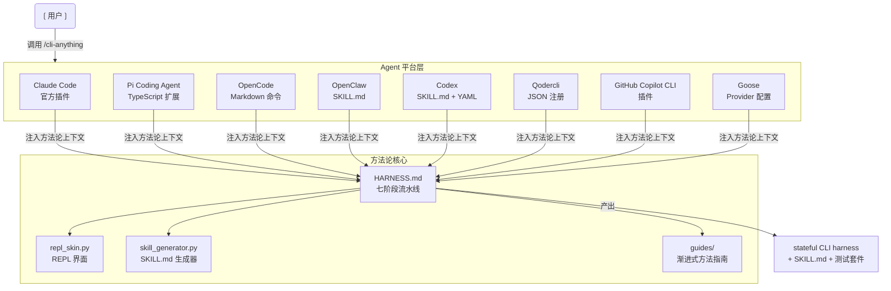
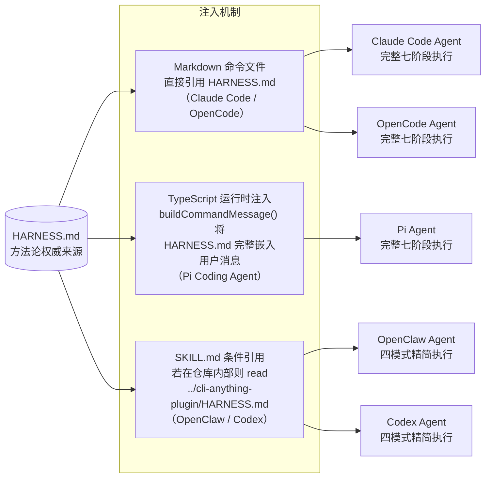
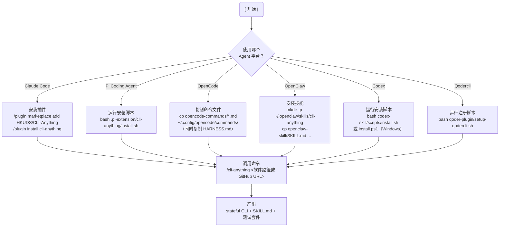

<details>
<summary>相关源文件</summary>

- `cli-anything-plugin/README.md`
- `cli-anything-plugin/commands/cli-anything.md`
- `cli-anything-plugin/.claude-plugin/plugin.json`
- `.pi-extension/cli-anything/index.ts`
- `.pi-extension/cli-anything/install.sh`
- `opencode-commands/cli-anything.md`
- `openclaw-skill/SKILL.md`
- `codex-skill/SKILL.md`
- `codex-skill/scripts/install.sh`
- `codex-skill/scripts/install.ps1`
- `qoder-plugin/setup-qodercli.sh`

</details>

# 多 Agent 平台集成

CLI-Anything 的核心设计目标之一，是让同一套 HARNESS.md 方法论能够在尽可能多的 AI 编码 Agent 平台上运行。无论开发者使用何种 Agent，只要安装对应的集成包，即可获得完全相同的七阶段 CLI 生成能力。本页梳理当前所支持的八个平台及其安装、使用方式，并解释各平台集成包如何将用户指令"桥接"到统一的方法论实现。

---

## 平台全览

| 平台 | 集成形式 | 维护状态 | 安装目标路径 |
|------|----------|----------|-------------|
| **Claude Code** | 官方插件 | 主要支持 | `~/.claude/plugins/cli-anything/` |
| **Pi Coding Agent** | TypeScript 扩展 | 官方支持 | `~/.pi/agent/extensions/cli-anything/` |
| **OpenCode** | Markdown 命令文件 | 官方支持 | `~/.config/opencode/commands/` |
| **OpenClaw** | SKILL.md 技能 | 社区贡献 | `~/.openclaw/skills/cli-anything/` |
| **Codex** | SKILL.md + YAML | 社区，实验性 | `$CODEX_HOME/skills/cli-anything/` |
| **Qodercli** | Shell 脚本注册 | 社区贡献 | `~/.qoder.json` |
| **GitHub Copilot CLI** | 插件安装 | 社区贡献 | — |
| **Goose** | CLI Provider 配置 | 社区，实验性 | — |



Sources: [`cli-anything-plugin/README.md`](../../../project-repos/CLI-Anything/%60cli-anything-plugin/README.md%60) [`opencode-commands/cli-anything.md`](../../../project-repos/CLI-Anything/%60opencode-commands/cli-anything.md%60) [`openclaw-skill/SKILL.md`](../../../project-repos/CLI-Anything/%60openclaw-skill/SKILL.md%60) [`codex-skill/SKILL.md`](../../../project-repos/CLI-Anything/%60codex-skill/SKILL.md%60)

<details class="source-snippets">
<summary>引用源码</summary>

<!-- source-snippets:start -->

#### ``cli-anything-plugin/README.md``

> 未找到引用文件：``cli-anything-plugin/README.md``

#### ``opencode-commands/cli-anything.md``

> 未找到引用文件：``opencode-commands/cli-anything.md``

#### ``openclaw-skill/SKILL.md``

> 未找到引用文件：``openclaw-skill/SKILL.md``

#### ``codex-skill/SKILL.md``

> 未找到引用文件：``codex-skill/SKILL.md``

<!-- source-snippets:end -->
</details>

---

## 1. Claude Code（主要支持平台）

Claude Code 是 CLI-Anything 的**首要目标平台**，拥有最完整的集成实现和最丰富的命令集。

### 安装方式

**通过 Marketplace 安装（推荐）**

```bash
# 第一步：将仓库添加到 Marketplace 源
/plugin marketplace add HKUDS/CLI-Anything

# 第二步：安装插件
/plugin install cli-anything
```

**手动安装**

```bash
cp -r cli-anything-plugin ~/.claude/plugins/cli-anything
```

### 插件目录结构

插件位于仓库 `cli-anything-plugin/` 目录下，安装后部署到 `~/.claude/plugins/cli-anything/`：

```
cli-anything-plugin/
├── .claude-plugin/
│   └── plugin.json              # Marketplace 注册元数据
├── commands/
│   ├── cli-anything.md          # /cli-anything 主构建命令
│   ├── refine.md                # /cli-anything:refine 覆盖率扩展
│   ├── test.md                  # /cli-anything:test 测试执行
│   ├── validate.md              # /cli-anything:validate 规范校验
│   └── list.md                  # /cli-anything:list CLI 枚举
├── HARNESS.md                   # 方法论 SOP 主文档
├── repl_skin.py                 # REPL 皮肤实现
├── skill_generator.py           # SKILL.md 自动生成器
└── guides/                      # 渐进式披露指南
    ├── session-locking.md
    ├── filter-translation.md
    ├── preview-methodology.md
    ├── auto-save-dry-run.md
    ├── skill-generation.md
    └── ...
```

`plugin.json` 内容如下，用于 Marketplace 注册：

```json
{
  "name": "cli-anything",
  "description": "Build powerful, stateful CLI interfaces for any GUI application using the cli-anything harness methodology.",
  "author": {
    "name": "cli-anything contributors"
  }
}
```

### 可用命令

| 命令 | 说明 | 示例 |
|------|------|------|
| `/cli-anything <path>` | 完整执行七阶段流水线，构建新 CLI harness | `/cli-anything /home/user/gimp` |
| `/cli-anything:refine <path> [focus]` | 对现有 harness 做差距分析，扩展覆盖率 | `/cli-anything:refine /home/user/shotcut "vid-in-vid"` |
| `/cli-anything:test <path>` | 运行测试套件并更新 TEST.md | `/cli-anything:test /home/user/gimp` |
| `/cli-anything:validate <path>` | 按 HARNESS.md 规范校验 harness | `/cli-anything:validate https://github.com/blender/blender` |
| `/cli-anything:list [--path] [--depth] [--json]` | 枚举本地所有已安装/已生成的 CLI | `/cli-anything:list --depth 2 --json` |

### 工作机制

Claude Code 的每个命令文件（`commands/*.md`）采用 Markdown 驱动的 Prompt 注入方式：Agent 在收到用户命令时，首先**强制读取 `HARNESS.md`**，再依据当前命令的规格（如 `cli-anything.md`）执行对应阶段。

`commands/cli-anything.md` 开头明确要求：

> **Before doing anything else, you MUST read `./HARNESS.md`.** It defines the complete methodology, architecture standards, and implementation patterns. Every phase below follows HARNESS.md. Do not improvise — follow the harness specification.

Sources: [`cli-anything-plugin/README.md`](../../../project-repos/CLI-Anything/%60cli-anything-plugin/README.md%60) [`cli-anything-plugin/commands/cli-anything.md`](../../../project-repos/CLI-Anything/%60cli-anything-plugin/commands/cli-anything.md%60) [`cli-anything-plugin/.claude-plugin/plugin.json`](../../../project-repos/CLI-Anything/%60cli-anything-plugin/.claude-plugin/plugin.json%60)

<details class="source-snippets">
<summary>引用源码</summary>

<!-- source-snippets:start -->

#### ``cli-anything-plugin/README.md``

> 未找到引用文件：``cli-anything-plugin/README.md``

#### ``cli-anything-plugin/commands/cli-anything.md``

> 未找到引用文件：``cli-anything-plugin/commands/cli-anything.md``

#### ``cli-anything-plugin/.claude-plugin/plugin.json``

> 未找到引用文件：``cli-anything-plugin/.claude-plugin/plugin.json``

<!-- source-snippets:end -->
</details>

---

## 2. Pi Coding Agent

Pi Coding Agent 通过 TypeScript 扩展 API 实现集成。扩展不依赖 Markdown 命令文件机制，而是在运行时动态拼装上下文消息，将 HARNESS.md 内容直接注入 Agent 会话。

### 安装

```bash
# 从仓库根目录执行全局安装脚本
bash .pi-extension/cli-anything/install.sh

# 卸载
bash .pi-extension/cli-anything/install.sh --uninstall
```

安装脚本将扩展文件复制到 `~/.pi/agent/extensions/cli-anything/`，重启 Pi 或在会话中执行 `/reload` 后生效。

### 扩展结构

```
.pi-extension/cli-anything/
├── index.ts      # 扩展入口，注册所有 /cli-anything 命令
├── install.sh    # 全局安装脚本（目标：~/.pi/agent/extensions/cli-anything/）
└── tests/        # 扩展测试
```

### 核心实现原理

`index.ts` 通过 Pi 的 `ExtensionAPI` 注册五个命令。每条命令触发时，`buildCommandMessage()` 函数将以下内容拼装成单条用户消息，经 `pi.sendUserMessage()` 注入 Agent 会话：

1. 完整的 `HARNESS.md` 内容
2. 对应命令的 Markdown 规格文件
3. 用户传入的参数
4. `guides/`、`scripts/`、`templates/` 等资源目录的真实路径

```typescript
function buildCommandMessage(
    commandName: string,
    commandMd: string,
    userArgs: string,
): string {
    const harnessMd = readAsset("HARNESS.md");
    // ... 拼装完整上下文消息，包含路径重映射规则
    return `[CLI-Anything Command: ${commandName}]\n\n## CRITICAL: HARNESS.md — Read First\n${harnessMd}\n...`;
}
```

**路径重映射**：命令规格中的容器化路径（如 `/root/cli-anything/<software>/`）会通过重映射规则转换为 Pi 环境下的真实路径，确保 Agent 能正确定位 `repl_skin.py`、`skill_generator.py` 等工具文件。

### 可用命令

安装后，Pi 会话中支持与 Claude Code 相同的命令集：

| 命令 | 说明 |
|------|------|
| `/cli-anything <path-or-repo>` | 构建完整 CLI harness |
| `/cli-anything:refine <path> [focus]` | 扩展现有 harness 覆盖率 |
| `/cli-anything:test <path-or-repo>` | 运行测试并更新 TEST.md |
| `/cli-anything:validate <path-or-repo>` | 校验 harness 规范合规性 |
| `/cli-anything:list [--path] [--depth] [--json]` | 枚举可用 CLI 工具 |

Sources: [`.pi-extension/cli-anything/index.ts`](../../../project-repos/CLI-Anything/%60.pi-extension/cli-anything/index.ts%60) [`.pi-extension/cli-anything/install.sh`](../../../project-repos/CLI-Anything/%60.pi-extension/cli-anything/install.sh%60)

<details class="source-snippets">
<summary>引用源码</summary>

<!-- source-snippets:start -->

#### ``.pi-extension/cli-anything/index.ts``

> 未找到引用文件：``.pi-extension/cli-anything/index.ts``

#### ``.pi-extension/cli-anything/install.sh``

> 未找到引用文件：``.pi-extension/cli-anything/install.sh``

<!-- source-snippets:end -->
</details>

---

## 3. OpenCode

OpenCode 通过放置 Markdown 命令文件实现集成，是最轻量级的集成方式之一。

### 安装

**全局安装**（所有项目可用）：

```bash
cp opencode-commands/*.md ~/.config/opencode/commands/
cp cli-anything-plugin/HARNESS.md ~/.config/opencode/commands/
```

**项目级安装**（仅当前项目可用）：

```bash
mkdir -p .opencode/commands
cp opencode-commands/*.md .opencode/commands/
cp cli-anything-plugin/HARNESS.md .opencode/commands/
```

> **注意**：`HARNESS.md` 必须与命令文件放在同一目录下，因为命令文件会在运行时读取它。

### 命令文件结构

```
opencode-commands/
├── cli-anything.md         # 主构建命令
├── cli-anything-refine.md  # 差距分析与扩展
├── cli-anything-test.md    # 测试执行
├── cli-anything-validate.md # 规范校验
└── cli-anything-list.md    # CLI 枚举
```

OpenCode 命令文件使用 YAML frontmatter 声明元数据：

```yaml
---
description: Build a complete CLI harness for any GUI application (all 7 phases)
subtask: true
---
```

`$1` 占位符接收用户传入的路径或 URL 参数。

Sources: [`opencode-commands/cli-anything.md`](../../../project-repos/CLI-Anything/%60opencode-commands/cli-anything.md%60)

<details class="source-snippets">
<summary>引用源码</summary>

<!-- source-snippets:start -->

#### ``opencode-commands/cli-anything.md``

> 未找到引用文件：``opencode-commands/cli-anything.md``

<!-- source-snippets:end -->
</details>

---

## 4. OpenClaw（社区）

OpenClaw 通过 SKILL.md 文件定义技能，采用 `@skill-name` 触发语法。

### 安装

```bash
mkdir -p ~/.openclaw/skills/cli-anything
cp openclaw-skill/SKILL.md ~/.openclaw/skills/cli-anything/SKILL.md
```

### 使用方式

```bash
@cli-anything build a CLI for ./gimp
```

### SKILL.md 设计

`openclaw-skill/SKILL.md` 使用 YAML frontmatter 定义触发规则：

```yaml
---
name: cli-anything
description: Use when the user wants OpenClaw to build, refine, test, or validate a CLI-Anything harness for a GUI application or source repository.
---
```

技能内容为精简版方法论，包含四种操作模式（Build / Refine / Test / Validate）的具体规则，以及后端选择原则和打包规范。若技能在 CLI-Anything 仓库内被使用，它会指引 Agent 读取 `../cli-anything-plugin/HARNESS.md` 以获取完整方法论；否则依照内嵌的精简规则执行。

Sources: [`openclaw-skill/SKILL.md`](../../../project-repos/CLI-Anything/%60openclaw-skill/SKILL.md%60)

<details class="source-snippets">
<summary>引用源码</summary>

<!-- source-snippets:start -->

#### ``openclaw-skill/SKILL.md``

> 未找到引用文件：``openclaw-skill/SKILL.md``

<!-- source-snippets:end -->
</details>

---

## 5. Codex（社区，实验性）

Codex 集成采用与 OpenClaw 类似的 SKILL.md 方式，但额外提供了 OpenAI Agent YAML 配置和跨平台安装脚本。

### 安装

**Linux / macOS（Bash）**：

```bash
bash codex-skill/scripts/install.sh
# 安装到 $CODEX_HOME/skills/cli-anything/（默认 ~/.codex/skills/cli-anything/）
```

**Windows（PowerShell）**：

```powershell
.\codex-skill\scripts\install.ps1
# 安装到 $env:CODEX_HOME\skills\cli-anything\
```

两个脚本都会检测目标目录是否已存在，若存在则**拒绝覆盖**并提示用户手动删除：

```bash
if [[ -e "${DEST_DIR}" ]]; then
  echo "Refusing to overwrite existing skill: ${DEST_DIR}" >&2
  exit 1
fi
```

### 目录结构

```
codex-skill/
├── SKILL.md              # 技能定义（与 OpenClaw 版本结构相同）
├── agents/
│   └── openai.yaml       # OpenAI Agent 接口配置
└── scripts/
    ├── install.sh         # Bash 安装脚本
    └── install.ps1        # PowerShell 安装脚本
```

`agents/openai.yaml` 为 Codex 的 Agent 界面提供描述信息：

```yaml
interface:
  display_name: "CLI-Anything"
  short_description: "Build or refine CLI-Anything harnesses from Codex."
  default_prompt: "Use CLI-Anything to build, refine, test, or validate a harness for the user's target software or source repository."
```

Sources: [`codex-skill/SKILL.md`](../../../project-repos/CLI-Anything/%60codex-skill/SKILL.md%60) [`codex-skill/scripts/install.sh`](../../../project-repos/CLI-Anything/%60codex-skill/scripts/install.sh%60) [`codex-skill/scripts/install.ps1`](../../../project-repos/CLI-Anything/%60codex-skill/scripts/install.ps1%60)

<details class="source-snippets">
<summary>引用源码</summary>

<!-- source-snippets:start -->

#### ``codex-skill/SKILL.md``

> 未找到引用文件：``codex-skill/SKILL.md``

#### ``codex-skill/scripts/install.sh``

> 未找到引用文件：``codex-skill/scripts/install.sh``

#### ``codex-skill/scripts/install.ps1``

> 未找到引用文件：``codex-skill/scripts/install.ps1``

<!-- source-snippets:end -->
</details>

---

## 6. Qodercli（社区）

Qodercli 通过修改 `~/.qoder.json` 配置文件来注册插件。

### 安装

```bash
# 自动检测插件路径
bash qoder-plugin/setup-qodercli.sh

# 指定自定义插件路径
bash qoder-plugin/setup-qodercli.sh /path/to/cli-anything-plugin
```

安装脚本验证 `cli-anything-plugin/.claude-plugin/plugin.json` 存在后，将插件信息写入 `~/.qoder.json`。脚本会自动补全颜色输出和路径规范化，并支持显式传入自定义插件目录。

Sources: [`qoder-plugin/setup-qodercli.sh`](../../../project-repos/CLI-Anything/%60qoder-plugin/setup-qodercli.sh%60)

<details class="source-snippets">
<summary>引用源码</summary>

<!-- source-snippets:start -->

#### ``qoder-plugin/setup-qodercli.sh``

> 未找到引用文件：``qoder-plugin/setup-qodercli.sh``

<!-- source-snippets:end -->
</details>

---

## 7. GitHub Copilot CLI（社区）

```bash
copilot plugin install ./cli-anything-plugin
```

安装后，Copilot CLI 以相同的 `/cli-anything` 命令集提供服务。

---

## 8. Goose（社区，实验性）

Goose 通过配置 CLI Provider（例如 Claude Code）实现集成，无需独立的集成包。安装好 CLI Provider 后，即可在 Goose 会话中使用相同的命令：

```bash
/cli-anything <path>
```

---

## 各平台方法论注入对比

所有平台的集成包都将 HARNESS.md 作为核心知识源注入 Agent。下图展示了不同平台在注入机制上的差异：



| 集成包类型 | HARNESS.md 访问方式 | 方法论完整度 |
|------------|---------------------|-------------|
| Claude Code 插件 | Agent 在会话开始时主动读取文件 | 完整七阶段 |
| Pi 扩展 | 运行时通过 `readAsset()` 嵌入消息体 | 完整七阶段 |
| OpenCode 命令 | 与命令文件并排放置，Agent 直接读取 | 完整七阶段 |
| OpenClaw / Codex SKILL.md | 仓库内条件读取；仓库外使用内嵌精简规则 | 四模式精简 |
| Qodercli / Copilot / Goose | 复用 Claude Code 插件格式 | 视底层 Provider 而定 |

---

## 核心共享资源

无论使用哪个平台，所有集成包都依赖以下共享资源：

### HARNESS.md

方法论的**单一权威来源**（Single Source of Truth）。定义七阶段流水线的完整规范，包括目录结构、命名约定、测试要求、SKILL.md 格式等。所有命令在执行前必须首先读取此文件。

### repl_skin.py

统一的 REPL 界面实现。在生成 harness 的第三阶段（实现阶段），此文件会被复制到 `<software>/agent-harness/cli_anything/<software>/utils/repl_skin.py`，为所有 CLI 提供一致的 REPL 体验：品牌 Banner、彩色提示符、`success()` / `error()` / `warning()` 等预置消息助手。

### skill_generator.py

SKILL.md 自动生成工具（阶段 6.5）。从已构建的 CLI 中提取元数据，生成符合 skill-creator 方法论的 SKILL.md 文件，包含 YAML frontmatter、命令组文档和 Agent 专用使用指南。

### guides/ 目录

渐进式方法论指南，在特定场景下补充 HARNESS.md 的细节：

| 指南文件 | 适用场景 |
|----------|----------|
| `session-locking.md` | 并发会话安全锁定 |
| `filter-translation.md` | GUI 滤镜参数映射到 CLI 标志 |
| `preview-methodology.md` | 非破坏性预览生成 |
| `auto-save-dry-run.md` | 单次调用模式下的自动保存 + `--dry-run` 模式 |
| `skill-generation.md` | SKILL.md 生成的最佳实践 |
| `pypi-publishing.md` | PyPI 发布流程 |
| `timecode-precision.md` | 视频 harness 的时间码精度处理 |
| `mcp-backend.md` | MCP 协议后端集成 |

Sources: [`cli-anything-plugin/README.md`](../../../project-repos/CLI-Anything/%60cli-anything-plugin/README.md%60)

<details class="source-snippets">
<summary>引用源码</summary>

<!-- source-snippets:start -->

#### ``cli-anything-plugin/README.md``

> 未找到引用文件：``cli-anything-plugin/README.md``

<!-- source-snippets:end -->
</details>

---

## 快速开始：选择平台



---

## 相关页面

- [项目概览](overview.md)
- [测试与质量保障](testing-and-quality.md)
- [系统架构](system-architecture.md)
