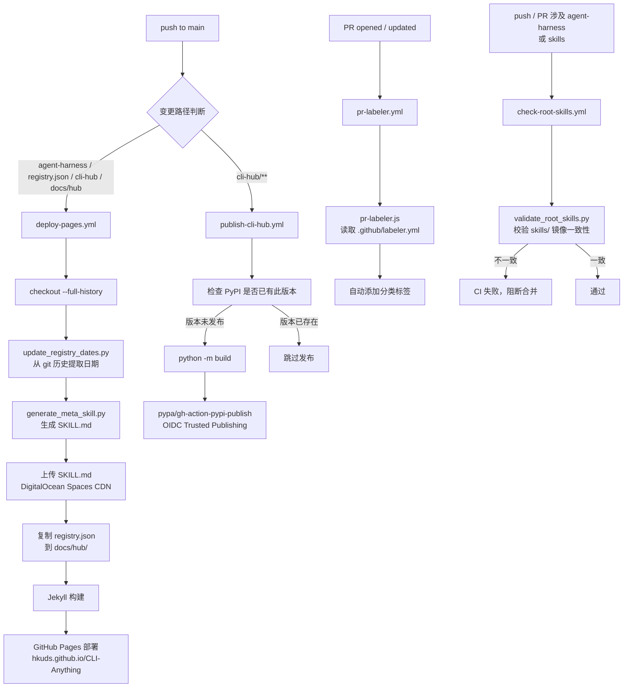

<details>
<summary>相关源文件</summary>

- `.github/workflows/deploy-pages.yml`
- `.github/workflows/publish-cli-hub.yml`
- `.github/workflows/check-root-skills.yml`
- `.github/workflows/pr-labeler.yml`
- `.github/scripts/generate_meta_skill.py`
- `.github/scripts/update_registry_dates.py`
- `.github/scripts/sync_root_skills.py`
- `.github/scripts/validate_root_skills.py`
- `.github/scripts/pr-labeler.js`
- `.github/labeler.yml`
- `registry.json`
- `public_registry.json`
- `docs/hub/index.html`
- `docs/hub/index-modern.html`

</details>

# CI/CD 与注册表基础设施

CLI-Anything 的持续集成与交付体系由四条 GitHub Actions workflow 组成，负责自动化完成注册表更新、GitHub Pages 部署、PyPI 发布和代码质量验证。注册表（`registry.json`）是整个系统的事实来源，通过 GitHub Pages 对外提供服务，meta-skill 文件则额外备份至 DigitalOcean Spaces CDN。

## GitHub Actions Workflows

Sources: [github/workflows/](../../../project-repos/CLI-Anything/.github/workflows)

<details class="source-snippets">
<summary>引用源码</summary>

<!-- source-snippets:start -->

#### `github/workflows/`

> 引用目标是目录，无法展开源码片段：`github/workflows/`

<!-- source-snippets:end -->
</details>
### 1. `deploy-pages.yml` — GitHub Pages 部署

**触发条件**：push 到 `main` 分支，且变更路径包含以下任一项：
- `agent-harness/**`
- `registry.json`
- `public_registry.json`
- `cli-hub/**`
- `docs/hub/**`

**执行步骤**：

1. `actions/checkout` — 完整历史克隆（`fetch-depth: 0`，供日期脚本读取 git log）
2. `actions/setup-python@v4` — Python 3.10
3. 运行 `update_registry_dates.py` — 从 git 历史提取各 harness 的更新日期并写入 registry
4. 运行 `generate_meta_skill.py` — 从 `registry.json` 生成 CLI-Hub meta-skill（`SKILL.md`）
5. 通过 AWS CLI 将 `SKILL.md` 上传至 DigitalOcean Spaces（s3 兼容接口）
6. 将 `registry.json` 复制到 `docs/hub/` 目录，供前端使用
7. Jekyll 构建静态站点
8. `actions/deploy-pages` — 部署至 GitHub Pages

### 2. `publish-cli-hub.yml` — 自动发布至 PyPI

**触发条件**：push 到 `main`，且路径匹配 `cli-hub/**`

**执行步骤**：

1. 通过 `curl` 查询 PyPI API，检查当前版本是否已发布（避免重复发布）
2. `python -m build` — 构建 wheel 和 sdist
3. `pypa/gh-action-pypi-publish` — 使用 OIDC trusted publishing 发布（无需手动管理 PyPI token）

OIDC trusted publishing 通过 GitHub 与 PyPI 之间的身份联合实现免密发布，是当前推荐的最佳实践。

### 3. `check-root-skills.yml` — Root Skills 镜像验证

**触发条件**：PR 或 push 涉及 `agent-harness/**` 或 `skills/**`

**作用**：运行 `validate_root_skills.py`，验证根目录 `skills/` 中的 skill 文件与各 harness 包内的 skill 定义保持同步，防止镜像不一致。

### 4. `pr-labeler.yml` — PR 自动打标签

**触发条件**：PR 开启或更新

**作用**：运行 `pr-labeler.js`，读取 `.github/labeler.yml` 中的路径规则，为 PR 自动添加分类标签（如 `harness`、`cli-hub`、`docs` 等）。

## 辅助脚本

Sources: [github/scripts/](../../../project-repos/CLI-Anything/.github/scripts)

<details class="source-snippets">
<summary>引用源码</summary>

<!-- source-snippets:start -->

#### `github/scripts/`

> 引用目标是目录，无法展开源码片段：`github/scripts/`

<!-- source-snippets:end -->
</details>
| 脚本 | 功能 |
|------|------|
| `generate_meta_skill.py` | 读取 `registry.json`，生成供 Agent 使用的 CLI-Hub meta-skill（`SKILL.md`） |
| `update_registry_dates.py` | 遍历 git 历史，为每个 harness 提取最近修改日期并更新 `registry.json` |
| `sync_root_skills.py` | 将各 harness 包内的 skill 文件同步复制到根目录 `skills/` |
| `validate_root_skills.py` | 校验根目录 `skills/` 与各 harness 的 skill 内容一致，CI 中断言检查 |
| `pr-labeler.js` | 基于变更文件路径为 PR 自动添加标签 |

## 注册表架构

Sources: [registry.json](../../../project-repos/CLI-Anything/registry.json), [public_registry.json](../../../project-repos/CLI-Anything/public_registry.json), [docs/hub/index.html](../../../project-repos/CLI-Anything/docs/hub/index.html)

<details class="source-snippets">
<summary>引用源码</summary>

<!-- source-snippets:start -->

#### `registry.json`

```json
{
  "meta": {
    "repo": "https://github.com/HKUDS/CLI-Anything",
    "description": "CLI-Hub — Agent-native stateful CLI interfaces for softwares, codebases, and Web Services",
    "updated": "2026-04-16"
  },
  "clis": [
    {
      "name": "wiremock",
      "display_name": "WireMock",
      "version": "0.1.0",
      "description": "HTTP mock server management — create stubs, inspect requests, record traffic, and manage scenarios via WireMock REST API",
      "requires": "WireMock server running (java -jar wiremock-standalone.jar)",
      "homepage": "https://wiremock.org",
      "source_url": null,
      "install_cmd": "pip install git+https://github.com/HKUDS/CLI-Anything.git#subdirectory=wiremock/agent-harness",
      "entry_point": "cli-anything-wiremock",
      "skill_md": "skills/cli-anything-wiremock/SKILL.md",
      "category": "testing",
      "contributors": [
        {
          "name": "fabiomantel",
          "url": "https://github.com/fabiomantel"
        }
      ]
    },
    {
      "name": "anygen",
      "display_name": "AnyGen",
      "version": "1.0.0",
      "description": "Generate docs, slides, websites and more via AnyGen cloud API",
      "requires": "ANYGEN_API_KEY",
      "homepage": "https://anygen.com",
      "source_url": null,
      "install_cmd": "pip install git+https://github.com/HKUDS/CLI-Anything.git#subdirectory=anygen/agent-harness",
      "entry_point": "cli-anything-anygen",
      "skill_md": "skills/cli-anything-anygen/SKILL.md",
      "category": "generation",
      "contributors": [
        {
          "name": "koltyu-anygen",
          "url": "https://github.com/koltyu-anygen"
        }
      ]
    },
    {
      "name": "adguardhome",
      "display_name": "AdGuardHome",
      "version": "1.0.0",
      "description": "DNS ad-blocking and network infrastructure management via AdGuardHome REST API",
      "requires": "AdGuardHome instance running",
      "homepage": "https://adguard.com/adguard-home/overview.html",
      "source_url": null,
      "install_cmd": "pip install git+https://github.com/HKUDS/CLI-Anything.git#subdirectory=adguardhome/agent-harness",
      "entry_point": "cli-anything-adguardhome",
      "skill_md": null,
      "category": "network",
      "contributors": [
        {
          "name": "pyxl-dev",
          "url": "https://github.com/pyxl-dev"
        }
      ]
    },
    {
      "name": "audacity",
      "display_name": "Audacity",
      "version": "1.0.0",
      "description": "Audio editing and processing via sox",
      "requires": "sox (apt install sox)",
      "homepage": "https://www.audacityteam.org",
      "source_url": null,
      "install_cmd": "pip install git+https://github.com/HKUDS/CLI-Anything.git#subdirectory=audacity/agent-harness",
      "entry_point": "cli-anything-audacity",
      "skill_md": "skills/cli-anything-audacity/SKILL.md",
      "category": "audio",
      "contributors": [
        {
          "name": "CLI-Anything-Team",
          "url": "https://github.com/HKUDS/CLI-Anything"
        }
      ]
    },
    {
      "name": "blender",
      "display_name": "Blender",
      "version": "1.0.0",
      "description": "3D modeling, animation, and rendering via blender --background --python",
      "requires": "blender >= 4.2",
      "homepage": "https://www.blender.org",
      "source_url": null,
      "install_cmd": "pip install git+https://github.com/HKUDS/CLI-Anything.git#subdirectory=blender/agent-harness",
      "entry_point": "cli-anything-blender",
      "skill_md": "skills/cli-anything-blender/SKILL.md",
      "category": "3d",
      "contributors": [
        {
          "name": "CLI-Anything-Team",
          "url": "https://github.com/HKUDS/CLI-Anything"
        }
      ]
    },
    {
      "name": "browser",
      "display_name": "Browser",
      "version": "1.0.0",
      "description": "Browser automation via DOMShell MCP server. Maps Chrome's Accessibility Tree to a virtual filesystem for agent-native navigation.",
      "requires": "Node.js, npx, Chrome + DOMShell extension",
      "homepage": "https://github.com/apireno/DOMShell",
      "source_url": null,
      "install_cmd": "pip install git+https://github.com/HKUDS/CLI-Anything.git#subdirectory=browser/agent-harness",
      "entry_point": "cli-anything-browser",
      "skill_md": "skills/cli-anything-browser/SKILL.md",
      "category": "web",
      "contributors": [
        {
          "name": "furkankoykiran",
          "url": "https://github.com/furkankoykiran"
        }
      ]
```

#### `public_registry.json`

```json
{
  "meta": {
    "repo": "https://github.com/HKUDS/CLI-Anything",
    "description": "Public CLI Registry — Third-party and official CLIs managed by CLI-Hub across npm, bundled, brew, and other install methods",
    "updated": "2026-04-18"
  },
  "clis": [
    {
      "name": "feishu",
      "display_name": "Feishu/Lark CLI",
      "version": "latest",
      "description": "Official Lark (Feishu) CLI for managing Lark apps, bots, and cloud resources from the terminal",
      "category": "communication",
      "requires": "Node.js >= 16",
      "homepage": "https://github.com/larksuite/cli",
      "source_url": "https://github.com/larksuite/cli",
      "package_manager": "npm",
      "npm_package": "@larksuite/cli",
      "install_cmd": "npm install -g @larksuite/cli",
      "npx_cmd": "npx @larksuite/cli",
      "skill_md": "npx skills add larksuite/cli -y -g",
      "entry_point": "lark-cli",
      "contributors": [
        {
          "name": "larksuite",
          "url": "https://github.com/larksuite"
        }
      ]
    },
    {
      "name": "minimax-cli",
      "display_name": "MiniMax CLI",
      "version": "latest",
      "description": "MiniMax AI platform CLI for managing tokens, models, and API interactions from the command line",
      "category": "ai",
      "requires": "Node.js >= 16, MINIMAX_API_KEY",
      "homepage": "https://platform.minimax.io",
      "source_url": null,
      "package_manager": "npm",
      "npm_package": "minimax-cli",
      "install_cmd": "npm install -g minimax-cli",
      "npx_cmd": "npx minimax-cli",
      "skill_md": "https://platform.minimax.io/docs/token-plan/minimax-cli",
      "entry_point": "minimax-cli",
      "contributors": [
        {
          "name": "MiniMax",
          "url": "https://platform.minimax.io"
        }
      ]
    },
    {
      "name": "wecom",
      "display_name": "WeCom CLI",
      "version": "latest",
      "description": "Official WeCom open-platform CLI for contacts, todos, meetings, messages, calendars, docs, and smart sheets",
      "category": "communication",
      "requires": "Node.js >= 18, WeCom account (currently limited rollout), optional Bot ID + Secret for bot flows",
      "homepage": "https://open.work.weixin.qq.com/",
      "source_url": "https://github.com/WecomTeam/wecom-cli",
      "package_manager": "npm",
      "npm_package": "@wecom/cli",
      "install_cmd": "npm install -g @wecom/cli",
      "npx_cmd": "npx @wecom/cli",
      "skill_md": "npx skills add WeComTeam/wecom-cli -y -g",
      "entry_point": "wecom-cli",
      "contributors": [
        {
          "name": "WecomTeam",
          "url": "https://github.com/WecomTeam"
        }
      ]
    },
    {
      "name": "contentful",
      "display_name": "Contentful CLI",
      "version": "latest",
      "description": "Official Contentful CLI for spaces, migrations, imports, exports, seeding, and environment management",
      "category": "web",
      "requires": "Node.js LTS, Contentful account and space access",
      "homepage": "https://www.contentful.com/",
      "source_url": "https://github.com/contentful/contentful-cli",
      "package_manager": "npm",
      "npm_package": "contentful-cli",
      "install_cmd": "npm install -g contentful-cli",
      "npx_cmd": "npx contentful-cli",
      "skill_md": "https://github.com/contentful/contentful-cli/tree/main/docs",
      "entry_point": "contentful",
      "contributors": [
        {
          "name": "Contentful",
          "url": "https://github.com/contentful"
        }
      ]
    },
    {
      "name": "sanity",
      "display_name": "Sanity CLI",
      "version": "latest",
      "description": "Official Sanity CLI for studios, datasets, schemas, imports, exports, and structured content workflows",
      "category": "web",
      "requires": "Node.js and npm, Sanity account/project access",
      "homepage": "https://www.sanity.io/",
      "source_url": "https://github.com/sanity-io/sanity",
      "package_manager": "npm",
      "npm_package": "sanity",
      "install_cmd": "npm install -g sanity",
      "npx_cmd": "npx sanity@latest",
      "skill_md": "https://www.sanity.io/docs/apis-and-sdks/cli",
      "entry_point": "sanity",
      "contributors": [
        {
          "name": "Sanity",
          "url": "https://github.com/sanity-io"
        }
      ]
    },
    {
      "name": "shopify",
      "display_name": "Shopify CLI",
```

#### `docs/hub/index.html`

```html
<!DOCTYPE html>
<html lang="en">
<head>
  <meta charset="UTF-8">
  <meta name="viewport" content="width=device-width, initial-scale=1.0">
  <title>CLI-Anything Hub</title>
  <link rel="preconnect" href="https://fonts.googleapis.com">
  <link rel="preconnect" href="https://fonts.gstatic.com" crossorigin>
  <link href="https://fonts.googleapis.com/css2?family=Inter:wght@400;500;600;700&family=JetBrains+Mono:wght@400;500&display=swap" rel="stylesheet">
  <style>
    :root {
      --bg: #09090b;
      --surface: #18181b;
      --surface-raised: #1e1e22;
      --border: #27272a;
      --border-subtle: #1f1f23;
      --text: #fafafa;
      --text-secondary: #a1a1aa;
      --text-tertiary: #71717a;
      --hero-neutral-top: #e7ecf2;
      --hero-neutral-bottom: #b8c1cd;
      --accent: #3b82f6;
      --accent-muted: #2563eb;
      --green: #22c55e;
      --green-muted: rgba(34, 197, 94, 0.12);
      --purple: #a78bfa;
      --purple-muted: rgba(167, 139, 250, 0.12);
      --radius: 8px;
      --radius-sm: 6px;
    }

    /* ── Light theme ── */
    [data-theme="light"] {
      --bg: #ffffff;
      --surface: #f4f4f5;
      --surface-raised: #e4e4e7;
      --border: #d4d4d8;
      --border-subtle: #e4e4e7;
      --text: #09090b;
      --text-secondary: #52525b;
      --text-tertiary: #71717a;
      --hero-neutral-top: #7f8894;
      --hero-neutral-bottom: #a8b1bc;
      --accent: #2563eb;
      --accent-muted: #1d4ed8;
      --green: #16a34a;
      --green-muted: rgba(22, 163, 74, 0.1);
      --purple: #7c3aed;
      --purple-muted: rgba(124, 58, 237, 0.1);
    }

    * { margin: 0; padding: 0; box-sizing: border-box; }

    body {
      font-family: 'Inter', -apple-system, BlinkMacSystemFont, sans-serif;
      background: var(--bg);
      color: var(--text);
      line-height: 1.6;
      -webkit-font-smoothing: antialiased;
      -moz-osx-font-smoothing: grayscale;
    }

    /* ── Nav bar ── */
    .nav {
      display: flex;
      align-items: center;
      justify-content: space-between;
      max-width: 1120px;
      margin: 0 auto;
      padding: 1rem 1.5rem;
      border-bottom: 1px solid var(--border-subtle);
    }

    .nav-brand {
      font-size: 0.95rem;
      font-weight: 600;
      color: var(--text);
      text-decoration: none;
      letter-spacing: -0.01em;
    }

    .nav-brand span { color: var(--text-tertiary); }

    .nav-links {
      display: flex;
      align-items: center;
      gap: 0.25rem;
    }

    .nav-link {
      display: inline-flex;
      align-items: center;
      gap: 0.35rem;
      padding: 0.4rem 0.7rem;
      color: var(--text-secondary);
      text-decoration: none;
      font-size: 0.8rem;
      font-weight: 500;
      border-radius: var(--radius-sm);
      transition: color 0.15s, background 0.15s;
    }

    .nav-link:hover {
      color: var(--text);
      background: var(--surface);
    }

    .nav-link svg { width: 15px; height: 15px; flex-shrink: 0; }

    .nav-link-stars {
      display: inline-flex;
      align-items: center;
      justify-content: center;
      min-width: 2.8rem;
      padding: 0.1rem 0.45rem;
      border-radius: 999px;
      border: 1px solid var(--border);
      background: var(--surface);
      color: var(--text);
      font-size: 0.72rem;
```

<!-- source-snippets:end -->
</details>
### 数据源

- **`registry.json`**（仓库根目录）— 所有自有 harness CLI 的事实来源，包含名称、版本、描述、skill 路径等字段
- **`public_registry.json`** — 第三方或社区贡献的公开 CLI

### 对外服务

两个注册表文件通过 GitHub Pages 在以下地址提供 HTTP 访问：

```
https://hkuds.github.io/CLI-Anything/registry.json
https://hkuds.github.io/CLI-Anything/public_registry.json
```

### Hub 前端

- `docs/hub/index.html` — 注册表浏览页面（经典版）
- `docs/hub/index-modern.html` — 重设计版前端，提供搜索与过滤功能

### Meta-Skill CDN

`generate_meta_skill.py` 生成的 `SKILL.md` 上传至 DigitalOcean Spaces，通过 CDN 加速分发，供 Agent 运行时动态加载。

## 部署流水线图



## 相关页面

- [CLI-Hub 包管理器](cli-hub.md)
- [测试与质量保障](testing-and-quality.md)
