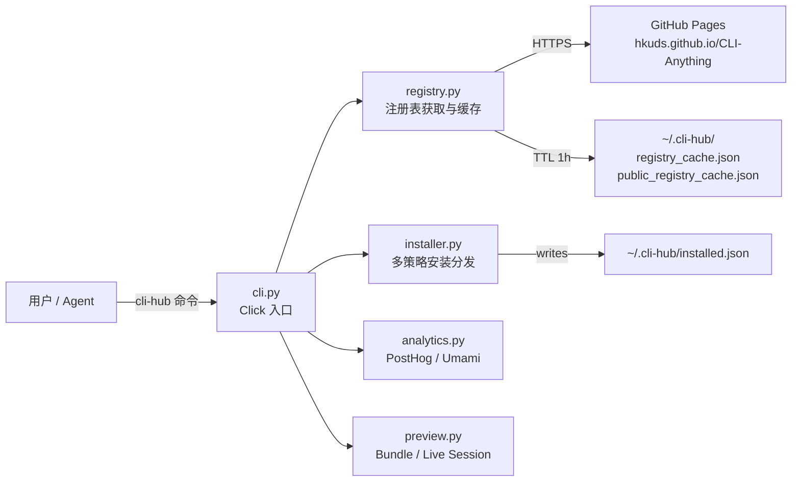
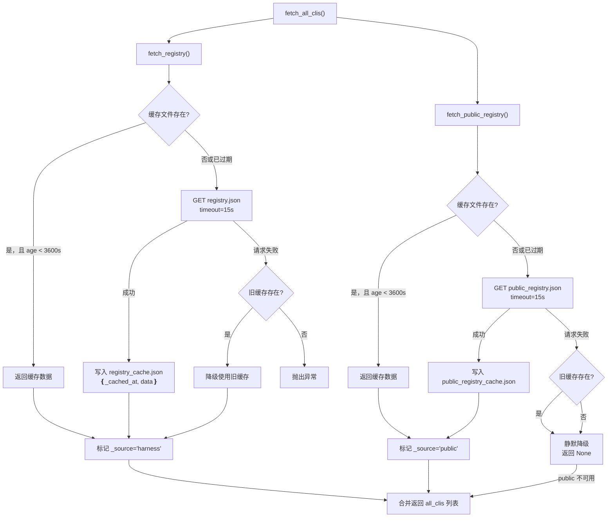
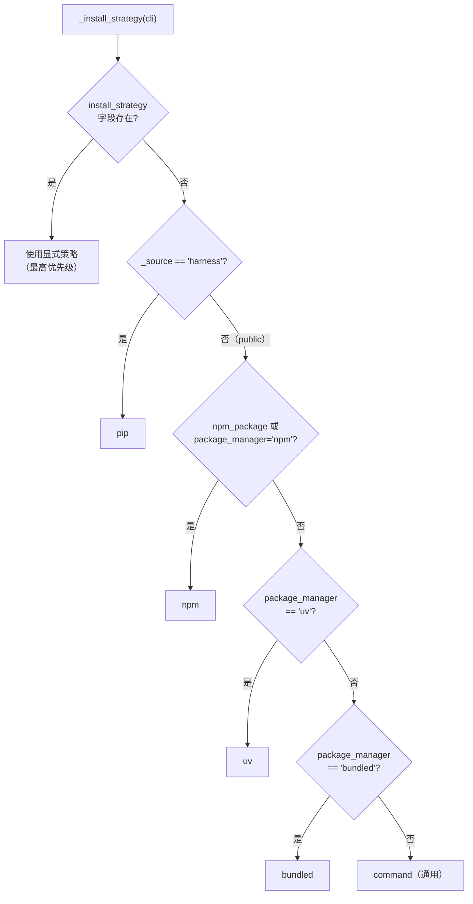

<details><summary>相关源文件</summary>

生成本页时使用的主要源文件：

- [cli-hub/cli_hub/cli.py](../../../project-repos/CLI-Anything/cli-hub/cli_hub/cli.py)
- [cli-hub/cli_hub/registry.py](../../../project-repos/CLI-Anything/cli-hub/cli_hub/registry.py)
- [cli-hub/cli_hub/installer.py](../../../project-repos/CLI-Anything/cli-hub/cli_hub/installer.py)
- [cli-hub/cli_hub/analytics.py](../../../project-repos/CLI-Anything/cli-hub/cli_hub/analytics.py)
- [cli-hub/setup.py](../../../project-repos/CLI-Anything/cli-hub/setup.py)
- [registry.json](../../../project-repos/CLI-Anything/registry.json)
- [public_registry.json](../../../project-repos/CLI-Anything/public_registry.json)

</details>

# CLI-Hub 包管理器

CLI-Hub 是 CLI-Anything 生态的官方包管理器，以 `pip install cli-anything-hub` 发布（PyPI 包名 `cli-anything-hub`，入口命令 `cli-hub`）。它负责从两个互补的注册表中发现、安装、更新和启动各类 CLI，支持 pip、npm、uv、bundled 和通用命令五种安装策略，并内置 PostHog/Umami 双提供商分析模块以及自动 Agent 身份识别能力。

---

## 1. 整体定位

CLI-Hub 在 CLI-Anything 架构中处于"用户接触层"——Agent 或人类开发者与其交互，通过它获取所有已索引的 CLI 封装。其核心功能链条如下：



Sources: `cli-hub/cli_hub/cli.py:1-34`, `cli-hub/setup.py:1-49`

---

## 2. 安装与入口

```bash
pip install cli-anything-hub
```

安装后获得 `cli-hub` 命令。`setup.py` 中声明的关键元数据：

| 字段 | 值 |
|---|---|
| PyPI 包名 | `cli-anything-hub` |
| 入口命令 | `cli-hub` |
| Python 版本要求 | >= 3.10 |
| 运行时依赖 | `click>=8.0`, `requests>=2.28` |
| 当前版本 | 0.3.0 |
| 许可证 | MIT |

Sources: `cli-hub/setup.py:5-49`

---

## 3. 命令参考

所有命令均通过 Click 框架注册于 `cli.py` 中的 `main` Click group。

### 3.1 顶层入口

```
cli-hub [--version]
```

无子命令时输出帮助。`--version` 打印当前版本号。每次调用都会触发：

1. `track_first_run()` — 首次运行时发送一次性 `cli-anything-hub-installed` 事件
2. `track_visit(command=..., detection=...)` — 记录每次调用及 Agent 身份识别结果

Sources: `cli-hub/cli_hub/cli.py:50-61`

---

### 3.2 install

```
cli-hub install <name>
```

按名称安装 CLI。流程：

1. 调用 `install_cli(name)`，内部查找注册表 → 决定策略 → 执行安装
2. 安装成功后写入 `~/.cli-hub/installed.json`
3. 发送 `cli-install` 分析事件（携带版本号和平台信息）
4. 输出 `entry_point` 和 `cli-hub launch <name>` 提示

对于 public npm CLIs，还会额外提示 `npx_cmd`。

Sources: `cli-hub/cli_hub/cli.py:73-90`

---

### 3.3 uninstall

```
cli-hub uninstall <name>
```

卸载已安装的 CLI。成功后从 `installed.json` 移除记录并发送 `cli-uninstall` 事件。

Sources: `cli-hub/cli_hub/cli.py:93-103`

---

### 3.4 update

```
cli-hub update <name>
```

强制刷新注册表缓存（`force_refresh=True`）后执行更新操作。pip 策略使用 `--upgrade --force-reinstall`，npm 策略追加 `@latest`，uv 策略调用 `update_cmd`。

Sources: `cli-hub/cli_hub/cli.py:106-118`, `cli-hub/cli_hub/installer.py:188-196`

---

### 3.5 list

```
cli-hub list [--category <cat>] [--source harness|public|npm|all] [--json]
```

列出所有可用 CLI，默认按 category 分组显示。

- `--category` / `-c`：按类别过滤（大小写不敏感）
- `--source` / `-s`：按来源过滤；`npm` 为 `public` 的别名
- `--json`：输出完整 JSON 数组，适合脚本消费

输出末尾显示汇总统计（total / harness / public 数量，已安装数，全部类别列表）。已安装的 CLI 旁边显示绿色 `●` 标记，public CLIs 显示黄色来源标签。

Sources: `cli-hub/cli_hub/cli.py:121-174`

---

### 3.6 search

```
cli-hub search <query> [--json]
```

在 name、description、category、display_name 四个字段上做大小写不敏感子串匹配。结果按注册表顺序排列，每条结果显示安装状态标记、类别标签和来源标签，并附上 `cli-hub install <name>` 快捷提示。

Sources: `cli-hub/cli_hub/cli.py:177-200`, `cli-hub/cli_hub/registry.py:100-110`

---

### 3.7 info

```
cli-hub info <name>
```

显示单个 CLI 的完整详情：display_name、description、category、source、package_manager、version、requires、entry_point、homepage、contributors、安装状态。public CLIs 额外显示 npm_package、npx_cmd、install_cmd、install_notes。

Sources: `cli-hub/cli_hub/cli.py:203-241`

---

### 3.8 launch

```
cli-hub launch <name> [args...]
```

通过 `os.execvp()` 以进程替换方式启动已安装的 CLI，所有额外参数透传给目标进程。启动前检查 `entry_point` 是否在 PATH 上；未找到时打印安装提示后退出。调用成功时发送 `cli-launch` 事件。

```python
os.execvp(entry, [entry] + list(args))
```

Sources: `cli-hub/cli_hub/cli.py:244-264`

---

### 3.9 previews 子命令组

```
cli-hub previews inspect  <preview_ref> [--json]
cli-hub previews html     <preview_ref> [-o output.html] [--poll-ms 1500]
cli-hub previews watch    <session_ref> [--poll-ms 1500] [--port 0] [--open]
cli-hub previews open     <preview_ref> [-o output.html] [--poll-ms 1500] [--port 0]
```

用于检查 preview bundle 或实时 session 的内容，不负责发布预览。`is_live_session_ref()` 区分静态 bundle 和实时 session 两条处理路径。

Sources: `cli-hub/cli_hub/cli.py:267-368`

---

## 4. 注册表系统

### 4.1 双注册表架构

CLI-Hub 维护两个独立注册表，均以 JSON 格式托管在 GitHub Pages：

| 注册表 | URL | 说明 |
|---|---|---|
| `registry.json` | `https://hkuds.github.io/CLI-Anything/registry.json` | CLI-Anything 官方 Harness CLIs |
| `public_registry.json` | `https://hkuds.github.io/CLI-Anything/public_registry.json` | 第三方 / 官方 CLIs（npm、uv、bundled 等） |

两个注册表都有同样的顶层结构：`meta` 对象 + `clis` 数组。

Sources: `cli-hub/cli_hub/registry.py:9-14`

---

### 4.2 注册表条目字段

每个 CLI 条目包含以下标准字段：

| 字段 | 类型 | 说明 |
|---|---|---|
| `name` | string | 唯一标识符（全小写，用于命令行） |
| `display_name` | string | 人类可读的展示名称 |
| `version` | string | 语义化版本号或 `"latest"` |
| `description` | string | 简要功能描述 |
| `requires` | string/null | 运行时依赖说明 |
| `homepage` | string | 官方主页 URL |
| `source_url` | string/null | 源码仓库地址 |
| `install_cmd` | string | 安装命令（pip/npm/curl/custom） |
| `entry_point` | string | 安装后的可执行文件名 |
| `skill_md` | string/null | SKILL.md 路径或 npx 命令 |
| `category` | string | 功能分类（如 image、audio、web） |
| `contributors` | array | `{name, url}` 贡献者列表 |

public_registry 条目额外支持：

| 字段 | 说明 |
|---|---|
| `package_manager` | `"npm"` / `"uv"` / `"bundled"` |
| `npm_package` | npm 包名（如 `@larksuite/cli`） |
| `npx_cmd` | npx 快捷启动命令 |
| `install_strategy` | 显式覆盖安装策略 |
| `install_notes` | 安装后提示信息 |
| `uninstall_cmd` / `update_cmd` | 卸载/更新命令 |

Sources: `registry.json:7-64`, `public_registry.json:7-80`

---

### 4.3 缓存机制与获取流程



缓存 TTL 为 **3600 秒（1 小时）**，缓存文件路径：
- `~/.cli-hub/registry_cache.json`
- `~/.cli-hub/public_registry_cache.json`

`fetch_all_clis()` 合并两个注册表，为每个条目注入 `_source: "harness" | "public"` 标签。public 注册表获取失败时**静默降级**（返回 `None`），不影响 harness 注册表的正常使用。

Sources: `cli-hub/cli_hub/registry.py:17-88`

---

### 4.4 查找与搜索

- **`get_cli(name)`** — 大小写不敏感的精确匹配，遍历合并后的完整列表
- **`search_clis(query)`** — 在 name、description、category、display_name 四个字段中做子串搜索
- **`list_categories()`** — 返回去重排序后的所有类别名称列表

Sources: `cli-hub/cli_hub/registry.py:91-115`

---

## 5. 安装器

### 5.1 策略分发逻辑

`_install_strategy(cli)` 按如下优先级决定安装策略：



Sources: `cli-hub/cli_hub/installer.py:88-101`

---

### 5.2 各策略实现细节

#### pip（Harness CLIs）

使用当前 Python 解释器（`sys.executable -m pip`）执行 `install_cmd` 中的安装命令。更新时附加 `--upgrade --force-reinstall` 标志。卸载包名固定为 `cli-anything-<name>`。

```python
subprocess.run([sys.executable, "-m", "pip", "install"] + pkg_args, ...)
```

Sources: `cli-hub/cli_hub/installer.py:166-197`

#### npm（Public JS CLIs）

使用 `shutil.which("npm")` 定位 npm 可执行文件。全局安装（`npm install -g <npm_package>`）。未找到 npm 时返回内含 Node.js 安装提示的错误消息。

Sources: `cli-hub/cli_hub/installer.py:239-280`

#### uv（Python CLIs）

使用 `shutil.which("uv")` 定位 uv。未找到时返回含多平台安装指引的错误消息（macOS/Linux curl、Windows PowerShell、pip、brew 四种方式）。

Sources: `cli-hub/cli_hub/installer.py:203-233`

#### bundled（系统工具）

检查 `detect_cmd` 或 `entry_point` 是否已在 PATH 上。已存在则报告"已可用"；否则返回 `install_notes` 中的上游安装提示。更新时建议更新父级应用。

Sources: `cli-hub/cli_hub/installer.py:136-162`

#### command（通用）

直接执行 `install_cmd` / `uninstall_cmd` / `update_cmd` 字符串。包含 Shell 元字符（`|`、`&&`、`||`、`;`、`$(`、`` ` ``）时自动切换为 `shell=True` 模式，以支持 `curl | bash` 类脚本安装。

```python
_SHELL_METACHARACTERS = ("|", "&&", "||", ";", "$(", "`")
use_shell = any(c in cmd for c in _SHELL_METACHARACTERS)
```

Sources: `cli-hub/cli_hub/installer.py:49-74`

---

### 5.3 已安装状态追踪

每次安装/更新成功后，`installer.py` 将以下信息写入 `~/.cli-hub/installed.json`：

```json
{
  "<cli-name>": {
    "version": "1.0.0",
    "entry_point": "cli-anything-gimp",
    "source": "harness",
    "strategy": "pip",
    "install_cmd": "pip install git+...",
    "uninstall_cmd": null,
    "update_cmd": null
  }
}
```

`get_installed()` 返回此字典，供 `list`、`search`、`info` 命令显示已安装标记。

Sources: `cli-hub/cli_hub/installer.py:297-373`

---

## 6. 分析模块

### 6.1 事件类型

| 事件名 | 触发时机 | 主要属性 |
|---|---|---|
| `cli-anything-hub-installed` | 首次运行（一次性） | version, platform |
| `cli-hub call` | 每次 cli-hub 调用 | command, is_agent, traffic_type, agent_category, agent_signals |
| `cli-install` | 安装成功 | cli, version, platform |
| `cli-uninstall` | 卸载成功 | cli, platform |
| `cli-launch` | launch 命令执行 | cli, platform |

Sources: `cli-hub/cli_hub/analytics.py:284-349`

---

### 6.2 提供商切换

默认使用 **PostHog**，可通过环境变量切换：

```bash
export CLI_HUB_ANALYTICS_PROVIDER=umami   # 切换到 Umami
export CLI_HUB_NO_ANALYTICS=1             # 完全关闭分析
```

两个提供商的 API 端点和 Payload 构造逻辑封装在 `_build_posthog_payload()` 和 `_build_umami_payload()` 中，`track_event()` 统一分发。

Sources: `cli-hub/cli_hub/analytics.py:84-90`, `cli-hub/cli_hub/analytics.py:218-244`

---

### 6.3 Agent 身份识别

`detect_invocation_context()` 通过两类信号判断当前调用者是人类还是 Agent：

**环境变量信号（17 个规则）**：检查 `CLAUDE_CODE`、`CLAUDECODE`、`CODEX`、`CURSOR_SESSION`、`CLINE_SESSION`、`AIDER`、`OPENHANDS_AGENT`、`BROWSER_USE`、`STAGEHAND`、`GOOSE_AGENT`、`ROO_CODE`、`WINDSURF_AGENT` 等环境变量是否存在。

**父进程名称信号（20 个正则规则）**：读取 `/proc/<pid>/cmdline`，沿进程树向上最多追溯 4 层，匹配 `claude-code`、`codex`、`copilot`、`cursor`、`cline`、`aider`、`gemini-cli`、`augment`、`opencode` 等进程名称。

**兜底规则**：stdin 非 TTY（`not sys.stdin.isatty()`）时归类为 `scripted_client`。

返回结构：

```python
{
    "is_agent": True,
    "traffic_type": "agent",          # "agent" | "human"
    "category": "agent_tool",         # "agent_tool" | "scripted_client" | "human"
    "reason": "claude-code-env",      # 触发的第一个信号 ID
    "signals": ["claude-code-env"],   # 所有触发信号（最多 12 个）
    "stdin_tty": False,
    "is_interactive": False,
}
```

Sources: `cli-hub/cli_hub/analytics.py:28-191`

---

### 6.4 非阻塞发送

所有分析事件均在独立守护线程中发送（fire-and-forget），绝不阻塞主流程。进程退出时通过 `atexit` 钩子等待所有线程完成（每线程最长等待 3 秒）。

```python
t = threading.Thread(target=_send_event, args=(payload,), daemon=True)
t.start()
```

Sources: `cli-hub/cli_hub/analytics.py:267-281`, `cli-hub/cli_hub/analytics.py:73-81`

---

## 7. 数据目录结构

CLI-Hub 的所有持久化数据均存放在用户主目录的 `.cli-hub/` 下：

```
~/.cli-hub/
├── registry_cache.json        # harness 注册表缓存（含 _cached_at 时间戳）
├── public_registry_cache.json # public 注册表缓存
├── installed.json             # 已安装 CLI 记录
├── .analytics_id              # 匿名用户 UUID（首次运行时生成）
└── .first_run_sent            # 首次运行标记文件（内容为版本号）
```

---

## 8. 相关页面

- [系统架构](./system-architecture.md) — CLI-Hub 在整体架构中的位置
- [CI/CD 与注册表基础设施](./ci-cd-and-registry.md) — registry.json 的自动更新机制
- [预览与轨迹系统](./preview-system.md) — `cli-hub previews` 子命令的后端实现
