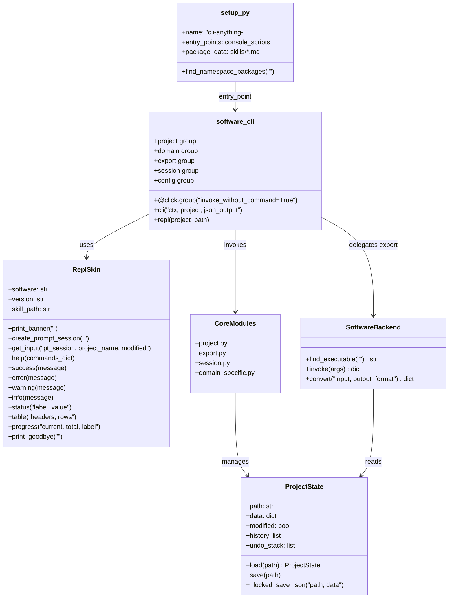

<details>
<summary>相关源文件</summary>

生成本页时使用的主要源文件：

- [cli-anything-plugin/HARNESS.md](../../../project-repos/CLI-Anything/cli-anything-plugin/HARNESS.md)
- [cli-anything-plugin/repl_skin.py](../../../project-repos/CLI-Anything/cli-anything-plugin/repl_skin.py)
- [blender/agent-harness/setup.py](../../../project-repos/CLI-Anything/blender/agent-harness/setup.py)
- [gimp/agent-harness/GIMP.md](../../../project-repos/CLI-Anything/gimp/agent-harness/GIMP.md)

</details>

# Harness 包结构与实现模式

每个 CLI Harness 是一个独立的 Python 包，遵循统一的目录约定、命名规范与实现模式。本页详细说明该结构的各组成部分，以及背后的设计决策。

---

## 1. 目录结构总览

每个 Harness 部署在 `<software>/agent-harness/` 目录下，布局如下：

```
<software>/agent-harness/
├── setup.py                             # pip 安装入口，定义 cli-anything-<software> 命令
├── <SOFTWARE>.md                        # 针对该应用的架构分析与 SOP
├── cli_anything/                        # PEP 420 命名空间包（无 __init__.py）
│   └── <software>/                      # 子包（有 __init__.py）
│       ├── __init__.py
│       ├── __main__.py                  # python3 -m cli_anything.<software> 入口
│       ├── README.md                    # 安装与使用说明（必需）
│       ├── <software>_cli.py            # Click CLI 主入口（@click.group + REPL）
│       ├── core/                        # 核心逻辑模块
│       │   ├── __init__.py
│       │   ├── project.py               # 项目状态管理
│       │   ├── export.py                # 渲染流水线
│       │   ├── session.py               # 有状态会话、undo/redo
│       │   └── ...                      # 领域特定模块
│       ├── utils/
│       │   ├── __init__.py
│       │   ├── repl_skin.py             # 统一 REPL 皮肤（从插件复制）
│       │   ├── <software>_backend.py    # 后端封装（发现并调用真实软件）
│       │   └── helpers.py
│       ├── skills/
│       │   └── SKILL.md                 # 包内兼容副本（安装后可用）
│       └── tests/
│           ├── TEST.md                  # 测试计划 + 结果文档（必需）
│           ├── test_core.py             # 单元测试
│           └── test_full_e2e.py         # 端到端测试
└── examples/                            # 示例脚本与工作流
```

> **关键约束**：`cli_anything/` 目录**不能包含** `__init__.py`。这使其成为 PEP 420 命名空间包——多个独立安装的 PyPI 包可以分别向 `cli_anything/` 命名空间贡献子包（如 `cli_anything.gimp`、`cli_anything.blender`），互不冲突。

Sources: [HARNESS.md:674-710](../../../project-repos/CLI-Anything/HARNESS.md#L674-L710)

<details class="source-snippets">
<summary>引用源码</summary>

<!-- source-snippets:start -->

#### `HARNESS.md:674-710`

> 未找到引用文件：`HARNESS.md`

<!-- source-snippets:end -->
</details>
---

## 2. 包结构与命名空间

### 2.1 命名约定

所有 Harness 包遵循统一命名规则：

| 层次 | 规则 | 示例 |
|------|------|------|
| PyPI 包名 | `cli-anything-<software>` | `cli-anything-blender` |
| Python 导入路径 | `cli_anything.<software>` | `cli_anything.blender` |
| 命令行入口 | `cli-anything-<software>` | `cli-anything-blender` |
| 主模块 | `cli_anything/<software>/<software>_cli.py` | `blender_cli.py` |

### 2.2 setup.py 结构

`setup.py` 是 Harness 可安装性的核心，以 Blender 为例：

```python
setup(
    name="cli-anything-blender",
    version="1.0.0",
    packages=find_namespace_packages(include=("cli_anything.*",)),
    entry_points={
        "console_scripts": [
            "cli-anything-blender=cli_anything.blender.blender_cli:main",
        ],
    },
    package_data={
        "cli_anything.blender": ["skills/*.md"],   # 随包发布 SKILL.md
    },
    install_requires=[
        "click>=8.1",
        "prompt-toolkit>=3.0",
    ],
    python_requires=">=3.10",
)
```

`find_namespace_packages(include=("cli_anything.*",))` 会自动发现所有 `cli_anything/` 下的子包，而不会将 `cli_anything/` 本身注册为普通包——这是实现命名空间共存的关键。

Sources: [blender/agent-harness/setup.py:23-88](../../../project-repos/CLI-Anything/blender/agent-harness/setup.py#L23-L88)

<details class="source-snippets">
<summary>引用源码</summary>

<!-- source-snippets:start -->

#### `blender/agent-harness/setup.py:23-88`

```python
setup(
    name="cli-anything-blender",
    version="1.0.0",
    description="CLI harness for Blender - run 3D modeling, animation, and rendering via blender --background --python",
    long_description=long_description,
    long_description_content_type="text/markdown",

    author="cli-anything contributors",
    author_email="",
    url="https://github.com/HKUDS/CLI-Anything",

    project_urls={
        "Source": "https://github.com/HKUDS/CLI-Anything",
        "Tracker": "https://github.com/HKUDS/CLI-Anything/issues",
    },

    license="MIT",

    packages=find_namespace_packages(include=("cli_anything.*",)),

    python_requires=">=3.10",

    install_requires=[
        "click>=8.1",
        "prompt-toolkit>=3.0",
    ],

    extras_require={
        "dev": [
            "pytest>=7",
            "pytest-cov>=4",
        ],
    },

    entry_points={
        "console_scripts": [
            "cli-anything-blender=cli_anything.blender.blender_cli:main",
        ],
    },
    package_data={
        "cli_anything.blender": ["skills/*.md"],
    },
    include_package_data=True,
    zip_safe=False,

    keywords=[
        "cli",
        "blender",
        "3d",
        "rendering",
        "automation",
    ],

    classifiers=[
        "Development Status :: 4 - Beta",
        "Intended Audience :: Developers",
        "Topic :: Multimedia :: Graphics :: 3D Modeling",
        "Topic :: Software Development :: Libraries :: Python Modules",
        "License :: OSI Approved :: MIT License",

        "Programming Language :: Python :: 3",
        "Programming Language :: Python :: 3.10",
        "Programming Language :: Python :: 3.11",
        "Programming Language :: Python :: 3.12",
    ],
)
```

<!-- source-snippets:end -->
</details>
---

## 3. 包组件关系图



---

## 4. Click CLI 架构

### 4.1 主入口模式

每个 Harness 的主 CLI 文件使用 `invoke_without_command=True`——当用户不带子命令运行时，自动进入 REPL 交互模式：

```python
@click.group(invoke_without_command=True)
@click.option("--project", "-p", default=None, help="项目文件路径")
@click.option("--json", "json_output", is_flag=True, help="以 JSON 格式输出")
@click.pass_context
def cli(ctx, project, json_output):
    ctx.ensure_object(dict)
    ctx.obj["json_output"] = json_output
    ctx.obj["project"] = project

    if ctx.invoked_subcommand is None:
        # 没有子命令 → 进入 REPL
        ctx.invoke(repl, project_path=project)
```

这确保了 `cli-anything-<software>`（不带参数）默认进入交互式 REPL，而 `cli-anything-<software> project new` 则直接执行子命令并退出。

### 4.2 标准命令组

每个 Harness 按逻辑域组织命令，形成以下标准命令组：

| 命令组 | 职责 | 典型子命令 |
|--------|------|-----------|
| `project` | 项目文件管理 | `new`, `open`, `save`, `info`, `close` |
| `<domain>` | 应用核心操作 | 领域特定（如 `layer`, `track`, `scene`） |
| `export` | 渲染与格式转换 | `render`, `list-formats`, `preview` |
| `session` | 会话与历史 | `undo`, `redo`, `history`, `status` |
| `config` | 设置与偏好 | `get`, `set`, `list`, `reset` |

### 4.3 `--json` 双输出模式

每个命令都必须支持 `--json` 标志，实现双输出：

```python
@cli.command("info")
@click.pass_context
def project_info(ctx):
    proj = load_project(ctx.obj["project"])
    data = {
        "name": proj["name"],
        "layers": len(proj["layers"]),
        "modified": proj.get("modified", False),
    }
    if ctx.obj["json_output"]:
        click.echo(json.dumps(data, indent=2))   # Agent 消费：结构化 JSON
    else:
        skin.status("Name", data["name"])        # 人类消费：带颜色的表格
        skin.status("Layers", str(data["layers"]))
```

这一模式使同一个 CLI 既能在终端交互使用，也能被 AI Agent 以程序化方式调用并解析输出。

Sources: [HARNESS.md:28-48, 99-109](../../../project-repos/CLI-Anything/HARNESS.md:28-48%2C%2099-109)

<details class="source-snippets">
<summary>引用源码</summary>

<!-- source-snippets:start -->

#### `HARNESS.md:28-48, 99-109`

> 未找到引用文件：`HARNESS.md:28-48, 99-109`

<!-- source-snippets:end -->
</details>
---

## 5. ReplSkin：统一 REPL 皮肤

`repl_skin.py` 是所有 Harness 共享的 REPL 界面层，从插件复制到每个包的 `utils/` 目录。

### 5.1 初始化与主题

```python
from cli_anything.<software>.utils.repl_skin import ReplSkin

skin = ReplSkin("<software>", version="1.0.0")
```

每个软件有专属的强调色，实现视觉区分：

| 软件 | 颜色 | ANSI 代码 |
|------|------|-----------|
| gimp | 暖橙色 | `\033[38;5;214m` |
| blender | 深橙色 | `\033[38;5;208m` |
| inkscape | 亮蓝色 | `\033[38;5;39m` |
| libreoffice | 绿色 | `\033[38;5;40m` |
| shotcut | 蓝绿色 | `\033[38;5;35m` |
| 默认 | 天蓝色 | `\033[38;5;75m` |

### 5.2 Banner 与技能路径发现

`print_banner()` 在 REPL 启动时显示品牌框，并自动解析 `SKILL.md` 路径供 AI Agent 读取：

```
╭────────────────────────────────────────────────────────────────────────╮
│ ◆  cli-anything · Blender                                              │
│    v1.0.0                                                              │
│ ◇ Install:      npx skills add HKUDS/CLI-Anything --skill cli-any...  │
│ ◇ Global skill: ~/.agents/skills/cli-anything-blender/SKILL.md        │
│                                                                        │
│    Type help for commands, quit to exit                                │
╰────────────────────────────────────────────────────────────────────────╯
```

**路径解析优先级**（`ReplSkin.__init__` 中实现）：

1. 优先：仓库根目录的 `skills/cli-anything-<software>/SKILL.md`（monorepo 开发环境）
2. 降级：包内副本 `cli_anything/<software>/skills/SKILL.md`（pip 安装后）

```python
# repl_skin.py 路径解析逻辑
package_skill = Path(__file__).resolve().parent.parent / "skills" / "SKILL.md"
repo_skill = None
for parent in Path(__file__).resolve().parents:
    candidate = parent / "skills" / self.skill_id / "SKILL.md"
    if candidate.is_file():
        repo_skill = candidate
        break
skill_path = str(repo_skill) if repo_skill else str(package_skill)
```

### 5.3 完整 API 参考

| 方法 | 输出样式 | 用途 |
|------|----------|------|
| `print_banner()` | 品牌边框 | REPL 启动时调用一次 |
| `create_prompt_session()` | — | 创建 prompt_toolkit 会话（含历史记录） |
| `get_input(pt_session, project_name, modified)` | 彩色提示符 | REPL 主循环获取用户输入 |
| `help(commands_dict)` | 对齐列表 | 显示命令帮助 |
| `success(message)` | `✓` 绿色 | 操作成功 |
| `error(message)` | `✗` 红色（stderr） | 操作失败 |
| `warning(message)` | `⚠` 黄色 | 注意事项 |
| `info(message)` | `●` 蓝色 | 进度信息 |
| `status(label, value)` | 键值对 | 显示状态字段 |
| `status_block(items, title)` | 对齐键值块 | 批量状态显示 |
| `table(headers, rows)` | 框线表格 | 列表数据 |
| `progress(current, total, label)` | `█░` 进度条 | 长时操作进度 |
| `print_goodbye()` | `▸ Goodbye!` | REPL 退出时调用 |

### 5.4 REPL 主循环典型结构

```python
@cli.command("repl")
@click.pass_context
def repl(ctx, project_path):
    skin = ReplSkin("<software>", version="1.0.0")
    skin.print_banner()
    pt_session = skin.create_prompt_session()

    while True:
        try:
            line = skin.get_input(pt_session,
                                  project_name=current_project_name(),
                                  modified=is_modified())
        except (KeyboardInterrupt, EOFError):
            break

        if not line or line in ("exit", "quit"):
            break
        if line == "help":
            skin.help(COMMANDS)
            continue

        # 将输入转发给 Click 命令解析
        try:
            args = shlex.split(line)
            cli.main(args=args, obj=ctx.obj, standalone_mode=False)
        except Exception as e:
            skin.error(str(e))

    skin.print_goodbye()
```

Sources: [repl_skin.py:106-568](../../../project-repos/CLI-Anything/repl_skin.py#L106-L568), [HARNESS.md:77-110](../../../project-repos/CLI-Anything/HARNESS.md#L77-L110)

<details class="source-snippets">
<summary>引用源码</summary>

<!-- source-snippets:start -->

#### `repl_skin.py:106-568`

> 未找到引用文件：`repl_skin.py`

#### `HARNESS.md:77-110`

> 未找到引用文件：`HARNESS.md`

<!-- source-snippets:end -->
</details>
---

## 6. 后端集成模式

### 6.1 Backend 模块职责

每个 Harness 的 `utils/<software>_backend.py` 封装对真实软件的调用，承担三项职责：

1. **可执行文件发现** — 使用 `shutil.which()` 定位软件，找不到时抛出含安装指南的 `RuntimeError`
2. **参数构建与调用** — 通过 `subprocess.run()` 调用真实软件
3. **输出结构化** — 将调用结果封装为 dict，便于上层 JSON 输出

```python
# utils/lo_backend.py（LibreOffice 示例）
import shutil, subprocess

def find_libreoffice():
    for name in ("libreoffice", "soffice"):
        path = shutil.which(name)
        if path:
            return path
    raise RuntimeError(
        "LibreOffice not found. Install: sudo apt install libreoffice"
    )

def convert_odf_to(odf_path, output_format, output_dir=None, overwrite=False):
    lo = find_libreoffice()
    cmd = [lo, "--headless", "--convert-to", output_format]
    if output_dir:
        cmd += ["--outdir", output_dir]
    cmd.append(odf_path)
    subprocess.run(cmd, check=True, capture_output=True)
    return {
        "output": final_path,
        "format": output_format,
        "method": "libreoffice-headless",
    }
```

### 6.2 主要软件的后端调用方式

| 软件 | 后端模块 | 调用方式 |
|------|----------|----------|
| LibreOffice | `lo_backend.py` | `libreoffice --headless --convert-to <fmt>` |
| Blender | `blender_backend.py` | `blender --background --python script.py` |
| GIMP | `gimp_backend.py` | `gimp -i -b '(script-fu-console-eval ...)'` |
| Inkscape | `inkscape_backend.py` | `inkscape --actions="..." --export-filename=...` |
| Shotcut | `shotcut_backend.py` | `melt project.mlt -consumer avformat:output.mp4` |
| Audacity | `audacity_backend.py` | `sox` 命令处理音频 |

> **核心原则**：CLI 是软件的接口层，而非替代品。必须调用真实软件完成渲染和导出，禁止用 Python 重新实现软件功能。

Sources: [HARNESS.md:308-347](../../../project-repos/CLI-Anything/HARNESS.md#L308-L347)

<details class="source-snippets">
<summary>引用源码</summary>

<!-- source-snippets:start -->

#### `HARNESS.md:308-347`

> 未找到引用文件：`HARNESS.md`

<!-- source-snippets:end -->
</details>
---

## 7. 状态模型与会话锁定

### 7.1 JSON 会话文件

项目状态以 JSON 文件存储，包含 undo/redo 栈：

```json
{
  "version": "1.0",
  "name": "my_project",
  "modified": false,
  "history": [
    {"action": "layer_add", "params": {"name": "Background"}, "timestamp": "..."}
  ],
  "undo_stack": [...],
  "data": { ... }
}
```

### 7.2 文件锁定写入

并发写入保护通过 `_locked_save_json` 实现——以 `"r+"` 模式打开文件，在锁内截断再写入，防止多进程同时修改会话文件时数据损坏：

```python
import fcntl, json

def _locked_save_json(path: str, data: dict):
    """使用文件锁安全写入 JSON 会话文件。"""
    with open(path, "r+") as f:
        fcntl.flock(f, fcntl.LOCK_EX)   # 独占锁
        try:
            f.seek(0)
            f.truncate()                  # 在锁内截断
            json.dump(data, f, indent=2, ensure_ascii=False)
        finally:
            fcntl.flock(f, fcntl.LOCK_UN)
```

Sources: [HARNESS.md:69-73](../../../project-repos/CLI-Anything/HARNESS.md#L69-L73)

<details class="source-snippets">
<summary>引用源码</summary>

<!-- source-snippets:start -->

#### `HARNESS.md:69-73`

> 未找到引用文件：`HARNESS.md`

<!-- source-snippets:end -->
</details>
---

## 8. 已有 Harness 的统计概览

| 软件 | 测试数 | 后端类型 | 原生格式 |
|------|--------|----------|----------|
| Blender | 208 | `bpy` 脚本 + `blender --background` | `.blend-cli.json` |
| GIMP | 107 | Pillow + Script-Fu | `.gimp-cli.json` |
| LibreOffice | 158 | ODF XML + `libreoffice --headless` | `.odt/.ods/.odp` |
| sbox (Source 2) | 244 | Source 2 JSON | `.vmap/.vmat` |

GIMP 的架构文档（`GIMP.md`）详细记录了为何选择 Pillow 而非直接操作 XCF 二进制格式——XCF 的 `xcf-load.c` 超过 5000 行 C 代码，解析成本极高，因此改用 JSON 清单 + Pillow 内存层栈 + GIMP batch 导出的三层策略。

Sources: [HARNESS.md:715-730](../../../project-repos/CLI-Anything/HARNESS.md#L715-L730), [GIMP.md:38-57](../../../project-repos/CLI-Anything/gimp/agent-harness/GIMP.md#L38-L57)

<details class="source-snippets">
<summary>引用源码</summary>

<!-- source-snippets:start -->

#### `HARNESS.md:715-730`

> 未找到引用文件：`HARNESS.md`

#### `GIMP.md:38-57`

```markdown
Unlike Shotcut (which manipulates XML project files), GIMP's native .xcf format
is a complex binary format. Our strategy:

1. **Pillow** — Python's standard imaging library. Handles image I/O (PNG, JPEG,
   TIFF, BMP, GIF, WebP, etc.), pixel manipulation, basic filters, color
   adjustments, drawing, and compositing. This is our primary engine.
2. **GEGL CLI** — If available, use `gegl` command for advanced operations.
3. **GIMP batch mode** — If `gimp` is installed, use `gimp -i -b` for XCF
   operations and advanced filters via Script-Fu/Python-Fu.

### Why Not XCF Directly?

XCF is a tile-based binary format with compression, layers, channels, paths,
and GEGL filter graphs. Parsing it from scratch is extremely complex (5000+ lines
of C in GIMP's xcf-load.c). Instead:
- For new projects, we build layer stacks in memory using Pillow
- For XCF import/export, we delegate to GIMP batch mode if available
- Our "project file" is a JSON manifest tracking layers, operations, and history

## The Project Format (.gimp-cli.json)
```

<!-- source-snippets:end -->
</details>
---

## 9. 文档必备文件

每个 Harness 目录下有两个必需文档：

### `README.md`（位于 `cli_anything/<software>/`）

必须说明：
- 如何安装软件依赖（`apt install`、`brew install` 等）
- 如何以开发模式安装 CLI（`pip install -e .`）
- 如何运行测试
- 基本使用示例

### `TEST.md`（位于 `cli_anything/<software>/tests/`）

采用"先计划，后填写结果"的两阶段写法：

**Phase 4（写测试代码前）**：
- 测试文件清单及预估测试数
- 每个模块的单元测试计划（测哪些函数、哪些边界条件）
- E2E 测试计划（测哪些真实工作流、验证哪些输出属性）

**Phase 6（所有测试通过后追加）**：
- 完整的 `pytest -v --tb=no` 输出
- 汇总统计（总测试数、通过率、耗时）
- 覆盖缺口说明

这使 TEST.md 同时承担测试计划与测试结果文档的双重角色。

Sources: [HARNESS.md:111-231](../../../project-repos/CLI-Anything/HARNESS.md#L111-L231)

<details class="source-snippets">
<summary>引用源码</summary>

<!-- source-snippets:start -->

#### `HARNESS.md:111-231`

> 未找到引用文件：`HARNESS.md`

<!-- source-snippets:end -->
</details>
---

## 10. 包安装与命名空间共存

多个 Harness 可以在同一 Python 环境中共存，互不干扰：

```bash
pip install cli-anything-gimp
pip install cli-anything-blender
pip install cli-anything-libreoffice

# 三个命令均可用，模块路径各自独立
cli-anything-gimp --help
cli-anything-blender --help
cli-anything-libreoffice --help

# Python 导入互不冲突
from cli_anything.gimp import ...
from cli_anything.blender import ...
```

这依赖 PEP 420 命名空间包机制：`cli_anything/` 不包含 `__init__.py`，Python 会将所有安装包中的 `cli_anything/` 子目录合并为同一命名空间，各子包独立注册。

Sources: [HARNESS.md:296-305](../../../project-repos/CLI-Anything/HARNESS.md#L296-L305)

<details class="source-snippets">
<summary>引用源码</summary>

<!-- source-snippets:start -->

#### `HARNESS.md:296-305`

> 未找到引用文件：`HARNESS.md`

<!-- source-snippets:end -->
</details>
## 相关页面

- [七阶段生成流水线](seven-phase-pipeline.md) — Harness 是如何通过流水线自动生成的
- [系统架构](system-architecture.md) — Harness 层在整体架构中的位置
- [测试与质量���障](testing-and-quality.md) — Harness 的多层测试���略
