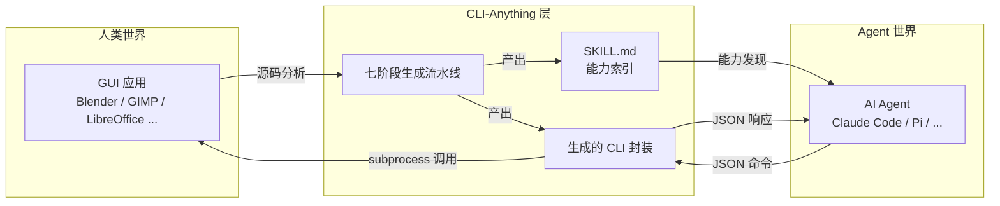
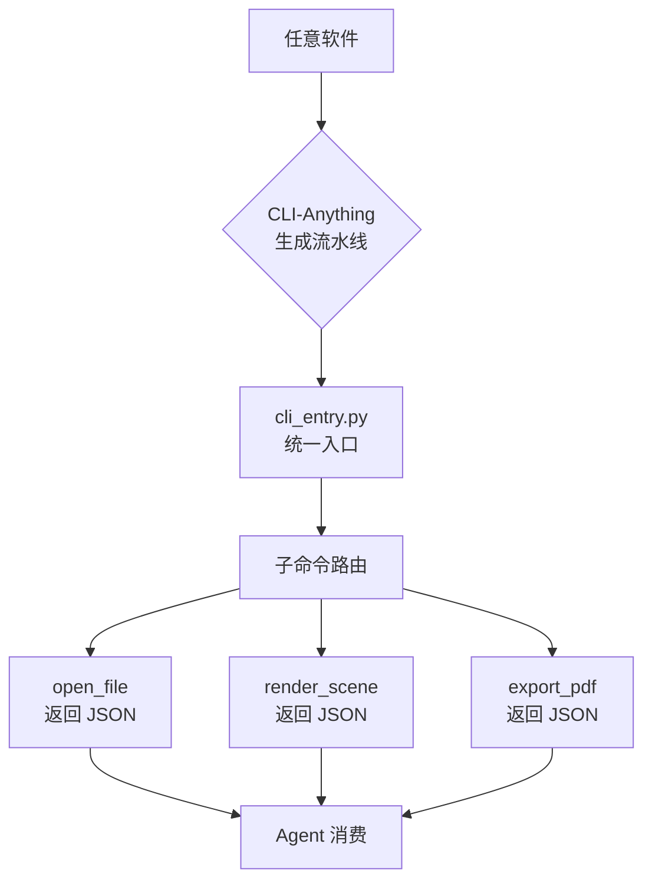
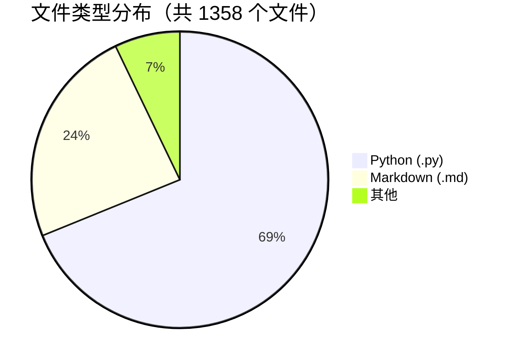
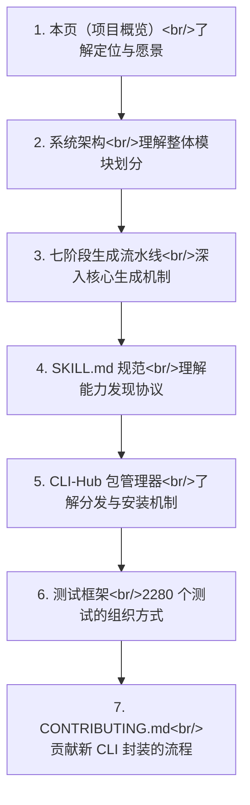

<details>
<summary>相关源文件</summary>

生成本页时使用的主要源文件：

- [README.md](../../../project-repos/CLI-Anything/README.md)
- [README_CN.md](../../../project-repos/CLI-Anything/README_CN.md)
- [CONTRIBUTING.md](../../../project-repos/CLI-Anything/CONTRIBUTING.md)
- [registry.json](../../../project-repos/CLI-Anything/registry.json)
- [LICENSE](../../../project-repos/CLI-Anything/LICENSE)

</details>

# 项目概览

CLI-Anything 是 HKUDS 实验室发布的开源框架，核心命题是：**让任意软件对 AI Agent 原生可用**。它通过自动化 CLI 生成流水线，将现有应用程序（GUI、库、服务）转化为 Agent 可直接调用的命令行接口，无需修改被封装软件的任何源代码。

> "今天的软件服务人类，明天的用户将是 Agent。"
>
> — CLI-Anything README

Sources: [README.md:1-20](../../../project-repos/CLI-Anything/README.md#L1-L20)

<details class="source-snippets">
<summary>引用源码</summary>

<!-- source-snippets:start -->

#### `README.md:1-20`

```markdown
<h1 align="center">&nbsp; CLI-Anything: Making ALL Software Agent-Native</h1>

<p align="center">
  <strong>Today's Software Serves Humans👨‍💻. Tomorrow's Users will be Agents🤖.<br>
CLI-Anything: Bridging the Gap Between AI Agents and the World's Software</strong><br>
</p>

**🌐 [CLI-Hub](https://hkuds.github.io/CLI-Anything/)**: `pip install cli-anything-hub` then `cli-hub install <name>` — browse, install, and manage all community-built CLIs. Want to add your own? [Open a PR](https://github.com/HKUDS/CLI-Anything/blob/main/CONTRIBUTING.md) — the hub updates instantly.

**🎬 [See Demos](#-real-world-demos)**: Watch AI agents use generated CLIs plus preview, live preview, and trajectory loops to produce real artifacts — CAD builds, 3D scenes, diagrams, gameplay, subtitles, and more.

**🙋 [Become a Contributor, or Request a CLI]**: [Join us](https://github.com/HKUDS/CLI-Anything/issues/new?template=contributor-signup.yml)! Sign up to build a new CLI harness — once reviewed and merged, you'll gain access as one of our community contributors! Wish CLI-Anything supported a specific software or service? Submit a [wishlist request](https://github.com/HKUDS/CLI-Anything/issues/new?template=cli-wishlist.yml)!

<p align="center">
  <a href="#-quick-start"></a>
  <a href="https://hkuds.github.io/CLI-Anything/"></a>
  <a href="#-demonstrations"></a>
  <a href="#-test-results"></a>
  <a href="LICENSE"></a>
</p>
```

<!-- source-snippets:end -->
</details>
---

## 1. 项目定位与愿景

### Agent-Software 鸿沟

当前绝大多数软件是为人类交互而设计的：图形界面、菜单导航、对话框确认。AI Agent 在调用这类软件时面临三大障碍：

1. **接口不确定性** — GUI 状态难以被程序化感知，自动化脚本极易因版本升级而失效。
2. **能力发现缺失** — Agent 不知道某个软件"能做什么"，只能靠预置知识或反复试错。
3. **输出格式混乱** — 人类可读的文本输出对 Agent 下游处理不友好。

CLI-Anything 的解法是在软件与 Agent 之间插入一层**结构化 CLI 适配器**，使任意软件具备：

- 机器可发现的命令目录（`SKILL.md`）
- 严格入参校验（`argparse` / `click`）
- JSON 格式的确定性输出
- 幂等、无副作用的子命令设计



Sources: [README.md:30-80](../../../project-repos/CLI-Anything/README.md#L30-L80)

<details class="source-snippets">
<summary>引用源码</summary>

<!-- source-snippets:start -->

#### `README.md:30-80`

```markdown
</p>

**One Command Line**: Make any software agent-ready for Pi, OpenClaw, nanobot, Cursor, Claude Code, etc.&nbsp;&nbsp;[**中文文档**](README_CN.md) | [**日本語ドキュメント**](README_JA.md)

<p align="center">
  
</p>

<p align="center">
  
</p>

---

## 📰 News

> Thanks to all invaluable efforts from the community! More updates continuously on the way everyday..

- **2026-04-18** 🧩 **All SKILL.md files are now being unified under the top-level `skills/` directory** — every CLI skill can be installed from one canonical source with `npx skills add HKUDS/CLI-Anything --skill <skill-name> -g -y`. We also added root-skill validation CI, synced contribution / PR docs and REPL skill-path hints to the new layout, and refreshed the **CLI-Hub** install-first frontend around the new `npx skills` flow.

- **2026-04-17** 🌐 **CLI-Hub** received another install UX pass — public registry metadata and skill coverage were tightened, visit counting was corrected, and the web hub was further refined. 🧪 **Shotcut** render output duration was fixed (#92). 📝 **SKILL** contribution paths were corrected for the new docs flow (#224), and the skill generator now safely handles empty intros (#203).

- **2026-04-16** 🗺️ **QGIS CLI** merged (#207) — a full GIS / map authoring harness landed. 🧬 **UniMol Tools CLI** merged (#219) for molecular modeling workflows. 🌐 **CLI-Hub** also added more public CLIs, including **py4csr**, refreshed its generated meta-skill, corrected SKILL contribution docs, and fixed `apt-get` package extraction in skill generation (#204).

- **2026-04-16** 📈 **Unreal Insights CLI** expanded — added background capture session control (`capture start/status/snapshot/stop`), engine-root-matched `UnrealInsights.exe` resolution/build flows, and refreshed docs/tests for the new orchestration workflow.

- **2026-04-15** 🌐 **CLI-Hub** updated to **v0.2.0** — the PyPI package now supports public CLIs from multiple install sources (`pip`, `npm`, `brew`, bundled/system tools), backed by a new `public_registry.json`. The Hub frontend was redesigned with separate **CLI-Anything CLIs** and **Public CLIs** decks, and live end-to-end checks now cover real install, update, and uninstall flows across both pip and npm packages.

- **2026-04-14** 🧭 **Safari CLI** merged (#212) and added to the Hub registry — browser automation via `safari-mcp`. 🎬 **Kdenlive** also received compatibility fixes for Gen 5 project output and invalid project generation.

- **2026-04-13** 📓 **Obsidian CLI** merged (#211) — knowledge management harness via the Local REST API, with 48 unit tests and 7 E2E tests. ⛓️ **Eth2-Quickstart CLI** merged (#195) — Ethereum staking node management harness. 📚 **Zotero CLI** updated to v0.4.1 (#201) — now shipped from its standalone repo, and CLI-Hub gained support for remote `skill_md` URLs.

- **2026-04-11** 🔗 **n8n CLI** merged (#188) — workflow automation harness for self-hosted automation flows. 🔧 **Exa CLI** fix (#205) added the `x-exa-integration` header for usage tracking. 📦 **CLI-Hub** also gained its PyPI auto-publish workflow and package refresh pipeline.

- **2026-04-10** 📦 **CLI-Hub package manager** launched — `pip install cli-anything-hub` to browse, search, install, update, and uninstall CLI-Anything harnesses from one command. The web Hub also shipped its first install-focused frontend refresh and "Empower yourself" toolkit card.

<details>
<summary>Earlier news (Apr 1–9)</summary>

- **2026-04-09** 🧹 Cleanup and docs pass (#200) — fixed Openscreen test subtotals, added Openscreen to the Chinese README and project structure, and clarified `/cli-anything` command syntax in the docs.

- **2026-04-08** 🎬 **Openscreen CLI** merged (#183) — screen recording editor harness with 101 tests. ☁️ **CloudAnalyzer CLI** merged (#181) — cloud cost analysis harness with 27 commands. 🌊 **SeaClip / PM2 / ChromaDB** harnesses merged (#129).

- **2026-04-07** 🔄 **Dify Workflow CLI** merged (#191) — workflow automation wrapper. 🔧 **Inkscape** auto-save fix (#193, fixes #182). 🛡️ **DomShell security hardening** (#156) — URL validation and DOM sanitization for the browser CLI. 🥧 **Pi Coding Agent extension** merged (#178).

- **2026-04-06** 🔍 **Exa CLI** merged (#172) — AI-powered web search and answers harness. 🎮 **Godot CLI** merged (#140) — game engine harness with a full demo-game E2E pipeline. ☁️ **CloudAnalyzer** review fixes and frontend improvements also landed.

- **2026-04-03** 🧪 **WireMock CLI** merged (#170) — HTTP mock server harness for API testing. 🥧 **Pi Coding Agent** extension support also landed, and CLI demo recordings were added to the docs.

- **2026-04-01** ⚔️ **Slay the Spire II CLI** merged (#148) — deck-building roguelike harness. 🎥 **VideoCaptioner CLI** merged (#166) — AI-powered video captioning harness. 🛰️ **IntelWatch** was added to the registry for B2B OSINT workflows.

```

<!-- source-snippets:end -->
</details>
---

## 2. 核心理念：为什么选择 CLI？

CLI（命令行接口）是 Agent 与软件协作的天然契约层。CLI-Anything 选择 CLI 作为适配层有五个关键原因：

| 特性 | 说明 |
|------|------|
| **结构化** | 子命令 + 具名参数构成清晰的调用契约，消除歧义 |
| **可组合** | Unix 管道哲学：小命令串联完成复杂任务 |
| **自描述** | `--help` 输出即文档，Agent 可动态查询能力边界 |
| **确定性** | 相同输入产生相同输出，便于测试与回归验证 |
| **Agent-first JSON 输出** | 所有子命令返回结构化 JSON，Agent 无需解析自然语言 |



Sources: [README.md:85-130](../../../project-repos/CLI-Anything/README.md#L85-L130)  [README_CN.md:40-90](../../../project-repos/CLI-Anything/README_CN.md#L40-L90)

<details class="source-snippets">
<summary>引用源码</summary>

<!-- source-snippets:start -->

#### `README.md:85-130`

```markdown

- **2026-03-30** 🏗️ **CLI-Anything v0.2.0** — HARNESS.md progressive disclosure redesign. Detailed guides extracted into `guides/` for on-demand loading. Phases 1–7 now contiguous. Key Principles and Rules merged into a single authoritative section.

- **2026-03-29** 📐 Blender skill docs updated — enforce absolute render paths and correct prerequisites.

- **2026-03-28** 🌐 **CLIBrowser** added to CLI-Hub registry for agent-accessible browser automation.

- **2026-03-27** 📚 Zotero SKILL.md enhanced with agent-facing constraints; REPL config and executable resolution fixes.

- **2026-03-26** 📖 **Zotero CLI** harness landed for Zotero desktop (library management, collections, citations). Draw.io custom ID bugfix (#132) and registry.json syntax fix.

- **2026-03-25** 🎮 **RenderDoc CLI** merged for GPU frame capture analysis. FreeCAD updated for v1.1. Blender EEVEE engine name corrected. Zoom token permissions hardened.

- **2026-03-24** 🏭 **FreeCAD CLI** added with 258 commands across 17 groups. **iTerm2** and **Teltonika RMS** harnesses added to registry.

- **2026-03-23** 🤖 Launched **CLI-Hub meta-skill** — agents can now discover and install CLIs autonomously. **Krita CLI** harness merged for digital painting.

</details>

<details>
<summary>Earlier news (Mar 11–22)</summary>

- **2026-03-22** 🎵 **MuseScore CLI** merged with transpose, export, and instrument management.

- **2026-03-21** 🔧 Infrastructure improvements — refined test harnesses and documentation across multiple CLIs. Enhanced Windows compatibility for several backends.

- **2026-03-20** 🌐 **Novita AI** CLI added for OpenAI-compatible API access. Registry metadata improvements for better hub discovery.

- **2026-03-19** 📦 Package structure refinements across harnesses. Improved SKILL.md generation with better command documentation.

- **2026-03-18** 🧪 Test coverage expansion — additional E2E scenarios and edge case validation across multiple CLIs.

- **2026-03-17** 🌐 Launched the **[CLI-Hub](https://hkuds.github.io/CLI-Anything/)** — a central registry where you can browse, search, and install any CLI with a single `pip` command.

- **2026-03-16** 🤖 Added **SKILL.md generation** (Phase 6.5) — every generated CLI now ships with an AI-discoverable skill definition.

- **2026-03-15** 🐾 Support for **OpenClaw** from the community! Merged Windows `cygpath` guard for cross-platform support.

- **2026-03-14** 🔒 Fixed a GIMP Script-Fu path injection vulnerability and added **Japanese README** translation.

- **2026-03-13** 🔌 **Qodercli** plugin officially merged as a community contribution with dedicated setup scripts.

- **2026-03-12** 📦 **Codex skill** integration landed, bringing CLI-Anything to yet another AI coding platform.

- **2026-03-11** 📞 **Zoom** video conferencing harness added as the 11th supported application.

```

#### `README_CN.md:40-90`

````markdown

CLI 是人类和 AI Agent 共通的万能接口：

• **结构化、可组合** - 文本命令天然匹配 LLM 的输入格式，可自由串联成复杂工作流

• **轻量且通用** - 几乎零开销，跨平台运行，不依赖额外环境

• **自描述** - 一个 `--help` 就能让 Agent 自动发现所有功能

• **久经验证** - Claude Code 每天通过 CLI 执行数以千计的真实任务

• **Agent 友好** - 结构化 JSON 输出，Agent 无需任何额外解析

• **确定且可靠** - 输出稳定一致，Agent 行为可预测

## 🚀 快速上手

### 环境要求

- **Python 3.10+**
- 目标软件已安装（如 GIMP、Blender、LibreOffice 或你自己的应用）
- 支持的 AI 编程工具之一：[Claude Code](#-claude-code) | [OpenClaw](#-openclaw) | [OpenCode](#-opencode) | [Codex](#-codex) | [Qodercli](#-qodercli) | [GitHub Copilot CLI](#-github-copilot-cli) | [更多平台](#-更多平台即将支持)

### 选择你的平台

<details open>
<summary><h4 id="-claude-code">⚡ Claude Code</h4></summary>

**第一步：添加插件市场**

CLI-Anything 以 Claude Code 插件市场的形式托管在 GitHub 上。

```bash
# 添加 CLI-Anything 插件市场
/plugin marketplace add HKUDS/CLI-Anything
```

**第二步：安装插件**

```bash
# 从市场安装 cli-anything 插件
/plugin install cli-anything
```

搞定。插件已经在你的 Claude Code 会话中可用了。

**Windows 注意：** Claude Code 通过 `bash` 执行命令。Windows 下请安装 Git for Windows（包含 `bash` 和 `cygpath`）
或使用 WSL，否则可能出现 `cygpath: command not found`。

**第三步：一行命令生成 CLI**

````

<!-- source-snippets:end -->
</details>
---

## 3. 支持的软件目录

截至 commit `26bd973`，CLI-Hub 注册表（`registry.json`）收录 **50+ 款软件**的 CLI 封装，覆盖创意、视频、办公、开发、AI、图表、网络、科学八大类别。

Sources: [registry.json](../../../project-repos/CLI-Anything/registry.json)

<details class="source-snippets">
<summary>引用源码</summary>

<!-- source-snippets:start -->

#### `registry.json`

```json
{
  "meta": {
    "repo": "https://github.com/HKUDS/CLI-Anything",
    "description": "CLI-Hub — Agent-native stateful CLI interfaces for softwares, codebases, and Web Services",
    "updated": "2026-04-16"
  },
  "clis": [
    {
      "name": "wiremock",
      "display_name": "WireMock",
      "version": "0.1.0",
      "description": "HTTP mock server management — create stubs, inspect requests, record traffic, and manage scenarios via WireMock REST API",
      "requires": "WireMock server running (java -jar wiremock-standalone.jar)",
      "homepage": "https://wiremock.org",
      "source_url": null,
      "install_cmd": "pip install git+https://github.com/HKUDS/CLI-Anything.git#subdirectory=wiremock/agent-harness",
      "entry_point": "cli-anything-wiremock",
      "skill_md": "skills/cli-anything-wiremock/SKILL.md",
      "category": "testing",
      "contributors": [
        {
          "name": "fabiomantel",
          "url": "https://github.com/fabiomantel"
        }
      ]
    },
    {
      "name": "anygen",
      "display_name": "AnyGen",
      "version": "1.0.0",
      "description": "Generate docs, slides, websites and more via AnyGen cloud API",
      "requires": "ANYGEN_API_KEY",
      "homepage": "https://anygen.com",
      "source_url": null,
      "install_cmd": "pip install git+https://github.com/HKUDS/CLI-Anything.git#subdirectory=anygen/agent-harness",
      "entry_point": "cli-anything-anygen",
      "skill_md": "skills/cli-anything-anygen/SKILL.md",
      "category": "generation",
      "contributors": [
        {
          "name": "koltyu-anygen",
          "url": "https://github.com/koltyu-anygen"
        }
      ]
    },
    {
      "name": "adguardhome",
      "display_name": "AdGuardHome",
      "version": "1.0.0",
      "description": "DNS ad-blocking and network infrastructure management via AdGuardHome REST API",
      "requires": "AdGuardHome instance running",
      "homepage": "https://adguard.com/adguard-home/overview.html",
      "source_url": null,
      "install_cmd": "pip install git+https://github.com/HKUDS/CLI-Anything.git#subdirectory=adguardhome/agent-harness",
      "entry_point": "cli-anything-adguardhome",
      "skill_md": null,
      "category": "network",
      "contributors": [
        {
          "name": "pyxl-dev",
          "url": "https://github.com/pyxl-dev"
        }
      ]
    },
    {
      "name": "audacity",
      "display_name": "Audacity",
      "version": "1.0.0",
      "description": "Audio editing and processing via sox",
      "requires": "sox (apt install sox)",
      "homepage": "https://www.audacityteam.org",
      "source_url": null,
      "install_cmd": "pip install git+https://github.com/HKUDS/CLI-Anything.git#subdirectory=audacity/agent-harness",
      "entry_point": "cli-anything-audacity",
      "skill_md": "skills/cli-anything-audacity/SKILL.md",
      "category": "audio",
      "contributors": [
        {
          "name": "CLI-Anything-Team",
          "url": "https://github.com/HKUDS/CLI-Anything"
        }
      ]
    },
    {
      "name": "blender",
      "display_name": "Blender",
      "version": "1.0.0",
      "description": "3D modeling, animation, and rendering via blender --background --python",
      "requires": "blender >= 4.2",
      "homepage": "https://www.blender.org",
      "source_url": null,
      "install_cmd": "pip install git+https://github.com/HKUDS/CLI-Anything.git#subdirectory=blender/agent-harness",
      "entry_point": "cli-anything-blender",
      "skill_md": "skills/cli-anything-blender/SKILL.md",
      "category": "3d",
      "contributors": [
        {
          "name": "CLI-Anything-Team",
          "url": "https://github.com/HKUDS/CLI-Anything"
        }
      ]
    },
    {
      "name": "browser",
      "display_name": "Browser",
      "version": "1.0.0",
      "description": "Browser automation via DOMShell MCP server. Maps Chrome's Accessibility Tree to a virtual filesystem for agent-native navigation.",
      "requires": "Node.js, npx, Chrome + DOMShell extension",
      "homepage": "https://github.com/apireno/DOMShell",
      "source_url": null,
      "install_cmd": "pip install git+https://github.com/HKUDS/CLI-Anything.git#subdirectory=browser/agent-harness",
      "entry_point": "cli-anything-browser",
      "skill_md": "skills/cli-anything-browser/SKILL.md",
      "category": "web",
      "contributors": [
        {
          "name": "furkankoykiran",
          "url": "https://github.com/furkankoykiran"
        }
      ]
```

<!-- source-snippets:end -->
</details>
### 创意工具

| 软件 | 类别 | 典型能力 |
|------|------|---------|
| GIMP | 图像编辑 | 批量处理、滤镜、格式转换 |
| Blender | 3D 建模/渲染 | 场景渲染、几何操作、动画导出 |
| Inkscape | 矢量图形 | SVG 编辑、路径操作、批量导出 |
| Krita | 数字绘画 | 图层管理、笔刷操作、色彩模式转换 |
| Darktable | RAW 后期 | 色调映射、降噪、导出流水线 |
| RawTherapee | RAW 转换 | 批量 RAW 处理、色彩科学 |

### 视频与直播

| 软件 | 类别 | 典型能力 |
|------|------|---------|
| Kdenlive | 视频剪辑 | 时间线操作、转场、字幕 |
| Shotcut | 视频编辑 | 滤镜叠加、多轨混合 |
| OBS Studio | 直播/录屏 | 场景切换、源管理、录制控制 |
| HandBrake | 视频转码 | 格式转换、字幕嵌入 |
| FFmpeg | 媒体处理 | 转码、裁剪、流操作 |

### 音频

| 软件 | 类别 | 典型能力 |
|------|------|---------|
| Audacity | 音频编辑 | 降噪、裁剪、效果链 |
| MuseScore | 乐谱编辑 | 乐谱生成、MIDI 导出、PDF 渲染 |

### 办公套件

| 软件 | 类别 | 典型能力 |
|------|------|---------|
| LibreOffice | 全套办公 | 文档生成、格式转换、宏执行 |

### 开发工具

| 软件 | 类别 | 典型能力 |
|------|------|---------|
| LLDB | 调试器 | 断点管理、堆栈追踪、内存检查 |
| Godot | 游戏引擎 | 场景导入、脚本执行、构建打包 |
| s&box | 游戏开发平台 | 资产管理、服务器控制 |

### AI 与机器学习

| 软件 | 类别 | 典型能力 |
|------|------|---------|
| ComfyUI | AI 图像生成 | 工作流执行、模型切换、批量推理 |
| Ollama | 本地 LLM 运行时 | 模型拉取、推理调用、上下文管理 |
| Exa | AI 搜索引擎 | 语义搜索、文档检索 |

### 图表与可视化

| 软件 | 类别 | 典型能力 |
|------|------|---------|
| Draw.io | 流程图编辑 | 图形导入导出、布局计算 |
| Mermaid | 文本图表 | 图表渲染、格式转换 |

### 网络与基础设施

| 软件 | 类别 | 典型能力 |
|------|------|---------|
| AdGuardHome | DNS 过滤 | 规则管理、统计查询 |
| WireMock | API Mock | 桩配置、请求匹配、响应模板 |

### 科学与工程

| 软件 | 类别 | 典型能力 |
|------|------|---------|
| FreeCAD | CAD 建模 | 参数化建模、工程图导出 |
| QGIS | 地理信息系统 | 图层操作、坐标变换、地图导出 |
| UniMol | 分子建模 | 分子结构预测、性质计算 |

---

## 4. 项目规模



| 指标 | 数值 |
|------|------|
| 总文件数 | 1,358 |
| Python 源文件 | 935 |
| Markdown 文档 | 326 |
| 已注册 CLI 封装（SKILL） | 50+ |
| 测试用例（全部通过） | 2,280 |
| 支持的 Agent 平台 | Claude Code、Pi 等多平台 |
| 发布的 PyPI 包 | `cli-anything-hub` |

Sources: [README.md:150-180](../../../project-repos/CLI-Anything/README.md#L150-L180)  [CONTRIBUTING.md:1-30](../../../project-repos/CLI-Anything/CONTRIBUTING.md#L1-L30)

<details class="source-snippets">
<summary>引用源码</summary>

<!-- source-snippets:start -->

#### `README.md:150-180`

````markdown

## 🚀 Quick Start

### Prerequisites

- **Python 3.10+**
- Target software installed (e.g., GIMP, Blender, LibreOffice, or your own application)
- A supported AI coding agent: [Claude Code](#-claude-code) | [Pi](#-pi-coding-agent) | [OpenClaw](#-openclaw) | [OpenCode](#-opencode) | [Codex](#-codex) | [Qodercli](#-qodercli) | [GitHub Copilot CLI](#-github-copilot-cli) | [More Platforms](#-more-platforms-coming-soon)

### Pick Your Platform

<details open>
<summary><h4 id="-claude-code">⚡ Claude Code</h4></summary>

**Step 1: Add the Marketplace**

CLI-Anything is distributed as a Claude Code plugin marketplace hosted on GitHub.

```bash
# Add the CLI-Anything marketplace
/plugin marketplace add HKUDS/CLI-Anything
```

**Step 2: Install the Plugin**

```bash
# Install the cli-anything plugin from the marketplace
/plugin install cli-anything
```

That's it. The plugin is now available in your Claude Code session.
````

#### `CONTRIBUTING.md:1-30`

```markdown
# Contributing to CLI-Anything

Thank you for your interest in contributing to CLI-Anything! This guide will help you get started.

## Types of Contributions

We welcome three main categories of contributions:

### A) CLIs for New Software

Adding a new CLI harness is the most impactful contribution. You can either add the harness **inside this monorepo** or host it in your own **standalone repository** — both are first-class citizens on the CLI-Hub.

#### Option 1: In-repo harness

Place your code under `<software>/agent-harness/` and ensure the following:

1. **`<SOFTWARE>.md`** — the SOP document exists at `<software>/agent-harness/<SOFTWARE>.md` describing the harness architecture.
2. **`SKILL.md`** — the canonical AI-discoverable skill definition exists at `skills/cli-anything-<software>/SKILL.md`, and the packaged compatibility copy exists at `cli_anything/<software>/skills/SKILL.md`.
3. **Tests** — unit tests (`test_core.py`, passable without backend) and E2E tests (`test_full_e2e.py`) are present and passing.
4. **`README.md`** — the project README includes the new software with a link to its harness directory.
5. **`registry.json`** — add an entry for the new software (see [Registry fields](#registry-fields) below).
6. **`repl_skin.py`** — an unmodified copy from the plugin exists in `utils/`.

#### Option 2: Standalone repository (external)

Host your CLI in your own repo and submit a **registry-only PR** to this repo. Your PR only needs to add an entry to `registry.json` — no code in this monorepo is required. This is ideal if you want full control over releases, CI, and versioning.

Requirements for standalone CLIs:

1. **Published package** — your CLI must be installable via `pip install <package-name>` (PyPI) or a `pip install git+https://...` URL.
```

<!-- source-snippets:end -->
</details>
### CLI-Hub 包管理器

CLI-Anything 提供配套的包管理工具，一行命令安装任意软件的 CLI 封装：

```bash
pip install cli-anything-hub

# 安装 Blender 封装
cli-hub install blender

# 列出所有可用封装
cli-hub list

# 在 Agent 会话中加载 SKILL.md
cli-hub skill blender
```

### SKILL.md 能力发现系统

每个 CLI 封装都附带一份 `SKILL.md`，这是专为 Agent 设计的机器可读能力索引：

```markdown
# SKILL: blender
## Commands
- render_scene  : 渲染指定场景到图片
- import_obj    : 导入 OBJ 格式模型
- export_glb    : 导出 GLB 格式文件
## Input: JSON  Output: JSON
```

Agent 只需在上下文中注入对应软件的 `SKILL.md`，即可获得完整的调用知识，无需预训练。

Sources: [README.md:200-250](../../../project-repos/CLI-Anything/README.md#L200-L250)  [README_CN.md:100-150](../../../project-repos/CLI-Anything/README_CN.md#L100-L150)

<details class="source-snippets">
<summary>引用源码</summary>

<!-- source-snippets:start -->

#### `README.md:200-250`

````markdown
2. Verify the plugin is loaded: `/help cli-anything` (CLI-Anything help/commands should appear)
3. Reinstall from marketplace if needed:
   - `/plugin marketplace add HKUDS/CLI-Anything`
   - `/plugin install cli-anything`
4. After confirming the plugin is available, retry the entry command:
   - Preferred: `/cli-anything ./gimp`
   - Older builds only: `/cli-anything:cli-anything ./gimp`

This runs the full pipeline:
1. 🔍 **Analyze** — Scans source code, maps GUI actions to APIs
2. 📐 **Design** — Architects command groups, state model, output formats
3. 🔨 **Implement** — Builds Click CLI with REPL, JSON output, undo/redo
4. 📋 **Plan Tests** — Creates TEST.md with unit + E2E test plans
5. 🧪 **Write Tests** — Implements comprehensive test suite
6. 📝 **Document** — Updates TEST.md with results
7. 📦 **Publish** — Creates `setup.py`, installs to PATH

**Step 4 (Optional): Refine and Improve the CLI**

After the initial build, you can iteratively refine the CLI to expand coverage and add missing capabilities:

```bash
# Broad refinement — agent analyzes gaps across all capabilities
/cli-anything:refine ./gimp

# Focused refinement — target a specific functionality area
/cli-anything:refine ./gimp "I want more CLIs on image batch processing and filters"
```

The refine command performs gap analysis between the software's full capabilities and current CLI coverage, then implements new commands, tests, and documentation for the identified gaps. You can run it multiple times to steadily expand coverage — each run is incremental and non-destructive.

<details>
<summary><strong>Alternative: Manual Installation</strong></summary>

If you prefer not to use the marketplace:

```bash
# Clone the repo
git clone https://github.com/HKUDS/CLI-Anything.git

# Copy plugin to Claude Code plugins directory
cp -r CLI-Anything/cli-anything-plugin ~/.claude/plugins/cli-anything

# Reload plugins
/reload-plugins
```

</details>

</details>

````

#### `README_CN.md:100-150`

````markdown
Claude Code 不同版本的命令兼容说明：
- 优先使用 `/cli-anything` 作为主入口。
- 在已**确认插件已安装并加载**的情况下，若旧版本的 Claude Code 不识别 `/cli-anything`，可尝试兼容写法 `/cli-anything:cli-anything`。
- 其他辅助命令保持 `:子命令` 形式（例如 `/cli-anything:refine`）。

如果出现 `Unknown skill: cli-anything`，两种写法都引用同一个 skill 名称，切换写法无法解决，请优先排查插件是否已安装/加载：
1. 重新加载插件命令：`/reload-plugins`
2. 验证插件是否已加载：`/help cli-anything`（能看到 CLI-Anything 帮助即表示已加载）
3. 如仍未识别，重新从市场安装：
   - `/plugin marketplace add HKUDS/CLI-Anything`
   - `/plugin install cli-anything`
4. 确认插件可用后，再重试入口命令：
   - 推荐：`/cli-anything ./gimp`
   - 仅旧版本：`/cli-anything:cli-anything ./gimp`

完整流水线自动执行：
1. 🔍 **分析** — 扫描源码，将 GUI 操作映射到 API
2. 📐 **设计** — 规划命令分组、状态模型、输出格式
3. 🔨 **实现** — 构建 Click CLI，包含 REPL、JSON 输出、撤销/重做
4. 📋 **规划测试** — 生成 TEST.md，涵盖单元测试和端到端测试计划
5. 🧪 **编写测试** — 实现完整测试套件
6. 📝 **文档** — 更新 TEST.md，写入测试结果
7. 📦 **发布** — 生成 `setup.py`，安装到 PATH

**第四步（可选）：优化和扩展 CLI**

初始构建完成后，你可以迭代优化 CLI，扩展覆盖面并补充缺失的功能：

```bash
# 全面优化 — Agent 分析所有功能的覆盖差距
/cli-anything:refine ./gimp

# 定向优化 — 指定特定功能领域
/cli-anything:refine ./gimp "我需要更多图像批处理和滤镜相关的 CLI"
```

优化命令会对软件的完整功能与当前 CLI 覆盖范围进行差距分析，然后为识别到的差距实现新命令、测试和文档。你可以多次运行该命令，逐步扩大功能覆盖范围 — 每次运行都是增量的、非破坏性的。

<details>
<summary><strong>备选方案：手动安装</strong></summary>

如果你不想用插件市场：

```bash
# 克隆仓库
git clone https://github.com/HKUDS/CLI-Anything.git

# 复制插件到 Claude Code 插件目录
cp -r CLI-Anything/cli-anything-plugin ~/.claude/plugins/cli-anything

# 重新加载插件
````

<!-- source-snippets:end -->
</details>
---

## 5. 阅读路线

以下是推荐给新维护者的阅读顺序：



| 阶段 | 文档 | 目标 |
|------|------|------|
| 第 1 步 | 本页 | 建立全局认知，理解"为什么是 CLI" |
| 第 2 步 | [系统架构](system-architecture.md) | 掌握模块间依赖关系与数据流 |
| 第 3 步 | [七阶段生成流水线](seven-phase-pipeline.md) | 理解从源码到 CLI 的自动化过程 |
| 第 4 步 | SKILL.md 规范 | 学习如何为 Agent 编写能力索引 |
| 第 5 步 | CLI-Hub 使用指南 | 掌握封装的发布与安装流程 |
| 第 6 步 | 测试框架 | 了解如何为新封装编写测试 |
| 第 7 步 | [CONTRIBUTING.md](../../../project-repos/CLI-Anything/CONTRIBUTING.md) | 提交 PR 的完整规范 |

Sources: [CONTRIBUTING.md](../../../project-repos/CLI-Anything/CONTRIBUTING.md)  [README.md:260-300](../../../project-repos/CLI-Anything/README.md#L260-L300)

<details class="source-snippets">
<summary>引用源码</summary>

<!-- source-snippets:start -->

#### `CONTRIBUTING.md`

````markdown
# Contributing to CLI-Anything

Thank you for your interest in contributing to CLI-Anything! This guide will help you get started.

## Types of Contributions

We welcome three main categories of contributions:

### A) CLIs for New Software

Adding a new CLI harness is the most impactful contribution. You can either add the harness **inside this monorepo** or host it in your own **standalone repository** — both are first-class citizens on the CLI-Hub.

#### Option 1: In-repo harness

Place your code under `<software>/agent-harness/` and ensure the following:

1. **`<SOFTWARE>.md`** — the SOP document exists at `<software>/agent-harness/<SOFTWARE>.md` describing the harness architecture.
2. **`SKILL.md`** — the canonical AI-discoverable skill definition exists at `skills/cli-anything-<software>/SKILL.md`, and the packaged compatibility copy exists at `cli_anything/<software>/skills/SKILL.md`.
3. **Tests** — unit tests (`test_core.py`, passable without backend) and E2E tests (`test_full_e2e.py`) are present and passing.
4. **`README.md`** — the project README includes the new software with a link to its harness directory.
5. **`registry.json`** — add an entry for the new software (see [Registry fields](#registry-fields) below).
6. **`repl_skin.py`** — an unmodified copy from the plugin exists in `utils/`.

#### Option 2: Standalone repository (external)

Host your CLI in your own repo and submit a **registry-only PR** to this repo. Your PR only needs to add an entry to `registry.json` — no code in this monorepo is required. This is ideal if you want full control over releases, CI, and versioning.

Requirements for standalone CLIs:

1. **Published package** — your CLI must be installable via `pip install <package-name>` (PyPI) or a `pip install git+https://...` URL.
2. **`SKILL.md`** — an AI-discoverable skill definition exists somewhere in your repo.
3. **Tests** — your repo should have its own test suite.
4. **`registry.json`** — add an entry with `source_url` pointing to your repo and `skill_md` pointing to the raw URL of your SKILL.md (see [Registry fields](#registry-fields) below).

### B) New Features

Feature contributions improve existing harnesses or the plugin framework. Examples include new CLI commands, output formats, backend improvements, or cross-platform fixes.

- Open an issue first to discuss the feature before starting work.
- Follow existing code patterns and conventions in the target harness.
- Include tests for any new functionality.

### C) Bug Fixes

Bug fixes resolve incorrect behavior in existing harnesses or the plugin.

- Reference the related issue in your PR (e.g., `Fixes #123`).
- Include a test that reproduces the bug and verifies the fix.
- Ensure all existing tests for the affected harness still pass.

## CLI-Hub & Registry

All available CLIs are listed in `registry.json` at the repo root and displayed on the [CLI-Hub](https://hkuds.github.io/CLI-Anything/hub/). The hub reads `registry.json` directly from `main`, so it updates immediately when a PR is merged.

### Registry fields

Include an entry in `registry.json` as part of your PR. Each field is described below:

| Field | Required | Description |
|-------|----------|-------------|
| `name` | Yes | Lowercase identifier (e.g. `"my-software"`). Must be unique. |
| `display_name` | Yes | Human-readable name shown on the hub (e.g. `"My Software"`). |
| `version` | Yes | Semantic version string (e.g. `"1.0.0"`). |
| `description` | Yes | One-line description of what the CLI does. |
| `requires` | Yes | Runtime dependencies the user needs (e.g. `"Docker"`) or `null`. |
| `homepage` | Yes | Official homepage of the **target software** (not your repo). |
| `source_url` | Yes | For standalone repos: URL to your repo (e.g. `"https://github.com/user/repo"`). For in-repo harnesses: `null` (the hub auto-links to `<name>/agent-harness/`). |
| `install_cmd` | Yes | Full pip install command. PyPI: `"pip install cli-anything-my-software"`. In-repo: `"pip install git+https://github.com/HKUDS/CLI-Anything.git#subdirectory=my-software/agent-harness"`. |
| `entry_point` | Yes | CLI command name (e.g. `"cli-anything-my-software"`). |
| `skill_md` | Yes | Path to canonical SKILL.md. For standalone repos: full URL (e.g. `"https://github.com/user/repo/blob/main/.../SKILL.md"`). For in-repo: relative path under the repo-root `skills/` tree (e.g. `"skills/cli-anything-my-software/SKILL.md"`). Set to `null` if not yet available. |
| `category` | Yes | One of the existing categories (check `registry.json` for examples). |
| `contributors` | Yes | Array of `{"name": "...", "url": "..."}` objects listing all contributors. |

**In-repo example:**

```json
{
  "name": "my-software",
  "display_name": "My Software",
  "version": "1.0.0",
  "description": "Short description of what the CLI does",
  "requires": "backend software or null",
  "homepage": "https://my-software.org",
  "source_url": null,
  "install_cmd": "pip install git+https://github.com/HKUDS/CLI-Anything.git#subdirectory=my-software/agent-harness",
  "entry_point": "cli-anything-my-software",
  "skill_md": "skills/cli-anything-my-software/SKILL.md",
  "category": "category-name",
  "contributors": [
    {"name": "your-github-username", "url": "https://github.com/your-github-username"}
  ]
}
```

**Standalone repo example (multiple contributors):**

```json
{
  "name": "my-software",
  "display_name": "My Software",
  "version": "2.0.0",
  "description": "Short description of what the CLI does",
  "requires": "backend software or null",
  "homepage": "https://my-software.org",
  "source_url": "https://github.com/your-username/cli-anything-my-software",
  "install_cmd": "pip install cli-anything-my-software",
  "entry_point": "cli-anything-my-software",
  "skill_md": "https://github.com/your-username/cli-anything-my-software/blob/main/cli_anything/my_software/skills/SKILL.md",
  "category": "category-name",
  "contributors": [
    {"name": "original-author", "url": "https://github.com/original-author"},
    {"name": "current-maintainer", "url": "https://github.com/current-maintainer"}
  ]
}
```

### Updating an existing CLI on the Hub

When you modify an existing harness, update its `registry.json` entry in the same PR:

````

#### `README.md:260-300`

````markdown
git clone https://github.com/HKUDS/CLI-Anything.git
cd CLI-Anything

# Install globally into Pi's extensions directory
bash .pi-extension/cli-anything/install.sh
```

To uninstall:

```bash
bash .pi-extension/cli-anything/install.sh --uninstall
```

> **How it works:** `install.sh` copies the extension files (including HARNESS.md, commands, guides, scripts, and templates from `cli-anything-plugin/`) into `~/.pi/agent/extensions/cli-anything/`, which Pi auto-discovers on startup. Run `/reload` in Pi or restart Pi to activate.

**Step 2: Build a CLI in One Command**

Once the extension is loaded, the following commands are available:

```bash
# Generate a complete CLI for GIMP (all 7 phases)
/cli-anything ./gimp

# Build from a GitHub repo
/cli-anything https://github.com/blender/blender
```

**Step 3 (Optional): Refine and Improve the CLI**

```bash
# Broad refinement — agent analyzes gaps across all capabilities
/cli-anything:refine ./gimp

# Focused refinement — target a specific functionality area
/cli-anything:refine ./gimp "batch processing and filters"
```

**Available Commands**

| Command | Description |
|---------|-------------|
````

<!-- source-snippets:end -->
</details>
---

## 相关页面

- [系统架构](system-architecture.md)
- [七阶段生成流水线](seven-phase-pipeline.md)
