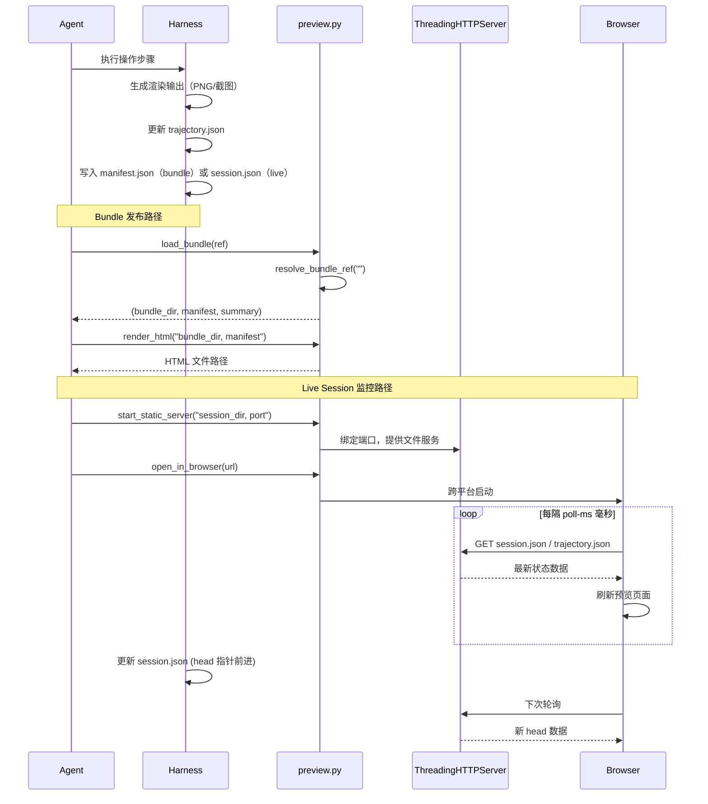

<details><summary>相关源文件</summary>

- `cli-hub/cli_hub/preview.py`
- `cli-hub/cli_hub/cli.py`
- `docs/PREVIEW_PROTOCOL.md`
- `docs/PREVIEW_MECHANISM_PROGRESS.md`
- `agent-harness/freecad/`
- `agent-harness/blender/`

</details>

# 预览与轨迹系统

预览系统允许 Agent 在工作过程中可视化其进度状态。它由两个核心组件构成：处理 bundle 与 session 数据加载、渲染和服务的 **preview 模块**，以及暴露全部预览功能的 **CLI 命令组**。轨迹文件（`trajectory.json` / `timeline.json`）将每条命令与对应的视觉快照关联，从而实现完整的可回溯执行记录。

## 核心模块：`preview.py`

Sources: [cli-hub/cli_hub/preview.py](../../../project-repos/CLI-Anything/cli-hub/cli_hub/preview.py)

<details class="source-snippets">
<summary>引用源码</summary>

<!-- source-snippets:start -->

#### `cli-hub/cli_hub/preview.py`

```python
"""Preview bundle inspection, live session rendering, and popup helpers."""

from __future__ import annotations

import functools
import html
import json
import os
import shutil
import subprocess
from http.server import SimpleHTTPRequestHandler, ThreadingHTTPServer
from pathlib import Path
from typing import Any, Dict, Iterable, List, Optional, Tuple


def _read_json(path: Path) -> Dict[str, Any]:
    with open(path, "r", encoding="utf-8") as fh:
        return json.load(fh)


def resolve_bundle_ref(bundle_ref: str) -> Tuple[Path, Path]:
    ref = Path(bundle_ref).expanduser().resolve()
    if ref.is_dir():
        manifest = ref / "manifest.json"
        if not manifest.is_file():
            raise FileNotFoundError(f"manifest.json not found in bundle directory: {ref}")
        return ref, manifest
    if ref.is_file():
        if ref.name != "manifest.json":
            raise ValueError("Bundle ref must be a bundle directory or a manifest.json path")
        return ref.parent, ref
    raise FileNotFoundError(f"Bundle ref not found: {bundle_ref}")


def resolve_session_ref(session_ref: str) -> Tuple[Path, Path]:
    ref = Path(session_ref).expanduser().resolve()
    if ref.is_dir():
        session_path = ref / "session.json"
        if not session_path.is_file():
            raise FileNotFoundError(f"session.json not found in live session directory: {ref}")
        return ref, session_path
    if ref.is_file():
        if ref.name != "session.json":
            raise ValueError("Session ref must be a live session directory or a session.json path")
        return ref.parent, ref
    raise FileNotFoundError(f"Session ref not found: {session_ref}")


def is_live_session_ref(preview_ref: str) -> bool:
    ref = Path(preview_ref).expanduser().resolve()
    if ref.is_dir():
        return (ref / "session.json").is_file()
    return ref.is_file() and ref.name == "session.json"


def load_bundle(bundle_ref: str) -> Tuple[Path, Dict[str, Any], Dict[str, Any]]:
    bundle_dir, manifest_path = resolve_bundle_ref(bundle_ref)
    manifest = _read_json(manifest_path)
    summary_rel = manifest.get("summary_path", "summary.json")
    summary_path = (bundle_dir / summary_rel).resolve()
    summary = _read_json(summary_path) if summary_path.is_file() else {}
    return bundle_dir, manifest, summary


def load_session(session_ref: str) -> Tuple[Path, Dict[str, Any]]:
    session_dir, session_path = resolve_session_ref(session_ref)
    return session_dir, _read_json(session_path)


def format_bytes(size: int) -> str:
    if size < 1024:
        return f"{size} B"
    if size < 1024 * 1024:
        return f"{size / 1024:.1f} KB"
    if size < 1024 * 1024 * 1024:
        return f"{size / (1024 * 1024):.1f} MB"
    return f"{size / (1024 * 1024 * 1024):.1f} GB"


_TRAJECTORY_FILENAMES = ("trajectory.json", "timeline.json")
_TRAJECTORY_CONTAINER_KEYS = {"trajectory", "timeline"}
_TRAJECTORY_PATH_KEYS = {
    "trajectory_path",
    "timeline_path",
    "trajectory_file",
    "timeline_file",
    "trajectory_ref",
    "timeline_ref",
}


def _coalesce(*values: Any) -> Any:
    for value in values:
        if value is None:
            continue
        if isinstance(value, str) and not value.strip():
            continue
        return value
    return None


def _stringify_command(value: Any) -> Optional[str]:
    if value is None:
        return None
    if isinstance(value, str):
        value = value.strip()
        return value or None
    if isinstance(value, (list, tuple)):
        text = " ".join(str(part) for part in value if part is not None)
        return text.strip() or None
    if isinstance(value, dict):
        for key in ("display", "display_cmd", "command", "raw", "argv"):
            if key in value:
                return _stringify_command(value[key])
        return json.dumps(value, ensure_ascii=False, sort_keys=True)
    return str(value)


def _normalize_index(value: Any, fallback: int) -> int:
    if isinstance(value, bool):
```

<!-- source-snippets:end -->
</details>
### 引用解析函数

在加载任何数据之前，系统需要将用户提供的字符串引用规范化为文件系统路径。

| 函数 | 输入 | 输出 |
|------|------|------|
| `resolve_bundle_ref()` | bundle 目录或 `manifest.json` 路径 | 规范化的 bundle 目录路径 |
| `resolve_session_ref()` | live session 目录或 `session.json` 路径 | 规范化的 session 目录路径 |
| `is_live_session_ref()` | 任意 ref 字符串 | 布尔值，判断是否为 live session |

### 数据加载函数

```
load_bundle(ref)  →  (bundle_dir, manifest, summary)
load_session(ref) →  (session_dir, session_data)
```

`load_bundle()` 解析 manifest JSON 并提取摘要元数据；`load_session()` 读取 live session 的 `session.json` 及其关联的轨迹文件。

### 检查与渲染函数

- `inspect_bundle()` — 提取 bundle 元数据（名称、版本、步骤数量、文件列表等）
- `inspect_session()` — 提取 live session 状态（当前 head、活跃步骤、时间戳）
- `render_html()` — 为静态 bundle 生成 HTML 预览页面
- `render_live_html()` — 为 live session 生成支持轮询刷新的 HTML 页面

### 服务与浏览器启动

- `start_static_server()` — 通过 Python 标准库 `ThreadingHTTPServer` 启动本地 HTTP 服务
- `open_in_browser()` — 跨平台浏览器启动（支持 macOS、Linux、Windows）

### 轨迹文件

轨迹文件记录 Agent 执行的每一步操作与对应的视觉状态快照，支持两种命名：

- `trajectory.json` — 标准格式
- `timeline.json` — 备用格式（部分 harness 使用）

## CLI 命令组：`previews`

Sources: [cli-hub/cli_hub/cli.py](../../../project-repos/CLI-Anything/cli-hub/cli_hub/cli.py)

<details class="source-snippets">
<summary>引用源码</summary>

<!-- source-snippets:start -->

#### `cli-hub/cli_hub/cli.py`

```python
"""cli-hub — CLI entry point."""

import os
import shutil
import sys
import json as json_mod
from pathlib import Path

import click

from cli_hub import __version__
from cli_hub.registry import fetch_all_clis, get_cli, search_clis, list_categories
from cli_hub.installer import install_cli, uninstall_cli, get_installed, update_cli
from cli_hub.analytics import (
    detect_invocation_context,
    track_first_run,
    track_install,
    track_launch,
    track_uninstall,
    track_visit,
)
from cli_hub.preview import (
    inspect_bundle,
    inspect_session,
    is_live_session_ref,
    load_session,
    open_in_browser,
    render_html,
    render_inspect_text,
    render_live_html,
    render_session_text,
    start_static_server,
)


def _invocation_command(ctx, version):
    """Return a compact label for the current invocation."""
    argv = sys.argv[1:]
    if version:
        return "--version"
    if ctx.invoked_subcommand:
        return ctx.invoked_subcommand
    if any(arg in ("--help", "-h") for arg in argv):
        return "--help"
    if argv:
        return argv[0]
    return "root"


@click.group(invoke_without_command=True)
@click.option("--version", is_flag=True, help="Show version.")
@click.pass_context
def main(ctx, version):
    """cli-hub — Download and manage CLI-Anything harnesses and public CLIs."""
    track_first_run()
    track_visit(command=_invocation_command(ctx, version), detection=detect_invocation_context())
    if version:
        click.echo(f"cli-hub {__version__}")
        return
    if ctx.invoked_subcommand is None:
        click.echo(ctx.get_help())


def _source_tag(cli):
    """Return a styled source indicator for display."""
    source = cli.get("_source", "harness")
    if source == "public":
        manager = cli.get("package_manager") or cli.get("install_strategy") or "public"
        return click.style(f" {manager}", fg="yellow")
    return ""


@main.command()
@click.argument("name")
def install(name):
    """Install a CLI by name."""
    click.echo(f"Installing {name}...")
    success, msg = install_cli(name)
    if success:
        cli = get_cli(name)
        track_install(name, cli["version"] if cli else "unknown")
        click.secho(f"✓ {msg}", fg="green")
        if cli:
            click.echo(f"  Run it with: {cli['entry_point']}")
            click.echo(f"  Or launch:   cli-hub launch {cli['name']}")
            if cli.get("_source") == "public" and cli.get("npx_cmd"):
                click.echo(f"  Or use npx:  {cli['npx_cmd']}")
    else:
        click.secho(f"✗ {msg}", fg="red", err=True)
        raise SystemExit(1)


@main.command()
@click.argument("name")
def uninstall(name):
    """Uninstall a CLI by name."""
    success, msg = uninstall_cli(name)
    if success:
        track_uninstall(name)
        click.secho(f"✓ {msg}", fg="green")
    else:
        click.secho(f"✗ {msg}", fg="red", err=True)
        raise SystemExit(1)


@main.command()
@click.argument("name")
def update(name):
    """Update a CLI to the latest version."""
    click.echo(f"Updating {name}...")
    success, msg = update_cli(name)
    if success:
        cli = get_cli(name)
        track_install(name, cli["version"] if cli else "unknown")
        click.secho(f"✓ {msg}", fg="green")
    else:
        click.secho(f"✗ {msg}", fg="red", err=True)
        raise SystemExit(1)


```

<!-- source-snippets:end -->
</details>
所有预览相关命令均归属于 `cli-hub previews` 命令组。

### 命令列表

| 命令 | 说明 | 主要选项 |
|------|------|---------|
| `cli-hub previews inspect <ref>` | 检查 bundle 或 session 的元数据 | `--json` 输出 JSON 格式 |
| `cli-hub previews html <ref>` | 将 bundle/session 渲染为 HTML 文件 | `--output <path>`, `--poll-ms <ms>` |
| `cli-hub previews watch <session>` | 启动本地服务器并监视 live session | `--port <n>`, `--open` |
| `cli-hub previews open <ref>` | 直接在默认浏览器中打开 | — |

`--poll-ms` 参数控制 live session HTML 页面的轮询刷新间隔，适用于 Agent 正在运行时的实时监控场景。

## 预览流程时序图



## 实际应用案例

### FreeCAD — 火星漫游车装配

Sources: [agent-harness/freecad/](../../../project-repos/CLI-Anything/agent-harness/freecad)

<details class="source-snippets">
<summary>引用源码</summary>

<!-- source-snippets:start -->

#### `agent-harness/freecad/`

> 未找到引用文件：`agent-harness/freecad/`

<!-- source-snippets:end -->
</details>
- Agent 按装配步骤逐步构建漫游车模型
- 每完成一个步骤后发布一个 preview bundle（含渲染图和 manifest）
- Live session 持续追踪最新 head 步骤
- `trajectory.json` 将每条 FreeCAD 命令与对应的三维视图截图关联

### Blender — 轨道中继无人机

Sources: [agent-harness/blender/](../../../project-repos/CLI-Anything/agent-harness/blender)

<details class="source-snippets">
<summary>引用源码</summary>

<!-- source-snippets:start -->

#### `agent-harness/blender/`

> 未找到引用文件：`agent-harness/blender/`

<!-- source-snippets:end -->
</details>
- 每个渲染步骤生成带有 PNG 渲染结果的 bundle
- Live session 允许在渲染过程中实时监控进度
- Trajectory 文件记录材质、光照、相机调整的完整历史

## 相关文档

- `docs/PREVIEW_PROTOCOL.md` — bundle 与 session 数据格式规范
- `docs/PREVIEW_MECHANISM_PROGRESS.md` — 预览机制开发进度记录

## 相关页面

- [CLI-Hub 包管理器](cli-hub.md)
- [Harness 包结构](harness-structure.md)
