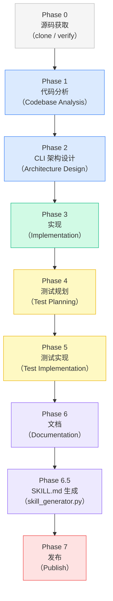
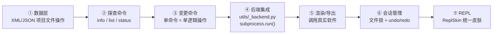
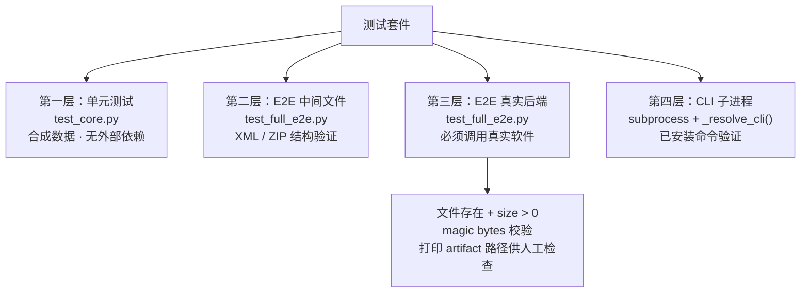
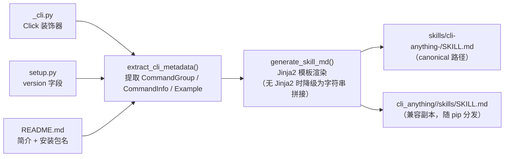
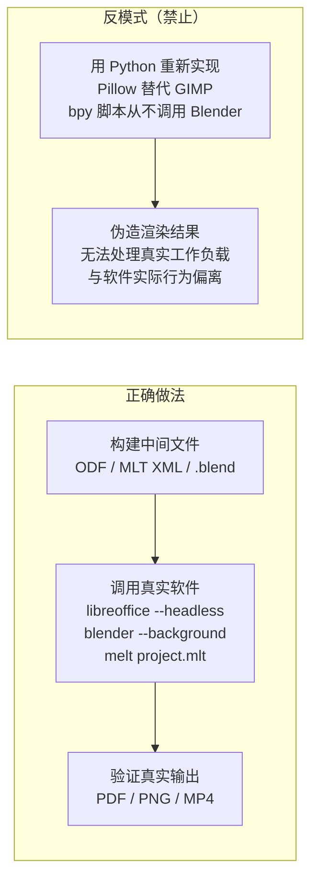

<details>
<summary>相关源文件</summary>

- `cli-anything-plugin/HARNESS.md`
- `cli-anything-plugin/commands/cli-anything.md`
- `cli-anything-plugin/commands/refine.md`
- `cli-anything-plugin/skill_generator.py`

</details>

# 七阶段生成流水线

七阶段生成流水线（Seven-Phase Pipeline）是 CLI-Anything 的核心方法论，由 `HARNESS.md` 完整定义，并通过 `/cli-anything <path>` 命令驱动执行。其目标是：对任意一款 GUI 软件，在不修改其源码的前提下，自动产出一套生产可用的、Agent 可调用的 CLI 封装。



Sources: [HARNESS.md](../../../project-repos/CLI-Anything/HARNESS.md)  [commands/cli-anything.md](../../../project-repos/CLI-Anything/commands/cli-anything.md)

<details class="source-snippets">
<summary>引用源码</summary>

<!-- source-snippets:start -->

#### `HARNESS.md`

> 未找到引用文件：`HARNESS.md`

#### `commands/cli-anything.md`

> 未找到引用文件：`commands/cli-anything.md`

<!-- source-snippets:end -->
</details>

---

## 触发方式

### `/cli-anything <path>` — 全量构建

接收软件本地路径或 GitHub URL，从 Phase 0 开始执行所有阶段直到 Phase 7。

```bash
# 从本地源码构建
/cli-anything /home/user/gimp

# 从 GitHub 仓库构建（自动 clone）
/cli-anything https://github.com/blender/blender
```

参数只接受**源码路径或仓库 URL**，软件名称（如 `"gimp"`）不被接受——Agent 必须能够访问源代码才能完成 Phase 1 的静态分析。

### `/cli-anything:refine <path> [focus]` — 增量精化

在已有 harness 的基础上执行差距分析（Gap Analysis），添加缺失命令，扩充测试。

```bash
# 宽泛精化 — 全面扫描所有能力缺口
/cli-anything:refine /home/user/gimp

# 聚焦精化 — 锁定特定功能域
/cli-anything:refine /home/user/shotcut "vid-in-vid and picture-in-picture features"
/cli-anything:refine /home/user/gimp "all batch processing and scripting filters"
```

`refine` 命令永远只增不减：新增命令、扩充测试、更新文档，不删除已有接口。

Sources: [commands/cli-anything.md](../../../project-repos/CLI-Anything/commands/cli-anything.md)  [commands/refine.md](../../../project-repos/CLI-Anything/cli-anything-plugin/commands/refine.md)

<details class="source-snippets">
<summary>引用源码</summary>

<!-- source-snippets:start -->

#### `commands/cli-anything.md`

> 未找到引用文件：`commands/cli-anything.md`

#### `commands/refine.md`

````markdown
# cli-anything:refine Command

Refine an existing CLI harness to improve coverage of the software's functions and usage patterns.

## CRITICAL: Read HARNESS.md First

**Before refining, read `./HARNESS.md`.** All new commands and tests must follow the same standards as the original build. HARNESS.md is the single source of truth for architecture, patterns, and quality requirements.

## Usage

```bash
/cli-anything:refine &lt;software-path&gt; [focus]
```

## Arguments

- `<software-path>` - **Required.** Local path to the software source code (e.g., `/home/user/gimp`, `./blender`). Must be the same source tree used during the original build.

  **Note:** Only local paths are accepted. If you need to work from a GitHub repo, clone it first with `/cli-anything`, then refine.

- `[focus]` - **Optional.** A natural-language description of the functionality area to focus on. When provided, the agent skips broad gap analysis and instead targets the specified capability area.

  Examples:
  - `/cli-anything:refine /home/user/shotcut "vid-in-vid and picture-in-picture features"`
  - `/cli-anything:refine /home/user/gimp "all batch processing and scripting filters"`
  - `/cli-anything:refine /home/user/blender "particle systems and physics simulation"`
  - `/cli-anything:refine /home/user/inkscape "path boolean operations and clipping"`

  When `[focus]` is provided:
  - Step 2 (Analyze Software Capabilities) narrows to only the specified area
  - Step 3 (Gap Analysis) compares only the focused capabilities against current coverage
  - The agent should still present findings before implementing, but scoped to the focus area

## What This Command Does

This command is used **after** a CLI harness has already been built with `/cli-anything`. It analyzes gaps between the software's full capabilities and what the current CLI covers, then iteratively expands coverage. If a `[focus]` is given, the agent narrows its analysis and implementation to that specific functionality area.

### Step 1: Inventory Current Coverage
- Read the existing CLI entry point (`<software>_cli.py`) and all core modules
- List every command, subcommand, and option currently implemented
- Read the existing test suite to understand what's tested
- Build a coverage map: `{ function_name: covered | not_covered }`

### Step 2: Analyze Software Capabilities
- Re-scan the software source at `<software-path>`
- Identify all public APIs, CLI tools, scripting interfaces, and batch-mode operations
- Focus on functions that produce observable output (renders, exports, transforms, conversions)
- Categorize by domain (e.g., for GIMP: filters, color adjustments, layer ops, selection tools)

### Step 3: Gap Analysis
- Compare current CLI coverage against the software's full capability set
- Prioritize gaps by:
  1. **High impact** — commonly used functions missing from the CLI
  2. **Easy wins** — functions with simple APIs that can be wrapped quickly
  3. **Composability** — functions that unlock new workflows when combined with existing commands
- Present the gap report to the user and confirm which gaps to address

### Step 4: Implement New Commands
- Add new commands/subcommands to the CLI for the selected gaps
- Follow the same patterns as existing commands (as defined in HARNESS.md):
  - Click command groups
  - `--json` output support
  - Session state integration
  - Error handling with `handle_error`
- Add corresponding core module functions in `core/` or `utils/`

### Step 5: Expand Tests
- Add unit tests for every new function in `test_core.py`
- Add E2E tests for new commands in `test_full_e2e.py`
- Add workflow tests that combine new commands with existing ones
- Run all tests (old + new) to ensure no regressions

### Step 6: Update Documentation
- Update `README.md` with new commands and usage examples
- Update `TEST.md` with new test results
- Update the SOP document (`<SOFTWARE>.md`) with new coverage notes

## Example

```bash
# Broad refinement — agent finds gaps across all capabilities
/cli-anything:refine /home/user/gimp

# Focused refinement — agent targets a specific functionality area
/cli-anything:refine /home/user/shotcut "vid-in-vid and picture-in-picture compositing"
/cli-anything:refine /home/user/gimp "batch processing and Script-Fu filters"
/cli-anything:refine /home/user/blender "particle systems and physics simulation"
/cli-anything:refine /home/user/inkscape "path boolean operations and clipping masks"
```

## Success Criteria

- All existing tests still pass (no regressions)
- New commands follow the same architectural patterns (per HARNESS.md)
- New tests achieve 100% pass rate
- Coverage meaningfully improved (new functions exposed via CLI)
- Documentation updated to reflect changes

## Notes

- Refine is incremental — run it multiple times to steadily expand coverage
- Each run should focus on a coherent set of related functions rather than trying to cover everything at once
- The agent should present the gap analysis before implementing, so the user can steer priorities
- Refine never removes existing commands — it only adds or enhances
````

<!-- source-snippets:end -->
</details>

---

## Phase 1：代码分析（Codebase Analysis）

在对软件做任何设计决策之前，必须先读懂它。Phase 1 完成五项分析任务：

| 分析项 | 目标 |
|--------|------|
| **识别后端引擎** | 找出 GUI 背后的核心库/框架（如 Shotcut 背后是 MLT，LibreOffice 内嵌 UNO API） |
| **映射 GUI 操作到 API** | 每一个按钮点击、菜单项都对应一次函数调用；将这些映射关系列表 |
| **识别数据模型** | 理解项目文件格式（XML、JSON、二进制、数据库？）及其状态表示 |
| **发现已有 CLI 工具** | 许多后端自带可执行文件（`melt`、`ffmpeg`、`libreoffice --headless`），这些是构建 CLI 的基础积木 |
| **梳理命令/撤销系统** | 如果应用有撤销/重做功能，它大概率使用了命令模式——这些命令就是 CLI 操作的蓝图 |

分析结果沉淀为一份软件专属的 SOP 文档（如 `GIMP.md`、`BLENDER.md`），供后续阶段参考。

Sources: [HARNESS.md — Phase 1](../../../project-repos/CLI-Anything/HARNESS.md%20%E2%80%94%20Phase%201)

<details class="source-snippets">
<summary>引用源码</summary>

<!-- source-snippets:start -->

#### `HARNESS.md — Phase 1`

> 未找到引用文件：`HARNESS.md — Phase 1`

<!-- source-snippets:end -->
</details>

---

## Phase 2：CLI 架构设计（Architecture Design）

基于分析结论，确定 CLI 的交互模型、命令分组、状态模型和输出格式。

### 交互模型

推荐同时支持两种模式：

- **有状态 REPL**：维护会话上下文，适合 Agent 的多步骤交互
- **单次子命令 CLI**：每次调用无状态，适合脚本化流水线

实现方式是在 Click 主组上设置 `invoke_without_command=True`，当没有子命令时自动进入 REPL：

```python
@click.group(invoke_without_command=True)
@click.pass_context
def cli(ctx, ...):
    if ctx.invoked_subcommand is None:
        ctx.invoke(repl, project_path=None)
```

### 命令分组设计

```
project    — 项目管理（new / open / save / close）
<core-ops> — 软件核心操作（因软件而异）
import     — 导入（文件 I/O、格式转换）
export     — 导出（渲染流水线）
config     — 配置（设置、偏好、配置文件）
session    — 会话/状态管理（undo / redo / history / status）
```

### 状态模型设计

| 问题 | 设计决策 |
|------|---------|
| 哪些状态需要跨命令持久化？ | 打开的项目、光标位置、当前选区 |
| 状态存储在哪里？ | REPL 模式：内存；单次 CLI：JSON 会话文件 |
| 状态如何序列化？ | JSON 会话文件（配合文件锁防并发写入损坏） |

### 输出格式

所有命令**必须**支持 `--json` 标志以输出机器可读格式：

```bash
# 人类可读（表格 + 颜色）
cli-anything-gimp layer list

# Agent 可消费（确定性 JSON）
cli-anything-gimp --json layer list
```

Sources: [HARNESS.md — Phase 2](../../../project-repos/CLI-Anything/HARNESS.md%20%E2%80%94%20Phase%202)

<details class="source-snippets">
<summary>引用源码</summary>

<!-- source-snippets:start -->

#### `HARNESS.md — Phase 2`

> 未找到引用文件：`HARNESS.md — Phase 2`

<!-- source-snippets:end -->
</details>

---

## Phase 3：实现（Implementation）

按照七个子步骤依次构建，从数据层向上叠加：



### ④ 后端集成：`utils/<software>_backend.py`

后端模块用 `shutil.which()` 定位可执行文件，用 `subprocess.run()` 调用，并在软件未安装时给出清晰的错误提示：

```python
# utils/lo_backend.py（LibreOffice 示例）
def convert_odf_to(odf_path, output_format, output_path=None, overwrite=False):
    lo = find_libreoffice()   # 未找到时抛出 RuntimeError + 安装指引
    subprocess.run([lo, "--headless", "--convert-to", output_format, ...])
    return {"output": final_path, "format": output_format, "method": "libreoffice-headless"}
```

这是 CLI-Anything **第一原则**的实现：CLI 是软件的命令行接口，而非其替代品。禁止用 Pillow 替代 GIMP、用纯 Python 替代 Blender 渲染。

### ⑥ 会话文件锁（`_locked_save_json`）

防止并发写入损坏 JSON 会话文件的标准模式：以 `"r+"` 打开，加排他锁，在锁内截断后写入：

```python
# 参见 guides/session-locking.md
with open(session_path, "r+") as f:
    fcntl.flock(f, fcntl.LOCK_EX)
    f.seek(0)
    f.truncate()
    json.dump(session_data, f, indent=2)
```

### ⑦ REPL 统一皮肤（`ReplSkin`）

将 `cli-anything-plugin/repl_skin.py` 复制到 `utils/repl_skin.py`，提供品牌化 Banner、样式化提示符、命令历史、格式化帮助和状态展示：

```python
from cli_anything.<software>.utils.repl_skin import ReplSkin

skin = ReplSkin("<software>", version="1.0.0")
skin.print_banner()                          # 品牌化启动框
pt_session = skin.create_prompt_session()    # prompt_toolkit + 历史记录
line = skin.get_input(pt_session, project_name="my_project", modified=True)
skin.success("Saved")    # ✓ 绿色
skin.error("Not found")  # ✗ 红色
skin.warning("Unsaved")  # ⚠ 黄色
skin.table(headers, rows)
skin.progress(3, 10, "Rendering...")
```

`ReplSkin` 优先读取仓库根目录的 `skills/cli-anything-<software>/SKILL.md`，安装到其他位置时回退到包内的 `skills/SKILL.md` 副本。

Sources: [HARNESS.md — Phase 3](../../../project-repos/CLI-Anything/HARNESS.md%20%E2%80%94%20Phase%203)

<details class="source-snippets">
<summary>引用源码</summary>

<!-- source-snippets:start -->

#### `HARNESS.md — Phase 3`

> 未找到引用文件：`HARNESS.md — Phase 3`

<!-- source-snippets:end -->
</details>

---

## Phase 4：测试规划（Test Planning）

**在写任何测试代码之前**，先在 `tests/TEST.md` 中建立完整的测试计划。这份文档必须包含：

1. **测试清单**：列出计划的测试文件及预计用例数（`test_core.py` XX 条、`test_full_e2e.py` XX 条）
2. **单元测试计划**：每个核心模块测什么函数、覆盖哪些边界条件
3. **E2E 测试计划**：将验证哪些真实工作流、生成哪些真实文件、如何做格式校验
4. **真实工作流场景**：多步骤场景的详细描述（YouTube 风格剪辑、蒙太奇拼接、PiP 合成等）

先规划再实现，确保测试覆盖在动手之前就被系统性地思考过。

Sources: [HARNESS.md — Phase 4](../../../project-repos/CLI-Anything/HARNESS.md%20%E2%80%94%20Phase%204)

<details class="source-snippets">
<summary>引用源码</summary>

<!-- source-snippets:start -->

#### `HARNESS.md — Phase 4`

> 未找到引用文件：`HARNESS.md — Phase 4`

<!-- source-snippets:end -->
</details>

---

## Phase 5：测试实现（Test Implementation）

按照 `TEST.md` 计划，分四个层级实现测试：



### 真实后端测试（不可妥协）

退出码 0 不等于测试通过。必须对输出物做程序化验证：

```python
# PDF 验证
with open(result["output"], "rb") as f:
    assert f.read(5) == b"%PDF-"

# DOCX/XLSX/PPTX（OOXML = ZIP）
import zipfile
assert zipfile.is_zipfile(result["output"])

# 视频：用 ffmpeg probe 特定帧
# 音频：检查 RMS 电平与时长
```

**必须打印 artifact 路径**以便人工抽检：

```python
print(f"\n  PDF: {result['output']} ({result['file_size']:,} bytes)")
```

### `_resolve_cli` 子进程测试辅助函数

子进程测试通过 `_resolve_cli()` 调用已安装命令，而非硬编码 `sys.executable`：

```python
def _resolve_cli(name):
    """优先使用已安装命令；开发时回退到 python -m。"""
    force = os.environ.get("CLI_ANYTHING_FORCE_INSTALLED", "").strip() == "1"
    path = shutil.which(name)
    if path:
        return [path]
    if force:
        raise RuntimeError(f"{name} not found in PATH. Install with: pip install -e .")
    module = name.replace("cli-anything-", "cli_anything.") + "..." 
    return [sys.executable, "-m", module]
```

在 CI/发布验证时，通过 `CLI_ANYTHING_FORCE_INSTALLED=1` 强制使用已安装命令而非源码回退：

```bash
CLI_ANYTHING_FORCE_INSTALLED=1 python3 -m pytest cli_anything/<software>/tests/ -v -s
```

`-s` 标志可以看到 `[_resolve_cli]` 打印的后端路径确认信息及 artifact 路径。

Sources: [HARNESS.md — Phase 5](../../../project-repos/CLI-Anything/HARNESS.md%20%E2%80%94%20Phase%205)

<details class="source-snippets">
<summary>引用源码</summary>

<!-- source-snippets:start -->

#### `HARNESS.md — Phase 5`

> 未找到引用文件：`HARNESS.md — Phase 5`

<!-- source-snippets:end -->
</details>

---

## Phase 6：文档（Documentation）

运行完所有测试之后，将结果**追加**到已有的 `TEST.md`（而非覆盖）：

1. `pytest -v --tb=no` 的完整输出（所有测试名称与状态）
2. 汇总统计（总数、通过率、执行时间）
3. 覆盖说明（未覆盖的函数或场景）

`TEST.md` 由此成为**测试计划（Phase 4 写入）+ 测试结果（Phase 6 追加）**的完整记录，是每个 harness 必须包含的强制文档。

Sources: [HARNESS.md — Phase 6](../../../project-repos/CLI-Anything/HARNESS.md%20%E2%80%94%20Phase%206)

<details class="source-snippets">
<summary>引用源码</summary>

<!-- source-snippets:start -->

#### `HARNESS.md — Phase 6`

> 未找到引用文件：`HARNESS.md — Phase 6`

<!-- source-snippets:end -->
</details>

---

## Phase 6.5：SKILL.md 生成

SKILL.md 是专为 AI Agent 设计的机器可读能力索引，使 Agent 无需预训练即可发现并正确调用 CLI。

### 生成工具：`skill_generator.py`

`skill_generator.py` 从 harness 目录中自动提取元数据，生成标准化的 SKILL.md 文件：



提取逻辑：
- **命令组**：通过正则匹配 `@xxx.group(...)` 装饰器及函数 docstring
- **子命令**：通过正则匹配 `@xxx.command(...)` 装饰器及函数 docstring
- **版本**：从 `setup.py` 的 `version=` 字段提取
- **系统依赖**：从 `README.md` 提取 `apt install` / `brew install` 模式

### SKILL.md 结构

```markdown
---
name: "cli-anything-<software>"
description: "..."
---

# cli-anything-<software>

## Installation
## Usage
## Command Groups
## Examples
## For AI Agents
```

YAML frontmatter 是 skill-creator 发现机制的触发元数据。每个 CLI 封装**必须**包含：

- `--json` 模式的使用说明（Agent 专用）
- 所有命令组的简要描述
- 能演示常见工作流的真实示例

### 两处输出路径

| 路径 | 用途 |
|------|------|
| `skills/cli-anything-<software>/SKILL.md` | 仓库 canonical 路径，ReplSkin Banner 优先读取 |
| `cli_anything/<software>/skills/SKILL.md` | 兼容副本，随 `pip install` 分发到用户机器 |

`setup.py` 中需声明 package_data 以确保副本随包发布：

```python
package_data={
    "cli_anything.<software>": ["skills/*.md"],
},
```

手动调用生成器：

```bash
python3 skill_generator.py /path/to/agent-harness
python3 skill_generator.py /path/to/agent-harness -o /custom/output/SKILL.md
python3 skill_generator.py /path/to/agent-harness -t /custom/template.md
```

Sources: [HARNESS.md — Phase 6.5](../../../project-repos/CLI-Anything/HARNESS.md%20%E2%80%94%20Phase%206.5)  [skill_generator.py](../../../project-repos/CLI-Anything/skill_generator.py)

<details class="source-snippets">
<summary>引用源码</summary>

<!-- source-snippets:start -->

#### `HARNESS.md — Phase 6.5`

> 未找到引用文件：`HARNESS.md — Phase 6.5`

#### `skill_generator.py`

> 未找到引用文件：`skill_generator.py`

<!-- source-snippets:end -->
</details>

---

## Phase 7：发布（Publish）

利用 **PEP 420 命名空间包**，将 CLI 封装发布为独立的 PyPI 包，同时与其他封装共享 `cli_anything` 命名空间。

### 目录结构规则

```
agent-harness/
├── setup.py                   # PyPI 配置（Phase 7 创建）
└── cli_anything/              # 命名空间包——禁止 __init__.py
    └── <software>/            # 子包——必须有 __init__.py
        ├── __init__.py
        ├── <software>_cli.py
        ├── core/
        ├── utils/
        └── tests/
```

`cli_anything/` **必须没有** `__init__.py`——这是 PEP 420 命名空间包的关键。多个独立安装的包（`cli-anything-gimp`、`cli-anything-blender`）可以在同一 Python 环境中共存，各自贡献 `cli_anything/gimp/` 和 `cli_anything/blender/` 而不冲突。

### `setup.py` 核心配置

```python
from setuptools import setup, find_namespace_packages

setup(
    name="cli-anything-<software>",
    version="1.0.0",
    packages=find_namespace_packages(include=["cli_anything.*"]),
    package_data={"cli_anything.<software>": ["skills/*.md"]},
    entry_points={
        "console_scripts": [
            "cli-anything-<software>=cli_anything.<software>.<software>_cli:cli",
        ],
    },
)
```

### 安装与验证

```bash
# 本地可编辑安装
pip install -e .

# 验证 CLI 已在 PATH 中
which cli-anything-<software>
cli-anything-<software> --help
```

Sources: [HARNESS.md — Phase 7](../../../project-repos/CLI-Anything/HARNESS.md%20%E2%80%94%20Phase%207)  [commands/cli-anything.md](../../../project-repos/CLI-Anything/commands/cli-anything.md)

<details class="source-snippets">
<summary>引用源码</summary>

<!-- source-snippets:start -->

#### `HARNESS.md — Phase 7`

> 未找到引用文件：`HARNESS.md — Phase 7`

#### `commands/cli-anything.md`

> 未找到引用文件：`commands/cli-anything.md`

<!-- source-snippets:end -->
</details>

---

## 架构陷阱与关键原则

### 第一原则：必须调用真实软件

这是整个 harness 方法论最核心也最常被违反的规则。



软件是硬依赖，不是可选项。未安装时必须报错并给出安装指引，而非降级到 fallback 库。

### 第二陷阱：渲染缺口（Rendering Gap）

CLI 修改了项目文件中的滤镜/效果，但渲染时若使用简单工具（如 `ffmpeg concat demuxer`），这些效果会被静默忽略，输出与输入一模一样。

解决方案（优先级从高到低）：
1. **使用软件原生渲染器**（`melt` 读取 MLT 项目文件并应用所有效果）
2. **滤镜翻译层**（将项目格式的效果转换为渲染工具的原生语法，例如 MLT 滤镜 → ffmpeg `-filter_complex`）
3. **生成渲染脚本**（让用户手动执行）

每一个注册到效果仓库的滤镜，**必须**有对应的渲染映射，或明确标注为"仅限项目文件，不参与渲染"。

### 其他关键注意事项

| 场景 | 规则 |
|------|------|
| 非整数帧率（29.97fps） | 用 `round()` 而非 `int()`，使用整数算术显示时间码，允许 ±1 帧误差 |
| 滤镜翻译 | 注意重复滤镜合并、交错流排序、参数量纲差异、无法映射的效果 |
| 输出验证 | 视频：用 ffmpeg probe 特定帧；音频：检查 RMS 电平；PDF：magic bytes `%PDF-`；OOXML：验证 ZIP 结构 |
| MCP 后端 | 对没有原生 CLI 但暴露 MCP 服务器的软件（如 DOMShell），参见 `guides/mcp-backend.md` |

Sources: [HARNESS.md — Architecture Patterns & Pitfalls](../../../project-repos/CLI-Anything/HARNESS.md%20%E2%80%94%20Architecture%20Patterns%20%26%20Pitfalls)

<details class="source-snippets">
<summary>引用源码</summary>

<!-- source-snippets:start -->

#### `HARNESS.md — Architecture Patterns & Pitfalls`

> 未找到引用文件：`HARNESS.md — Architecture Patterns & Pitfalls`

<!-- source-snippets:end -->
</details>

---

## 完整目录结构参考

```
<software>/
└── agent-harness/
    ├── <SOFTWARE>.md              # 软件专属 SOP（Phase 1/2 产出）
    ├── setup.py                   # PyPI 配置（Phase 7 创建）
    └── cli_anything/              # 命名空间包（禁止 __init__.py）
        └── <software>/            # 子包（必须有 __init__.py）
            ├── __init__.py
            ├── __main__.py        # python3 -m cli_anything.<software>
            ├── README.md          # 安装与使用指南（强制）
            ├── <software>_cli.py  # Click 入口点 + REPL
            ├── core/              # 核心模块（每个域一个文件）
            │   ├── __init__.py
            │   ├── project.py     # 项目 create/open/save/info
            │   ├── export.py      # 渲染流水线 + 滤镜翻译
            │   ├── session.py     # 有状态会话、undo/redo
            │   └── ...
            ├── utils/             # 共享工具
            │   ├── __init__.py
            │   ├── <software>_backend.py  # 后端：调用真实软件
            │   └── repl_skin.py           # 统一 REPL 皮肤（从插件复制）
            └── tests/             # 测试套件
                ├── TEST.md        # 测试计划 + 结果（强制）
                ├── test_core.py   # 单元测试（合成数据）
                └── test_full_e2e.py  # E2E 测试（真实文件）

# Canonical skill 路径（仓库根）
skills/
└── cli-anything-<software>/
    └── SKILL.md
```

Sources: [HARNESS.md — Directory Structure](../../../project-repos/CLI-Anything/HARNESS.md%20%E2%80%94%20Directory%20Structure)

<details class="source-snippets">
<summary>引用源码</summary>

<!-- source-snippets:start -->

#### `HARNESS.md — Directory Structure`

> 未找到引用文件：`HARNESS.md — Directory Structure`

<!-- source-snippets:end -->
</details>

---

## 相关页面

- [项目概览](overview.md)
- [测试与质量保障](testing-and-quality.md)
