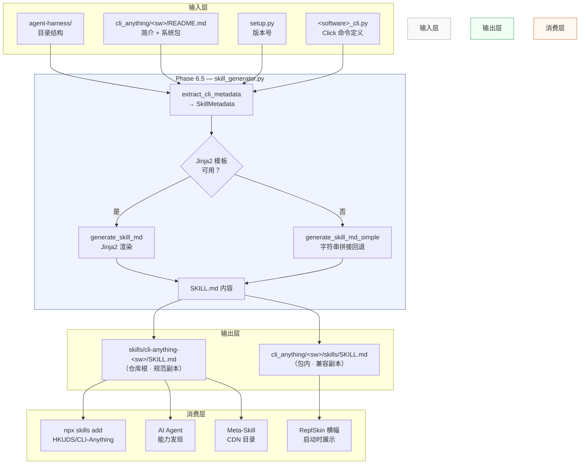
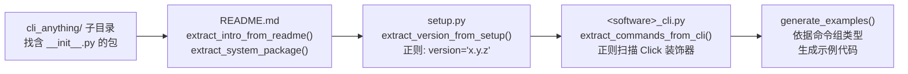
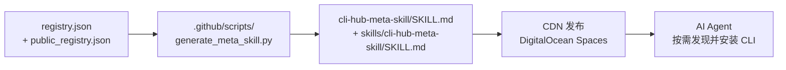
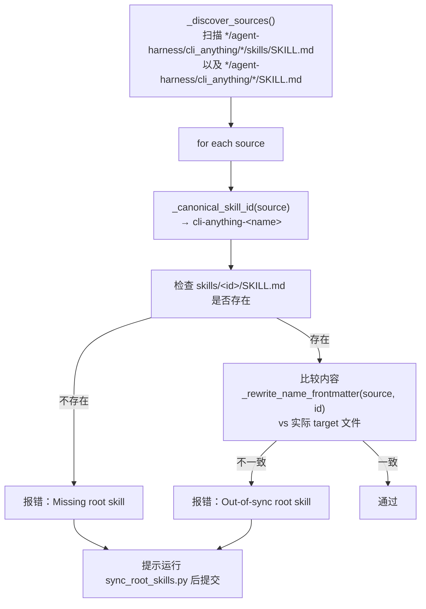

<details>
<summary>相关源文件</summary>

生成本页时使用的主要源文件：

- [cli-anything-plugin/skill_generator.py](../../../project-repos/CLI-Anything/cli-anything-plugin/skill_generator.py)
- [cli-anything-plugin/templates/SKILL.md.template](../../../project-repos/CLI-Anything/cli-anything-plugin/templates/SKILL.md.template)
- [skills/cli-anything-blender/SKILL.md](../../../project-repos/CLI-Anything/skills/cli-anything-blender/SKILL.md)
- [skills/README.md](../../../project-repos/CLI-Anything/skills/README.md)
- [cli-hub-meta-skill/SKILL.md](../../../project-repos/CLI-Anything/cli-hub-meta-skill/SKILL.md)
- [.github/workflows/check-root-skills.yml](../../../project-repos/CLI-Anything/.github/workflows/check-root-skills.yml)
- [.github/scripts/validate_root_skills.py](../../../project-repos/CLI-Anything/.github/scripts/validate_root_skills.py)
- [.github/scripts/sync_root_skills.py](../../../project-repos/CLI-Anything/.github/scripts/sync_root_skills.py)
- [.github/scripts/generate_meta_skill.py](../../../project-repos/CLI-Anything/.github/scripts/generate_meta_skill.py)

</details>

# SKILL.md 技能系统

`SKILL.md` 是 CLI-Anything 框架的**能力发现协议**：每个 CLI 封装随包附带一份机器可读的技能定义文件，AI Agent 读取该文件即可获得完整的调用知识，无需预训练、无需人工文档。

`SKILL.md` 在流水线 **Phase 6.5** 由 `cli-anything-plugin/skill_generator.py` 自动生成，是连接"软件能做什么"与"Agent 如何调用"的桥梁。

Sources: [cli-anything-plugin/skill_generator.py:1-12](../../../project-repos/CLI-Anything/cli-anything-plugin/skill_generator.py#L1-L12)  [skills/README.md:1-30](../../../project-repos/CLI-Anything/skills/README.md#L1-L30)

<details class="source-snippets">
<summary>引用源码</summary>

<!-- source-snippets:start -->

#### `cli-anything-plugin/skill_generator.py:1-12`

```python
"""
SKILL.md Generator for CLI-Anything

This module extracts metadata from CLI-Anything harnesses and generates
SKILL.md files following the skill-creator methodology.

The generated SKILL.md files contain:
- YAML frontmatter with name and description (triggering metadata)
- Markdown body with usage instructions
- Command documentation
- Examples for AI agents
"""
```

#### `skills/README.md:1-30`

````markdown
# CLI-Anything Skills

This directory is the canonical `npx skills` surface for in-repo CLI-Anything
harnesses.

Layout:

```text
skills/
  cli-anything-audacity/SKILL.md
  cli-anything-blender/SKILL.md
  ...
```

Typical usage:

```bash
npx skills add HKUDS/CLI-Anything --list
npx skills add HKUDS/CLI-Anything --skill cli-anything-audacity -g -y
```

The `SKILL.md` files here are the canonical repo-root copies. Installed harness
packages still ship compatibility copies inside `cli_anything/<software>/skills/`
for local runtime discovery.

CI rule:

- If a harness keeps a deep packaged `SKILL.md`, it must also have a matching
  repo-root `skills/<skill-id>/SKILL.md`.
- A future harness that only defines its canonical skill directly in `skills/`
````

<!-- source-snippets:end -->
</details>
---

## 1. 整体架构



Sources: [cli-anything-plugin/skill_generator.py:69-142](../../../project-repos/CLI-Anything/cli-anything-plugin/skill_generator.py#L69-L142)  [cli-anything-plugin/skill_generator.py:476-514](../../../project-repos/CLI-Anything/cli-anything-plugin/skill_generator.py#L476-L514)

<details class="source-snippets">
<summary>引用源码</summary>

<!-- source-snippets:start -->

#### `cli-anything-plugin/skill_generator.py:69-142`

```python
def extract_cli_metadata(harness_path: str) -> SkillMetadata:
    """
    Extract metadata from a CLI-Anything harness directory.

    Args:
        harness_path: Path to the agent-harness directory

    Returns:
        SkillMetadata containing extracted information
    """
    harness_path = Path(harness_path)

    # Find the cli_anything/<software> directory
    cli_anything_dir = harness_path / "cli_anything"
    if not cli_anything_dir.exists():
        raise ValueError(
            f"cli_anything directory not found in {harness_path}. "
            "Ensure the harness structure includes cli_anything/<software>/"
        )
    software_dirs = [d for d in cli_anything_dir.iterdir()
                     if d.is_dir() and (d / "__init__.py").exists()]

    if not software_dirs:
        raise ValueError(f"No CLI package found in {harness_path}")

    software_dir = software_dirs[0]
    software_name = software_dir.name

    # Extract metadata from README.md
    readme_path = software_dir / "README.md"
    skill_intro = ""
    system_package = None

    if readme_path.exists():
        readme_content = readme_path.read_text(encoding="utf-8")
        skill_intro = extract_intro_from_readme(readme_content)
        system_package = extract_system_package(readme_content)

    # Extract version from setup.py
    setup_path = harness_path / "setup.py"
    version = "1.0.0"

    if setup_path.exists():
        version = extract_version_from_setup(setup_path)

    # Extract commands from CLI file
    cli_file = software_dir / f"{software_name}_cli.py"
    command_groups = []

    if cli_file.exists():
        command_groups = extract_commands_from_cli(cli_file)

    # Generate examples based on software type
    examples = generate_examples(software_name, command_groups)

    # Build skill name and description
    skill_name = _canonical_skill_name(harness_path, software_name)
    if skill_intro:
        intro_snippet = skill_intro[:100]
        suffix = "..." if len(skill_intro) > 100 else ""
        skill_description = f"Command-line interface for {_format_display_name(software_name)} - {intro_snippet}{suffix}"
    else:
        skill_description = f"Command-line interface for {_format_display_name(software_name)}"

    return SkillMetadata(
        skill_name=skill_name,
        skill_description=skill_description,
        software_name=software_name,
        skill_intro=skill_intro,
        version=version,
        system_package=system_package,
        command_groups=command_groups,
        examples=examples
    )
```

#### `cli-anything-plugin/skill_generator.py:476-514`

```python
def generate_skill_file(harness_path: str, output_path: Optional[str] = None,
                        template_path: Optional[str] = None) -> str:
    """
    Generate a SKILL.md file for a CLI-Anything harness.

    Args:
        harness_path: Path to the agent-harness directory
        output_path: Optional output path for SKILL.md
                     (default: skills/cli-anything-<software>/SKILL.md)
        template_path: Optional path to custom Jinja2 template

    Returns:
        Path to the generated SKILL.md file
    """
    # Extract metadata
    metadata = extract_cli_metadata(harness_path)

    # Generate content
    content = generate_skill_md(metadata, template_path)

    # Determine output path
    harness_path_obj = Path(harness_path)
    compatibility_path = harness_path_obj / "cli_anything" / metadata.software_name / "skills" / "SKILL.md"
    if output_path is None:
        repo_root = harness_path_obj.parent.parent
        output_path = repo_root / "skills" / metadata.skill_name / "SKILL.md"
    else:
        output_path = Path(output_path)

    # Ensure output directory exists
    output_path.parent.mkdir(parents=True, exist_ok=True)

    # Write file
    output_path.write_text(content, encoding="utf-8")
    if compatibility_path != output_path:
        compatibility_path.parent.mkdir(parents=True, exist_ok=True)
        compatibility_path.write_text(content, encoding="utf-8")

    return str(output_path)
```

<!-- source-snippets:end -->
</details>
---

## 2. 元数据提取：`extract_cli_metadata()`

`extract_cli_metadata(harness_path)` 是生成流程的入口，它扫描一个 agent-harness 目录，返回填充完整的 `SkillMetadata` 数据类。

### 2.1 SkillMetadata 数据类

```python
@dataclass
class SkillMetadata:
    skill_name: str          # 规范技能 ID，如 "cli-anything-blender"
    skill_description: str   # YAML frontmatter description
    software_name: str       # 包目录名，如 "blender"
    skill_intro: str         # 从 README.md 提取的简介段落
    version: str             # 从 setup.py 提取的版本号
    system_package: str      # 系统包安装命令（可选）
    command_groups: list[CommandGroup]
    examples: list[Example]
```

以及嵌套结构：

| 数据类 | 字段 | 说明 |
|--------|------|------|
| `CommandGroup` | `name`, `description`, `commands` | Click group 对应一组命令 |
| `CommandInfo` | `name`, `description` | 单条 Click command |
| `Example` | `title`, `description`, `code` | 自动生成的用法示例 |

Sources: [cli-anything-plugin/skill_generator.py:33-67](../../../project-repos/CLI-Anything/cli-anything-plugin/skill_generator.py#L33-L67)

<details class="source-snippets">
<summary>引用源码</summary>

<!-- source-snippets:start -->

#### `cli-anything-plugin/skill_generator.py:33-67`

```python
@dataclass
class CommandInfo:
    """Information about a CLI command."""
    name: str
    description: str


@dataclass
class CommandGroup:
    """A group of related CLI commands."""
    name: str
    description: str
    commands: list[CommandInfo] = field(default_factory=list)


@dataclass
class Example:
    """An example of CLI usage."""
    title: str
    description: str
    code: str


@dataclass
class SkillMetadata:
    """Metadata extracted from a CLI-Anything harness."""
    skill_name: str
    skill_description: str
    software_name: str
    skill_intro: str
    version: str
    system_package: Optional[str] = None
    command_groups: list[CommandGroup] = field(default_factory=list)
    examples: list[Example] = field(default_factory=list)

```

<!-- source-snippets:end -->
</details>
### 2.2 扫描逻辑

扫描流程按固定顺序从四个来源读取数据：



**README.md 解析规则**：跳过一级标题行，提取紧随其后的第一段文字作为 `skill_intro`；用正则 ` `apt install &lt;pkg&gt;` / `brew install &lt;pkg&gt;` `` 提取 `system_package。

**版本提取**：正则 `version\s*=\s*["']([^"']+)["']`，未匹配则回退到 `"1.0.0"`。

Sources: [cli-anything-plugin/skill_generator.py:69-142](../../../project-repos/CLI-Anything/cli-anything-plugin/skill_generator.py#L69-L142)  [cli-anything-plugin/skill_generator.py:145-198](../../../project-repos/CLI-Anything/cli-anything-plugin/skill_generator.py#L145-L198)

<details class="source-snippets">
<summary>引用源码</summary>

<!-- source-snippets:start -->

#### `cli-anything-plugin/skill_generator.py:69-142`

```python
def extract_cli_metadata(harness_path: str) -> SkillMetadata:
    """
    Extract metadata from a CLI-Anything harness directory.

    Args:
        harness_path: Path to the agent-harness directory

    Returns:
        SkillMetadata containing extracted information
    """
    harness_path = Path(harness_path)

    # Find the cli_anything/<software> directory
    cli_anything_dir = harness_path / "cli_anything"
    if not cli_anything_dir.exists():
        raise ValueError(
            f"cli_anything directory not found in {harness_path}. "
            "Ensure the harness structure includes cli_anything/<software>/"
        )
    software_dirs = [d for d in cli_anything_dir.iterdir()
                     if d.is_dir() and (d / "__init__.py").exists()]

    if not software_dirs:
        raise ValueError(f"No CLI package found in {harness_path}")

    software_dir = software_dirs[0]
    software_name = software_dir.name

    # Extract metadata from README.md
    readme_path = software_dir / "README.md"
    skill_intro = ""
    system_package = None

    if readme_path.exists():
        readme_content = readme_path.read_text(encoding="utf-8")
        skill_intro = extract_intro_from_readme(readme_content)
        system_package = extract_system_package(readme_content)

    # Extract version from setup.py
    setup_path = harness_path / "setup.py"
    version = "1.0.0"

    if setup_path.exists():
        version = extract_version_from_setup(setup_path)

    # Extract commands from CLI file
    cli_file = software_dir / f"{software_name}_cli.py"
    command_groups = []

    if cli_file.exists():
        command_groups = extract_commands_from_cli(cli_file)

    # Generate examples based on software type
    examples = generate_examples(software_name, command_groups)

    # Build skill name and description
    skill_name = _canonical_skill_name(harness_path, software_name)
    if skill_intro:
        intro_snippet = skill_intro[:100]
        suffix = "..." if len(skill_intro) > 100 else ""
        skill_description = f"Command-line interface for {_format_display_name(software_name)} - {intro_snippet}{suffix}"
    else:
        skill_description = f"Command-line interface for {_format_display_name(software_name)}"

    return SkillMetadata(
        skill_name=skill_name,
        skill_description=skill_description,
        software_name=software_name,
        skill_intro=skill_intro,
        version=version,
        system_package=system_package,
        command_groups=command_groups,
        examples=examples
    )
```

#### `cli-anything-plugin/skill_generator.py:145-198`

```python
def extract_intro_from_readme(content: str) -> str:
    """Extract introduction text from README content."""
    # Find the first paragraph after the title
    lines = content.split("\n")
    intro_lines = []
    in_intro = False

    for line in lines:
        line = line.strip()
        if not line:
            if in_intro and intro_lines:
                break
            continue
        if line.startswith("# "):
            in_intro = True
            continue
        if line.startswith("##"):
            break
        if in_intro:
            intro_lines.append(line)

    return " ".join(intro_lines) or f"CLI interface for the software."


def extract_system_package(content: str) -> Optional[str]:
    """Extract system package installation command from README."""
    # Look for apt/brew install patterns
    patterns = [
        r"`apt install ([\w\-]+)`",
        r"`brew install ([\w\-]+)`",
        r"`apt-get install ([\w\-]+)`",
    ]

    for pattern in patterns:
        match = re.search(pattern, content)
        if match:
            package = match.group(1)
            if "apt-get" in pattern:
                return f"apt-get install {package}"
            elif "apt" in pattern:
                return f"apt install {package}"
            elif "brew" in pattern:
                return f"brew install {package}"

    return None


def extract_version_from_setup(setup_path: Path) -> str:
    """Extract version from setup.py."""
    content = setup_path.read_text(encoding="utf-8")
    match = re.search(r'version\s*=\s*["\']([^"\']+)["\']', content)
    if match:
        return match.group(1)
    return "1.0.0"
```

<!-- source-snippets:end -->
</details>
### 2.3 规范技能名：`_canonical_skill_name()`

```python
def _canonical_skill_name(harness_path: Path, software_name: str) -> str:
    software_dir = software_name
    if harness_path.name == "agent-harness" and harness_path.parent.name:
        software_dir = harness_path.parent.name        # 使用父目录名
    return f"cli-anything-{software_dir.replace('_', '-')}"
```

规则：下划线统一转连字符，前缀固定为 `cli-anything-`。例如 `blender/agent-harness` → `cli-anything-blender`，`adobe_photoshop/agent-harness` → `cli-anything-adobe-photoshop`。

Sources: [cli-anything-plugin/skill_generator.py:25-31](../../../project-repos/CLI-Anything/cli-anything-plugin/skill_generator.py#L25-L31)

<details class="source-snippets">
<summary>引用源码</summary>

<!-- source-snippets:start -->

#### `cli-anything-plugin/skill_generator.py:25-31`

```python
def _canonical_skill_name(harness_path: Path, software_name: str) -> str:
    """Return the repo-root canonical skill id for a harness."""
    software_dir = software_name
    if harness_path.name == "agent-harness" and harness_path.parent.name:
        software_dir = harness_path.parent.name
    return f"cli-anything-{software_dir.replace('_', '-')}"

```

<!-- source-snippets:end -->
</details>
---

## 3. 命令提取：`extract_commands_from_cli()`

该函数对 `<software>_cli.py` 做基于正则的静态分析，无需执行 Python 解释器。

### 3.1 Group 正则

```
@(\w+)\.group\([^)]*\)       # @xxx.group(...)
(?:\s*@[\w.]+\([^)]*\))*     # 可选的额外装饰器
\s*def\s+(\w+)\([^)]*\)      # def xxx(...):
:\s*
(?:"""([\s\S]*?)"""|'''([\s\S]*?)''')?   # 可选 docstring
```

提取 `group_func` 名称（下划线转空格再 title case）和 docstring 作为组描述。

### 3.2 Command 正则

结构与 Group 正则相同，区别在于匹配 `.command(` 而非 `.group(`。从 `match.group(1)` 取父组名，再将该命令附加到对应 `CommandGroup.commands` 列表。

**回退机制**：若未找到任何 group，则把所有 command 归入名为 `"General"` 的默认组。

Sources: [cli-anything-plugin/skill_generator.py:201-281](../../../project-repos/CLI-Anything/cli-anything-plugin/skill_generator.py#L201-L281)

<details class="source-snippets">
<summary>引用源码</summary>

<!-- source-snippets:start -->

#### `cli-anything-plugin/skill_generator.py:201-281`

```python
def extract_commands_from_cli(cli_path: Path) -> list[CommandGroup]:
    """Extract command groups and commands from CLI file."""
    content = cli_path.read_text(encoding="utf-8")
    groups = []

    # Find Click group decorators
    # Pattern handles:
    # - Multi-line decorators (decorators on separate lines)
    # - Docstrings on the same line or following line after function definition
    # - Various Click decorator patterns like @click.option(), @click.argument()
    # Uses re.DOTALL to match across newlines between decorator and def
    group_pattern = (
        r'@(\w+)\.group\([^)]*\)'                          # @xxx.group(...)
        r'(?:\s*@[\w.]+\([^)]*\))*'                         # optional additional decorators
        r'\s*def\s+(\w+)\([^)]*\)'                          # def xxx(...):
        r':\s*'                                             # colon with optional whitespace
        r'(?:"""([\s\S]*?)"""|\'\'\'([\s\S]*?)\'\'\')?'      # optional docstring (""" or ''')
    )

    for match in re.finditer(group_pattern, content):
        group_func = match.group(2)
        # Docstring can be in group 3 (triple-double) or group 4 (triple-single)
        group_doc = (match.group(3) or match.group(4) or "").strip()

        group_name = group_func.replace("_", " ").title()
        if not group_name:
            group_name = group_func.title()

        groups.append(CommandGroup(
            name=group_name,
            description=group_doc or f"Commands for {group_name.lower()} operations.",
            commands=[]
        ))

    # Find Click command decorators
    # Pattern handles:
    # - Multi-line decorators (decorators on separate lines)
    # - Docstrings on the same line or following line after function definition
    # - Various Click decorator patterns like @click.option(), @click.argument()
    command_pattern = (
        r'@(\w+)\.command\([^)]*\)'                         # @xxx.command(...)
        r'(?:\s*@[\w.]+\([^)]*\))*'                          # optional additional decorators
        r'\s*def\s+(\w+)\([^)]*\)'                           # def xxx(...):
        r':\s*'                                              # colon with optional whitespace
        r'(?:"""([\s\S]*?)"""|\'\'\'([\s\S]*?)\'\'\')?'       # optional docstring (""" or ''')
    )

    for match in re.finditer(command_pattern, content):
        group_name = match.group(1)
        cmd_name = match.group(2)
        # Docstring can be in group 3 (triple-double) or group 4 (triple-single)
        cmd_doc = (match.group(3) or match.group(4) or "").strip()

        # Find the matching group
        for group in groups:
            if group.name.lower().replace(" ", "_") == group_name.lower():
                group.commands.append(CommandInfo(
                    name=cmd_name.replace("_", "-"),
                    description=cmd_doc or f"Execute {cmd_name} operation."
                ))

    # If no groups found, create a default one with all commands
    if not groups:
        default_group = CommandGroup(
            name="General",
            description="General commands for the CLI.",
            commands=[]
        )

        for match in re.finditer(command_pattern, content):
            cmd_name = match.group(2)
            # Docstring can be in group 3 (triple-double) or group 4 (triple-single)
            cmd_doc = (match.group(3) or match.group(4) or "").strip()
            default_group.commands.append(CommandInfo(
                name=cmd_name.replace("_", "-"),
                description=cmd_doc or f"Execute {cmd_name} operation."
            ))

        if default_group.commands:
            groups.append(default_group)

```

<!-- source-snippets:end -->
</details>
### 3.3 命令表示例（Blender）

以 `cli-anything-blender` 为例，解析结果包含 9 个命令组，共 40+ 条命令：

| 命令组 | 代表命令 |
|--------|---------|
| Scene | `new`, `open`, `save`, `info`, `profiles`, `json` |
| Object Group | `add`, `remove`, `duplicate`, `transform`, `set`, `list`, `get` |
| Material | `create`, `assign`, `set`, `list`, `get` |
| Modifier Group | `list-available`, `info`, `add`, `remove`, `set`, `list` |
| Camera | `add`, `set`, `set-active`, `list` |
| Light | `add`, `set`, `list` |
| Animation | `keyframe`, `remove-keyframe`, `frame-range`, `fps`, `list-keyframes` |
| Render Group | `settings`, `info`, `presets`, `execute`, `script` |
| Session | `status`, `undo`, `redo`, `history` |

Sources: [skills/cli-anything-blender/SKILL.md:52-200](../../../project-repos/CLI-Anything/skills/cli-anything-blender/SKILL.md#L52-L200)

<details class="source-snippets">
<summary>引用源码</summary>

<!-- source-snippets:start -->

#### `skills/cli-anything-blender/SKILL.md:52-200`

```markdown
## Command Groups


### Scene

Scene management commands.

| Command | Description |
|---------|-------------|
| `new` | Create a new scene |
| `open` | Open an existing scene |
| `save` | Save the current scene |
| `info` | Show scene information |
| `profiles` | List available scene profiles |
| `json` | Print raw scene JSON |


### Object Group

3D object management commands.

| Command | Description |
|---------|-------------|
| `add` | Add a 3D primitive object |
| `remove` | Remove an object by index |
| `duplicate` | Duplicate an object |
| `transform` | Transform an object (translate, rotate, scale) |
| `set` | Set an object property (name, visible, location, rotation, scale, parent) |
| `list` | List all objects |
| `get` | Get detailed info about an object |


### Material

Material management commands.

| Command | Description |
|---------|-------------|
| `create` | Create a new material |
| `assign` | Assign a material to an object |
| `set` | Set a material property (color, metallic, roughness, specular, alpha, etc.) |
| `list` | List all materials |
| `get` | Get detailed info about a material |


### Modifier Group

Modifier management commands.

| Command | Description |
|---------|-------------|
| `list-available` | List all available modifiers |
| `info` | Show details about a modifier |
| `add` | Add a modifier to an object |
| `remove` | Remove a modifier by index |
| `set` | Set a modifier parameter |
| `list` | List modifiers on an object |


### Camera

Camera management commands.

| Command | Description |
|---------|-------------|
| `add` | Add a camera to the scene |
| `set` | Set a camera property |
| `set-active` | Set the active camera |
| `list` | List all cameras |


### Light

Light management commands.

| Command | Description |
|---------|-------------|
| `add` | Add a light to the scene |
| `set` | Set a light property |
| `list` | List all lights |


### Animation

Animation and keyframe commands.

| Command | Description |
|---------|-------------|
| `keyframe` | Set a keyframe on an object |
| `remove-keyframe` | Remove a keyframe from an object |
| `frame-range` | Set the animation frame range |
| `fps` | Set the animation FPS |
| `list-keyframes` | List keyframes for an object |


### Render Group

Render settings and output commands.

| Command | Description |
|---------|-------------|
| `settings` | Configure render settings |
| `info` | Show current render settings |
| `presets` | List available render presets |
| `execute` | Render the scene (generates bpy script) |
| `script` | Generate bpy script without rendering |

### Preview

Real preview bundle capture and live preview session commands.

| Command | Description |
|---------|-------------|
| `preview recipes` | List available preview recipes |
| `preview capture` | Render a real preview bundle for the active scene |
| `preview latest` | Return the latest existing preview bundle |
| `preview live start` | Start a live preview session and publish the first bundle |
| `preview live push` | Publish a refreshed bundle into the live session |
| `preview live status` | Read current live-session state without rendering |
| `preview live stop` | Stop the live session without deleting artifacts |
... snippet truncated ...
```

<!-- source-snippets:end -->
</details>
---

## 4. SKILL.md 文件格式

### 4.1 YAML Frontmatter

```yaml
---
name: "cli-anything-blender"
description: >-
  Command-line interface for Blender - A stateful command-line interface
  for 3D scene editing, following the same patterns as the GIMP CLI ...
---
```

- `name`：规范技能 ID，用于 `npx skills add` 时的 `--skill` 参数匹配
- `description`：由 `skill_intro` 前 100 字符拼接而成，超出部分截断并追加 `...`

### 4.2 Markdown 正文结构

Jinja2 模板（`templates/SKILL.md.template`）渲染后的标准章节顺序：

```
# <skill_name>

<skill_intro>

## Installation
  pip install cli-anything-<software>
  前置依赖（Python 版本 + 系统包）

## Usage
  ### Basic Commands    # --help / REPL / project new / --json 四个示例
  ### REPL Mode         # 交互式会话说明

## Command Groups       # 每组一个 ### 子节 + 命令表格
  | Command | Description |

## Examples             # 自动生成的 bash 代码块示例

## State Management     # Undo/Redo + JSON 项目持久化说明

## Output Formats       # 人类可读模式 vs --json 机器模式对比

## For AI Agents        # Agent 使用的五条规范（见第 7 节）

## More Information     # README / TEST / HARNESS 文档索引

## Version              # 版本字符串
```

Sources: [cli-anything-plugin/templates/SKILL.md.template:1-124](../../../project-repos/CLI-Anything/cli-anything-plugin/templates/SKILL.md.template#L1-L124)

<details class="source-snippets">
<summary>引用源码</summary>

<!-- source-snippets:start -->

#### `cli-anything-plugin/templates/SKILL.md.template:1-124`

````
---
name: >-
  {{ skill_name }}
description: >-
  {{ skill_description }}
---

# {{ skill_name }}

{{ skill_intro }}

## Installation

This CLI is installed as part of the cli-anything-{{ software_name }} package:

```bash
pip install cli-anything-{{ software_name }}
```

**Prerequisites:**
- Python 3.10+
- {{ software_name }} must be installed on your system

- Install {{ software_name }}: `{{ system_package }}`


## Usage

### Basic Commands

```bash
# Show help
cli-anything-{{ software_name }} --help

# Start interactive REPL mode
cli-anything-{{ software_name }}

# Create a new project
cli-anything-{{ software_name }} project new -o project.json

# Run with JSON output (for agent consumption)
cli-anything-{{ software_name }} --json project info -p project.json
```

### REPL Mode

When invoked without a subcommand, the CLI enters an interactive REPL session:

```bash
cli-anything-{{ software_name }}
# Enter commands interactively with tab-completion and history
```


## Command Groups


### {{ group.name }}

{{ group.description }}

| Command | Description |
|---------|-------------|

| `{{ cmd.name }}` | {{ cmd.description }} |




## Examples


### {{ example.title }}

{{ example.description }}

```bash
{{ example.code }}
```


## State Management

The CLI maintains session state with:

- **Undo/Redo**: Up to 50 levels of history
- **Project persistence**: Save/load project state as JSON
- **Session tracking**: Track modifications and changes

## Output Formats

All commands support dual output modes:

- **Human-readable** (default): Tables, colors, formatted text
- **Machine-readable** (`--json` flag): Structured JSON for agent consumption

```bash
# Human output
cli-anything-{{ software_name }} project info -p project.json

# JSON output for agents
cli-anything-{{ software_name }} --json project info -p project.json
```

## For AI Agents

When using this CLI programmatically:

1. **Always use `--json` flag** for parseable output
2. **Check return codes** - 0 for success, non-zero for errors
3. **Parse stderr** for error messages on failure
4. **Use absolute paths** for all file operations
5. **Verify outputs exist** after export operations

## More Information

- Full documentation: See README.md in the package
- Test coverage: See TEST.md in the package
- Methodology: See HARNESS.md in the cli-anything-plugin

... snippet truncated ...
````

<!-- source-snippets:end -->
</details>
### 4.3 模板回退机制

`generate_skill_md()` 优先使用 Jinja2；若环境中未安装 `jinja2` 包，或模板文件不存在，则自动回退到 `generate_skill_md_simple()`，用纯字符串拼接生成结构相同（略有精简）的内容。

```python
try:
    from jinja2 import Environment, FileSystemLoader
except ImportError:
    return generate_skill_md_simple(metadata)   # 零依赖回退
```

Sources: [cli-anything-plugin/skill_generator.py:321-368](../../../project-repos/CLI-Anything/cli-anything-plugin/skill_generator.py#L321-L368)  [cli-anything-plugin/skill_generator.py:371-473](../../../project-repos/CLI-Anything/cli-anything-plugin/skill_generator.py#L371-L473)

<details class="source-snippets">
<summary>引用源码</summary>

<!-- source-snippets:start -->

#### `cli-anything-plugin/skill_generator.py:321-368`

```python
def generate_skill_md(metadata: SkillMetadata, template_path: Optional[str] = None) -> str:
    """
    Generate SKILL.md content from metadata using Jinja2 template.

    Args:
        metadata: SkillMetadata containing CLI information
        template_path: Optional path to custom template file

    Returns:
        Generated SKILL.md content as string
    """
    try:
        from jinja2 import Environment, FileSystemLoader
    except ImportError:
        # Fallback to simple string formatting if Jinja2 not available
        return generate_skill_md_simple(metadata)

    # Load template
    if template_path is None:
        template_path = Path(__file__).parent / "templates" / "SKILL.md.template"
    else:
        template_path = Path(template_path)

    if not template_path.exists():
        return generate_skill_md_simple(metadata)

    env = Environment(loader=FileSystemLoader(template_path.parent))
    template = env.get_template(template_path.name)

    # Render template
    return template.render(
        skill_name=metadata.skill_name,
        skill_description=metadata.skill_description,
        software_name=metadata.software_name,
        skill_intro=metadata.skill_intro,
        version=metadata.version,
        system_package=metadata.system_package,
        command_groups=[{
            "name": g.name,
            "description": g.description,
            "commands": [{"name": c.name, "description": c.description} for c in g.commands]
        } for g in metadata.command_groups],
        examples=[{
            "title": e.title,
            "description": e.description,
            "code": e.code
        } for e in metadata.examples]
    )
```

#### `cli-anything-plugin/skill_generator.py:371-473`

````python
def generate_skill_md_simple(metadata: SkillMetadata) -> str:
    """Generate SKILL.md without Jinja2 dependency."""
    lines = [
        "---",
        f'name: "{metadata.skill_name}"',
        f'description: "{metadata.skill_description}"',
        "---",
        "",
        f"# {metadata.skill_name}",
        "",
        metadata.skill_intro,
        "",
        "## Installation",
        "",
        f"This CLI is installed as part of the cli-anything-{metadata.software_name} package:",
        "",
        f"```bash",
        f"pip install cli-anything-{metadata.software_name}",
        f"```",
        "",
        "**Prerequisites:**",
        "- Python 3.10+",
        f"- {_format_display_name(metadata.software_name)} must be installed on your system",
    ]

    if metadata.system_package:
        lines.extend([
            f"- Install {metadata.software_name}: `{metadata.system_package}`"
        ])

    lines.extend([
        "",
        "## Usage",
        "",
        "### Basic Commands",
        "",
        "```bash",
        "# Show help",
        f"cli-anything-{metadata.software_name} --help",
        "",
        "# Start interactive REPL mode",
        f"cli-anything-{metadata.software_name}",
        "",
        "# Create a new project",
        f"cli-anything-{metadata.software_name} project new -o project.json",
        "",
        "# Run with JSON output (for agent consumption)",
        f"cli-anything-{metadata.software_name} --json project info -p project.json",
        "```",
        "",
    ])

    # Add command groups
    if metadata.command_groups:
        lines.append("## Command Groups")
        lines.append("")

        for group in metadata.command_groups:
            lines.append(f"### {group.name}")
            lines.append("")
            lines.append(group.description)
            lines.append("")

            if group.commands:
                lines.append("| Command | Description |")
                lines.append("|---------|-------------|")
                for cmd in group.commands:
                    lines.append(f"| `{cmd.name}` | {cmd.description} |")
                lines.append("")

    # Add examples
    if metadata.examples:
        lines.append("## Examples")
        lines.append("")

        for example in metadata.examples:
            lines.append(f"### {example.title}")
            lines.append("")
            lines.append(example.description)
            lines.append("")
            lines.append("```bash")
            lines.append(example.code)
            lines.append("```")
            lines.append("")

    # Add AI agent guidance
    lines.extend([
        "## For AI Agents",
        "",
        "When using this CLI programmatically:",
        "",
        "1. **Always use `--json` flag** for parseable output",
        "2. **Check return codes** - 0 for success, non-zero for errors",
        "3. **Parse stderr** for error messages on failure",
        "4. **Use absolute paths** for all file operations",
        "5. **Verify outputs exist** after export operations",
        "",
        "## Version",
        "",
        metadata.version,
    ])

    return "\n".join(lines)
````

<!-- source-snippets:end -->
</details>
---

## 5. 文件分发：双副本策略

`generate_skill_file()` 每次生成时向两个位置写入**内容相同**的文件：

```
仓库根（规范副本）
└── skills/
    └── cli-anything-<software>/
        └── SKILL.md          ← npx skills / CI 使用

包内（兼容副本）
└── <software>/agent-harness/
    └── cli_anything/
        └── <software>/
            └── skills/
                └── SKILL.md  ← ReplSkin 横幅 / 本地运行时使用
```

**ReplSkin 横幅优先级**：启动时先查找仓库根规范副本，找不到则回退到包内兼容副本。

Sources: [cli-anything-plugin/skill_generator.py:476-514](../../../project-repos/CLI-Anything/cli-anything-plugin/skill_generator.py#L476-L514)  [skills/README.md:1-30](../../../project-repos/CLI-Anything/skills/README.md#L1-L30)

<details class="source-snippets">
<summary>引用源码</summary>

<!-- source-snippets:start -->

#### `cli-anything-plugin/skill_generator.py:476-514`

```python
def generate_skill_file(harness_path: str, output_path: Optional[str] = None,
                        template_path: Optional[str] = None) -> str:
    """
    Generate a SKILL.md file for a CLI-Anything harness.

    Args:
        harness_path: Path to the agent-harness directory
        output_path: Optional output path for SKILL.md
                     (default: skills/cli-anything-<software>/SKILL.md)
        template_path: Optional path to custom Jinja2 template

    Returns:
        Path to the generated SKILL.md file
    """
    # Extract metadata
    metadata = extract_cli_metadata(harness_path)

    # Generate content
    content = generate_skill_md(metadata, template_path)

    # Determine output path
    harness_path_obj = Path(harness_path)
    compatibility_path = harness_path_obj / "cli_anything" / metadata.software_name / "skills" / "SKILL.md"
    if output_path is None:
        repo_root = harness_path_obj.parent.parent
        output_path = repo_root / "skills" / metadata.skill_name / "SKILL.md"
    else:
        output_path = Path(output_path)

    # Ensure output directory exists
    output_path.parent.mkdir(parents=True, exist_ok=True)

    # Write file
    output_path.write_text(content, encoding="utf-8")
    if compatibility_path != output_path:
        compatibility_path.parent.mkdir(parents=True, exist_ok=True)
        compatibility_path.write_text(content, encoding="utf-8")

    return str(output_path)
```

#### `skills/README.md:1-30`

````markdown
# CLI-Anything Skills

This directory is the canonical `npx skills` surface for in-repo CLI-Anything
harnesses.

Layout:

```text
skills/
  cli-anything-audacity/SKILL.md
  cli-anything-blender/SKILL.md
  ...
```

Typical usage:

```bash
npx skills add HKUDS/CLI-Anything --list
npx skills add HKUDS/CLI-Anything --skill cli-anything-audacity -g -y
```

The `SKILL.md` files here are the canonical repo-root copies. Installed harness
packages still ship compatibility copies inside `cli_anything/<software>/skills/`
for local runtime discovery.

CI rule:

- If a harness keeps a deep packaged `SKILL.md`, it must also have a matching
  repo-root `skills/<skill-id>/SKILL.md`.
- A future harness that only defines its canonical skill directly in `skills/`
````

<!-- source-snippets:end -->
</details>
---

## 6. skills/ 目录结构

```
skills/
  README.md                          ← 说明文档
  cli-hub-meta-skill/SKILL.md        ← Meta-Skill（见第 8 节）
  cli-anything-audacity/SKILL.md
  cli-anything-blender/SKILL.md
  cli-anything-browser/SKILL.md
  cli-anything-comfyui/SKILL.md
  cli-anything-freecad/SKILL.md
  cli-anything-gimp/SKILL.md
  ...（50+ 个技能目录）
```

通过 `npx skills` 工具消费：

```bash
# 列出所有可用技能
npx skills add HKUDS/CLI-Anything --list

# 安装单个技能（全局，自动确认）
npx skills add HKUDS/CLI-Anything --skill cli-anything-audacity -g -y
```

Sources: [skills/README.md:1-30](../../../project-repos/CLI-Anything/skills/README.md#L1-L30)

<details class="source-snippets">
<summary>引用源码</summary>

<!-- source-snippets:start -->

#### `skills/README.md:1-30`

````markdown
# CLI-Anything Skills

This directory is the canonical `npx skills` surface for in-repo CLI-Anything
harnesses.

Layout:

```text
skills/
  cli-anything-audacity/SKILL.md
  cli-anything-blender/SKILL.md
  ...
```

Typical usage:

```bash
npx skills add HKUDS/CLI-Anything --list
npx skills add HKUDS/CLI-Anything --skill cli-anything-audacity -g -y
```

The `SKILL.md` files here are the canonical repo-root copies. Installed harness
packages still ship compatibility copies inside `cli_anything/<software>/skills/`
for local runtime discovery.

CI rule:

- If a harness keeps a deep packaged `SKILL.md`, it must also have a matching
  repo-root `skills/<skill-id>/SKILL.md`.
- A future harness that only defines its canonical skill directly in `skills/`
````

<!-- source-snippets:end -->
</details>
---

## 7. Agent 使用规范（For AI Agents）

每份 `SKILL.md` 末尾都包含专为 AI Agent 设计的五条操作规范，这是 CLI-Anything 的**契约承诺**：

| 规范 | 说明 |
|------|------|
| 始终使用 `--json` | 所有命令支持 `--json` 标志，输出结构化 JSON，禁止解析人类可读文本 |
| 检查返回码 | 0 = 成功，非零 = 错误；Agent 必须在继续前检查 |
| 解析 stderr | 错误信息写入 stderr，stdout 仅含正常输出 |
| 使用绝对路径 | 所有文件操作必须传绝对路径，相对路径在后台执行时容易出错 |
| 验证输出文件 | 导出/渲染操作后，Agent 应确认目标文件确实存在 |

```bash
# 正确的 Agent 调用模式
cli-anything-blender \
  --json \
  --project /abs/path/to/scene.json \
  render execute \
  --output /abs/path/to/output.png

# 检查返回码
if [ $? -ne 0 ]; then
  # 读取 stderr，上报错误
fi
```

Sources: [cli-anything-plugin/templates/SKILL.md.template:105-114](../../../project-repos/CLI-Anything/cli-anything-plugin/templates/SKILL.md.template#L105-L114)  [skills/cli-anything-blender/SKILL.md:277-296](../../../project-repos/CLI-Anything/skills/cli-anything-blender/SKILL.md#L277-L296)

<details class="source-snippets">
<summary>引用源码</summary>

<!-- source-snippets:start -->

#### `cli-anything-plugin/templates/SKILL.md.template:105-114`

```
## For AI Agents

When using this CLI programmatically:

1. **Always use `--json` flag** for parseable output
2. **Check return codes** - 0 for success, non-zero for errors
3. **Parse stderr** for error messages on failure
4. **Use absolute paths** for all file operations
5. **Verify outputs exist** after export operations

```

#### `skills/cli-anything-blender/SKILL.md:277-296`

```markdown
## For AI Agents

When using this CLI programmatically:

1. **Always use `--json` flag** for parseable output
2. **Check return codes** - 0 for success, non-zero for errors
3. **Parse stderr** for error messages on failure
4. **MANDATORY: Use absolute paths** for all file operations (rendering, project files). Relative paths are prone to failure in background execution.
5. **Use `preview capture` or `preview live ...` for visual verification** instead of inferring scene quality from JSON alone
6. **Read returned artifact paths** such as `hero.png` and `workbench.png`; the JSON payload references files, it does not inline image bytes
7. **Treat `_bundle_dir` as one snapshot only**; for stable live history, use `_session_dir` plus `_trajectory_path`
8. **Use `cli-hub previews ...` only to inspect/open existing previews**; preview generation itself always happens through `cli-anything-blender preview ...`

## More Information

- Full documentation: See README.md in the package
- Test coverage: See TEST.md in the package
- Methodology: See HARNESS.md in the cli-anything-plugin

## Version
```

<!-- source-snippets:end -->
</details>
---

## 8. Meta-Skill：跨 CLI 发现

`cli-hub-meta-skill/SKILL.md`（同时镜像到 `skills/cli-hub-meta-skill/SKILL.md`）是一个特殊的**目录型技能**，指向实时更新的 CDN 上的 CLI 目录。

### 8.1 作用

Agent 只需加载一份 Meta-Skill，即可了解所有 20+ 类别的可用 CLI，然后按需通过 `cli-hub install <name>` 安装对应技能：

```yaml
---
name: cli-hub-meta-skill
description: >-
  Discover agent-native CLIs for professional software. Access the live
  catalog to find tools for creative workflows, productivity, AI, and more.
---
```

### 8.2 实时目录

**CDN URL**：`https://reeceyang.sgp1.cdn.digitaloceanspaces.com/SKILL.md`

该目录按类别列出所有可用 CLI，并提供一行安装命令，例如：

```bash
cli-hub install gimp      # 图像编辑
cli-hub install blender   # 3D 建模
cli-hub install kdenlive  # 视频剪辑
cli-hub install comfyui   # AI 图像生成
```

### 8.3 自动更新流程



`generate_meta_skill.py` 读取 `registry.json`（私有/harness CLI）和 `public_registry.json`（npm/uv/brew 公共 CLI），按类别分组生成 Markdown 表格，写入两份同步文件。每当 `registry.json` 变更时，CI 自动重新生成并发布到 CDN。

Sources: [cli-hub-meta-skill/SKILL.md:1-88](../../../project-repos/CLI-Anything/cli-hub-meta-skill/SKILL.md#L1-L88)  [github/scripts/generate_meta_skill.py:1-158](../../../project-repos/CLI-Anything/.github/scripts/generate_meta_skill.py#L1-L158)

<details class="source-snippets">
<summary>引用源码</summary>

<!-- source-snippets:start -->

#### `cli-hub-meta-skill/SKILL.md:1-88`

````markdown
---
name: cli-hub-meta-skill
description: >-
  Discover agent-native CLIs for professional software. Access the live catalog
  to find tools for creative workflows, productivity, AI, and more.
---

# CLI-Hub Meta-Skill

CLI-Hub is a marketplace of agent-native command-line interfaces that make professional software accessible to AI agents.

## Quick Start

```bash
# Install the CLI Hub package manager
pip install cli-anything-hub

# Browse all available CLIs
cli-hub list

# Search by category or keyword
cli-hub search image
cli-hub search "3d modeling"

# Install a CLI
cli-hub install gimp

# Show details for a CLI
cli-hub info gimp
```

## Live Catalog

**URL**: [`https://reeceyang.sgp1.cdn.digitaloceanspaces.com/SKILL.md`](https://reeceyang.sgp1.cdn.digitaloceanspaces.com/SKILL.md)

The catalog is auto-updated and provides:
- Full list of available CLIs organized by category
- One-line `cli-hub install` commands for each tool
- Complete descriptions and usage patterns


## What Can You Do?

CLI-Hub covers a broad range of software and codebases, empowering agents to conduct complex workflows via CLI:

- **Creative workflows**: Image editing, 3D modeling, video production, audio processing, music notation
- **Productivity tools**: Office suites, knowledge management, live streaming
- **AI platforms**: Local LLMs, image generation, AI APIs, research assistants
- **Communication**: Video conferencing and collaboration
- **Development**: Diagramming, browser automation, network management
- **Content generation**: AI-powered document and media creation

Each CLI provides stateful operations, JSON output for agents, REPL mode, and integrates with real software backends.

## How It Works

`cli-hub` is a lightweight wrapper around `pip`. When you run `cli-hub install gimp`, it installs a separate Python package (`cli-anything-gimp`) with its own CLI entry point (`cli-anything-gimp`). Each CLI is an independent pip package — `cli-hub` simply resolves names from the registry and tracks installs.

## How to Use

1. **Install cli-hub**: `pip install cli-anything-hub`
2. **Find your tool**: `cli-hub search <keyword>` or `cli-hub list -c <category>`
3. **Install**: `cli-hub install <name>` (installs the `cli-anything-<name>` pip package)
4. **Run**: `cli-anything-<name>` for REPL, or `cli-anything-<name> <command>` for one-shot
5. **JSON output**: All CLIs support `--json` flag for machine-readable output

## Example Workflow

```bash
# Install the hub
pip install cli-anything-hub

# Find what you need
cli-hub search video

# Install it
cli-hub install kdenlive

# Use it with JSON output
cli-anything-kdenlive --json project create --name my-project
```

## More Info

- Live Catalog: https://reeceyang.sgp1.cdn.digitaloceanspaces.com/SKILL.md
- Web Hub: https://clianything.cc
- Repository: https://github.com/HKUDS/CLI-Anything
````

#### `github/scripts/generate_meta_skill.py:1-158`

````python
#!/usr/bin/env python3
"""Generate cli-hub-skill/SKILL.md from registry.json and public_registry.json."""
import json
from pathlib import Path
from collections import defaultdict

def main():
    repo_root = Path(__file__).parent.parent.parent
    registry_path = repo_root / 'registry.json'
    public_registry_path = repo_root / 'public_registry.json'
    output_path = repo_root / 'cli-hub-skill' / 'SKILL.md'

    with open(registry_path) as f:
        data = json.load(f)

    public_clis = []
    if public_registry_path.exists():
        with open(public_registry_path) as f:
            public_data = json.load(f)
        public_clis = public_data.get('clis', [])

    total_count = len(data['clis']) + len(public_clis)

    # Group harness CLIs by category
    by_category = defaultdict(list)
    for cli in data['clis']:
        by_category[cli['category']].append(cli)

    # Group public CLIs by category
    public_by_category = defaultdict(list)
    for cli in public_clis:
        public_by_category[cli['category']].append(cli)

    lines = [
        "---",
        "name: cli-anything-hub",
        "description: >-",
        f"  Browse and install {total_count}+ CLI tools for GUI software and popular platforms.",
        "  Covers image editing, 3D, video, audio, office, diagrams, AI, communication, devops, and more.",
        "---",
        "",
        "# CLI-Anything Hub",
        "",
        f"Agent-native CLI interfaces for {total_count} applications — {len(data['clis'])} harness CLIs (stateful, `--json`, REPL) plus {len(public_clis)} public/third-party CLIs (npm, uv, brew, and more).",
        "",
        "## Quick Install",
        "",
        "```bash",
        "# First, install the CLI Hub package manager",
        "pip install cli-anything-hub",
        "",
        "# Browse available CLIs",
        "cli-hub list",
        "",
        "# Install any CLI by name",
        "cli-hub install gimp",
        "cli-hub install blender",
        "cli-hub install generate-veo-video",
        "",
        "# Search by category or keyword",
        "cli-hub search image",
        "cli-hub search ai",
        "",
        "# Launch an installed CLI",
        "cli-hub launch <name> [args...]",
        "```",
        "",
        "## CLI-Anything Harness CLIs",
        "",
        f"Stateful, agent-native wrappers for {len(data['clis'])} GUI applications. All support `--json` output, REPL mode, and undo/redo.",
        ""
    ]

    for category in sorted(by_category.keys()):
        clis = by_category[category]
        lines.append(f"### {category.title()}")
        lines.append("")
        lines.append("| Name | Description | Install |")
        lines.append("|------|-------------|---------|")

        for cli in sorted(clis, key=lambda x: x['name']):
            name = cli['display_name']
            desc = cli['description']
            install = f"`cli-hub install {cli['name']}`"
            lines.append(f"| **{name}** | {desc} | {install} |")

        lines.append("")

    lines.extend([
        "## Public & Third-Party CLIs",
        "",
        f"Official and community CLIs for popular platforms, managed via npm, uv, brew, and other installers. {len(public_clis)} CLIs available.",
        ""
    ])

    for category in sorted(public_by_category.keys()):
        clis = public_by_category[category]
        lines.append(f"### {category.title()}")
        lines.append("")
        lines.append("| Name | Description | Entry Point | Install |")
        lines.append("|------|-------------|-------------|---------|")

        for cli in sorted(clis, key=lambda x: x['name']):
            name = cli['display_name']
            desc = cli['description']
            entry = f"`{cli['entry_point']}`"
            install = f"`cli-hub install {cli['name']}`"
            lines.append(f"| **{name}** | {desc} | {entry} | {install} |")

        lines.append("")

    lines.extend([
        "## How It Works",
        "",
        "`cli-hub` is a unified package manager for both harness CLIs and public CLIs:",
        "",
        "- **Harness CLIs**: installed via `pip` as `cli-anything-<name>` packages",
        "- **npm CLIs**: installed via `npm install -g`",
        "- **uv CLIs**: installed via `uv tool install`",
        "- **brew/script CLIs**: installed via the tool's native installer",
... snippet truncated ...
````

<!-- source-snippets:end -->
</details>
---

## 9. CI 验证：双副本一致性

`.github/workflows/check-root-skills.yml` 在以下触发条件下运行：

- PR 修改了 `*/agent-harness/**` 或 `skills/**`
- `main` 分支直接推送（同路径范围）
- 手动触发（`workflow_dispatch`）

验证步骤由 `validate_root_skills.py` 执行：



`_rewrite_name_frontmatter()` 在比较前将包内副本的 `name:` frontmatter 字段规范化为仓库根 canonical ID，确保内容等价性判断准确。

修复命令：

```bash
python3 .github/scripts/sync_root_skills.py
git add skills/
git commit -m "sync: update root skills mirror"
```

Sources: [github/workflows/check-root-skills.yml:1-36](../../../project-repos/CLI-Anything/.github/workflows/check-root-skills.yml#L1-L36)  [github/scripts/validate_root_skills.py:1-60](../../../project-repos/CLI-Anything/.github/scripts/validate_root_skills.py#L1-L60)  [github/scripts/sync_root_skills.py:1-79](../../../project-repos/CLI-Anything/.github/scripts/sync_root_skills.py#L1-L79)

<details class="source-snippets">
<summary>引用源码</summary>

<!-- source-snippets:start -->

#### `github/workflows/check-root-skills.yml:1-36`

```yaml
name: Check Root Skills

on:
  pull_request:
    paths:
      - '*/agent-harness/**'
      - 'skills/**'
      - '.github/scripts/sync_root_skills.py'
      - '.github/scripts/validate_root_skills.py'
      - '.github/workflows/check-root-skills.yml'
  push:
    branches:
      - main
    paths:
      - '*/agent-harness/**'
      - 'skills/**'
      - '.github/scripts/sync_root_skills.py'
      - '.github/scripts/validate_root_skills.py'
      - '.github/workflows/check-root-skills.yml'
  workflow_dispatch:

jobs:
  validate-root-skills:
    runs-on: ubuntu-latest
    steps:
      - name: Checkout
        uses: actions/checkout@v4

      - name: Setup Python
        uses: actions/setup-python@v5
        with:
          python-version: '3.10'

      - name: Validate root skills mirror
        run: python3 .github/scripts/validate_root_skills.py
```

#### `github/scripts/validate_root_skills.py:1-60`

```python
#!/usr/bin/env python3
"""Validate that deep harness SKILL.md files are mirrored in repo-root skills/."""

from __future__ import annotations

import sys
from pathlib import Path


REPO_ROOT = Path(__file__).resolve().parents[2]


def _load_sync_helpers():
    namespace: dict[str, object] = {"__file__": str(REPO_ROOT / ".github" / "scripts" / "sync_root_skills.py")}
    sync_script = REPO_ROOT / ".github" / "scripts" / "sync_root_skills.py"
    exec(sync_script.read_text(encoding="utf-8"), namespace)
    return namespace


def main() -> int:
    sync = _load_sync_helpers()
    discover_sources = sync["_discover_sources"]
    canonical_skill_id = sync["_canonical_skill_id"]
    rewrite_name_frontmatter = sync["_rewrite_name_frontmatter"]
    root_skills_dir = sync["ROOT_SKILLS_DIR"]

    errors: list[str] = []
    for source in discover_sources():
        skill_id = canonical_skill_id(source)
        target = root_skills_dir / skill_id / "SKILL.md"
        if not target.is_file():
            errors.append(
                f"Missing root skill for {source.relative_to(REPO_ROOT)}: expected {target.relative_to(REPO_ROOT)}"
            )
            continue

        source_content = source.read_text(encoding="utf-8")
        expected = rewrite_name_frontmatter(source_content, skill_id)
        actual = target.read_text(encoding="utf-8")
        if actual != expected:
            errors.append(
                f"Out-of-sync root skill for {source.relative_to(REPO_ROOT)}: {target.relative_to(REPO_ROOT)}"
            )

    if errors:
        print("Root skills validation failed:", file=sys.stderr)
        for error in errors:
            print(f"- {error}", file=sys.stderr)
        print(
            "Run `python3 .github/scripts/sync_root_skills.py` and commit the updated root skills.",
            file=sys.stderr,
        )
        return 1

    print("Root skills validation passed.")
    return 0


if __name__ == "__main__":
    raise SystemExit(main())
```

#### `github/scripts/sync_root_skills.py:1-79`

```python
#!/usr/bin/env python3
"""Sync repo-root skills/ from harness-local SKILL.md files."""

from __future__ import annotations

from pathlib import Path


REPO_ROOT = Path(__file__).resolve().parents[2]
ROOT_SKILLS_DIR = REPO_ROOT / "skills"


def _canonical_skill_id(source: Path) -> str:
    rel = source.relative_to(REPO_ROOT)
    parts = rel.parts
    if "cli_anything" in parts:
        package_index = parts.index("cli_anything") + 1
        if package_index < len(parts):
            package_name = parts[package_index]
            return f"cli-anything-{package_name.replace('_', '-')}"

    software_dir = parts[0]
    return f"cli-anything-{software_dir.replace('_', '-')}"


def _rewrite_name_frontmatter(content: str, skill_id: str) -> str:
    if not content.startswith("---\n"):
        return content

    parts = content.split("---\n", 2)
    if len(parts) < 3:
        return content

    _, frontmatter, body = parts
    lines = frontmatter.splitlines(keepends=True)
    rewritten: list[str] = []
    replaced = False
    i = 0
    while i < len(lines):
        line = lines[i]
        if not replaced and line.startswith("name:"):
            rewritten.append(f'name: "{skill_id}"\n')
            replaced = True
            i += 1
            while i < len(lines) and (lines[i].startswith(" ") or lines[i].startswith("\t")):
                i += 1
            continue
        rewritten.append(line)
        i += 1

    if not replaced:
        rewritten.insert(0, f'name: "{skill_id}"\n')

    frontmatter = "".join(rewritten)
    return f"---\n{frontmatter}---\n{body}"


def _discover_sources() -> list[Path]:
    sources: list[Path] = []
    sources.extend(sorted(REPO_ROOT.glob("*/agent-harness/cli_anything/*/skills/SKILL.md")))
    sources.extend(sorted(REPO_ROOT.glob("*/agent-harness/cli_anything/*/SKILL.md")))
    return [path for path in sources if path.is_file()]


def main() -> int:
    sources = _discover_sources()
    ROOT_SKILLS_DIR.mkdir(parents=True, exist_ok=True)

    for source in sources:
        skill_id = _canonical_skill_id(source)
        target = ROOT_SKILLS_DIR / skill_id / "SKILL.md"
        target.parent.mkdir(parents=True, exist_ok=True)
        content = source.read_text(encoding="utf-8")
        target.write_text(_rewrite_name_frontmatter(content, skill_id), encoding="utf-8")
    return 0


if __name__ == "__main__":
    raise SystemExit(main())
```

<!-- source-snippets:end -->
</details>
---

## 10. 关键设计决策

### 静态正则 vs. 动态 import

`extract_commands_from_cli()` 使用正则扫描而不是 `importlib` 动态导入，原因：

1. **零副作用**：导入 CLI 模块会触发 Click 的装饰器注册，可能有运行时依赖（如 Blender 必须安装才能导入）
2. **跨环境可用**：生成器可以在没有目标软件的 CI 环境中运行
3. **速度**：正则扫描比全量 Python 解释快 10-100x

### Jinja2 可选依赖

模板引擎作为可选依赖，使 `cli-anything-plugin` 可在轻量 CI 容器（仅 stdlib）中运行，功能降级而不是崩溃。

### 双副本 vs. 符号链接

选择物理双副本而非符号链接，确保 `pip install` 安装包时兼容副本随包一起打包分发，不依赖仓库目录结构。

Sources: [cli-anything-plugin/skill_generator.py:201-215](../../../project-repos/CLI-Anything/cli-anything-plugin/skill_generator.py#L201-L215)  [cli-anything-plugin/skill_generator.py:332-336](../../../project-repos/CLI-Anything/cli-anything-plugin/skill_generator.py#L332-L336)  [cli-anything-plugin/skill_generator.py:498-512](../../../project-repos/CLI-Anything/cli-anything-plugin/skill_generator.py#L498-L512)

<details class="source-snippets">
<summary>引用源码</summary>

<!-- source-snippets:start -->

#### `cli-anything-plugin/skill_generator.py:201-215`

```python
def extract_commands_from_cli(cli_path: Path) -> list[CommandGroup]:
    """Extract command groups and commands from CLI file."""
    content = cli_path.read_text(encoding="utf-8")
    groups = []

    # Find Click group decorators
    # Pattern handles:
    # - Multi-line decorators (decorators on separate lines)
    # - Docstrings on the same line or following line after function definition
    # - Various Click decorator patterns like @click.option(), @click.argument()
    # Uses re.DOTALL to match across newlines between decorator and def
    group_pattern = (
        r'@(\w+)\.group\([^)]*\)'                          # @xxx.group(...)
        r'(?:\s*@[\w.]+\([^)]*\))*'                         # optional additional decorators
        r'\s*def\s+(\w+)\([^)]*\)'                          # def xxx(...):
```

#### `cli-anything-plugin/skill_generator.py:332-336`

```python
    try:
        from jinja2 import Environment, FileSystemLoader
    except ImportError:
        # Fallback to simple string formatting if Jinja2 not available
        return generate_skill_md_simple(metadata)
```

#### `cli-anything-plugin/skill_generator.py:498-512`

```python
    compatibility_path = harness_path_obj / "cli_anything" / metadata.software_name / "skills" / "SKILL.md"
    if output_path is None:
        repo_root = harness_path_obj.parent.parent
        output_path = repo_root / "skills" / metadata.skill_name / "SKILL.md"
    else:
        output_path = Path(output_path)

    # Ensure output directory exists
    output_path.parent.mkdir(parents=True, exist_ok=True)

    # Write file
    output_path.write_text(content, encoding="utf-8")
    if compatibility_path != output_path:
        compatibility_path.parent.mkdir(parents=True, exist_ok=True)
        compatibility_path.write_text(content, encoding="utf-8")
```

<!-- source-snippets:end -->
</details>
---

## 相关页面

- [系统架构](system-architecture.md)
- [CI/CD 与注册表](ci-cd-and-registry.md)
- [测试与质量](testing-and-quality.md)
