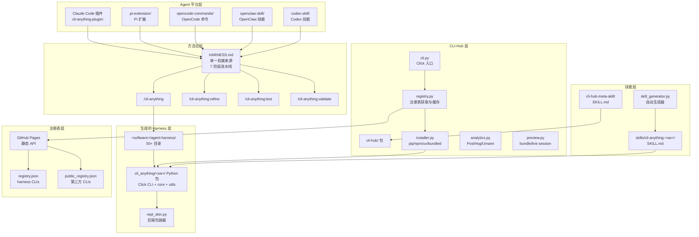
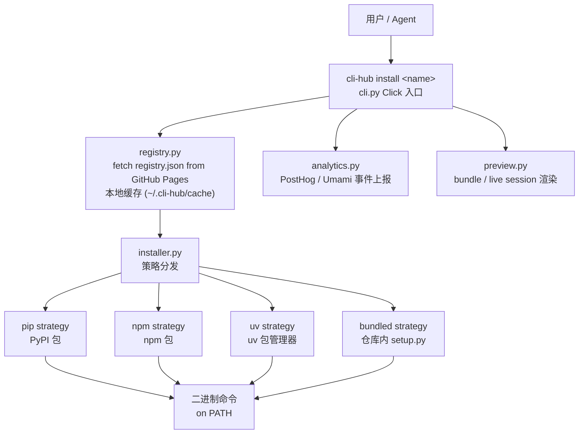
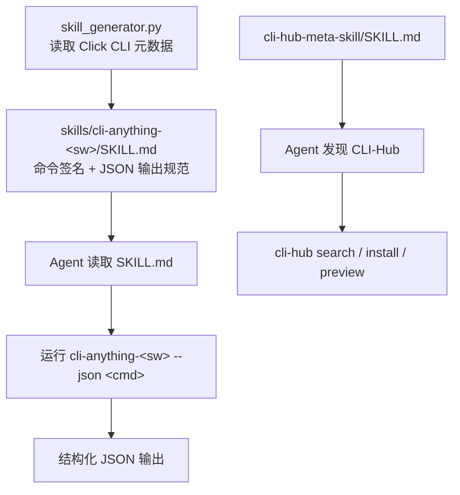
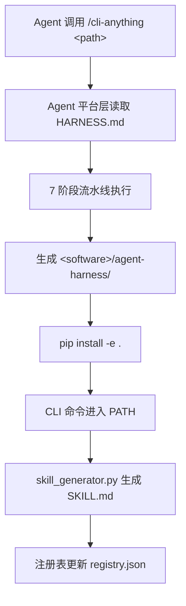
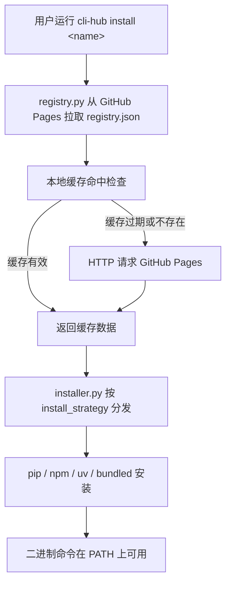
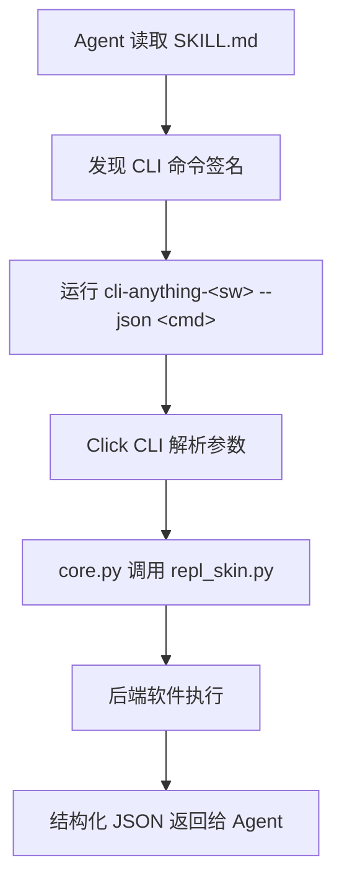
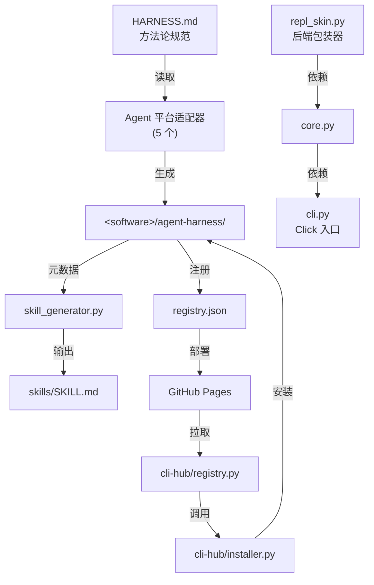

<details><summary>相关源文件</summary>

生成本页时使用的主要源文件：

- [cli-anything-plugin/HARNESS.md](../../../project-repos/CLI-Anything/cli-anything-plugin/HARNESS.md)
- [cli-hub/cli_hub/cli.py](../../../project-repos/CLI-Anything/cli-hub/cli_hub/cli.py)
- [cli-hub/cli_hub/registry.py](../../../project-repos/CLI-Anything/cli-hub/cli_hub/registry.py)
- [cli-hub/cli_hub/installer.py](../../../project-repos/CLI-Anything/cli-hub/cli_hub/installer.py)
- [cli-anything-plugin/repl_skin.py](../../../project-repos/CLI-Anything/cli-anything-plugin/repl_skin.py)
- [registry.json](../../../project-repos/CLI-Anything/registry.json)

</details>

# 系统架构

## 整体分层

CLI-Anything 的架构分为六个垂直层次，从底向上依次是：注册表层、生成的 Harness 层、方法论层、Agent 平台层、技能层和 CLI-Hub 包管理层。每一层的职责边界清晰，层间通过文件系统路径、JSON 注册表和 GitHub Pages API 解耦。



Sources: [cli-anything-plugin/HARNESS.md](../../../project-repos/CLI-Anything/cli-anything-plugin/HARNESS.md), [cli-hub/cli_hub/cli.py](../../../project-repos/CLI-Anything/cli-hub/cli_hub/cli.py), [registry.json](../../../project-repos/CLI-Anything/registry.json)

<details class="source-snippets">
<summary>引用源码</summary>

<!-- source-snippets:start -->

#### `cli-anything-plugin/HARNESS.md`

````markdown
# Agent Harness: GUI-to-CLI for Open Source Software

## Purpose

This harness provides a standard operating procedure (SOP) and toolkit for coding
agents (Claude Code, Codex, etc.) to build powerful, stateful CLI interfaces for
open-source GUI applications. The goal: let AI agents operate software that was
designed for humans, without needing a display or mouse.

## General SOP: Turning Any GUI App into an Agent-Usable CLI

### Phase 1: Codebase Analysis

1. **Identify the backend engine** — Most GUI apps separate presentation from logic.
   Find the core library/framework (e.g., MLT for Shotcut, ImageMagick for GIMP).
2. **Map GUI actions to API calls** — Every button click, drag, and menu item
   corresponds to a function call. Catalog these mappings.
3. **Identify the data model** — What file formats does it use? How is project state
   represented? (XML, JSON, binary, database?)
4. **Find existing CLI tools** — Many backends ship their own CLI (`melt`, `ffmpeg`,
   `convert`). These are building blocks.
5. **Catalog the command/undo system** — If the app has undo/redo, it likely uses a
   command pattern. These commands are your CLI operations.

### Phase 2: CLI Architecture Design

1. **Choose the interaction model**:
   - **Stateful REPL** for interactive sessions (agents that maintain context)
   - **Subcommand CLI** for one-shot operations (scripting, pipelines)
   - **Both** (recommended) — a CLI that works in both modes

2. **Define command groups** matching the app's logical domains:
   - Project management (new, open, save, close)
   - Core operations (the app's primary purpose)
   - Import/Export (file I/O, format conversion)
   - Configuration (settings, preferences, profiles)
   - Session/State management (undo, redo, history, status)

3. **Design the state model**:
   - What must persist between commands? (open project, cursor position, selection)
   - Where is state stored? (in-memory for REPL, file-based for CLI)
   - How does state serialize? (JSON session files)

4. **Plan the output format**:
   - Human-readable (tables, colors) for interactive use
   - Machine-readable (JSON) for agent consumption
   - Both, controlled by `--json` flag

### Phase 3: Implementation

1. **Start with the data layer** — XML/JSON manipulation of project files
2. **Add probe/info commands** — Let agents inspect before they modify
3. **Add mutation commands** — One command per logical operation
4. **Add the backend integration** — A `utils/<software>_backend.py` module that
   wraps the real software's CLI. This module handles:
   - Finding the software executable (`shutil.which()`)
   - Invoking it with proper arguments (`subprocess.run()`)
   - Error handling with clear install instructions if not found
   - Example (LibreOffice):
     ```python
     # utils/lo_backend.py
     def convert_odf_to(odf_path, output_format, output_path=None, overwrite=False):
         lo = find_libreoffice()  # raises RuntimeError with install instructions
         subprocess.run([lo, "--headless", "--convert-to", output_format, ...])
         return {"output": final_path, "format": output_format, "method": "libreoffice-headless"}
     ```
5. **Add rendering/export** — The export pipeline calls the backend module.
   Generate valid intermediate files, then invoke the real software for conversion.
6. **Add session management** — State persistence, undo/redo

   **Session file locking** — Use exclusive file locking for session JSON saves
   to prevent concurrent write corruption. See [`guides/session-locking.md`](guides/session-locking.md)
   for the `_locked_save_json` pattern (open `"r+"`, lock, then truncate inside the lock).
7. **Add the REPL with unified skin** — Interactive mode wrapping the subcommands.
   - Copy `repl_skin.py` from the plugin (`cli-anything-plugin/repl_skin.py`) into
     `utils/repl_skin.py` in your CLI package
   - Import and use `ReplSkin` for the REPL interface:
     ```python
     from cli_anything.<software>.utils.repl_skin import ReplSkin

     skin = ReplSkin("<software>", version="1.0.0")
     skin.print_banner()          # Branded startup box (prefers repo-root skills/, falls back to package)
     pt_session = skin.create_prompt_session()  # prompt_toolkit with history + styling
     line = skin.get_input(pt_session, project_name="my_project", modified=True)
     skin.help(commands_dict)     # Formatted help listing
     skin.success("Saved")        # ✓ green message
     skin.error("Not found")      # ✗ red message
     skin.warning("Unsaved")      # ⚠ yellow message
     skin.info("Processing...")   # ● blue message
     skin.status("Key", "value")  # Key-value status line
     skin.table(headers, rows)    # Formatted table
     skin.progress(3, 10, "...")  # Progress bar
     skin.print_goodbye()         # Styled exit message
     ```
   - ReplSkin prefers the repo-root canonical `skills/cli-anything-<software>/SKILL.md`
     when running inside this monorepo, and falls back to the packaged
     `cli_anything/<software>/skills/SKILL.md` copy when installed elsewhere.
     AI agents can read the skill file at the displayed absolute path.
   - Make REPL the default behavior: use `invoke_without_command=True` on the main
     Click group, and invoke the `repl` command when no subcommand is given:
     ```python
     @click.group(invoke_without_command=True)
     @click.pass_context
     def cli(ctx, ...):
         ...
         if ctx.invoked_subcommand is None:
             ctx.invoke(repl, project_path=None)
     ```
   - This ensures `cli-anything-<software>` with no arguments enters the REPL

### Phase 4: Test Planning (TEST.md - Part 1)

**BEFORE writing any test code**, create a `TEST.md` file in the
`agent-harness/cli_anything/<software>/tests/` directory. This file serves as your test plan and
MUST contain:

1. **Test Inventory Plan** — List planned test files and estimated test counts:
   - `test_core.py`: XX unit tests planned
   - `test_full_e2e.py`: XX E2E tests planned

````

#### `cli-hub/cli_hub/cli.py`

```python
"""cli-hub — CLI entry point."""

import os
import shutil
import sys
import json as json_mod
from pathlib import Path

import click

from cli_hub import __version__
from cli_hub.registry import fetch_all_clis, get_cli, search_clis, list_categories
from cli_hub.installer import install_cli, uninstall_cli, get_installed, update_cli
from cli_hub.analytics import (
    detect_invocation_context,
    track_first_run,
    track_install,
    track_launch,
    track_uninstall,
    track_visit,
)
from cli_hub.preview import (
    inspect_bundle,
    inspect_session,
    is_live_session_ref,
    load_session,
    open_in_browser,
    render_html,
    render_inspect_text,
    render_live_html,
    render_session_text,
    start_static_server,
)


def _invocation_command(ctx, version):
    """Return a compact label for the current invocation."""
    argv = sys.argv[1:]
    if version:
        return "--version"
    if ctx.invoked_subcommand:
        return ctx.invoked_subcommand
    if any(arg in ("--help", "-h") for arg in argv):
        return "--help"
    if argv:
        return argv[0]
    return "root"


@click.group(invoke_without_command=True)
@click.option("--version", is_flag=True, help="Show version.")
@click.pass_context
def main(ctx, version):
    """cli-hub — Download and manage CLI-Anything harnesses and public CLIs."""
    track_first_run()
    track_visit(command=_invocation_command(ctx, version), detection=detect_invocation_context())
    if version:
        click.echo(f"cli-hub {__version__}")
        return
    if ctx.invoked_subcommand is None:
        click.echo(ctx.get_help())


def _source_tag(cli):
    """Return a styled source indicator for display."""
    source = cli.get("_source", "harness")
    if source == "public":
        manager = cli.get("package_manager") or cli.get("install_strategy") or "public"
        return click.style(f" {manager}", fg="yellow")
    return ""


@main.command()
@click.argument("name")
def install(name):
    """Install a CLI by name."""
    click.echo(f"Installing {name}...")
    success, msg = install_cli(name)
    if success:
        cli = get_cli(name)
        track_install(name, cli["version"] if cli else "unknown")
        click.secho(f"✓ {msg}", fg="green")
        if cli:
            click.echo(f"  Run it with: {cli['entry_point']}")
            click.echo(f"  Or launch:   cli-hub launch {cli['name']}")
            if cli.get("_source") == "public" and cli.get("npx_cmd"):
                click.echo(f"  Or use npx:  {cli['npx_cmd']}")
    else:
        click.secho(f"✗ {msg}", fg="red", err=True)
        raise SystemExit(1)


@main.command()
@click.argument("name")
def uninstall(name):
    """Uninstall a CLI by name."""
    success, msg = uninstall_cli(name)
    if success:
        track_uninstall(name)
        click.secho(f"✓ {msg}", fg="green")
    else:
        click.secho(f"✗ {msg}", fg="red", err=True)
        raise SystemExit(1)


@main.command()
@click.argument("name")
def update(name):
    """Update a CLI to the latest version."""
    click.echo(f"Updating {name}...")
    success, msg = update_cli(name)
    if success:
        cli = get_cli(name)
        track_install(name, cli["version"] if cli else "unknown")
        click.secho(f"✓ {msg}", fg="green")
    else:
        click.secho(f"✗ {msg}", fg="red", err=True)
        raise SystemExit(1)


```

#### `registry.json`

```json
{
  "meta": {
    "repo": "https://github.com/HKUDS/CLI-Anything",
    "description": "CLI-Hub — Agent-native stateful CLI interfaces for softwares, codebases, and Web Services",
    "updated": "2026-04-16"
  },
  "clis": [
    {
      "name": "wiremock",
      "display_name": "WireMock",
      "version": "0.1.0",
      "description": "HTTP mock server management — create stubs, inspect requests, record traffic, and manage scenarios via WireMock REST API",
      "requires": "WireMock server running (java -jar wiremock-standalone.jar)",
      "homepage": "https://wiremock.org",
      "source_url": null,
      "install_cmd": "pip install git+https://github.com/HKUDS/CLI-Anything.git#subdirectory=wiremock/agent-harness",
      "entry_point": "cli-anything-wiremock",
      "skill_md": "skills/cli-anything-wiremock/SKILL.md",
      "category": "testing",
      "contributors": [
        {
          "name": "fabiomantel",
          "url": "https://github.com/fabiomantel"
        }
      ]
    },
    {
      "name": "anygen",
      "display_name": "AnyGen",
      "version": "1.0.0",
      "description": "Generate docs, slides, websites and more via AnyGen cloud API",
      "requires": "ANYGEN_API_KEY",
      "homepage": "https://anygen.com",
      "source_url": null,
      "install_cmd": "pip install git+https://github.com/HKUDS/CLI-Anything.git#subdirectory=anygen/agent-harness",
      "entry_point": "cli-anything-anygen",
      "skill_md": "skills/cli-anything-anygen/SKILL.md",
      "category": "generation",
      "contributors": [
        {
          "name": "koltyu-anygen",
          "url": "https://github.com/koltyu-anygen"
        }
      ]
    },
    {
      "name": "adguardhome",
      "display_name": "AdGuardHome",
      "version": "1.0.0",
      "description": "DNS ad-blocking and network infrastructure management via AdGuardHome REST API",
      "requires": "AdGuardHome instance running",
      "homepage": "https://adguard.com/adguard-home/overview.html",
      "source_url": null,
      "install_cmd": "pip install git+https://github.com/HKUDS/CLI-Anything.git#subdirectory=adguardhome/agent-harness",
      "entry_point": "cli-anything-adguardhome",
      "skill_md": null,
      "category": "network",
      "contributors": [
        {
          "name": "pyxl-dev",
          "url": "https://github.com/pyxl-dev"
        }
      ]
    },
    {
      "name": "audacity",
      "display_name": "Audacity",
      "version": "1.0.0",
      "description": "Audio editing and processing via sox",
      "requires": "sox (apt install sox)",
      "homepage": "https://www.audacityteam.org",
      "source_url": null,
      "install_cmd": "pip install git+https://github.com/HKUDS/CLI-Anything.git#subdirectory=audacity/agent-harness",
      "entry_point": "cli-anything-audacity",
      "skill_md": "skills/cli-anything-audacity/SKILL.md",
      "category": "audio",
      "contributors": [
        {
          "name": "CLI-Anything-Team",
          "url": "https://github.com/HKUDS/CLI-Anything"
        }
      ]
    },
    {
      "name": "blender",
      "display_name": "Blender",
      "version": "1.0.0",
      "description": "3D modeling, animation, and rendering via blender --background --python",
      "requires": "blender >= 4.2",
      "homepage": "https://www.blender.org",
      "source_url": null,
      "install_cmd": "pip install git+https://github.com/HKUDS/CLI-Anything.git#subdirectory=blender/agent-harness",
      "entry_point": "cli-anything-blender",
      "skill_md": "skills/cli-anything-blender/SKILL.md",
      "category": "3d",
      "contributors": [
        {
          "name": "CLI-Anything-Team",
          "url": "https://github.com/HKUDS/CLI-Anything"
        }
      ]
    },
    {
      "name": "browser",
      "display_name": "Browser",
      "version": "1.0.0",
      "description": "Browser automation via DOMShell MCP server. Maps Chrome's Accessibility Tree to a virtual filesystem for agent-native navigation.",
      "requires": "Node.js, npx, Chrome + DOMShell extension",
      "homepage": "https://github.com/apireno/DOMShell",
      "source_url": null,
      "install_cmd": "pip install git+https://github.com/HKUDS/CLI-Anything.git#subdirectory=browser/agent-harness",
      "entry_point": "cli-anything-browser",
      "skill_md": "skills/cli-anything-browser/SKILL.md",
      "category": "web",
      "contributors": [
        {
          "name": "furkankoykiran",
          "url": "https://github.com/furkankoykiran"
        }
      ]
```

<!-- source-snippets:end -->
</details>
## Agent 平台层

Agent 平台层是所有 AI Agent 触达 CLI-Anything 方法论的入口。五个平台适配器都读取同一份 `HARNESS.md`，确保行为一致。

| 平台适配器 | 路径 | 接入方式 |
|---|---|---|
| Claude Code 插件 | `cli-anything-plugin/` | `.claude/commands/` 注册斜杠命令 |
| Pi 扩展 | `.pi-extension/` | Pi agent 原生扩展协议 |
| OpenCode 命令 | `opencode-commands/` | OpenCode 命令定义目录 |
| OpenClaw 技能 | `openclaw-skill/SKILL.md` | OpenClaw SKILL 描述文件 |
| Codex 技能 | `codex-skill/SKILL.md` | Codex 技能描述文件 |

每个适配器只是一个薄封装层，核心逻辑不在适配器内 — 所有阶段定义、质量门控和验收标准全部在 `HARNESS.md` 中规范，适配器负责把 HARNESS.md 中的指令传递给对应的 Agent 运行时。  
Sources: [cli-anything-plugin/HARNESS.md](../../../project-repos/CLI-Anything/cli-anything-plugin/HARNESS.md)

<details class="source-snippets">
<summary>引用源码</summary>

<!-- source-snippets:start -->

#### `cli-anything-plugin/HARNESS.md`

````markdown
# Agent Harness: GUI-to-CLI for Open Source Software

## Purpose

This harness provides a standard operating procedure (SOP) and toolkit for coding
agents (Claude Code, Codex, etc.) to build powerful, stateful CLI interfaces for
open-source GUI applications. The goal: let AI agents operate software that was
designed for humans, without needing a display or mouse.

## General SOP: Turning Any GUI App into an Agent-Usable CLI

### Phase 1: Codebase Analysis

1. **Identify the backend engine** — Most GUI apps separate presentation from logic.
   Find the core library/framework (e.g., MLT for Shotcut, ImageMagick for GIMP).
2. **Map GUI actions to API calls** — Every button click, drag, and menu item
   corresponds to a function call. Catalog these mappings.
3. **Identify the data model** — What file formats does it use? How is project state
   represented? (XML, JSON, binary, database?)
4. **Find existing CLI tools** — Many backends ship their own CLI (`melt`, `ffmpeg`,
   `convert`). These are building blocks.
5. **Catalog the command/undo system** — If the app has undo/redo, it likely uses a
   command pattern. These commands are your CLI operations.

### Phase 2: CLI Architecture Design

1. **Choose the interaction model**:
   - **Stateful REPL** for interactive sessions (agents that maintain context)
   - **Subcommand CLI** for one-shot operations (scripting, pipelines)
   - **Both** (recommended) — a CLI that works in both modes

2. **Define command groups** matching the app's logical domains:
   - Project management (new, open, save, close)
   - Core operations (the app's primary purpose)
   - Import/Export (file I/O, format conversion)
   - Configuration (settings, preferences, profiles)
   - Session/State management (undo, redo, history, status)

3. **Design the state model**:
   - What must persist between commands? (open project, cursor position, selection)
   - Where is state stored? (in-memory for REPL, file-based for CLI)
   - How does state serialize? (JSON session files)

4. **Plan the output format**:
   - Human-readable (tables, colors) for interactive use
   - Machine-readable (JSON) for agent consumption
   - Both, controlled by `--json` flag

### Phase 3: Implementation

1. **Start with the data layer** — XML/JSON manipulation of project files
2. **Add probe/info commands** — Let agents inspect before they modify
3. **Add mutation commands** — One command per logical operation
4. **Add the backend integration** — A `utils/<software>_backend.py` module that
   wraps the real software's CLI. This module handles:
   - Finding the software executable (`shutil.which()`)
   - Invoking it with proper arguments (`subprocess.run()`)
   - Error handling with clear install instructions if not found
   - Example (LibreOffice):
     ```python
     # utils/lo_backend.py
     def convert_odf_to(odf_path, output_format, output_path=None, overwrite=False):
         lo = find_libreoffice()  # raises RuntimeError with install instructions
         subprocess.run([lo, "--headless", "--convert-to", output_format, ...])
         return {"output": final_path, "format": output_format, "method": "libreoffice-headless"}
     ```
5. **Add rendering/export** — The export pipeline calls the backend module.
   Generate valid intermediate files, then invoke the real software for conversion.
6. **Add session management** — State persistence, undo/redo

   **Session file locking** — Use exclusive file locking for session JSON saves
   to prevent concurrent write corruption. See [`guides/session-locking.md`](guides/session-locking.md)
   for the `_locked_save_json` pattern (open `"r+"`, lock, then truncate inside the lock).
7. **Add the REPL with unified skin** — Interactive mode wrapping the subcommands.
   - Copy `repl_skin.py` from the plugin (`cli-anything-plugin/repl_skin.py`) into
     `utils/repl_skin.py` in your CLI package
   - Import and use `ReplSkin` for the REPL interface:
     ```python
     from cli_anything.<software>.utils.repl_skin import ReplSkin

     skin = ReplSkin("<software>", version="1.0.0")
     skin.print_banner()          # Branded startup box (prefers repo-root skills/, falls back to package)
     pt_session = skin.create_prompt_session()  # prompt_toolkit with history + styling
     line = skin.get_input(pt_session, project_name="my_project", modified=True)
     skin.help(commands_dict)     # Formatted help listing
     skin.success("Saved")        # ✓ green message
     skin.error("Not found")      # ✗ red message
     skin.warning("Unsaved")      # ⚠ yellow message
     skin.info("Processing...")   # ● blue message
     skin.status("Key", "value")  # Key-value status line
     skin.table(headers, rows)    # Formatted table
     skin.progress(3, 10, "...")  # Progress bar
     skin.print_goodbye()         # Styled exit message
     ```
   - ReplSkin prefers the repo-root canonical `skills/cli-anything-<software>/SKILL.md`
     when running inside this monorepo, and falls back to the packaged
     `cli_anything/<software>/skills/SKILL.md` copy when installed elsewhere.
     AI agents can read the skill file at the displayed absolute path.
   - Make REPL the default behavior: use `invoke_without_command=True` on the main
     Click group, and invoke the `repl` command when no subcommand is given:
     ```python
     @click.group(invoke_without_command=True)
     @click.pass_context
     def cli(ctx, ...):
         ...
         if ctx.invoked_subcommand is None:
             ctx.invoke(repl, project_path=None)
     ```
   - This ensures `cli-anything-<software>` with no arguments enters the REPL

### Phase 4: Test Planning (TEST.md - Part 1)

**BEFORE writing any test code**, create a `TEST.md` file in the
`agent-harness/cli_anything/<software>/tests/` directory. This file serves as your test plan and
MUST contain:

1. **Test Inventory Plan** — List planned test files and estimated test counts:
   - `test_core.py`: XX unit tests planned
   - `test_full_e2e.py`: XX E2E tests planned

````

<!-- source-snippets:end -->
</details>
## 方法论层

`HARNESS.md` 是整个项目的单一权威来源（Single Source of Truth），定义了七个串行阶段的 CLI 生成方法论。四条命令从不同角度触发这个方法论：

| 命令 | 触发时机 | 职责 |
|---|---|---|
| `/cli-anything <path>` | 新 harness 首次生成 | 执行全部 7 个阶段 |
| `/cli-anything:refine` | 命令覆盖率不足或质量问题 | 重新执行分析与扩展阶段 |
| `/cli-anything:test` | 需要补充测试 | 聚焦测试生成与修复 |
| `/cli-anything:validate` | PR/CI 质量门控 | 校验包结构与测试通过率 |

七个阶段的完整定义见 [七阶段生成流水线](seven-phase-pipeline.md)。  
Sources: [cli-anything-plugin/HARNESS.md](../../../project-repos/CLI-Anything/cli-anything-plugin/HARNESS.md)

<details class="source-snippets">
<summary>引用源码</summary>

<!-- source-snippets:start -->

#### `cli-anything-plugin/HARNESS.md`

````markdown
# Agent Harness: GUI-to-CLI for Open Source Software

## Purpose

This harness provides a standard operating procedure (SOP) and toolkit for coding
agents (Claude Code, Codex, etc.) to build powerful, stateful CLI interfaces for
open-source GUI applications. The goal: let AI agents operate software that was
designed for humans, without needing a display or mouse.

## General SOP: Turning Any GUI App into an Agent-Usable CLI

### Phase 1: Codebase Analysis

1. **Identify the backend engine** — Most GUI apps separate presentation from logic.
   Find the core library/framework (e.g., MLT for Shotcut, ImageMagick for GIMP).
2. **Map GUI actions to API calls** — Every button click, drag, and menu item
   corresponds to a function call. Catalog these mappings.
3. **Identify the data model** — What file formats does it use? How is project state
   represented? (XML, JSON, binary, database?)
4. **Find existing CLI tools** — Many backends ship their own CLI (`melt`, `ffmpeg`,
   `convert`). These are building blocks.
5. **Catalog the command/undo system** — If the app has undo/redo, it likely uses a
   command pattern. These commands are your CLI operations.

### Phase 2: CLI Architecture Design

1. **Choose the interaction model**:
   - **Stateful REPL** for interactive sessions (agents that maintain context)
   - **Subcommand CLI** for one-shot operations (scripting, pipelines)
   - **Both** (recommended) — a CLI that works in both modes

2. **Define command groups** matching the app's logical domains:
   - Project management (new, open, save, close)
   - Core operations (the app's primary purpose)
   - Import/Export (file I/O, format conversion)
   - Configuration (settings, preferences, profiles)
   - Session/State management (undo, redo, history, status)

3. **Design the state model**:
   - What must persist between commands? (open project, cursor position, selection)
   - Where is state stored? (in-memory for REPL, file-based for CLI)
   - How does state serialize? (JSON session files)

4. **Plan the output format**:
   - Human-readable (tables, colors) for interactive use
   - Machine-readable (JSON) for agent consumption
   - Both, controlled by `--json` flag

### Phase 3: Implementation

1. **Start with the data layer** — XML/JSON manipulation of project files
2. **Add probe/info commands** — Let agents inspect before they modify
3. **Add mutation commands** — One command per logical operation
4. **Add the backend integration** — A `utils/<software>_backend.py` module that
   wraps the real software's CLI. This module handles:
   - Finding the software executable (`shutil.which()`)
   - Invoking it with proper arguments (`subprocess.run()`)
   - Error handling with clear install instructions if not found
   - Example (LibreOffice):
     ```python
     # utils/lo_backend.py
     def convert_odf_to(odf_path, output_format, output_path=None, overwrite=False):
         lo = find_libreoffice()  # raises RuntimeError with install instructions
         subprocess.run([lo, "--headless", "--convert-to", output_format, ...])
         return {"output": final_path, "format": output_format, "method": "libreoffice-headless"}
     ```
5. **Add rendering/export** — The export pipeline calls the backend module.
   Generate valid intermediate files, then invoke the real software for conversion.
6. **Add session management** — State persistence, undo/redo

   **Session file locking** — Use exclusive file locking for session JSON saves
   to prevent concurrent write corruption. See [`guides/session-locking.md`](guides/session-locking.md)
   for the `_locked_save_json` pattern (open `"r+"`, lock, then truncate inside the lock).
7. **Add the REPL with unified skin** — Interactive mode wrapping the subcommands.
   - Copy `repl_skin.py` from the plugin (`cli-anything-plugin/repl_skin.py`) into
     `utils/repl_skin.py` in your CLI package
   - Import and use `ReplSkin` for the REPL interface:
     ```python
     from cli_anything.<software>.utils.repl_skin import ReplSkin

     skin = ReplSkin("<software>", version="1.0.0")
     skin.print_banner()          # Branded startup box (prefers repo-root skills/, falls back to package)
     pt_session = skin.create_prompt_session()  # prompt_toolkit with history + styling
     line = skin.get_input(pt_session, project_name="my_project", modified=True)
     skin.help(commands_dict)     # Formatted help listing
     skin.success("Saved")        # ✓ green message
     skin.error("Not found")      # ✗ red message
     skin.warning("Unsaved")      # ⚠ yellow message
     skin.info("Processing...")   # ● blue message
     skin.status("Key", "value")  # Key-value status line
     skin.table(headers, rows)    # Formatted table
     skin.progress(3, 10, "...")  # Progress bar
     skin.print_goodbye()         # Styled exit message
     ```
   - ReplSkin prefers the repo-root canonical `skills/cli-anything-<software>/SKILL.md`
     when running inside this monorepo, and falls back to the packaged
     `cli_anything/<software>/skills/SKILL.md` copy when installed elsewhere.
     AI agents can read the skill file at the displayed absolute path.
   - Make REPL the default behavior: use `invoke_without_command=True` on the main
     Click group, and invoke the `repl` command when no subcommand is given:
     ```python
     @click.group(invoke_without_command=True)
     @click.pass_context
     def cli(ctx, ...):
         ...
         if ctx.invoked_subcommand is None:
             ctx.invoke(repl, project_path=None)
     ```
   - This ensures `cli-anything-<software>` with no arguments enters the REPL

### Phase 4: Test Planning (TEST.md - Part 1)

**BEFORE writing any test code**, create a `TEST.md` file in the
`agent-harness/cli_anything/<software>/tests/` directory. This file serves as your test plan and
MUST contain:

1. **Test Inventory Plan** — List planned test files and estimated test counts:
   - `test_core.py`: XX unit tests planned
   - `test_full_e2e.py`: XX E2E tests planned

````

<!-- source-snippets:end -->
</details>
## 生成的 Harness 层

每次成功运行 `/cli-anything <path>` 都会在对应软件目录下生成一个 `agent-harness/` 子目录，形成标准化的 Python 包结构：

```
<software>/agent-harness/
├── cli_anything/<software>/
│   ├── __init__.py
│   ├── cli.py          # Click CLI 入口，所有子命令注册于此
│   ├── core.py         # 核心功能模块
│   ├── utils.py        # 工具函数（含 repl_skin.py 后端包装）
│   └── tests/
│       ├── test_core.py
│       └── test_cli.py
├── setup.py            # pip install -e . 入口
└── <SOFTWARE>.md       # 架构文档与 SOP
```

`repl_skin.py` 是后端包装器的关键实现：它把原始软件的 REPL 或 API 接口包装成统一的 Python 可调用界面，让上层 Click CLI 不需要关心底层软件的通信协议差异。  
Sources: [cli-anything-plugin/HARNESS.md](../../../project-repos/CLI-Anything/cli-anything-plugin/HARNESS.md), [cli-anything-plugin/repl_skin.py](../../../project-repos/CLI-Anything/cli-anything-plugin/repl_skin.py)

<details class="source-snippets">
<summary>引用源码</summary>

<!-- source-snippets:start -->

#### `cli-anything-plugin/HARNESS.md`

````markdown
# Agent Harness: GUI-to-CLI for Open Source Software

## Purpose

This harness provides a standard operating procedure (SOP) and toolkit for coding
agents (Claude Code, Codex, etc.) to build powerful, stateful CLI interfaces for
open-source GUI applications. The goal: let AI agents operate software that was
designed for humans, without needing a display or mouse.

## General SOP: Turning Any GUI App into an Agent-Usable CLI

### Phase 1: Codebase Analysis

1. **Identify the backend engine** — Most GUI apps separate presentation from logic.
   Find the core library/framework (e.g., MLT for Shotcut, ImageMagick for GIMP).
2. **Map GUI actions to API calls** — Every button click, drag, and menu item
   corresponds to a function call. Catalog these mappings.
3. **Identify the data model** — What file formats does it use? How is project state
   represented? (XML, JSON, binary, database?)
4. **Find existing CLI tools** — Many backends ship their own CLI (`melt`, `ffmpeg`,
   `convert`). These are building blocks.
5. **Catalog the command/undo system** — If the app has undo/redo, it likely uses a
   command pattern. These commands are your CLI operations.

### Phase 2: CLI Architecture Design

1. **Choose the interaction model**:
   - **Stateful REPL** for interactive sessions (agents that maintain context)
   - **Subcommand CLI** for one-shot operations (scripting, pipelines)
   - **Both** (recommended) — a CLI that works in both modes

2. **Define command groups** matching the app's logical domains:
   - Project management (new, open, save, close)
   - Core operations (the app's primary purpose)
   - Import/Export (file I/O, format conversion)
   - Configuration (settings, preferences, profiles)
   - Session/State management (undo, redo, history, status)

3. **Design the state model**:
   - What must persist between commands? (open project, cursor position, selection)
   - Where is state stored? (in-memory for REPL, file-based for CLI)
   - How does state serialize? (JSON session files)

4. **Plan the output format**:
   - Human-readable (tables, colors) for interactive use
   - Machine-readable (JSON) for agent consumption
   - Both, controlled by `--json` flag

### Phase 3: Implementation

1. **Start with the data layer** — XML/JSON manipulation of project files
2. **Add probe/info commands** — Let agents inspect before they modify
3. **Add mutation commands** — One command per logical operation
4. **Add the backend integration** — A `utils/<software>_backend.py` module that
   wraps the real software's CLI. This module handles:
   - Finding the software executable (`shutil.which()`)
   - Invoking it with proper arguments (`subprocess.run()`)
   - Error handling with clear install instructions if not found
   - Example (LibreOffice):
     ```python
     # utils/lo_backend.py
     def convert_odf_to(odf_path, output_format, output_path=None, overwrite=False):
         lo = find_libreoffice()  # raises RuntimeError with install instructions
         subprocess.run([lo, "--headless", "--convert-to", output_format, ...])
         return {"output": final_path, "format": output_format, "method": "libreoffice-headless"}
     ```
5. **Add rendering/export** — The export pipeline calls the backend module.
   Generate valid intermediate files, then invoke the real software for conversion.
6. **Add session management** — State persistence, undo/redo

   **Session file locking** — Use exclusive file locking for session JSON saves
   to prevent concurrent write corruption. See [`guides/session-locking.md`](guides/session-locking.md)
   for the `_locked_save_json` pattern (open `"r+"`, lock, then truncate inside the lock).
7. **Add the REPL with unified skin** — Interactive mode wrapping the subcommands.
   - Copy `repl_skin.py` from the plugin (`cli-anything-plugin/repl_skin.py`) into
     `utils/repl_skin.py` in your CLI package
   - Import and use `ReplSkin` for the REPL interface:
     ```python
     from cli_anything.<software>.utils.repl_skin import ReplSkin

     skin = ReplSkin("<software>", version="1.0.0")
     skin.print_banner()          # Branded startup box (prefers repo-root skills/, falls back to package)
     pt_session = skin.create_prompt_session()  # prompt_toolkit with history + styling
     line = skin.get_input(pt_session, project_name="my_project", modified=True)
     skin.help(commands_dict)     # Formatted help listing
     skin.success("Saved")        # ✓ green message
     skin.error("Not found")      # ✗ red message
     skin.warning("Unsaved")      # ⚠ yellow message
     skin.info("Processing...")   # ● blue message
     skin.status("Key", "value")  # Key-value status line
     skin.table(headers, rows)    # Formatted table
     skin.progress(3, 10, "...")  # Progress bar
     skin.print_goodbye()         # Styled exit message
     ```
   - ReplSkin prefers the repo-root canonical `skills/cli-anything-<software>/SKILL.md`
     when running inside this monorepo, and falls back to the packaged
     `cli_anything/<software>/skills/SKILL.md` copy when installed elsewhere.
     AI agents can read the skill file at the displayed absolute path.
   - Make REPL the default behavior: use `invoke_without_command=True` on the main
     Click group, and invoke the `repl` command when no subcommand is given:
     ```python
     @click.group(invoke_without_command=True)
     @click.pass_context
     def cli(ctx, ...):
         ...
         if ctx.invoked_subcommand is None:
             ctx.invoke(repl, project_path=None)
     ```
   - This ensures `cli-anything-<software>` with no arguments enters the REPL

### Phase 4: Test Planning (TEST.md - Part 1)

**BEFORE writing any test code**, create a `TEST.md` file in the
`agent-harness/cli_anything/<software>/tests/` directory. This file serves as your test plan and
MUST contain:

1. **Test Inventory Plan** — List planned test files and estimated test counts:
   - `test_core.py`: XX unit tests planned
   - `test_full_e2e.py`: XX E2E tests planned

````

#### `cli-anything-plugin/repl_skin.py`

```python
"""cli-anything REPL Skin — Unified terminal interface for all CLI harnesses.

Copy this file into your CLI package at:
    cli_anything/<software>/utils/repl_skin.py

Usage:
    from cli_anything.<software>.utils.repl_skin import ReplSkin

    skin = ReplSkin("shotcut", version="1.0.0")
    skin.print_banner()  # auto-detects repo-root or packaged SKILL.md
    prompt_text = skin.prompt(project_name="my_video.mlt", modified=True)
    skin.success("Project saved")
    skin.error("File not found")
    skin.warning("Unsaved changes")
    skin.info("Processing 24 clips...")
    skin.status("Track 1", "3 clips, 00:02:30")
    skin.table(headers, rows)
    skin.print_goodbye()
"""

import os
import sys
from pathlib import Path

# ── ANSI color codes (no external deps for core styling) ──────────────

_RESET = "\033[0m"
_BOLD = "\033[1m"
_DIM = "\033[2m"
_ITALIC = "\033[3m"
_UNDERLINE = "\033[4m"

# Brand colors
_CYAN = "\033[38;5;80m"       # cli-anything brand cyan
_CYAN_BG = "\033[48;5;80m"
_WHITE = "\033[97m"
_GRAY = "\033[38;5;245m"
_DARK_GRAY = "\033[38;5;240m"
_LIGHT_GRAY = "\033[38;5;250m"

# Software accent colors — each software gets a unique accent
_ACCENT_COLORS = {
    "gimp":        "\033[38;5;214m",   # warm orange
    "blender":     "\033[38;5;208m",   # deep orange
    "inkscape":    "\033[38;5;39m",    # bright blue
    "audacity":    "\033[38;5;33m",    # navy blue
    "libreoffice": "\033[38;5;40m",    # green
    "obs_studio":  "\033[38;5;55m",    # purple
    "kdenlive":    "\033[38;5;69m",    # slate blue
    "shotcut":     "\033[38;5;35m",    # teal green
}
_DEFAULT_ACCENT = "\033[38;5;75m"      # default sky blue

# Status colors
_GREEN = "\033[38;5;78m"
_YELLOW = "\033[38;5;220m"
_RED = "\033[38;5;196m"
_BLUE = "\033[38;5;75m"
_MAGENTA = "\033[38;5;176m"

_SKILL_SOURCE_REPO = os.environ.get("CLI_ANYTHING_SKILL_REPO", "HKUDS/CLI-Anything")

# ── Brand icon ────────────────────────────────────────────────────────

# The cli-anything icon: a small colored diamond/chevron mark
_ICON = f"{_CYAN}{_BOLD}◆{_RESET}"
_ICON_SMALL = f"{_CYAN}▸{_RESET}"

# ── Box drawing characters ────────────────────────────────────────────

_H_LINE = "─"
_V_LINE = "│"
_TL = "╭"
_TR = "╮"
_BL = "╰"
_BR = "╯"
_T_DOWN = "┬"
_T_UP = "┴"
_T_RIGHT = "├"
_T_LEFT = "┤"
_CROSS = "┼"


def _strip_ansi(text: str) -> str:
    """Remove ANSI escape codes for length calculation."""
    import re
    return re.sub(r"\033\[[^m]*m", "", text)


def _visible_len(text: str) -> int:
    """Get visible length of text (excluding ANSI codes)."""
    return len(_strip_ansi(text))


def _display_home_path(path: str) -> str:
    """Display a path relative to the home directory when possible."""
    expanded = Path(path).expanduser().resolve()
    home = Path.home().resolve()
    try:
        relative = expanded.relative_to(home)
        return f"~/{relative.as_posix()}"
    except ValueError:
        return str(expanded)


class ReplSkin:
    """Unified REPL skin for cli-anything CLIs.

    Provides consistent branding, prompts, and message formatting
    across all CLI harnesses built with the cli-anything methodology.
    """

    def __init__(self, software: str, version: str = "1.0.0",
                 history_file: str | None = None, skill_path: str | None = None):
        """Initialize the REPL skin.

        Args:
            software: Software name (e.g., "gimp", "shotcut", "blender").
            version: CLI version string.
            history_file: Path for persistent command history.
```

<!-- source-snippets:end -->
</details>
## CLI-Hub 层

CLI-Hub 是面向最终用户和 Agent 的包管理器，负责从注册表发现、安装和预览各种 CLI harness。



`registry.py` 从 GitHub Pages 拉取 `registry.json` 和 `public_registry.json`，并在本地做时间戳缓存，避免每次都发起网络请求。`installer.py` 根据注册表条目中的 `install_strategy` 字段选择安装路径，支持 `pip`、`npm`、`uv` 和 `bundled` 四种策略。  
Sources: [cli-hub/cli_hub/registry.py](../../../project-repos/CLI-Anything/cli-hub/cli_hub/registry.py), [cli-hub/cli_hub/installer.py](../../../project-repos/CLI-Anything/cli-hub/cli_hub/installer.py), [cli-hub/cli_hub/cli.py](../../../project-repos/CLI-Anything/cli-hub/cli_hub/cli.py)

<details class="source-snippets">
<summary>引用源码</summary>

<!-- source-snippets:start -->

#### `cli-hub/cli_hub/registry.py`

```python
"""Fetch, cache, and merge the CLI-Anything registries (harness + public)."""

import json
import time
from pathlib import Path

import requests

REGISTRY_URL = "https://hkuds.github.io/CLI-Anything/registry.json"
PUBLIC_REGISTRY_URL = "https://hkuds.github.io/CLI-Anything/public_registry.json"
CACHE_DIR = Path.home() / ".cli-hub"
CACHE_FILE = CACHE_DIR / "registry_cache.json"
PUBLIC_CACHE_FILE = CACHE_DIR / "public_registry_cache.json"
CACHE_TTL = 3600  # 1 hour


def _ensure_cache_dir():
    CACHE_DIR.mkdir(parents=True, exist_ok=True)


def _load_cached_data(cache_file):
    """Return cached registry data if the cache file is valid."""
    if not cache_file.exists():
        return None
    try:
        cached = json.loads(cache_file.read_text())
        return cached["data"]
    except (json.JSONDecodeError, KeyError):
        return None


def _fetch_json(url, cache_file, force_refresh=False):
    """Fetch a JSON URL with local file caching."""
    _ensure_cache_dir()

    if not force_refresh and cache_file.exists():
        try:
            cached = json.loads(cache_file.read_text())
            if time.time() - cached.get("_cached_at", 0) < CACHE_TTL:
                return cached["data"]
        except (json.JSONDecodeError, KeyError):
            pass

    try:
        resp = requests.get(url, timeout=15)
        resp.raise_for_status()
        data = resp.json()
    except (requests.RequestException, ValueError):
        cached_data = _load_cached_data(cache_file)
        if cached_data is not None:
            return cached_data
        raise

    cache_payload = {"_cached_at": time.time(), "data": data}
    cache_file.write_text(json.dumps(cache_payload, indent=2))

    return data


def fetch_registry(force_refresh=False):
    """Fetch the harness registry.json."""
    return _fetch_json(REGISTRY_URL, CACHE_FILE, force_refresh)


def fetch_public_registry(force_refresh=False):
    """Fetch the public CLI registry. Returns None on failure."""
    try:
        return _fetch_json(PUBLIC_REGISTRY_URL, PUBLIC_CACHE_FILE, force_refresh)
    except Exception:
        return None


def fetch_all_clis(force_refresh=False):
    """Fetch and merge both registries. Each CLI is tagged with _source."""
    registry = fetch_registry(force_refresh)
    all_clis = []

    for cli in registry["clis"]:
        cli["_source"] = "harness"
        all_clis.append(cli)

    public = fetch_public_registry(force_refresh)
    if public:
        for cli in public["clis"]:
            cli["_source"] = "public"
            all_clis.append(cli)

    return all_clis


def get_cli(name, force_refresh=False):
    """Look up a CLI entry by name (case-insensitive) across both registries."""
    name_lower = name.lower()
    for cli in fetch_all_clis(force_refresh):
        if cli["name"].lower() == name_lower:
            return cli
    return None


def search_clis(query, force_refresh=False):
    """Search CLIs by name, description, or category across both registries."""
    query_lower = query.lower()
    results = []
    for cli in fetch_all_clis(force_refresh):
        if (query_lower in cli["name"].lower()
                or query_lower in cli["description"].lower()
                or query_lower in cli.get("category", "").lower()
                or query_lower in cli.get("display_name", "").lower()):
            results.append(cli)
    return results


def list_categories(force_refresh=False):
    """Return sorted list of unique categories across both registries."""
    return sorted(set(cli.get("category", "uncategorized") for cli in fetch_all_clis(force_refresh)))
```

#### `cli-hub/cli_hub/installer.py`

```python
"""Install, uninstall, and manage CLIs — dispatches to pip or npm based on source."""

import json
import shlex
import shutil
import subprocess
import sys
from pathlib import Path

from cli_hub.registry import get_cli

INSTALLED_FILE = Path.home() / ".cli-hub" / "installed.json"


def _load_installed():
    if INSTALLED_FILE.exists():
        try:
            return json.loads(INSTALLED_FILE.read_text())
        except json.JSONDecodeError:
            pass
    return {}


def _save_installed(data):
    INSTALLED_FILE.parent.mkdir(parents=True, exist_ok=True)
    INSTALLED_FILE.write_text(json.dumps(data, indent=2))


def _find_npm():
    """Find npm executable. Returns path or None."""
    return shutil.which("npm")


def _find_uv():
    """Find uv executable. Returns path or None."""
    return shutil.which("uv")


_UV_INSTALL_HINT = (
    "uv is not installed. Install it first:\n"
    "  macOS / Linux: curl -LsSf https://astral.sh/uv/install.sh | sh\n"
    "  Windows:       powershell -ExecutionPolicy ByPass -c \"irm https://astral.sh/uv/install.ps1 | iex\"\n"
    "  pip:           pip install uv\n"
    "  brew:          brew install uv\n"
    "  See also:      https://docs.astral.sh/uv/getting-started/installation/"
)


_SHELL_METACHARACTERS = ("|", "&&", "||", ";", "$(", "`")


def _run_command(cmd):
    """Run a command string.

    Uses shell=True when the command contains shell operators (pipes, &&, etc.)
    so that script-type installs like ``curl … | bash`` work correctly.
    Commands come from the trusted registry, not from user input.
    """
    use_shell = any(c in cmd for c in _SHELL_METACHARACTERS)
    try:
        return subprocess.run(
            cmd if use_shell else shlex.split(cmd),
            capture_output=True,
            text=True,
            shell=use_shell,
        )
    except FileNotFoundError as exc:
        missing = exc.filename or shlex.split(cmd)[0]
        return subprocess.CompletedProcess(
            args=cmd,
            returncode=127,
            stdout="",
            stderr=f"Command not found: {missing}",
        )


def _command_exists(cmd):
    """Check whether the executable for a command string exists on PATH."""
    try:
        parts = shlex.split(cmd)
    except ValueError:
        return False
    if not parts:
        return False
    return shutil.which(parts[0]) is not None


def _install_strategy(cli):
    """Return the install strategy for a CLI entry."""
    strategy = cli.get("install_strategy")
    if strategy:
        return strategy
    if cli.get("_source", "harness") == "harness":
        return "pip"
    if cli.get("npm_package") or cli.get("package_manager") == "npm":
        return "npm"
    if cli.get("package_manager") == "uv":
        return "uv"
    if cli.get("package_manager") == "bundled":
        return "bundled"
    return "command"


def _generic_install(cli):
    install_cmd = cli.get("install_cmd")
    if not install_cmd:
        return False, f"No install command is defined for {cli['display_name']}."
    result = _run_command(install_cmd)
    if result.returncode == 0:
        return True, f"Installed {cli['display_name']} ({cli['entry_point']})"
    return False, f"Install failed:\n{result.stderr or result.stdout}"


def _generic_uninstall(cli):
    uninstall_cmd = cli.get("uninstall_cmd")
    if not uninstall_cmd:
        note = cli.get("uninstall_notes") or f"No uninstall command is defined for {cli['display_name']}."
        return False, note
    result = _run_command(uninstall_cmd)
    if result.returncode == 0:
```

#### `cli-hub/cli_hub/cli.py`

```python
"""cli-hub — CLI entry point."""

import os
import shutil
import sys
import json as json_mod
from pathlib import Path

import click

from cli_hub import __version__
from cli_hub.registry import fetch_all_clis, get_cli, search_clis, list_categories
from cli_hub.installer import install_cli, uninstall_cli, get_installed, update_cli
from cli_hub.analytics import (
    detect_invocation_context,
    track_first_run,
    track_install,
    track_launch,
    track_uninstall,
    track_visit,
)
from cli_hub.preview import (
    inspect_bundle,
    inspect_session,
    is_live_session_ref,
    load_session,
    open_in_browser,
    render_html,
    render_inspect_text,
    render_live_html,
    render_session_text,
    start_static_server,
)


def _invocation_command(ctx, version):
    """Return a compact label for the current invocation."""
    argv = sys.argv[1:]
    if version:
        return "--version"
    if ctx.invoked_subcommand:
        return ctx.invoked_subcommand
    if any(arg in ("--help", "-h") for arg in argv):
        return "--help"
    if argv:
        return argv[0]
    return "root"


@click.group(invoke_without_command=True)
@click.option("--version", is_flag=True, help="Show version.")
@click.pass_context
def main(ctx, version):
    """cli-hub — Download and manage CLI-Anything harnesses and public CLIs."""
    track_first_run()
    track_visit(command=_invocation_command(ctx, version), detection=detect_invocation_context())
    if version:
        click.echo(f"cli-hub {__version__}")
        return
    if ctx.invoked_subcommand is None:
        click.echo(ctx.get_help())


def _source_tag(cli):
    """Return a styled source indicator for display."""
    source = cli.get("_source", "harness")
    if source == "public":
        manager = cli.get("package_manager") or cli.get("install_strategy") or "public"
        return click.style(f" {manager}", fg="yellow")
    return ""


@main.command()
@click.argument("name")
def install(name):
    """Install a CLI by name."""
    click.echo(f"Installing {name}...")
    success, msg = install_cli(name)
    if success:
        cli = get_cli(name)
        track_install(name, cli["version"] if cli else "unknown")
        click.secho(f"✓ {msg}", fg="green")
        if cli:
            click.echo(f"  Run it with: {cli['entry_point']}")
            click.echo(f"  Or launch:   cli-hub launch {cli['name']}")
            if cli.get("_source") == "public" and cli.get("npx_cmd"):
                click.echo(f"  Or use npx:  {cli['npx_cmd']}")
    else:
        click.secho(f"✗ {msg}", fg="red", err=True)
        raise SystemExit(1)


@main.command()
@click.argument("name")
def uninstall(name):
    """Uninstall a CLI by name."""
    success, msg = uninstall_cli(name)
    if success:
        track_uninstall(name)
        click.secho(f"✓ {msg}", fg="green")
    else:
        click.secho(f"✗ {msg}", fg="red", err=True)
        raise SystemExit(1)


@main.command()
@click.argument("name")
def update(name):
    """Update a CLI to the latest version."""
    click.echo(f"Updating {name}...")
    success, msg = update_cli(name)
    if success:
        cli = get_cli(name)
        track_install(name, cli["version"] if cli else "unknown")
        click.secho(f"✓ {msg}", fg="green")
    else:
        click.secho(f"✗ {msg}", fg="red", err=True)
        raise SystemExit(1)


```

<!-- source-snippets:end -->
</details>
## 注册表层

注册表层通过 GitHub Pages 以静态 JSON 文件对外服务，分两个文件管理不同来源的 CLI：

| 文件 | 内容 | 来源 |
|---|---|---|
| `registry.json` | CLI-Anything 生成的 harness CLIs | 仓库内 `<software>/agent-harness/` |
| `public_registry.json` | 第三方社区贡献的 CLIs | 外部 PR 合入 |

两份注册表都由 GitHub Actions 的 `deploy-pages.yml` 部署到 GitHub Pages，形成不依赖任何后端服务的只读 API 端点。  
Sources: [registry.json](../../../project-repos/CLI-Anything/registry.json)

<details class="source-snippets">
<summary>引用源码</summary>

<!-- source-snippets:start -->

#### `registry.json`

```json
{
  "meta": {
    "repo": "https://github.com/HKUDS/CLI-Anything",
    "description": "CLI-Hub — Agent-native stateful CLI interfaces for softwares, codebases, and Web Services",
    "updated": "2026-04-16"
  },
  "clis": [
    {
      "name": "wiremock",
      "display_name": "WireMock",
      "version": "0.1.0",
      "description": "HTTP mock server management — create stubs, inspect requests, record traffic, and manage scenarios via WireMock REST API",
      "requires": "WireMock server running (java -jar wiremock-standalone.jar)",
      "homepage": "https://wiremock.org",
      "source_url": null,
      "install_cmd": "pip install git+https://github.com/HKUDS/CLI-Anything.git#subdirectory=wiremock/agent-harness",
      "entry_point": "cli-anything-wiremock",
      "skill_md": "skills/cli-anything-wiremock/SKILL.md",
      "category": "testing",
      "contributors": [
        {
          "name": "fabiomantel",
          "url": "https://github.com/fabiomantel"
        }
      ]
    },
    {
      "name": "anygen",
      "display_name": "AnyGen",
      "version": "1.0.0",
      "description": "Generate docs, slides, websites and more via AnyGen cloud API",
      "requires": "ANYGEN_API_KEY",
      "homepage": "https://anygen.com",
      "source_url": null,
      "install_cmd": "pip install git+https://github.com/HKUDS/CLI-Anything.git#subdirectory=anygen/agent-harness",
      "entry_point": "cli-anything-anygen",
      "skill_md": "skills/cli-anything-anygen/SKILL.md",
      "category": "generation",
      "contributors": [
        {
          "name": "koltyu-anygen",
          "url": "https://github.com/koltyu-anygen"
        }
      ]
    },
    {
      "name": "adguardhome",
      "display_name": "AdGuardHome",
      "version": "1.0.0",
      "description": "DNS ad-blocking and network infrastructure management via AdGuardHome REST API",
      "requires": "AdGuardHome instance running",
      "homepage": "https://adguard.com/adguard-home/overview.html",
      "source_url": null,
      "install_cmd": "pip install git+https://github.com/HKUDS/CLI-Anything.git#subdirectory=adguardhome/agent-harness",
      "entry_point": "cli-anything-adguardhome",
      "skill_md": null,
      "category": "network",
      "contributors": [
        {
          "name": "pyxl-dev",
          "url": "https://github.com/pyxl-dev"
        }
      ]
    },
    {
      "name": "audacity",
      "display_name": "Audacity",
      "version": "1.0.0",
      "description": "Audio editing and processing via sox",
      "requires": "sox (apt install sox)",
      "homepage": "https://www.audacityteam.org",
      "source_url": null,
      "install_cmd": "pip install git+https://github.com/HKUDS/CLI-Anything.git#subdirectory=audacity/agent-harness",
      "entry_point": "cli-anything-audacity",
      "skill_md": "skills/cli-anything-audacity/SKILL.md",
      "category": "audio",
      "contributors": [
        {
          "name": "CLI-Anything-Team",
          "url": "https://github.com/HKUDS/CLI-Anything"
        }
      ]
    },
    {
      "name": "blender",
      "display_name": "Blender",
      "version": "1.0.0",
      "description": "3D modeling, animation, and rendering via blender --background --python",
      "requires": "blender >= 4.2",
      "homepage": "https://www.blender.org",
      "source_url": null,
      "install_cmd": "pip install git+https://github.com/HKUDS/CLI-Anything.git#subdirectory=blender/agent-harness",
      "entry_point": "cli-anything-blender",
      "skill_md": "skills/cli-anything-blender/SKILL.md",
      "category": "3d",
      "contributors": [
        {
          "name": "CLI-Anything-Team",
          "url": "https://github.com/HKUDS/CLI-Anything"
        }
      ]
    },
    {
      "name": "browser",
      "display_name": "Browser",
      "version": "1.0.0",
      "description": "Browser automation via DOMShell MCP server. Maps Chrome's Accessibility Tree to a virtual filesystem for agent-native navigation.",
      "requires": "Node.js, npx, Chrome + DOMShell extension",
      "homepage": "https://github.com/apireno/DOMShell",
      "source_url": null,
      "install_cmd": "pip install git+https://github.com/HKUDS/CLI-Anything.git#subdirectory=browser/agent-harness",
      "entry_point": "cli-anything-browser",
      "skill_md": "skills/cli-anything-browser/SKILL.md",
      "category": "web",
      "contributors": [
        {
          "name": "furkankoykiran",
          "url": "https://github.com/furkankoykiran"
        }
      ]
```

<!-- source-snippets:end -->
</details>
## 技能层

技能层让 AI Agent 能自动发现并调用已安装的 CLI harness。每个 software 有对应的 `SKILL.md`，Agent 读取后知道该 CLI 的命令签名和 `--json` 输出格式：



`cli-hub-meta-skill/SKILL.md` 是元技能：它描述 CLI-Hub 本身的能力，让 Agent 能够先通过 CLI-Hub 发现和安装新的 CLI harness，再通过对应的 SKILL.md 使用它。  
Sources: [cli-anything-plugin/HARNESS.md](../../../project-repos/CLI-Anything/cli-anything-plugin/HARNESS.md)

<details class="source-snippets">
<summary>引用源码</summary>

<!-- source-snippets:start -->

#### `cli-anything-plugin/HARNESS.md`

````markdown
# Agent Harness: GUI-to-CLI for Open Source Software

## Purpose

This harness provides a standard operating procedure (SOP) and toolkit for coding
agents (Claude Code, Codex, etc.) to build powerful, stateful CLI interfaces for
open-source GUI applications. The goal: let AI agents operate software that was
designed for humans, without needing a display or mouse.

## General SOP: Turning Any GUI App into an Agent-Usable CLI

### Phase 1: Codebase Analysis

1. **Identify the backend engine** — Most GUI apps separate presentation from logic.
   Find the core library/framework (e.g., MLT for Shotcut, ImageMagick for GIMP).
2. **Map GUI actions to API calls** — Every button click, drag, and menu item
   corresponds to a function call. Catalog these mappings.
3. **Identify the data model** — What file formats does it use? How is project state
   represented? (XML, JSON, binary, database?)
4. **Find existing CLI tools** — Many backends ship their own CLI (`melt`, `ffmpeg`,
   `convert`). These are building blocks.
5. **Catalog the command/undo system** — If the app has undo/redo, it likely uses a
   command pattern. These commands are your CLI operations.

### Phase 2: CLI Architecture Design

1. **Choose the interaction model**:
   - **Stateful REPL** for interactive sessions (agents that maintain context)
   - **Subcommand CLI** for one-shot operations (scripting, pipelines)
   - **Both** (recommended) — a CLI that works in both modes

2. **Define command groups** matching the app's logical domains:
   - Project management (new, open, save, close)
   - Core operations (the app's primary purpose)
   - Import/Export (file I/O, format conversion)
   - Configuration (settings, preferences, profiles)
   - Session/State management (undo, redo, history, status)

3. **Design the state model**:
   - What must persist between commands? (open project, cursor position, selection)
   - Where is state stored? (in-memory for REPL, file-based for CLI)
   - How does state serialize? (JSON session files)

4. **Plan the output format**:
   - Human-readable (tables, colors) for interactive use
   - Machine-readable (JSON) for agent consumption
   - Both, controlled by `--json` flag

### Phase 3: Implementation

1. **Start with the data layer** — XML/JSON manipulation of project files
2. **Add probe/info commands** — Let agents inspect before they modify
3. **Add mutation commands** — One command per logical operation
4. **Add the backend integration** — A `utils/<software>_backend.py` module that
   wraps the real software's CLI. This module handles:
   - Finding the software executable (`shutil.which()`)
   - Invoking it with proper arguments (`subprocess.run()`)
   - Error handling with clear install instructions if not found
   - Example (LibreOffice):
     ```python
     # utils/lo_backend.py
     def convert_odf_to(odf_path, output_format, output_path=None, overwrite=False):
         lo = find_libreoffice()  # raises RuntimeError with install instructions
         subprocess.run([lo, "--headless", "--convert-to", output_format, ...])
         return {"output": final_path, "format": output_format, "method": "libreoffice-headless"}
     ```
5. **Add rendering/export** — The export pipeline calls the backend module.
   Generate valid intermediate files, then invoke the real software for conversion.
6. **Add session management** — State persistence, undo/redo

   **Session file locking** — Use exclusive file locking for session JSON saves
   to prevent concurrent write corruption. See [`guides/session-locking.md`](guides/session-locking.md)
   for the `_locked_save_json` pattern (open `"r+"`, lock, then truncate inside the lock).
7. **Add the REPL with unified skin** — Interactive mode wrapping the subcommands.
   - Copy `repl_skin.py` from the plugin (`cli-anything-plugin/repl_skin.py`) into
     `utils/repl_skin.py` in your CLI package
   - Import and use `ReplSkin` for the REPL interface:
     ```python
     from cli_anything.<software>.utils.repl_skin import ReplSkin

     skin = ReplSkin("<software>", version="1.0.0")
     skin.print_banner()          # Branded startup box (prefers repo-root skills/, falls back to package)
     pt_session = skin.create_prompt_session()  # prompt_toolkit with history + styling
     line = skin.get_input(pt_session, project_name="my_project", modified=True)
     skin.help(commands_dict)     # Formatted help listing
     skin.success("Saved")        # ✓ green message
     skin.error("Not found")      # ✗ red message
     skin.warning("Unsaved")      # ⚠ yellow message
     skin.info("Processing...")   # ● blue message
     skin.status("Key", "value")  # Key-value status line
     skin.table(headers, rows)    # Formatted table
     skin.progress(3, 10, "...")  # Progress bar
     skin.print_goodbye()         # Styled exit message
     ```
   - ReplSkin prefers the repo-root canonical `skills/cli-anything-<software>/SKILL.md`
     when running inside this monorepo, and falls back to the packaged
     `cli_anything/<software>/skills/SKILL.md` copy when installed elsewhere.
     AI agents can read the skill file at the displayed absolute path.
   - Make REPL the default behavior: use `invoke_without_command=True` on the main
     Click group, and invoke the `repl` command when no subcommand is given:
     ```python
     @click.group(invoke_without_command=True)
     @click.pass_context
     def cli(ctx, ...):
         ...
         if ctx.invoked_subcommand is None:
             ctx.invoke(repl, project_path=None)
     ```
   - This ensures `cli-anything-<software>` with no arguments enters the REPL

### Phase 4: Test Planning (TEST.md - Part 1)

**BEFORE writing any test code**, create a `TEST.md` file in the
`agent-harness/cli_anything/<software>/tests/` directory. This file serves as your test plan and
MUST contain:

1. **Test Inventory Plan** — List planned test files and estimated test counts:
   - `test_core.py`: XX unit tests planned
   - `test_full_e2e.py`: XX E2E tests planned

````

<!-- source-snippets:end -->
</details>
## 核心数据流

### 数据流 1：生成新 harness



### 数据流 2：用户安装已有 CLI



### 数据流 3：Agent 通过技能使用 CLI



Sources: [cli-hub/cli_hub/registry.py](../../../project-repos/CLI-Anything/cli-hub/cli_hub/registry.py), [cli-hub/cli_hub/installer.py](../../../project-repos/CLI-Anything/cli-hub/cli_hub/installer.py), [cli-anything-plugin/repl_skin.py](../../../project-repos/CLI-Anything/cli-anything-plugin/repl_skin.py)

<details class="source-snippets">
<summary>引用源码</summary>

<!-- source-snippets:start -->

#### `cli-hub/cli_hub/registry.py`

```python
"""Fetch, cache, and merge the CLI-Anything registries (harness + public)."""

import json
import time
from pathlib import Path

import requests

REGISTRY_URL = "https://hkuds.github.io/CLI-Anything/registry.json"
PUBLIC_REGISTRY_URL = "https://hkuds.github.io/CLI-Anything/public_registry.json"
CACHE_DIR = Path.home() / ".cli-hub"
CACHE_FILE = CACHE_DIR / "registry_cache.json"
PUBLIC_CACHE_FILE = CACHE_DIR / "public_registry_cache.json"
CACHE_TTL = 3600  # 1 hour


def _ensure_cache_dir():
    CACHE_DIR.mkdir(parents=True, exist_ok=True)


def _load_cached_data(cache_file):
    """Return cached registry data if the cache file is valid."""
    if not cache_file.exists():
        return None
    try:
        cached = json.loads(cache_file.read_text())
        return cached["data"]
    except (json.JSONDecodeError, KeyError):
        return None


def _fetch_json(url, cache_file, force_refresh=False):
    """Fetch a JSON URL with local file caching."""
    _ensure_cache_dir()

    if not force_refresh and cache_file.exists():
        try:
            cached = json.loads(cache_file.read_text())
            if time.time() - cached.get("_cached_at", 0) < CACHE_TTL:
                return cached["data"]
        except (json.JSONDecodeError, KeyError):
            pass

    try:
        resp = requests.get(url, timeout=15)
        resp.raise_for_status()
        data = resp.json()
    except (requests.RequestException, ValueError):
        cached_data = _load_cached_data(cache_file)
        if cached_data is not None:
            return cached_data
        raise

    cache_payload = {"_cached_at": time.time(), "data": data}
    cache_file.write_text(json.dumps(cache_payload, indent=2))

    return data


def fetch_registry(force_refresh=False):
    """Fetch the harness registry.json."""
    return _fetch_json(REGISTRY_URL, CACHE_FILE, force_refresh)


def fetch_public_registry(force_refresh=False):
    """Fetch the public CLI registry. Returns None on failure."""
    try:
        return _fetch_json(PUBLIC_REGISTRY_URL, PUBLIC_CACHE_FILE, force_refresh)
    except Exception:
        return None


def fetch_all_clis(force_refresh=False):
    """Fetch and merge both registries. Each CLI is tagged with _source."""
    registry = fetch_registry(force_refresh)
    all_clis = []

    for cli in registry["clis"]:
        cli["_source"] = "harness"
        all_clis.append(cli)

    public = fetch_public_registry(force_refresh)
    if public:
        for cli in public["clis"]:
            cli["_source"] = "public"
            all_clis.append(cli)

    return all_clis


def get_cli(name, force_refresh=False):
    """Look up a CLI entry by name (case-insensitive) across both registries."""
    name_lower = name.lower()
    for cli in fetch_all_clis(force_refresh):
        if cli["name"].lower() == name_lower:
            return cli
    return None


def search_clis(query, force_refresh=False):
    """Search CLIs by name, description, or category across both registries."""
    query_lower = query.lower()
    results = []
    for cli in fetch_all_clis(force_refresh):
        if (query_lower in cli["name"].lower()
                or query_lower in cli["description"].lower()
                or query_lower in cli.get("category", "").lower()
                or query_lower in cli.get("display_name", "").lower()):
            results.append(cli)
    return results


def list_categories(force_refresh=False):
    """Return sorted list of unique categories across both registries."""
    return sorted(set(cli.get("category", "uncategorized") for cli in fetch_all_clis(force_refresh)))
```

#### `cli-hub/cli_hub/installer.py`

```python
"""Install, uninstall, and manage CLIs — dispatches to pip or npm based on source."""

import json
import shlex
import shutil
import subprocess
import sys
from pathlib import Path

from cli_hub.registry import get_cli

INSTALLED_FILE = Path.home() / ".cli-hub" / "installed.json"


def _load_installed():
    if INSTALLED_FILE.exists():
        try:
            return json.loads(INSTALLED_FILE.read_text())
        except json.JSONDecodeError:
            pass
    return {}


def _save_installed(data):
    INSTALLED_FILE.parent.mkdir(parents=True, exist_ok=True)
    INSTALLED_FILE.write_text(json.dumps(data, indent=2))


def _find_npm():
    """Find npm executable. Returns path or None."""
    return shutil.which("npm")


def _find_uv():
    """Find uv executable. Returns path or None."""
    return shutil.which("uv")


_UV_INSTALL_HINT = (
    "uv is not installed. Install it first:\n"
    "  macOS / Linux: curl -LsSf https://astral.sh/uv/install.sh | sh\n"
    "  Windows:       powershell -ExecutionPolicy ByPass -c \"irm https://astral.sh/uv/install.ps1 | iex\"\n"
    "  pip:           pip install uv\n"
    "  brew:          brew install uv\n"
    "  See also:      https://docs.astral.sh/uv/getting-started/installation/"
)


_SHELL_METACHARACTERS = ("|", "&&", "||", ";", "$(", "`")


def _run_command(cmd):
    """Run a command string.

    Uses shell=True when the command contains shell operators (pipes, &&, etc.)
    so that script-type installs like ``curl … | bash`` work correctly.
    Commands come from the trusted registry, not from user input.
    """
    use_shell = any(c in cmd for c in _SHELL_METACHARACTERS)
    try:
        return subprocess.run(
            cmd if use_shell else shlex.split(cmd),
            capture_output=True,
            text=True,
            shell=use_shell,
        )
    except FileNotFoundError as exc:
        missing = exc.filename or shlex.split(cmd)[0]
        return subprocess.CompletedProcess(
            args=cmd,
            returncode=127,
            stdout="",
            stderr=f"Command not found: {missing}",
        )


def _command_exists(cmd):
    """Check whether the executable for a command string exists on PATH."""
    try:
        parts = shlex.split(cmd)
    except ValueError:
        return False
    if not parts:
        return False
    return shutil.which(parts[0]) is not None


def _install_strategy(cli):
    """Return the install strategy for a CLI entry."""
    strategy = cli.get("install_strategy")
    if strategy:
        return strategy
    if cli.get("_source", "harness") == "harness":
        return "pip"
    if cli.get("npm_package") or cli.get("package_manager") == "npm":
        return "npm"
    if cli.get("package_manager") == "uv":
        return "uv"
    if cli.get("package_manager") == "bundled":
        return "bundled"
    return "command"


def _generic_install(cli):
    install_cmd = cli.get("install_cmd")
    if not install_cmd:
        return False, f"No install command is defined for {cli['display_name']}."
    result = _run_command(install_cmd)
    if result.returncode == 0:
        return True, f"Installed {cli['display_name']} ({cli['entry_point']})"
    return False, f"Install failed:\n{result.stderr or result.stdout}"


def _generic_uninstall(cli):
    uninstall_cmd = cli.get("uninstall_cmd")
    if not uninstall_cmd:
        note = cli.get("uninstall_notes") or f"No uninstall command is defined for {cli['display_name']}."
        return False, note
    result = _run_command(uninstall_cmd)
    if result.returncode == 0:
```

#### `cli-anything-plugin/repl_skin.py`

```python
"""cli-anything REPL Skin — Unified terminal interface for all CLI harnesses.

Copy this file into your CLI package at:
    cli_anything/<software>/utils/repl_skin.py

Usage:
    from cli_anything.<software>.utils.repl_skin import ReplSkin

    skin = ReplSkin("shotcut", version="1.0.0")
    skin.print_banner()  # auto-detects repo-root or packaged SKILL.md
    prompt_text = skin.prompt(project_name="my_video.mlt", modified=True)
    skin.success("Project saved")
    skin.error("File not found")
    skin.warning("Unsaved changes")
    skin.info("Processing 24 clips...")
    skin.status("Track 1", "3 clips, 00:02:30")
    skin.table(headers, rows)
    skin.print_goodbye()
"""

import os
import sys
from pathlib import Path

# ── ANSI color codes (no external deps for core styling) ──────────────

_RESET = "\033[0m"
_BOLD = "\033[1m"
_DIM = "\033[2m"
_ITALIC = "\033[3m"
_UNDERLINE = "\033[4m"

# Brand colors
_CYAN = "\033[38;5;80m"       # cli-anything brand cyan
_CYAN_BG = "\033[48;5;80m"
_WHITE = "\033[97m"
_GRAY = "\033[38;5;245m"
_DARK_GRAY = "\033[38;5;240m"
_LIGHT_GRAY = "\033[38;5;250m"

# Software accent colors — each software gets a unique accent
_ACCENT_COLORS = {
    "gimp":        "\033[38;5;214m",   # warm orange
    "blender":     "\033[38;5;208m",   # deep orange
    "inkscape":    "\033[38;5;39m",    # bright blue
    "audacity":    "\033[38;5;33m",    # navy blue
    "libreoffice": "\033[38;5;40m",    # green
    "obs_studio":  "\033[38;5;55m",    # purple
    "kdenlive":    "\033[38;5;69m",    # slate blue
    "shotcut":     "\033[38;5;35m",    # teal green
}
_DEFAULT_ACCENT = "\033[38;5;75m"      # default sky blue

# Status colors
_GREEN = "\033[38;5;78m"
_YELLOW = "\033[38;5;220m"
_RED = "\033[38;5;196m"
_BLUE = "\033[38;5;75m"
_MAGENTA = "\033[38;5;176m"

_SKILL_SOURCE_REPO = os.environ.get("CLI_ANYTHING_SKILL_REPO", "HKUDS/CLI-Anything")

# ── Brand icon ────────────────────────────────────────────────────────

# The cli-anything icon: a small colored diamond/chevron mark
_ICON = f"{_CYAN}{_BOLD}◆{_RESET}"
_ICON_SMALL = f"{_CYAN}▸{_RESET}"

# ── Box drawing characters ────────────────────────────────────────────

_H_LINE = "─"
_V_LINE = "│"
_TL = "╭"
_TR = "╮"
_BL = "╰"
_BR = "╯"
_T_DOWN = "┬"
_T_UP = "┴"
_T_RIGHT = "├"
_T_LEFT = "┤"
_CROSS = "┼"


def _strip_ansi(text: str) -> str:
    """Remove ANSI escape codes for length calculation."""
    import re
    return re.sub(r"\033\[[^m]*m", "", text)


def _visible_len(text: str) -> int:
    """Get visible length of text (excluding ANSI codes)."""
    return len(_strip_ansi(text))


def _display_home_path(path: str) -> str:
    """Display a path relative to the home directory when possible."""
    expanded = Path(path).expanduser().resolve()
    home = Path.home().resolve()
    try:
        relative = expanded.relative_to(home)
        return f"~/{relative.as_posix()}"
    except ValueError:
        return str(expanded)


class ReplSkin:
    """Unified REPL skin for cli-anything CLIs.

    Provides consistent branding, prompts, and message formatting
    across all CLI harnesses built with the cli-anything methodology.
    """

    def __init__(self, software: str, version: str = "1.0.0",
                 history_file: str | None = None, skill_path: str | None = None):
        """Initialize the REPL skin.

        Args:
            software: Software name (e.g., "gimp", "shotcut", "blender").
            version: CLI version string.
            history_file: Path for persistent command history.
```

<!-- source-snippets:end -->
</details>
## 模块依赖关系



Sources: [cli-anything-plugin/HARNESS.md](../../../project-repos/CLI-Anything/cli-anything-plugin/HARNESS.md), [cli-hub/cli_hub/registry.py](../../../project-repos/CLI-Anything/cli-hub/cli_hub/registry.py), [cli-hub/cli_hub/installer.py](../../../project-repos/CLI-Anything/cli-hub/cli_hub/installer.py), [cli-anything-plugin/repl_skin.py](../../../project-repos/CLI-Anything/cli-anything-plugin/repl_skin.py), [registry.json](../../../project-repos/CLI-Anything/registry.json)

<details class="source-snippets">
<summary>引用源码</summary>

<!-- source-snippets:start -->

#### `cli-anything-plugin/HARNESS.md`

````markdown
# Agent Harness: GUI-to-CLI for Open Source Software

## Purpose

This harness provides a standard operating procedure (SOP) and toolkit for coding
agents (Claude Code, Codex, etc.) to build powerful, stateful CLI interfaces for
open-source GUI applications. The goal: let AI agents operate software that was
designed for humans, without needing a display or mouse.

## General SOP: Turning Any GUI App into an Agent-Usable CLI

### Phase 1: Codebase Analysis

1. **Identify the backend engine** — Most GUI apps separate presentation from logic.
   Find the core library/framework (e.g., MLT for Shotcut, ImageMagick for GIMP).
2. **Map GUI actions to API calls** — Every button click, drag, and menu item
   corresponds to a function call. Catalog these mappings.
3. **Identify the data model** — What file formats does it use? How is project state
   represented? (XML, JSON, binary, database?)
4. **Find existing CLI tools** — Many backends ship their own CLI (`melt`, `ffmpeg`,
   `convert`). These are building blocks.
5. **Catalog the command/undo system** — If the app has undo/redo, it likely uses a
   command pattern. These commands are your CLI operations.

### Phase 2: CLI Architecture Design

1. **Choose the interaction model**:
   - **Stateful REPL** for interactive sessions (agents that maintain context)
   - **Subcommand CLI** for one-shot operations (scripting, pipelines)
   - **Both** (recommended) — a CLI that works in both modes

2. **Define command groups** matching the app's logical domains:
   - Project management (new, open, save, close)
   - Core operations (the app's primary purpose)
   - Import/Export (file I/O, format conversion)
   - Configuration (settings, preferences, profiles)
   - Session/State management (undo, redo, history, status)

3. **Design the state model**:
   - What must persist between commands? (open project, cursor position, selection)
   - Where is state stored? (in-memory for REPL, file-based for CLI)
   - How does state serialize? (JSON session files)

4. **Plan the output format**:
   - Human-readable (tables, colors) for interactive use
   - Machine-readable (JSON) for agent consumption
   - Both, controlled by `--json` flag

### Phase 3: Implementation

1. **Start with the data layer** — XML/JSON manipulation of project files
2. **Add probe/info commands** — Let agents inspect before they modify
3. **Add mutation commands** — One command per logical operation
4. **Add the backend integration** — A `utils/<software>_backend.py` module that
   wraps the real software's CLI. This module handles:
   - Finding the software executable (`shutil.which()`)
   - Invoking it with proper arguments (`subprocess.run()`)
   - Error handling with clear install instructions if not found
   - Example (LibreOffice):
     ```python
     # utils/lo_backend.py
     def convert_odf_to(odf_path, output_format, output_path=None, overwrite=False):
         lo = find_libreoffice()  # raises RuntimeError with install instructions
         subprocess.run([lo, "--headless", "--convert-to", output_format, ...])
         return {"output": final_path, "format": output_format, "method": "libreoffice-headless"}
     ```
5. **Add rendering/export** — The export pipeline calls the backend module.
   Generate valid intermediate files, then invoke the real software for conversion.
6. **Add session management** — State persistence, undo/redo

   **Session file locking** — Use exclusive file locking for session JSON saves
   to prevent concurrent write corruption. See [`guides/session-locking.md`](guides/session-locking.md)
   for the `_locked_save_json` pattern (open `"r+"`, lock, then truncate inside the lock).
7. **Add the REPL with unified skin** — Interactive mode wrapping the subcommands.
   - Copy `repl_skin.py` from the plugin (`cli-anything-plugin/repl_skin.py`) into
     `utils/repl_skin.py` in your CLI package
   - Import and use `ReplSkin` for the REPL interface:
     ```python
     from cli_anything.<software>.utils.repl_skin import ReplSkin

     skin = ReplSkin("<software>", version="1.0.0")
     skin.print_banner()          # Branded startup box (prefers repo-root skills/, falls back to package)
     pt_session = skin.create_prompt_session()  # prompt_toolkit with history + styling
     line = skin.get_input(pt_session, project_name="my_project", modified=True)
     skin.help(commands_dict)     # Formatted help listing
     skin.success("Saved")        # ✓ green message
     skin.error("Not found")      # ✗ red message
     skin.warning("Unsaved")      # ⚠ yellow message
     skin.info("Processing...")   # ● blue message
     skin.status("Key", "value")  # Key-value status line
     skin.table(headers, rows)    # Formatted table
     skin.progress(3, 10, "...")  # Progress bar
     skin.print_goodbye()         # Styled exit message
     ```
   - ReplSkin prefers the repo-root canonical `skills/cli-anything-<software>/SKILL.md`
     when running inside this monorepo, and falls back to the packaged
     `cli_anything/<software>/skills/SKILL.md` copy when installed elsewhere.
     AI agents can read the skill file at the displayed absolute path.
   - Make REPL the default behavior: use `invoke_without_command=True` on the main
     Click group, and invoke the `repl` command when no subcommand is given:
     ```python
     @click.group(invoke_without_command=True)
     @click.pass_context
     def cli(ctx, ...):
         ...
         if ctx.invoked_subcommand is None:
             ctx.invoke(repl, project_path=None)
     ```
   - This ensures `cli-anything-<software>` with no arguments enters the REPL

### Phase 4: Test Planning (TEST.md - Part 1)

**BEFORE writing any test code**, create a `TEST.md` file in the
`agent-harness/cli_anything/<software>/tests/` directory. This file serves as your test plan and
MUST contain:

1. **Test Inventory Plan** — List planned test files and estimated test counts:
   - `test_core.py`: XX unit tests planned
   - `test_full_e2e.py`: XX E2E tests planned

````

#### `cli-hub/cli_hub/registry.py`

```python
"""Fetch, cache, and merge the CLI-Anything registries (harness + public)."""

import json
import time
from pathlib import Path

import requests

REGISTRY_URL = "https://hkuds.github.io/CLI-Anything/registry.json"
PUBLIC_REGISTRY_URL = "https://hkuds.github.io/CLI-Anything/public_registry.json"
CACHE_DIR = Path.home() / ".cli-hub"
CACHE_FILE = CACHE_DIR / "registry_cache.json"
PUBLIC_CACHE_FILE = CACHE_DIR / "public_registry_cache.json"
CACHE_TTL = 3600  # 1 hour


def _ensure_cache_dir():
    CACHE_DIR.mkdir(parents=True, exist_ok=True)


def _load_cached_data(cache_file):
    """Return cached registry data if the cache file is valid."""
    if not cache_file.exists():
        return None
    try:
        cached = json.loads(cache_file.read_text())
        return cached["data"]
    except (json.JSONDecodeError, KeyError):
        return None


def _fetch_json(url, cache_file, force_refresh=False):
    """Fetch a JSON URL with local file caching."""
    _ensure_cache_dir()

    if not force_refresh and cache_file.exists():
        try:
            cached = json.loads(cache_file.read_text())
            if time.time() - cached.get("_cached_at", 0) < CACHE_TTL:
                return cached["data"]
        except (json.JSONDecodeError, KeyError):
            pass

    try:
        resp = requests.get(url, timeout=15)
        resp.raise_for_status()
        data = resp.json()
    except (requests.RequestException, ValueError):
        cached_data = _load_cached_data(cache_file)
        if cached_data is not None:
            return cached_data
        raise

    cache_payload = {"_cached_at": time.time(), "data": data}
    cache_file.write_text(json.dumps(cache_payload, indent=2))

    return data


def fetch_registry(force_refresh=False):
    """Fetch the harness registry.json."""
    return _fetch_json(REGISTRY_URL, CACHE_FILE, force_refresh)


def fetch_public_registry(force_refresh=False):
    """Fetch the public CLI registry. Returns None on failure."""
    try:
        return _fetch_json(PUBLIC_REGISTRY_URL, PUBLIC_CACHE_FILE, force_refresh)
    except Exception:
        return None


def fetch_all_clis(force_refresh=False):
    """Fetch and merge both registries. Each CLI is tagged with _source."""
    registry = fetch_registry(force_refresh)
    all_clis = []

    for cli in registry["clis"]:
        cli["_source"] = "harness"
        all_clis.append(cli)

    public = fetch_public_registry(force_refresh)
    if public:
        for cli in public["clis"]:
            cli["_source"] = "public"
            all_clis.append(cli)

    return all_clis


def get_cli(name, force_refresh=False):
    """Look up a CLI entry by name (case-insensitive) across both registries."""
    name_lower = name.lower()
    for cli in fetch_all_clis(force_refresh):
        if cli["name"].lower() == name_lower:
            return cli
    return None


def search_clis(query, force_refresh=False):
    """Search CLIs by name, description, or category across both registries."""
    query_lower = query.lower()
    results = []
    for cli in fetch_all_clis(force_refresh):
        if (query_lower in cli["name"].lower()
                or query_lower in cli["description"].lower()
                or query_lower in cli.get("category", "").lower()
                or query_lower in cli.get("display_name", "").lower()):
            results.append(cli)
    return results


def list_categories(force_refresh=False):
    """Return sorted list of unique categories across both registries."""
    return sorted(set(cli.get("category", "uncategorized") for cli in fetch_all_clis(force_refresh)))
```

#### `cli-hub/cli_hub/installer.py`

```python
"""Install, uninstall, and manage CLIs — dispatches to pip or npm based on source."""

import json
import shlex
import shutil
import subprocess
import sys
from pathlib import Path

from cli_hub.registry import get_cli

INSTALLED_FILE = Path.home() / ".cli-hub" / "installed.json"


def _load_installed():
    if INSTALLED_FILE.exists():
        try:
            return json.loads(INSTALLED_FILE.read_text())
        except json.JSONDecodeError:
            pass
    return {}


def _save_installed(data):
    INSTALLED_FILE.parent.mkdir(parents=True, exist_ok=True)
    INSTALLED_FILE.write_text(json.dumps(data, indent=2))


def _find_npm():
    """Find npm executable. Returns path or None."""
    return shutil.which("npm")


def _find_uv():
    """Find uv executable. Returns path or None."""
    return shutil.which("uv")


_UV_INSTALL_HINT = (
    "uv is not installed. Install it first:\n"
    "  macOS / Linux: curl -LsSf https://astral.sh/uv/install.sh | sh\n"
    "  Windows:       powershell -ExecutionPolicy ByPass -c \"irm https://astral.sh/uv/install.ps1 | iex\"\n"
    "  pip:           pip install uv\n"
    "  brew:          brew install uv\n"
    "  See also:      https://docs.astral.sh/uv/getting-started/installation/"
)


_SHELL_METACHARACTERS = ("|", "&&", "||", ";", "$(", "`")


def _run_command(cmd):
    """Run a command string.

    Uses shell=True when the command contains shell operators (pipes, &&, etc.)
    so that script-type installs like ``curl … | bash`` work correctly.
    Commands come from the trusted registry, not from user input.
    """
    use_shell = any(c in cmd for c in _SHELL_METACHARACTERS)
    try:
        return subprocess.run(
            cmd if use_shell else shlex.split(cmd),
            capture_output=True,
            text=True,
            shell=use_shell,
        )
    except FileNotFoundError as exc:
        missing = exc.filename or shlex.split(cmd)[0]
        return subprocess.CompletedProcess(
            args=cmd,
            returncode=127,
            stdout="",
            stderr=f"Command not found: {missing}",
        )


def _command_exists(cmd):
    """Check whether the executable for a command string exists on PATH."""
    try:
        parts = shlex.split(cmd)
    except ValueError:
        return False
    if not parts:
        return False
    return shutil.which(parts[0]) is not None


def _install_strategy(cli):
    """Return the install strategy for a CLI entry."""
    strategy = cli.get("install_strategy")
    if strategy:
        return strategy
    if cli.get("_source", "harness") == "harness":
        return "pip"
    if cli.get("npm_package") or cli.get("package_manager") == "npm":
        return "npm"
    if cli.get("package_manager") == "uv":
        return "uv"
    if cli.get("package_manager") == "bundled":
        return "bundled"
    return "command"


def _generic_install(cli):
    install_cmd = cli.get("install_cmd")
    if not install_cmd:
        return False, f"No install command is defined for {cli['display_name']}."
    result = _run_command(install_cmd)
    if result.returncode == 0:
        return True, f"Installed {cli['display_name']} ({cli['entry_point']})"
    return False, f"Install failed:\n{result.stderr or result.stdout}"


def _generic_uninstall(cli):
    uninstall_cmd = cli.get("uninstall_cmd")
    if not uninstall_cmd:
        note = cli.get("uninstall_notes") or f"No uninstall command is defined for {cli['display_name']}."
        return False, note
    result = _run_command(uninstall_cmd)
    if result.returncode == 0:
```

#### `cli-anything-plugin/repl_skin.py`

```python
"""cli-anything REPL Skin — Unified terminal interface for all CLI harnesses.

Copy this file into your CLI package at:
    cli_anything/<software>/utils/repl_skin.py

Usage:
    from cli_anything.<software>.utils.repl_skin import ReplSkin

    skin = ReplSkin("shotcut", version="1.0.0")
    skin.print_banner()  # auto-detects repo-root or packaged SKILL.md
    prompt_text = skin.prompt(project_name="my_video.mlt", modified=True)
    skin.success("Project saved")
    skin.error("File not found")
    skin.warning("Unsaved changes")
    skin.info("Processing 24 clips...")
    skin.status("Track 1", "3 clips, 00:02:30")
    skin.table(headers, rows)
    skin.print_goodbye()
"""

import os
import sys
from pathlib import Path

# ── ANSI color codes (no external deps for core styling) ──────────────

_RESET = "\033[0m"
_BOLD = "\033[1m"
_DIM = "\033[2m"
_ITALIC = "\033[3m"
_UNDERLINE = "\033[4m"

# Brand colors
_CYAN = "\033[38;5;80m"       # cli-anything brand cyan
_CYAN_BG = "\033[48;5;80m"
_WHITE = "\033[97m"
_GRAY = "\033[38;5;245m"
_DARK_GRAY = "\033[38;5;240m"
_LIGHT_GRAY = "\033[38;5;250m"

# Software accent colors — each software gets a unique accent
_ACCENT_COLORS = {
    "gimp":        "\033[38;5;214m",   # warm orange
    "blender":     "\033[38;5;208m",   # deep orange
    "inkscape":    "\033[38;5;39m",    # bright blue
    "audacity":    "\033[38;5;33m",    # navy blue
    "libreoffice": "\033[38;5;40m",    # green
    "obs_studio":  "\033[38;5;55m",    # purple
    "kdenlive":    "\033[38;5;69m",    # slate blue
    "shotcut":     "\033[38;5;35m",    # teal green
}
_DEFAULT_ACCENT = "\033[38;5;75m"      # default sky blue

# Status colors
_GREEN = "\033[38;5;78m"
_YELLOW = "\033[38;5;220m"
_RED = "\033[38;5;196m"
_BLUE = "\033[38;5;75m"
_MAGENTA = "\033[38;5;176m"

_SKILL_SOURCE_REPO = os.environ.get("CLI_ANYTHING_SKILL_REPO", "HKUDS/CLI-Anything")

# ── Brand icon ────────────────────────────────────────────────────────

# The cli-anything icon: a small colored diamond/chevron mark
_ICON = f"{_CYAN}{_BOLD}◆{_RESET}"
_ICON_SMALL = f"{_CYAN}▸{_RESET}"

# ── Box drawing characters ────────────────────────────────────────────

_H_LINE = "─"
_V_LINE = "│"
_TL = "╭"
_TR = "╮"
_BL = "╰"
_BR = "╯"
_T_DOWN = "┬"
_T_UP = "┴"
_T_RIGHT = "├"
_T_LEFT = "┤"
_CROSS = "┼"


def _strip_ansi(text: str) -> str:
    """Remove ANSI escape codes for length calculation."""
    import re
    return re.sub(r"\033\[[^m]*m", "", text)


def _visible_len(text: str) -> int:
    """Get visible length of text (excluding ANSI codes)."""
    return len(_strip_ansi(text))


def _display_home_path(path: str) -> str:
    """Display a path relative to the home directory when possible."""
    expanded = Path(path).expanduser().resolve()
    home = Path.home().resolve()
    try:
        relative = expanded.relative_to(home)
        return f"~/{relative.as_posix()}"
    except ValueError:
        return str(expanded)


class ReplSkin:
    """Unified REPL skin for cli-anything CLIs.

    Provides consistent branding, prompts, and message formatting
    across all CLI harnesses built with the cli-anything methodology.
    """

    def __init__(self, software: str, version: str = "1.0.0",
                 history_file: str | None = None, skill_path: str | None = None):
        """Initialize the REPL skin.

        Args:
            software: Software name (e.g., "gimp", "shotcut", "blender").
            version: CLI version string.
            history_file: Path for persistent command history.
```

#### `registry.json`

```json
{
  "meta": {
    "repo": "https://github.com/HKUDS/CLI-Anything",
    "description": "CLI-Hub — Agent-native stateful CLI interfaces for softwares, codebases, and Web Services",
    "updated": "2026-04-16"
  },
  "clis": [
    {
      "name": "wiremock",
      "display_name": "WireMock",
      "version": "0.1.0",
      "description": "HTTP mock server management — create stubs, inspect requests, record traffic, and manage scenarios via WireMock REST API",
      "requires": "WireMock server running (java -jar wiremock-standalone.jar)",
      "homepage": "https://wiremock.org",
      "source_url": null,
      "install_cmd": "pip install git+https://github.com/HKUDS/CLI-Anything.git#subdirectory=wiremock/agent-harness",
      "entry_point": "cli-anything-wiremock",
      "skill_md": "skills/cli-anything-wiremock/SKILL.md",
      "category": "testing",
      "contributors": [
        {
          "name": "fabiomantel",
          "url": "https://github.com/fabiomantel"
        }
      ]
    },
    {
      "name": "anygen",
      "display_name": "AnyGen",
      "version": "1.0.0",
      "description": "Generate docs, slides, websites and more via AnyGen cloud API",
      "requires": "ANYGEN_API_KEY",
      "homepage": "https://anygen.com",
      "source_url": null,
      "install_cmd": "pip install git+https://github.com/HKUDS/CLI-Anything.git#subdirectory=anygen/agent-harness",
      "entry_point": "cli-anything-anygen",
      "skill_md": "skills/cli-anything-anygen/SKILL.md",
      "category": "generation",
      "contributors": [
        {
          "name": "koltyu-anygen",
          "url": "https://github.com/koltyu-anygen"
        }
      ]
    },
    {
      "name": "adguardhome",
      "display_name": "AdGuardHome",
      "version": "1.0.0",
      "description": "DNS ad-blocking and network infrastructure management via AdGuardHome REST API",
      "requires": "AdGuardHome instance running",
      "homepage": "https://adguard.com/adguard-home/overview.html",
      "source_url": null,
      "install_cmd": "pip install git+https://github.com/HKUDS/CLI-Anything.git#subdirectory=adguardhome/agent-harness",
      "entry_point": "cli-anything-adguardhome",
      "skill_md": null,
      "category": "network",
      "contributors": [
        {
          "name": "pyxl-dev",
          "url": "https://github.com/pyxl-dev"
        }
      ]
    },
    {
      "name": "audacity",
      "display_name": "Audacity",
      "version": "1.0.0",
      "description": "Audio editing and processing via sox",
      "requires": "sox (apt install sox)",
      "homepage": "https://www.audacityteam.org",
      "source_url": null,
      "install_cmd": "pip install git+https://github.com/HKUDS/CLI-Anything.git#subdirectory=audacity/agent-harness",
      "entry_point": "cli-anything-audacity",
      "skill_md": "skills/cli-anything-audacity/SKILL.md",
      "category": "audio",
      "contributors": [
        {
          "name": "CLI-Anything-Team",
          "url": "https://github.com/HKUDS/CLI-Anything"
        }
      ]
    },
    {
      "name": "blender",
      "display_name": "Blender",
      "version": "1.0.0",
      "description": "3D modeling, animation, and rendering via blender --background --python",
      "requires": "blender >= 4.2",
      "homepage": "https://www.blender.org",
      "source_url": null,
      "install_cmd": "pip install git+https://github.com/HKUDS/CLI-Anything.git#subdirectory=blender/agent-harness",
      "entry_point": "cli-anything-blender",
      "skill_md": "skills/cli-anything-blender/SKILL.md",
      "category": "3d",
      "contributors": [
        {
          "name": "CLI-Anything-Team",
          "url": "https://github.com/HKUDS/CLI-Anything"
        }
      ]
    },
    {
      "name": "browser",
      "display_name": "Browser",
      "version": "1.0.0",
      "description": "Browser automation via DOMShell MCP server. Maps Chrome's Accessibility Tree to a virtual filesystem for agent-native navigation.",
      "requires": "Node.js, npx, Chrome + DOMShell extension",
      "homepage": "https://github.com/apireno/DOMShell",
      "source_url": null,
      "install_cmd": "pip install git+https://github.com/HKUDS/CLI-Anything.git#subdirectory=browser/agent-harness",
      "entry_point": "cli-anything-browser",
      "skill_md": "skills/cli-anything-browser/SKILL.md",
      "category": "web",
      "contributors": [
        {
          "name": "furkankoykiran",
          "url": "https://github.com/furkankoykiran"
        }
      ]
```

<!-- source-snippets:end -->
</details>
## 设计原则

CLI-Anything 的架构体现了三个核心设计取舍：

1. **方法论与实现分离**：HARNESS.md 定义"做什么"，Python 代码负责"怎么做"。这让整个方法论可以跨 5 个 Agent 平台复用，同时允许各平台独立维护接入层。

2. **零后端静态服务**：注册表层完全依赖 GitHub Pages 静态文件，没有数据库或动态 API。本地缓存由 `registry.py` 管理，既能离线使用也避免了服务运维负担。

3. **结构化输出作为 Agent 接口**：每个 harness CLI 都支持 `--json` 标志，返回机器可读的结构化输出。`repl_skin.py` 确保即使底层软件使用 REPL 交互模式，Agent 也能得到可解析的结果。

## 相关页面

- [项目概览](overview.md) — CLI-Anything 的定位与支持的软件目录
- [七阶段生成流水线](seven-phase-pipeline.md) — HARNESS.md 定义的七阶段方法论详解
- [Harness 包结构与实现模式](harness-structure.md) — agent-harness 标准目录布局与 Click CLI 架构
- [CLI-Hub 包管理器](cli-hub.md) — registry.py、installer.py 和安装策略的深度解析
- [SKILL.md 技能系统](skill-system.md) — 技能自动生成与 Agent 发现机制
- [多 Agent 平台集成](agent-platform-integration.md) — 五个平台适配器的接入细节
