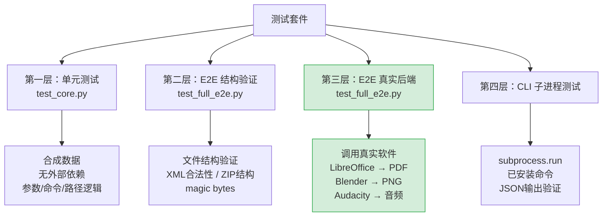

<details><summary>相关源文件</summary>

- `HARNESS.md`
- `cli-hub/tests/test_cli_hub.py`
- `agent-harness/gimp/test_core.py`
- `agent-harness/gimp/test_full_e2e.py`
- `agent-harness/blender/test_core.py`
- `agent-harness/blender/test_full_e2e.py`
- `agent-harness/inkscape/test_core.py`
- `agent-harness/libreoffice/test_core.py`

</details>

# 测试与质量保障

CLI-Anything 在 50+ 个 harness 中维护 **2280+ 条测试**，全部保持 100% 通过率。测试体系围绕四层结构设计，从纯隔离的单元测试到调用真实软件的完整 E2E 验证，确保每个 harness 生成的输出物在结构和内容上都真实可用。

## 多层测试策略

Sources: [HARNESS.md](../../../project-repos/CLI-Anything/HARNESS.md)

<details class="source-snippets">
<summary>引用源码</summary>

<!-- source-snippets:start -->

#### `HARNESS.md`

> 未找到引用文件：`HARNESS.md`

<!-- source-snippets:end -->
</details>
### 第一层：单元测试（`test_core.py`）

对每个核心函数进行隔离测试。使用合成数据，**不依赖任何外部程序**。这一层覆盖参数解析、路径构建、命令拼装逻辑，可在无软件安装的 CI 环境中快速运行。

### 第二层：E2E 中间层（`test_full_e2e.py` — 结构验证）

生成真实文件后验证其结构合法性，例如：
- 检查 XML 是否合法（Inkscape SVG、Draw.io XML）
- 验证 ZIP 结构（OOXML 格式：`.docx`、`.xlsx`、`.pptx`）
- 校验文件头 magic bytes

这一层不要求软件执行完整渲染，但要求输出物在格式层面是合法的。

### 第三层：E2E 真实后端（`test_full_e2e.py` — 软件调用）

**必须调用真实软件**。这是与仅校验格式的测试最关键的区别：

- LibreOffice → 生成 PDF，检查 `%PDF-` magic bytes
- Blender → 渲染出 PNG，验证像素内容
- Audacity → 导出音频，检查 RMS 电平与时长
- GIMP → 导出图像，验证色彩通道与尺寸

退出码 0 不可信——必须验证输出物本身。

### 第四层：CLI 子进程测试

通过 `subprocess.run` 调用已安装的命令行入口，验证 JSON 输出格式合法，覆盖端到端的安装与调用路径。



## 测试计划规范（Phase 4）

Sources: [HARNESS.md](../../../project-repos/CLI-Anything/HARNESS.md)

<details class="source-snippets">
<summary>引用源码</summary>

<!-- source-snippets:start -->

#### `HARNESS.md`

> 未找到引用文件：`HARNESS.md`

<!-- source-snippets:end -->
</details>
每个 harness 在**写代码之前**必须先创建 `TEST.md`，内容包括：

1. **测试清单** — 列举所有待测函数与场景
2. **单元测试计划** — 每个模块的输入/输出规格
3. **E2E 测试计划** — 真实软件调用的具体验证步骤
4. **真实工作流场景** — 模拟实际用户使用路径的完整场景测试

这一"测试先行"原则确保覆盖率设计不依赖实现细节。

## 各 Harness 测试数量

Sources: [HARNESS.md](../../../project-repos/CLI-Anything/HARNESS.md)

<details class="source-snippets">
<summary>引用源码</summary>

<!-- source-snippets:start -->

#### `HARNESS.md`

> 未找到引用文件：`HARNESS.md`

<!-- source-snippets:end -->
</details>
| Harness | 测试总数 | 备注 |
|---------|---------|------|
| blender | 208 | 渲染 PNG 验证 |
| inkscape | 202 | SVG XML 验证 |
| sbox | 244 | 沙箱环境综合测试 |
| libreoffice | 158 | PDF magic bytes 验证 |
| kdenlive | 155 | 视频时长检查 |
| shotcut | 154 | 视频输出验证 |
| obs-studio | 153 | 录制流验证 |
| audacity | 161 | RMS + 时长验证 |
| drawio | 138 | XML 结构验证 |
| gimp | 107 | 像素分析 |
| openscreen | 101 | 屏幕截图验证 |
| ollama | 98 | 模型推理输出验证 |
| 其他 harness | ~601 | — |
| **合计** | **2280** | 1682 单元 + 579 E2E + 19 Node.js |

## 输出验证准则

Sources: [HARNESS.md](../../../project-repos/CLI-Anything/HARNESS.md)

<details class="source-snippets">
<summary>引用源码</summary>

<!-- source-snippets:start -->

#### `HARNESS.md`

> 未找到引用文件：`HARNESS.md`

<!-- source-snippets:end -->
</details>
退出码 0 不能作为测试通过的依据。每种输出类型都有对应的验证方法：

| 输出类型 | 验证方法 |
|---------|---------|
| PDF | 检查文件头 `%PDF-` magic bytes |
| PNG/图像 | 像素分析、色彩通道、尺寸验证 |
| ZIP/OOXML | 解压验证内部结构（`[Content_Types].xml` 等） |
| 音频 | RMS 电平不为零、时长在预期范围内 |
| SVG/XML | 解析为 DOM，验证必要节点存在 |
| 视频 | 时长检查、关键帧抽取验证 |

## CLI-Hub 测试

Sources: [cli-hub/tests/test_cli_hub.py](../../../project-repos/CLI-Anything/cli-hub/tests/test_cli_hub.py)

<details class="source-snippets">
<summary>引用源码</summary>

<!-- source-snippets:start -->

#### `cli-hub/tests/test_cli_hub.py`

```python
"""Tests for cli-hub — registry, installer, analytics, and CLI."""

import json
import os
import tempfile
from pathlib import Path
from unittest.mock import patch, MagicMock

import pytest
import click.testing
import requests

from cli_hub import __version__
from cli_hub.registry import fetch_registry, fetch_all_clis, get_cli, search_clis, list_categories
from cli_hub.preview import (
    inspect_bundle,
    inspect_session,
    open_in_browser,
    render_html,
    render_inspect_text,
    render_live_html,
    render_session_text,
)
from cli_hub.installer import (
    install_cli,
    uninstall_cli,
    get_installed,
    _load_installed,
    _save_installed,
    _run_command,
    _install_strategy,
    _UV_INSTALL_HINT,
)
from cli_hub.analytics import _is_enabled, track_event, track_install, track_uninstall as analytics_track_uninstall, track_visit, track_first_run, _detect_is_agent, detect_invocation_context
from cli_hub.cli import main


# ─── Sample registry data ─────────────────────────────────────────────

SAMPLE_REGISTRY = {
    "meta": {"repo": "https://github.com/HKUDS/CLI-Anything", "description": "test"},
    "clis": [
        {
            "name": "gimp",
            "display_name": "GIMP",
            "version": "1.0.0",
            "description": "Image editing via GIMP",
            "requires": "gimp",
            "homepage": "https://gimp.org",
            "install_cmd": "pip install git+https://github.com/HKUDS/CLI-Anything.git#subdirectory=gimp/agent-harness",
            "entry_point": "cli-anything-gimp",
            "skill_md": "skills/cli-anything-gimp/SKILL.md",
            "category": "image",
            "contributor": "test-user",
            "contributor_url": "https://github.com/test-user",
        },
        {
            "name": "blender",
            "display_name": "Blender",
            "version": "1.0.0",
            "description": "3D modeling via Blender",
            "requires": "blender",
            "homepage": "https://blender.org",
            "install_cmd": "pip install git+https://github.com/HKUDS/CLI-Anything.git#subdirectory=blender/agent-harness",
            "entry_point": "cli-anything-blender",
            "skill_md": None,
            "category": "3d",
            "contributor": "test-user",
            "contributor_url": "https://github.com/test-user",
        },
        {
            "name": "audacity",
            "display_name": "Audacity",
            "version": "1.0.0",
            "description": "Audio editing and processing via sox",
            "requires": "sox",
            "homepage": "https://audacityteam.org",
            "install_cmd": "pip install git+https://github.com/HKUDS/CLI-Anything.git#subdirectory=audacity/agent-harness",
            "entry_point": "cli-anything-audacity",
            "skill_md": None,
            "category": "audio",
            "contributor": "test-user",
            "contributor_url": "https://github.com/test-user",
        },
    ],
}


def _make_preview_bundle(tmp_path: Path, *, with_trajectory: bool = False) -> Path:
    bundle_dir = tmp_path / "preview-bundle"
    artifacts_dir = bundle_dir / "artifacts"
    artifacts_dir.mkdir(parents=True)
    (artifacts_dir / "hero.png").write_bytes(b"\x89PNG\r\n\x1a\npreview")
    (artifacts_dir / "preview.mp4").write_bytes(b"\x00\x00\x00\x18ftypmp42")
    summary = {
        "headline": "Quick preview rendered",
        "facts": {
            "duration_s": 6.0,
            "resolution": "640x360",
        },
        "warnings": [],
    }
    manifest = {
        "protocol_version": "preview-bundle/v1",
        "bundle_id": "20260419T104530Z_deadbeef_quick",
        "bundle_kind": "capture",
        "software": "shotcut",
        "recipe": "quick",
        "status": "ok",
        "created_at": "2026-04-19T10:45:30Z",
        "generator": {"entry_point": "cli-anything-shotcut", "command": "cli-anything-shotcut preview capture --recipe quick"},
        "source": {"project_path": "/tmp/demo.mlt", "project_fingerprint": "sha256:test"},
        "summary_path": "summary.json",
        "artifacts": [
            {
                "artifact_id": "hero",
                "role": "hero",
                "kind": "image",
                "label": "Midpoint frame",
                "media_type": "image/png",
```

<!-- source-snippets:end -->
</details>
`cli-hub` 工具本身也有独立测试套件，覆盖：
- bundle 发布与拉取流程
- registry 查询与解析
- preview 模块的 `load_bundle()` / `load_session()` 函数
- CLI 子命令的参数解析与输出格式

## 相关页面

- [Harness 包结构](harness-structure.md)
- [CI/CD 与注册表](ci-cd-and-registry.md)
