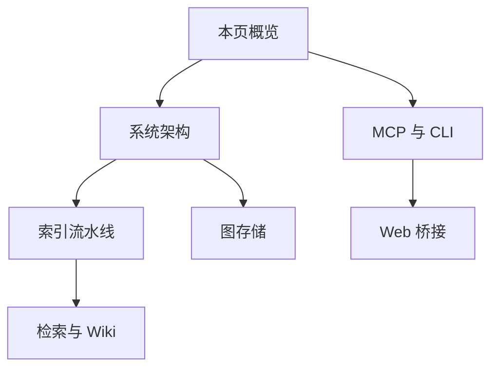
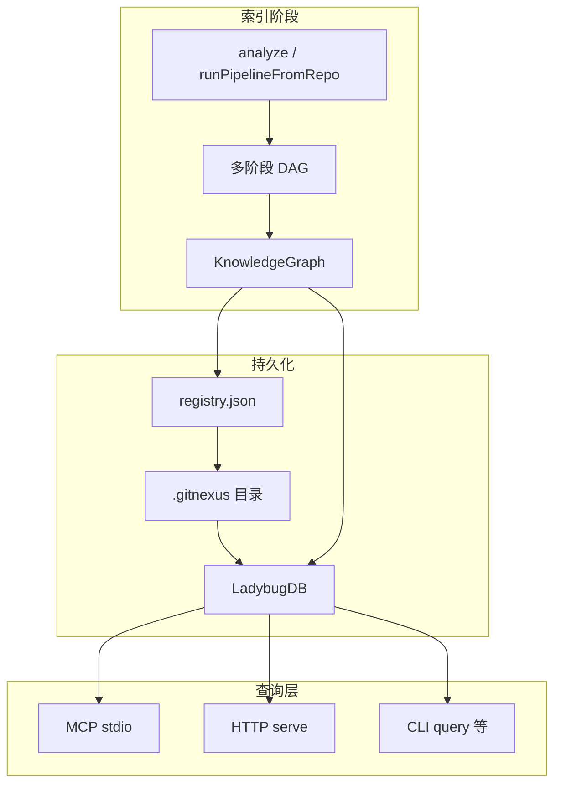
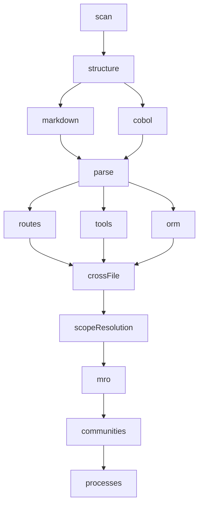
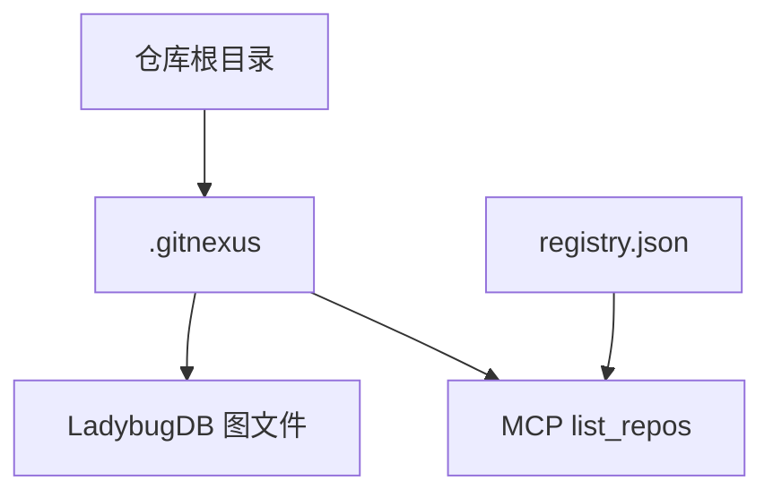
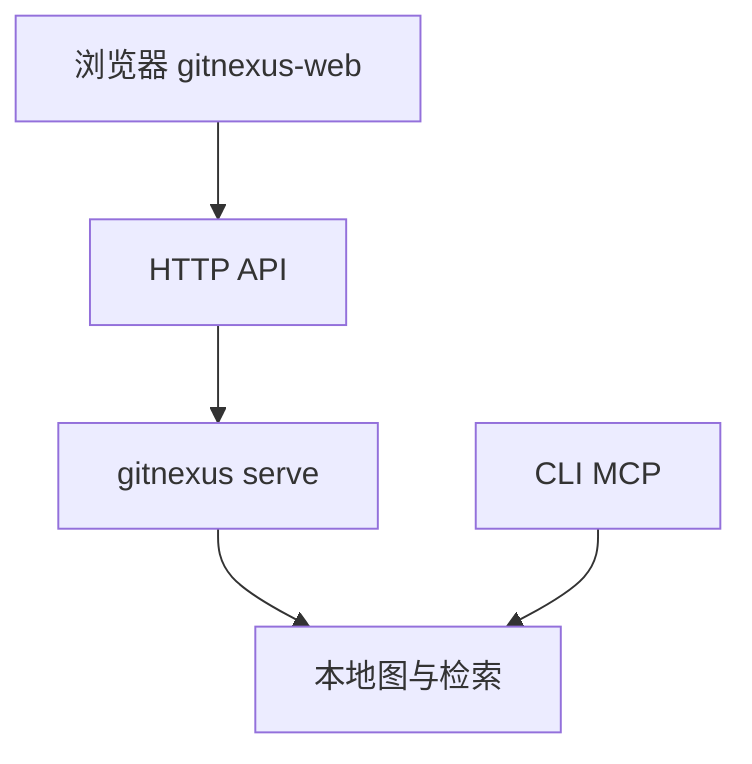
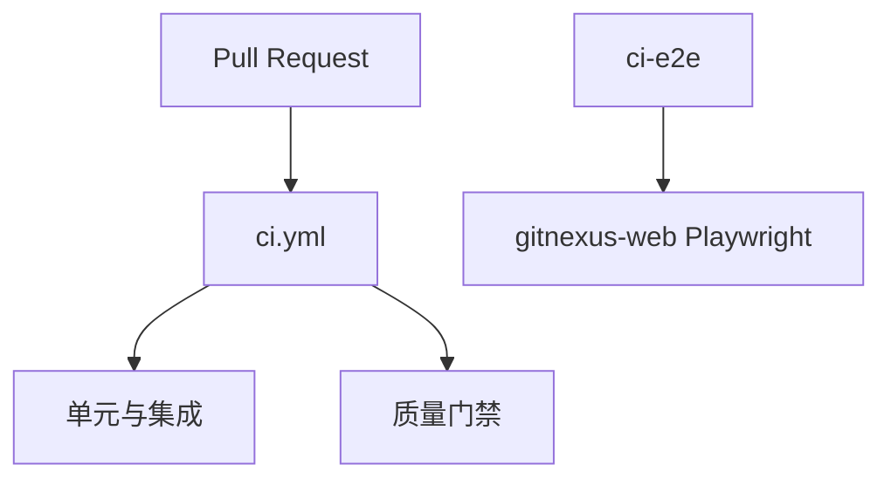

# GitNexus DeepWiki 全文导出

> 来源: https://github.com/abhigyanpatwari/GitNexus @ 7f8b01d5068495af2f4b07f1f91bc4c1e7b82fe0

---

<!-- PAGE: overview -->

<details>
<summary>相关源文件</summary>

生成本页时使用的主要源文件：

- [README.md](https://github.com/abhigyanpatwari/GitNexus/blob/7f8b01d5068495af2f4b07f1f91bc4c1e7b82fe0/README.md)
- [CONTRIBUTING.md](https://github.com/abhigyanpatwari/GitNexus/blob/7f8b01d5068495af2f4b07f1f91bc4c1e7b82fe0/CONTRIBUTING.md)
- [CHANGELOG.md](https://github.com/abhigyanpatwari/GitNexus/blob/7f8b01d5068495af2f4b07f1f91bc4c1e7b82fe0/CHANGELOG.md)
- [gitnexus/package.json](https://github.com/abhigyanpatwari/GitNexus/blob/7f8b01d5068495af2f4b07f1f91bc4c1e7b82fe0/gitnexus/package.json)
- [gitnexus-shared/package.json](https://github.com/abhigyanpatwari/GitNexus/blob/7f8b01d5068495af2f4b07f1f91bc4c1e7b82fe0/gitnexus-shared/package.json)

</details>

# 项目概览

GitNexus 将任意代码库静态索引为**知识图谱**（依赖、调用链、聚类、执行流等），并通过 **MCP、CLI 与可选 Web UI** 暴露给 Cursor、Claude Code、Codex 等代理，目标是让代理在修改代码前获得可验证的结构化上下文，而不是仅凭自然语言摘要。

仓库为 **monorepo**：核心 npm 包 `gitnexus` 负责索引与 MCP；`gitnexus-web` 为浏览器内的图探索与对话客户端；`gitnexus-shared` 承载共享类型。另有 `gitnexus-claude-plugin`、`gitnexus-cursor-integration` 等目录存放面向不同编辑器的 **Skills** 与插件元数据。

## 产品形态对比

| 维度 | CLI + MCP | Web UI |
|------|-----------|--------|
| 典型场景 | 日常开发、编辑器内深度分析 | 快速探索、演示 |
| 安装 | `npm install -g gitnexus` 或 `npx` | 无需安装，托管站点或本地构建 |
| 隐私与网络 | 本地索引，无网络依赖（按 README 描述） | 浏览器内 WASM 等模式 |

**Bridge 模式**：`gitnexus serve` 将本地已索引仓库通过 HTTP 暴露给 Web UI，避免重复上传与重复索引。

## 阅读路线建议



## 合规与许可

项目采用 **PolyForm Noncommercial** 许可；README 明确声明无官方加密货币，并区分开源社区版与企业版（SaaS / 自托管）能力边界。

## 相关页面

- [系统架构](system-architecture.md)
- [MCP、CLI 与 HTTP 桥](mcp-cli-http-interfaces.md)

Sources: [README.md:26-58](../../../project-repos/GitNexus/README.md#L26-L58), [README.md:94-123](../../../project-repos/GitNexus/README.md#L94-L123), [gitnexus/package.json:1-41](../../../project-repos/GitNexus/gitnexus/package.json#L1-L41), [CONTRIBUTING.md:1-40](../../../project-repos/GitNexus/CONTRIBUTING.md#L1-L40), [CHANGELOG.md:1-30](../../../project-repos/GitNexus/CHANGELOG.md#L1-L30)

<details class="source-snippets">
<summary>引用源码</summary>

<!-- source-snippets:start -->

#### `README.md:26-58`

```markdown
**Building nervous system for agent context.**

Indexes any codebase into a knowledge graph — every dependency, call chain, cluster, and execution flow — then exposes it through smart tools so AI agents never miss code.


https://github.com/user-attachments/assets/172685ba-8e54-4ea7-9ad1-e31a3398da72


> *Like DeepWiki, but deeper.* DeepWiki helps you *understand* code. GitNexus lets you *analyze* it — because a knowledge graph tracks every relationship, not just descriptions.

**TL;DR:** The **Web UI** is a quick way to chat with any repo. The **CLI + MCP** is how you make your AI agent actually reliable — it gives Cursor, Claude Code, Codex, and friends a deep architectural view of your codebase so they stop missing dependencies, breaking call chains, and shipping blind edits. Even smaller models get full architectural clarity, making it compete with Goliath models.

---

## Star History

[](https://www.star-history.com/#abhigyanpatwari/GitNexus&type=date&legend=top-left)


## Two Ways to Use GitNexus

|                   | **CLI + MCP**                                            | **Web UI**                                             |
| ----------------- | -------------------------------------------------------------- | ------------------------------------------------------------ |
| **What**    | Index repos locally, connect AI agents via MCP                 | Visual graph explorer + AI chat in browser                   |
| **For**     | Daily development with Cursor, Claude Code, Codex, Windsurf, OpenCode | Quick exploration, demos, one-off analysis                   |
| **Scale**   | Full repos, any size                                           | Limited by browser memory (~5k files), or unlimited via backend mode |
| **Install** | `npm install -g gitnexus`                                    | No install — [gitnexus.vercel.app](https://gitnexus.vercel.app) |
| **Storage** | LadybugDB native (fast, persistent)                               | LadybugDB WASM (in-memory, per session)                         |
| **Parsing** | Tree-sitter native bindings                                    | Tree-sitter WASM                                             |
| **Privacy** | Everything local, no network                                   | Everything in-browser, no server                             |
```

#### `README.md:94-123`

````markdown
## CLI + MCP (recommended)

The CLI indexes your repository and runs an MCP server that gives AI agents deep codebase awareness.

### Quick Start

```bash
# Index your repo (run from repo root)
npx gitnexus analyze
```

That's it. This indexes the codebase, installs agent skills, registers Claude Code hooks, and creates `AGENTS.md` / `CLAUDE.md` context files — all in one command.

To configure MCP for your editor, run `npx gitnexus setup` once — or set it up manually below.

### MCP Setup

`gitnexus setup` auto-detects your editors and writes the correct global MCP config. You only need to run it once.

### Editor Support

| Editor                | MCP | Skills | Hooks (auto-augment) | Support        |
| --------------------- | --- | ------ | -------------------- | -------------- |
| **Claude Code** | Yes | Yes    | Yes (PreToolUse + PostToolUse) | **Full** |
| **Cursor**      | Yes | Yes    | —                   | MCP + Skills   |
| **Codex**       | Yes | Yes    | —                   | MCP + Skills   |
| **Windsurf**    | Yes | —     | —                   | MCP            |
| **OpenCode**    | Yes | Yes    | —                   | MCP + Skills   |

> **Claude Code** gets the deepest integration: MCP tools + agent skills + PreToolUse hooks that enrich searches with graph context + PostToolUse hooks that detect a stale index after commits and prompt the agent to reindex.
````

#### `gitnexus/package.json:1-41`

```json
{
  "name": "gitnexus",
  "version": "1.6.3",
  "description": "Graph-powered code intelligence for AI agents. Index any codebase, query via MCP or CLI.",
  "author": "Abhigyan Patwari",
  "license": "PolyForm-Noncommercial-1.0.0",
  "homepage": "https://github.com/abhigyanpatwari/GitNexus#readme",
  "repository": {
    "type": "git",
    "url": "git+https://github.com/abhigyanpatwari/GitNexus.git",
    "directory": "gitnexus"
  },
  "bugs": {
    "url": "https://github.com/abhigyanpatwari/GitNexus/issues"
  },
  "keywords": [
    "mcp",
    "model-context-protocol",
    "code-intelligence",
    "knowledge-graph",
    "cursor",
    "claude",
    "codex",
    "ai-agent",
    "gitnexus",
    "static-analysis",
    "codebase-indexing"
  ],
  "type": "module",
  "bin": {
    "gitnexus": "dist/cli/index.js"
  },
  "files": [
    "dist",
    "hooks",
    "scripts",
    "skills",
    "vendor",
    "web"
  ],
  "scripts": {
```

#### `CONTRIBUTING.md:1-40`

```markdown
# Contributing to GitNexus

How to propose changes, run checks locally, and open pull requests.

## License

This project uses the [PolyForm Noncommercial License 1.0.0](https://polyformproject.org/licenses/noncommercial/1.0.0/). By contributing, you agree your contributions are licensed under the same terms unless stated otherwise.

## Where to discuss

- **Issues & feature ideas:** use [GitHub Issues](https://github.com/abhigyanpatwari/GitNexus/issues) for the upstream repo, or your fork’s tracker if you work from a fork.
- **Community:** see the Discord link in the root [README.md](README.md).

## Development setup

1. Clone the repository.
2. **CLI / MCP package:** `cd gitnexus && npm install && npm run build`
3. **Web UI (if needed):** `cd gitnexus-web && npm install`
4. Run tests as described in [TESTING.md](TESTING.md).

## Branch and pull requests

- Use short-lived branches off the default branch of the repo you are targeting.
- **PR titles MUST follow the conventional-commit format** — `pr-labeler.yml` enforces this on every PR and auto-applies the matching label so release notes group the change correctly.
- **PR description:** what changed, why, how to verify (commands), and any risk or rollback notes.

### Pull request titles

Format: `<type>[(scope)][!]: <subject>`

Allowed types and the release-notes section each one lands in (defined in `.github/release.yml`):

| Type | Label applied | Release-notes section |
|------|---------------|-----------------------|
| `feat` | `enhancement` | 🚀 Features |
| `fix` | `bug` | 🐛 Bug Fixes |
| `perf` | `performance` | 🏎️ Performance |
| `refactor` | `refactor` | 🔄 Refactoring |
| `test` | `test` | 🧪 Tests |
| `ci` | `ci` | 👷 CI/CD |
```

#### `CHANGELOG.md:1-30`

```markdown
# Changelog

All notable changes to GitNexus will be documented in this file.

## [Unreleased]

### Changed
- Migrated from KuzuDB to LadybugDB v0.15 (`@ladybugdb/core`, `@ladybugdb/wasm-core`)
- Renamed all internal paths from `kuzu` to `lbug` (storage: `.gitnexus/kuzu` → `.gitnexus/lbug`)
- Added automatic cleanup of stale KuzuDB index files
- LadybugDB v0.15 requires explicit VECTOR extension loading for semantic search

## [1.5.3] - 2026-04-01

### Added

- **TypeScript/JavaScript MethodExtractor config** — shared extraction config covering abstract methods, visibility modifiers, async/override keywords, decorators, rest/optional/destructured parameters, and return types (#588) — @compound-ai

### Fixed

- **Azure OpenAI compatibility** — use `max_completion_tokens` instead of deprecated `max_tokens` (newer models reject `max_tokens`); skip `temperature` for Azure provider (some models reject non-default values) (#618)
- **Simplified Azure interactive setup** — 3 prompts (endpoint, deployment, key) instead of 7 (#618)
- **Wiki HTML viewer script injection** — escape `</script>` in embedded JSON so LLM-generated markdown no longer breaks the viewer (#618)
- Ensure import rewrites survive npm publish lifecycle

## [1.4.0] - 2026-03-13

### Added

- **Language-aware symbol resolution engine** with 3-tier resolver: exact FQN → scope-walk → guarded fuzzy fallback that refuses ambiguous matches (#238) — @magyargergo
```

<!-- source-snippets:end -->
</details>
---

<!-- PAGE: system-architecture -->

<details>
<summary>相关源文件</summary>

生成本页时使用的主要源文件：

- [ARCHITECTURE.md](https://github.com/abhigyanpatwari/GitNexus/blob/7f8b01d5068495af2f4b07f1f91bc4c1e7b82fe0/ARCHITECTURE.md)
- [gitnexus/package.json](https://github.com/abhigyanpatwari/GitNexus/blob/7f8b01d5068495af2f4b07f1f91bc4c1e7b82fe0/gitnexus/package.json)
- [gitnexus-web/package.json](https://github.com/abhigyanpatwari/GitNexus/blob/7f8b01d5068495af2f4b07f1f91bc4c1e7b82fe0/gitnexus-web/package.json)
- [gitnexus-shared/package.json](https://github.com/abhigyanpatwari/GitNexus/blob/7f8b01d5068495af2f4b07f1f91bc4c1e7b82fe0/gitnexus-shared/package.json)
- [RUNBOOK.md](https://github.com/abhigyanpatwari/GitNexus/blob/7f8b01d5068495af2f4b07f1f91bc4c1e7b82fe0/RUNBOOK.md)

</details>

# 系统架构

GitNexus 采用「**索引 → 图持久化 → 多入口查询**」的单后端、多前端架构：同一套 LadybugDB 中的图数据可被 MCP（stdio）、HTTP（`serve` + Express）以及 CLI 子命令消费。

## Monorepo 包职责

| 路径 | 职责 |
|------|------|
| `gitnexus/` | npm 包 `gitnexus`：CLI、MCP、ingestion、图、嵌入、Wiki 生成等 |
| `gitnexus-web/` | Vite + React：图可视化与 AI 对话，经 HTTP API 访问后端 |
| `gitnexus-shared/` | CLI 与 Web 共用的 TypeScript 类型与常量 |
| `eval/` | 工具使用与检索类评测脚手架 |
| `.github/` | CI 与 composite actions |

## 端到端数据流



## 变更热点速查

维护者可按关注点直达实现目录，例如 CLI 在 `gitnexus/src/cli/`，ingestion 阶段在 `gitnexus/src/core/ingestion/pipeline-phases/`，MCP 工具在 `gitnexus/src/mcp/tools.ts`，跨仓组逻辑在 `gitnexus/src/core/group/`（详见 ARCHITECTURE 中的表格）。

## 相关页面

- [索引流水线](ingestion-pipeline.md)
- [MCP、CLI 与 HTTP 桥](mcp-cli-http-interfaces.md)

Sources: [ARCHITECTURE.md:1-72](../../../project-repos/GitNexus/ARCHITECTURE.md#L1-L72), [ARCHITECTURE.md:16-27](../../../project-repos/GitNexus/ARCHITECTURE.md#L16-L27), [gitnexus/package.json:29-52](../../../project-repos/GitNexus/gitnexus/package.json#L29-L52), [gitnexus-web/package.json:1-19](../../../project-repos/GitNexus/gitnexus-web/package.json#L1-L19), [RUNBOOK.md:1-50](../../../project-repos/GitNexus/RUNBOOK.md#L1-L50)

<details class="source-snippets">
<summary>引用源码</summary>

<!-- source-snippets:start -->

#### `ARCHITECTURE.md:1-72`

```markdown
# Architecture — GitNexus

Monorepo: **CLI/MCP** (`gitnexus/`) + **browser UI** (`gitnexus-web/`).

## Repository layout

| Path | Role |
|------|------|
| `gitnexus/` | npm package `gitnexus`: CLI, MCP server (stdio), HTTP API, ingestion pipeline, LadybugDB graph, embeddings. |
| `gitnexus-web/` | Vite + React thin client: graph explorer + AI chat. All queries via `gitnexus serve` HTTP API. |
| `gitnexus-shared/` | Shared TypeScript types and constants (consumed by CLI and Web). |
| `.claude/`, `gitnexus-claude-plugin/`, `gitnexus-cursor-integration/` | Agent skills and plugin metadata. |
| `eval/` | Evaluation harnesses for benchmarking tool usage. |
| `.github/` | CI workflows + composite actions (`setup-gitnexus/`, `setup-gitnexus-web/`). |

## End-to-end flow: index → graph → tools

1. **Ingestion** — `analyze.ts` → `runFullAnalysis` (`run-analyze.ts`) → `runPipelineFromRepo` (`pipeline.ts`). DAG of 12 phases builds a `KnowledgeGraph` in memory, then loads into LadybugDB under `.gitnexus/`. Repo registered in `~/.gitnexus/registry.json` for MCP discovery.

2. **Persistence** — `repo-manager.ts` (paths, registry, KuzuDB cleanup). `lbug-adapter.ts` (graph load, queries, embedding batches).

3. **Query layer** — three interfaces to the same backend:
   - **MCP (stdio):** `mcp.ts` → `LocalBackend` → tools (`tools.ts`) + resources (`resources.ts`)
   - **HTTP bridge:** `serve.ts` → Express (`api.ts`, `mcp-http.ts`) for web UI
   - **CLI direct:** `gitnexus query|context|impact|cypher` in `tool.ts`

4. **Staleness** — `staleness.ts` compares indexed `lastCommit` to `HEAD`, surfaces hints.

## MCP tools

| Tool | Purpose |
|------|---------|
| `list_repos` | Discover indexed repos |
| `query` | Hybrid BM25 + vector search over the graph |
| `cypher` | Ad hoc Cypher against the schema |
| `context` | Callers, callees, processes for one symbol |
| `impact` | Blast radius (upstream/downstream) with risk summary |
| `detect_changes` | Map git diffs to affected symbols and processes |
| `rename` | Graph-assisted multi-file rename with `dry_run` preview |
| `api_impact` | Pre-change impact report for an API route handler |
| `route_map` | API route → handler → consumer mappings |
| `tool_map` | MCP/RPC tool definitions and handlers |
| `shape_check` | Response shape vs consumer property access mismatches |
| `group_list` | List repo groups or details for one group |
| `group_sync` | Rebuild group Contract Registry (`contracts.json`) and bridge graph |

`query`, `context`, and `impact` are group-aware: pass `repo: "@<groupName>"` (or `"@<groupName>/<memberPath>"` to scope to one member) plus optional `service: "<monorepo/path>"`. Group-mode `query` merges per-repo results via Reciprocal Rank Fusion; group-mode `impact` runs the local walk in the chosen member and fans out across boundaries via the Contract Bridge (`gitnexus/src/core/group/cross-impact.ts`). The previously-planned `group_query`, `group_context`, `group_impact`, `group_contracts`, `group_status` MCP tools are intentionally not introduced — group-level state is exposed via resources instead:

| Resource URI | Purpose |
|--------------|---------|
| `gitnexus://group/{name}/contracts` | Contract Registry (provider/consumer rows + cross-links) |
| `gitnexus://group/{name}/status` | Per-member index + Contract Registry staleness |

## Where to change what

| Concern | Start in |
|---------|----------|
| CLI commands/flags | `src/cli/` (`index.ts`, per-command modules) |
| Parsing/graph construction | `src/core/ingestion/pipeline-phases/` + `pipeline.ts` |
| Graph schema/DB | `src/core/lbug/` (`schema.ts`, `lbug-adapter.ts`) |
| MCP tools/resources | `src/mcp/server.ts`, `tools.ts`, `resources.ts` |
| Cross-repo groups (sync, contracts, `@<group>` routing) | `src/core/group/` (`service.ts`, `cross-impact.ts`, `sync.ts`, `bridge-db.ts`) |
| Search ranking | `src/core/search/` (BM25, hybrid fusion) |
| Embeddings | `src/core/embeddings/` + `src/core/run-analyze.ts` |
| Wiki generation | `src/core/wiki/` |
| Language support | `src/core/ingestion/languages/` + `tree-sitter-queries.ts` + `gitnexus-shared/src/languages.ts` |
| Import resolution | `src/core/ingestion/import-processor.ts` + `import-resolvers/configs/` + `model/resolution-context.ts` |
| Call resolution/MRO | `src/core/ingestion/call-processor.ts` + `model/resolve.ts` |
| Type extraction | `src/core/ingestion/type-extractors/` |
| Worker pool | `src/core/ingestion/workers/` |
| Web UI | `gitnexus-web/src/` |
| CI | `.github/workflows/*.yml`, `.github/actions/` |
```

#### `ARCHITECTURE.md:16-27`

```markdown
## End-to-end flow: index → graph → tools

1. **Ingestion** — `analyze.ts` → `runFullAnalysis` (`run-analyze.ts`) → `runPipelineFromRepo` (`pipeline.ts`). DAG of 12 phases builds a `KnowledgeGraph` in memory, then loads into LadybugDB under `.gitnexus/`. Repo registered in `~/.gitnexus/registry.json` for MCP discovery.

2. **Persistence** — `repo-manager.ts` (paths, registry, KuzuDB cleanup). `lbug-adapter.ts` (graph load, queries, embedding batches).

3. **Query layer** — three interfaces to the same backend:
   - **MCP (stdio):** `mcp.ts` → `LocalBackend` → tools (`tools.ts`) + resources (`resources.ts`)
   - **HTTP bridge:** `serve.ts` → Express (`api.ts`, `mcp-http.ts`) for web UI
   - **CLI direct:** `gitnexus query|context|impact|cypher` in `tool.ts`

4. **Staleness** — `staleness.ts` compares indexed `lastCommit` to `HEAD`, surfaces hints.
```

#### `gitnexus/package.json:29-52`

```json
  "type": "module",
  "bin": {
    "gitnexus": "dist/cli/index.js"
  },
  "files": [
    "dist",
    "hooks",
    "scripts",
    "skills",
    "vendor",
    "web"
  ],
  "scripts": {
    "build": "node scripts/build.js",
    "serve": "tsx src/cli/index.ts serve",
    "dev": "tsx watch src/cli/index.ts",
    "test": "vitest run",
    "test:unit": "vitest run test/unit",
    "test:integration": "vitest run test/integration",
    "test:watch": "vitest",
    "test:coverage": "vitest run --coverage",
    "postinstall": "node scripts/build-tree-sitter-dart.cjs && node scripts/build-tree-sitter-proto.cjs",
    "prepare": "node scripts/build.js",
    "prepack": "node scripts/build.js"
```

#### `gitnexus-web/package.json:1-19`

```json
{
  "name": "gitnexus",
  "private": true,
  "version": "0.0.0",
  "engines": {
    "node": "^20.19.0 || >=22.12.0"
  },
  "type": "module",
  "scripts": {
    "dev": "vite",
    "build": "tsc -b && vite build",
    "preview": "vite preview",
    "test": "vitest run",
    "test:watch": "vitest",
    "test:coverage": "vitest run --coverage",
    "test:e2e": "playwright test",
    "test:e2e:ui": "playwright test --ui",
    "test:e2e:report": "playwright show-report"
  },
```

#### `RUNBOOK.md:1-50`

````markdown
# Runbook — GitNexus

Short, copy-paste operations for **local development**, **MCP**, and **CI**. Commands assume a Unix shell; on Windows use Git Bash or equivalent paths.

## Prerequisites

- **Node.js** ≥ 20 (`gitnexus-web/package.json` `engines`).  
- **Git** (analyze requires a git repository).  
- From repo root, install and build the CLI package:

```bash
cd gitnexus
npm install
npm run build
```

Use `npx gitnexus …` from any path after global/published install, or `node dist/cli/index.js …` when developing from `gitnexus/` with a local build.

---

## Index out of date / “stale” tools

**Symptom:** MCP or resources warn the index is behind `HEAD`, or results don’t reflect recent commits.

**Fix (from the target repo root):**

```bash
npx gitnexus analyze
```

**Force full rebuild** (same commit but suspect corruption or changed ignore rules):

```bash
npx gitnexus analyze --force
```

**Check status:**

```bash
npx gitnexus status
```

**List what MCP knows about:**

```bash
npx gitnexus list
```

---

````

<!-- source-snippets:end -->
</details>
---

<!-- PAGE: ingestion-pipeline -->

<details>
<summary>相关源文件</summary>

生成本页时使用的主要源文件：

- [gitnexus/src/core/ingestion/pipeline.ts](https://github.com/abhigyanpatwari/GitNexus/blob/7f8b01d5068495af2f4b07f1f91bc4c1e7b82fe0/gitnexus/src/core/ingestion/pipeline.ts)
- [gitnexus/src/core/ingestion/pipeline-phases/index.ts](https://github.com/abhigyanpatwari/GitNexus/blob/7f8b01d5068495af2f4b07f1f91bc4c1e7b82fe0/gitnexus/src/core/ingestion/pipeline-phases/index.ts)
- [gitnexus/src/core/ingestion/pipeline-phases/runner.ts](https://github.com/abhigyanpatwari/GitNexus/blob/7f8b01d5068495af2f4b07f1f91bc4c1e7b82fe0/gitnexus/src/core/ingestion/pipeline-phases/runner.ts)
- [gitnexus/src/core/ingestion/call-processor.ts](https://github.com/abhigyanpatwari/GitNexus/blob/7f8b01d5068495af2f4b07f1f91bc4c1e7b82fe0/gitnexus/src/core/ingestion/call-processor.ts)
- [ARCHITECTURE.md](https://github.com/abhigyanpatwari/GitNexus/blob/7f8b01d5068495af2f4b07f1f91bc4c1e7b82fe0/ARCHITECTURE.md)

</details>

# 索引流水线

ingestion 由 **具名阶段（phase）** 组成，阶段之间通过显式 `deps` 构成 DAG，由 `runner.ts` 做拓扑排序后顺序执行；各阶段在共享的 `PipelineContext` 上向同一 `KnowledgeGraph` 累积节点与边。

## 阶段注册与可选裁剪

`pipeline.ts` 中 `buildPhaseList` 按固定顺序注册阶段；当 `skipGraphPhases` 为真时跳过 MRO、社区与进程相关阶段以加速测试。

实际导出顺序（节选）为：`scan` → `structure` → `markdown` / `cobol` → `parse` → `routes` / `tools` / `orm` → `crossFile` → **`scopeResolution`** → `mro` → `communities` → `processes`（后三者可被跳过）。



## Runner 设计要点

- 拓扑校验：重复名、缺失依赖、环检测。
- 每个阶段仅接收**声明依赖**的上游输出，避免隐式耦合。
- 错误包装为带阶段名的信息并上报进度事件。

## 调用解析子 DAG

`parse` 阶段内部的 `call-processor` 实现多阶段调用解析（提取 → 分类 → 接收者推断 → 分派选择 → 目标解析 → 写边）。语言特定行为通过 `LanguageProvider` 上的可选钩子注入（如隐式 `self` 与自定义分派），与 import 解析、类型抽取等解耦。

## 相关页面

- [图存储与持久化](graph-storage-and-schema.md)
- [检索、向量与 Wiki](search-embeddings-and-wiki.md)

Sources: [gitnexus/src/core/ingestion/pipeline.ts:62-91](../../../project-repos/GitNexus/gitnexus/src/core/ingestion/pipeline.ts#L62-L91), [gitnexus/src/core/ingestion/pipeline-phases/index.ts:10-31](../../../project-repos/GitNexus/gitnexus/src/core/ingestion/pipeline-phases/index.ts#L10-L31), [gitnexus/src/core/ingestion/pipeline-phases/runner.ts:1-38](../../../project-repos/GitNexus/gitnexus/src/core/ingestion/pipeline-phases/runner.ts#L1-L38), [gitnexus/src/core/ingestion/call-processor.ts:11-31](../../../project-repos/GitNexus/gitnexus/src/core/ingestion/call-processor.ts#L11-L31), [ARCHITECTURE.md:76-115](../../../project-repos/GitNexus/ARCHITECTURE.md#L76-L115)

<details class="source-snippets">
<summary>引用源码</summary>

<!-- source-snippets:start -->

#### `gitnexus/src/core/ingestion/pipeline.ts:62-91`

```typescript
/**
 * All pipeline phases with their dependency relationships.
 *
 * Phase dependency graph:
 *
 *   scan → structure → [markdown, cobol] → parse → [routes, tools, orm]
 *     → crossFile → mro → communities → processes
 *
 * To add a new phase: create a file in pipeline-phases/, export the phase
 * object, and add it to the appropriate position in this array.
 */
function buildPhaseList(options?: PipelineOptions): PipelinePhase[] {
  const phases: PipelinePhase[] = [
    scanPhase,
    structurePhase,
    markdownPhase,
    cobolPhase,
    parsePhase,
    routesPhase,
    toolsPhase,
    ormPhase,
    crossFilePhase,
    scopeResolutionPhase,
  ];

  if (!options?.skipGraphPhases) {
    phases.push(mroPhase, communitiesPhase, processesPhase);
  }

  return phases;
```

#### `gitnexus/src/core/ingestion/pipeline-phases/index.ts:10-31`

```typescript
export { scanPhase, type ScanOutput } from './scan.js';
export { structurePhase, type StructureOutput } from './structure.js';
export { markdownPhase, type MarkdownOutput } from './markdown.js';
export { cobolPhase, type CobolOutput } from './cobol.js';
export { parsePhase, type ParseOutput } from './parse.js';
export { routesPhase, type RoutesOutput, type RouteEntry } from './routes.js';
export { toolsPhase, type ToolsOutput, type ToolDef } from './tools.js';
export { ormPhase, type ORMOutput } from './orm.js';
export { crossFilePhase, type CrossFileOutput } from './cross-file.js';
export {
  scopeResolutionPhase,
  type ScopeResolutionOutput,
} from '../scope-resolution/pipeline/phase.js';
export { mroPhase, type MROOutput } from './mro.js';
export { communitiesPhase, type CommunitiesOutput } from './communities.js';
export { processesPhase, type ProcessesOutput } from './processes.js';

// ── Infrastructure ─────────────────────────────────────────────────────────

export { runPipeline } from './runner.js';
export type { PipelinePhase, PipelineContext, PhaseResult } from './types.js';
export { getPhaseOutput } from './types.js';
```

#### `gitnexus/src/core/ingestion/pipeline-phases/runner.ts:1-38`

```typescript
/**
 * Pipeline Phase Runner
 *
 * Executes pipeline phases in dependency order using Kahn's topological sort.
 * Each phase receives typed outputs from its upstream dependencies.
 *
 * The runner is intentionally simple:
 * - No dynamic phase loading
 * - No plugin system
 * - Static phase graph, compile-time type safety
 * - Sequential execution (parallel support is architecturally possible
 *   but most phases have linear dependencies)
 */

import type { PipelinePhase, PipelineContext, PhaseResult } from './types.js';
import { isDev } from '../utils/env.js';

/**
 * Validate that the phases form a valid dependency graph (no cycles, all deps present).
 * Returns phases in topological execution order.
 */
function topologicalSort(phases: readonly PipelinePhase[]): PipelinePhase[] {
  const phaseMap = new Map<string, PipelinePhase>();
  for (const phase of phases) {
    if (phaseMap.has(phase.name)) {
      throw new Error(`Duplicate phase name: '${phase.name}'`);
    }
    phaseMap.set(phase.name, phase);
  }

  // Validate all deps exist
  for (const phase of phases) {
    for (const dep of phase.deps) {
      if (!phaseMap.has(dep)) {
        throw new Error(`Phase '${phase.name}' depends on '${dep}', which is not registered`);
      }
    }
  }
```

#### `gitnexus/src/core/ingestion/call-processor.ts:11-31`

```typescript
/**
 * DAG stage 4 fallback: used when `selectDispatch` is absent or returns null.
 * Preserves pre-DAG dispatch semantics:
 *   - 'constructor'         → constructor branch
 *   - 'free'                → free branch (admits class-target fast path)
 *   - 'member' or undefined → owner-scoped branch
 *
 * `undefined` callForm MUST route through owner-scoped (not free) so bare
 * identifiers without a classified shape do NOT trigger `resolveFreeCall`'s
 * class-target fast path. Without a `receiverTypeName`, the owner-scoped
 * branch falls through to `resolveModuleAliasedCall` + `singleCandidate`,
 * matching legacy behavior where non-callable symbols (Class, Interface)
 * null-route instead of producing spurious Constructor edges.
 */
const defaultDispatchDecision = (
  callForm: 'free' | 'member' | 'constructor' | undefined,
): DispatchDecision => {
  if (callForm === 'constructor') return { primary: 'constructor' };
  if (callForm === 'free') return { primary: 'free' };
  return { primary: 'owner-scoped' };
};
```

#### `ARCHITECTURE.md:76-115`

````markdown
---

## Pipeline Phase DAG

12 phases defined in `gitnexus/src/core/ingestion/pipeline-phases/`, each with explicit `deps` and typed output.

```
scan → structure → [markdown, cobol] → parse → [routes, tools, orm]
  → crossFile → mro → communities → processes
```

| Phase | File | Deps | Output |
|-------|------|------|--------|
| `scan` | `scan.ts` | (root) | File paths + sizes |
| `structure` | `structure.ts` | `scan` | File/Folder nodes, CONTAINS edges, `allPathSet` |
| `markdown` | `markdown.ts` | `structure` | Section nodes, cross-link edges from .md/.mdx |
| `cobol` | `cobol.ts` | `structure` | COBOL program/paragraph/section nodes (regex, no tree-sitter) |
| `parse` | `parse.ts` + `parse-impl.ts` | `structure`, `markdown`, `cobol` | Symbol nodes, IMPORTS/CALLS/EXTENDS edges, extracted routes/tools/ORM queries |
| `routes` | `routes.ts` | `parse` | Route nodes + HANDLES_ROUTE edges (Next.js, Expo, PHP, decorators) |
| `tools` | `tools.ts` | `parse` | Tool nodes + HANDLES_TOOL edges |
| `orm` | `orm.ts` | `parse` | QUERIES edges (Prisma, Supabase) |
| `crossFile` | `cross-file.ts` + `cross-file-impl.ts` | `parse`, `routes`, `tools`, `orm` | Cross-file type propagation in topological import order |
| `mro` | `mro.ts` | `crossFile`, `structure` | METHOD_OVERRIDES + METHOD_IMPLEMENTS edges |
| `communities` | `communities.ts` | `mro`, `structure` | Community nodes + MEMBER_OF edges (Leiden algorithm) |
| `processes` | `processes.ts` | `communities`, `routes`, `tools`, `structure` | Process nodes + STEP_IN_PROCESS edges |

**Non-phase files in the same directory:** `parse-impl.ts`, `cross-file-impl.ts` (implementation), `wildcard-synthesis.ts` (whole-module import expansion), `orm-extraction.ts` (sequential ORM fallback), `types.ts`, `runner.ts`, `index.ts`.

### DAG runner

`runner.ts` — static phase graph, no plugins, compile-time type safety.

1. **Validation** — Kahn's topological sort. Rejects on: duplicate names, missing deps, cycles (DFS traces the concrete cycle path, e.g., `A -> B -> C -> A`, plus count of transitively blocked dependents).

2. **Execution** — sequential in topological order. Each phase receives:
   - `ctx: PipelineContext` — shared mutable `KnowledgeGraph`, `repoPath`, progress callback, options
   - `deps: ReadonlyMap<string, PhaseResult>` — **declared deps only** (runner filters the results map to prevent hidden coupling)

3. **Error handling** — wraps phase errors with the phase name, emits terminal `error` progress event, swallows progress handler errors to preserve the original cause.

````

<!-- source-snippets:end -->
</details>
---

<!-- PAGE: graph-storage-and-schema -->

<details>
<summary>相关源文件</summary>

生成本页时使用的主要源文件：

- [ARCHITECTURE.md](https://github.com/abhigyanpatwari/GitNexus/blob/7f8b01d5068495af2f4b07f1f91bc4c1e7b82fe0/ARCHITECTURE.md)
- [README.md](https://github.com/abhigyanpatwari/GitNexus/blob/7f8b01d5068495af2f4b07f1f91bc4c1e7b82fe0/README.md)
- [RUNBOOK.md](https://github.com/abhigyanpatwari/GitNexus/blob/7f8b01d5068495af2f4b07f1f91bc4c1e7b82fe0/RUNBOOK.md)
- [GUARDRAILS.md](https://github.com/abhigyanpatwari/GitNexus/blob/7f8b01d5068495af2f4b07f1f91bc4c1e7b82fe0/GUARDRAILS.md)
- [gitnexus/package.json](https://github.com/abhigyanpatwari/GitNexus/blob/7f8b01d5068495af2f4b07f1f91bc4c1e7b82fe0/gitnexus/package.json)

</details>

# 图存储与持久化

索引产物写入各仓库下的 **`.gitnexus/`** 目录，使用 **LadybugDB**（`@ladybugdb/core` 依赖）承载图与查询；全局 **`~/.gitnexus/registry.json`** 记录已注册仓库，供 MCP `list_repos` 与资源 URI 解析发现。

## 持久化与发现



`ARCHITECTURE.md` 将 `repo-manager.ts`、`lbug-adapter.ts` 列为路径解析、注册表清理与图加载的核心模块；陈旧索引由 `staleness.ts` 对比 `lastCommit` 与当前 `HEAD` 向用户提示重新 `analyze`。

## 安全与运维边界

`GUARDRAILS.md` 与 `RUNBOOK.md` 描述贡献者与代理在操作图数据、Cypher、批量变更时的安全约定与排障流程（嵌入重建、索引损坏恢复等），实施前应通读并与 CI 质量门禁配合。

## 相关页面

- [MCP、CLI 与 HTTP 桥](mcp-cli-http-interfaces.md)
- [检索、向量与 Wiki](search-embeddings-and-wiki.md)

Sources: [ARCHITECTURE.md:18-27](../../../project-repos/GitNexus/ARCHITECTURE.md#L18-L27), [README.md:50-57](../../../project-repos/GitNexus/README.md#L50-L57), [RUNBOOK.md:1-80](../../../project-repos/GitNexus/RUNBOOK.md#L1-L80), [GUARDRAILS.md:1-60](../../../project-repos/GitNexus/GUARDRAILS.md#L1-L60), [gitnexus/package.json:54-64](../../../project-repos/GitNexus/gitnexus/package.json#L54-L64)

<details class="source-snippets">
<summary>引用源码</summary>

<!-- source-snippets:start -->

#### `ARCHITECTURE.md:18-27`

```markdown
1. **Ingestion** — `analyze.ts` → `runFullAnalysis` (`run-analyze.ts`) → `runPipelineFromRepo` (`pipeline.ts`). DAG of 12 phases builds a `KnowledgeGraph` in memory, then loads into LadybugDB under `.gitnexus/`. Repo registered in `~/.gitnexus/registry.json` for MCP discovery.

2. **Persistence** — `repo-manager.ts` (paths, registry, KuzuDB cleanup). `lbug-adapter.ts` (graph load, queries, embedding batches).

3. **Query layer** — three interfaces to the same backend:
   - **MCP (stdio):** `mcp.ts` → `LocalBackend` → tools (`tools.ts`) + resources (`resources.ts`)
   - **HTTP bridge:** `serve.ts` → Express (`api.ts`, `mcp-http.ts`) for web UI
   - **CLI direct:** `gitnexus query|context|impact|cypher` in `tool.ts`

4. **Staleness** — `staleness.ts` compares indexed `lastCommit` to `HEAD`, surfaces hints.
```

#### `README.md:50-57`

```markdown
|                   | **CLI + MCP**                                            | **Web UI**                                             |
| ----------------- | -------------------------------------------------------------- | ------------------------------------------------------------ |
| **What**    | Index repos locally, connect AI agents via MCP                 | Visual graph explorer + AI chat in browser                   |
| **For**     | Daily development with Cursor, Claude Code, Codex, Windsurf, OpenCode | Quick exploration, demos, one-off analysis                   |
| **Scale**   | Full repos, any size                                           | Limited by browser memory (~5k files), or unlimited via backend mode |
| **Install** | `npm install -g gitnexus`                                    | No install — [gitnexus.vercel.app](https://gitnexus.vercel.app) |
| **Storage** | LadybugDB native (fast, persistent)                               | LadybugDB WASM (in-memory, per session)                         |
| **Parsing** | Tree-sitter native bindings                                    | Tree-sitter WASM                                             |
```

#### `RUNBOOK.md:1-80`

````markdown
# Runbook — GitNexus

Short, copy-paste operations for **local development**, **MCP**, and **CI**. Commands assume a Unix shell; on Windows use Git Bash or equivalent paths.

## Prerequisites

- **Node.js** ≥ 20 (`gitnexus-web/package.json` `engines`).  
- **Git** (analyze requires a git repository).  
- From repo root, install and build the CLI package:

```bash
cd gitnexus
npm install
npm run build
```

Use `npx gitnexus …` from any path after global/published install, or `node dist/cli/index.js …` when developing from `gitnexus/` with a local build.

---

## Index out of date / “stale” tools

**Symptom:** MCP or resources warn the index is behind `HEAD`, or results don’t reflect recent commits.

**Fix (from the target repo root):**

```bash
npx gitnexus analyze
```

**Force full rebuild** (same commit but suspect corruption or changed ignore rules):

```bash
npx gitnexus analyze --force
```

**Check status:**

```bash
npx gitnexus status
```

**List what MCP knows about:**

```bash
npx gitnexus list
```

---

## Embeddings

**First time with vectors** (slower, more disk/RAM):

```bash
npx gitnexus analyze --embeddings
```

**Important:** If you already had embeddings, **always** pass `--embeddings` on later analyzes, or they can be dropped. See `stats.embeddings` in `.gitnexus/meta.json` (0 means none).

**Large repos:** Analyze may skip or limit embedding work when node counts are very high; watch CLI output.

---

## MCP: no repos / empty tools

**Symptom:** `GitNexus: No indexed repos yet` on stderr when starting MCP.

**Fix:** In each project you want indexed:

```bash
cd /path/to/repo
npx gitnexus analyze
```

Restart the editor MCP session if needed. The server **refreshes the registry lazily**; new analyzes are picked up without necessarily reinstalling MCP.

**Symptom:** Wrong repo when multiple are indexed — pass `repo` on tools or use `list_repos` first.

---
````

#### `GUARDRAILS.md:1-60`

```markdown
# Guardrails — GitNexus

Rules for **human contributors** and **AI agents**. Complements `AGENTS.md` (workflows) and `CONTRIBUTING.md` (PR process).

## Scope (least privilege)

- **Read:** Source, tests, docs, public config as needed.
- **Write:** Only files required for the fix or feature; no unrelated formatting or refactors.
- **Execute:** Tests, typecheck, documented CLI commands. No destructive commands on user data without approval.
- **Off-limits:** Other people's machines, production deployments you don't own, credentials you lack permission to use.

Maintainer may widen scope per task.

---

## Non-negotiables

1. **Never commit secrets** — API keys, tokens, real `.env` values, private URLs, session cookies. Use `.env.example` with placeholders.
2. **Never rename with find-and-replace** in GitNexus-indexed projects — use `rename` MCP tool with `dry_run: true` first, review `graph` vs `text_search` edits. No separate `gitnexus rename` CLI exists.
3. **Run impact analysis before editing shared symbols** — `impact` (upstream) for functions/classes/methods others call. Do not ignore HIGH/CRITICAL without maintainer sign-off.
4. **Run `detect_changes` before commit** — confirm diffs map to expected symbols/processes when the graph is available.
5. **Preserve embeddings** — plain `npx gitnexus analyze` now preserves any embeddings recorded in `.gitnexus/meta.json` (the previous behavior wiped them). Use `--embeddings` to also generate vectors for new/changed nodes; use `--drop-embeddings` only when an explicit wipe is intended (e.g., model swap).

---

## Signs (recurring failure patterns)

Format: **Trigger → Instruction → Reason**. Append new Signs when the same mistake repeats.

### Stale graph after edits

- **Trigger:** MCP warns index is behind `HEAD`, or search doesn't match latest commit.
- **Do:** `npx gitnexus analyze` (plus `--embeddings` if used).
- **Why:** Tools query LadybugDB from last analyze; git changes are invisible until re-indexed.

### Embeddings vanished after analyze

- **Trigger:** Semantic search quality drops; `stats.embeddings` in `meta.json` is 0 after refresh.
- **Do:** Re-run `npx gitnexus analyze --embeddings` to regenerate. Check the analyze log for a `Warning: could not load cached embeddings` line — if present, the cache restore failed (corrupt DB / schema mismatch) and the rebuild had nothing to preserve. If you intentionally passed `--drop-embeddings`, this is expected.
- **Why:** Plain `analyze` preserves prior vectors by re-inserting them after the rebuild; the only ways to end up at zero are an explicit `--drop-embeddings`, a cache-load failure (now logged), or a model/dimension change that invalidates the cache.

### MCP lists no repos

- **Trigger:** MCP stderr says no indexed repos.
- **Do:** `npx gitnexus analyze` in the target repo; verify `npx gitnexus list` shows it.
- **Why:** MCP discovers repos via `~/.gitnexus/registry.json`, populated by analyze.

### Wrong repo in multi-repo setups

- **Trigger:** Query/impact results belong to another project.
- **Do:** Call `list_repos`, then pass `repo` on subsequent tools.
- **Why:** Default target is ambiguous when multiple repos are registered.

### LadybugDB lock / "database busy"

- **Trigger:** Errors opening `.gitnexus/lbug` while MCP and analyze both run.
- **Do:** Stop overlapping processes (one writer at a time). Retry analyze or restart MCP.
- **Why:** Embedded DB expects single-process ownership.

---
```

#### `gitnexus/package.json:54-64`

```json
  "dependencies": {
    "@huggingface/transformers": "^4.1.0",
    "@ladybugdb/core": "^0.16.0",
    "@modelcontextprotocol/sdk": "^1.0.0",
    "@scarf/scarf": "^1.4.0",
    "cli-progress": "^3.12.0",
    "commander": "^14.0.3",
    "cors": "^2.8.5",
    "express": "^4.19.2",
    "glob": "^13.0.6",
    "graphology": "^0.26.0",
```

<!-- source-snippets:end -->
</details>
---

<!-- PAGE: mcp-cli-http-interfaces -->

<details>
<summary>相关源文件</summary>

生成本页时使用的主要源文件：

- [gitnexus/src/mcp/tools.ts](https://github.com/abhigyanpatwari/GitNexus/blob/7f8b01d5068495af2f4b07f1f91bc4c1e7b82fe0/gitnexus/src/mcp/tools.ts)
- [gitnexus/src/mcp/resources.ts](https://github.com/abhigyanpatwari/GitNexus/blob/7f8b01d5068495af2f4b07f1f91bc4c1e7b82fe0/gitnexus/src/mcp/resources.ts)
- [README.md](https://github.com/abhigyanpatwari/GitNexus/blob/7f8b01d5068495af2f4b07f1f91bc4c1e7b82fe0/README.md)
- [ARCHITECTURE.md](https://github.com/abhigyanpatwari/GitNexus/blob/7f8b01d5068495af2f4b07f1f91bc4c1e7b82fe0/ARCHITECTURE.md)
- [gitnexus/package.json](https://github.com/abhigyanpatwari/GitNexus/blob/7f8b01d5068495af2f4b07f1f91bc4c1e7b82fe0/gitnexus/package.json)

</details>

# MCP、CLI 与 HTTP 桥

GitNexus 对外暴露三类入口：**stdio MCP**（编辑器集成）、**HTTP `serve`**（Web UI 与远程客户端）、以及 **CLI** 子命令（`query`、`context`、`impact`、`cypher` 等），底层共享同一本地后端实现。

## MCP 工具（节选）

`tools.ts` 中注册的工具名称与职责与 `ARCHITECTURE.md` 表格一致，包括但不限于：

| 工具 | 用途 |
|------|------|
| `list_repos` | 枚举已索引仓库 |
| `query` | BM25 + 向量的混合检索 |
| `cypher` | 对图模式执行 Cypher |
| `context` | 单符号的调用方、被调方与流程参与情况 |
| `impact` | 分层爆炸半径与风险摘要 |
| `detect_changes` | 将 git diff 映射到受影响符号与流程 |
| `rename` | 图辅助的多文件重命名（含 dry run） |
| `api_impact` / `route_map` / `shape_check` / `tool_map` | API 与工具链路的专项分析 |
| `group_list` / `group_sync` | 多仓组的契约与桥接图维护 |

## MCP 资源 URI

`resources.ts` 定义 `gitnexus://repos`、`gitnexus://repo/{name}/context`、`gitnexus://repo/{name}/schema` 等模板，以及 **`gitnexus://group/{name}/contracts`** 与 **`gitnexus://group/{name}/status`** 用于多仓组的契约注册表与陈旧度视图。

## 配置入口

README 给出各编辑器下 MCP 配置片段（如 Cursor 全局 `mcp.json`、Codex `config.toml` 等），并说明 `gitnexus setup` 可自动探测编辑器并写入全局 MCP 配置。

## 相关页面

- [Web UI 与本地桥接](web-ui-bridge.md)
- [多仓组与 Contract Bridge](groups-contract-bridge.md)

Sources: [gitnexus/src/mcp/tools.ts:56-75](../../../project-repos/GitNexus/gitnexus/src/mcp/tools.ts#L56-L75), [gitnexus/src/mcp/tools.ts:136-210](../../../project-repos/GitNexus/gitnexus/src/mcp/tools.ts#L136-L210), [gitnexus/src/mcp/resources.ts:31-95](../../../project-repos/GitNexus/gitnexus/src/mcp/resources.ts#L31-L95), [ARCHITECTURE.md:29-52](../../../project-repos/GitNexus/ARCHITECTURE.md#L29-L52), [README.md:148-165](../../../project-repos/GitNexus/README.md#L148-L165)

<details class="source-snippets">
<summary>引用源码</summary>

<!-- source-snippets:start -->

#### `gitnexus/src/mcp/tools.ts:56-75`

```typescript
    name: 'list_repos',
    description: `List all indexed repositories available to GitNexus.

Returns each repo's name, path, indexed date, last commit, and stats.

WHEN TO USE: First step when multiple repos are indexed, or to discover available repos.
AFTER THIS: READ gitnexus://repo/{name}/context for the repo you want to work with.

When multiple repos are indexed, you MUST specify the "repo" parameter
on other tools (query, context, impact, etc.) to target the correct one.`,
    annotations: READ_ONLY_TOOL_ANNOTATIONS,
    inputSchema: {
      type: 'object',
      properties: {},
      required: [],
    },
  },
  {
    name: 'query',
    description: `Query the code knowledge graph for execution flows related to a concept.
```

#### `gitnexus/src/mcp/tools.ts:136-210`

```typescript
      required: ['query'],
    },
  },
  {
    name: 'cypher',
    description: `Execute Cypher query against the code knowledge graph.

WHEN TO USE: Complex structural queries that search/explore can't answer. READ gitnexus://repo/{name}/schema first for the full schema.
AFTER THIS: Use context() on result symbols for deeper context.

SCHEMA:
- Nodes: File, Folder, Function, Class, Interface, Method, CodeElement, Community, Process, Route, Tool
- Multi-language nodes (use backticks): \`Struct\`, \`Enum\`, \`Trait\`, \`Impl\`, etc.
- All edges via single CodeRelation table with 'type' property
- Edge types: CONTAINS, DEFINES, CALLS, IMPORTS, EXTENDS, IMPLEMENTS, HAS_METHOD, HAS_PROPERTY, ACCESSES, METHOD_OVERRIDES, METHOD_IMPLEMENTS, MEMBER_OF, STEP_IN_PROCESS, HANDLES_ROUTE, FETCHES, HANDLES_TOOL, ENTRY_POINT_OF
- Edge properties: type (STRING), confidence (DOUBLE), reason (STRING), step (INT32)

EXAMPLES:
• Find callers of a function:
  MATCH (a)-[:CodeRelation {type: 'CALLS'}]->(b:Function {name: "validateUser"}) RETURN a.name, a.filePath

• Find community members:
  MATCH (f)-[:CodeRelation {type: 'MEMBER_OF'}]->(c:Community) WHERE c.heuristicLabel = "Auth" RETURN f.name

• Trace a process:
  MATCH (s)-[r:CodeRelation {type: 'STEP_IN_PROCESS'}]->(p:Process) WHERE p.heuristicLabel = "UserLogin" RETURN s.name, r.step ORDER BY r.step

• Find all methods of a class:
  MATCH (c:Class {name: "UserService"})-[r:CodeRelation {type: 'HAS_METHOD'}]->(m:Method) RETURN m.name, m.parameterCount, m.returnType

• Find all properties of a class:
  MATCH (c:Class {name: "User"})-[r:CodeRelation {type: 'HAS_PROPERTY'}]->(p:Property) RETURN p.name, p.declaredType

• Find all writers of a field:
  MATCH (f:Function)-[r:CodeRelation {type: 'ACCESSES', reason: 'write'}]->(p:Property) WHERE p.name = "address" RETURN f.name, f.filePath

• Find method overrides (MRO resolution):
  MATCH (winner:Method)-[r:CodeRelation {type: 'METHOD_OVERRIDES'}]->(loser:Method) RETURN winner.name, winner.filePath, loser.filePath, r.reason

• Detect diamond inheritance:
  MATCH (d:Class)-[:CodeRelation {type: 'EXTENDS'}]->(b1), (d)-[:CodeRelation {type: 'EXTENDS'}]->(b2), (b1)-[:CodeRelation {type: 'EXTENDS'}]->(a), (b2)-[:CodeRelation {type: 'EXTENDS'}]->(a) WHERE b1 <> b2 RETURN d.name, b1.name, b2.name, a.name

OUTPUT: Returns { markdown, row_count } — results formatted as a Markdown table for easy reading.

TIPS:
- All relationships use single CodeRelation table — filter with {type: 'CALLS'} etc.
- Community = auto-detected functional area (Leiden algorithm). Properties: heuristicLabel, cohesion, symbolCount, keywords, description, enrichedBy
- Process = execution flow trace from entry point to terminal. Properties: heuristicLabel, processType, stepCount, communities, entryPointId, terminalId
- Use heuristicLabel (not label) for human-readable community/process names`,
    annotations: READ_ONLY_TOOL_ANNOTATIONS,
    inputSchema: {
      type: 'object',
      properties: {
        query: { type: 'string', description: 'Cypher query to execute' },
        repo: {
          type: 'string',
          description: 'Repository name or path. Omit if only one repo is indexed.',
        },
      },
      required: ['query'],
    },
  },
  {
    name: 'context',
    description: `360-degree view of a single code symbol.
Shows categorized incoming/outgoing references (calls, imports, extends, implements, methods, properties, overrides), process participation, and file location.

WHEN TO USE: After query() to understand a specific symbol in depth. When you need to know all callers, callees, and what execution flows a symbol participates in.
AFTER THIS: Use impact() if planning changes, or READ gitnexus://repo/{name}/process/{processName} for full execution trace.

Handles disambiguation: if multiple symbols share the same name, returns ranked candidates (each with a relevance score) for you to pick from. Use uid for zero-ambiguity lookup, or narrow the search with file_path and/or kind hints.

NOTE: ACCESSES edges (field read/write tracking) are included in context results with reason 'read' or 'write'. CALLS edges resolve through field access chains and method-call chains (e.g., user.address.getCity().save() produces CALLS edges at each step).

GROUP MODE: set "repo" to "@<groupName>" to run context in each member repo (aggregated list), or "@<groupName>/<groupRepoPath>" for one member. If you use "@<groupName>" only, the member defaults to the lexicographically first key in group.yaml "repos".
```

#### `gitnexus/src/mcp/resources.ts:31-95`

```typescript
      uri: 'gitnexus://repos',
      name: 'All Indexed Repositories',
      description:
        'List of all indexed repos with stats. Read this first to discover available repos.',
      mimeType: 'text/yaml',
    },
    {
      uri: 'gitnexus://setup',
      name: 'GitNexus Setup Content',
      description: 'Returns AGENTS.md content for all indexed repos. Useful for setup/onboarding.',
      mimeType: 'text/markdown',
    },
  ];
}

/**
 * Dynamic resource templates
 */
export function getResourceTemplates(): ResourceTemplate[] {
  return [
    {
      uriTemplate: 'gitnexus://repo/{name}/context',
      name: 'Repo Overview',
      description: 'Codebase stats, staleness check, and available tools',
      mimeType: 'text/yaml',
    },
    {
      uriTemplate: 'gitnexus://repo/{name}/clusters',
      name: 'Repo Modules',
      description: 'All functional areas (Leiden clusters)',
      mimeType: 'text/yaml',
    },
    {
      uriTemplate: 'gitnexus://repo/{name}/processes',
      name: 'Repo Processes',
      description: 'All execution flows',
      mimeType: 'text/yaml',
    },
    {
      uriTemplate: 'gitnexus://repo/{name}/schema',
      name: 'Graph Schema',
      description: 'Node/edge schema for Cypher queries',
      mimeType: 'text/yaml',
    },
    {
      uriTemplate: 'gitnexus://repo/{name}/cluster/{clusterName}',
      name: 'Module Detail',
      description: 'Deep dive into a specific functional area',
      mimeType: 'text/yaml',
    },
    {
      uriTemplate: 'gitnexus://repo/{name}/process/{processName}',
      name: 'Process Trace',
      description: 'Step-by-step execution trace',
      mimeType: 'text/yaml',
    },
    {
      uriTemplate: 'gitnexus://group/{name}/contracts',
      name: 'Group Contract Registry',
      description:
        'Cross-repo contract registry for a repository group. Optional query: type, repo, unmatchedOnly (true|false).',
      mimeType: 'text/yaml',
    },
    {
      uriTemplate: 'gitnexus://group/{name}/status',
```

#### `ARCHITECTURE.md:29-52`

```markdown
## MCP tools

| Tool | Purpose |
|------|---------|
| `list_repos` | Discover indexed repos |
| `query` | Hybrid BM25 + vector search over the graph |
| `cypher` | Ad hoc Cypher against the schema |
| `context` | Callers, callees, processes for one symbol |
| `impact` | Blast radius (upstream/downstream) with risk summary |
| `detect_changes` | Map git diffs to affected symbols and processes |
| `rename` | Graph-assisted multi-file rename with `dry_run` preview |
| `api_impact` | Pre-change impact report for an API route handler |
| `route_map` | API route → handler → consumer mappings |
| `tool_map` | MCP/RPC tool definitions and handlers |
| `shape_check` | Response shape vs consumer property access mismatches |
| `group_list` | List repo groups or details for one group |
| `group_sync` | Rebuild group Contract Registry (`contracts.json`) and bridge graph |

`query`, `context`, and `impact` are group-aware: pass `repo: "@<groupName>"` (or `"@<groupName>/<memberPath>"` to scope to one member) plus optional `service: "<monorepo/path>"`. Group-mode `query` merges per-repo results via Reciprocal Rank Fusion; group-mode `impact` runs the local walk in the chosen member and fans out across boundaries via the Contract Bridge (`gitnexus/src/core/group/cross-impact.ts`). The previously-planned `group_query`, `group_context`, `group_impact`, `group_contracts`, `group_status` MCP tools are intentionally not introduced — group-level state is exposed via resources instead:

| Resource URI | Purpose |
|--------------|---------|
| `gitnexus://group/{name}/contracts` | Contract Registry (provider/consumer rows + cross-links) |
| `gitnexus://group/{name}/status` | Per-member index + Contract Registry staleness |
```

#### `README.md:148-165`

````markdown
**Codex** (full support — MCP + skills):

```bash
codex mcp add gitnexus -- npx -y gitnexus@latest mcp
```

**Cursor** (`~/.cursor/mcp.json` — global, works for all projects):

```json
{
  "mcpServers": {
    "gitnexus": {
      "command": "npx",
      "args": ["-y", "gitnexus@latest", "mcp"]
    }
  }
}
```
````

<!-- source-snippets:end -->
</details>
---

<!-- PAGE: web-ui-bridge -->

<details>
<summary>相关源文件</summary>

生成本页时使用的主要源文件：

- [gitnexus-web/package.json](https://github.com/abhigyanpatwari/GitNexus/blob/7f8b01d5068495af2f4b07f1f91bc4c1e7b82fe0/gitnexus-web/package.json)
- [README.md](https://github.com/abhigyanpatwari/GitNexus/blob/7f8b01d5068495af2f4b07f1f91bc4c1e7b82fe0/README.md)
- [ARCHITECTURE.md](https://github.com/abhigyanpatwari/GitNexus/blob/7f8b01d5068495af2f4b07f1f91bc4c1e7b82fe0/ARCHITECTURE.md)
- [TESTING.md](https://github.com/abhigyanpatwari/GitNexus/blob/7f8b01d5068495af2f4b07f1f91bc4c1e7b82fe0/TESTING.md)
- [gitnexus/package.json](https://github.com/abhigyanpatwari/GitNexus/blob/7f8b01d5068495af2f4b07f1f91bc4c1e7b82fe0/gitnexus/package.json)

</details>

# Web UI 与本地桥接

`gitnexus-web` 为 **Vite + React 19** 前端，依赖 `graphology`、`sigma`、`d3` 等做图布局与渲染，并通过 **LangChain** 相关包接入多种模型进行对话。开发与构建脚本见 `package.json` 中的 `dev` / `build` / `test:e2e`（Playwright）。

## 与 CLI 的关系

`ARCHITECTURE.md` 说明：浏览器内为薄客户端，**所有查询经 `gitnexus serve` 的 HTTP API** 访问与 CLI 相同的后端。README 对比 Web 与 CLI 在解析绑定（native tree-sitter vs WASM）、存储（WASM 内存 vs LadybugDB 本地）上的差异，并强调 **Bridge 模式**下 Web 可复用 CLI 已索引数据。



## 测试

`TESTING.md` 汇总 `gitnexus-web` 的单元测试、E2E（Playwright）与 Storybook 相关命令，变更 UI 或 API 契约时应同步跑通。

## 相关页面

- [MCP、CLI 与 HTTP 桥](mcp-cli-http-interfaces.md)
- [测试、CI 与运维](testing-ci-and-ops.md)

Sources: [gitnexus-web/package.json:9-18](../../../project-repos/GitNexus/gitnexus-web/package.json#L9-L18), [gitnexus-web/package.json:20-54](../../../project-repos/GitNexus/gitnexus-web/package.json#L20-L54), [ARCHITECTURE.md:1-11](../../../project-repos/GitNexus/ARCHITECTURE.md#L1-L11), [README.md:48-60](../../../project-repos/GitNexus/README.md#L48-L60), [TESTING.md:1-80](../../../project-repos/GitNexus/TESTING.md#L1-L80)

<details class="source-snippets">
<summary>引用源码</summary>

<!-- source-snippets:start -->

#### `gitnexus-web/package.json:9-18`

```json
  "scripts": {
    "dev": "vite",
    "build": "tsc -b && vite build",
    "preview": "vite preview",
    "test": "vitest run",
    "test:watch": "vitest",
    "test:coverage": "vitest run --coverage",
    "test:e2e": "playwright test",
    "test:e2e:ui": "playwright test --ui",
    "test:e2e:report": "playwright show-report"
```

#### `gitnexus-web/package.json:20-54`

```json
  "dependencies": {
    "gitnexus-shared": "file:../gitnexus-shared",
    "@langchain/anthropic": "^1.3.27",
    "@langchain/core": "^1.1.41",
    "@langchain/google-genai": "^2.1.28",
    "@langchain/langgraph": "^1.2.9",
    "@langchain/ollama": "^1.2.6",
    "@langchain/openai": "^1.4.5",
    "@sigma/edge-curve": "^3.1.0",
    "@tailwindcss/vite": "^4.2.4",
    "axios": "^1.13.2",
    "d3": "^7.9.0",
    "dompurify": "^3.3.3",
    "graphology": "^0.26.0",
    "graphology-indices": "^0.17.0",
    "graphology-layout-force": "^0.2.4",
    "graphology-layout-forceatlas2": "^0.10.1",
    "graphology-layout-noverlap": "^0.4.2",
    "graphology-utils": "^2.3.0",
    "langchain": "^1.3.4",
    "lru-cache": "^11.2.4",
    "lucide-react": "^1.11.0",
    "mermaid": "^11.14.0",
    "mnemonist": "^0.39.0",
    "pandemonium": "^2.4.0",
    "react": "^19.2.5",
    "react-dom": "^19.2.5",
    "react-markdown": "^10.1.0",
    "react-syntax-highlighter": "^16.1.0",
    "react-zoom-pan-pinch": "^4.0.3",
    "remark-gfm": "^4.0.1",
    "sigma": "^3.0.2",
    "tailwindcss": "^4.2.4",
    "uuid": "^14.0.0",
    "zod": "^3.25.76"
```

#### `ARCHITECTURE.md:1-11`

```markdown
# Architecture — GitNexus

Monorepo: **CLI/MCP** (`gitnexus/`) + **browser UI** (`gitnexus-web/`).

## Repository layout

| Path | Role |
|------|------|
| `gitnexus/` | npm package `gitnexus`: CLI, MCP server (stdio), HTTP API, ingestion pipeline, LadybugDB graph, embeddings. |
| `gitnexus-web/` | Vite + React thin client: graph explorer + AI chat. All queries via `gitnexus serve` HTTP API. |
| `gitnexus-shared/` | Shared TypeScript types and constants (consumed by CLI and Web). |
```

#### `README.md:48-60`

```markdown
## Two Ways to Use GitNexus

|                   | **CLI + MCP**                                            | **Web UI**                                             |
| ----------------- | -------------------------------------------------------------- | ------------------------------------------------------------ |
| **What**    | Index repos locally, connect AI agents via MCP                 | Visual graph explorer + AI chat in browser                   |
| **For**     | Daily development with Cursor, Claude Code, Codex, Windsurf, OpenCode | Quick exploration, demos, one-off analysis                   |
| **Scale**   | Full repos, any size                                           | Limited by browser memory (~5k files), or unlimited via backend mode |
| **Install** | `npm install -g gitnexus`                                    | No install — [gitnexus.vercel.app](https://gitnexus.vercel.app) |
| **Storage** | LadybugDB native (fast, persistent)                               | LadybugDB WASM (in-memory, per session)                         |
| **Parsing** | Tree-sitter native bindings                                    | Tree-sitter WASM                                             |
| **Privacy** | Everything local, no network                                   | Everything in-browser, no server                             |

> **Bridge mode:** `gitnexus serve` connects the two — the web UI auto-detects the local server and can browse all your CLI-indexed repos without re-uploading or re-indexing.
```

#### `TESTING.md:1-80`

````markdown
# Testing — GitNexus

How we structure tests and which commands to run locally and in CI.

## Packages

| Package        | Path           | Runner   | Notes                          |
| -------------- | -------------- | -------- | ------------------------------ |
| CLI + MCP core | `gitnexus/`    | Vitest   | Primary test surface in CI     |
| Web UI         | `gitnexus-web/`| Vitest   | Unit/component tests           |
| Web UI E2E     | `gitnexus-web/`| Playwright | Run when changing UI flows   |

## Commands (local)

From repository root, unless noted:

**`gitnexus` (CLI / library)**

```bash
cd gitnexus
npm install
npm run build
npm test                    # full suite: vitest run
npm run test:unit           # unit only: vitest run test/unit
npm run test:integration    # integration suite
npm run test:coverage
npx tsc --noEmit            # typecheck (matches CI)
```

**`gitnexus-web`**

```bash
cd gitnexus-web
npm install
npm test                    # unit tests (vitest)
npx tsc -b --noEmit         # typecheck (matches CI)
npm run test:coverage
npm run test:e2e            # Playwright (requires gitnexus serve + npm run dev)
```

## Pre-commit hook

A husky pre-commit hook (`.husky/pre-commit`) runs automatically on every `git commit`:

1. **Formatting** — `lint-staged` runs prettier on staged files
2. **`gitnexus-web/` files staged** → `tsc -b --noEmit`
3. **`gitnexus/` files staged** → `tsc --noEmit`

Tests do **not** run in the pre-commit hook — they run in CI (`ci-tests.yml`) only.

Skip with `git commit --no-verify` (use sparingly).

## Test categories

- **Unit** — Pure logic, parsers, graph/query helpers; fast; no network.
- **Integration** — Real combinations (filesystem, MCP wiring, larger pipelines) as already organized under `gitnexus/test/integration`.
- **Eval-style / golden sets** — For agent- or classification-style behavior, keep labeled inputs and expected outputs (JSON or table-driven tests) and run them in CI when relevant.
- **E2E (web)** — Critical user paths only; prefer `data-testid` attributes for stable selectors. Tests run against real backend (`gitnexus serve`) and Vite dev server.

## Performance metrics (targets)

Set targets to match team expectations, then tune to this repo’s CI reality:

| Metric              | Target (initial) | Notes                                      |
| ------------------- | ---------------- | ------------------------------------------ |
| Unit coverage       | Align with CI    | CI runs Vitest with coverage in `gitnexus` |
| Unit wall time      | Fast PR feedback | Use `vitest run test/unit` for tight loop  |
| Integration duration| &lt; few minutes | Guard heavy tests with env flags if needed |

## Regression testing

Re-run the full relevant suite when:

- Prompt or agent-behavior documentation changes (if tests encode behavior)
- Model or embedding-related code paths change
- Graph schema, query contracts, or MCP tool shapes change
- Dependencies with parsing or runtime impact upgrade

## CI integration

````

<!-- source-snippets:end -->
</details>
---

<!-- PAGE: search-embeddings-and-wiki -->

<details>
<summary>相关源文件</summary>

生成本页时使用的主要源文件：

- [ARCHITECTURE.md](https://github.com/abhigyanpatwari/GitNexus/blob/7f8b01d5068495af2f4b07f1f91bc4c1e7b82fe0/ARCHITECTURE.md)
- [README.md](https://github.com/abhigyanpatwari/GitNexus/blob/7f8b01d5068495af2f4b07f1f91bc4c1e7b82fe0/README.md)
- [RUNBOOK.md](https://github.com/abhigyanpatwari/GitNexus/blob/7f8b01d5068495af2f4b07f1f91bc4c1e7b82fe0/RUNBOOK.md)
- [gitnexus/package.json](https://github.com/abhigyanpatwari/GitNexus/blob/7f8b01d5068495af2f4b07f1f91bc4c1e7b82fe0/gitnexus/package.json)
- [TESTING.md](https://github.com/abhigyanpatwari/GitNexus/blob/7f8b01d5068495af2f4b07f1f91bc4c1e7b82fe0/TESTING.md)

</details>

# 检索、向量与 Wiki

GitNexus 的 **`query` 工具**在架构文档中描述为 **BM25 与向量检索的混合**（hybrid），并依赖可选的嵌入流水线；`ARCHITECTURE.md` 将搜索排序实现指向 `gitnexus/src/core/search/`。

## 嵌入与 CLI 开关

README 的 CLI 章节列出 `gitnexus analyze --embeddings`、`--skip-embeddings`、`--drop-embeddings` 等标志，用于在索引速度与语义检索质量之间取舍。依赖中包含 `@huggingface/transformers` 与 `onnxruntime-node`，表明嵌入路径与本地推理相关。

## Wiki 生成

README 说明 `gitnexus wiki` 可基于知识图谱调用 LLM 生成文档，并支持 `--model`、`--concurrency`、`--gist` 等参数；首次使用需配置 API Key（写入 `~/.gitnexus/config.json`）。实现入口在 `gitnexus/src/core/wiki/`（见 ARCHITECTURE 变更表）。

## 相关页面

- [索引流水线](ingestion-pipeline.md)
- [MCP、CLI 与 HTTP 桥](mcp-cli-http-interfaces.md)

Sources: [ARCHITECTURE.md:63-64](../../../project-repos/GitNexus/ARCHITECTURE.md#L63-L64), [ARCHITECTURE.md:65-66](../../../project-repos/GitNexus/ARCHITECTURE.md#L65-L66), [README.md:188-200](../../../project-repos/GitNexus/README.md#L188-L200), [RUNBOOK.md:1-120](../../../project-repos/GitNexus/RUNBOOK.md#L1-L120), [gitnexus/package.json:54-73](../../../project-repos/GitNexus/gitnexus/package.json#L54-L73)

<details class="source-snippets">
<summary>引用源码</summary>

<!-- source-snippets:start -->

#### `ARCHITECTURE.md:63-64`

```markdown
| Search ranking | `src/core/search/` (BM25, hybrid fusion) |
| Embeddings | `src/core/embeddings/` + `src/core/run-analyze.ts` |
```

#### `ARCHITECTURE.md:65-66`

```markdown
| Wiki generation | `src/core/wiki/` |
| Language support | `src/core/ingestion/languages/` + `tree-sitter-queries.ts` + `gitnexus-shared/src/languages.ts` |
```

#### `README.md:188-200`

````markdown
### CLI Commands

```bash
gitnexus setup                   # Configure MCP for your editors (one-time)
gitnexus analyze [path]          # Index a repository (or update stale index)
gitnexus analyze --force         # Force full re-index
gitnexus analyze --skills        # Generate repo-specific skill files from detected communities
gitnexus analyze --skip-embeddings  # Skip embedding generation (faster)
gitnexus analyze --skip-agents-md  # Preserve custom AGENTS.md/CLAUDE.md gitnexus section edits
gitnexus analyze --skip-git        # Index folders that are not Git repositories
gitnexus analyze --embeddings    # Enable embedding generation (slower, better search)
gitnexus analyze --verbose       # Log skipped files when parsers are unavailable
gitnexus analyze --worker-timeout 60  # Increase worker idle timeout for slow parses
````

#### `RUNBOOK.md:1-120`

````markdown
# Runbook — GitNexus

Short, copy-paste operations for **local development**, **MCP**, and **CI**. Commands assume a Unix shell; on Windows use Git Bash or equivalent paths.

## Prerequisites

- **Node.js** ≥ 20 (`gitnexus-web/package.json` `engines`).  
- **Git** (analyze requires a git repository).  
- From repo root, install and build the CLI package:

```bash
cd gitnexus
npm install
npm run build
```

Use `npx gitnexus …` from any path after global/published install, or `node dist/cli/index.js …` when developing from `gitnexus/` with a local build.

---

## Index out of date / “stale” tools

**Symptom:** MCP or resources warn the index is behind `HEAD`, or results don’t reflect recent commits.

**Fix (from the target repo root):**

```bash
npx gitnexus analyze
```

**Force full rebuild** (same commit but suspect corruption or changed ignore rules):

```bash
npx gitnexus analyze --force
```

**Check status:**

```bash
npx gitnexus status
```

**List what MCP knows about:**

```bash
npx gitnexus list
```

---

## Embeddings

**First time with vectors** (slower, more disk/RAM):

```bash
npx gitnexus analyze --embeddings
```

**Important:** If you already had embeddings, **always** pass `--embeddings` on later analyzes, or they can be dropped. See `stats.embeddings` in `.gitnexus/meta.json` (0 means none).

**Large repos:** Analyze may skip or limit embedding work when node counts are very high; watch CLI output.

---

## MCP: no repos / empty tools

**Symptom:** `GitNexus: No indexed repos yet` on stderr when starting MCP.

**Fix:** In each project you want indexed:

```bash
cd /path/to/repo
npx gitnexus analyze
```

Restart the editor MCP session if needed. The server **refreshes the registry lazily**; new analyzes are picked up without necessarily reinstalling MCP.

**Symptom:** Wrong repo when multiple are indexed — pass `repo` on tools or use `list_repos` first.

---

## Clean slate (corrupt or huge `.gitnexus`)

**Current repo only** (prompts for confirmation):

```bash
npx gitnexus clean
```

**Skip confirmation:**

```bash
npx gitnexus clean --force
```

**All registered repos:**

```bash
npx gitnexus clean --all --force
```

Then re-run `npx gitnexus analyze` (and `--embeddings` if you need vectors).

---

## Local bridge for the web UI

```bash
cd gitnexus
npx gitnexus serve
# default http://127.0.0.1:4747 — see serve --help for port/host
```

Use when the browser UI should talk to **local** indexed repos instead of WASM-only mode.

---

## CLI equivalents of MCP tools

Useful for debugging without an editor:
````

#### `gitnexus/package.json:54-73`

```json
  "dependencies": {
    "@huggingface/transformers": "^4.1.0",
    "@ladybugdb/core": "^0.16.0",
    "@modelcontextprotocol/sdk": "^1.0.0",
    "@scarf/scarf": "^1.4.0",
    "cli-progress": "^3.12.0",
    "commander": "^14.0.3",
    "cors": "^2.8.5",
    "express": "^4.19.2",
    "glob": "^13.0.6",
    "graphology": "^0.26.0",
    "graphology-indices": "^0.17.0",
    "graphology-utils": "^2.3.0",
    "ignore": "^7.0.5",
    "js-yaml": "^4.1.1",
    "jsonc-parser": "^3.3.1",
    "lru-cache": "^11.0.0",
    "mnemonist": "^0.40.3",
    "onnxruntime-node": "^1.24.0",
    "pandemonium": "^2.4.0",
```

<!-- source-snippets:end -->
</details>
---

<!-- PAGE: groups-contract-bridge -->

<details>
<summary>相关源文件</summary>

生成本页时使用的主要源文件：

- [ARCHITECTURE.md](https://github.com/abhigyanpatwari/GitNexus/blob/7f8b01d5068495af2f4b07f1f91bc4c1e7b82fe0/ARCHITECTURE.md)
- [gitnexus/src/mcp/tools.ts](https://github.com/abhigyanpatwari/GitNexus/blob/7f8b01d5068495af2f4b07f1f91bc4c1e7b82fe0/gitnexus/src/mcp/tools.ts)
- [README.md](https://github.com/abhigyanpatwari/GitNexus/blob/7f8b01d5068495af2f4b07f1f91bc4c1e7b82fe0/README.md)
- [gitnexus/src/mcp/resources.ts](https://github.com/abhigyanpatwari/GitNexus/blob/7f8b01d5068495af2f4b07f1f91bc4c1e7b82fe0/gitnexus/src/mcp/resources.ts)
- [gitnexus/package.json](https://github.com/abhigyanpatwari/GitNexus/blob/7f8b01d5068495af2f4b07f1f91bc4c1e7b82fe0/gitnexus/package.json)

</details>

# 多仓组与 Contract Bridge

当多个仓库在业务上组成一组（例如微服务单仓）时，GitNexus 支持以 **`@<groupName>`** 形式的 repo 参数在 `query`、`context`、`impact` 等工具中进入 **group 模式**：单成员内的图遍历与跨边界扇出通过 **Contract Bridge** 与 `gitnexus/src/core/group/` 下的同步与交叉影响逻辑协作完成。

## 资源与工具分工

`ARCHITECTURE.md` 明确：**不**再引入一组独立的 `group_query` 等 MCP 工具，组级状态通过 **MCP 资源** 暴露：

| 资源 URI | 内容 |
|----------|------|
| `gitnexus://group/{name}/contracts` | Contract Registry（提供方、消费方与交叉链接） |
| `gitnexus://group/{name}/status` | 各成员索引与契约注册表陈旧度 |

`group_list` / `group_sync` 工具用于列出组详情与重建组级 `contracts.json` 及桥接图。

## MCP 资源定义位置

组级 URI 模板在 `resources.ts` 中与各 `gitnexus://repo/...` 模板并列注册，客户端可按模板拉取契约与状态文本。

## 相关页面

- [MCP、CLI 与 HTTP 桥](mcp-cli-http-interfaces.md)
- [检索、向量与 Wiki](search-embeddings-and-wiki.md)

Sources: [ARCHITECTURE.md:47-52](../../../project-repos/GitNexus/ARCHITECTURE.md#L47-L52), [ARCHITECTURE.md:61-62](../../../project-repos/GitNexus/ARCHITECTURE.md#L61-L62), [gitnexus/src/mcp/tools.ts:88-95](../../../project-repos/GitNexus/gitnexus/src/mcp/tools.ts#L88-L95), [gitnexus/src/mcp/tools.ts:338-345](../../../project-repos/GitNexus/gitnexus/src/mcp/tools.ts#L338-L345), [gitnexus/src/mcp/resources.ts:82-95](../../../project-repos/GitNexus/gitnexus/src/mcp/resources.ts#L82-L95)

<details class="source-snippets">
<summary>引用源码</summary>

<!-- source-snippets:start -->

#### `ARCHITECTURE.md:47-52`

```markdown
`query`, `context`, and `impact` are group-aware: pass `repo: "@<groupName>"` (or `"@<groupName>/<memberPath>"` to scope to one member) plus optional `service: "<monorepo/path>"`. Group-mode `query` merges per-repo results via Reciprocal Rank Fusion; group-mode `impact` runs the local walk in the chosen member and fans out across boundaries via the Contract Bridge (`gitnexus/src/core/group/cross-impact.ts`). The previously-planned `group_query`, `group_context`, `group_impact`, `group_contracts`, `group_status` MCP tools are intentionally not introduced — group-level state is exposed via resources instead:

| Resource URI | Purpose |
|--------------|---------|
| `gitnexus://group/{name}/contracts` | Contract Registry (provider/consumer rows + cross-links) |
| `gitnexus://group/{name}/status` | Per-member index + Contract Registry staleness |
```

#### `ARCHITECTURE.md:61-62`

```markdown
| MCP tools/resources | `src/mcp/server.ts`, `tools.ts`, `resources.ts` |
| Cross-repo groups (sync, contracts, `@<group>` routing) | `src/core/group/` (`service.ts`, `cross-impact.ts`, `sync.ts`, `bridge-db.ts`) |
```

#### `gitnexus/src/mcp/tools.ts:88-95`

```typescript
GROUP MODE: set "repo" to "@<groupName>" to search all member repos in that group (merged via RRF), or "@<groupName>/<groupRepoPath>" to run against a single member (same path keys as in group.yaml). If you use "@<groupName>" only, the member repo defaults to the lexicographically first key in group.yaml "repos". Prefer resources for contracts/status (see migration from legacy group_* tools).

SERVICE: optional monorepo path prefix (POSIX-style, case-sensitive segments). When "repo" starts with "@", only processes whose symbols fall under that prefix are included. For a normal indexed repo name (no leading @), this field is currently ignored by the server.`,
    annotations: QUERY_TOOL_ANNOTATIONS,
    inputSchema: {
      type: 'object',
      properties: {
        query: { type: 'string', description: 'Natural language or keyword search query' },
```

#### `gitnexus/src/mcp/tools.ts:338-345`

```typescript
EdgeType: CALLS, IMPORTS, EXTENDS, IMPLEMENTS, HAS_METHOD, HAS_PROPERTY, METHOD_OVERRIDES, METHOD_IMPLEMENTS, ACCESSES
Confidence: 1.0 = certain, <0.8 = fuzzy match

GROUP MODE: set "repo" to "@<groupName>" for cross-repo impact anchored at the default member (lexicographically first key in group.yaml "repos"), or "@<groupName>/<groupRepoPath>" to choose the member (same path keys as in group.yaml). Phase-1 walk runs in that member; cross-boundary fan-out uses the group bridge.

SERVICE: optional monorepo path prefix (case-sensitive path segments). When "repo" starts with "@", scopes the local impact walk and cross-repo symbol paths to files under that prefix; ignored for a normal indexed repo name.`,
    annotations: READ_ONLY_TOOL_ANNOTATIONS,
    inputSchema: {
```

#### `gitnexus/src/mcp/resources.ts:82-95`

```typescript
      uriTemplate: 'gitnexus://repo/{name}/process/{processName}',
      name: 'Process Trace',
      description: 'Step-by-step execution trace',
      mimeType: 'text/yaml',
    },
    {
      uriTemplate: 'gitnexus://group/{name}/contracts',
      name: 'Group Contract Registry',
      description:
        'Cross-repo contract registry for a repository group. Optional query: type, repo, unmatchedOnly (true|false).',
      mimeType: 'text/yaml',
    },
    {
      uriTemplate: 'gitnexus://group/{name}/status',
```

<!-- source-snippets:end -->
</details>
---

<!-- PAGE: agent-plugins-skills -->

<details>
<summary>相关源文件</summary>

生成本页时使用的主要源文件：

- [README.md](https://github.com/abhigyanpatwari/GitNexus/blob/7f8b01d5068495af2f4b07f1f91bc4c1e7b82fe0/README.md)
- [ARCHITECTURE.md](https://github.com/abhigyanpatwari/GitNexus/blob/7f8b01d5068495af2f4b07f1f91bc4c1e7b82fe0/ARCHITECTURE.md)
- [gitnexus-claude-plugin/skills/gitnexus-guide/SKILL.md](https://github.com/abhigyanpatwari/GitNexus/blob/7f8b01d5068495af2f4b07f1f91bc4c1e7b82fe0/gitnexus-claude-plugin/skills/gitnexus-guide/SKILL.md)
- [gitnexus-cursor-integration/skills/gitnexus-exploring/SKILL.md](https://github.com/abhigyanpatwari/GitNexus/blob/7f8b01d5068495af2f4b07f1f91bc4c1e7b82fe0/gitnexus-cursor-integration/skills/gitnexus-exploring/SKILL.md)
- [gitnexus/package.json](https://github.com/abhigyanpatwari/GitNexus/blob/7f8b01d5068495af2f4b07f1f91bc4c1e7b82fe0/gitnexus/package.json)

</details>

# 代理插件与 Skills

仓库在 `.claude/`、`gitnexus-claude-plugin/`、`gitnexus-cursor-integration/` 等路径下维护 **面向代理的工作流说明（Skills）** 与插件元数据，与 npm 包内随附的 skills 目录共同构成「先读资源、再调工具」的使用范式。

## 工作流范式

以 `gitnexus-guide` 技能为例：任何代码理解类任务应先 **读取 `gitnexus://repo/{name}/context`** 检查索引新鲜度，再按任务类型切换到 exploring、impact-analysis、debugging、refactoring 等技能文件中的清单与工具序列。

`gitnexus-exploring`（Cursor 集成变体）给出典型步骤：`READ gitnexus://repos` → `READ .../context` → `query` → `context` → 可选读取 `process` 资源。

## 编辑器差异

README 的表格总结：**Claude Code** 同时具备 MCP、Skills 与 PreToolUse/PostToolUse 钩子；**Cursor / Codex / OpenCode** 以 MCP + Skills 为主；部分编辑器无 hooks。集成目录分别为 `gitnexus-claude-plugin` 与 `gitnexus-cursor-integration`，技能命名空间有重叠但文件内容可能因平台而异。

## 本 DeepWiki 的 skills 副本

本输出树在 `skills/` 下提供各 `SKILL.md` 的**中文翻译副本**（保留 YAML `name` 与可执行片段），便于离线审阅。

## 相关页面

- [MCP、CLI 与 HTTP 桥](mcp-cli-http-interfaces.md)
- [测试、CI 与运维](testing-ci-and-ops.md)

Sources: [README.md:109-123](../../../project-repos/GitNexus/README.md#L109-L123), [ARCHITECTURE.md:12-14](../../../project-repos/GitNexus/ARCHITECTURE.md#L12-L14), [gitnexus-claude-plugin/skills/gitnexus-guide/SKILL.md:1-42](../../../project-repos/GitNexus/gitnexus-claude-plugin/skills/gitnexus-guide/SKILL.md#L1-L42), [gitnexus-cursor-integration/skills/gitnexus-exploring/SKILL.md:1-46](../../../project-repos/GitNexus/gitnexus-cursor-integration/skills/gitnexus-exploring/SKILL.md#L1-L46), [gitnexus/package.json:33-40](../../../project-repos/GitNexus/gitnexus/package.json#L33-L40)

<details class="source-snippets">
<summary>引用源码</summary>

<!-- source-snippets:start -->

#### `README.md:109-123`

```markdown
### MCP Setup

`gitnexus setup` auto-detects your editors and writes the correct global MCP config. You only need to run it once.

### Editor Support

| Editor                | MCP | Skills | Hooks (auto-augment) | Support        |
| --------------------- | --- | ------ | -------------------- | -------------- |
| **Claude Code** | Yes | Yes    | Yes (PreToolUse + PostToolUse) | **Full** |
| **Cursor**      | Yes | Yes    | —                   | MCP + Skills   |
| **Codex**       | Yes | Yes    | —                   | MCP + Skills   |
| **Windsurf**    | Yes | —     | —                   | MCP            |
| **OpenCode**    | Yes | Yes    | —                   | MCP + Skills   |

> **Claude Code** gets the deepest integration: MCP tools + agent skills + PreToolUse hooks that enrich searches with graph context + PostToolUse hooks that detect a stale index after commits and prompt the agent to reindex.
```

#### `ARCHITECTURE.md:12-14`

```markdown
| `.claude/`, `gitnexus-claude-plugin/`, `gitnexus-cursor-integration/` | Agent skills and plugin metadata. |
| `eval/` | Evaluation harnesses for benchmarking tool usage. |
| `.github/` | CI workflows + composite actions (`setup-gitnexus/`, `setup-gitnexus-web/`). |
```

#### `gitnexus-claude-plugin/skills/gitnexus-guide/SKILL.md:1-42`

```markdown
---
name: gitnexus-guide
description: "Use when the user asks about GitNexus itself — available tools, how to query the knowledge graph, MCP resources, graph schema, or workflow reference. Examples: \"What GitNexus tools are available?\", \"How do I use GitNexus?\""
---

# GitNexus Guide

Quick reference for all GitNexus MCP tools, resources, and the knowledge graph schema.

## Always Start Here

For any task involving code understanding, debugging, impact analysis, or refactoring:

1. **Read `gitnexus://repo/{name}/context`** — codebase overview + check index freshness
2. **Match your task to a skill below** and **read that skill file**
3. **Follow the skill's workflow and checklist**

> If step 1 warns the index is stale, run `npx gitnexus analyze` in the terminal first.

## Skills

| Task                                         | Skill to read       |
| -------------------------------------------- | ------------------- |
| Understand architecture / "How does X work?" | `gitnexus-exploring`         |
| Blast radius / "What breaks if I change X?"  | `gitnexus-impact-analysis`   |
| Trace bugs / "Why is X failing?"             | `gitnexus-debugging`         |
| Rename / extract / split / refactor          | `gitnexus-refactoring`       |
| Tools, resources, schema reference           | `gitnexus-guide` (this file) |
| Index, status, clean, wiki CLI commands      | `gitnexus-cli`               |

## Tools Reference

| Tool             | What it gives you                                                        |
| ---------------- | ------------------------------------------------------------------------ |
| `query`          | Process-grouped code intelligence — execution flows related to a concept |
| `context`        | 360-degree symbol view — categorized refs, processes it participates in  |
| `impact`         | Symbol blast radius — what breaks at depth 1/2/3 with confidence         |
| `detect_changes` | Git-diff impact — what do your current changes affect                    |
| `rename`         | Multi-file coordinated rename with confidence-tagged edits               |
| `cypher`         | Raw graph queries (read `gitnexus://repo/{name}/schema` first)           |
| `list_repos`     | Discover indexed repos                                                   |

```

#### `gitnexus-cursor-integration/skills/gitnexus-exploring/SKILL.md:1-46`

````markdown
---
name: gitnexus-exploring
description: Navigate unfamiliar code using GitNexus knowledge graph
---

# Exploring Codebases with GitNexus

## When to Use
- "How does authentication work?"
- "What's the project structure?"
- "Show me the main components"
- "Where is the database logic?"
- Understanding code you haven't seen before

## Workflow

```
1. READ gitnexus://repos                          → Discover indexed repos
2. READ gitnexus://repo/{name}/context             → Codebase overview, check staleness
3. gitnexus_query({query: "<what you want to understand>"})  → Find related execution flows
4. gitnexus_context({name: "<symbol>"})            → Deep dive on specific symbol
5. READ gitnexus://repo/{name}/process/{name}      → Trace full execution flow
```

> If step 2 says "Index is stale" → run `npx gitnexus analyze` in terminal.

## Checklist

```
- [ ] READ gitnexus://repo/{name}/context
- [ ] gitnexus_query for the concept you want to understand
- [ ] Review returned processes (execution flows)
- [ ] gitnexus_context on key symbols for callers/callees
- [ ] READ process resource for full execution traces
- [ ] Read source files for implementation details
```

## Resources

| Resource | What you get |
|----------|-------------|
| `gitnexus://repo/{name}/context` | Stats, staleness warning (~150 tokens) |
| `gitnexus://repo/{name}/clusters` | All functional areas with cohesion scores (~300 tokens) |
| `gitnexus://repo/{name}/cluster/{name}` | Area members with file paths (~500 tokens) |
| `gitnexus://repo/{name}/process/{name}` | Step-by-step execution trace (~200 tokens) |

````

#### `gitnexus/package.json:33-40`

```json
  "files": [
    "dist",
    "hooks",
    "scripts",
    "skills",
    "vendor",
    "web"
  ],
```

<!-- source-snippets:end -->
</details>
---

<!-- PAGE: testing-ci-and-ops -->

<details>
<summary>相关源文件</summary>

生成本页时使用的主要源文件：

- [TESTING.md](https://github.com/abhigyanpatwari/GitNexus/blob/7f8b01d5068495af2f4b07f1f91bc4c1e7b82fe0/TESTING.md)
- [.github/workflows/ci.yml](https://github.com/abhigyanpatwari/GitNexus/blob/7f8b01d5068495af2f4b07f1f91bc4c1e7b82fe0/.github/workflows/ci.yml)
- [RUNBOOK.md](https://github.com/abhigyanpatwari/GitNexus/blob/7f8b01d5068495af2f4b07f1f91bc4c1e7b82fe0/RUNBOOK.md)
- [GUARDRAILS.md](https://github.com/abhigyanpatwari/GitNexus/blob/7f8b01d5068495af2f4b07f1f91bc4c1e7b82fe0/GUARDRAILS.md)
- [gitnexus-web/package.json](https://github.com/abhigyanpatwari/GitNexus/blob/7f8b01d5068495af2f4b07f1f91bc4c1e7b82fe0/gitnexus-web/package.json)

</details>

# 测试、CI 与运维

## 本地测试命令

`TESTING.md` 定义 `gitnexus` 包的 **单元 / 集成测试**（Vitest）以及 `gitnexus-web` 的 Vitest 与 **Playwright E2E** 命令；修改 CLI、ingestion 或前端路由时应按文档矩阵跑对应子集。

## CI 概览

`.github/workflows/` 下存在多条流水线，包括 **`ci.yml`**（主 CI）、`ci-tests.yml`、`ci-quality.yml`、`ci-e2e.yml`、`docker.yml`、`publish.yml` 等，配合 `.github/actions/setup-gitnexus/` 等 composite action 统一 Node 与依赖安装。



## 运维手册

`RUNBOOK.md` 覆盖索引异常、嵌入、MCP 恢复与 CI 片段；`GUARDRAILS.md` 约束高风险操作（例如大范围 Cypher、自动重构）的人类审查要求。

## 相关页面

- [Web UI 与本地桥接](web-ui-bridge.md)
- [图存储与持久化](graph-storage-and-schema.md)

Sources: [TESTING.md:1-100](../../../project-repos/GitNexus/TESTING.md#L1-L100), [github/workflows/ci.yml:1-80](../../../project-repos/GitNexus/.github/workflows/ci.yml#L1-L80), [RUNBOOK.md:1-100](../../../project-repos/GitNexus/RUNBOOK.md#L1-L100), [GUARDRAILS.md:1-80](../../../project-repos/GitNexus/GUARDRAILS.md#L1-L80), [gitnexus-web/package.json:13-18](../../../project-repos/GitNexus/gitnexus-web/package.json#L13-L18)

<details class="source-snippets">
<summary>引用源码</summary>

<!-- source-snippets:start -->

#### `TESTING.md:1-100`

````markdown
# Testing — GitNexus

How we structure tests and which commands to run locally and in CI.

## Packages

| Package        | Path           | Runner   | Notes                          |
| -------------- | -------------- | -------- | ------------------------------ |
| CLI + MCP core | `gitnexus/`    | Vitest   | Primary test surface in CI     |
| Web UI         | `gitnexus-web/`| Vitest   | Unit/component tests           |
| Web UI E2E     | `gitnexus-web/`| Playwright | Run when changing UI flows   |

## Commands (local)

From repository root, unless noted:

**`gitnexus` (CLI / library)**

```bash
cd gitnexus
npm install
npm run build
npm test                    # full suite: vitest run
npm run test:unit           # unit only: vitest run test/unit
npm run test:integration    # integration suite
npm run test:coverage
npx tsc --noEmit            # typecheck (matches CI)
```

**`gitnexus-web`**

```bash
cd gitnexus-web
npm install
npm test                    # unit tests (vitest)
npx tsc -b --noEmit         # typecheck (matches CI)
npm run test:coverage
npm run test:e2e            # Playwright (requires gitnexus serve + npm run dev)
```

## Pre-commit hook

A husky pre-commit hook (`.husky/pre-commit`) runs automatically on every `git commit`:

1. **Formatting** — `lint-staged` runs prettier on staged files
2. **`gitnexus-web/` files staged** → `tsc -b --noEmit`
3. **`gitnexus/` files staged** → `tsc --noEmit`

Tests do **not** run in the pre-commit hook — they run in CI (`ci-tests.yml`) only.

Skip with `git commit --no-verify` (use sparingly).

## Test categories

- **Unit** — Pure logic, parsers, graph/query helpers; fast; no network.
- **Integration** — Real combinations (filesystem, MCP wiring, larger pipelines) as already organized under `gitnexus/test/integration`.
- **Eval-style / golden sets** — For agent- or classification-style behavior, keep labeled inputs and expected outputs (JSON or table-driven tests) and run them in CI when relevant.
- **E2E (web)** — Critical user paths only; prefer `data-testid` attributes for stable selectors. Tests run against real backend (`gitnexus serve`) and Vite dev server.

## Performance metrics (targets)

Set targets to match team expectations, then tune to this repo’s CI reality:

| Metric              | Target (initial) | Notes                                      |
| ------------------- | ---------------- | ------------------------------------------ |
| Unit coverage       | Align with CI    | CI runs Vitest with coverage in `gitnexus` |
| Unit wall time      | Fast PR feedback | Use `vitest run test/unit` for tight loop  |
| Integration duration| &lt; few minutes | Guard heavy tests with env flags if needed |

## Regression testing

Re-run the full relevant suite when:

- Prompt or agent-behavior documentation changes (if tests encode behavior)
- Model or embedding-related code paths change
- Graph schema, query contracts, or MCP tool shapes change
- Dependencies with parsing or runtime impact upgrade

## CI integration

GitHub Actions (`.github/workflows/ci.yml`) orchestrate:

- **`ci-quality.yml`** — prettier format check, eslint lint, `tsc --noEmit` for `gitnexus/`, `tsc -b --noEmit` for `gitnexus-web/`
- **`ci-tests.yml`** — `vitest run` with coverage (ubuntu) + cross-platform (macOS, Windows)
- **`ci-e2e.yml`** — Playwright E2E tests, gated on `gitnexus-web/**` changes

Local checks before pushing:

```bash
cd gitnexus && npx tsc --noEmit && npm test
cd ../gitnexus-web && npx tsc -b --noEmit && npm test
```

Or rely on the pre-commit hook which runs these automatically for staged files.

## User acceptance / beta (optional)

For staged releases or UI betas: deploy to a staging environment, collect structured feedback, watch errors and latency, then iterate before a wider release.
````

#### `github/workflows/ci.yml:1-80`

```yaml
name: CI

on:
  pull_request:
    branches: [main]
    paths-ignore: ['**.md', 'docs/**', 'LICENSE']
  workflow_call:

# Concurrency convention: see CONTRIBUTING.md → "GitHub Actions — Concurrency Convention".
# Hardcoded `CI-` prefix (not `${{ github.workflow }}`) because this workflow is
# invoked as a reusable workflow from publish.yml and release-candidate.yml. In
# called-workflow context `github.workflow` evaluation is ambiguous across GitHub
# Actions versions, and a prefix that could resolve to the caller's name would
# share a concurrency group with the caller → deadlock. A literal prefix is
# immune. Direct `pull_request` invocations use `CI-<ref>`; invocations from a
# reusable-workflow caller fall into a per-run-unique group that never serializes
# with the caller. `push` to main is handled by release-candidate.yml, which
# calls this workflow once before publishing.
concurrency:
  group: ${{ github.event_name == 'pull_request' && format('CI-{0}', github.ref) || format('CI-nested-{0}', github.run_id) }}
  cancel-in-progress: ${{ github.event_name == 'pull_request' }}

# ── Reusable workflow orchestration ─────────────────────────────────
# Each concern lives in its own workflow file for maintainability:
#   ci-quality.yml       — typecheck (tsc --noEmit)
#   ci-tests.yml         — unit + integration tests with coverage + cross-platform
#   ci-e2e.yml           — E2E tests (only when gitnexus-web/ changes)
#   ci-scope-parity.yml  — RFC #909 Ring 3 parity gate: legacy DAG + registry-primary
#                          both pass, per migrated language in the JSON registry
#
# Shared setup is DRY via .github/actions/setup-gitnexus composite action.

jobs:
  quality:
    uses: ./.github/workflows/ci-quality.yml
    permissions:
      contents: read

  tests:
    uses: ./.github/workflows/ci-tests.yml
    permissions:
      contents: read

  e2e:
    uses: ./.github/workflows/ci-e2e.yml
    permissions:
      contents: read

  scope-parity:
    uses: ./.github/workflows/ci-scope-parity.yml
    permissions:
      contents: read

  # ── Save PR metadata for the reporting workflow ─────────────────
  # The ci-report.yml workflow (triggered by workflow_run) needs the
  # PR number and job results to post a comment.  We save them as an
  # artifact because workflow_run context doesn't reliably carry PR
  # info for fork PRs.
  save-pr-meta:
    name: Save PR Metadata
    if: always() && github.event_name == 'pull_request'
    needs: [quality, tests, e2e, scope-parity]
    runs-on: ubuntu-latest
    timeout-minutes: 5
    steps:
      - name: Write metadata
        shell: bash
        env:
          PR_NUMBER: ${{ github.event.number }}
          QUALITY: ${{ needs.quality.result }}
          TESTS: ${{ needs.tests.result }}
          E2E: ${{ needs.e2e.result }}
          SCOPE_PARITY: ${{ needs.scope-parity.result }}
        run: |
          mkdir -p pr-meta
          echo "$PR_NUMBER"      > pr-meta/pr_number
          echo "$QUALITY"        > pr-meta/quality_result
          echo "$TESTS"          > pr-meta/tests_result
          echo "$E2E"            > pr-meta/e2e_result
          echo "$SCOPE_PARITY"   > pr-meta/scope_parity_result
```

#### `RUNBOOK.md:1-100`

````markdown
# Runbook — GitNexus

Short, copy-paste operations for **local development**, **MCP**, and **CI**. Commands assume a Unix shell; on Windows use Git Bash or equivalent paths.

## Prerequisites

- **Node.js** ≥ 20 (`gitnexus-web/package.json` `engines`).  
- **Git** (analyze requires a git repository).  
- From repo root, install and build the CLI package:

```bash
cd gitnexus
npm install
npm run build
```

Use `npx gitnexus …` from any path after global/published install, or `node dist/cli/index.js …` when developing from `gitnexus/` with a local build.

---

## Index out of date / “stale” tools

**Symptom:** MCP or resources warn the index is behind `HEAD`, or results don’t reflect recent commits.

**Fix (from the target repo root):**

```bash
npx gitnexus analyze
```

**Force full rebuild** (same commit but suspect corruption or changed ignore rules):

```bash
npx gitnexus analyze --force
```

**Check status:**

```bash
npx gitnexus status
```

**List what MCP knows about:**

```bash
npx gitnexus list
```

---

## Embeddings

**First time with vectors** (slower, more disk/RAM):

```bash
npx gitnexus analyze --embeddings
```

**Important:** If you already had embeddings, **always** pass `--embeddings` on later analyzes, or they can be dropped. See `stats.embeddings` in `.gitnexus/meta.json` (0 means none).

**Large repos:** Analyze may skip or limit embedding work when node counts are very high; watch CLI output.

---

## MCP: no repos / empty tools

**Symptom:** `GitNexus: No indexed repos yet` on stderr when starting MCP.

**Fix:** In each project you want indexed:

```bash
cd /path/to/repo
npx gitnexus analyze
```

Restart the editor MCP session if needed. The server **refreshes the registry lazily**; new analyzes are picked up without necessarily reinstalling MCP.

**Symptom:** Wrong repo when multiple are indexed — pass `repo` on tools or use `list_repos` first.

---

## Clean slate (corrupt or huge `.gitnexus`)

**Current repo only** (prompts for confirmation):

```bash
npx gitnexus clean
```

**Skip confirmation:**

```bash
npx gitnexus clean --force
```

**All registered repos:**

```bash
npx gitnexus clean --all --force
```
````

#### `GUARDRAILS.md:1-80`

```markdown
# Guardrails — GitNexus

Rules for **human contributors** and **AI agents**. Complements `AGENTS.md` (workflows) and `CONTRIBUTING.md` (PR process).

## Scope (least privilege)

- **Read:** Source, tests, docs, public config as needed.
- **Write:** Only files required for the fix or feature; no unrelated formatting or refactors.
- **Execute:** Tests, typecheck, documented CLI commands. No destructive commands on user data without approval.
- **Off-limits:** Other people's machines, production deployments you don't own, credentials you lack permission to use.

Maintainer may widen scope per task.

---

## Non-negotiables

1. **Never commit secrets** — API keys, tokens, real `.env` values, private URLs, session cookies. Use `.env.example` with placeholders.
2. **Never rename with find-and-replace** in GitNexus-indexed projects — use `rename` MCP tool with `dry_run: true` first, review `graph` vs `text_search` edits. No separate `gitnexus rename` CLI exists.
3. **Run impact analysis before editing shared symbols** — `impact` (upstream) for functions/classes/methods others call. Do not ignore HIGH/CRITICAL without maintainer sign-off.
4. **Run `detect_changes` before commit** — confirm diffs map to expected symbols/processes when the graph is available.
5. **Preserve embeddings** — plain `npx gitnexus analyze` now preserves any embeddings recorded in `.gitnexus/meta.json` (the previous behavior wiped them). Use `--embeddings` to also generate vectors for new/changed nodes; use `--drop-embeddings` only when an explicit wipe is intended (e.g., model swap).

---

## Signs (recurring failure patterns)

Format: **Trigger → Instruction → Reason**. Append new Signs when the same mistake repeats.

### Stale graph after edits

- **Trigger:** MCP warns index is behind `HEAD`, or search doesn't match latest commit.
- **Do:** `npx gitnexus analyze` (plus `--embeddings` if used).
- **Why:** Tools query LadybugDB from last analyze; git changes are invisible until re-indexed.

### Embeddings vanished after analyze

- **Trigger:** Semantic search quality drops; `stats.embeddings` in `meta.json` is 0 after refresh.
- **Do:** Re-run `npx gitnexus analyze --embeddings` to regenerate. Check the analyze log for a `Warning: could not load cached embeddings` line — if present, the cache restore failed (corrupt DB / schema mismatch) and the rebuild had nothing to preserve. If you intentionally passed `--drop-embeddings`, this is expected.
- **Why:** Plain `analyze` preserves prior vectors by re-inserting them after the rebuild; the only ways to end up at zero are an explicit `--drop-embeddings`, a cache-load failure (now logged), or a model/dimension change that invalidates the cache.

### MCP lists no repos

- **Trigger:** MCP stderr says no indexed repos.
- **Do:** `npx gitnexus analyze` in the target repo; verify `npx gitnexus list` shows it.
- **Why:** MCP discovers repos via `~/.gitnexus/registry.json`, populated by analyze.

### Wrong repo in multi-repo setups

- **Trigger:** Query/impact results belong to another project.
- **Do:** Call `list_repos`, then pass `repo` on subsequent tools.
- **Why:** Default target is ambiguous when multiple repos are registered.

### LadybugDB lock / "database busy"

- **Trigger:** Errors opening `.gitnexus/lbug` while MCP and analyze both run.
- **Do:** Stop overlapping processes (one writer at a time). Retry analyze or restart MCP.
- **Why:** Embedded DB expects single-process ownership.

---

## Publishing & supply chain

- **npm:** Do not publish from unreviewed automation. Bump version intentionally; tag releases to match `package.json`.
- **Dependencies:** Minimal, auditable `package.json` changes; run tests and CI after lockfile updates.
- **License:** PolyForm Noncommercial 1.0.0 — do not relicense without maintainer approval.

---

## Escalation

Stop and ask a **human maintainer** when:

- Impact analysis shows HIGH/CRITICAL risk and the task still requires the change.
- You need to alter CI, release, or security-sensitive config.
- Requirements conflict (e.g. "speed up analyze" vs "must keep all embeddings on huge repo").
- You are unsure whether data loss is acceptable (`clean`, forced migrations, schema changes).

---

```

#### `gitnexus-web/package.json:13-18`

```json
    "test": "vitest run",
    "test:watch": "vitest",
    "test:coverage": "vitest run --coverage",
    "test:e2e": "playwright test",
    "test:e2e:ui": "playwright test --ui",
    "test:e2e:report": "playwright show-report"
```

<!-- source-snippets:end -->
</details>
---

