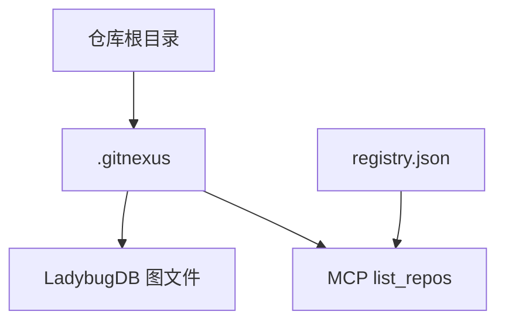

<details>
<summary>相关源文件</summary>

生成本页时使用的主要源文件：

- [ARCHITECTURE.md](../../../project-repos/GitNexus/ARCHITECTURE.md)
- [README.md](../../../project-repos/GitNexus/README.md)
- [RUNBOOK.md](../../../project-repos/GitNexus/RUNBOOK.md)
- [GUARDRAILS.md](../../../project-repos/GitNexus/GUARDRAILS.md)
- [gitnexus/package.json](../../../project-repos/GitNexus/gitnexus/package.json)

</details>

# 图存储与持久化

索引产物写入各仓库下的 **`.gitnexus/`** 目录，使用 **LadybugDB**（`@ladybugdb/core` 依赖）承载图与查询；全局 **`~/.gitnexus/registry.json`** 记录已注册仓库，供 MCP `list_repos` 与资源 URI 解析发现。

## 持久化与发现



`ARCHITECTURE.md` 将 `repo-manager.ts`、`lbug-adapter.ts` 列为路径解析、注册表清理与图加载的核心模块；陈旧索引由 `staleness.ts` 对比 `lastCommit` 与当前 `HEAD` 向用户提示重新 `analyze`。

## 安全与运维边界

`GUARDRAILS.md` 与 `RUNBOOK.md` 描述贡献者与代理在操作图数据、Cypher、批量变更时的安全约定与排障流程（嵌入重建、索引损坏恢复等），实施前应通读并与 CI 质量门禁配合。

## 相关页面

- [MCP、CLI 与 HTTP 桥](mcp-cli-http-interfaces.md)
- [检索、向量与 Wiki](search-embeddings-and-wiki.md)

Sources: [ARCHITECTURE.md:18-27](../../../project-repos/GitNexus/ARCHITECTURE.md#L18-L27), [README.md:50-57](../../../project-repos/GitNexus/README.md#L50-L57), [RUNBOOK.md:1-80](../../../project-repos/GitNexus/RUNBOOK.md#L1-L80), [GUARDRAILS.md:1-60](../../../project-repos/GitNexus/GUARDRAILS.md#L1-L60), [gitnexus/package.json:54-64](../../../project-repos/GitNexus/gitnexus/package.json#L54-L64)

<details class="source-snippets">
<summary>引用源码</summary>

<!-- source-snippets:start -->

#### `ARCHITECTURE.md:18-27`

```markdown
1. **Ingestion** — `analyze.ts` → `runFullAnalysis` (`run-analyze.ts`) → `runPipelineFromRepo` (`pipeline.ts`). DAG of 12 phases builds a `KnowledgeGraph` in memory, then loads into LadybugDB under `.gitnexus/`. Repo registered in `~/.gitnexus/registry.json` for MCP discovery.

2. **Persistence** — `repo-manager.ts` (paths, registry, KuzuDB cleanup). `lbug-adapter.ts` (graph load, queries, embedding batches).

3. **Query layer** — three interfaces to the same backend:
   - **MCP (stdio):** `mcp.ts` → `LocalBackend` → tools (`tools.ts`) + resources (`resources.ts`)
   - **HTTP bridge:** `serve.ts` → Express (`api.ts`, `mcp-http.ts`) for web UI
   - **CLI direct:** `gitnexus query|context|impact|cypher` in `tool.ts`

4. **Staleness** — `staleness.ts` compares indexed `lastCommit` to `HEAD`, surfaces hints.
```

#### `README.md:50-57`

```markdown
|                   | **CLI + MCP**                                            | **Web UI**                                             |
| ----------------- | -------------------------------------------------------------- | ------------------------------------------------------------ |
| **What**    | Index repos locally, connect AI agents via MCP                 | Visual graph explorer + AI chat in browser                   |
| **For**     | Daily development with Cursor, Claude Code, Codex, Windsurf, OpenCode | Quick exploration, demos, one-off analysis                   |
| **Scale**   | Full repos, any size                                           | Limited by browser memory (~5k files), or unlimited via backend mode |
| **Install** | `npm install -g gitnexus`                                    | No install — [gitnexus.vercel.app](https://gitnexus.vercel.app) |
| **Storage** | LadybugDB native (fast, persistent)                               | LadybugDB WASM (in-memory, per session)                         |
| **Parsing** | Tree-sitter native bindings                                    | Tree-sitter WASM                                             |
```

#### `RUNBOOK.md:1-80`

````markdown
# Runbook — GitNexus

Short, copy-paste operations for **local development**, **MCP**, and **CI**. Commands assume a Unix shell; on Windows use Git Bash or equivalent paths.

## Prerequisites

- **Node.js** ≥ 20 (`gitnexus-web/package.json` `engines`).  
- **Git** (analyze requires a git repository).  
- From repo root, install and build the CLI package:

```bash
cd gitnexus
npm install
npm run build
```

Use `npx gitnexus …` from any path after global/published install, or `node dist/cli/index.js …` when developing from `gitnexus/` with a local build.

---

## Index out of date / “stale” tools

**Symptom:** MCP or resources warn the index is behind `HEAD`, or results don’t reflect recent commits.

**Fix (from the target repo root):**

```bash
npx gitnexus analyze
```

**Force full rebuild** (same commit but suspect corruption or changed ignore rules):

```bash
npx gitnexus analyze --force
```

**Check status:**

```bash
npx gitnexus status
```

**List what MCP knows about:**

```bash
npx gitnexus list
```

---

## Embeddings

**First time with vectors** (slower, more disk/RAM):

```bash
npx gitnexus analyze --embeddings
```

**Important:** If you already had embeddings, **always** pass `--embeddings` on later analyzes, or they can be dropped. See `stats.embeddings` in `.gitnexus/meta.json` (0 means none).

**Large repos:** Analyze may skip or limit embedding work when node counts are very high; watch CLI output.

---

## MCP: no repos / empty tools

**Symptom:** `GitNexus: No indexed repos yet` on stderr when starting MCP.

**Fix:** In each project you want indexed:

```bash
cd /path/to/repo
npx gitnexus analyze
```

Restart the editor MCP session if needed. The server **refreshes the registry lazily**; new analyzes are picked up without necessarily reinstalling MCP.

**Symptom:** Wrong repo when multiple are indexed — pass `repo` on tools or use `list_repos` first.

---
````

#### `GUARDRAILS.md:1-60`

```markdown
# Guardrails — GitNexus

Rules for **human contributors** and **AI agents**. Complements `AGENTS.md` (workflows) and `CONTRIBUTING.md` (PR process).

## Scope (least privilege)

- **Read:** Source, tests, docs, public config as needed.
- **Write:** Only files required for the fix or feature; no unrelated formatting or refactors.
- **Execute:** Tests, typecheck, documented CLI commands. No destructive commands on user data without approval.
- **Off-limits:** Other people's machines, production deployments you don't own, credentials you lack permission to use.

Maintainer may widen scope per task.

---

## Non-negotiables

1. **Never commit secrets** — API keys, tokens, real `.env` values, private URLs, session cookies. Use `.env.example` with placeholders.
2. **Never rename with find-and-replace** in GitNexus-indexed projects — use `rename` MCP tool with `dry_run: true` first, review `graph` vs `text_search` edits. No separate `gitnexus rename` CLI exists.
3. **Run impact analysis before editing shared symbols** — `impact` (upstream) for functions/classes/methods others call. Do not ignore HIGH/CRITICAL without maintainer sign-off.
4. **Run `detect_changes` before commit** — confirm diffs map to expected symbols/processes when the graph is available.
5. **Preserve embeddings** — plain `npx gitnexus analyze` now preserves any embeddings recorded in `.gitnexus/meta.json` (the previous behavior wiped them). Use `--embeddings` to also generate vectors for new/changed nodes; use `--drop-embeddings` only when an explicit wipe is intended (e.g., model swap).

---

## Signs (recurring failure patterns)

Format: **Trigger → Instruction → Reason**. Append new Signs when the same mistake repeats.

### Stale graph after edits

- **Trigger:** MCP warns index is behind `HEAD`, or search doesn't match latest commit.
- **Do:** `npx gitnexus analyze` (plus `--embeddings` if used).
- **Why:** Tools query LadybugDB from last analyze; git changes are invisible until re-indexed.

### Embeddings vanished after analyze

- **Trigger:** Semantic search quality drops; `stats.embeddings` in `meta.json` is 0 after refresh.
- **Do:** Re-run `npx gitnexus analyze --embeddings` to regenerate. Check the analyze log for a `Warning: could not load cached embeddings` line — if present, the cache restore failed (corrupt DB / schema mismatch) and the rebuild had nothing to preserve. If you intentionally passed `--drop-embeddings`, this is expected.
- **Why:** Plain `analyze` preserves prior vectors by re-inserting them after the rebuild; the only ways to end up at zero are an explicit `--drop-embeddings`, a cache-load failure (now logged), or a model/dimension change that invalidates the cache.

### MCP lists no repos

- **Trigger:** MCP stderr says no indexed repos.
- **Do:** `npx gitnexus analyze` in the target repo; verify `npx gitnexus list` shows it.
- **Why:** MCP discovers repos via `~/.gitnexus/registry.json`, populated by analyze.

### Wrong repo in multi-repo setups

- **Trigger:** Query/impact results belong to another project.
- **Do:** Call `list_repos`, then pass `repo` on subsequent tools.
- **Why:** Default target is ambiguous when multiple repos are registered.

### LadybugDB lock / "database busy"

- **Trigger:** Errors opening `.gitnexus/lbug` while MCP and analyze both run.
- **Do:** Stop overlapping processes (one writer at a time). Retry analyze or restart MCP.
- **Why:** Embedded DB expects single-process ownership.

---
```

#### `gitnexus/package.json:54-64`

```json
  "dependencies": {
    "@huggingface/transformers": "^4.1.0",
    "@ladybugdb/core": "^0.16.0",
    "@modelcontextprotocol/sdk": "^1.0.0",
    "@scarf/scarf": "^1.4.0",
    "cli-progress": "^3.12.0",
    "commander": "^14.0.3",
    "cors": "^2.8.5",
    "express": "^4.19.2",
    "glob": "^13.0.6",
    "graphology": "^0.26.0",
```

<!-- source-snippets:end -->
</details>
