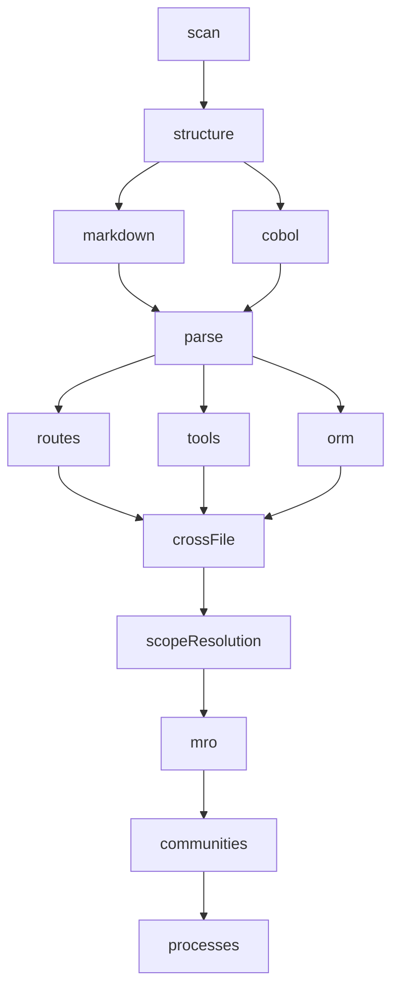

<details>
<summary>相关源文件</summary>

生成本页时使用的主要源文件：

- [gitnexus/src/core/ingestion/pipeline.ts](https://github.com/abhigyanpatwari/GitNexus/blob/7f8b01d5068495af2f4b07f1f91bc4c1e7b82fe0/gitnexus/src/core/ingestion/pipeline.ts)
- [gitnexus/src/core/ingestion/pipeline-phases/index.ts](https://github.com/abhigyanpatwari/GitNexus/blob/7f8b01d5068495af2f4b07f1f91bc4c1e7b82fe0/gitnexus/src/core/ingestion/pipeline-phases/index.ts)
- [gitnexus/src/core/ingestion/pipeline-phases/runner.ts](https://github.com/abhigyanpatwari/GitNexus/blob/7f8b01d5068495af2f4b07f1f91bc4c1e7b82fe0/gitnexus/src/core/ingestion/pipeline-phases/runner.ts)
- [gitnexus/src/core/ingestion/call-processor.ts](https://github.com/abhigyanpatwari/GitNexus/blob/7f8b01d5068495af2f4b07f1f91bc4c1e7b82fe0/gitnexus/src/core/ingestion/call-processor.ts)
- [ARCHITECTURE.md](https://github.com/abhigyanpatwari/GitNexus/blob/7f8b01d5068495af2f4b07f1f91bc4c1e7b82fe0/ARCHITECTURE.md)

</details>

# 索引流水线

ingestion 由 **具名阶段（phase）** 组成，阶段之间通过显式 `deps` 构成 DAG，由 `runner.ts` 做拓扑排序后顺序执行；各阶段在共享的 `PipelineContext` 上向同一 `KnowledgeGraph` 累积节点与边。

## 阶段注册与可选裁剪

`pipeline.ts` 中 `buildPhaseList` 按固定顺序注册阶段；当 `skipGraphPhases` 为真时跳过 MRO、社区与进程相关阶段以加速测试。

实际导出顺序（节选）为：`scan` → `structure` → `markdown` / `cobol` → `parse` → `routes` / `tools` / `orm` → `crossFile` → **`scopeResolution`** → `mro` → `communities` → `processes`（后三者可被跳过）。



## Runner 设计要点

- 拓扑校验：重复名、缺失依赖、环检测。
- 每个阶段仅接收**声明依赖**的上游输出，避免隐式耦合。
- 错误包装为带阶段名的信息并上报进度事件。

## 调用解析子 DAG

`parse` 阶段内部的 `call-processor` 实现多阶段调用解析（提取 → 分类 → 接收者推断 → 分派选择 → 目标解析 → 写边）。语言特定行为通过 `LanguageProvider` 上的可选钩子注入（如隐式 `self` 与自定义分派），与 import 解析、类型抽取等解耦。

## 相关页面

- [图存储与持久化](graph-storage-and-schema.md)
- [检索、向量与 Wiki](search-embeddings-and-wiki.md)

Sources: [gitnexus/src/core/ingestion/pipeline.ts:62-91](../../../project-repos/GitNexus/gitnexus/src/core/ingestion/pipeline.ts#L62-L91), [gitnexus/src/core/ingestion/pipeline-phases/index.ts:10-31](../../../project-repos/GitNexus/gitnexus/src/core/ingestion/pipeline-phases/index.ts#L10-L31), [gitnexus/src/core/ingestion/pipeline-phases/runner.ts:1-38](../../../project-repos/GitNexus/gitnexus/src/core/ingestion/pipeline-phases/runner.ts#L1-L38), [gitnexus/src/core/ingestion/call-processor.ts:11-31](../../../project-repos/GitNexus/gitnexus/src/core/ingestion/call-processor.ts#L11-L31), [ARCHITECTURE.md:76-115](../../../project-repos/GitNexus/ARCHITECTURE.md#L76-L115)

<details class="source-snippets">
<summary>引用源码</summary>

<!-- source-snippets:start -->

#### `gitnexus/src/core/ingestion/pipeline.ts:62-91`

```typescript
/**
 * All pipeline phases with their dependency relationships.
 *
 * Phase dependency graph:
 *
 *   scan → structure → [markdown, cobol] → parse → [routes, tools, orm]
 *     → crossFile → mro → communities → processes
 *
 * To add a new phase: create a file in pipeline-phases/, export the phase
 * object, and add it to the appropriate position in this array.
 */
function buildPhaseList(options?: PipelineOptions): PipelinePhase[] {
  const phases: PipelinePhase[] = [
    scanPhase,
    structurePhase,
    markdownPhase,
    cobolPhase,
    parsePhase,
    routesPhase,
    toolsPhase,
    ormPhase,
    crossFilePhase,
    scopeResolutionPhase,
  ];

  if (!options?.skipGraphPhases) {
    phases.push(mroPhase, communitiesPhase, processesPhase);
  }

  return phases;
```

#### `gitnexus/src/core/ingestion/pipeline-phases/index.ts:10-31`

```typescript
export { scanPhase, type ScanOutput } from './scan.js';
export { structurePhase, type StructureOutput } from './structure.js';
export { markdownPhase, type MarkdownOutput } from './markdown.js';
export { cobolPhase, type CobolOutput } from './cobol.js';
export { parsePhase, type ParseOutput } from './parse.js';
export { routesPhase, type RoutesOutput, type RouteEntry } from './routes.js';
export { toolsPhase, type ToolsOutput, type ToolDef } from './tools.js';
export { ormPhase, type ORMOutput } from './orm.js';
export { crossFilePhase, type CrossFileOutput } from './cross-file.js';
export {
  scopeResolutionPhase,
  type ScopeResolutionOutput,
} from '../scope-resolution/pipeline/phase.js';
export { mroPhase, type MROOutput } from './mro.js';
export { communitiesPhase, type CommunitiesOutput } from './communities.js';
export { processesPhase, type ProcessesOutput } from './processes.js';

// ── Infrastructure ─────────────────────────────────────────────────────────

export { runPipeline } from './runner.js';
export type { PipelinePhase, PipelineContext, PhaseResult } from './types.js';
export { getPhaseOutput } from './types.js';
```

#### `gitnexus/src/core/ingestion/pipeline-phases/runner.ts:1-38`

```typescript
/**
 * Pipeline Phase Runner
 *
 * Executes pipeline phases in dependency order using Kahn's topological sort.
 * Each phase receives typed outputs from its upstream dependencies.
 *
 * The runner is intentionally simple:
 * - No dynamic phase loading
 * - No plugin system
 * - Static phase graph, compile-time type safety
 * - Sequential execution (parallel support is architecturally possible
 *   but most phases have linear dependencies)
 */

import type { PipelinePhase, PipelineContext, PhaseResult } from './types.js';
import { isDev } from '../utils/env.js';

/**
 * Validate that the phases form a valid dependency graph (no cycles, all deps present).
 * Returns phases in topological execution order.
 */
function topologicalSort(phases: readonly PipelinePhase[]): PipelinePhase[] {
  const phaseMap = new Map<string, PipelinePhase>();
  for (const phase of phases) {
    if (phaseMap.has(phase.name)) {
      throw new Error(`Duplicate phase name: '${phase.name}'`);
    }
    phaseMap.set(phase.name, phase);
  }

  // Validate all deps exist
  for (const phase of phases) {
    for (const dep of phase.deps) {
      if (!phaseMap.has(dep)) {
        throw new Error(`Phase '${phase.name}' depends on '${dep}', which is not registered`);
      }
    }
  }
```

#### `gitnexus/src/core/ingestion/call-processor.ts:11-31`

```typescript
/**
 * DAG stage 4 fallback: used when `selectDispatch` is absent or returns null.
 * Preserves pre-DAG dispatch semantics:
 *   - 'constructor'         → constructor branch
 *   - 'free'                → free branch (admits class-target fast path)
 *   - 'member' or undefined → owner-scoped branch
 *
 * `undefined` callForm MUST route through owner-scoped (not free) so bare
 * identifiers without a classified shape do NOT trigger `resolveFreeCall`'s
 * class-target fast path. Without a `receiverTypeName`, the owner-scoped
 * branch falls through to `resolveModuleAliasedCall` + `singleCandidate`,
 * matching legacy behavior where non-callable symbols (Class, Interface)
 * null-route instead of producing spurious Constructor edges.
 */
const defaultDispatchDecision = (
  callForm: 'free' | 'member' | 'constructor' | undefined,
): DispatchDecision => {
  if (callForm === 'constructor') return { primary: 'constructor' };
  if (callForm === 'free') return { primary: 'free' };
  return { primary: 'owner-scoped' };
};
```

#### `ARCHITECTURE.md:76-115`

````markdown
---

## Pipeline Phase DAG

12 phases defined in `gitnexus/src/core/ingestion/pipeline-phases/`, each with explicit `deps` and typed output.

```
scan → structure → [markdown, cobol] → parse → [routes, tools, orm]
  → crossFile → mro → communities → processes
```

| Phase | File | Deps | Output |
|-------|------|------|--------|
| `scan` | `scan.ts` | (root) | File paths + sizes |
| `structure` | `structure.ts` | `scan` | File/Folder nodes, CONTAINS edges, `allPathSet` |
| `markdown` | `markdown.ts` | `structure` | Section nodes, cross-link edges from .md/.mdx |
| `cobol` | `cobol.ts` | `structure` | COBOL program/paragraph/section nodes (regex, no tree-sitter) |
| `parse` | `parse.ts` + `parse-impl.ts` | `structure`, `markdown`, `cobol` | Symbol nodes, IMPORTS/CALLS/EXTENDS edges, extracted routes/tools/ORM queries |
| `routes` | `routes.ts` | `parse` | Route nodes + HANDLES_ROUTE edges (Next.js, Expo, PHP, decorators) |
| `tools` | `tools.ts` | `parse` | Tool nodes + HANDLES_TOOL edges |
| `orm` | `orm.ts` | `parse` | QUERIES edges (Prisma, Supabase) |
| `crossFile` | `cross-file.ts` + `cross-file-impl.ts` | `parse`, `routes`, `tools`, `orm` | Cross-file type propagation in topological import order |
| `mro` | `mro.ts` | `crossFile`, `structure` | METHOD_OVERRIDES + METHOD_IMPLEMENTS edges |
| `communities` | `communities.ts` | `mro`, `structure` | Community nodes + MEMBER_OF edges (Leiden algorithm) |
| `processes` | `processes.ts` | `communities`, `routes`, `tools`, `structure` | Process nodes + STEP_IN_PROCESS edges |

**Non-phase files in the same directory:** `parse-impl.ts`, `cross-file-impl.ts` (implementation), `wildcard-synthesis.ts` (whole-module import expansion), `orm-extraction.ts` (sequential ORM fallback), `types.ts`, `runner.ts`, `index.ts`.

### DAG runner

`runner.ts` — static phase graph, no plugins, compile-time type safety.

1. **Validation** — Kahn's topological sort. Rejects on: duplicate names, missing deps, cycles (DFS traces the concrete cycle path, e.g., `A -> B -> C -> A`, plus count of transitively blocked dependents).

2. **Execution** — sequential in topological order. Each phase receives:
   - `ctx: PipelineContext` — shared mutable `KnowledgeGraph`, `repoPath`, progress callback, options
   - `deps: ReadonlyMap<string, PhaseResult>` — **declared deps only** (runner filters the results map to prevent hidden coupling)

3. **Error handling** — wraps phase errors with the phase name, emits terminal `error` progress event, swallows progress handler errors to preserve the original cause.

````

<!-- source-snippets:end -->
</details>
