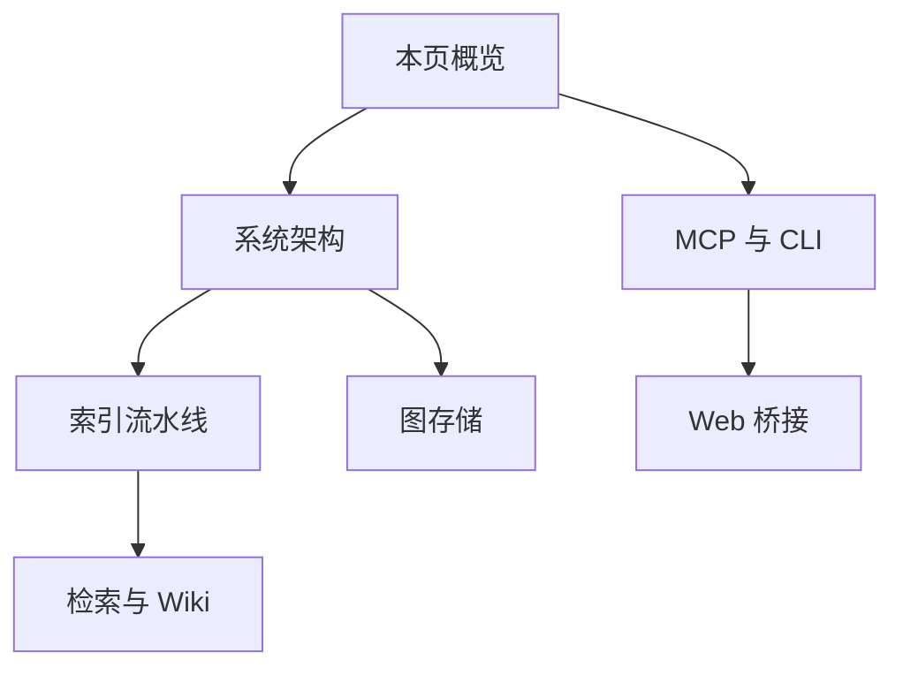

<details>
<summary>相关源文件</summary>

生成本页时使用的主要源文件：

- [README.md](../../../project-repos/GitNexus/README.md)
- [CONTRIBUTING.md](../../../project-repos/GitNexus/CONTRIBUTING.md)
- [CHANGELOG.md](../../../project-repos/GitNexus/CHANGELOG.md)
- [gitnexus/package.json](../../../project-repos/GitNexus/gitnexus/package.json)
- [gitnexus-shared/package.json](../../../project-repos/GitNexus/gitnexus-shared/package.json)

</details>

# 项目概览

GitNexus 将任意代码库静态索引为**知识图谱**（依赖、调用链、聚类、执行流等），并通过 **MCP、CLI 与可选 Web UI** 暴露给 Cursor、Claude Code、Codex 等代理，目标是让代理在修改代码前获得可验证的结构化上下文，而不是仅凭自然语言摘要。

仓库为 **monorepo**：核心 npm 包 `gitnexus` 负责索引与 MCP；`gitnexus-web` 为浏览器内的图探索与对话客户端；`gitnexus-shared` 承载共享类型。另有 `gitnexus-claude-plugin`、`gitnexus-cursor-integration` 等目录存放面向不同编辑器的 **Skills** 与插件元数据。

## 产品形态对比

| 维度 | CLI + MCP | Web UI |
|------|-----------|--------|
| 典型场景 | 日常开发、编辑器内深度分析 | 快速探索、演示 |
| 安装 | `npm install -g gitnexus` 或 `npx` | 无需安装，托管站点或本地构建 |
| 隐私与网络 | 本地索引，无网络依赖（按 README 描述） | 浏览器内 WASM 等模式 |

**Bridge 模式**：`gitnexus serve` 将本地已索引仓库通过 HTTP 暴露给 Web UI，避免重复上传与重复索引。

## 阅读路线建议



## 合规与许可

项目采用 **PolyForm Noncommercial** 许可；README 明确声明无官方加密货币，并区分开源社区版与企业版（SaaS / 自托管）能力边界。

## 相关页面

- [系统架构](system-architecture.md)
- [MCP、CLI 与 HTTP 桥](mcp-cli-http-interfaces.md)

Sources: [README.md:26-58](../../../project-repos/GitNexus/README.md#L26-L58), [README.md:94-123](../../../project-repos/GitNexus/README.md#L94-L123), [gitnexus/package.json:1-41](../../../project-repos/GitNexus/gitnexus/package.json#L1-L41), [CONTRIBUTING.md:1-40](../../../project-repos/GitNexus/CONTRIBUTING.md#L1-L40), [CHANGELOG.md:1-30](../../../project-repos/GitNexus/CHANGELOG.md#L1-L30)

<details class="source-snippets">
<summary>引用源码</summary>

<!-- source-snippets:start -->

#### `README.md:26-58`

```markdown
**Building nervous system for agent context.**

Indexes any codebase into a knowledge graph — every dependency, call chain, cluster, and execution flow — then exposes it through smart tools so AI agents never miss code.


https://github.com/user-attachments/assets/172685ba-8e54-4ea7-9ad1-e31a3398da72


> *Like DeepWiki, but deeper.* DeepWiki helps you *understand* code. GitNexus lets you *analyze* it — because a knowledge graph tracks every relationship, not just descriptions.

**TL;DR:** The **Web UI** is a quick way to chat with any repo. The **CLI + MCP** is how you make your AI agent actually reliable — it gives Cursor, Claude Code, Codex, and friends a deep architectural view of your codebase so they stop missing dependencies, breaking call chains, and shipping blind edits. Even smaller models get full architectural clarity, making it compete with Goliath models.

---

## Star History

[](https://www.star-history.com/#abhigyanpatwari/GitNexus&type=date&legend=top-left)


## Two Ways to Use GitNexus

|                   | **CLI + MCP**                                            | **Web UI**                                             |
| ----------------- | -------------------------------------------------------------- | ------------------------------------------------------------ |
| **What**    | Index repos locally, connect AI agents via MCP                 | Visual graph explorer + AI chat in browser                   |
| **For**     | Daily development with Cursor, Claude Code, Codex, Windsurf, OpenCode | Quick exploration, demos, one-off analysis                   |
| **Scale**   | Full repos, any size                                           | Limited by browser memory (~5k files), or unlimited via backend mode |
| **Install** | `npm install -g gitnexus`                                    | No install — [gitnexus.vercel.app](https://gitnexus.vercel.app) |
| **Storage** | LadybugDB native (fast, persistent)                               | LadybugDB WASM (in-memory, per session)                         |
| **Parsing** | Tree-sitter native bindings                                    | Tree-sitter WASM                                             |
| **Privacy** | Everything local, no network                                   | Everything in-browser, no server                             |
```

#### `README.md:94-123`

````markdown
## CLI + MCP (recommended)

The CLI indexes your repository and runs an MCP server that gives AI agents deep codebase awareness.

### Quick Start

```bash
# Index your repo (run from repo root)
npx gitnexus analyze
```

That's it. This indexes the codebase, installs agent skills, registers Claude Code hooks, and creates `AGENTS.md` / `CLAUDE.md` context files — all in one command.

To configure MCP for your editor, run `npx gitnexus setup` once — or set it up manually below.

### MCP Setup

`gitnexus setup` auto-detects your editors and writes the correct global MCP config. You only need to run it once.

### Editor Support

| Editor                | MCP | Skills | Hooks (auto-augment) | Support        |
| --------------------- | --- | ------ | -------------------- | -------------- |
| **Claude Code** | Yes | Yes    | Yes (PreToolUse + PostToolUse) | **Full** |
| **Cursor**      | Yes | Yes    | —                   | MCP + Skills   |
| **Codex**       | Yes | Yes    | —                   | MCP + Skills   |
| **Windsurf**    | Yes | —     | —                   | MCP            |
| **OpenCode**    | Yes | Yes    | —                   | MCP + Skills   |

> **Claude Code** gets the deepest integration: MCP tools + agent skills + PreToolUse hooks that enrich searches with graph context + PostToolUse hooks that detect a stale index after commits and prompt the agent to reindex.
````

#### `gitnexus/package.json:1-41`

```json
{
  "name": "gitnexus",
  "version": "1.6.3",
  "description": "Graph-powered code intelligence for AI agents. Index any codebase, query via MCP or CLI.",
  "author": "Abhigyan Patwari",
  "license": "PolyForm-Noncommercial-1.0.0",
  "homepage": "https://github.com/abhigyanpatwari/GitNexus#readme",
  "repository": {
    "type": "git",
    "url": "git+https://github.com/abhigyanpatwari/GitNexus.git",
    "directory": "gitnexus"
  },
  "bugs": {
    "url": "https://github.com/abhigyanpatwari/GitNexus/issues"
  },
  "keywords": [
    "mcp",
    "model-context-protocol",
    "code-intelligence",
    "knowledge-graph",
    "cursor",
    "claude",
    "codex",
    "ai-agent",
    "gitnexus",
    "static-analysis",
    "codebase-indexing"
  ],
  "type": "module",
  "bin": {
    "gitnexus": "dist/cli/index.js"
  },
  "files": [
    "dist",
    "hooks",
    "scripts",
    "skills",
    "vendor",
    "web"
  ],
  "scripts": {
```

#### `CONTRIBUTING.md:1-40`

```markdown
# Contributing to GitNexus

How to propose changes, run checks locally, and open pull requests.

## License

This project uses the [PolyForm Noncommercial License 1.0.0](https://polyformproject.org/licenses/noncommercial/1.0.0/). By contributing, you agree your contributions are licensed under the same terms unless stated otherwise.

## Where to discuss

- **Issues & feature ideas:** use [GitHub Issues](https://github.com/abhigyanpatwari/GitNexus/issues) for the upstream repo, or your fork’s tracker if you work from a fork.
- **Community:** see the Discord link in the root [README.md](README.md).

## Development setup

1. Clone the repository.
2. **CLI / MCP package:** `cd gitnexus && npm install && npm run build`
3. **Web UI (if needed):** `cd gitnexus-web && npm install`
4. Run tests as described in [TESTING.md](TESTING.md).

## Branch and pull requests

- Use short-lived branches off the default branch of the repo you are targeting.
- **PR titles MUST follow the conventional-commit format** — `pr-labeler.yml` enforces this on every PR and auto-applies the matching label so release notes group the change correctly.
- **PR description:** what changed, why, how to verify (commands), and any risk or rollback notes.

### Pull request titles

Format: `<type>[(scope)][!]: <subject>`

Allowed types and the release-notes section each one lands in (defined in `.github/release.yml`):

| Type | Label applied | Release-notes section |
|------|---------------|-----------------------|
| `feat` | `enhancement` | 🚀 Features |
| `fix` | `bug` | 🐛 Bug Fixes |
| `perf` | `performance` | 🏎️ Performance |
| `refactor` | `refactor` | 🔄 Refactoring |
| `test` | `test` | 🧪 Tests |
| `ci` | `ci` | 👷 CI/CD |
```

#### `CHANGELOG.md:1-30`

```markdown
# Changelog

All notable changes to GitNexus will be documented in this file.

## [Unreleased]

### Changed
- Migrated from KuzuDB to LadybugDB v0.15 (`@ladybugdb/core`, `@ladybugdb/wasm-core`)
- Renamed all internal paths from `kuzu` to `lbug` (storage: `.gitnexus/kuzu` → `.gitnexus/lbug`)
- Added automatic cleanup of stale KuzuDB index files
- LadybugDB v0.15 requires explicit VECTOR extension loading for semantic search

## [1.5.3] - 2026-04-01

### Added

- **TypeScript/JavaScript MethodExtractor config** — shared extraction config covering abstract methods, visibility modifiers, async/override keywords, decorators, rest/optional/destructured parameters, and return types (#588) — @compound-ai

### Fixed

- **Azure OpenAI compatibility** — use `max_completion_tokens` instead of deprecated `max_tokens` (newer models reject `max_tokens`); skip `temperature` for Azure provider (some models reject non-default values) (#618)
- **Simplified Azure interactive setup** — 3 prompts (endpoint, deployment, key) instead of 7 (#618)
- **Wiki HTML viewer script injection** — escape `</script>` in embedded JSON so LLM-generated markdown no longer breaks the viewer (#618)
- Ensure import rewrites survive npm publish lifecycle

## [1.4.0] - 2026-03-13

### Added

- **Language-aware symbol resolution engine** with 3-tier resolver: exact FQN → scope-walk → guarded fuzzy fallback that refuses ambiguous matches (#238) — @magyargergo
```

<!-- source-snippets:end -->
</details>
