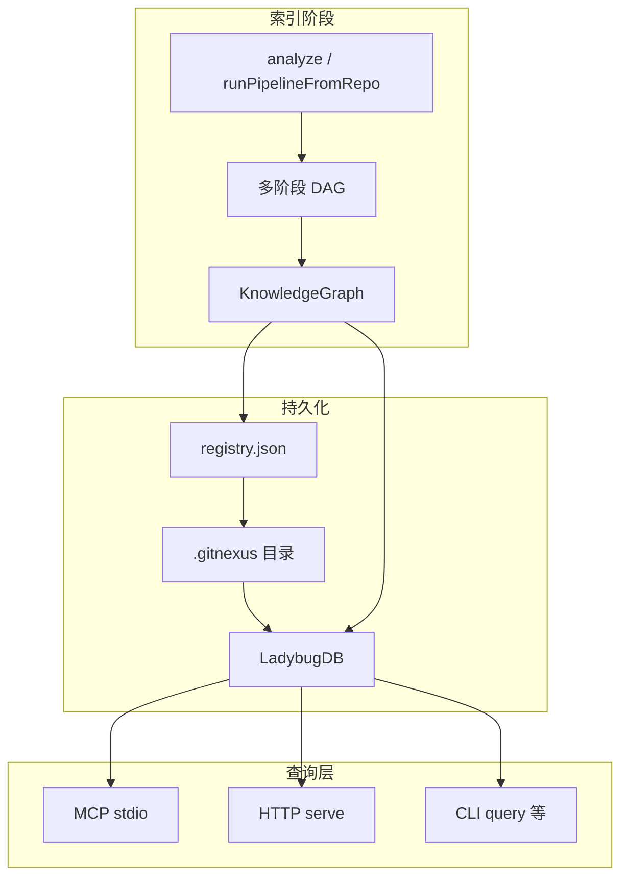

<details>
<summary>相关源文件</summary>

生成本页时使用的主要源文件：

- [ARCHITECTURE.md](https://github.com/abhigyanpatwari/GitNexus/blob/7f8b01d5068495af2f4b07f1f91bc4c1e7b82fe0/ARCHITECTURE.md)
- [gitnexus/package.json](https://github.com/abhigyanpatwari/GitNexus/blob/7f8b01d5068495af2f4b07f1f91bc4c1e7b82fe0/gitnexus/package.json)
- [gitnexus-web/package.json](https://github.com/abhigyanpatwari/GitNexus/blob/7f8b01d5068495af2f4b07f1f91bc4c1e7b82fe0/gitnexus-web/package.json)
- [gitnexus-shared/package.json](https://github.com/abhigyanpatwari/GitNexus/blob/7f8b01d5068495af2f4b07f1f91bc4c1e7b82fe0/gitnexus-shared/package.json)
- [RUNBOOK.md](https://github.com/abhigyanpatwari/GitNexus/blob/7f8b01d5068495af2f4b07f1f91bc4c1e7b82fe0/RUNBOOK.md)

</details>

# 系统架构

GitNexus 采用「**索引 → 图持久化 → 多入口查询**」的单后端、多前端架构：同一套 LadybugDB 中的图数据可被 MCP（stdio）、HTTP（`serve` + Express）以及 CLI 子命令消费。

## Monorepo 包职责

| 路径 | 职责 |
|------|------|
| `gitnexus/` | npm 包 `gitnexus`：CLI、MCP、ingestion、图、嵌入、Wiki 生成等 |
| `gitnexus-web/` | Vite + React：图可视化与 AI 对话，经 HTTP API 访问后端 |
| `gitnexus-shared/` | CLI 与 Web 共用的 TypeScript 类型与常量 |
| `eval/` | 工具使用与检索类评测脚手架 |
| `.github/` | CI 与 composite actions |

## 端到端数据流



## 变更热点速查

维护者可按关注点直达实现目录，例如 CLI 在 `gitnexus/src/cli/`，ingestion 阶段在 `gitnexus/src/core/ingestion/pipeline-phases/`，MCP 工具在 `gitnexus/src/mcp/tools.ts`，跨仓组逻辑在 `gitnexus/src/core/group/`（详见 ARCHITECTURE 中的表格）。

## 相关页面

- [索引流水线](ingestion-pipeline.md)
- [MCP、CLI 与 HTTP 桥](mcp-cli-http-interfaces.md)

Sources: [ARCHITECTURE.md:1-72](../../../project-repos/GitNexus/ARCHITECTURE.md#L1-L72), [ARCHITECTURE.md:16-27](../../../project-repos/GitNexus/ARCHITECTURE.md#L16-L27), [gitnexus/package.json:29-52](../../../project-repos/GitNexus/gitnexus/package.json#L29-L52), [gitnexus-web/package.json:1-19](../../../project-repos/GitNexus/gitnexus-web/package.json#L1-L19), [RUNBOOK.md:1-50](../../../project-repos/GitNexus/RUNBOOK.md#L1-L50)

<details class="source-snippets">
<summary>引用源码</summary>

<!-- source-snippets:start -->

#### `ARCHITECTURE.md:1-72`

```markdown
# Architecture — GitNexus

Monorepo: **CLI/MCP** (`gitnexus/`) + **browser UI** (`gitnexus-web/`).

## Repository layout

| Path | Role |
|------|------|
| `gitnexus/` | npm package `gitnexus`: CLI, MCP server (stdio), HTTP API, ingestion pipeline, LadybugDB graph, embeddings. |
| `gitnexus-web/` | Vite + React thin client: graph explorer + AI chat. All queries via `gitnexus serve` HTTP API. |
| `gitnexus-shared/` | Shared TypeScript types and constants (consumed by CLI and Web). |
| `.claude/`, `gitnexus-claude-plugin/`, `gitnexus-cursor-integration/` | Agent skills and plugin metadata. |
| `eval/` | Evaluation harnesses for benchmarking tool usage. |
| `.github/` | CI workflows + composite actions (`setup-gitnexus/`, `setup-gitnexus-web/`). |

## End-to-end flow: index → graph → tools

1. **Ingestion** — `analyze.ts` → `runFullAnalysis` (`run-analyze.ts`) → `runPipelineFromRepo` (`pipeline.ts`). DAG of 12 phases builds a `KnowledgeGraph` in memory, then loads into LadybugDB under `.gitnexus/`. Repo registered in `~/.gitnexus/registry.json` for MCP discovery.

2. **Persistence** — `repo-manager.ts` (paths, registry, KuzuDB cleanup). `lbug-adapter.ts` (graph load, queries, embedding batches).

3. **Query layer** — three interfaces to the same backend:
   - **MCP (stdio):** `mcp.ts` → `LocalBackend` → tools (`tools.ts`) + resources (`resources.ts`)
   - **HTTP bridge:** `serve.ts` → Express (`api.ts`, `mcp-http.ts`) for web UI
   - **CLI direct:** `gitnexus query|context|impact|cypher` in `tool.ts`

4. **Staleness** — `staleness.ts` compares indexed `lastCommit` to `HEAD`, surfaces hints.

## MCP tools

| Tool | Purpose |
|------|---------|
| `list_repos` | Discover indexed repos |
| `query` | Hybrid BM25 + vector search over the graph |
| `cypher` | Ad hoc Cypher against the schema |
| `context` | Callers, callees, processes for one symbol |
| `impact` | Blast radius (upstream/downstream) with risk summary |
| `detect_changes` | Map git diffs to affected symbols and processes |
| `rename` | Graph-assisted multi-file rename with `dry_run` preview |
| `api_impact` | Pre-change impact report for an API route handler |
| `route_map` | API route → handler → consumer mappings |
| `tool_map` | MCP/RPC tool definitions and handlers |
| `shape_check` | Response shape vs consumer property access mismatches |
| `group_list` | List repo groups or details for one group |
| `group_sync` | Rebuild group Contract Registry (`contracts.json`) and bridge graph |

`query`, `context`, and `impact` are group-aware: pass `repo: "@<groupName>"` (or `"@<groupName>/<memberPath>"` to scope to one member) plus optional `service: "<monorepo/path>"`. Group-mode `query` merges per-repo results via Reciprocal Rank Fusion; group-mode `impact` runs the local walk in the chosen member and fans out across boundaries via the Contract Bridge (`gitnexus/src/core/group/cross-impact.ts`). The previously-planned `group_query`, `group_context`, `group_impact`, `group_contracts`, `group_status` MCP tools are intentionally not introduced — group-level state is exposed via resources instead:

| Resource URI | Purpose |
|--------------|---------|
| `gitnexus://group/{name}/contracts` | Contract Registry (provider/consumer rows + cross-links) |
| `gitnexus://group/{name}/status` | Per-member index + Contract Registry staleness |

## Where to change what

| Concern | Start in |
|---------|----------|
| CLI commands/flags | `src/cli/` (`index.ts`, per-command modules) |
| Parsing/graph construction | `src/core/ingestion/pipeline-phases/` + `pipeline.ts` |
| Graph schema/DB | `src/core/lbug/` (`schema.ts`, `lbug-adapter.ts`) |
| MCP tools/resources | `src/mcp/server.ts`, `tools.ts`, `resources.ts` |
| Cross-repo groups (sync, contracts, `@<group>` routing) | `src/core/group/` (`service.ts`, `cross-impact.ts`, `sync.ts`, `bridge-db.ts`) |
| Search ranking | `src/core/search/` (BM25, hybrid fusion) |
| Embeddings | `src/core/embeddings/` + `src/core/run-analyze.ts` |
| Wiki generation | `src/core/wiki/` |
| Language support | `src/core/ingestion/languages/` + `tree-sitter-queries.ts` + `gitnexus-shared/src/languages.ts` |
| Import resolution | `src/core/ingestion/import-processor.ts` + `import-resolvers/configs/` + `model/resolution-context.ts` |
| Call resolution/MRO | `src/core/ingestion/call-processor.ts` + `model/resolve.ts` |
| Type extraction | `src/core/ingestion/type-extractors/` |
| Worker pool | `src/core/ingestion/workers/` |
| Web UI | `gitnexus-web/src/` |
| CI | `.github/workflows/*.yml`, `.github/actions/` |
```

#### `ARCHITECTURE.md:16-27`

```markdown
## End-to-end flow: index → graph → tools

1. **Ingestion** — `analyze.ts` → `runFullAnalysis` (`run-analyze.ts`) → `runPipelineFromRepo` (`pipeline.ts`). DAG of 12 phases builds a `KnowledgeGraph` in memory, then loads into LadybugDB under `.gitnexus/`. Repo registered in `~/.gitnexus/registry.json` for MCP discovery.

2. **Persistence** — `repo-manager.ts` (paths, registry, KuzuDB cleanup). `lbug-adapter.ts` (graph load, queries, embedding batches).

3. **Query layer** — three interfaces to the same backend:
   - **MCP (stdio):** `mcp.ts` → `LocalBackend` → tools (`tools.ts`) + resources (`resources.ts`)
   - **HTTP bridge:** `serve.ts` → Express (`api.ts`, `mcp-http.ts`) for web UI
   - **CLI direct:** `gitnexus query|context|impact|cypher` in `tool.ts`

4. **Staleness** — `staleness.ts` compares indexed `lastCommit` to `HEAD`, surfaces hints.
```

#### `gitnexus/package.json:29-52`

```json
  "type": "module",
  "bin": {
    "gitnexus": "dist/cli/index.js"
  },
  "files": [
    "dist",
    "hooks",
    "scripts",
    "skills",
    "vendor",
    "web"
  ],
  "scripts": {
    "build": "node scripts/build.js",
    "serve": "tsx src/cli/index.ts serve",
    "dev": "tsx watch src/cli/index.ts",
    "test": "vitest run",
    "test:unit": "vitest run test/unit",
    "test:integration": "vitest run test/integration",
    "test:watch": "vitest",
    "test:coverage": "vitest run --coverage",
    "postinstall": "node scripts/build-tree-sitter-dart.cjs && node scripts/build-tree-sitter-proto.cjs",
    "prepare": "node scripts/build.js",
    "prepack": "node scripts/build.js"
```

#### `gitnexus-web/package.json:1-19`

```json
{
  "name": "gitnexus",
  "private": true,
  "version": "0.0.0",
  "engines": {
    "node": "^20.19.0 || >=22.12.0"
  },
  "type": "module",
  "scripts": {
    "dev": "vite",
    "build": "tsc -b && vite build",
    "preview": "vite preview",
    "test": "vitest run",
    "test:watch": "vitest",
    "test:coverage": "vitest run --coverage",
    "test:e2e": "playwright test",
    "test:e2e:ui": "playwright test --ui",
    "test:e2e:report": "playwright show-report"
  },
```

#### `RUNBOOK.md:1-50`

````markdown
# Runbook — GitNexus

Short, copy-paste operations for **local development**, **MCP**, and **CI**. Commands assume a Unix shell; on Windows use Git Bash or equivalent paths.

## Prerequisites

- **Node.js** ≥ 20 (`gitnexus-web/package.json` `engines`).  
- **Git** (analyze requires a git repository).  
- From repo root, install and build the CLI package:

```bash
cd gitnexus
npm install
npm run build
```

Use `npx gitnexus …` from any path after global/published install, or `node dist/cli/index.js …` when developing from `gitnexus/` with a local build.

---

## Index out of date / “stale” tools

**Symptom:** MCP or resources warn the index is behind `HEAD`, or results don’t reflect recent commits.

**Fix (from the target repo root):**

```bash
npx gitnexus analyze
```

**Force full rebuild** (same commit but suspect corruption or changed ignore rules):

```bash
npx gitnexus analyze --force
```

**Check status:**

```bash
npx gitnexus status
```

**List what MCP knows about:**

```bash
npx gitnexus list
```

---

````

<!-- source-snippets:end -->
</details>
