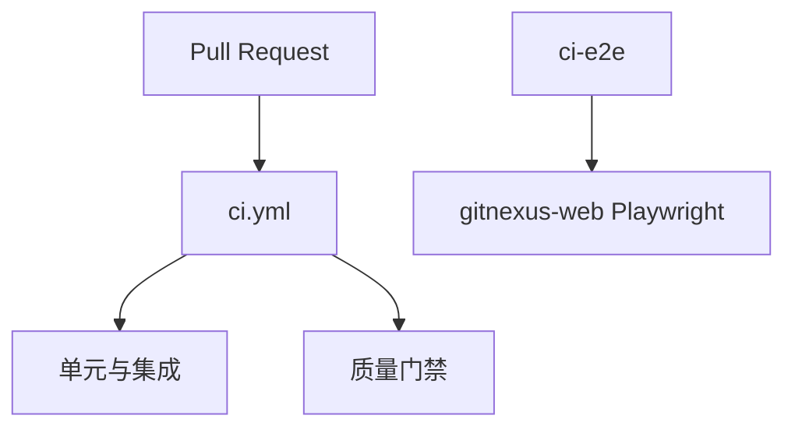

<details>
<summary>相关源文件</summary>

生成本页时使用的主要源文件：

- [TESTING.md](../../../project-repos/GitNexus/TESTING.md)
- [.github/workflows/ci.yml](../../../project-repos/GitNexus/.github/workflows/ci.yml)
- [RUNBOOK.md](../../../project-repos/GitNexus/RUNBOOK.md)
- [GUARDRAILS.md](../../../project-repos/GitNexus/GUARDRAILS.md)
- [gitnexus-web/package.json](../../../project-repos/GitNexus/gitnexus-web/package.json)

</details>

# 测试、CI 与运维

## 本地测试命令

`TESTING.md` 定义 `gitnexus` 包的 **单元 / 集成测试**（Vitest）以及 `gitnexus-web` 的 Vitest 与 **Playwright E2E** 命令；修改 CLI、ingestion 或前端路由时应按文档矩阵跑对应子集。

## CI 概览

`.github/workflows/` 下存在多条流水线，包括 **`ci.yml`**（主 CI）、`ci-tests.yml`、`ci-quality.yml`、`ci-e2e.yml`、`docker.yml`、`publish.yml` 等，配合 `.github/actions/setup-gitnexus/` 等 composite action 统一 Node 与依赖安装。



## 运维手册

`RUNBOOK.md` 覆盖索引异常、嵌入、MCP 恢复与 CI 片段；`GUARDRAILS.md` 约束高风险操作（例如大范围 Cypher、自动重构）的人类审查要求。

## 相关页面

- [Web UI 与本地桥接](web-ui-bridge.md)
- [图存储与持久化](graph-storage-and-schema.md)

Sources: [TESTING.md:1-100](../../../project-repos/GitNexus/TESTING.md#L1-L100), [github/workflows/ci.yml:1-80](../../../project-repos/GitNexus/.github/workflows/ci.yml#L1-L80), [RUNBOOK.md:1-100](../../../project-repos/GitNexus/RUNBOOK.md#L1-L100), [GUARDRAILS.md:1-80](../../../project-repos/GitNexus/GUARDRAILS.md#L1-L80), [gitnexus-web/package.json:13-18](../../../project-repos/GitNexus/gitnexus-web/package.json#L13-L18)

<details class="source-snippets">
<summary>引用源码</summary>

<!-- source-snippets:start -->

#### `TESTING.md:1-100`

````markdown
# Testing — GitNexus

How we structure tests and which commands to run locally and in CI.

## Packages

| Package        | Path           | Runner   | Notes                          |
| -------------- | -------------- | -------- | ------------------------------ |
| CLI + MCP core | `gitnexus/`    | Vitest   | Primary test surface in CI     |
| Web UI         | `gitnexus-web/`| Vitest   | Unit/component tests           |
| Web UI E2E     | `gitnexus-web/`| Playwright | Run when changing UI flows   |

## Commands (local)

From repository root, unless noted:

**`gitnexus` (CLI / library)**

```bash
cd gitnexus
npm install
npm run build
npm test                    # full suite: vitest run
npm run test:unit           # unit only: vitest run test/unit
npm run test:integration    # integration suite
npm run test:coverage
npx tsc --noEmit            # typecheck (matches CI)
```

**`gitnexus-web`**

```bash
cd gitnexus-web
npm install
npm test                    # unit tests (vitest)
npx tsc -b --noEmit         # typecheck (matches CI)
npm run test:coverage
npm run test:e2e            # Playwright (requires gitnexus serve + npm run dev)
```

## Pre-commit hook

A husky pre-commit hook (`.husky/pre-commit`) runs automatically on every `git commit`:

1. **Formatting** — `lint-staged` runs prettier on staged files
2. **`gitnexus-web/` files staged** → `tsc -b --noEmit`
3. **`gitnexus/` files staged** → `tsc --noEmit`

Tests do **not** run in the pre-commit hook — they run in CI (`ci-tests.yml`) only.

Skip with `git commit --no-verify` (use sparingly).

## Test categories

- **Unit** — Pure logic, parsers, graph/query helpers; fast; no network.
- **Integration** — Real combinations (filesystem, MCP wiring, larger pipelines) as already organized under `gitnexus/test/integration`.
- **Eval-style / golden sets** — For agent- or classification-style behavior, keep labeled inputs and expected outputs (JSON or table-driven tests) and run them in CI when relevant.
- **E2E (web)** — Critical user paths only; prefer `data-testid` attributes for stable selectors. Tests run against real backend (`gitnexus serve`) and Vite dev server.

## Performance metrics (targets)

Set targets to match team expectations, then tune to this repo’s CI reality:

| Metric              | Target (initial) | Notes                                      |
| ------------------- | ---------------- | ------------------------------------------ |
| Unit coverage       | Align with CI    | CI runs Vitest with coverage in `gitnexus` |
| Unit wall time      | Fast PR feedback | Use `vitest run test/unit` for tight loop  |
| Integration duration| &lt; few minutes | Guard heavy tests with env flags if needed |

## Regression testing

Re-run the full relevant suite when:

- Prompt or agent-behavior documentation changes (if tests encode behavior)
- Model or embedding-related code paths change
- Graph schema, query contracts, or MCP tool shapes change
- Dependencies with parsing or runtime impact upgrade

## CI integration

GitHub Actions (`.github/workflows/ci.yml`) orchestrate:

- **`ci-quality.yml`** — prettier format check, eslint lint, `tsc --noEmit` for `gitnexus/`, `tsc -b --noEmit` for `gitnexus-web/`
- **`ci-tests.yml`** — `vitest run` with coverage (ubuntu) + cross-platform (macOS, Windows)
- **`ci-e2e.yml`** — Playwright E2E tests, gated on `gitnexus-web/**` changes

Local checks before pushing:

```bash
cd gitnexus && npx tsc --noEmit && npm test
cd ../gitnexus-web && npx tsc -b --noEmit && npm test
```

Or rely on the pre-commit hook which runs these automatically for staged files.

## User acceptance / beta (optional)

For staged releases or UI betas: deploy to a staging environment, collect structured feedback, watch errors and latency, then iterate before a wider release.
````

#### `github/workflows/ci.yml:1-80`

```yaml
name: CI

on:
  pull_request:
    branches: [main]
    paths-ignore: ['**.md', 'docs/**', 'LICENSE']
  workflow_call:

# Concurrency convention: see CONTRIBUTING.md → "GitHub Actions — Concurrency Convention".
# Hardcoded `CI-` prefix (not `${{ github.workflow }}`) because this workflow is
# invoked as a reusable workflow from publish.yml and release-candidate.yml. In
# called-workflow context `github.workflow` evaluation is ambiguous across GitHub
# Actions versions, and a prefix that could resolve to the caller's name would
# share a concurrency group with the caller → deadlock. A literal prefix is
# immune. Direct `pull_request` invocations use `CI-<ref>`; invocations from a
# reusable-workflow caller fall into a per-run-unique group that never serializes
# with the caller. `push` to main is handled by release-candidate.yml, which
# calls this workflow once before publishing.
concurrency:
  group: ${{ github.event_name == 'pull_request' && format('CI-{0}', github.ref) || format('CI-nested-{0}', github.run_id) }}
  cancel-in-progress: ${{ github.event_name == 'pull_request' }}

# ── Reusable workflow orchestration ─────────────────────────────────
# Each concern lives in its own workflow file for maintainability:
#   ci-quality.yml       — typecheck (tsc --noEmit)
#   ci-tests.yml         — unit + integration tests with coverage + cross-platform
#   ci-e2e.yml           — E2E tests (only when gitnexus-web/ changes)
#   ci-scope-parity.yml  — RFC #909 Ring 3 parity gate: legacy DAG + registry-primary
#                          both pass, per migrated language in the JSON registry
#
# Shared setup is DRY via .github/actions/setup-gitnexus composite action.

jobs:
  quality:
    uses: ./.github/workflows/ci-quality.yml
    permissions:
      contents: read

  tests:
    uses: ./.github/workflows/ci-tests.yml
    permissions:
      contents: read

  e2e:
    uses: ./.github/workflows/ci-e2e.yml
    permissions:
      contents: read

  scope-parity:
    uses: ./.github/workflows/ci-scope-parity.yml
    permissions:
      contents: read

  # ── Save PR metadata for the reporting workflow ─────────────────
  # The ci-report.yml workflow (triggered by workflow_run) needs the
  # PR number and job results to post a comment.  We save them as an
  # artifact because workflow_run context doesn't reliably carry PR
  # info for fork PRs.
  save-pr-meta:
    name: Save PR Metadata
    if: always() && github.event_name == 'pull_request'
    needs: [quality, tests, e2e, scope-parity]
    runs-on: ubuntu-latest
    timeout-minutes: 5
    steps:
      - name: Write metadata
        shell: bash
        env:
          PR_NUMBER: ${{ github.event.number }}
          QUALITY: ${{ needs.quality.result }}
          TESTS: ${{ needs.tests.result }}
          E2E: ${{ needs.e2e.result }}
          SCOPE_PARITY: ${{ needs.scope-parity.result }}
        run: |
          mkdir -p pr-meta
          echo "$PR_NUMBER"      > pr-meta/pr_number
          echo "$QUALITY"        > pr-meta/quality_result
          echo "$TESTS"          > pr-meta/tests_result
          echo "$E2E"            > pr-meta/e2e_result
          echo "$SCOPE_PARITY"   > pr-meta/scope_parity_result
```

#### `RUNBOOK.md:1-100`

````markdown
# Runbook — GitNexus

Short, copy-paste operations for **local development**, **MCP**, and **CI**. Commands assume a Unix shell; on Windows use Git Bash or equivalent paths.

## Prerequisites

- **Node.js** ≥ 20 (`gitnexus-web/package.json` `engines`).  
- **Git** (analyze requires a git repository).  
- From repo root, install and build the CLI package:

```bash
cd gitnexus
npm install
npm run build
```

Use `npx gitnexus …` from any path after global/published install, or `node dist/cli/index.js …` when developing from `gitnexus/` with a local build.

---

## Index out of date / “stale” tools

**Symptom:** MCP or resources warn the index is behind `HEAD`, or results don’t reflect recent commits.

**Fix (from the target repo root):**

```bash
npx gitnexus analyze
```

**Force full rebuild** (same commit but suspect corruption or changed ignore rules):

```bash
npx gitnexus analyze --force
```

**Check status:**

```bash
npx gitnexus status
```

**List what MCP knows about:**

```bash
npx gitnexus list
```

---

## Embeddings

**First time with vectors** (slower, more disk/RAM):

```bash
npx gitnexus analyze --embeddings
```

**Important:** If you already had embeddings, **always** pass `--embeddings` on later analyzes, or they can be dropped. See `stats.embeddings` in `.gitnexus/meta.json` (0 means none).

**Large repos:** Analyze may skip or limit embedding work when node counts are very high; watch CLI output.

---

## MCP: no repos / empty tools

**Symptom:** `GitNexus: No indexed repos yet` on stderr when starting MCP.

**Fix:** In each project you want indexed:

```bash
cd /path/to/repo
npx gitnexus analyze
```

Restart the editor MCP session if needed. The server **refreshes the registry lazily**; new analyzes are picked up without necessarily reinstalling MCP.

**Symptom:** Wrong repo when multiple are indexed — pass `repo` on tools or use `list_repos` first.

---

## Clean slate (corrupt or huge `.gitnexus`)

**Current repo only** (prompts for confirmation):

```bash
npx gitnexus clean
```

**Skip confirmation:**

```bash
npx gitnexus clean --force
```

**All registered repos:**

```bash
npx gitnexus clean --all --force
```
````

#### `GUARDRAILS.md:1-80`

```markdown
# Guardrails — GitNexus

Rules for **human contributors** and **AI agents**. Complements `AGENTS.md` (workflows) and `CONTRIBUTING.md` (PR process).

## Scope (least privilege)

- **Read:** Source, tests, docs, public config as needed.
- **Write:** Only files required for the fix or feature; no unrelated formatting or refactors.
- **Execute:** Tests, typecheck, documented CLI commands. No destructive commands on user data without approval.
- **Off-limits:** Other people's machines, production deployments you don't own, credentials you lack permission to use.

Maintainer may widen scope per task.

---

## Non-negotiables

1. **Never commit secrets** — API keys, tokens, real `.env` values, private URLs, session cookies. Use `.env.example` with placeholders.
2. **Never rename with find-and-replace** in GitNexus-indexed projects — use `rename` MCP tool with `dry_run: true` first, review `graph` vs `text_search` edits. No separate `gitnexus rename` CLI exists.
3. **Run impact analysis before editing shared symbols** — `impact` (upstream) for functions/classes/methods others call. Do not ignore HIGH/CRITICAL without maintainer sign-off.
4. **Run `detect_changes` before commit** — confirm diffs map to expected symbols/processes when the graph is available.
5. **Preserve embeddings** — plain `npx gitnexus analyze` now preserves any embeddings recorded in `.gitnexus/meta.json` (the previous behavior wiped them). Use `--embeddings` to also generate vectors for new/changed nodes; use `--drop-embeddings` only when an explicit wipe is intended (e.g., model swap).

---

## Signs (recurring failure patterns)

Format: **Trigger → Instruction → Reason**. Append new Signs when the same mistake repeats.

### Stale graph after edits

- **Trigger:** MCP warns index is behind `HEAD`, or search doesn't match latest commit.
- **Do:** `npx gitnexus analyze` (plus `--embeddings` if used).
- **Why:** Tools query LadybugDB from last analyze; git changes are invisible until re-indexed.

### Embeddings vanished after analyze

- **Trigger:** Semantic search quality drops; `stats.embeddings` in `meta.json` is 0 after refresh.
- **Do:** Re-run `npx gitnexus analyze --embeddings` to regenerate. Check the analyze log for a `Warning: could not load cached embeddings` line — if present, the cache restore failed (corrupt DB / schema mismatch) and the rebuild had nothing to preserve. If you intentionally passed `--drop-embeddings`, this is expected.
- **Why:** Plain `analyze` preserves prior vectors by re-inserting them after the rebuild; the only ways to end up at zero are an explicit `--drop-embeddings`, a cache-load failure (now logged), or a model/dimension change that invalidates the cache.

### MCP lists no repos

- **Trigger:** MCP stderr says no indexed repos.
- **Do:** `npx gitnexus analyze` in the target repo; verify `npx gitnexus list` shows it.
- **Why:** MCP discovers repos via `~/.gitnexus/registry.json`, populated by analyze.

### Wrong repo in multi-repo setups

- **Trigger:** Query/impact results belong to another project.
- **Do:** Call `list_repos`, then pass `repo` on subsequent tools.
- **Why:** Default target is ambiguous when multiple repos are registered.

### LadybugDB lock / "database busy"

- **Trigger:** Errors opening `.gitnexus/lbug` while MCP and analyze both run.
- **Do:** Stop overlapping processes (one writer at a time). Retry analyze or restart MCP.
- **Why:** Embedded DB expects single-process ownership.

---

## Publishing & supply chain

- **npm:** Do not publish from unreviewed automation. Bump version intentionally; tag releases to match `package.json`.
- **Dependencies:** Minimal, auditable `package.json` changes; run tests and CI after lockfile updates.
- **License:** PolyForm Noncommercial 1.0.0 — do not relicense without maintainer approval.

---

## Escalation

Stop and ask a **human maintainer** when:

- Impact analysis shows HIGH/CRITICAL risk and the task still requires the change.
- You need to alter CI, release, or security-sensitive config.
- Requirements conflict (e.g. "speed up analyze" vs "must keep all embeddings on huge repo").
- You are unsure whether data loss is acceptable (`clean`, forced migrations, schema changes).

---

```

#### `gitnexus-web/package.json:13-18`

```json
    "test": "vitest run",
    "test:watch": "vitest",
    "test:coverage": "vitest run --coverage",
    "test:e2e": "playwright test",
    "test:e2e:ui": "playwright test --ui",
    "test:e2e:report": "playwright show-report"
```

<!-- source-snippets:end -->
</details>
