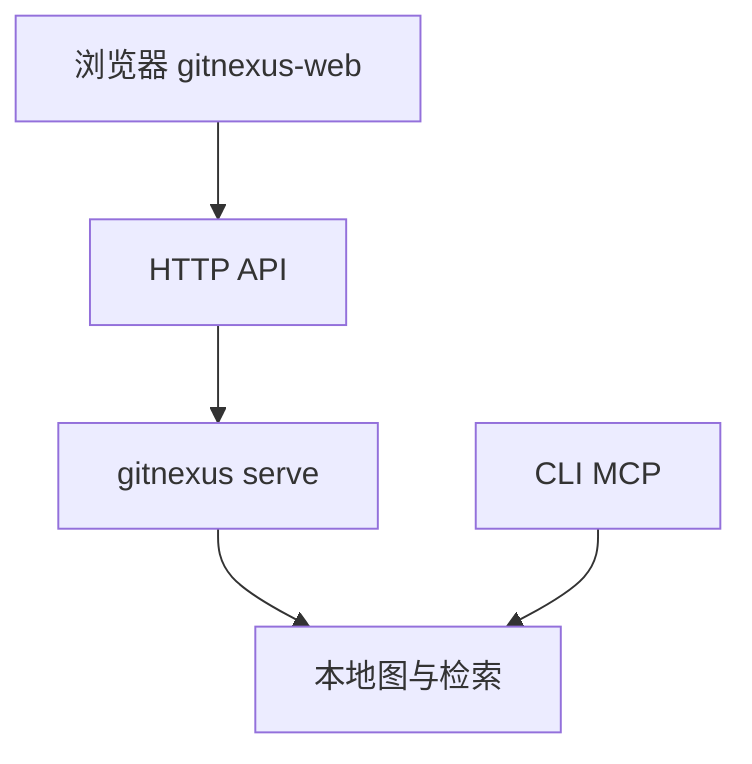

<details>
<summary>相关源文件</summary>

生成本页时使用的主要源文件：

- [gitnexus-web/package.json](https://github.com/abhigyanpatwari/GitNexus/blob/7f8b01d5068495af2f4b07f1f91bc4c1e7b82fe0/gitnexus-web/package.json)
- [README.md](https://github.com/abhigyanpatwari/GitNexus/blob/7f8b01d5068495af2f4b07f1f91bc4c1e7b82fe0/README.md)
- [ARCHITECTURE.md](https://github.com/abhigyanpatwari/GitNexus/blob/7f8b01d5068495af2f4b07f1f91bc4c1e7b82fe0/ARCHITECTURE.md)
- [TESTING.md](https://github.com/abhigyanpatwari/GitNexus/blob/7f8b01d5068495af2f4b07f1f91bc4c1e7b82fe0/TESTING.md)
- [gitnexus/package.json](https://github.com/abhigyanpatwari/GitNexus/blob/7f8b01d5068495af2f4b07f1f91bc4c1e7b82fe0/gitnexus/package.json)

</details>

# Web UI 与本地桥接

`gitnexus-web` 为 **Vite + React 19** 前端，依赖 `graphology`、`sigma`、`d3` 等做图布局与渲染，并通过 **LangChain** 相关包接入多种模型进行对话。开发与构建脚本见 `package.json` 中的 `dev` / `build` / `test:e2e`（Playwright）。

## 与 CLI 的关系

`ARCHITECTURE.md` 说明：浏览器内为薄客户端，**所有查询经 `gitnexus serve` 的 HTTP API** 访问与 CLI 相同的后端。README 对比 Web 与 CLI 在解析绑定（native tree-sitter vs WASM）、存储（WASM 内存 vs LadybugDB 本地）上的差异，并强调 **Bridge 模式**下 Web 可复用 CLI 已索引数据。



## 测试

`TESTING.md` 汇总 `gitnexus-web` 的单元测试、E2E（Playwright）与 Storybook 相关命令，变更 UI 或 API 契约时应同步跑通。

## 相关页面

- [MCP、CLI 与 HTTP 桥](mcp-cli-http-interfaces.md)
- [测试、CI 与运维](testing-ci-and-ops.md)

Sources: [gitnexus-web/package.json:9-18](../../../project-repos/GitNexus/gitnexus-web/package.json#L9-L18), [gitnexus-web/package.json:20-54](../../../project-repos/GitNexus/gitnexus-web/package.json#L20-L54), [ARCHITECTURE.md:1-11](../../../project-repos/GitNexus/ARCHITECTURE.md#L1-L11), [README.md:48-60](../../../project-repos/GitNexus/README.md#L48-L60), [TESTING.md:1-80](../../../project-repos/GitNexus/TESTING.md#L1-L80)

<details class="source-snippets">
<summary>引用源码</summary>

<!-- source-snippets:start -->

#### `gitnexus-web/package.json:9-18`

```json
  "scripts": {
    "dev": "vite",
    "build": "tsc -b && vite build",
    "preview": "vite preview",
    "test": "vitest run",
    "test:watch": "vitest",
    "test:coverage": "vitest run --coverage",
    "test:e2e": "playwright test",
    "test:e2e:ui": "playwright test --ui",
    "test:e2e:report": "playwright show-report"
```

#### `gitnexus-web/package.json:20-54`

```json
  "dependencies": {
    "gitnexus-shared": "file:../gitnexus-shared",
    "@langchain/anthropic": "^1.3.27",
    "@langchain/core": "^1.1.41",
    "@langchain/google-genai": "^2.1.28",
    "@langchain/langgraph": "^1.2.9",
    "@langchain/ollama": "^1.2.6",
    "@langchain/openai": "^1.4.5",
    "@sigma/edge-curve": "^3.1.0",
    "@tailwindcss/vite": "^4.2.4",
    "axios": "^1.13.2",
    "d3": "^7.9.0",
    "dompurify": "^3.3.3",
    "graphology": "^0.26.0",
    "graphology-indices": "^0.17.0",
    "graphology-layout-force": "^0.2.4",
    "graphology-layout-forceatlas2": "^0.10.1",
    "graphology-layout-noverlap": "^0.4.2",
    "graphology-utils": "^2.3.0",
    "langchain": "^1.3.4",
    "lru-cache": "^11.2.4",
    "lucide-react": "^1.11.0",
    "mermaid": "^11.14.0",
    "mnemonist": "^0.39.0",
    "pandemonium": "^2.4.0",
    "react": "^19.2.5",
    "react-dom": "^19.2.5",
    "react-markdown": "^10.1.0",
    "react-syntax-highlighter": "^16.1.0",
    "react-zoom-pan-pinch": "^4.0.3",
    "remark-gfm": "^4.0.1",
    "sigma": "^3.0.2",
    "tailwindcss": "^4.2.4",
    "uuid": "^14.0.0",
    "zod": "^3.25.76"
```

#### `ARCHITECTURE.md:1-11`

```markdown
# Architecture — GitNexus

Monorepo: **CLI/MCP** (`gitnexus/`) + **browser UI** (`gitnexus-web/`).

## Repository layout

| Path | Role |
|------|------|
| `gitnexus/` | npm package `gitnexus`: CLI, MCP server (stdio), HTTP API, ingestion pipeline, LadybugDB graph, embeddings. |
| `gitnexus-web/` | Vite + React thin client: graph explorer + AI chat. All queries via `gitnexus serve` HTTP API. |
| `gitnexus-shared/` | Shared TypeScript types and constants (consumed by CLI and Web). |
```

#### `README.md:48-60`

```markdown
## Two Ways to Use GitNexus

|                   | **CLI + MCP**                                            | **Web UI**                                             |
| ----------------- | -------------------------------------------------------------- | ------------------------------------------------------------ |
| **What**    | Index repos locally, connect AI agents via MCP                 | Visual graph explorer + AI chat in browser                   |
| **For**     | Daily development with Cursor, Claude Code, Codex, Windsurf, OpenCode | Quick exploration, demos, one-off analysis                   |
| **Scale**   | Full repos, any size                                           | Limited by browser memory (~5k files), or unlimited via backend mode |
| **Install** | `npm install -g gitnexus`                                    | No install — [gitnexus.vercel.app](https://gitnexus.vercel.app) |
| **Storage** | LadybugDB native (fast, persistent)                               | LadybugDB WASM (in-memory, per session)                         |
| **Parsing** | Tree-sitter native bindings                                    | Tree-sitter WASM                                             |
| **Privacy** | Everything local, no network                                   | Everything in-browser, no server                             |

> **Bridge mode:** `gitnexus serve` connects the two — the web UI auto-detects the local server and can browse all your CLI-indexed repos without re-uploading or re-indexing.
```

#### `TESTING.md:1-80`

````markdown
# Testing — GitNexus

How we structure tests and which commands to run locally and in CI.

## Packages

| Package        | Path           | Runner   | Notes                          |
| -------------- | -------------- | -------- | ------------------------------ |
| CLI + MCP core | `gitnexus/`    | Vitest   | Primary test surface in CI     |
| Web UI         | `gitnexus-web/`| Vitest   | Unit/component tests           |
| Web UI E2E     | `gitnexus-web/`| Playwright | Run when changing UI flows   |

## Commands (local)

From repository root, unless noted:

**`gitnexus` (CLI / library)**

```bash
cd gitnexus
npm install
npm run build
npm test                    # full suite: vitest run
npm run test:unit           # unit only: vitest run test/unit
npm run test:integration    # integration suite
npm run test:coverage
npx tsc --noEmit            # typecheck (matches CI)
```

**`gitnexus-web`**

```bash
cd gitnexus-web
npm install
npm test                    # unit tests (vitest)
npx tsc -b --noEmit         # typecheck (matches CI)
npm run test:coverage
npm run test:e2e            # Playwright (requires gitnexus serve + npm run dev)
```

## Pre-commit hook

A husky pre-commit hook (`.husky/pre-commit`) runs automatically on every `git commit`:

1. **Formatting** — `lint-staged` runs prettier on staged files
2. **`gitnexus-web/` files staged** → `tsc -b --noEmit`
3. **`gitnexus/` files staged** → `tsc --noEmit`

Tests do **not** run in the pre-commit hook — they run in CI (`ci-tests.yml`) only.

Skip with `git commit --no-verify` (use sparingly).

## Test categories

- **Unit** — Pure logic, parsers, graph/query helpers; fast; no network.
- **Integration** — Real combinations (filesystem, MCP wiring, larger pipelines) as already organized under `gitnexus/test/integration`.
- **Eval-style / golden sets** — For agent- or classification-style behavior, keep labeled inputs and expected outputs (JSON or table-driven tests) and run them in CI when relevant.
- **E2E (web)** — Critical user paths only; prefer `data-testid` attributes for stable selectors. Tests run against real backend (`gitnexus serve`) and Vite dev server.

## Performance metrics (targets)

Set targets to match team expectations, then tune to this repo’s CI reality:

| Metric              | Target (initial) | Notes                                      |
| ------------------- | ---------------- | ------------------------------------------ |
| Unit coverage       | Align with CI    | CI runs Vitest with coverage in `gitnexus` |
| Unit wall time      | Fast PR feedback | Use `vitest run test/unit` for tight loop  |
| Integration duration| &lt; few minutes | Guard heavy tests with env flags if needed |

## Regression testing

Re-run the full relevant suite when:

- Prompt or agent-behavior documentation changes (if tests encode behavior)
- Model or embedding-related code paths change
- Graph schema, query contracts, or MCP tool shapes change
- Dependencies with parsing or runtime impact upgrade

## CI integration

````

<!-- source-snippets:end -->
</details>
