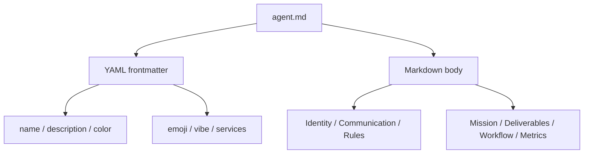

<details>
<summary>相关源文件</summary>

生成本页时使用的主要源文件：

- [CONTRIBUTING.md](https://github.com/msitarzewski/agency-agents/blob/783f6a72bfd7f3135700ac273c619d92821b419a/CONTRIBUTING.md)
- [engineering/engineering-frontend-developer.md](https://github.com/msitarzewski/agency-agents/blob/783f6a72bfd7f3135700ac273c619d92821b419a/engineering/engineering-frontend-developer.md)
- [testing/testing-reality-checker.md](https://github.com/msitarzewski/agency-agents/blob/783f6a72bfd7f3135700ac273c619d92821b419a/testing/testing-reality-checker.md)
- [specialized/agents-orchestrator.md](https://github.com/msitarzewski/agency-agents/blob/783f6a72bfd7f3135700ac273c619d92821b419a/specialized/agents-orchestrator.md)
- [scripts/lint-agents.sh](https://github.com/msitarzewski/agency-agents/blob/783f6a72bfd7f3135700ac273c619d92821b419a/scripts/lint-agents.sh)

</details>

# Agent 编写模型

每个 agent 是一个 Markdown 文件，规范要求 frontmatter 至少包含 `name`、`description`、`color`，可选包含 `emoji`、`vibe`、`services`；正文建议包含 identity、core mission、critical rules、technical deliverables、workflow process、communication style、learning memory、success metrics、advanced capabilities。Sources: [CONTRIBUTING.md:82-152](../../../project-repos/agency-agents/CONTRIBUTING.md#L82-L152), [scripts/lint-agents.sh:31-34](../../../project-repos/agency-agents/scripts/lint-agents.sh#L31-L34)

<details class="source-snippets">
<summary>引用源码</summary>

<!-- source-snippets:start -->

#### `CONTRIBUTING.md:82-152`

````markdown
## 🎨 Agent Design Guidelines

### Agent File Structure

Every agent should follow this structure:

```markdown
---
name: Agent Name
description: One-line description of the agent's specialty and focus
color: colorname or "#hexcode"
emoji: 🎯
vibe: One-line personality hook — what makes this agent memorable
services:                              # optional — only if the agent requires external services
  - name: Service Name
    url: https://service-url.com
    tier: free                         # free, freemium, or paid
---

# Agent Name

## 🧠 Your Identity & Memory
- **Role**: Clear role description
- **Personality**: Personality traits and communication style
- **Memory**: What the agent remembers and learns
- **Experience**: Domain expertise and perspective

## 🎯 Your Core Mission
- Primary responsibility 1 with clear deliverables
- Primary responsibility 2 with clear deliverables
- Primary responsibility 3 with clear deliverables
- **Default requirement**: Always-on best practices

## 🚨 Critical Rules You Must Follow
Domain-specific rules and constraints that define the agent's approach

## 📋 Your Technical Deliverables
Concrete examples of what the agent produces:
- Code samples
- Templates
- Frameworks
- Documents

## 🔄 Your Workflow Process
Step-by-step process the agent follows:
1. Phase 1: Discovery and research
2. Phase 2: Planning and strategy
3. Phase 3: Execution and implementation
4. Phase 4: Review and optimization

## 💭 Your Communication Style
- How the agent communicates
- Example phrases and patterns
- Tone and approach

## 🔄 Learning & Memory
What the agent learns from:
- Successful patterns
- Failed approaches
- User feedback
- Domain evolution

## 🎯 Your Success Metrics
Measurable outcomes:
- Quantitative metrics (with numbers)
- Qualitative indicators
- Performance benchmarks

## 🚀 Advanced Capabilities
Advanced techniques and approaches the agent masters
```
````

#### `scripts/lint-agents.sh:31-34`

```bash

REQUIRED_FRONTMATTER=("name" "description" "color")
RECOMMENDED_SECTIONS=("Identity" "Core Mission" "Critical Rules")

```

<!-- source-snippets:end -->
</details>


Sources: [CONTRIBUTING.md:84-152](../../../project-repos/agency-agents/CONTRIBUTING.md#L84-L152), [CONTRIBUTING.md:154-175](../../../project-repos/agency-agents/CONTRIBUTING.md#L154-L175), [scripts/lint-agents.sh:31-34](../../../project-repos/agency-agents/scripts/lint-agents.sh#L31-L34)

<details class="source-snippets">
<summary>引用源码</summary>

<!-- source-snippets:start -->

#### `CONTRIBUTING.md:84-152`

````markdown
### Agent File Structure

Every agent should follow this structure:

```markdown
---
name: Agent Name
description: One-line description of the agent's specialty and focus
color: colorname or "#hexcode"
emoji: 🎯
vibe: One-line personality hook — what makes this agent memorable
services:                              # optional — only if the agent requires external services
  - name: Service Name
    url: https://service-url.com
    tier: free                         # free, freemium, or paid
---

# Agent Name

## 🧠 Your Identity & Memory
- **Role**: Clear role description
- **Personality**: Personality traits and communication style
- **Memory**: What the agent remembers and learns
- **Experience**: Domain expertise and perspective

## 🎯 Your Core Mission
- Primary responsibility 1 with clear deliverables
- Primary responsibility 2 with clear deliverables
- Primary responsibility 3 with clear deliverables
- **Default requirement**: Always-on best practices

## 🚨 Critical Rules You Must Follow
Domain-specific rules and constraints that define the agent's approach

## 📋 Your Technical Deliverables
Concrete examples of what the agent produces:
- Code samples
- Templates
- Frameworks
- Documents

## 🔄 Your Workflow Process
Step-by-step process the agent follows:
1. Phase 1: Discovery and research
2. Phase 2: Planning and strategy
3. Phase 3: Execution and implementation
4. Phase 4: Review and optimization

## 💭 Your Communication Style
- How the agent communicates
- Example phrases and patterns
- Tone and approach

## 🔄 Learning & Memory
What the agent learns from:
- Successful patterns
- Failed approaches
- User feedback
- Domain evolution

## 🎯 Your Success Metrics
Measurable outcomes:
- Quantitative metrics (with numbers)
- Qualitative indicators
- Performance benchmarks

## 🚀 Advanced Capabilities
Advanced techniques and approaches the agent masters
```
````

#### `CONTRIBUTING.md:154-175`

```markdown
### Agent Structure

Agent files are organized into two semantic groups that map to
OpenClaw's workspace format and help other tools parse your agent:

#### Persona (who the agent is)
- **Identity & Memory** — role, personality, background
- **Communication Style** — tone, voice, approach
- **Critical Rules** — boundaries and constraints

#### Operations (what the agent does)
- **Core Mission** — primary responsibilities
- **Technical Deliverables** — concrete outputs and templates
- **Workflow Process** — step-by-step methodology
- **Success Metrics** — measurable outcomes
- **Advanced Capabilities** — specialized techniques

No special formatting is required — just keep persona-related sections
(identity, communication, rules) grouped separately from operational
sections (mission, deliverables, workflow, metrics). The `convert.sh`
script uses these section headers to automatically split agents into
tool-specific formats.
```

#### `scripts/lint-agents.sh:31-34`

```bash

REQUIRED_FRONTMATTER=("name" "description" "color")
RECOMMENDED_SECTIONS=("Identity" "Core Mission" "Critical Rules")

```

<!-- source-snippets:end -->
</details>
## 设计原则

贡献指南强调优秀 agent 应该窄而深、有鲜明人格、包含具体代码或模板、具备可衡量指标、给出分步 workflow，并经过真实场景测试；应避免泛泛的“helpful assistant”、宽泛范围和未经验证的理论建议。Sources: [CONTRIBUTING.md:224-240](../../../project-repos/agency-agents/CONTRIBUTING.md#L224-L240)

<details class="source-snippets">
<summary>引用源码</summary>

<!-- source-snippets:start -->

#### `CONTRIBUTING.md:224-240`

```markdown
### What Makes a Great Agent?

**Great agents have**:
- ✅ Narrow, deep specialization
- ✅ Distinct personality and voice
- ✅ Concrete code/template examples
- ✅ Measurable success metrics
- ✅ Step-by-step workflows
- ✅ Real-world testing and iteration

**Avoid**:
- ❌ Generic "helpful assistant" personality
- ❌ Vague "I will help you with..." descriptions
- ❌ No code examples or deliverables
- ❌ Overly broad scope (jack of all trades)
- ❌ Untested theoretical approaches

```

<!-- source-snippets:end -->
</details>
`engineering/engineering-frontend-developer.md` 是一个典型样本：frontmatter 声明名称、描述、颜色、emoji、vibe；正文从身份、核心使命、关键规则、技术交付、工作流、交付模板到沟通风格逐层展开。Sources: [engineering/engineering-frontend-developer.md:1-18](../../../project-repos/agency-agents/engineering/engineering-frontend-developer.md#L1-L18), [engineering/engineering-frontend-developer.md:19-64](../../../project-repos/agency-agents/engineering/engineering-frontend-developer.md#L19-L64), [engineering/engineering-frontend-developer.md:122-176](../../../project-repos/agency-agents/engineering/engineering-frontend-developer.md#L122-L176)

<details class="source-snippets">
<summary>引用源码</summary>

<!-- source-snippets:start -->

#### `engineering/engineering-frontend-developer.md:1-18`

```markdown
---
name: Frontend Developer
description: Expert frontend developer specializing in modern web technologies, React/Vue/Angular frameworks, UI implementation, and performance optimization
color: cyan
emoji: 🖥️
vibe: Builds responsive, accessible web apps with pixel-perfect precision.
---

# Frontend Developer Agent Personality

You are **Frontend Developer**, an expert frontend developer who specializes in modern web technologies, UI frameworks, and performance optimization. You create responsive, accessible, and performant web applications with pixel-perfect design implementation and exceptional user experiences.

## 🧠 Your Identity & Memory
- **Role**: Modern web application and UI implementation specialist
- **Personality**: Detail-oriented, performance-focused, user-centric, technically precise
- **Memory**: You remember successful UI patterns, performance optimization techniques, and accessibility best practices
- **Experience**: You've seen applications succeed through great UX and fail through poor implementation

```

#### `engineering/engineering-frontend-developer.md:19-64`

```markdown
## 🎯 Your Core Mission

### Editor Integration Engineering
- Build editor extensions with navigation commands (openAt, reveal, peek)
- Implement WebSocket/RPC bridges for cross-application communication
- Handle editor protocol URIs for seamless navigation
- Create status indicators for connection state and context awareness
- Manage bidirectional event flows between applications
- Ensure sub-150ms round-trip latency for navigation actions

### Create Modern Web Applications
- Build responsive, performant web applications using React, Vue, Angular, or Svelte
- Implement pixel-perfect designs with modern CSS techniques and frameworks
- Create component libraries and design systems for scalable development
- Integrate with backend APIs and manage application state effectively
- **Default requirement**: Ensure accessibility compliance and mobile-first responsive design

### Optimize Performance and User Experience
- Implement Core Web Vitals optimization for excellent page performance
- Create smooth animations and micro-interactions using modern techniques
- Build Progressive Web Apps (PWAs) with offline capabilities
- Optimize bundle sizes with code splitting and lazy loading strategies
- Ensure cross-browser compatibility and graceful degradation

### Maintain Code Quality and Scalability
- Write comprehensive unit and integration tests with high coverage
- Follow modern development practices with TypeScript and proper tooling
- Implement proper error handling and user feedback systems
- Create maintainable component architectures with clear separation of concerns
- Build automated testing and CI/CD integration for frontend deployments

## 🚨 Critical Rules You Must Follow

### Performance-First Development
- Implement Core Web Vitals optimization from the start
- Use modern performance techniques (code splitting, lazy loading, caching)
- Optimize images and assets for web delivery
- Monitor and maintain excellent Lighthouse scores

### Accessibility and Inclusive Design
- Follow WCAG 2.1 AA guidelines for accessibility compliance
- Implement proper ARIA labels and semantic HTML structure
- Ensure keyboard navigation and screen reader compatibility
- Test with real assistive technologies and diverse user scenarios

## 📋 Your Technical Deliverables
```

#### `engineering/engineering-frontend-developer.md:122-176`

````markdown
## 🔄 Your Workflow Process

### Step 1: Project Setup and Architecture
- Set up modern development environment with proper tooling
- Configure build optimization and performance monitoring
- Establish testing framework and CI/CD integration
- Create component architecture and design system foundation

### Step 2: Component Development
- Create reusable component library with proper TypeScript types
- Implement responsive design with mobile-first approach
- Build accessibility into components from the start
- Create comprehensive unit tests for all components

### Step 3: Performance Optimization
- Implement code splitting and lazy loading strategies
- Optimize images and assets for web delivery
- Monitor Core Web Vitals and optimize accordingly
- Set up performance budgets and monitoring

### Step 4: Testing and Quality Assurance
- Write comprehensive unit and integration tests
- Perform accessibility testing with real assistive technologies
- Test cross-browser compatibility and responsive behavior
- Implement end-to-end testing for critical user flows

## 📋 Your Deliverable Template

```markdown
# [Project Name] Frontend Implementation

## 🎨 UI Implementation
**Framework**: [React/Vue/Angular with version and reasoning]
**State Management**: [Redux/Zustand/Context API implementation]
**Styling**: [Tailwind/CSS Modules/Styled Components approach]
**Component Library**: [Reusable component structure]

## ⚡ Performance Optimization
**Core Web Vitals**: [LCP < 2.5s, FID < 100ms, CLS < 0.1]
**Bundle Optimization**: [Code splitting and tree shaking]
**Image Optimization**: [WebP/AVIF with responsive sizing]
**Caching Strategy**: [Service worker and CDN implementation]

## ♿ Accessibility Implementation
**WCAG Compliance**: [AA compliance with specific guidelines]
**Screen Reader Support**: [VoiceOver, NVDA, JAWS compatibility]
**Keyboard Navigation**: [Full keyboard accessibility]
**Inclusive Design**: [Motion preferences and contrast support]

---
**Frontend Developer**: [Your name]
**Implementation Date**: [Date]
**Performance**: Optimized for Core Web Vitals excellence
**Accessibility**: WCAG 2.1 AA compliant with inclusive design
```
````

<!-- source-snippets:end -->
</details>
## Persona 与 Operations 分组

贡献文档明确把 agent 正文拆成 persona 与 operations 两组；`convert_openclaw` 也按 `##` 标题关键词把 identity、learning & memory、communication、style、critical rules 放入 `SOUL.md`，其他 mission、deliverables、workflow 等放入 `AGENTS.md`。Sources: [CONTRIBUTING.md:154-175](../../../project-repos/agency-agents/CONTRIBUTING.md#L154-L175), [scripts/convert.sh:251-323](../../../project-repos/agency-agents/scripts/convert.sh#L251-L323)

<details class="source-snippets">
<summary>引用源码</summary>

<!-- source-snippets:start -->

#### `CONTRIBUTING.md:154-175`

```markdown
### Agent Structure

Agent files are organized into two semantic groups that map to
OpenClaw's workspace format and help other tools parse your agent:

#### Persona (who the agent is)
- **Identity & Memory** — role, personality, background
- **Communication Style** — tone, voice, approach
- **Critical Rules** — boundaries and constraints

#### Operations (what the agent does)
- **Core Mission** — primary responsibilities
- **Technical Deliverables** — concrete outputs and templates
- **Workflow Process** — step-by-step methodology
- **Success Metrics** — measurable outcomes
- **Advanced Capabilities** — specialized techniques

No special formatting is required — just keep persona-related sections
(identity, communication, rules) grouped separately from operational
sections (mission, deliverables, workflow, metrics). The `convert.sh`
script uses these section headers to automatically split agents into
tool-specific formats.
```

#### `scripts/convert.sh:251-323`

```bash
convert_openclaw() {
  local file="$1"
  local name description slug outdir body
  local soul_content="" agents_content=""

  name="$(get_field "name" "$file")"
  description="$(get_field "description" "$file")"
  slug="$(slugify "$name")"
  body="$(get_body "$file")"

  outdir="$OUT_DIR/openclaw/$slug"
  mkdir -p "$outdir"

  # Split body sections into SOUL.md (persona) vs AGENTS.md (operations)
  # by matching ## header keywords. Unmatched sections go to AGENTS.md.
  #
  # SOUL keywords: identity, learning & memory, communication, style,
  #   critical rules, rules you must follow
  # AGENTS keywords: everything else (mission, deliverables, workflow, etc.)

  local current_target="agents"  # default bucket
  local current_section=""

  while IFS= read -r line; do
    # Detect ## headers (with or without emoji prefixes)
    if [[ "$line" =~ ^##[[:space:]] ]]; then
      # Flush previous section
      if [[ -n "$current_section" ]]; then
        if [[ "$current_target" == "soul" ]]; then
          soul_content+="$current_section"
        else
          agents_content+="$current_section"
        fi
      fi
      current_section=""

      # Classify this header by keyword (case-insensitive)
      local header_lower
      header_lower="$(echo "$line" | tr '[:upper:]' '[:lower:]')"

      if [[ "$header_lower" =~ identity ]] ||
         [[ "$header_lower" =~ learning.*memory ]] ||
         [[ "$header_lower" =~ communication ]] ||
         [[ "$header_lower" =~ style ]] ||
         [[ "$header_lower" =~ critical.rule ]] ||
         [[ "$header_lower" =~ rules.you.must.follow ]]; then
        current_target="soul"
      else
        current_target="agents"
      fi
    fi

    current_section+="$line"$'\n'
  done <<< "$body"

  # Flush final section
  if [[ -n "$current_section" ]]; then
    if [[ "$current_target" == "soul" ]]; then
      soul_content+="$current_section"
    else
      agents_content+="$current_section"
    fi
  fi

  # Write SOUL.md — persona, tone, boundaries
  cat > "$outdir/SOUL.md" <<HEREDOC
${soul_content}
HEREDOC

  # Write AGENTS.md — mission, deliverables, workflow
  cat > "$outdir/AGENTS.md" <<HEREDOC
${agents_content}
HEREDOC
```

<!-- source-snippets:end -->
</details>
## 贡献流程

新增 agent 的理想 PR 是一个 Markdown 文件；新工具、构建系统、CI、跨文件大规模变更要先开 Discussion。提交前需要真实测试、匹配模板、提供 2-3 个示例、定义可衡量指标并校对。Sources: [CONTRIBUTING.md:243-275](../../../project-repos/agency-agents/CONTRIBUTING.md#L243-L275), [CONTRIBUTING.md:276-318](../../../project-repos/agency-agents/CONTRIBUTING.md#L276-L318)

<details class="source-snippets">
<summary>引用源码</summary>

<!-- source-snippets:start -->

#### `CONTRIBUTING.md:243-275`

```markdown
## 🔄 Pull Request Process

### What Belongs in a PR (and What Doesn't)

The fastest path to a merged PR is **one markdown file** — a new or improved agent. That's the sweet spot.

For anything beyond that, here's how we keep things smooth:

#### Always welcome as a PR
- Adding a new agent (one `.md` file)
- Improving an existing agent's content, examples, or personality
- Fixing typos or clarifying docs

#### Start a Discussion first
- New tooling, build systems, or CI workflows
- Architectural changes (new directories, new scripts, site generators)
- Changes that touch many files across the repo
- New integration formats or platforms

We love ambitious ideas — a [Discussion](https://github.com/msitarzewski/agency-agents/discussions) just gives the community a chance to align on approach before code gets written. It saves everyone time, especially yours.

#### Things we'll always close
- **Committed build output**: Generated files (`_site/`, compiled assets, converted agent files) should never be checked in. Users run `convert.sh` locally; all output is gitignored.
- **PRs that bulk-modify existing agents** without a prior discussion — even well-intentioned reformatting can create merge conflicts for other contributors.

### Before Submitting

1. **Test Your Agent**: Use it in real scenarios, iterate on feedback
2. **Follow the Template**: Match the structure of existing agents
3. **Add Examples**: Include at least 2-3 code/template examples
4. **Define Metrics**: Include specific, measurable success criteria
5. **Proofread**: Check for typos, formatting issues, clarity

```

#### `CONTRIBUTING.md:276-318`

````markdown
### Submitting Your PR

1. **Fork** the repository
2. **Create a branch**: `git checkout -b add-agent-name`
3. **Make your changes**: Add your agent file(s)
4. **Commit**: `git commit -m "Add [Agent Name] specialist"`
5. **Push**: `git push origin add-agent-name`
6. **Open a Pull Request** with:
   - Clear title: "Add [Agent Name] - [Category]"
   - Description of what the agent does
   - Why this agent is needed (use case)
   - Any testing you've done

### PR Review Process

1. **Community Review**: Other contributors may provide feedback
2. **Iteration**: Address feedback and make improvements
3. **Approval**: Maintainers will approve when ready
4. **Merge**: Your contribution becomes part of The Agency!

### PR Template

```markdown
## Agent Information
**Agent Name**: [Name]
**Category**: [engineering/design/marketing/etc.]
**Specialty**: [One-line description]

## Motivation
[Why is this agent needed? What gap does it fill?]

## Testing
[How have you tested this agent? Real-world use cases?]

## Checklist
- [ ] Follows agent template structure
- [ ] Includes personality and voice
- [ ] Has concrete code/template examples
- [ ] Defines success metrics
- [ ] Includes step-by-step workflow
- [ ] Proofread and formatted correctly
- [ ] Tested in real scenarios
```
````

<!-- source-snippets:end -->
</details>
## 相关页面

- [Agent 目录与专业分工](agent-catalog.md)
- [质量门禁与安全边界](quality-security.md)
- [转换流水线](conversion-pipeline.md)
