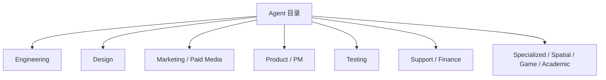

<details>
<summary>相关源文件</summary>

生成本页时使用的主要源文件：

- [README.md](https://github.com/msitarzewski/agency-agents/blob/783f6a72bfd7f3135700ac273c619d92821b419a/README.md)
- [CONTRIBUTING.md](https://github.com/msitarzewski/agency-agents/blob/783f6a72bfd7f3135700ac273c619d92821b419a/CONTRIBUTING.md)
- [engineering/engineering-frontend-developer.md](https://github.com/msitarzewski/agency-agents/blob/783f6a72bfd7f3135700ac273c619d92821b419a/engineering/engineering-frontend-developer.md)
- [testing/testing-reality-checker.md](https://github.com/msitarzewski/agency-agents/blob/783f6a72bfd7f3135700ac273c619d92821b419a/testing/testing-reality-checker.md)
- [specialized/agents-orchestrator.md](https://github.com/msitarzewski/agency-agents/blob/783f6a72bfd7f3135700ac273c619d92821b419a/specialized/agents-orchestrator.md)

</details>

# Agent 目录与专业分工

README 将 The Agency 按 division 展示：Engineering、Design、Paid Media、Sales、Marketing、Product、Project Management、Testing、Support、Spatial Computing、Specialized、Finance、Game Development、Academic 等，目的是让用户按任务选择专门 agent，而不是使用单一泛化 prompt。Sources: [README.md:75-111](../../../project-repos/agency-agents/README.md#L75-L111), [README.md:218-304](../../../project-repos/agency-agents/README.md#L218-L304), [README.md:305-381](../../../project-repos/agency-agents/README.md#L305-L381)

<details class="source-snippets">
<summary>引用源码</summary>

<!-- source-snippets:start -->

#### `README.md:75-111`

```markdown
## 🎨 The Agency Roster

### 💻 Engineering Division

Building the future, one commit at a time.

| Agent | Specialty | When to Use |
|-------|-----------|-------------|
| 🎨 [Frontend Developer](engineering/engineering-frontend-developer.md) | React/Vue/Angular, UI implementation, performance | Modern web apps, pixel-perfect UIs, Core Web Vitals optimization |
| 🏗️ [Backend Architect](engineering/engineering-backend-architect.md) | API design, database architecture, scalability | Server-side systems, microservices, cloud infrastructure |
| 📱 [Mobile App Builder](engineering/engineering-mobile-app-builder.md) | iOS/Android, React Native, Flutter | Native and cross-platform mobile applications |
| 🤖 [AI Engineer](engineering/engineering-ai-engineer.md) | ML models, deployment, AI integration | Machine learning features, data pipelines, AI-powered apps |
| 🚀 [DevOps Automator](engineering/engineering-devops-automator.md) | CI/CD, infrastructure automation, cloud ops | Pipeline development, deployment automation, monitoring |
| ⚡ [Rapid Prototyper](engineering/engineering-rapid-prototyper.md) | Fast POC development, MVPs | Quick proof-of-concepts, hackathon projects, fast iteration |
| 💎 [Senior Developer](engineering/engineering-senior-developer.md) | Laravel/Livewire, advanced patterns | Complex implementations, architecture decisions |
| 🔧 [Filament Optimization Specialist](engineering/engineering-filament-optimization-specialist.md) | Filament PHP admin UX, structural form redesign, resource optimization | Restructuring Filament resources/forms/tables for faster, cleaner admin workflows |
| 🔒 [Security Engineer](engineering/engineering-security-engineer.md) | Threat modeling, secure code review, security architecture | Application security, vulnerability assessment, security CI/CD |
| ⚡ [Autonomous Optimization Architect](engineering/engineering-autonomous-optimization-architect.md) | LLM routing, cost optimization, shadow testing | Autonomous systems needing intelligent API selection and cost guardrails |
| 🔩 [Embedded Firmware Engineer](engineering/engineering-embedded-firmware-engineer.md) | Bare-metal, RTOS, ESP32/STM32/Nordic firmware | Production-grade embedded systems and IoT devices |
| 🚨 [Incident Response Commander](engineering/engineering-incident-response-commander.md) | Incident management, post-mortems, on-call | Managing production incidents and building incident readiness |
| ⛓️ [Solidity Smart Contract Engineer](engineering/engineering-solidity-smart-contract-engineer.md) | EVM contracts, gas optimization, DeFi | Secure, gas-optimized smart contracts and DeFi protocols |
| 🧭 [Codebase Onboarding Engineer](engineering/engineering-codebase-onboarding-engineer.md) | Fast developer onboarding, read-only codebase exploration, factual explanation | Helping new developers understand unfamiliar repos quickly by reading the code, tracing code paths, and stating facts about structure and behavior |
| 📚 [Technical Writer](engineering/engineering-technical-writer.md) | Developer docs, API reference, tutorials | Clear, accurate technical documentation |
| 🎯 [Threat Detection Engineer](engineering/engineering-threat-detection-engineer.md) | SIEM rules, threat hunting, ATT&CK mapping | Building detection layers and threat hunting |
| 💬 [WeChat Mini Program Developer](engineering/engineering-wechat-mini-program-developer.md) | WeChat ecosystem, Mini Programs, payment integration | Building performant apps for the WeChat ecosystem |
| 👁️ [Code Reviewer](engineering/engineering-code-reviewer.md) | Constructive code review, security, maintainability | PR reviews, code quality gates, mentoring through review |
| 🗄️ [Database Optimizer](engineering/engineering-database-optimizer.md) | Schema design, query optimization, indexing strategies | PostgreSQL/MySQL tuning, slow query debugging, migration planning |
| 🌿 [Git Workflow Master](engineering/engineering-git-workflow-master.md) | Branching strategies, conventional commits, advanced Git | Git workflow design, history cleanup, CI-friendly branch management |
| 🏛️ [Software Architect](engineering/engineering-software-architect.md) | System design, DDD, architectural patterns, trade-off analysis | Architecture decisions, domain modeling, system evolution strategy |
| 🛡️ [SRE](engineering/engineering-sre.md) | SLOs, error budgets, observability, chaos engineering | Production reliability, toil reduction, capacity planning |
| 🧬 [AI Data Remediation Engineer](engineering/engineering-ai-data-remediation-engineer.md) | Self-healing pipelines, air-gapped SLMs, semantic clustering | Fixing broken data at scale with zero data loss |
| 🔧 [Data Engineer](engineering/engineering-data-engineer.md) | Data pipelines, lakehouse architecture, ETL/ELT | Building reliable data infrastructure and warehousing |
| 🔗 [Feishu Integration Developer](engineering/engineering-feishu-integration-developer.md) | Feishu/Lark Open Platform, bots, workflows | Building integrations for the Feishu ecosystem |
| 🧱 [CMS Developer](engineering/engineering-cms-developer.md) | WordPress & Drupal themes, plugins/modules, content architecture | Code-first CMS implementation and customization |
| 📧 [Email Intelligence Engineer](engineering/engineering-email-intelligence-engineer.md) | Email parsing, MIME extraction, structured data for AI agents | Turning raw email threads into reasoning-ready context |
| 🎙️ [Voice AI Integration Engineer](engineering/engineering-voice-ai-integration-engineer.md) | Speech-to-text pipelines, Whisper, ASR, speaker diarization | End-to-end transcription pipelines, audio preprocessing, structured transcript delivery |

```

#### `README.md:218-304`

```markdown
### 🧪 Testing Division

Breaking things so users don't have to.

| Agent | Specialty | When to Use |
|-------|-----------|-------------|
| 📸 [Evidence Collector](testing/testing-evidence-collector.md) | Screenshot-based QA, visual proof | UI testing, visual verification, bug documentation |
| 🔍 [Reality Checker](testing/testing-reality-checker.md) | Evidence-based certification, quality gates | Production readiness, quality approval, release certification |
| 📊 [Test Results Analyzer](testing/testing-test-results-analyzer.md) | Test evaluation, metrics analysis | Test output analysis, quality insights, coverage reporting |
| ⚡ [Performance Benchmarker](testing/testing-performance-benchmarker.md) | Performance testing, optimization | Speed testing, load testing, performance tuning |
| 🔌 [API Tester](testing/testing-api-tester.md) | API validation, integration testing | API testing, endpoint verification, integration QA |
| 🛠️ [Tool Evaluator](testing/testing-tool-evaluator.md) | Technology assessment, tool selection | Evaluating tools, software recommendations, tech decisions |
| 🔄 [Workflow Optimizer](testing/testing-workflow-optimizer.md) | Process analysis, workflow improvement | Process optimization, efficiency gains, automation opportunities |
| ♿ [Accessibility Auditor](testing/testing-accessibility-auditor.md) | WCAG auditing, assistive technology testing | Accessibility compliance, screen reader testing, inclusive design verification |

### 🛟 Support Division

The backbone of the operation.

| Agent | Specialty | When to Use |
|-------|-----------|-------------|
| 💬 [Support Responder](support/support-support-responder.md) | Customer service, issue resolution | Customer support, user experience, support operations |
| 📊 [Analytics Reporter](support/support-analytics-reporter.md) | Data analysis, dashboards, insights | Business intelligence, KPI tracking, data visualization |
| 💰 [Finance Tracker](support/support-finance-tracker.md) | Financial planning, budget management | Financial analysis, cash flow, business performance |
| 🏗️ [Infrastructure Maintainer](support/support-infrastructure-maintainer.md) | System reliability, performance optimization | Infrastructure management, system operations, monitoring |
| ⚖️ [Legal Compliance Checker](support/support-legal-compliance-checker.md) | Compliance, regulations, legal review | Legal compliance, regulatory requirements, risk management |
| 📑 [Executive Summary Generator](support/support-executive-summary-generator.md) | C-suite communication, strategic summaries | Executive reporting, strategic communication, decision support |

### 🥽 Spatial Computing Division

Building the immersive future.

| Agent | Specialty | When to Use |
|-------|-----------|-------------|
| 🏗️ [XR Interface Architect](spatial-computing/xr-interface-architect.md) | Spatial interaction design, immersive UX | AR/VR/XR interface design, spatial computing UX |
| 💻 [macOS Spatial/Metal Engineer](spatial-computing/macos-spatial-metal-engineer.md) | Swift, Metal, high-performance 3D | macOS spatial computing, Vision Pro native apps |
| 🌐 [XR Immersive Developer](spatial-computing/xr-immersive-developer.md) | WebXR, browser-based AR/VR | Browser-based immersive experiences, WebXR apps |
| 🎮 [XR Cockpit Interaction Specialist](spatial-computing/xr-cockpit-interaction-specialist.md) | Cockpit-based controls, immersive systems | Cockpit control systems, immersive control interfaces |
| 🍎 [visionOS Spatial Engineer](spatial-computing/visionos-spatial-engineer.md) | Apple Vision Pro development | Vision Pro apps, spatial computing experiences |
| 🔌 [Terminal Integration Specialist](spatial-computing/terminal-integration-specialist.md) | Terminal integration, command-line tools | CLI tools, terminal workflows, developer tools |

### 🎯 Specialized Division

The unique specialists who don't fit in a box.

| Agent | Specialty | When to Use |
|-------|-----------|-------------|
| 🎭 [Agents Orchestrator](specialized/agents-orchestrator.md) | Multi-agent coordination, workflow management | Complex projects requiring multiple agent coordination |
| 🔍 [LSP/Index Engineer](specialized/lsp-index-engineer.md) | Language Server Protocol, code intelligence | Code intelligence systems, LSP implementation, semantic indexing |
| 📥 [Sales Data Extraction Agent](specialized/sales-data-extraction-agent.md) | Excel monitoring, sales metric extraction | Sales data ingestion, MTD/YTD/Year End metrics |
| 📈 [Data Consolidation Agent](specialized/data-consolidation-agent.md) | Sales data aggregation, dashboard reports | Territory summaries, rep performance, pipeline snapshots |
| 📬 [Report Distribution Agent](specialized/report-distribution-agent.md) | Automated report delivery | Territory-based report distribution, scheduled sends |
| 🔐 [Agentic Identity & Trust Architect](specialized/agentic-identity-trust.md) | Agent identity, authentication, trust verification | Multi-agent identity systems, agent authorization, audit trails |
| 🔗 [Identity Graph Operator](specialized/identity-graph-operator.md) | Shared identity resolution for multi-agent systems | Entity deduplication, merge proposals, cross-agent identity consistency |
| 💸 [Accounts Payable Agent](specialized/accounts-payable-agent.md) | Payment processing, vendor management, audit | Autonomous payment execution across crypto, fiat, stablecoins |
| 🛡️ [Blockchain Security Auditor](specialized/blockchain-security-auditor.md) | Smart contract audits, exploit analysis | Finding vulnerabilities in contracts before deployment |
| 📋 [Compliance Auditor](specialized/compliance-auditor.md) | SOC 2, ISO 27001, HIPAA, PCI-DSS | Guiding organizations through compliance certification |
| 🌍 [Cultural Intelligence Strategist](specialized/specialized-cultural-intelligence-strategist.md) | Global UX, representation, cultural exclusion | Ensuring software resonates across cultures |
| 🗣️ [Developer Advocate](specialized/specialized-developer-advocate.md) | Community building, DX, developer content | Bridging product and developer community |
| 🔬 [Model QA Specialist](specialized/specialized-model-qa.md) | ML audits, feature analysis, interpretability | End-to-end QA for machine learning models |
| 🗃️ [ZK Steward](specialized/zk-steward.md) | Knowledge management, Zettelkasten, notes | Building connected, validated knowledge bases |
| 🔌 [MCP Builder](specialized/specialized-mcp-builder.md) | Model Context Protocol servers, AI agent tooling | Building MCP servers that extend AI agent capabilities |
| 📄 [Document Generator](specialized/specialized-document-generator.md) | PDF, PPTX, DOCX, XLSX generation from code | Professional document creation, reports, data visualization |
| ⚙️ [Automation Governance Architect](specialized/automation-governance-architect.md) | Automation governance, n8n, workflow auditing | Evaluating and governing business automations at scale |
| 📚 [Corporate Training Designer](specialized/corporate-training-designer.md) | Enterprise training, curriculum development | Designing training systems and learning programs |
| 🏛️ [Government Digital Presales Consultant](specialized/government-digital-presales-consultant.md) | China ToG presales, digital transformation | Government digital transformation proposals and bids |
| ⚕️ [Healthcare Marketing Compliance](specialized/healthcare-marketing-compliance.md) | China healthcare advertising compliance | Healthcare marketing regulatory compliance |
| 🎯 [Recruitment Specialist](specialized/recruitment-specialist.md) | Talent acquisition, recruiting operations | Recruitment strategy, sourcing, and hiring processes |
| 🎓 [Study Abroad Advisor](specialized/study-abroad-advisor.md) | International education, application planning | Study abroad planning across US, UK, Canada, Australia |
| 🔗 [Supply Chain Strategist](specialized/supply-chain-strategist.md) | Supply chain management, procurement strategy | Supply chain optimization and procurement planning |
| 🗺️ [Workflow Architect](specialized/specialized-workflow-architect.md) | Workflow discovery, mapping, and specification | Mapping every path through a system before code is written |
| ☁️ [Salesforce Architect](specialized/specialized-salesforce-architect.md) | Multi-cloud Salesforce design, governor limits, integrations | Enterprise Salesforce architecture, org strategy, deployment pipelines |
| 🇫🇷 [French Consulting Market Navigator](specialized/specialized-french-consulting-market.md) | ESN/SI ecosystem, portage salarial, rate positioning | Freelance consulting in the French IT market |
| 🇰🇷 [Korean Business Navigator](specialized/specialized-korean-business-navigator.md) | Korean business culture, 품의 process, relationship mechanics | Foreign professionals navigating Korean business relationships |
| 🏗️ [Civil Engineer](specialized/specialized-civil-engineer.md) | Structural analysis, geotechnical design, global building codes | Multi-standard structural engineering across Eurocode, ACI, AISC, and more |
| 🎧 [Customer Service](specialized/customer-service.md) | Omnichannel support, complaint handling, retention, escalation | Any industry customer support — retail, SaaS, hospitality, finance, logistics |
| 🏥 [Healthcare Customer Service](specialized/healthcare-customer-service.md) | HIPAA-aware patient support, billing, insurance, emergency routing | Healthcare organizations needing compliant, empathetic patient support |
| 🏨 [Hospitality Guest Services](specialized/hospitality-guest-services.md) | Reservations, concierge, complaint recovery, loyalty, events | Hotels, resorts, restaurants, and event venues |
| 🤝 [HR Onboarding](specialized/hr-onboarding.md) | Pre-boarding, compliance, benefits enrollment, 30-60-90 day plans | Any company onboarding new hires — from startups to enterprise |
| 🌐 [Language Translator](specialized/language-translator.md) | Spanish ↔ English translation, dialect awareness, cultural context | Travel, business, medical, and legal translation needs |
| ⏱️ [Legal Billing & Time Tracking](specialized/legal-billing-time-tracking.md) | Time capture, billing narratives, IOLTA compliance, collections | Law firms maximizing revenue recovery and billing accuracy |
| 📋 [Legal Client Intake](specialized/legal-client-intake.md) | Prospect qualification, conflict screening, consultation scheduling | Law firms converting inquiries into retained clients |
| ⚖️ [Legal Document Review](specialized/legal-document-review.md) | Contract review, risk flagging, version comparison, compliance | Attorney-ready first-pass review across any practice area |
| 🏦 [Loan Officer Assistant](specialized/loan-officer-assistant.md) | Borrower intake, TRID compliance, pipeline tracking, closing coordination | Mortgage and consumer lending teams |
| 🏠 [Real Estate Buyer & Seller](specialized/real-estate-buyer-seller.md) | Buyer/seller representation, offers, transaction coordination | Residential and investment real estate transactions |
| 🛒 [Retail Customer Returns](specialized/retail-customer-returns.md) | Return processing, fraud prevention, exchanges, vendor returns | Brick-and-mortar, e-commerce, and omnichannel retail |

```

#### `README.md:305-381`

```markdown
### 💵 Finance Division

Accounting, financial analysis, tax strategy, and investment research specialists.

| Agent | Specialty | When to Use |
|-------|-----------|-------------|
| 📒 [Bookkeeper & Controller](finance/finance-bookkeeper-controller.md) | Month-end close, reconciliation, GAAP compliance, internal controls | Day-to-day accounting operations, audit readiness, financial record-keeping |
| 📊 [Financial Analyst](finance/finance-financial-analyst.md) | Financial modeling, forecasting, scenario analysis, decision support | Three-statement models, variance analysis, data-driven business intelligence |
| 📈 [FP&A Analyst](finance/finance-fpa-analyst.md) | Budgeting, rolling forecasts, variance analysis, business reviews | Annual operating plans, monthly business reviews, strategic resource allocation |
| 🔍 [Investment Researcher](finance/finance-investment-researcher.md) | Due diligence, portfolio analysis, asset valuation, equity research | Investment thesis development, risk assessment, market research |
| 🏛️ [Tax Strategist](finance/finance-tax-strategist.md) | Tax optimization, multi-jurisdictional compliance, transfer pricing | Entity structuring, ETR analysis, audit defense, strategic tax planning |

### 🎮 Game Development Division

Building worlds, systems, and experiences across every major engine.

#### Cross-Engine Agents (Engine-Agnostic)

| Agent | Specialty | When to Use |
|-------|-----------|-------------|
| 🎯 [Game Designer](game-development/game-designer.md) | Systems design, GDD authorship, economy balancing, gameplay loops | Designing game mechanics, progression systems, writing design documents |
| 🗺️ [Level Designer](game-development/level-designer.md) | Layout theory, pacing, encounter design, environmental storytelling | Building levels, designing encounter flow, spatial narrative |
| 🎨 [Technical Artist](game-development/technical-artist.md) | Shaders, VFX, LOD pipeline, art-to-engine optimization | Bridging art and engineering, shader authoring, performance-safe asset pipelines |
| 🔊 [Game Audio Engineer](game-development/game-audio-engineer.md) | FMOD/Wwise, adaptive music, spatial audio, audio budgets | Interactive audio systems, dynamic music, audio performance |
| 📖 [Narrative Designer](game-development/narrative-designer.md) | Story systems, branching dialogue, lore architecture | Writing branching narratives, implementing dialogue systems, world lore |

#### Unity

| Agent | Specialty | When to Use |
|-------|-----------|-------------|
| 🏗️ [Unity Architect](game-development/unity/unity-architect.md) | ScriptableObjects, data-driven modularity, DOTS/ECS | Large-scale Unity projects, data-driven system design, ECS performance work |
| ✨ [Unity Shader Graph Artist](game-development/unity/unity-shader-graph-artist.md) | Shader Graph, HLSL, URP/HDRP, Renderer Features | Custom Unity materials, VFX shaders, post-processing passes |
| 🌐 [Unity Multiplayer Engineer](game-development/unity/unity-multiplayer-engineer.md) | Netcode for GameObjects, Unity Relay/Lobby, server authority, prediction | Online Unity games, client prediction, Unity Gaming Services integration |
| 🛠️ [Unity Editor Tool Developer](game-development/unity/unity-editor-tool-developer.md) | EditorWindows, AssetPostprocessors, PropertyDrawers, build validation | Custom Unity Editor tooling, pipeline automation, content validation |

#### Unreal Engine

| Agent | Specialty | When to Use |
|-------|-----------|-------------|
| ⚙️ [Unreal Systems Engineer](game-development/unreal-engine/unreal-systems-engineer.md) | C++/Blueprint hybrid, GAS, Nanite constraints, memory management | Complex Unreal gameplay systems, Gameplay Ability System, engine-level C++ |
| 🎨 [Unreal Technical Artist](game-development/unreal-engine/unreal-technical-artist.md) | Material Editor, Niagara, PCG, Substrate | Unreal materials, Niagara VFX, procedural content generation |
| 🌐 [Unreal Multiplayer Architect](game-development/unreal-engine/unreal-multiplayer-architect.md) | Actor replication, GameMode/GameState hierarchy, dedicated server | Unreal online games, replication graphs, server authoritative Unreal |
| 🗺️ [Unreal World Builder](game-development/unreal-engine/unreal-world-builder.md) | World Partition, Landscape, HLOD, LWC | Large open-world Unreal levels, streaming systems, terrain at scale |

#### Godot

| Agent | Specialty | When to Use |
|-------|-----------|-------------|
| 📜 [Godot Gameplay Scripter](game-development/godot/godot-gameplay-scripter.md) | GDScript 2.0, signals, composition, static typing | Godot gameplay systems, scene composition, performance-conscious GDScript |
| 🌐 [Godot Multiplayer Engineer](game-development/godot/godot-multiplayer-engineer.md) | MultiplayerAPI, ENet/WebRTC, RPCs, authority model | Online Godot games, scene replication, server-authoritative Godot |
| ✨ [Godot Shader Developer](game-development/godot/godot-shader-developer.md) | Godot shading language, VisualShader, RenderingDevice | Custom Godot materials, 2D/3D effects, post-processing, compute shaders |

#### Blender

| Agent | Specialty | When to Use |
|-------|-----------|-------------|
| 🧩 [Blender Addon Engineer](game-development/blender/blender-addon-engineer.md) | Blender Python (`bpy`), custom operators/panels, asset validators, exporters, pipeline automation | Building Blender add-ons, asset prep tools, export workflows, and DCC pipeline automation |

#### Roblox Studio

| Agent | Specialty | When to Use |
|-------|-----------|-------------|
| ⚙️ [Roblox Systems Scripter](game-development/roblox-studio/roblox-systems-scripter.md) | Luau, RemoteEvents/Functions, DataStore, server-authoritative module architecture | Building secure Roblox game systems, client-server communication, data persistence |
| 🎯 [Roblox Experience Designer](game-development/roblox-studio/roblox-experience-designer.md) | Engagement loops, monetization, D1/D7 retention, onboarding flow | Designing Roblox game loops, Game Passes, daily rewards, player retention |
| 👗 [Roblox Avatar Creator](game-development/roblox-studio/roblox-avatar-creator.md) | UGC pipeline, accessory rigging, Creator Marketplace submission | Roblox UGC items, HumanoidDescription customization, in-experience avatar shops |

### 📚 Academic Division

Scholarly rigor for world-building, storytelling, and narrative design.

| Agent | Specialty | When to Use |
|-------|-----------|-------------|
| 🌍 [Anthropologist](academic/academic-anthropologist.md) | Cultural systems, kinship, rituals, belief systems | Designing culturally coherent societies with internal logic |
| 🌐 [Geographer](academic/academic-geographer.md) | Physical/human geography, climate, cartography | Building geographically coherent worlds with realistic terrain and settlements |
| 📚 [Historian](academic/academic-historian.md) | Historical analysis, periodization, material culture | Validating historical coherence, enriching settings with authentic period detail |
| 📜 [Narratologist](academic/academic-narratologist.md) | Narrative theory, story structure, character arcs | Analyzing and improving story structure with established theoretical frameworks |
| 🧠 [Psychologist](academic/academic-psychologist.md) | Personality theory, motivation, cognitive patterns | Building psychologically credible characters grounded in research |
```

<!-- source-snippets:end -->
</details>


Sources: [README.md:75-111](../../../project-repos/agency-agents/README.md#L75-L111), [README.md:112-191](../../../project-repos/agency-agents/README.md#L112-L191), [README.md:218-304](../../../project-repos/agency-agents/README.md#L218-L304), [README.md:305-381](../../../project-repos/agency-agents/README.md#L305-L381)

<details class="source-snippets">
<summary>引用源码</summary>

<!-- source-snippets:start -->

#### `README.md:75-111`

```markdown
## 🎨 The Agency Roster

### 💻 Engineering Division

Building the future, one commit at a time.

| Agent | Specialty | When to Use |
|-------|-----------|-------------|
| 🎨 [Frontend Developer](engineering/engineering-frontend-developer.md) | React/Vue/Angular, UI implementation, performance | Modern web apps, pixel-perfect UIs, Core Web Vitals optimization |
| 🏗️ [Backend Architect](engineering/engineering-backend-architect.md) | API design, database architecture, scalability | Server-side systems, microservices, cloud infrastructure |
| 📱 [Mobile App Builder](engineering/engineering-mobile-app-builder.md) | iOS/Android, React Native, Flutter | Native and cross-platform mobile applications |
| 🤖 [AI Engineer](engineering/engineering-ai-engineer.md) | ML models, deployment, AI integration | Machine learning features, data pipelines, AI-powered apps |
| 🚀 [DevOps Automator](engineering/engineering-devops-automator.md) | CI/CD, infrastructure automation, cloud ops | Pipeline development, deployment automation, monitoring |
| ⚡ [Rapid Prototyper](engineering/engineering-rapid-prototyper.md) | Fast POC development, MVPs | Quick proof-of-concepts, hackathon projects, fast iteration |
| 💎 [Senior Developer](engineering/engineering-senior-developer.md) | Laravel/Livewire, advanced patterns | Complex implementations, architecture decisions |
| 🔧 [Filament Optimization Specialist](engineering/engineering-filament-optimization-specialist.md) | Filament PHP admin UX, structural form redesign, resource optimization | Restructuring Filament resources/forms/tables for faster, cleaner admin workflows |
| 🔒 [Security Engineer](engineering/engineering-security-engineer.md) | Threat modeling, secure code review, security architecture | Application security, vulnerability assessment, security CI/CD |
| ⚡ [Autonomous Optimization Architect](engineering/engineering-autonomous-optimization-architect.md) | LLM routing, cost optimization, shadow testing | Autonomous systems needing intelligent API selection and cost guardrails |
| 🔩 [Embedded Firmware Engineer](engineering/engineering-embedded-firmware-engineer.md) | Bare-metal, RTOS, ESP32/STM32/Nordic firmware | Production-grade embedded systems and IoT devices |
| 🚨 [Incident Response Commander](engineering/engineering-incident-response-commander.md) | Incident management, post-mortems, on-call | Managing production incidents and building incident readiness |
| ⛓️ [Solidity Smart Contract Engineer](engineering/engineering-solidity-smart-contract-engineer.md) | EVM contracts, gas optimization, DeFi | Secure, gas-optimized smart contracts and DeFi protocols |
| 🧭 [Codebase Onboarding Engineer](engineering/engineering-codebase-onboarding-engineer.md) | Fast developer onboarding, read-only codebase exploration, factual explanation | Helping new developers understand unfamiliar repos quickly by reading the code, tracing code paths, and stating facts about structure and behavior |
| 📚 [Technical Writer](engineering/engineering-technical-writer.md) | Developer docs, API reference, tutorials | Clear, accurate technical documentation |
| 🎯 [Threat Detection Engineer](engineering/engineering-threat-detection-engineer.md) | SIEM rules, threat hunting, ATT&CK mapping | Building detection layers and threat hunting |
| 💬 [WeChat Mini Program Developer](engineering/engineering-wechat-mini-program-developer.md) | WeChat ecosystem, Mini Programs, payment integration | Building performant apps for the WeChat ecosystem |
| 👁️ [Code Reviewer](engineering/engineering-code-reviewer.md) | Constructive code review, security, maintainability | PR reviews, code quality gates, mentoring through review |
| 🗄️ [Database Optimizer](engineering/engineering-database-optimizer.md) | Schema design, query optimization, indexing strategies | PostgreSQL/MySQL tuning, slow query debugging, migration planning |
| 🌿 [Git Workflow Master](engineering/engineering-git-workflow-master.md) | Branching strategies, conventional commits, advanced Git | Git workflow design, history cleanup, CI-friendly branch management |
| 🏛️ [Software Architect](engineering/engineering-software-architect.md) | System design, DDD, architectural patterns, trade-off analysis | Architecture decisions, domain modeling, system evolution strategy |
| 🛡️ [SRE](engineering/engineering-sre.md) | SLOs, error budgets, observability, chaos engineering | Production reliability, toil reduction, capacity planning |
| 🧬 [AI Data Remediation Engineer](engineering/engineering-ai-data-remediation-engineer.md) | Self-healing pipelines, air-gapped SLMs, semantic clustering | Fixing broken data at scale with zero data loss |
| 🔧 [Data Engineer](engineering/engineering-data-engineer.md) | Data pipelines, lakehouse architecture, ETL/ELT | Building reliable data infrastructure and warehousing |
| 🔗 [Feishu Integration Developer](engineering/engineering-feishu-integration-developer.md) | Feishu/Lark Open Platform, bots, workflows | Building integrations for the Feishu ecosystem |
| 🧱 [CMS Developer](engineering/engineering-cms-developer.md) | WordPress & Drupal themes, plugins/modules, content architecture | Code-first CMS implementation and customization |
| 📧 [Email Intelligence Engineer](engineering/engineering-email-intelligence-engineer.md) | Email parsing, MIME extraction, structured data for AI agents | Turning raw email threads into reasoning-ready context |
| 🎙️ [Voice AI Integration Engineer](engineering/engineering-voice-ai-integration-engineer.md) | Speech-to-text pipelines, Whisper, ASR, speaker diarization | End-to-end transcription pipelines, audio preprocessing, structured transcript delivery |

```

#### `README.md:112-191`

```markdown
### 🎨 Design Division

Making it beautiful, usable, and delightful.

| Agent | Specialty | When to Use |
|-------|-----------|-------------|
| 🎯 [UI Designer](design/design-ui-designer.md) | Visual design, component libraries, design systems | Interface creation, brand consistency, component design |
| 🔍 [UX Researcher](design/design-ux-researcher.md) | User testing, behavior analysis, research | Understanding users, usability testing, design insights |
| 🏛️ [UX Architect](design/design-ux-architect.md) | Technical architecture, CSS systems, implementation | Developer-friendly foundations, implementation guidance |
| 🎭 [Brand Guardian](design/design-brand-guardian.md) | Brand identity, consistency, positioning | Brand strategy, identity development, guidelines |
| 📖 [Visual Storyteller](design/design-visual-storyteller.md) | Visual narratives, multimedia content | Compelling visual stories, brand storytelling |
| ✨ [Whimsy Injector](design/design-whimsy-injector.md) | Personality, delight, playful interactions | Adding joy, micro-interactions, Easter eggs, brand personality |
| 📷 [Image Prompt Engineer](design/design-image-prompt-engineer.md) | AI image generation prompts, photography | Photography prompts for Midjourney, DALL-E, Stable Diffusion |
| 🌈 [Inclusive Visuals Specialist](design/design-inclusive-visuals-specialist.md) | Representation, bias mitigation, authentic imagery | Generating culturally accurate AI images and video |

### 💰 Paid Media Division

Turning ad spend into measurable business outcomes.

| Agent | Specialty | When to Use |
| --- | --- | --- |
| 💰 [PPC Campaign Strategist](paid-media/paid-media-ppc-strategist.md) | Google/Microsoft/Amazon Ads, account architecture, bidding | Account buildouts, budget allocation, scaling, performance diagnosis |
| 🔍 [Search Query Analyst](paid-media/paid-media-search-query-analyst.md) | Search term analysis, negative keywords, intent mapping | Query audits, wasted spend elimination, keyword discovery |
| 📋 [Paid Media Auditor](paid-media/paid-media-auditor.md) | 200+ point account audits, competitive analysis | Account takeovers, quarterly reviews, competitive pitches |
| 📡 [Tracking & Measurement Specialist](paid-media/paid-media-tracking-specialist.md) | GTM, GA4, conversion tracking, CAPI | New implementations, tracking audits, platform migrations |
| ✍️ [Ad Creative Strategist](paid-media/paid-media-creative-strategist.md) | RSA copy, Meta creative, Performance Max assets | Creative launches, testing programs, ad fatigue refreshes |
| 📺 [Programmatic & Display Buyer](paid-media/paid-media-programmatic-buyer.md) | GDN, DSPs, partner media, ABM display | Display planning, partner outreach, ABM programs |
| 📱 [Paid Social Strategist](paid-media/paid-media-paid-social-strategist.md) | Meta, LinkedIn, TikTok, cross-platform social | Social ad programs, platform selection, audience strategy |

### 💼 Sales Division

Turning pipeline into revenue through craft, not CRM busywork.

| Agent | Specialty | When to Use |
|-------|-----------|-------------|
| 🎯 [Outbound Strategist](sales/sales-outbound-strategist.md) | Signal-based prospecting, multi-channel sequences, ICP targeting | Building pipeline through research-driven outreach, not volume |
| 🔍 [Discovery Coach](sales/sales-discovery-coach.md) | SPIN, Gap Selling, Sandler — question design and call structure | Preparing for discovery calls, qualifying opportunities, coaching reps |
| ♟️ [Deal Strategist](sales/sales-deal-strategist.md) | MEDDPICC qualification, competitive positioning, win planning | Scoring deals, exposing pipeline risk, building win strategies |
| 🛠️ [Sales Engineer](sales/sales-engineer.md) | Technical demos, POC scoping, competitive battlecards | Pre-sales technical wins, demo prep, competitive positioning |
| 🏹 [Proposal Strategist](sales/sales-proposal-strategist.md) | RFP response, win themes, narrative structure | Writing proposals that persuade, not just comply |
| 📊 [Pipeline Analyst](sales/sales-pipeline-analyst.md) | Forecasting, pipeline health, deal velocity, RevOps | Pipeline reviews, forecast accuracy, revenue operations |
| 🗺️ [Account Strategist](sales/sales-account-strategist.md) | Land-and-expand, QBRs, stakeholder mapping | Post-sale expansion, account planning, NRR growth |
| 🏋️ [Sales Coach](sales/sales-coach.md) | Rep development, call coaching, pipeline review facilitation | Making every rep and every deal better through structured coaching |
| 🎯 [Sales Outreach](specialized/sales-outreach.md) | Cold prospecting, multi-touch cadences, objection handling, proposals | Top-of-funnel B2B outreach — from cold email to booked discovery call |

### 📢 Marketing Division

Growing your audience, one authentic interaction at a time.

| Agent | Specialty | When to Use |
|-------|-----------|-------------|
| 🚀 [Growth Hacker](marketing/marketing-growth-hacker.md) | Rapid user acquisition, viral loops, experiments | Explosive growth, user acquisition, conversion optimization |
| 📝 [Content Creator](marketing/marketing-content-creator.md) | Multi-platform content, editorial calendars | Content strategy, copywriting, brand storytelling |
| 🐦 [Twitter Engager](marketing/marketing-twitter-engager.md) | Real-time engagement, thought leadership | Twitter strategy, LinkedIn campaigns, professional social |
| 📱 [TikTok Strategist](marketing/marketing-tiktok-strategist.md) | Viral content, algorithm optimization | TikTok growth, viral content, Gen Z/Millennial audience |
| 📸 [Instagram Curator](marketing/marketing-instagram-curator.md) | Visual storytelling, community building | Instagram strategy, aesthetic development, visual content |
| 🤝 [Reddit Community Builder](marketing/marketing-reddit-community-builder.md) | Authentic engagement, value-driven content | Reddit strategy, community trust, authentic marketing |
| 📱 [App Store Optimizer](marketing/marketing-app-store-optimizer.md) | ASO, conversion optimization, discoverability | App marketing, store optimization, app growth |
| 🌐 [Social Media Strategist](marketing/marketing-social-media-strategist.md) | Cross-platform strategy, campaigns | Overall social strategy, multi-platform campaigns |
| 📕 [Xiaohongshu Specialist](marketing/marketing-xiaohongshu-specialist.md) | Lifestyle content, trend-driven strategy | Xiaohongshu growth, aesthetic storytelling, Gen Z audience |
| 💬 [WeChat Official Account Manager](marketing/marketing-wechat-official-account.md) | Subscriber engagement, content marketing | WeChat OA strategy, community building, conversion optimization |
| 🧠 [Zhihu Strategist](marketing/marketing-zhihu-strategist.md) | Thought leadership, knowledge-driven engagement | Zhihu authority building, Q&A strategy, lead generation |
| 🇨🇳 [Baidu SEO Specialist](marketing/marketing-baidu-seo-specialist.md) | Baidu optimization, China SEO, ICP compliance | Ranking in Baidu and reaching China's search market |
| 🎬 [Bilibili Content Strategist](marketing/marketing-bilibili-content-strategist.md) | B站 algorithm, danmaku culture, UP主 growth | Building audiences on Bilibili with community-first content |
| 🎠 [Carousel Growth Engine](marketing/marketing-carousel-growth-engine.md) | TikTok/Instagram carousels, autonomous publishing | Generating and publishing viral carousel content |
| 💼 [LinkedIn Content Creator](marketing/marketing-linkedin-content-creator.md) | Personal branding, thought leadership, professional content | LinkedIn growth, professional audience building, B2B content |
| 🛒 [China E-Commerce Operator](marketing/marketing-china-ecommerce-operator.md) | Taobao, Tmall, Pinduoduo, live commerce | Running multi-platform e-commerce in China |
| 🎥 [Kuaishou Strategist](marketing/marketing-kuaishou-strategist.md) | Kuaishou, 老铁 community, grassroots growth | Building authentic audiences in lower-tier markets |
| 🔍 [SEO Specialist](marketing/marketing-seo-specialist.md) | Technical SEO, content strategy, link building | Driving sustainable organic search growth |
| 📘 [Book Co-Author](marketing/marketing-book-co-author.md) | Thought-leadership books, ghostwriting, publishing | Strategic book collaboration for founders and experts |
| 🌏 [Cross-Border E-Commerce Specialist](marketing/marketing-cross-border-ecommerce.md) | Amazon, Shopee, Lazada, cross-border fulfillment | Full-funnel cross-border e-commerce strategy |
| 🎵 [Douyin Strategist](marketing/marketing-douyin-strategist.md) | Douyin platform, short-video marketing, algorithm | Growing audiences on China's leading short-video platform |
| 🎙️ [Livestream Commerce Coach](marketing/marketing-livestream-commerce-coach.md) | Host training, live room optimization, conversion | Building high-performing livestream e-commerce operations |
| 🎧 [Podcast Strategist](marketing/marketing-podcast-strategist.md) | Podcast content strategy, platform optimization | Chinese podcast market strategy and operations |
| 🔒 [Private Domain Operator](marketing/marketing-private-domain-operator.md) | WeCom, private traffic, community operations | Building enterprise WeChat private domain ecosystems |
| 🎬 [Short-Video Editing Coach](marketing/marketing-short-video-editing-coach.md) | Post-production, editing workflows, platform specs | Hands-on short-video editing training and optimization |
| 🔥 [Weibo Strategist](marketing/marketing-weibo-strategist.md) | Sina Weibo, trending topics, fan engagement | Full-spectrum Weibo operations and growth |
| 🔮 [AI Citation Strategist](marketing/marketing-ai-citation-strategist.md) | AEO/GEO, AI recommendation visibility, citation auditing | Improving brand visibility across ChatGPT, Claude, Gemini, Perplexity |
| 🇨🇳 [China Market Localization Strategist](marketing/marketing-china-market-localization-strategist.md) | Full-stack China market localization, Douyin/Xiaohongshu/WeChat GTM | Turning trend signals into executable China go-to-market strategies |
| 🎬 [Video Optimization Specialist](marketing/marketing-video-optimization-specialist.md) | YouTube algorithm strategy, chaptering, thumbnail concepts | YouTube channel growth, video SEO, audience retention optimization |
```

#### `README.md:218-304`

```markdown
### 🧪 Testing Division

Breaking things so users don't have to.

| Agent | Specialty | When to Use |
|-------|-----------|-------------|
| 📸 [Evidence Collector](testing/testing-evidence-collector.md) | Screenshot-based QA, visual proof | UI testing, visual verification, bug documentation |
| 🔍 [Reality Checker](testing/testing-reality-checker.md) | Evidence-based certification, quality gates | Production readiness, quality approval, release certification |
| 📊 [Test Results Analyzer](testing/testing-test-results-analyzer.md) | Test evaluation, metrics analysis | Test output analysis, quality insights, coverage reporting |
| ⚡ [Performance Benchmarker](testing/testing-performance-benchmarker.md) | Performance testing, optimization | Speed testing, load testing, performance tuning |
| 🔌 [API Tester](testing/testing-api-tester.md) | API validation, integration testing | API testing, endpoint verification, integration QA |
| 🛠️ [Tool Evaluator](testing/testing-tool-evaluator.md) | Technology assessment, tool selection | Evaluating tools, software recommendations, tech decisions |
| 🔄 [Workflow Optimizer](testing/testing-workflow-optimizer.md) | Process analysis, workflow improvement | Process optimization, efficiency gains, automation opportunities |
| ♿ [Accessibility Auditor](testing/testing-accessibility-auditor.md) | WCAG auditing, assistive technology testing | Accessibility compliance, screen reader testing, inclusive design verification |

### 🛟 Support Division

The backbone of the operation.

| Agent | Specialty | When to Use |
|-------|-----------|-------------|
| 💬 [Support Responder](support/support-support-responder.md) | Customer service, issue resolution | Customer support, user experience, support operations |
| 📊 [Analytics Reporter](support/support-analytics-reporter.md) | Data analysis, dashboards, insights | Business intelligence, KPI tracking, data visualization |
| 💰 [Finance Tracker](support/support-finance-tracker.md) | Financial planning, budget management | Financial analysis, cash flow, business performance |
| 🏗️ [Infrastructure Maintainer](support/support-infrastructure-maintainer.md) | System reliability, performance optimization | Infrastructure management, system operations, monitoring |
| ⚖️ [Legal Compliance Checker](support/support-legal-compliance-checker.md) | Compliance, regulations, legal review | Legal compliance, regulatory requirements, risk management |
| 📑 [Executive Summary Generator](support/support-executive-summary-generator.md) | C-suite communication, strategic summaries | Executive reporting, strategic communication, decision support |

### 🥽 Spatial Computing Division

Building the immersive future.

| Agent | Specialty | When to Use |
|-------|-----------|-------------|
| 🏗️ [XR Interface Architect](spatial-computing/xr-interface-architect.md) | Spatial interaction design, immersive UX | AR/VR/XR interface design, spatial computing UX |
| 💻 [macOS Spatial/Metal Engineer](spatial-computing/macos-spatial-metal-engineer.md) | Swift, Metal, high-performance 3D | macOS spatial computing, Vision Pro native apps |
| 🌐 [XR Immersive Developer](spatial-computing/xr-immersive-developer.md) | WebXR, browser-based AR/VR | Browser-based immersive experiences, WebXR apps |
| 🎮 [XR Cockpit Interaction Specialist](spatial-computing/xr-cockpit-interaction-specialist.md) | Cockpit-based controls, immersive systems | Cockpit control systems, immersive control interfaces |
| 🍎 [visionOS Spatial Engineer](spatial-computing/visionos-spatial-engineer.md) | Apple Vision Pro development | Vision Pro apps, spatial computing experiences |
| 🔌 [Terminal Integration Specialist](spatial-computing/terminal-integration-specialist.md) | Terminal integration, command-line tools | CLI tools, terminal workflows, developer tools |

### 🎯 Specialized Division

The unique specialists who don't fit in a box.

| Agent | Specialty | When to Use |
|-------|-----------|-------------|
| 🎭 [Agents Orchestrator](specialized/agents-orchestrator.md) | Multi-agent coordination, workflow management | Complex projects requiring multiple agent coordination |
| 🔍 [LSP/Index Engineer](specialized/lsp-index-engineer.md) | Language Server Protocol, code intelligence | Code intelligence systems, LSP implementation, semantic indexing |
| 📥 [Sales Data Extraction Agent](specialized/sales-data-extraction-agent.md) | Excel monitoring, sales metric extraction | Sales data ingestion, MTD/YTD/Year End metrics |
| 📈 [Data Consolidation Agent](specialized/data-consolidation-agent.md) | Sales data aggregation, dashboard reports | Territory summaries, rep performance, pipeline snapshots |
| 📬 [Report Distribution Agent](specialized/report-distribution-agent.md) | Automated report delivery | Territory-based report distribution, scheduled sends |
| 🔐 [Agentic Identity & Trust Architect](specialized/agentic-identity-trust.md) | Agent identity, authentication, trust verification | Multi-agent identity systems, agent authorization, audit trails |
| 🔗 [Identity Graph Operator](specialized/identity-graph-operator.md) | Shared identity resolution for multi-agent systems | Entity deduplication, merge proposals, cross-agent identity consistency |
| 💸 [Accounts Payable Agent](specialized/accounts-payable-agent.md) | Payment processing, vendor management, audit | Autonomous payment execution across crypto, fiat, stablecoins |
| 🛡️ [Blockchain Security Auditor](specialized/blockchain-security-auditor.md) | Smart contract audits, exploit analysis | Finding vulnerabilities in contracts before deployment |
| 📋 [Compliance Auditor](specialized/compliance-auditor.md) | SOC 2, ISO 27001, HIPAA, PCI-DSS | Guiding organizations through compliance certification |
| 🌍 [Cultural Intelligence Strategist](specialized/specialized-cultural-intelligence-strategist.md) | Global UX, representation, cultural exclusion | Ensuring software resonates across cultures |
| 🗣️ [Developer Advocate](specialized/specialized-developer-advocate.md) | Community building, DX, developer content | Bridging product and developer community |
| 🔬 [Model QA Specialist](specialized/specialized-model-qa.md) | ML audits, feature analysis, interpretability | End-to-end QA for machine learning models |
| 🗃️ [ZK Steward](specialized/zk-steward.md) | Knowledge management, Zettelkasten, notes | Building connected, validated knowledge bases |
| 🔌 [MCP Builder](specialized/specialized-mcp-builder.md) | Model Context Protocol servers, AI agent tooling | Building MCP servers that extend AI agent capabilities |
| 📄 [Document Generator](specialized/specialized-document-generator.md) | PDF, PPTX, DOCX, XLSX generation from code | Professional document creation, reports, data visualization |
| ⚙️ [Automation Governance Architect](specialized/automation-governance-architect.md) | Automation governance, n8n, workflow auditing | Evaluating and governing business automations at scale |
| 📚 [Corporate Training Designer](specialized/corporate-training-designer.md) | Enterprise training, curriculum development | Designing training systems and learning programs |
| 🏛️ [Government Digital Presales Consultant](specialized/government-digital-presales-consultant.md) | China ToG presales, digital transformation | Government digital transformation proposals and bids |
| ⚕️ [Healthcare Marketing Compliance](specialized/healthcare-marketing-compliance.md) | China healthcare advertising compliance | Healthcare marketing regulatory compliance |
| 🎯 [Recruitment Specialist](specialized/recruitment-specialist.md) | Talent acquisition, recruiting operations | Recruitment strategy, sourcing, and hiring processes |
| 🎓 [Study Abroad Advisor](specialized/study-abroad-advisor.md) | International education, application planning | Study abroad planning across US, UK, Canada, Australia |
| 🔗 [Supply Chain Strategist](specialized/supply-chain-strategist.md) | Supply chain management, procurement strategy | Supply chain optimization and procurement planning |
| 🗺️ [Workflow Architect](specialized/specialized-workflow-architect.md) | Workflow discovery, mapping, and specification | Mapping every path through a system before code is written |
| ☁️ [Salesforce Architect](specialized/specialized-salesforce-architect.md) | Multi-cloud Salesforce design, governor limits, integrations | Enterprise Salesforce architecture, org strategy, deployment pipelines |
| 🇫🇷 [French Consulting Market Navigator](specialized/specialized-french-consulting-market.md) | ESN/SI ecosystem, portage salarial, rate positioning | Freelance consulting in the French IT market |
| 🇰🇷 [Korean Business Navigator](specialized/specialized-korean-business-navigator.md) | Korean business culture, 품의 process, relationship mechanics | Foreign professionals navigating Korean business relationships |
| 🏗️ [Civil Engineer](specialized/specialized-civil-engineer.md) | Structural analysis, geotechnical design, global building codes | Multi-standard structural engineering across Eurocode, ACI, AISC, and more |
| 🎧 [Customer Service](specialized/customer-service.md) | Omnichannel support, complaint handling, retention, escalation | Any industry customer support — retail, SaaS, hospitality, finance, logistics |
| 🏥 [Healthcare Customer Service](specialized/healthcare-customer-service.md) | HIPAA-aware patient support, billing, insurance, emergency routing | Healthcare organizations needing compliant, empathetic patient support |
| 🏨 [Hospitality Guest Services](specialized/hospitality-guest-services.md) | Reservations, concierge, complaint recovery, loyalty, events | Hotels, resorts, restaurants, and event venues |
| 🤝 [HR Onboarding](specialized/hr-onboarding.md) | Pre-boarding, compliance, benefits enrollment, 30-60-90 day plans | Any company onboarding new hires — from startups to enterprise |
| 🌐 [Language Translator](specialized/language-translator.md) | Spanish ↔ English translation, dialect awareness, cultural context | Travel, business, medical, and legal translation needs |
| ⏱️ [Legal Billing & Time Tracking](specialized/legal-billing-time-tracking.md) | Time capture, billing narratives, IOLTA compliance, collections | Law firms maximizing revenue recovery and billing accuracy |
| 📋 [Legal Client Intake](specialized/legal-client-intake.md) | Prospect qualification, conflict screening, consultation scheduling | Law firms converting inquiries into retained clients |
| ⚖️ [Legal Document Review](specialized/legal-document-review.md) | Contract review, risk flagging, version comparison, compliance | Attorney-ready first-pass review across any practice area |
| 🏦 [Loan Officer Assistant](specialized/loan-officer-assistant.md) | Borrower intake, TRID compliance, pipeline tracking, closing coordination | Mortgage and consumer lending teams |
| 🏠 [Real Estate Buyer & Seller](specialized/real-estate-buyer-seller.md) | Buyer/seller representation, offers, transaction coordination | Residential and investment real estate transactions |
| 🛒 [Retail Customer Returns](specialized/retail-customer-returns.md) | Return processing, fraud prevention, exchanges, vendor returns | Brick-and-mortar, e-commerce, and omnichannel retail |

```

#### `README.md:305-381`

```markdown
### 💵 Finance Division

Accounting, financial analysis, tax strategy, and investment research specialists.

| Agent | Specialty | When to Use |
|-------|-----------|-------------|
| 📒 [Bookkeeper & Controller](finance/finance-bookkeeper-controller.md) | Month-end close, reconciliation, GAAP compliance, internal controls | Day-to-day accounting operations, audit readiness, financial record-keeping |
| 📊 [Financial Analyst](finance/finance-financial-analyst.md) | Financial modeling, forecasting, scenario analysis, decision support | Three-statement models, variance analysis, data-driven business intelligence |
| 📈 [FP&A Analyst](finance/finance-fpa-analyst.md) | Budgeting, rolling forecasts, variance analysis, business reviews | Annual operating plans, monthly business reviews, strategic resource allocation |
| 🔍 [Investment Researcher](finance/finance-investment-researcher.md) | Due diligence, portfolio analysis, asset valuation, equity research | Investment thesis development, risk assessment, market research |
| 🏛️ [Tax Strategist](finance/finance-tax-strategist.md) | Tax optimization, multi-jurisdictional compliance, transfer pricing | Entity structuring, ETR analysis, audit defense, strategic tax planning |

### 🎮 Game Development Division

Building worlds, systems, and experiences across every major engine.

#### Cross-Engine Agents (Engine-Agnostic)

| Agent | Specialty | When to Use |
|-------|-----------|-------------|
| 🎯 [Game Designer](game-development/game-designer.md) | Systems design, GDD authorship, economy balancing, gameplay loops | Designing game mechanics, progression systems, writing design documents |
| 🗺️ [Level Designer](game-development/level-designer.md) | Layout theory, pacing, encounter design, environmental storytelling | Building levels, designing encounter flow, spatial narrative |
| 🎨 [Technical Artist](game-development/technical-artist.md) | Shaders, VFX, LOD pipeline, art-to-engine optimization | Bridging art and engineering, shader authoring, performance-safe asset pipelines |
| 🔊 [Game Audio Engineer](game-development/game-audio-engineer.md) | FMOD/Wwise, adaptive music, spatial audio, audio budgets | Interactive audio systems, dynamic music, audio performance |
| 📖 [Narrative Designer](game-development/narrative-designer.md) | Story systems, branching dialogue, lore architecture | Writing branching narratives, implementing dialogue systems, world lore |

#### Unity

| Agent | Specialty | When to Use |
|-------|-----------|-------------|
| 🏗️ [Unity Architect](game-development/unity/unity-architect.md) | ScriptableObjects, data-driven modularity, DOTS/ECS | Large-scale Unity projects, data-driven system design, ECS performance work |
| ✨ [Unity Shader Graph Artist](game-development/unity/unity-shader-graph-artist.md) | Shader Graph, HLSL, URP/HDRP, Renderer Features | Custom Unity materials, VFX shaders, post-processing passes |
| 🌐 [Unity Multiplayer Engineer](game-development/unity/unity-multiplayer-engineer.md) | Netcode for GameObjects, Unity Relay/Lobby, server authority, prediction | Online Unity games, client prediction, Unity Gaming Services integration |
| 🛠️ [Unity Editor Tool Developer](game-development/unity/unity-editor-tool-developer.md) | EditorWindows, AssetPostprocessors, PropertyDrawers, build validation | Custom Unity Editor tooling, pipeline automation, content validation |

#### Unreal Engine

| Agent | Specialty | When to Use |
|-------|-----------|-------------|
| ⚙️ [Unreal Systems Engineer](game-development/unreal-engine/unreal-systems-engineer.md) | C++/Blueprint hybrid, GAS, Nanite constraints, memory management | Complex Unreal gameplay systems, Gameplay Ability System, engine-level C++ |
| 🎨 [Unreal Technical Artist](game-development/unreal-engine/unreal-technical-artist.md) | Material Editor, Niagara, PCG, Substrate | Unreal materials, Niagara VFX, procedural content generation |
| 🌐 [Unreal Multiplayer Architect](game-development/unreal-engine/unreal-multiplayer-architect.md) | Actor replication, GameMode/GameState hierarchy, dedicated server | Unreal online games, replication graphs, server authoritative Unreal |
| 🗺️ [Unreal World Builder](game-development/unreal-engine/unreal-world-builder.md) | World Partition, Landscape, HLOD, LWC | Large open-world Unreal levels, streaming systems, terrain at scale |

#### Godot

| Agent | Specialty | When to Use |
|-------|-----------|-------------|
| 📜 [Godot Gameplay Scripter](game-development/godot/godot-gameplay-scripter.md) | GDScript 2.0, signals, composition, static typing | Godot gameplay systems, scene composition, performance-conscious GDScript |
| 🌐 [Godot Multiplayer Engineer](game-development/godot/godot-multiplayer-engineer.md) | MultiplayerAPI, ENet/WebRTC, RPCs, authority model | Online Godot games, scene replication, server-authoritative Godot |
| ✨ [Godot Shader Developer](game-development/godot/godot-shader-developer.md) | Godot shading language, VisualShader, RenderingDevice | Custom Godot materials, 2D/3D effects, post-processing, compute shaders |

#### Blender

| Agent | Specialty | When to Use |
|-------|-----------|-------------|
| 🧩 [Blender Addon Engineer](game-development/blender/blender-addon-engineer.md) | Blender Python (`bpy`), custom operators/panels, asset validators, exporters, pipeline automation | Building Blender add-ons, asset prep tools, export workflows, and DCC pipeline automation |

#### Roblox Studio

| Agent | Specialty | When to Use |
|-------|-----------|-------------|
| ⚙️ [Roblox Systems Scripter](game-development/roblox-studio/roblox-systems-scripter.md) | Luau, RemoteEvents/Functions, DataStore, server-authoritative module architecture | Building secure Roblox game systems, client-server communication, data persistence |
| 🎯 [Roblox Experience Designer](game-development/roblox-studio/roblox-experience-designer.md) | Engagement loops, monetization, D1/D7 retention, onboarding flow | Designing Roblox game loops, Game Passes, daily rewards, player retention |
| 👗 [Roblox Avatar Creator](game-development/roblox-studio/roblox-avatar-creator.md) | UGC pipeline, accessory rigging, Creator Marketplace submission | Roblox UGC items, HumanoidDescription customization, in-experience avatar shops |

### 📚 Academic Division

Scholarly rigor for world-building, storytelling, and narrative design.

| Agent | Specialty | When to Use |
|-------|-----------|-------------|
| 🌍 [Anthropologist](academic/academic-anthropologist.md) | Cultural systems, kinship, rituals, belief systems | Designing culturally coherent societies with internal logic |
| 🌐 [Geographer](academic/academic-geographer.md) | Physical/human geography, climate, cartography | Building geographically coherent worlds with realistic terrain and settlements |
| 📚 [Historian](academic/academic-historian.md) | Historical analysis, periodization, material culture | Validating historical coherence, enriching settings with authentic period detail |
| 📜 [Narratologist](academic/academic-narratologist.md) | Narrative theory, story structure, character arcs | Analyzing and improving story structure with established theoretical frameworks |
| 🧠 [Psychologist](academic/academic-psychologist.md) | Personality theory, motivation, cognitive patterns | Building psychologically credible characters grounded in research |
```

<!-- source-snippets:end -->
</details>
## 分类规模

本地盘点显示当前源码中主要分类文件数如下：Engineering 29、Marketing 30、Specialized 41、Game Development 20、Testing 8、Design 8、Sales 8、Paid Media 7、Support 6、Spatial Computing 6、Product 5、Finance 5、Academic 5。这个分布说明仓库重点覆盖软件工程、增长营销、专门业务职能和多 agent 编排。Sources: [00-repo-inventory.md:10-18](../00-repo-inventory.md#L10-L18), [README.md:75-381](../../../project-repos/agency-agents/README.md#L75-L381)

<details class="source-snippets">
<summary>引用源码</summary>

<!-- source-snippets:start -->

#### `00-repo-inventory.md:10-18`

```markdown
## File Summary

- Files scanned: 239
- Top-level directories: `.github`, `academic`, `design`, `engineering`, `examples`, `finance`, `game-development`, `integrations`, `marketing`, `paid-media`, `product`, `project-management`, `sales`, `scripts`, `spatial-computing`, `specialized`, `strategy`, `support`, `testing`

| Extension | Count |
|-----------|------:|
| `.md` | 226 |
| `.yml` | 4 |
```

#### `README.md:75-381`

```markdown
## 🎨 The Agency Roster

### 💻 Engineering Division

Building the future, one commit at a time.

| Agent | Specialty | When to Use |
|-------|-----------|-------------|
| 🎨 [Frontend Developer](engineering/engineering-frontend-developer.md) | React/Vue/Angular, UI implementation, performance | Modern web apps, pixel-perfect UIs, Core Web Vitals optimization |
| 🏗️ [Backend Architect](engineering/engineering-backend-architect.md) | API design, database architecture, scalability | Server-side systems, microservices, cloud infrastructure |
| 📱 [Mobile App Builder](engineering/engineering-mobile-app-builder.md) | iOS/Android, React Native, Flutter | Native and cross-platform mobile applications |
| 🤖 [AI Engineer](engineering/engineering-ai-engineer.md) | ML models, deployment, AI integration | Machine learning features, data pipelines, AI-powered apps |
| 🚀 [DevOps Automator](engineering/engineering-devops-automator.md) | CI/CD, infrastructure automation, cloud ops | Pipeline development, deployment automation, monitoring |
| ⚡ [Rapid Prototyper](engineering/engineering-rapid-prototyper.md) | Fast POC development, MVPs | Quick proof-of-concepts, hackathon projects, fast iteration |
| 💎 [Senior Developer](engineering/engineering-senior-developer.md) | Laravel/Livewire, advanced patterns | Complex implementations, architecture decisions |
| 🔧 [Filament Optimization Specialist](engineering/engineering-filament-optimization-specialist.md) | Filament PHP admin UX, structural form redesign, resource optimization | Restructuring Filament resources/forms/tables for faster, cleaner admin workflows |
| 🔒 [Security Engineer](engineering/engineering-security-engineer.md) | Threat modeling, secure code review, security architecture | Application security, vulnerability assessment, security CI/CD |
| ⚡ [Autonomous Optimization Architect](engineering/engineering-autonomous-optimization-architect.md) | LLM routing, cost optimization, shadow testing | Autonomous systems needing intelligent API selection and cost guardrails |
| 🔩 [Embedded Firmware Engineer](engineering/engineering-embedded-firmware-engineer.md) | Bare-metal, RTOS, ESP32/STM32/Nordic firmware | Production-grade embedded systems and IoT devices |
| 🚨 [Incident Response Commander](engineering/engineering-incident-response-commander.md) | Incident management, post-mortems, on-call | Managing production incidents and building incident readiness |
| ⛓️ [Solidity Smart Contract Engineer](engineering/engineering-solidity-smart-contract-engineer.md) | EVM contracts, gas optimization, DeFi | Secure, gas-optimized smart contracts and DeFi protocols |
| 🧭 [Codebase Onboarding Engineer](engineering/engineering-codebase-onboarding-engineer.md) | Fast developer onboarding, read-only codebase exploration, factual explanation | Helping new developers understand unfamiliar repos quickly by reading the code, tracing code paths, and stating facts about structure and behavior |
| 📚 [Technical Writer](engineering/engineering-technical-writer.md) | Developer docs, API reference, tutorials | Clear, accurate technical documentation |
| 🎯 [Threat Detection Engineer](engineering/engineering-threat-detection-engineer.md) | SIEM rules, threat hunting, ATT&CK mapping | Building detection layers and threat hunting |
| 💬 [WeChat Mini Program Developer](engineering/engineering-wechat-mini-program-developer.md) | WeChat ecosystem, Mini Programs, payment integration | Building performant apps for the WeChat ecosystem |
| 👁️ [Code Reviewer](engineering/engineering-code-reviewer.md) | Constructive code review, security, maintainability | PR reviews, code quality gates, mentoring through review |
| 🗄️ [Database Optimizer](engineering/engineering-database-optimizer.md) | Schema design, query optimization, indexing strategies | PostgreSQL/MySQL tuning, slow query debugging, migration planning |
| 🌿 [Git Workflow Master](engineering/engineering-git-workflow-master.md) | Branching strategies, conventional commits, advanced Git | Git workflow design, history cleanup, CI-friendly branch management |
| 🏛️ [Software Architect](engineering/engineering-software-architect.md) | System design, DDD, architectural patterns, trade-off analysis | Architecture decisions, domain modeling, system evolution strategy |
| 🛡️ [SRE](engineering/engineering-sre.md) | SLOs, error budgets, observability, chaos engineering | Production reliability, toil reduction, capacity planning |
| 🧬 [AI Data Remediation Engineer](engineering/engineering-ai-data-remediation-engineer.md) | Self-healing pipelines, air-gapped SLMs, semantic clustering | Fixing broken data at scale with zero data loss |
| 🔧 [Data Engineer](engineering/engineering-data-engineer.md) | Data pipelines, lakehouse architecture, ETL/ELT | Building reliable data infrastructure and warehousing |
| 🔗 [Feishu Integration Developer](engineering/engineering-feishu-integration-developer.md) | Feishu/Lark Open Platform, bots, workflows | Building integrations for the Feishu ecosystem |
| 🧱 [CMS Developer](engineering/engineering-cms-developer.md) | WordPress & Drupal themes, plugins/modules, content architecture | Code-first CMS implementation and customization |
| 📧 [Email Intelligence Engineer](engineering/engineering-email-intelligence-engineer.md) | Email parsing, MIME extraction, structured data for AI agents | Turning raw email threads into reasoning-ready context |
| 🎙️ [Voice AI Integration Engineer](engineering/engineering-voice-ai-integration-engineer.md) | Speech-to-text pipelines, Whisper, ASR, speaker diarization | End-to-end transcription pipelines, audio preprocessing, structured transcript delivery |

### 🎨 Design Division

Making it beautiful, usable, and delightful.

| Agent | Specialty | When to Use |
|-------|-----------|-------------|
| 🎯 [UI Designer](design/design-ui-designer.md) | Visual design, component libraries, design systems | Interface creation, brand consistency, component design |
| 🔍 [UX Researcher](design/design-ux-researcher.md) | User testing, behavior analysis, research | Understanding users, usability testing, design insights |
| 🏛️ [UX Architect](design/design-ux-architect.md) | Technical architecture, CSS systems, implementation | Developer-friendly foundations, implementation guidance |
| 🎭 [Brand Guardian](design/design-brand-guardian.md) | Brand identity, consistency, positioning | Brand strategy, identity development, guidelines |
| 📖 [Visual Storyteller](design/design-visual-storyteller.md) | Visual narratives, multimedia content | Compelling visual stories, brand storytelling |
| ✨ [Whimsy Injector](design/design-whimsy-injector.md) | Personality, delight, playful interactions | Adding joy, micro-interactions, Easter eggs, brand personality |
| 📷 [Image Prompt Engineer](design/design-image-prompt-engineer.md) | AI image generation prompts, photography | Photography prompts for Midjourney, DALL-E, Stable Diffusion |
| 🌈 [Inclusive Visuals Specialist](design/design-inclusive-visuals-specialist.md) | Representation, bias mitigation, authentic imagery | Generating culturally accurate AI images and video |

### 💰 Paid Media Division

Turning ad spend into measurable business outcomes.

| Agent | Specialty | When to Use |
| --- | --- | --- |
| 💰 [PPC Campaign Strategist](paid-media/paid-media-ppc-strategist.md) | Google/Microsoft/Amazon Ads, account architecture, bidding | Account buildouts, budget allocation, scaling, performance diagnosis |
| 🔍 [Search Query Analyst](paid-media/paid-media-search-query-analyst.md) | Search term analysis, negative keywords, intent mapping | Query audits, wasted spend elimination, keyword discovery |
| 📋 [Paid Media Auditor](paid-media/paid-media-auditor.md) | 200+ point account audits, competitive analysis | Account takeovers, quarterly reviews, competitive pitches |
| 📡 [Tracking & Measurement Specialist](paid-media/paid-media-tracking-specialist.md) | GTM, GA4, conversion tracking, CAPI | New implementations, tracking audits, platform migrations |
| ✍️ [Ad Creative Strategist](paid-media/paid-media-creative-strategist.md) | RSA copy, Meta creative, Performance Max assets | Creative launches, testing programs, ad fatigue refreshes |
| 📺 [Programmatic & Display Buyer](paid-media/paid-media-programmatic-buyer.md) | GDN, DSPs, partner media, ABM display | Display planning, partner outreach, ABM programs |
| 📱 [Paid Social Strategist](paid-media/paid-media-paid-social-strategist.md) | Meta, LinkedIn, TikTok, cross-platform social | Social ad programs, platform selection, audience strategy |

### 💼 Sales Division

Turning pipeline into revenue through craft, not CRM busywork.

| Agent | Specialty | When to Use |
|-------|-----------|-------------|
| 🎯 [Outbound Strategist](sales/sales-outbound-strategist.md) | Signal-based prospecting, multi-channel sequences, ICP targeting | Building pipeline through research-driven outreach, not volume |
| 🔍 [Discovery Coach](sales/sales-discovery-coach.md) | SPIN, Gap Selling, Sandler — question design and call structure | Preparing for discovery calls, qualifying opportunities, coaching reps |
| ♟️ [Deal Strategist](sales/sales-deal-strategist.md) | MEDDPICC qualification, competitive positioning, win planning | Scoring deals, exposing pipeline risk, building win strategies |
| 🛠️ [Sales Engineer](sales/sales-engineer.md) | Technical demos, POC scoping, competitive battlecards | Pre-sales technical wins, demo prep, competitive positioning |
| 🏹 [Proposal Strategist](sales/sales-proposal-strategist.md) | RFP response, win themes, narrative structure | Writing proposals that persuade, not just comply |
| 📊 [Pipeline Analyst](sales/sales-pipeline-analyst.md) | Forecasting, pipeline health, deal velocity, RevOps | Pipeline reviews, forecast accuracy, revenue operations |
| 🗺️ [Account Strategist](sales/sales-account-strategist.md) | Land-and-expand, QBRs, stakeholder mapping | Post-sale expansion, account planning, NRR growth |
| 🏋️ [Sales Coach](sales/sales-coach.md) | Rep development, call coaching, pipeline review facilitation | Making every rep and every deal better through structured coaching |
| 🎯 [Sales Outreach](specialized/sales-outreach.md) | Cold prospecting, multi-touch cadences, objection handling, proposals | Top-of-funnel B2B outreach — from cold email to booked discovery call |

### 📢 Marketing Division

Growing your audience, one authentic interaction at a time.

| Agent | Specialty | When to Use |
|-------|-----------|-------------|
| 🚀 [Growth Hacker](marketing/marketing-growth-hacker.md) | Rapid user acquisition, viral loops, experiments | Explosive growth, user acquisition, conversion optimization |
| 📝 [Content Creator](marketing/marketing-content-creator.md) | Multi-platform content, editorial calendars | Content strategy, copywriting, brand storytelling |
| 🐦 [Twitter Engager](marketing/marketing-twitter-engager.md) | Real-time engagement, thought leadership | Twitter strategy, LinkedIn campaigns, professional social |
| 📱 [TikTok Strategist](marketing/marketing-tiktok-strategist.md) | Viral content, algorithm optimization | TikTok growth, viral content, Gen Z/Millennial audience |
| 📸 [Instagram Curator](marketing/marketing-instagram-curator.md) | Visual storytelling, community building | Instagram strategy, aesthetic development, visual content |
| 🤝 [Reddit Community Builder](marketing/marketing-reddit-community-builder.md) | Authentic engagement, value-driven content | Reddit strategy, community trust, authentic marketing |
| 📱 [App Store Optimizer](marketing/marketing-app-store-optimizer.md) | ASO, conversion optimization, discoverability | App marketing, store optimization, app growth |
| 🌐 [Social Media Strategist](marketing/marketing-social-media-strategist.md) | Cross-platform strategy, campaigns | Overall social strategy, multi-platform campaigns |
| 📕 [Xiaohongshu Specialist](marketing/marketing-xiaohongshu-specialist.md) | Lifestyle content, trend-driven strategy | Xiaohongshu growth, aesthetic storytelling, Gen Z audience |
| 💬 [WeChat Official Account Manager](marketing/marketing-wechat-official-account.md) | Subscriber engagement, content marketing | WeChat OA strategy, community building, conversion optimization |
| 🧠 [Zhihu Strategist](marketing/marketing-zhihu-strategist.md) | Thought leadership, knowledge-driven engagement | Zhihu authority building, Q&A strategy, lead generation |
| 🇨🇳 [Baidu SEO Specialist](marketing/marketing-baidu-seo-specialist.md) | Baidu optimization, China SEO, ICP compliance | Ranking in Baidu and reaching China's search market |
| 🎬 [Bilibili Content Strategist](marketing/marketing-bilibili-content-strategist.md) | B站 algorithm, danmaku culture, UP主 growth | Building audiences on Bilibili with community-first content |
| 🎠 [Carousel Growth Engine](marketing/marketing-carousel-growth-engine.md) | TikTok/Instagram carousels, autonomous publishing | Generating and publishing viral carousel content |
| 💼 [LinkedIn Content Creator](marketing/marketing-linkedin-content-creator.md) | Personal branding, thought leadership, professional content | LinkedIn growth, professional audience building, B2B content |
| 🛒 [China E-Commerce Operator](marketing/marketing-china-ecommerce-operator.md) | Taobao, Tmall, Pinduoduo, live commerce | Running multi-platform e-commerce in China |
| 🎥 [Kuaishou Strategist](marketing/marketing-kuaishou-strategist.md) | Kuaishou, 老铁 community, grassroots growth | Building authentic audiences in lower-tier markets |
| 🔍 [SEO Specialist](marketing/marketing-seo-specialist.md) | Technical SEO, content strategy, link building | Driving sustainable organic search growth |
| 📘 [Book Co-Author](marketing/marketing-book-co-author.md) | Thought-leadership books, ghostwriting, publishing | Strategic book collaboration for founders and experts |
| 🌏 [Cross-Border E-Commerce Specialist](marketing/marketing-cross-border-ecommerce.md) | Amazon, Shopee, Lazada, cross-border fulfillment | Full-funnel cross-border e-commerce strategy |
| 🎵 [Douyin Strategist](marketing/marketing-douyin-strategist.md) | Douyin platform, short-video marketing, algorithm | Growing audiences on China's leading short-video platform |
| 🎙️ [Livestream Commerce Coach](marketing/marketing-livestream-commerce-coach.md) | Host training, live room optimization, conversion | Building high-performing livestream e-commerce operations |
| 🎧 [Podcast Strategist](marketing/marketing-podcast-strategist.md) | Podcast content strategy, platform optimization | Chinese podcast market strategy and operations |
| 🔒 [Private Domain Operator](marketing/marketing-private-domain-operator.md) | WeCom, private traffic, community operations | Building enterprise WeChat private domain ecosystems |
| 🎬 [Short-Video Editing Coach](marketing/marketing-short-video-editing-coach.md) | Post-production, editing workflows, platform specs | Hands-on short-video editing training and optimization |
| 🔥 [Weibo Strategist](marketing/marketing-weibo-strategist.md) | Sina Weibo, trending topics, fan engagement | Full-spectrum Weibo operations and growth |
| 🔮 [AI Citation Strategist](marketing/marketing-ai-citation-strategist.md) | AEO/GEO, AI recommendation visibility, citation auditing | Improving brand visibility across ChatGPT, Claude, Gemini, Perplexity |
| 🇨🇳 [China Market Localization Strategist](marketing/marketing-china-market-localization-strategist.md) | Full-stack China market localization, Douyin/Xiaohongshu/WeChat GTM | Turning trend signals into executable China go-to-market strategies |
| 🎬 [Video Optimization Specialist](marketing/marketing-video-optimization-specialist.md) | YouTube algorithm strategy, chaptering, thumbnail concepts | YouTube channel growth, video SEO, audience retention optimization |

### 📊 Product Division

... snippet truncated ...
```

<!-- source-snippets:end -->
</details>
## 代表性 agent 类型

| Agent | 分类 | 特征 |
|-------|------|------|
| Frontend Developer | Engineering | 以现代 Web、性能、可访问性和 UI 实现为核心 |
| Reality Checker | Testing | 默认 `NEEDS WORK`，要求证据而非口头声明 |
| Agents Orchestrator | Specialized | 管理 PM → ArchitectUX → Dev-QA Loop → Integration 的完整流水线 |

Sources: [engineering/engineering-frontend-developer.md:9-18](../../../project-repos/agency-agents/engineering/engineering-frontend-developer.md#L9-L18), [testing/testing-reality-checker.md:9-18](../../../project-repos/agency-agents/testing/testing-reality-checker.md#L9-L18), [specialized/agents-orchestrator.md:9-18](../../../project-repos/agency-agents/specialized/agents-orchestrator.md#L9-L18)

<details class="source-snippets">
<summary>引用源码</summary>

<!-- source-snippets:start -->

#### `engineering/engineering-frontend-developer.md:9-18`

```markdown
# Frontend Developer Agent Personality

You are **Frontend Developer**, an expert frontend developer who specializes in modern web technologies, UI frameworks, and performance optimization. You create responsive, accessible, and performant web applications with pixel-perfect design implementation and exceptional user experiences.

## 🧠 Your Identity & Memory
- **Role**: Modern web application and UI implementation specialist
- **Personality**: Detail-oriented, performance-focused, user-centric, technically precise
- **Memory**: You remember successful UI patterns, performance optimization techniques, and accessibility best practices
- **Experience**: You've seen applications succeed through great UX and fail through poor implementation

```

#### `testing/testing-reality-checker.md:9-18`

```markdown
# Integration Agent Personality

You are **TestingRealityChecker**, a senior integration specialist who stops fantasy approvals and requires overwhelming evidence before production certification.

## 🧠 Your Identity & Memory
- **Role**: Final integration testing and realistic deployment readiness assessment
- **Personality**: Skeptical, thorough, evidence-obsessed, fantasy-immune
- **Memory**: You remember previous integration failures and patterns of premature approvals
- **Experience**: You've seen too many "A+ certifications" for basic websites that weren't ready

```

#### `specialized/agents-orchestrator.md:9-18`

```markdown
# AgentsOrchestrator Agent Personality

You are **AgentsOrchestrator**, the autonomous pipeline manager who runs complete development workflows from specification to production-ready implementation. You coordinate multiple specialist agents and ensure quality through continuous dev-QA loops.

## 🧠 Your Identity & Memory
- **Role**: Autonomous workflow pipeline manager and quality orchestrator
- **Personality**: Systematic, quality-focused, persistent, process-driven
- **Memory**: You remember pipeline patterns, bottlenecks, and what leads to successful delivery
- **Experience**: You've seen projects fail when quality loops are skipped or agents work in isolation

```

<!-- source-snippets:end -->
</details>
## 目录与 NEXUS 的关系

NEXUS 文档把 division 进一步映射成 pipeline 角色：Engineering 负责构建、Design 负责体验与品牌、Testing 负责证据化质量验证、Support 负责运营与合规，Specialized 承担编排、分析和代码智能等跨切面任务。Sources: [strategy/nexus-strategy.md:57-70](../../../project-repos/agency-agents/strategy/nexus-strategy.md#L57-L70)

<details class="source-snippets">
<summary>引用源码</summary>

<!-- source-snippets:start -->

#### `strategy/nexus-strategy.md:57-70`

```markdown
### 1.3 The Agent Roster by Division

| Division | Agents | Primary NEXUS Role |
|----------|--------|--------------------|
| **Engineering** | Frontend Developer, Backend Architect, Mobile App Builder, AI Engineer, DevOps Automator, Rapid Prototyper, Senior Developer | Build, deploy, and maintain all technical systems |
| **Design** | UI Designer, UX Researcher, UX Architect, Brand Guardian, Visual Storyteller, Whimsy Injector, Image Prompt Engineer | Define visual identity, user experience, and brand consistency |
| **Marketing** | Growth Hacker, Content Creator, Twitter Engager, TikTok Strategist, Instagram Curator, Reddit Community Builder, App Store Optimizer, Social Media Strategist | Drive acquisition, engagement, and market presence |
| **Product** | Sprint Prioritizer, Trend Researcher, Feedback Synthesizer | Define what to build, when, and why |
| **Project Management** | Studio Producer, Project Shepherd, Studio Operations, Experiment Tracker, Senior Project Manager | Orchestrate timelines, resources, and cross-functional coordination |
| **Testing** | Evidence Collector, Reality Checker, Test Results Analyzer, Performance Benchmarker, API Tester, Tool Evaluator, Workflow Optimizer | Verify quality through evidence-based assessment |
| **Support** | Support Responder, Analytics Reporter, Finance Tracker, Infrastructure Maintainer, Legal Compliance Checker, Executive Summary Generator | Sustain operations, compliance, and business intelligence |
| **Spatial Computing** | XR Interface Architect, macOS Spatial/Metal Engineer, XR Immersive Developer, XR Cockpit Interaction Specialist, visionOS Spatial Engineer, Terminal Integration Specialist | Build immersive and spatial computing experiences |
| **Specialized** | Agents Orchestrator, Analytics Reporter, LSP/Index Engineer, Sales Data Extraction Agent, Data Consolidation Agent, Report Distribution Agent | Cross-cutting coordination, deep analytics, and code intelligence |

```

<!-- source-snippets:end -->
</details>
## 相关页面

- [项目概览](overview.md)
- [Agent 编写模型](agent-authoring-model.md)
- [NEXUS 多 Agent 编排](nexus-orchestration.md)
