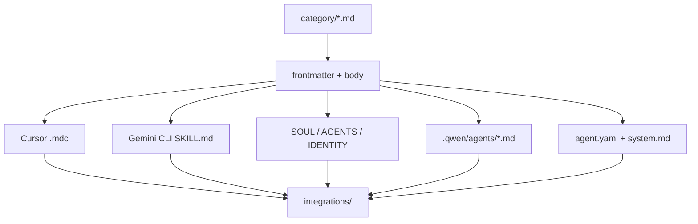

<details>
<summary>相关源文件</summary>

生成本页时使用的主要源文件：

- [scripts/convert.sh](../../../project-repos/agency-agents/scripts/convert.sh)
- [integrations/README.md](../../../project-repos/agency-agents/integrations/README.md)
- [integrations/cursor/README.md](../../../project-repos/agency-agents/integrations/cursor/README.md)
- [integrations/gemini-cli/README.md](../../../project-repos/agency-agents/integrations/gemini-cli/README.md)
- [integrations/openclaw/README.md](../../../project-repos/agency-agents/integrations/openclaw/README.md)

</details>

# 转换流水线

`convert.sh` 是把源 Markdown agent 转成其他 agentic tools 可消费格式的核心脚本。脚本声明输入来自标准 category 目录，输出写到 `integrations/<tool>/`，不会直接改用户配置目录；安装动作由 `install.sh` 负责。Sources: [scripts/convert.sh:3-25](../../../project-repos/agency-agents/scripts/convert.sh#L3-L25), [scripts/convert.sh:58-67](../../../project-repos/agency-agents/scripts/convert.sh#L58-L67), [integrations/README.md:52-58](../../../project-repos/agency-agents/integrations/README.md#L52-L58)

<details class="source-snippets">
<summary>引用源码</summary>

<!-- source-snippets:start -->

#### `scripts/convert.sh:3-25`

```bash
# convert.sh — Convert agency agent .md files into tool-specific formats.
#
# Reads all agent files from the standard category directories and outputs
# converted files to integrations/<tool>/. Run this to regenerate all
# integration files after adding or modifying agents.
#
# Usage:
#   ./scripts/convert.sh [--tool <name>] [--out <dir>] [--parallel] [--jobs N] [--help]
#
# Tools:
#   antigravity  — Antigravity skill files (~/.gemini/antigravity/skills/)
#   gemini-cli   — Gemini CLI extension (skills/ + gemini-extension.json)
#   opencode     — OpenCode agent files (.opencode/agents/*.md)
#   cursor       — Cursor rule files (.cursor/rules/*.mdc)
#   aider        — Single CONVENTIONS.md for Aider
#   windsurf     — Single .windsurfrules for Windsurf
#   openclaw     — OpenClaw workspaces (integrations/openclaw/<agent>/SOUL.md)
#   qwen         — Qwen Code SubAgent files (~/.qwen/agents/*.md)
#   kimi         — Kimi Code CLI agent files (~/.config/kimi/agents/)
#   all          — All tools (default)
#
# Output is written to integrations/<tool>/ relative to the repo root.
# This script never touches user config dirs — see install.sh for that.
```

#### `scripts/convert.sh:58-67`

```bash
# --- Paths ---
SCRIPT_DIR="$(cd "$(dirname "${BASH_SOURCE[0]}")" && pwd)"
REPO_ROOT="$(cd "$SCRIPT_DIR/.." && pwd)"
OUT_DIR="$REPO_ROOT/integrations"
TODAY="$(date +%Y-%m-%d)"

AGENT_DIRS=(
  academic design engineering finance game-development marketing paid-media product project-management
  sales spatial-computing specialized strategy support testing
)
```

#### `integrations/README.md:52-58`

````markdown
## Regenerating Integration Files

If you add or modify agents, regenerate all integration files:

```bash
./scripts/convert.sh
```
````

<!-- source-snippets:end -->
</details>



Sources: [scripts/convert.sh:107-156](../../../project-repos/agency-agents/scripts/convert.sh#L107-L156), [scripts/convert.sh:228-409](../../../project-repos/agency-agents/scripts/convert.sh#L228-L409), [integrations/README.md:6-19](../../../project-repos/agency-agents/integrations/README.md#L6-L19)

<details class="source-snippets">
<summary>引用源码</summary>

<!-- source-snippets:start -->

#### `scripts/convert.sh:107-156`

```bash
# --- Per-tool converters ---

convert_antigravity() {
  local file="$1"
  local name description slug outdir outfile body

  name="$(get_field "name" "$file")"
  description="$(get_field "description" "$file")"
  slug="agency-$(slugify "$name")"
  body="$(get_body "$file")"

  outdir="$OUT_DIR/antigravity/$slug"
  outfile="$outdir/SKILL.md"
  mkdir -p "$outdir"

  # Antigravity SKILL.md format mirrors community skills in ~/.gemini/antigravity/skills/
  cat > "$outfile" <<HEREDOC
---
name: ${slug}
description: ${description}
risk: low
source: community
date_added: '${TODAY}'
---
${body}
HEREDOC
}

convert_gemini_cli() {
  local file="$1"
  local name description slug outdir outfile body

  name="$(get_field "name" "$file")"
  description="$(get_field "description" "$file")"
  slug="$(slugify "$name")"
  body="$(get_body "$file")"

  outdir="$OUT_DIR/gemini-cli/skills/$slug"
  outfile="$outdir/SKILL.md"
  mkdir -p "$outdir"

  # Gemini CLI skill format: minimal frontmatter (name + description only)
  cat > "$outfile" <<HEREDOC
---
name: ${slug}
description: ${description}
---
${body}
HEREDOC
}
```

#### `scripts/convert.sh:228-409`

```bash
convert_cursor() {
  local file="$1"
  local name description slug outfile body

  name="$(get_field "name" "$file")"
  description="$(get_field "description" "$file")"
  slug="$(slugify "$name")"
  body="$(get_body "$file")"

  outfile="$OUT_DIR/cursor/rules/${slug}.mdc"
  mkdir -p "$OUT_DIR/cursor/rules"

  # Cursor .mdc format: description + globs + alwaysApply frontmatter
  cat > "$outfile" <<HEREDOC
---
description: ${description}
globs: ""
alwaysApply: false
---
${body}
HEREDOC
}

convert_openclaw() {
  local file="$1"
  local name description slug outdir body
  local soul_content="" agents_content=""

  name="$(get_field "name" "$file")"
  description="$(get_field "description" "$file")"
  slug="$(slugify "$name")"
  body="$(get_body "$file")"

  outdir="$OUT_DIR/openclaw/$slug"
  mkdir -p "$outdir"

  # Split body sections into SOUL.md (persona) vs AGENTS.md (operations)
  # by matching ## header keywords. Unmatched sections go to AGENTS.md.
  #
  # SOUL keywords: identity, learning & memory, communication, style,
  #   critical rules, rules you must follow
  # AGENTS keywords: everything else (mission, deliverables, workflow, etc.)

  local current_target="agents"  # default bucket
  local current_section=""

  while IFS= read -r line; do
    # Detect ## headers (with or without emoji prefixes)
    if [[ "$line" =~ ^##[[:space:]] ]]; then
      # Flush previous section
      if [[ -n "$current_section" ]]; then
        if [[ "$current_target" == "soul" ]]; then
          soul_content+="$current_section"
        else
          agents_content+="$current_section"
        fi
      fi
      current_section=""

      # Classify this header by keyword (case-insensitive)
      local header_lower
      header_lower="$(echo "$line" | tr '[:upper:]' '[:lower:]')"

      if [[ "$header_lower" =~ identity ]] ||
         [[ "$header_lower" =~ learning.*memory ]] ||
         [[ "$header_lower" =~ communication ]] ||
         [[ "$header_lower" =~ style ]] ||
         [[ "$header_lower" =~ critical.rule ]] ||
         [[ "$header_lower" =~ rules.you.must.follow ]]; then
        current_target="soul"
      else
        current_target="agents"
      fi
    fi

    current_section+="$line"$'\n'
  done <<< "$body"

  # Flush final section
  if [[ -n "$current_section" ]]; then
    if [[ "$current_target" == "soul" ]]; then
      soul_content+="$current_section"
    else
      agents_content+="$current_section"
    fi
  fi

  # Write SOUL.md — persona, tone, boundaries
  cat > "$outdir/SOUL.md" <<HEREDOC
${soul_content}
HEREDOC

  # Write AGENTS.md — mission, deliverables, workflow
  cat > "$outdir/AGENTS.md" <<HEREDOC
${agents_content}
HEREDOC

  # Write IDENTITY.md — emoji + name + vibe from frontmatter, fallback to description
  local emoji vibe
  emoji="$(get_field "emoji" "$file")"
  vibe="$(get_field "vibe" "$file")"

  if [[ -n "$emoji" && -n "$vibe" ]]; then
    cat > "$outdir/IDENTITY.md" <<HEREDOC
# ${emoji} ${name}
${vibe}
HEREDOC
  else
    cat > "$outdir/IDENTITY.md" <<HEREDOC
# ${name}
${description}
HEREDOC
  fi
}

convert_qwen() {
  local file="$1"
  local name description tools slug outfile body

  name="$(get_field "name" "$file")"
... snippet truncated ...
```

#### `integrations/README.md:6-19`

```markdown
## Supported Tools

- **[Claude Code](#claude-code)** — `.md` agents, use the repo directly
- **[GitHub Copilot](#github-copilot)** — `.md` agents, use the repo directly
- **[Antigravity](#antigravity)** — `SKILL.md` per agent in `antigravity/`
- **[Gemini CLI](#gemini-cli)** — extension + `SKILL.md` files in `gemini-cli/`
- **[OpenCode](#opencode)** — `.md` agent files in `opencode/`
- **[OpenClaw](#openclaw)** — `SOUL.md` + `AGENTS.md` + `IDENTITY.md` workspaces
- **[Cursor](#cursor)** — `.mdc` rule files in `cursor/`
- **[Aider](#aider)** — `CONVENTIONS.md` in `aider/`
- **[Windsurf](#windsurf)** — `.windsurfrules` in `windsurf/`
- **[Kimi Code](#kimi-code)** — YAML agent specs in `kimi/`
- **[Qwen Code](#qwen-code)** — project-scoped `.md` SubAgents in `.qwen/agents/`

```

<!-- source-snippets:end -->
</details>

## 转换规则

| 目标工具 | 输出形态 | 关键代码证据 |
|----------|----------|--------------|
| Cursor | `.mdc` rule，包含 `description`、`globs`、`alwaysApply` | `convert_cursor` |
| OpenClaw | 每个 agent 一个 workspace，拆分 `SOUL.md`、`AGENTS.md`、`IDENTITY.md` | `convert_openclaw` |
| Qwen Code | project-scoped `.md` SubAgent | `convert_qwen` |
| Kimi Code | `agent.yaml` + `system.md` | `convert_kimi` |

Sources: [scripts/convert.sh:228-249](../../../project-repos/agency-agents/scripts/convert.sh#L228-L249), [scripts/convert.sh:251-341](../../../project-repos/agency-agents/scripts/convert.sh#L251-L341), [scripts/convert.sh:343-376](../../../project-repos/agency-agents/scripts/convert.sh#L343-L376), [scripts/convert.sh:378-409](../../../project-repos/agency-agents/scripts/convert.sh#L378-L409)

<details class="source-snippets">
<summary>引用源码</summary>

<!-- source-snippets:start -->

#### `scripts/convert.sh:228-249`

```bash
convert_cursor() {
  local file="$1"
  local name description slug outfile body

  name="$(get_field "name" "$file")"
  description="$(get_field "description" "$file")"
  slug="$(slugify "$name")"
  body="$(get_body "$file")"

  outfile="$OUT_DIR/cursor/rules/${slug}.mdc"
  mkdir -p "$OUT_DIR/cursor/rules"

  # Cursor .mdc format: description + globs + alwaysApply frontmatter
  cat > "$outfile" <<HEREDOC
---
description: ${description}
globs: ""
alwaysApply: false
---
${body}
HEREDOC
}
```

#### `scripts/convert.sh:251-341`

```bash
convert_openclaw() {
  local file="$1"
  local name description slug outdir body
  local soul_content="" agents_content=""

  name="$(get_field "name" "$file")"
  description="$(get_field "description" "$file")"
  slug="$(slugify "$name")"
  body="$(get_body "$file")"

  outdir="$OUT_DIR/openclaw/$slug"
  mkdir -p "$outdir"

  # Split body sections into SOUL.md (persona) vs AGENTS.md (operations)
  # by matching ## header keywords. Unmatched sections go to AGENTS.md.
  #
  # SOUL keywords: identity, learning & memory, communication, style,
  #   critical rules, rules you must follow
  # AGENTS keywords: everything else (mission, deliverables, workflow, etc.)

  local current_target="agents"  # default bucket
  local current_section=""

  while IFS= read -r line; do
    # Detect ## headers (with or without emoji prefixes)
    if [[ "$line" =~ ^##[[:space:]] ]]; then
      # Flush previous section
      if [[ -n "$current_section" ]]; then
        if [[ "$current_target" == "soul" ]]; then
          soul_content+="$current_section"
        else
          agents_content+="$current_section"
        fi
      fi
      current_section=""

      # Classify this header by keyword (case-insensitive)
      local header_lower
      header_lower="$(echo "$line" | tr '[:upper:]' '[:lower:]')"

      if [[ "$header_lower" =~ identity ]] ||
         [[ "$header_lower" =~ learning.*memory ]] ||
         [[ "$header_lower" =~ communication ]] ||
         [[ "$header_lower" =~ style ]] ||
         [[ "$header_lower" =~ critical.rule ]] ||
         [[ "$header_lower" =~ rules.you.must.follow ]]; then
        current_target="soul"
      else
        current_target="agents"
      fi
    fi

    current_section+="$line"$'\n'
  done <<< "$body"

  # Flush final section
  if [[ -n "$current_section" ]]; then
    if [[ "$current_target" == "soul" ]]; then
      soul_content+="$current_section"
    else
      agents_content+="$current_section"
    fi
  fi

  # Write SOUL.md — persona, tone, boundaries
  cat > "$outdir/SOUL.md" <<HEREDOC
${soul_content}
HEREDOC

  # Write AGENTS.md — mission, deliverables, workflow
  cat > "$outdir/AGENTS.md" <<HEREDOC
${agents_content}
HEREDOC

  # Write IDENTITY.md — emoji + name + vibe from frontmatter, fallback to description
  local emoji vibe
  emoji="$(get_field "emoji" "$file")"
  vibe="$(get_field "vibe" "$file")"

  if [[ -n "$emoji" && -n "$vibe" ]]; then
    cat > "$outdir/IDENTITY.md" <<HEREDOC
# ${emoji} ${name}
${vibe}
HEREDOC
  else
    cat > "$outdir/IDENTITY.md" <<HEREDOC
# ${name}
${description}
HEREDOC
  fi
}
```

#### `scripts/convert.sh:343-376`

```bash
convert_qwen() {
  local file="$1"
  local name description tools slug outfile body

  name="$(get_field "name" "$file")"
  description="$(get_field "description" "$file")"
  tools="$(get_field "tools" "$file")"
  slug="$(slugify "$name")"
  body="$(get_body "$file")"

  outfile="$OUT_DIR/qwen/agents/${slug}.md"
  mkdir -p "$(dirname "$outfile")"

  # Qwen Code SubAgent format: .md with YAML frontmatter in ~/.qwen/agents/
  # name and description required; tools optional (only if present in source)
  if [[ -n "$tools" ]]; then
    cat > "$outfile" <<HEREDOC
---
name: ${slug}
description: ${description}
tools: ${tools}
---
${body}
HEREDOC
  else
    cat > "$outfile" <<HEREDOC
---
name: ${slug}
description: ${description}
---
${body}
HEREDOC
  fi
}
```

#### `scripts/convert.sh:378-409`

```bash
convert_kimi() {
  local file="$1"
  local name description slug outdir agent_file body

  name="$(get_field "name" "$file")"
  description="$(get_field "description" "$file")"
  slug="$(slugify "$name")"
  body="$(get_body "$file")"

  outdir="$OUT_DIR/kimi/$slug"
  agent_file="$outdir/agent.yaml"
  mkdir -p "$outdir"

  # Kimi Code CLI agent format: YAML with separate system prompt file
  # Uses extend: default to inherit Kimi's default toolset
  cat > "$agent_file" <<HEREDOC
version: 1
agent:
  name: ${slug}
  extend: default
  system_prompt_path: ./system.md
HEREDOC

  # Write system prompt to separate file
  cat > "$outdir/system.md" <<HEREDOC
# ${name}

${description}

${body}
HEREDOC
}
```

<!-- source-snippets:end -->
</details>

## OpenClaw 拆分逻辑

OpenClaw 是最有结构化语义的转换目标：脚本读取每个 `##` 标题，如果标题包含 identity、learning memory、communication、style、critical rules 等关键词，就写入 `SOUL.md`；其他 mission、deliverables、workflow 进入 `AGENTS.md`；frontmatter 的 `emoji` 和 `vibe` 被用于 `IDENTITY.md`。Sources: [scripts/convert.sh:251-341](../../../project-repos/agency-agents/scripts/convert.sh#L251-L341)

<details class="source-snippets">
<summary>引用源码</summary>

<!-- source-snippets:start -->

#### `scripts/convert.sh:251-341`

```bash
convert_openclaw() {
  local file="$1"
  local name description slug outdir body
  local soul_content="" agents_content=""

  name="$(get_field "name" "$file")"
  description="$(get_field "description" "$file")"
  slug="$(slugify "$name")"
  body="$(get_body "$file")"

  outdir="$OUT_DIR/openclaw/$slug"
  mkdir -p "$outdir"

  # Split body sections into SOUL.md (persona) vs AGENTS.md (operations)
  # by matching ## header keywords. Unmatched sections go to AGENTS.md.
  #
  # SOUL keywords: identity, learning & memory, communication, style,
  #   critical rules, rules you must follow
  # AGENTS keywords: everything else (mission, deliverables, workflow, etc.)

  local current_target="agents"  # default bucket
  local current_section=""

  while IFS= read -r line; do
    # Detect ## headers (with or without emoji prefixes)
    if [[ "$line" =~ ^##[[:space:]] ]]; then
      # Flush previous section
      if [[ -n "$current_section" ]]; then
        if [[ "$current_target" == "soul" ]]; then
          soul_content+="$current_section"
        else
          agents_content+="$current_section"
        fi
      fi
      current_section=""

      # Classify this header by keyword (case-insensitive)
      local header_lower
      header_lower="$(echo "$line" | tr '[:upper:]' '[:lower:]')"

      if [[ "$header_lower" =~ identity ]] ||
         [[ "$header_lower" =~ learning.*memory ]] ||
         [[ "$header_lower" =~ communication ]] ||
         [[ "$header_lower" =~ style ]] ||
         [[ "$header_lower" =~ critical.rule ]] ||
         [[ "$header_lower" =~ rules.you.must.follow ]]; then
        current_target="soul"
      else
        current_target="agents"
      fi
    fi

    current_section+="$line"$'\n'
  done <<< "$body"

  # Flush final section
  if [[ -n "$current_section" ]]; then
    if [[ "$current_target" == "soul" ]]; then
      soul_content+="$current_section"
    else
      agents_content+="$current_section"
    fi
  fi

  # Write SOUL.md — persona, tone, boundaries
  cat > "$outdir/SOUL.md" <<HEREDOC
${soul_content}
HEREDOC

  # Write AGENTS.md — mission, deliverables, workflow
  cat > "$outdir/AGENTS.md" <<HEREDOC
${agents_content}
HEREDOC

  # Write IDENTITY.md — emoji + name + vibe from frontmatter, fallback to description
  local emoji vibe
  emoji="$(get_field "emoji" "$file")"
  vibe="$(get_field "vibe" "$file")"

  if [[ -n "$emoji" && -n "$vibe" ]]; then
    cat > "$outdir/IDENTITY.md" <<HEREDOC
# ${emoji} ${name}
${vibe}
HEREDOC
  else
    cat > "$outdir/IDENTITY.md" <<HEREDOC
# ${name}
${description}
HEREDOC
  fi
}
```

<!-- source-snippets:end -->
</details>

## 相关页面

- [安装与工具集成](installation-and-tooling.md)
- [Agent 编写模型](agent-authoring-model.md)
- [仓库结构与内容地图](repository-map.md)
