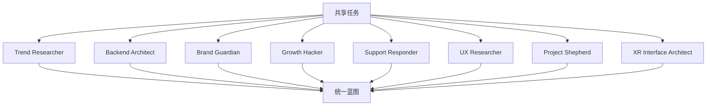

<details>
<summary>相关源文件</summary>

生成本页时使用的主要源文件：

- [examples/README.md](https://github.com/msitarzewski/agency-agents/blob/783f6a72bfd7f3135700ac273c619d92821b419a/examples/README.md)
- [README.md](https://github.com/msitarzewski/agency-agents/blob/783f6a72bfd7f3135700ac273c619d92821b419a/README.md)
- [strategy/QUICKSTART.md](https://github.com/msitarzewski/agency-agents/blob/783f6a72bfd7f3135700ac273c619d92821b419a/strategy/QUICKSTART.md)
- [strategy/nexus-strategy.md](https://github.com/msitarzewski/agency-agents/blob/783f6a72bfd7f3135700ac273c619d92821b419a/strategy/nexus-strategy.md)
- [strategy/playbooks/phase-3-build.md](https://github.com/msitarzewski/agency-agents/blob/783f6a72bfd7f3135700ac273c619d92821b419a/strategy/playbooks/phase-3-build.md)

</details>

# 示例与使用场景

`examples/README.md` 说明 examples 目录用于展示多个 agent 同时投入真实任务时的协作效果，而不只是单个 agent 定义。示例 `nexus-spatial-discovery.md` 描述 8 个 agent 并行完成产品发现，输出市场验证、架构、品牌、GTM、支持、UX、项目计划和空间界面规格。Sources: [examples/README.md:1-10](../../../project-repos/agency-agents/examples/README.md#L1-L10), [examples/README.md:13-40](../../../project-repos/agency-agents/examples/README.md#L13-L40)

<details class="source-snippets">
<summary>引用源码</summary>

<!-- source-snippets:start -->

#### `examples/README.md:1-10`

```markdown
# Examples

This directory contains example outputs demonstrating how the agency's agents can be orchestrated together to tackle real-world tasks.

## Why This Exists

The agency-agents repo defines dozens of specialized agents across engineering, design, marketing, product, support, spatial computing, and project management. But agent definitions alone don't show what happens when you **deploy them all at once** on a single mission.

These examples answer the question: *"What does it actually look like when the full agency collaborates?"*

```

#### `examples/README.md:13-40`

```markdown
### [nexus-spatial-discovery.md](./nexus-spatial-discovery.md)

**What:** A complete product discovery exercise where 8 agents worked in parallel to evaluate a software opportunity and produce a unified plan.

**The scenario:** Web research identified an opportunity at the intersection of AI agent orchestration and spatial computing. The entire agency was then deployed simultaneously to produce:

- Market validation and competitive analysis
- Technical architecture (8-service system design with full SQL schema)
- Brand strategy and visual identity
- Go-to-market and growth plan
- Customer support operations blueprint
- UX research plan with personas and journey maps
- 35-week project execution plan with 65 sprint tickets
- Spatial interface architecture specification

**Agents used:**
| Agent | Role |
|-------|------|
| Product Trend Researcher | Market validation, competitive landscape |
| Backend Architect | System architecture, data model, API design |
| Brand Guardian | Positioning, visual identity, naming |
| Growth Hacker | GTM strategy, pricing, launch plan |
| Support Responder | Support tiers, onboarding, community |
| UX Researcher | Personas, journey maps, design principles |
| Project Shepherd | Phase plan, sprints, risk register |
| XR Interface Architect | Spatial UI specification |

**Key takeaway:** All 8 agents ran in parallel and produced coherent, cross-referencing plans without coordination overhead. The output demonstrates the agency's ability to go from "find an opportunity" to "here's the full blueprint" in a single session.
```

<!-- source-snippets:end -->
</details>


Sources: [examples/README.md:13-40](../../../project-repos/agency-agents/examples/README.md#L13-L40)

<details class="source-snippets">
<summary>引用源码</summary>

<!-- source-snippets:start -->

#### `examples/README.md:13-40`

```markdown
### [nexus-spatial-discovery.md](./nexus-spatial-discovery.md)

**What:** A complete product discovery exercise where 8 agents worked in parallel to evaluate a software opportunity and produce a unified plan.

**The scenario:** Web research identified an opportunity at the intersection of AI agent orchestration and spatial computing. The entire agency was then deployed simultaneously to produce:

- Market validation and competitive analysis
- Technical architecture (8-service system design with full SQL schema)
- Brand strategy and visual identity
- Go-to-market and growth plan
- Customer support operations blueprint
- UX research plan with personas and journey maps
- 35-week project execution plan with 65 sprint tickets
- Spatial interface architecture specification

**Agents used:**
| Agent | Role |
|-------|------|
| Product Trend Researcher | Market validation, competitive landscape |
| Backend Architect | System architecture, data model, API design |
| Brand Guardian | Positioning, visual identity, naming |
| Growth Hacker | GTM strategy, pricing, launch plan |
| Support Responder | Support tiers, onboarding, community |
| UX Researcher | Personas, journey maps, design principles |
| Project Shepherd | Phase plan, sprints, risk register |
| XR Interface Architect | Spatial UI specification |

**Key takeaway:** All 8 agents ran in parallel and produced coherent, cross-referencing plans without coordination overhead. The output demonstrates the agency's ability to go from "find an opportunity" to "here's the full blueprint" in a single session.
```

<!-- source-snippets:end -->
</details>
## README 中的四类真实场景

README 提供多种组合使用场景：Startup MVP、Marketing Campaign、Enterprise Feature Development、Paid Media Account Takeover 等，每个场景用一组 agent 覆盖从需求、设计、实现、增长到质量验证的不同环节。Sources: [README.md:385-423](../../../project-repos/agency-agents/README.md#L385-L423), [README.md:427-437](../../../project-repos/agency-agents/README.md#L427-L437)

<details class="source-snippets">
<summary>引用源码</summary>

<!-- source-snippets:start -->

#### `README.md:385-423`

```markdown
## 🎯 Real-World Use Cases

### Scenario 1: Building a Startup MVP

**Your Team**:
1. 🎨 **Frontend Developer** - Build the React app
2. 🏗️ **Backend Architect** - Design the API and database
3. 🚀 **Growth Hacker** - Plan user acquisition
4. ⚡ **Rapid Prototyper** - Fast iteration cycles
5. 🔍 **Reality Checker** - Ensure quality before launch

**Result**: Ship faster with specialized expertise at every stage.

---

### Scenario 2: Marketing Campaign Launch

**Your Team**:
1. 📝 **Content Creator** - Develop campaign content
2. 🐦 **Twitter Engager** - Twitter strategy and execution
3. 📸 **Instagram Curator** - Visual content and stories
4. 🤝 **Reddit Community Builder** - Authentic community engagement
5. 📊 **Analytics Reporter** - Track and optimize performance

**Result**: Multi-channel coordinated campaign with platform-specific expertise.

---

### Scenario 3: Enterprise Feature Development

**Your Team**:
1. 👔 **Senior Project Manager** - Scope and task planning
2. 💎 **Senior Developer** - Complex implementation
3. 🎨 **UI Designer** - Design system and components
4. 🧪 **Experiment Tracker** - A/B test planning
5. 📸 **Evidence Collector** - Quality verification
6. 🔍 **Reality Checker** - Production readiness

**Result**: Enterprise-grade delivery with quality gates and documentation.
```

#### `README.md:427-437`

```markdown
### Scenario 4: Paid Media Account Takeover

**Your Team**:

1. 📋 **Paid Media Auditor** - Comprehensive account assessment
2. 📡 **Tracking & Measurement Specialist** - Verify conversion tracking accuracy
3. 💰 **PPC Campaign Strategist** - Redesign account architecture
4. 🔍 **Search Query Analyst** - Clean up wasted spend from search terms
5. ✍️ **Ad Creative Strategist** - Refresh all ad copy and extensions
6. 📊 **Analytics Reporter** (Support Division) - Build reporting dashboards

```

<!-- source-snippets:end -->
</details>
## NEXUS 快速入口

Quickstart 提供可复制 prompt：Full 模式覆盖 Phase 0 到 Phase 6，Sprint 模式跳过市场验证从架构与 sprint planning 开始，Micro 模式提供 bug fix、marketing campaign、compliance audit、performance investigation、market research、UX improvement 等短流程。Sources: [strategy/QUICKSTART.md:21-42](../../../project-repos/agency-agents/strategy/QUICKSTART.md#L21-L42), [strategy/QUICKSTART.md:46-67](../../../project-repos/agency-agents/strategy/QUICKSTART.md#L46-L67), [strategy/QUICKSTART.md:71-119](../../../project-repos/agency-agents/strategy/QUICKSTART.md#L71-L119)

<details class="source-snippets">
<summary>引用源码</summary>

<!-- source-snippets:start -->

#### `strategy/QUICKSTART.md:21-42`

````markdown
## 🚀 NEXUS-Full: Start a Complete Project

**Copy this prompt to activate the full pipeline:**

```
Activate Agents Orchestrator in NEXUS-Full mode.

Project: [YOUR PROJECT NAME]
Specification: [DESCRIBE YOUR PROJECT OR LINK TO SPEC]

Execute the complete NEXUS pipeline:
- Phase 0: Discovery (Trend Researcher, Feedback Synthesizer, UX Researcher, Analytics Reporter, Legal Compliance Checker, Tool Evaluator)
- Phase 1: Strategy (Studio Producer, Senior Project Manager, Sprint Prioritizer, UX Architect, Brand Guardian, Backend Architect, Finance Tracker)
- Phase 2: Foundation (DevOps Automator, Frontend Developer, Backend Architect, UX Architect, Infrastructure Maintainer)
- Phase 3: Build (Dev↔QA loops — all engineering + Evidence Collector)
- Phase 4: Harden (Reality Checker, Performance Benchmarker, API Tester, Legal Compliance Checker)
- Phase 5: Launch (Growth Hacker, Content Creator, all marketing agents, DevOps Automator)
- Phase 6: Operate (Analytics Reporter, Infrastructure Maintainer, Support Responder, ongoing)

Quality gates between every phase. Evidence required for all assessments.
Maximum 3 retries per task before escalation.
```
````

#### `strategy/QUICKSTART.md:46-67`

````markdown
## 🏃 NEXUS-Sprint: Build a Feature or MVP

**Copy this prompt:**

```
Activate Agents Orchestrator in NEXUS-Sprint mode.

Feature/MVP: [DESCRIBE WHAT YOU'RE BUILDING]
Timeline: [TARGET WEEKS]
Skip Phase 0 (market already validated).

Sprint team:
- PM: Senior Project Manager, Sprint Prioritizer
- Design: UX Architect, Brand Guardian
- Engineering: Frontend Developer, Backend Architect, DevOps Automator
- QA: Evidence Collector, Reality Checker, API Tester
- Support: Analytics Reporter

Begin at Phase 1 with architecture and sprint planning.
Run Dev↔QA loops for all implementation tasks.
Reality Checker approval required before launch.
```
````

#### `strategy/QUICKSTART.md:71-119`

````markdown
## 🎯 NEXUS-Micro: Do a Specific Task

**Pick your scenario and copy the prompt:**

### Fix a Bug
```
Activate Backend Architect to investigate and fix [BUG DESCRIPTION].
After fix, activate API Tester to verify the fix.
Then activate Evidence Collector to confirm no visual regressions.
```

### Run a Marketing Campaign
```
Activate Social Media Strategist as campaign lead for [CAMPAIGN DESCRIPTION].
Team: Content Creator, Twitter Engager, Instagram Curator, Reddit Community Builder.
Brand Guardian reviews all content before publishing.
Analytics Reporter tracks performance daily.
Growth Hacker optimizes channels weekly.
```

### Conduct a Compliance Audit
```
Activate Legal Compliance Checker for comprehensive compliance audit.
Scope: [GDPR / CCPA / HIPAA / ALL]
After audit, activate Executive Summary Generator to create stakeholder report.
```

### Investigate Performance Issues
```
Activate Performance Benchmarker to diagnose performance issues.
Scope: [API response times / Page load / Database queries / All]
After diagnosis, activate Infrastructure Maintainer for optimization.
DevOps Automator deploys any infrastructure changes.
```

### Market Research
```
Activate Trend Researcher for market intelligence on [DOMAIN].
Deliverables: Competitive landscape, market sizing, trend forecast.
After research, activate Executive Summary Generator for executive brief.
```

### UX Improvement
```
Activate UX Researcher to identify usability issues in [FEATURE/PRODUCT].
After research, activate UX Architect to design improvements.
Frontend Developer implements changes.
Evidence Collector verifies improvements.
```
````

<!-- source-snippets:end -->
</details>
## 示例贡献要求

examples 文档要求新示例体现多个 agent 围绕共享目标协作、展示 The Agency 能力广度，并具备真实应用价值。Sources: [examples/README.md:42-49](../../../project-repos/agency-agents/examples/README.md#L42-L49)

<details class="source-snippets">
<summary>引用源码</summary>

<!-- source-snippets:start -->

#### `examples/README.md:42-49`

```markdown
## Adding New Examples

If you run an interesting multi-agent exercise, consider adding it here. Good examples show:

- Multiple agents collaborating on a shared objective
- The breadth of the agency's capabilities
- Real-world applicability of the agent definitions
```

<!-- source-snippets:end -->
</details>
## 相关页面

- [NEXUS 多 Agent 编排](nexus-orchestration.md)
- [Agent 目录与专业分工](agent-catalog.md)
- [项目概览](overview.md)
