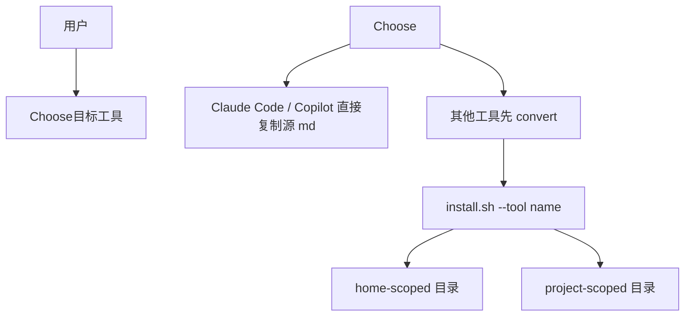

<details>
<summary>相关源文件</summary>

生成本页时使用的主要源文件：

- [README.md](../../../project-repos/agency-agents/README.md)
- [integrations/README.md](../../../project-repos/agency-agents/integrations/README.md)
- [scripts/install.sh](../../../project-repos/agency-agents/scripts/install.sh)
- [integrations/cursor/README.md](../../../project-repos/agency-agents/integrations/cursor/README.md)
- [integrations/gemini-cli/README.md](../../../project-repos/agency-agents/integrations/gemini-cli/README.md)
- [integrations/openclaw/README.md](../../../project-repos/agency-agents/integrations/openclaw/README.md)

</details>

# 安装与工具集成

README 给出两个核心路径：Claude Code 可直接安装源 Markdown agent；其他工具通常先运行 `./scripts/convert.sh` 生成 integration files，再运行 `./scripts/install.sh` 或指定 `--tool`。Sources: [README.md:25-71](../../../project-repos/agency-agents/README.md#L25-L71), [integrations/README.md:20-39](../../../project-repos/agency-agents/integrations/README.md#L20-L39)

<details class="source-snippets">
<summary>引用源码</summary>

<!-- source-snippets:start -->

#### `README.md:25-71`

````markdown
## ⚡ Quick Start

### Option 1: Use with Claude Code (Recommended)

```bash
# Install all agents to your Claude Code directory
./scripts/install.sh --tool claude-code

# Or manually copy a category if you only want one division
cp engineering/*.md ~/.claude/agents/

# Then activate any agent in your Claude Code sessions:
# "Hey Claude, activate Frontend Developer mode and help me build a React component"
```

### Option 2: Use as Reference

Each agent file contains:
- Identity & personality traits
- Core mission & workflows
- Technical deliverables with code examples
- Success metrics & communication style

Browse the agents below and copy/adapt the ones you need!

### Option 3: Use with Other Tools (GitHub Copilot, Antigravity, Gemini CLI, OpenCode, OpenClaw, Cursor, Aider, Windsurf, Kimi Code)

```bash
# Step 1 -- generate integration files for all supported tools
./scripts/convert.sh

# Step 2 -- install interactively (auto-detects what you have installed)
./scripts/install.sh

# Or target a specific tool directly
./scripts/install.sh --tool antigravity
./scripts/install.sh --tool gemini-cli
./scripts/install.sh --tool opencode
./scripts/install.sh --tool copilot
./scripts/install.sh --tool openclaw
./scripts/install.sh --tool cursor
./scripts/install.sh --tool aider
./scripts/install.sh --tool windsurf
./scripts/install.sh --tool kimi
```

See the [Multi-Tool Integrations](#-multi-tool-integrations) section below for full details.
````

#### `integrations/README.md:20-39`

````markdown
## Quick Install

```bash
# Install for all detected tools automatically
./scripts/install.sh

# Install a specific home-scoped tool
./scripts/install.sh --tool antigravity
./scripts/install.sh --tool copilot
./scripts/install.sh --tool openclaw
./scripts/install.sh --tool claude-code

# Gemini CLI needs generated integration files on a fresh clone
./scripts/convert.sh --tool gemini-cli
./scripts/install.sh --tool gemini-cli

# Qwen Code also needs generated SubAgent files on a fresh clone
./scripts/convert.sh --tool qwen
./scripts/install.sh --tool qwen
```
````

<!-- source-snippets:end -->
</details>



Sources: [scripts/install.sh:9-23](../../../project-repos/agency-agents/scripts/install.sh#L9-L23), [scripts/install.sh:305-379](../../../project-repos/agency-agents/scripts/install.sh#L305-L379), [scripts/install.sh:381-519](../../../project-repos/agency-agents/scripts/install.sh#L381-L519)

<details class="source-snippets">
<summary>引用源码</summary>

<!-- source-snippets:start -->

#### `scripts/install.sh:9-23`

```bash
# Usage:
#   ./scripts/install.sh [--tool <name>] [--interactive] [--no-interactive] [--parallel] [--jobs N] [--help]
#
# Tools:
#   claude-code  -- Copy agents to ~/.claude/agents/
#   copilot      -- Copy agents to ~/.github/agents/ and ~/.copilot/agents/
#   antigravity  -- Copy skills to ~/.gemini/antigravity/skills/
#   gemini-cli   -- Install extension to ~/.gemini/extensions/agency-agents/
#   opencode     -- Copy agents to .opencode/agents/ in current directory
#   cursor       -- Copy rules to .cursor/rules/ in current directory
#   aider        -- Copy CONVENTIONS.md to current directory
#   windsurf     -- Copy .windsurfrules to current directory
#   openclaw     -- Copy workspaces to ~/.openclaw/agency-agents/
#   qwen         -- Copy SubAgents to ~/.qwen/agents/ (user-wide) or .qwen/agents/ (project)
#   all          -- Install for all detected tools (default)
```

#### `scripts/install.sh:305-379`

```bash
install_claude_code() {
  local dest="${HOME}/.claude/agents"
  local count=0
  mkdir -p "$dest"
  local dir f first_line
  for dir in "${AGENT_DIRS[@]}"; do
    [[ -d "$REPO_ROOT/$dir" ]] || continue
    while IFS= read -r -d '' f; do
      first_line="$(head -1 "$f")"
      [[ "$first_line" == "---" ]] || continue
      cp "$f" "$dest/"
      (( count++ )) || true
    done < <(find "$REPO_ROOT/$dir" -name "*.md" -type f -print0)
  done
  ok "Claude Code: $count agents -> $dest"
}

install_copilot() {
  local dest_github="${HOME}/.github/agents"
  local dest_copilot="${HOME}/.copilot/agents"
  local count=0
  mkdir -p "$dest_github" "$dest_copilot"
  local dir f first_line
  for dir in "${AGENT_DIRS[@]}"; do
    [[ -d "$REPO_ROOT/$dir" ]] || continue
    while IFS= read -r -d '' f; do
      first_line="$(head -1 "$f")"
      [[ "$first_line" == "---" ]] || continue
      cp "$f" "$dest_github/"
      cp "$f" "$dest_copilot/"
      (( count++ )) || true
    done < <(find "$REPO_ROOT/$dir" -name "*.md" -type f -print0)
  done
  ok "Copilot: $count agents -> $dest_github"
  ok "Copilot: $count agents -> $dest_copilot"
  warn "Copilot: Verify VS Code setting 'chat.agentFilesLocations' includes your install path."
  dim  "         Open Settings (Ctrl/Cmd+,) -> search 'chat.agentFilesLocations'"
}

install_antigravity() {
  local src="$INTEGRATIONS/antigravity"
  local dest="${HOME}/.gemini/antigravity/skills"
  local count=0
  [[ -d "$src" ]] || { err "integrations/antigravity missing. Run convert.sh first."; return 1; }
  mkdir -p "$dest"
  local d
  while IFS= read -r -d '' d; do
    local name; name="$(basename "$d")"
    mkdir -p "$dest/$name"
    cp "$d/SKILL.md" "$dest/$name/SKILL.md"
    (( count++ )) || true
  done < <(find "$src" -mindepth 1 -maxdepth 1 -type d -print0)
  ok "Antigravity: $count skills -> $dest"
}

install_gemini_cli() {
  local src="$INTEGRATIONS/gemini-cli"
  local dest="${HOME}/.gemini/extensions/agency-agents"
  local count=0
  local manifest="$src/gemini-extension.json"
  local skills_dir="$src/skills"
  [[ -d "$src" ]] || { err "integrations/gemini-cli missing. Run ./scripts/convert.sh --tool gemini-cli first."; return 1; }
  [[ -f "$manifest" ]] || { err "integrations/gemini-cli/gemini-extension.json missing. Run ./scripts/convert.sh --tool gemini-cli first."; return 1; }
  [[ -d "$skills_dir" ]] || { err "integrations/gemini-cli/skills missing. Run ./scripts/convert.sh --tool gemini-cli first."; return 1; }
  mkdir -p "$dest/skills"
  cp "$manifest" "$dest/gemini-extension.json"
  local d
  while IFS= read -r -d '' d; do
    local name; name="$(basename "$d")"
    mkdir -p "$dest/skills/$name"
    cp "$d/SKILL.md" "$dest/skills/$name/SKILL.md"
    (( count++ )) || true
  done < <(find "$skills_dir" -mindepth 1 -maxdepth 1 -type d -print0)
  ok "Gemini CLI: $count skills -> $dest"
}
```

#### `scripts/install.sh:381-519`

```bash
install_opencode() {
  local src="$INTEGRATIONS/opencode"
  local dest="${PWD}/.opencode/agents"
  local count=0
  [[ -d "$src" ]] || { err "integrations/opencode missing. Run convert.sh first."; return 1; }
  # Support both flat layout (integrations/opencode/*.md) and nested (integrations/opencode/agents/*.md)
  local search_dir="$src"
  [[ -d "$src/agents" ]] && search_dir="$src/agents"
  mkdir -p "$dest"
  local f
  while IFS= read -r -d '' f; do
    local base; base="$(basename "$f")"
    [[ "$base" == "README.md" ]] && continue
    cp "$f" "$dest/"; (( count++ )) || true
  done < <(find "$search_dir" -maxdepth 1 -name "*.md" -print0)
  if (( count == 0 )); then
    warn "OpenCode: no agent files found in $search_dir. Run convert.sh --tool opencode first."
  else
    ok "OpenCode: $count agents -> $dest"
  fi
  warn "OpenCode: project-scoped. Run from your project root to install there."
}

install_openclaw() {
  local src="$INTEGRATIONS/openclaw"
  local dest="${HOME}/.openclaw/agency-agents"
  local count=0
  local existing_agents=""
  [[ -d "$src" ]] || { err "integrations/openclaw missing. Run convert.sh first."; return 1; }
  mkdir -p "$dest"
  if command -v openclaw >/dev/null 2>&1; then
    existing_agents=$'\n'"$(openclaw agents list --json 2>/dev/null | sed -n 's/^[[:space:]]*\"id\": \"\\([^\"]*\\)\".*/\\1/p')"$'\n'
  fi
  local d
  while IFS= read -r -d '' d; do
    local name; name="$(basename "$d")"
    [[ -f "$d/SOUL.md" && -f "$d/AGENTS.md" && -f "$d/IDENTITY.md" ]] || continue
    mkdir -p "$dest/$name"
    cp "$d/SOUL.md" "$dest/$name/SOUL.md"
    cp "$d/AGENTS.md" "$dest/$name/AGENTS.md"
    cp "$d/IDENTITY.md" "$dest/$name/IDENTITY.md"
    if command -v openclaw >/dev/null 2>&1; then
      if [[ "$existing_agents" != *$'\n'"$name"$'\n'* ]]; then
        openclaw agents add "$name" --workspace "$dest/$name" --non-interactive || true
      fi
    fi
    (( count++ )) || true
  done < <(find "$src" -mindepth 1 -maxdepth 1 -type d -print0)
  if (( count == 0 )); then
    err "integrations/openclaw contains no generated workspaces. Run ./scripts/convert.sh --tool openclaw first."
    return 1
  fi
  ok "OpenClaw: $count workspaces -> $dest"
  if command -v openclaw >/dev/null 2>&1; then
    warn "OpenClaw: run 'openclaw gateway restart' to activate new agents"
  fi
}

install_cursor() {
  local src="$INTEGRATIONS/cursor/rules"
  local dest="${PWD}/.cursor/rules"
  local count=0
  [[ -d "$src" ]] || { err "integrations/cursor missing. Run convert.sh first."; return 1; }
  mkdir -p "$dest"
  local f
  while IFS= read -r -d '' f; do
    cp "$f" "$dest/"; (( count++ )) || true
  done < <(find "$src" -maxdepth 1 -name "*.mdc" -print0)
  ok "Cursor: $count rules -> $dest"
  warn "Cursor: project-scoped. Run from your project root to install there."
}

install_aider() {
  local src="$INTEGRATIONS/aider/CONVENTIONS.md"
  local dest="${PWD}/CONVENTIONS.md"
  [[ -f "$src" ]] || { err "integrations/aider/CONVENTIONS.md missing. Run convert.sh first."; return 1; }
  if [[ -f "$dest" ]]; then
    warn "Aider: CONVENTIONS.md already exists at $dest (remove to reinstall)."
    return 0
  fi
  cp "$src" "$dest"
  ok "Aider: installed -> $dest"
  warn "Aider: project-scoped. Run from your project root to install there."
}

install_windsurf() {
  local src="$INTEGRATIONS/windsurf/.windsurfrules"
  local dest="${PWD}/.windsurfrules"
  [[ -f "$src" ]] || { err "integrations/windsurf/.windsurfrules missing. Run convert.sh first."; return 1; }
  if [[ -f "$dest" ]]; then
    warn "Windsurf: .windsurfrules already exists at $dest (remove to reinstall)."
    return 0
  fi
  cp "$src" "$dest"
  ok "Windsurf: installed -> $dest"
  warn "Windsurf: project-scoped. Run from your project root to install there."
}

install_qwen() {
  local src="$INTEGRATIONS/qwen/agents"
  local dest="${PWD}/.qwen/agents"
  local count=0

  [[ -d "$src" ]] || { err "integrations/qwen missing. Run convert.sh first."; return 1; }

  mkdir -p "$dest"

  local f
  while IFS= read -r -d '' f; do
    cp "$f" "$dest/"
    (( count++ )) || true
  done < <(find "$src" -maxdepth 1 -name "*.md" -print0)

  ok "Qwen Code: installed $count agents to $dest"
  warn "Qwen Code: project-scoped. Run from your project root to install there."
  warn "Tip: Run '/agents manage' in Qwen Code to refresh, or restart session"
}

install_kimi() {
  local src="$INTEGRATIONS/kimi"
... snippet truncated ...
```

<!-- source-snippets:end -->
</details>

## 支持工具

`install.sh` 的 `ALL_TOOLS` 包含 `claude-code`、`copilot`、`antigravity`、`gemini-cli`、`opencode`、`openclaw`、`cursor`、`aider`、`windsurf`、`qwen`、`kimi`。Sources: [scripts/install.sh:104-110](../../../project-repos/agency-agents/scripts/install.sh#L104-L110)

<details class="source-snippets">
<summary>引用源码</summary>

<!-- source-snippets:start -->

#### `scripts/install.sh:104-110`

```bash
ALL_TOOLS=(claude-code copilot antigravity gemini-cli opencode openclaw cursor aider windsurf qwen kimi)

# Standard agent category directories (keep sorted, sync with convert.sh / lint-agents.sh)
AGENT_DIRS=(
  academic design engineering finance game-development marketing paid-media product project-management
  sales spatial-computing specialized strategy support testing
)
```

<!-- source-snippets:end -->
</details>

## Home-scoped 与 Project-scoped

| 类型 | 工具 | 安装目标 |
|------|------|----------|
| 用户级 | Claude Code, Copilot, Antigravity, Gemini CLI, OpenClaw, Kimi | `~/.claude/agents`、`~/.github/agents`、`~/.gemini/...`、`~/.openclaw/...`、`~/.config/kimi/...` |
| 项目级 | OpenCode, Cursor, Aider, Windsurf, Qwen | 当前项目下 `.opencode/agents`、`.cursor/rules`、`CONVENTIONS.md`、`.windsurfrules`、`.qwen/agents` |

Sources: [scripts/install.sh:305-379](../../../project-repos/agency-agents/scripts/install.sh#L305-L379), [scripts/install.sh:381-519](../../../project-repos/agency-agents/scripts/install.sh#L381-L519), [integrations/README.md:47-50](../../../project-repos/agency-agents/integrations/README.md#L47-L50), [integrations/cursor/README.md:1-15](../../../project-repos/agency-agents/integrations/cursor/README.md#L1-L15)

<details class="source-snippets">
<summary>引用源码</summary>

<!-- source-snippets:start -->

#### `scripts/install.sh:305-379`

```bash
install_claude_code() {
  local dest="${HOME}/.claude/agents"
  local count=0
  mkdir -p "$dest"
  local dir f first_line
  for dir in "${AGENT_DIRS[@]}"; do
    [[ -d "$REPO_ROOT/$dir" ]] || continue
    while IFS= read -r -d '' f; do
      first_line="$(head -1 "$f")"
      [[ "$first_line" == "---" ]] || continue
      cp "$f" "$dest/"
      (( count++ )) || true
    done < <(find "$REPO_ROOT/$dir" -name "*.md" -type f -print0)
  done
  ok "Claude Code: $count agents -> $dest"
}

install_copilot() {
  local dest_github="${HOME}/.github/agents"
  local dest_copilot="${HOME}/.copilot/agents"
  local count=0
  mkdir -p "$dest_github" "$dest_copilot"
  local dir f first_line
  for dir in "${AGENT_DIRS[@]}"; do
    [[ -d "$REPO_ROOT/$dir" ]] || continue
    while IFS= read -r -d '' f; do
      first_line="$(head -1 "$f")"
      [[ "$first_line" == "---" ]] || continue
      cp "$f" "$dest_github/"
      cp "$f" "$dest_copilot/"
      (( count++ )) || true
    done < <(find "$REPO_ROOT/$dir" -name "*.md" -type f -print0)
  done
  ok "Copilot: $count agents -> $dest_github"
  ok "Copilot: $count agents -> $dest_copilot"
  warn "Copilot: Verify VS Code setting 'chat.agentFilesLocations' includes your install path."
  dim  "         Open Settings (Ctrl/Cmd+,) -> search 'chat.agentFilesLocations'"
}

install_antigravity() {
  local src="$INTEGRATIONS/antigravity"
  local dest="${HOME}/.gemini/antigravity/skills"
  local count=0
  [[ -d "$src" ]] || { err "integrations/antigravity missing. Run convert.sh first."; return 1; }
  mkdir -p "$dest"
  local d
  while IFS= read -r -d '' d; do
    local name; name="$(basename "$d")"
    mkdir -p "$dest/$name"
    cp "$d/SKILL.md" "$dest/$name/SKILL.md"
    (( count++ )) || true
  done < <(find "$src" -mindepth 1 -maxdepth 1 -type d -print0)
  ok "Antigravity: $count skills -> $dest"
}

install_gemini_cli() {
  local src="$INTEGRATIONS/gemini-cli"
  local dest="${HOME}/.gemini/extensions/agency-agents"
  local count=0
  local manifest="$src/gemini-extension.json"
  local skills_dir="$src/skills"
  [[ -d "$src" ]] || { err "integrations/gemini-cli missing. Run ./scripts/convert.sh --tool gemini-cli first."; return 1; }
  [[ -f "$manifest" ]] || { err "integrations/gemini-cli/gemini-extension.json missing. Run ./scripts/convert.sh --tool gemini-cli first."; return 1; }
  [[ -d "$skills_dir" ]] || { err "integrations/gemini-cli/skills missing. Run ./scripts/convert.sh --tool gemini-cli first."; return 1; }
  mkdir -p "$dest/skills"
  cp "$manifest" "$dest/gemini-extension.json"
  local d
  while IFS= read -r -d '' d; do
    local name; name="$(basename "$d")"
    mkdir -p "$dest/skills/$name"
    cp "$d/SKILL.md" "$dest/skills/$name/SKILL.md"
    (( count++ )) || true
  done < <(find "$skills_dir" -mindepth 1 -maxdepth 1 -type d -print0)
  ok "Gemini CLI: $count skills -> $dest"
}
```

#### `scripts/install.sh:381-519`

```bash
install_opencode() {
  local src="$INTEGRATIONS/opencode"
  local dest="${PWD}/.opencode/agents"
  local count=0
  [[ -d "$src" ]] || { err "integrations/opencode missing. Run convert.sh first."; return 1; }
  # Support both flat layout (integrations/opencode/*.md) and nested (integrations/opencode/agents/*.md)
  local search_dir="$src"
  [[ -d "$src/agents" ]] && search_dir="$src/agents"
  mkdir -p "$dest"
  local f
  while IFS= read -r -d '' f; do
    local base; base="$(basename "$f")"
    [[ "$base" == "README.md" ]] && continue
    cp "$f" "$dest/"; (( count++ )) || true
  done < <(find "$search_dir" -maxdepth 1 -name "*.md" -print0)
  if (( count == 0 )); then
    warn "OpenCode: no agent files found in $search_dir. Run convert.sh --tool opencode first."
  else
    ok "OpenCode: $count agents -> $dest"
  fi
  warn "OpenCode: project-scoped. Run from your project root to install there."
}

install_openclaw() {
  local src="$INTEGRATIONS/openclaw"
  local dest="${HOME}/.openclaw/agency-agents"
  local count=0
  local existing_agents=""
  [[ -d "$src" ]] || { err "integrations/openclaw missing. Run convert.sh first."; return 1; }
  mkdir -p "$dest"
  if command -v openclaw >/dev/null 2>&1; then
    existing_agents=$'\n'"$(openclaw agents list --json 2>/dev/null | sed -n 's/^[[:space:]]*\"id\": \"\\([^\"]*\\)\".*/\\1/p')"$'\n'
  fi
  local d
  while IFS= read -r -d '' d; do
    local name; name="$(basename "$d")"
    [[ -f "$d/SOUL.md" && -f "$d/AGENTS.md" && -f "$d/IDENTITY.md" ]] || continue
    mkdir -p "$dest/$name"
    cp "$d/SOUL.md" "$dest/$name/SOUL.md"
    cp "$d/AGENTS.md" "$dest/$name/AGENTS.md"
    cp "$d/IDENTITY.md" "$dest/$name/IDENTITY.md"
    if command -v openclaw >/dev/null 2>&1; then
      if [[ "$existing_agents" != *$'\n'"$name"$'\n'* ]]; then
        openclaw agents add "$name" --workspace "$dest/$name" --non-interactive || true
      fi
    fi
    (( count++ )) || true
  done < <(find "$src" -mindepth 1 -maxdepth 1 -type d -print0)
  if (( count == 0 )); then
    err "integrations/openclaw contains no generated workspaces. Run ./scripts/convert.sh --tool openclaw first."
    return 1
  fi
  ok "OpenClaw: $count workspaces -> $dest"
  if command -v openclaw >/dev/null 2>&1; then
    warn "OpenClaw: run 'openclaw gateway restart' to activate new agents"
  fi
}

install_cursor() {
  local src="$INTEGRATIONS/cursor/rules"
  local dest="${PWD}/.cursor/rules"
  local count=0
  [[ -d "$src" ]] || { err "integrations/cursor missing. Run convert.sh first."; return 1; }
  mkdir -p "$dest"
  local f
  while IFS= read -r -d '' f; do
    cp "$f" "$dest/"; (( count++ )) || true
  done < <(find "$src" -maxdepth 1 -name "*.mdc" -print0)
  ok "Cursor: $count rules -> $dest"
  warn "Cursor: project-scoped. Run from your project root to install there."
}

install_aider() {
  local src="$INTEGRATIONS/aider/CONVENTIONS.md"
  local dest="${PWD}/CONVENTIONS.md"
  [[ -f "$src" ]] || { err "integrations/aider/CONVENTIONS.md missing. Run convert.sh first."; return 1; }
  if [[ -f "$dest" ]]; then
    warn "Aider: CONVENTIONS.md already exists at $dest (remove to reinstall)."
    return 0
  fi
  cp "$src" "$dest"
  ok "Aider: installed -> $dest"
  warn "Aider: project-scoped. Run from your project root to install there."
}

install_windsurf() {
  local src="$INTEGRATIONS/windsurf/.windsurfrules"
  local dest="${PWD}/.windsurfrules"
  [[ -f "$src" ]] || { err "integrations/windsurf/.windsurfrules missing. Run convert.sh first."; return 1; }
  if [[ -f "$dest" ]]; then
    warn "Windsurf: .windsurfrules already exists at $dest (remove to reinstall)."
    return 0
  fi
  cp "$src" "$dest"
  ok "Windsurf: installed -> $dest"
  warn "Windsurf: project-scoped. Run from your project root to install there."
}

install_qwen() {
  local src="$INTEGRATIONS/qwen/agents"
  local dest="${PWD}/.qwen/agents"
  local count=0

  [[ -d "$src" ]] || { err "integrations/qwen missing. Run convert.sh first."; return 1; }

  mkdir -p "$dest"

  local f
  while IFS= read -r -d '' f; do
    cp "$f" "$dest/"
    (( count++ )) || true
  done < <(find "$src" -maxdepth 1 -name "*.md" -print0)

  ok "Qwen Code: installed $count agents to $dest"
  warn "Qwen Code: project-scoped. Run from your project root to install there."
  warn "Tip: Run '/agents manage' in Qwen Code to refresh, or restart session"
}

install_kimi() {
  local src="$INTEGRATIONS/kimi"
... snippet truncated ...
```

#### `integrations/README.md:47-50`

```markdown
For project-scoped tools such as OpenCode, Cursor, Aider, Windsurf, and Qwen
Code, run
the installer from your target project root as shown in the tool-specific
sections below.
```

#### `integrations/cursor/README.md:1-15`

````markdown
# Cursor Integration

Converts the full Agency roster into Cursor `.mdc` rule files. Rules are
**project-scoped** — install them from your project root.

## Install

```bash
# Run from your project root
cd /your/project
/path/to/agency-agents/scripts/install.sh --tool cursor
```

This creates `.cursor/rules/<agent-slug>.mdc` files in your project.

````

<!-- source-snippets:end -->
</details>

## 工具特例

Gemini CLI 和 Qwen Code 在 fresh clone 后需要先运行 `convert.sh` 生成文件；OpenClaw 生成 workspaces 后安装，若 gateway 已运行则需要 restart。Sources: [integrations/README.md:32-39](../../../project-repos/agency-agents/integrations/README.md#L32-L39), [integrations/gemini-cli/README.md:6-14](../../../project-repos/agency-agents/integrations/gemini-cli/README.md#L6-L14), [integrations/openclaw/README.md:8-28](../../../project-repos/agency-agents/integrations/openclaw/README.md#L8-L28), [integrations/README.md:224-240](../../../project-repos/agency-agents/integrations/README.md#L224-L240)

<details class="source-snippets">
<summary>引用源码</summary>

<!-- source-snippets:start -->

#### `integrations/README.md:32-39`

````markdown
# Gemini CLI needs generated integration files on a fresh clone
./scripts/convert.sh --tool gemini-cli
./scripts/install.sh --tool gemini-cli

# Qwen Code also needs generated SubAgent files on a fresh clone
./scripts/convert.sh --tool qwen
./scripts/install.sh --tool qwen
```
````

#### `integrations/gemini-cli/README.md:6-14`

````markdown
## Install

```bash
# Generate the Gemini CLI integration files first
./scripts/convert.sh --tool gemini-cli

# Then install the extension
./scripts/install.sh --tool gemini-cli
```
````

#### `integrations/openclaw/README.md:8-28`

````markdown
Before installing, generate the OpenClaw workspaces:

```bash
./scripts/convert.sh --tool openclaw
```

## Install

```bash
./scripts/install.sh --tool openclaw
```

## Activate an Agent

After installation, agents are available by `agentId` in OpenClaw sessions.

If the OpenClaw gateway is already running, restart it after installation:

```bash
openclaw gateway restart
```
````

#### `integrations/README.md:224-240`

````markdown
## Qwen Code

Each agent becomes a project-scoped `.md` SubAgent file in `.qwen/agents/`.

From a fresh clone, generate the Qwen files first:

```bash
./scripts/convert.sh --tool qwen
```

Then install them from your project root:

```bash
cd /your/project && /path/to/agency-agents/scripts/install.sh --tool qwen
```

See [qwen/README.md](qwen/README.md) for details.
````

<!-- source-snippets:end -->
</details>

## 相关页面

- [转换流水线](conversion-pipeline.md)
- [仓库结构与内容地图](repository-map.md)
- [中文本地化支持](localization.md)
