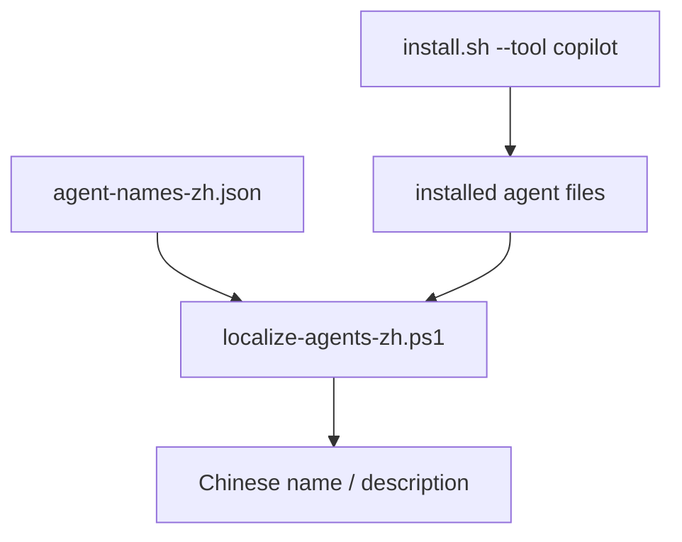

<details>
<summary>相关源文件</summary>

生成本页时使用的主要源文件：

- [scripts/i18n/README.md](../../../project-repos/agency-agents/scripts/i18n/README.md)
- [scripts/i18n/agent-names-zh.json](../../../project-repos/agency-agents/scripts/i18n/agent-names-zh.json)
- [scripts/i18n/localize-agents-zh.ps1](../../../project-repos/agency-agents/scripts/i18n/localize-agents-zh.ps1)
- [scripts/install.sh](../../../project-repos/agency-agents/scripts/install.sh)

</details>

# 中文本地化支持

仓库在 `scripts/i18n` 下提供中文本地化支持，目标是把 agent 的 `name` 和 `description` 字段本地化为简体中文，让中文用户在 Copilot Chat agent picker 中更容易识别 agent。Sources: [scripts/i18n/README.md:1-4](../../../project-repos/agency-agents/scripts/i18n/README.md#L1-L4)

<details class="source-snippets">
<summary>引用源码</summary>

<!-- source-snippets:start -->

#### `scripts/i18n/README.md:1-4`

```markdown
# 🇨🇳 Chinese (zh-CN) Localization

Localize agent `name` and `description` fields in YAML frontmatter to Simplified Chinese. This makes agent names readable in Copilot Chat's agent picker for Chinese-speaking users.

```

<!-- source-snippets:end -->
</details>



Sources: [scripts/i18n/README.md:5-19](../../../project-repos/agency-agents/scripts/i18n/README.md#L5-L19), [scripts/i18n/README.md:31-39](../../../project-repos/agency-agents/scripts/i18n/README.md#L31-L39)

<details class="source-snippets">
<summary>引用源码</summary>

<!-- source-snippets:start -->

#### `scripts/i18n/README.md:5-19`

````markdown
## Files

| File | Description |
|------|-------------|
| `agent-names-zh.json` | Mapping of English agent names → Chinese translations (130+ entries) |
| `localize-agents-zh.ps1` | PowerShell script that reads the JSON and updates installed agent files |

## Usage

After installing agents with `install.sh --tool copilot`:

```powershell
# Localize agent names to Chinese
powershell -ExecutionPolicy Bypass -File scripts/i18n/localize-agents-zh.ps1
```
````

#### `scripts/i18n/README.md:31-39`

```markdown
## How It Works

1. Reads `agent-names-zh.json` (UTF-8 encoded) for the translation map
2. For each `.md` file in the target directories:
   - Extracts the `name:` field from YAML frontmatter
   - Looks up the Chinese translation
   - Replaces `name:` and `description:` fields
   - Writes back as UTF-8

```

<!-- source-snippets:end -->
</details>

## 文件职责

| 文件 | 职责 |
|------|------|
| `agent-names-zh.json` | 英文 agent 名称到中文翻译的映射 |
| `localize-agents-zh.ps1` | 读取 JSON 并更新已安装 agent 文件 |
| `README.md` | 说明使用步骤、目标路径和注意事项 |

Sources: [scripts/i18n/README.md:5-11](../../../project-repos/agency-agents/scripts/i18n/README.md#L5-L11)

<details class="source-snippets">
<summary>引用源码</summary>

<!-- source-snippets:start -->

#### `scripts/i18n/README.md:5-11`

```markdown
## Files

| File | Description |
|------|-------------|
| `agent-names-zh.json` | Mapping of English agent names → Chinese translations (130+ entries) |
| `localize-agents-zh.ps1` | PowerShell script that reads the JSON and updates installed agent files |

```

<!-- source-snippets:end -->
</details>

## 处理范围

默认脚本处理 `%USERPROFILE%\.githubgents\` 和 `%USERPROFILE%\.copilotgents\`，也可传入自定义路径；它只修改已安装副本，不修改源仓库，因此每次 `install.sh` 覆盖后需要重新运行。Sources: [scripts/i18n/README.md:21-29](../../../project-repos/agency-agents/scripts/i18n/README.md#L21-L29), [scripts/i18n/README.md:58-63](../../../project-repos/agency-agents/scripts/i18n/README.md#L58-L63)

<details class="source-snippets">
<summary>引用源码</summary>

<!-- source-snippets:start -->

#### `scripts/i18n/README.md:21-29`

````markdown
By default, the script processes:
- `%USERPROFILE%\.github\agents\`
- `%USERPROFILE%\.copilot\agents\`

Pass custom paths if needed:

```powershell
powershell -File scripts/i18n/localize-agents-zh.ps1 -TargetDirs @("C:\custom\path\agents")
```
````

#### `scripts/i18n/README.md:58-63`

```markdown
## Notes

- Only modifies **installed copies** (in `~/.github/agents/`), not source files
- Re-run after each `install.sh` update (which overwrites with English originals)
- JSON file is the single source of truth for translations — add new agents there
- Script is pure ASCII (avoids PowerShell encoding issues); all Chinese text lives in the JSON
```

<!-- source-snippets:end -->
</details>

## 与 DeepWiki skill 翻译不同

本仓库没有 `SKILL.md` skill 源文件，因此本次 DeepWiki 没有生成 `<output-root>/skills/` 翻译树。这里的 i18n 是仓库自身面向已安装 Copilot agent 的 frontmatter 本地化机制。Sources: [00-repo-inventory.md:58-60](../00-repo-inventory.md#L58-L60), [scripts/i18n/README.md:31-39](../../../project-repos/agency-agents/scripts/i18n/README.md#L31-L39)

<details class="source-snippets">
<summary>引用源码</summary>

<!-- source-snippets:start -->

#### `00-repo-inventory.md:58-60`

```markdown
## Skills

- None detected
```

#### `scripts/i18n/README.md:31-39`

```markdown
## How It Works

1. Reads `agent-names-zh.json` (UTF-8 encoded) for the translation map
2. For each `.md` file in the target directories:
   - Extracts the `name:` field from YAML frontmatter
   - Looks up the Chinese translation
   - Replaces `name:` and `description:` fields
   - Writes back as UTF-8

```

<!-- source-snippets:end -->
</details>

## 相关页面

- [安装与工具集成](installation-and-tooling.md)
- [Agent 目录与专业分工](agent-catalog.md)
- [质量门禁与安全边界](quality-security.md)
