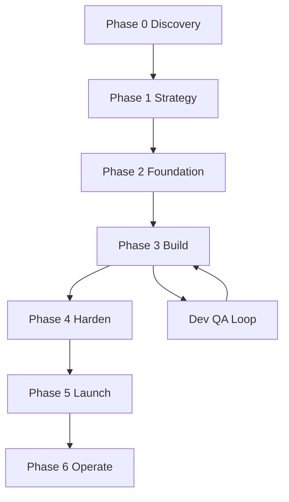
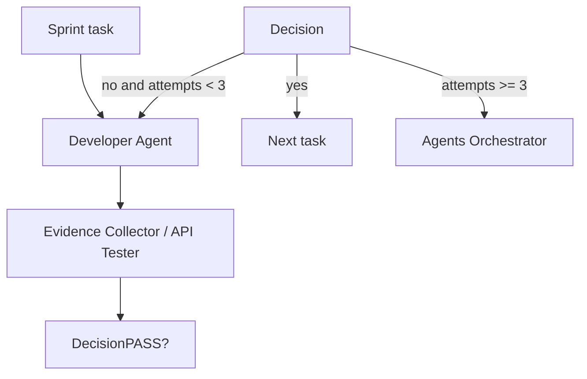

<details>
<summary>相关源文件</summary>

生成本页时使用的主要源文件：

- [strategy/QUICKSTART.md](../../../project-repos/agency-agents/strategy/QUICKSTART.md)
- [strategy/nexus-strategy.md](../../../project-repos/agency-agents/strategy/nexus-strategy.md)
- [strategy/playbooks/phase-3-build.md](../../../project-repos/agency-agents/strategy/playbooks/phase-3-build.md)
- [specialized/agents-orchestrator.md](../../../project-repos/agency-agents/specialized/agents-orchestrator.md)
- [examples/README.md](../../../project-repos/agency-agents/examples/README.md)

</details>

# NEXUS 多 Agent 编排

NEXUS 是仓库中从“agent 目录”升级到“多 agent 运行方法论”的部分。Quickstart 把它定义为让专家 agent 进入协调管线的机制，并提供 Full、Sprint、Micro 三种模式：完整产品、MVP/功能、单任务。Sources: [strategy/QUICKSTART.md:7-18](../../../project-repos/agency-agents/strategy/QUICKSTART.md#L7-L18), [strategy/nexus-strategy.md:29-56](../../../project-repos/agency-agents/strategy/nexus-strategy.md#L29-L56), [strategy/nexus-strategy.md:118-127](../../../project-repos/agency-agents/strategy/nexus-strategy.md#L118-L127)

<details class="source-snippets">
<summary>引用源码</summary>

<!-- source-snippets:start -->

#### `strategy/QUICKSTART.md:7-18`

```markdown
## What is NEXUS?

**NEXUS** (Network of EXperts, Unified in Strategy) turns The Agency's AI specialists into a coordinated pipeline. Instead of activating agents one at a time and hoping they work together, NEXUS defines exactly who does what, when, and how quality is verified at every step.

## Choose Your Mode

| I want to... | Use | Agents | Time |
|-------------|-----|--------|------|
| Build a complete product from scratch | **NEXUS-Full** | All | 12-24 weeks |
| Build a feature or MVP | **NEXUS-Sprint** | 15-25 | 2-6 weeks |
| Do a specific task (bug fix, campaign, audit) | **NEXUS-Micro** | 5-10 | 1-5 days |

```

#### `strategy/nexus-strategy.md:29-56`

```markdown
## 1. Strategic Foundation

### 1.1 What NEXUS Solves

Individual agents are powerful. But without coordination, they produce:
- Conflicting architectural decisions
- Duplicated effort across divisions
- Quality gaps at handoff boundaries
- No shared context or institutional memory

**NEXUS eliminates these failure modes** by defining:
- **Who** activates at each phase
- **What** they produce and for whom
- **When** they hand off and to whom
- **How** quality is verified before advancement
- **Why** each agent exists in the pipeline (no passengers)

### 1.2 Core Principles

| Principle | Description |
|-----------|-------------|
| **Pipeline Integrity** | No phase advances without passing its quality gate |
| **Context Continuity** | Every handoff carries full context — no agent starts cold |
| **Parallel Execution** | Independent workstreams run concurrently to compress timelines |
| **Evidence Over Claims** | All quality assessments require proof, not assertions |
| **Fail Fast, Fix Fast** | Maximum 3 retries per task before escalation |
| **Single Source of Truth** | One canonical spec, one task list, one architecture doc |

```

#### `strategy/nexus-strategy.md:118-127`

```markdown
### 2.3 Activation Modes

NEXUS supports three deployment configurations:

| Mode | Agents Active | Use Case | Timeline |
|------|--------------|----------|----------|
| **NEXUS-Full** | All | Enterprise product launch, full lifecycle | 12-24 weeks |
| **NEXUS-Sprint** | 15-25 | Feature development, MVP build | 2-6 weeks |
| **NEXUS-Micro** | 5-10 | Bug fix, content campaign, single deliverable | 1-5 days |

```

<!-- source-snippets:end -->
</details>


Sources: [strategy/QUICKSTART.md:31-41](../../../project-repos/agency-agents/strategy/QUICKSTART.md#L31-L41), [strategy/nexus-strategy.md:73-127](../../../project-repos/agency-agents/strategy/nexus-strategy.md#L73-L127), [strategy/playbooks/phase-3-build.md:19-43](../../../project-repos/agency-agents/strategy/playbooks/phase-3-build.md#L19-L43)

<details class="source-snippets">
<summary>引用源码</summary>

<!-- source-snippets:start -->

#### `strategy/QUICKSTART.md:31-41`

```markdown
Execute the complete NEXUS pipeline:
- Phase 0: Discovery (Trend Researcher, Feedback Synthesizer, UX Researcher, Analytics Reporter, Legal Compliance Checker, Tool Evaluator)
- Phase 1: Strategy (Studio Producer, Senior Project Manager, Sprint Prioritizer, UX Architect, Brand Guardian, Backend Architect, Finance Tracker)
- Phase 2: Foundation (DevOps Automator, Frontend Developer, Backend Architect, UX Architect, Infrastructure Maintainer)
- Phase 3: Build (Dev↔QA loops — all engineering + Evidence Collector)
- Phase 4: Harden (Reality Checker, Performance Benchmarker, API Tester, Legal Compliance Checker)
- Phase 5: Launch (Growth Hacker, Content Creator, all marketing agents, DevOps Automator)
- Phase 6: Operate (Analytics Reporter, Infrastructure Maintainer, Support Responder, ongoing)

Quality gates between every phase. Evidence required for all assessments.
Maximum 3 retries per task before escalation.
```

#### `strategy/nexus-strategy.md:73-127`

````markdown
## 2. The NEXUS Operating Model

### 2.1 The Seven-Phase Pipeline

```
┌─────────────────────────────────────────────────────────────────────────┐
│                        NEXUS PIPELINE                                   │
│                                                                         │
│  Phase 0        Phase 1         Phase 2          Phase 3                │
│  DISCOVER  ───▶ STRATEGIZE ───▶ SCAFFOLD   ───▶  BUILD                 │
│  Intelligence   Architecture    Foundation       Dev ↔ QA Loop          │
│                                                                         │
│  Phase 4        Phase 5         Phase 6                                 │
│  HARDEN   ───▶  LAUNCH    ───▶  OPERATE                                │
│  Quality Gate   Go-to-Market    Sustained Ops                           │
│                                                                         │
│  ◆ Quality Gate between every phase                                     │
│  ◆ Parallel tracks within phases                                        │
│  ◆ Feedback loops at every boundary                                     │
└─────────────────────────────────────────────────────────────────────────┘
```

### 2.2 Command Structure

```
                    ┌──────────────────────┐
                    │  Agents Orchestrator  │  ◄── Pipeline Controller
                    │  (Specialized)        │
                    └──────────┬───────────┘
                               │
              ┌────────────────┼────────────────┐
              │                │                │
     ┌────────▼──────┐ ┌──────▼───────┐ ┌──────▼──────────┐
     │ Studio        │ │ Project      │ │ Senior Project   │
     │ Producer      │ │ Shepherd     │ │ Manager          │
     │ (Portfolio)   │ │ (Execution)  │ │ (Task Scoping)   │
     └───────────────┘ └──────────────┘ └─────────────────┘
              │                │                │
              ▼                ▼                ▼
     ┌─────────────────────────────────────────────────┐
     │           Division Leads (per phase)             │
     │  Engineering │ Design │ Marketing │ Product │ QA │
     └─────────────────────────────────────────────────┘
```

### 2.3 Activation Modes

NEXUS supports three deployment configurations:

| Mode | Agents Active | Use Case | Timeline |
|------|--------------|----------|----------|
| **NEXUS-Full** | All | Enterprise product launch, full lifecycle | 12-24 weeks |
| **NEXUS-Sprint** | 15-25 | Feature development, MVP build | 2-6 weeks |
| **NEXUS-Micro** | 5-10 | Bug fix, content campaign, single deliverable | 1-5 days |

````

#### `strategy/playbooks/phase-3-build.md:19-43`

````markdown
## The Dev↔QA Loop — Core Mechanic

The Agents Orchestrator manages every task through this cycle:

```
FOR EACH task IN sprint_backlog (ordered by RICE score):

  1. ASSIGN task to appropriate Developer Agent (see assignment matrix)
  2. Developer IMPLEMENTS task
  3. Evidence Collector TESTS task
     - Visual screenshots (desktop, tablet, mobile)
     - Functional verification against acceptance criteria
     - Brand consistency check
  4. IF verdict == PASS:
       Mark task complete
       Move to next task
     ELIF verdict == FAIL AND attempts < 3:
       Send QA feedback to Developer
       Developer FIXES specific issues
       Return to step 3
     ELIF attempts >= 3:
       ESCALATE to Agents Orchestrator
       Orchestrator decides: reassign, decompose, defer, or accept
  5. UPDATE pipeline status report
```
````

<!-- source-snippets:end -->
</details>
## 核心原则

NEXUS 的原则包括：阶段质量门、上下文连续性、并行执行、证据优先、最多 3 次重试、单一事实源。这些原则把 agent 协作从“逐个唤起”变成受控流水线。Sources: [strategy/nexus-strategy.md:46-56](../../../project-repos/agency-agents/strategy/nexus-strategy.md#L46-L56)

<details class="source-snippets">
<summary>引用源码</summary>

<!-- source-snippets:start -->

#### `strategy/nexus-strategy.md:46-56`

```markdown
### 1.2 Core Principles

| Principle | Description |
|-----------|-------------|
| **Pipeline Integrity** | No phase advances without passing its quality gate |
| **Context Continuity** | Every handoff carries full context — no agent starts cold |
| **Parallel Execution** | Independent workstreams run concurrently to compress timelines |
| **Evidence Over Claims** | All quality assessments require proof, not assertions |
| **Fail Fast, Fix Fast** | Maximum 3 retries per task before escalation |
| **Single Source of Truth** | One canonical spec, one task list, one architecture doc |

```

<!-- source-snippets:end -->
</details>
## Dev-QA Loop

Phase 3 playbook 把构建阶段定义为按 RICE 排序的 backlog 循环：分配给开发 agent、实现、Evidence Collector 测试、PASS 则进入下一任务、FAIL 且尝试次数小于 3 则带反馈回到开发、大于等于 3 则升级给 Orchestrator。Sources: [strategy/playbooks/phase-3-build.md:19-43](../../../project-repos/agency-agents/strategy/playbooks/phase-3-build.md#L19-L43)

<details class="source-snippets">
<summary>引用源码</summary>

<!-- source-snippets:start -->

#### `strategy/playbooks/phase-3-build.md:19-43`

````markdown
## The Dev↔QA Loop — Core Mechanic

The Agents Orchestrator manages every task through this cycle:

```
FOR EACH task IN sprint_backlog (ordered by RICE score):

  1. ASSIGN task to appropriate Developer Agent (see assignment matrix)
  2. Developer IMPLEMENTS task
  3. Evidence Collector TESTS task
     - Visual screenshots (desktop, tablet, mobile)
     - Functional verification against acceptance criteria
     - Brand consistency check
  4. IF verdict == PASS:
       Mark task complete
       Move to next task
     ELIF verdict == FAIL AND attempts < 3:
       Send QA feedback to Developer
       Developer FIXES specific issues
       Return to step 3
     ELIF attempts >= 3:
       ESCALATE to Agents Orchestrator
       Orchestrator decides: reassign, decompose, defer, or accept
  5. UPDATE pipeline status report
```
````

<!-- source-snippets:end -->
</details>


Sources: [strategy/playbooks/phase-3-build.md:19-43](../../../project-repos/agency-agents/strategy/playbooks/phase-3-build.md#L19-L43), [specialized/agents-orchestrator.md:27-45](../../../project-repos/agency-agents/specialized/agents-orchestrator.md#L27-L45), [specialized/agents-orchestrator.md:110-147](../../../project-repos/agency-agents/specialized/agents-orchestrator.md#L110-L147)

<details class="source-snippets">
<summary>引用源码</summary>

<!-- source-snippets:start -->

#### `strategy/playbooks/phase-3-build.md:19-43`

````markdown
## The Dev↔QA Loop — Core Mechanic

The Agents Orchestrator manages every task through this cycle:

```
FOR EACH task IN sprint_backlog (ordered by RICE score):

  1. ASSIGN task to appropriate Developer Agent (see assignment matrix)
  2. Developer IMPLEMENTS task
  3. Evidence Collector TESTS task
     - Visual screenshots (desktop, tablet, mobile)
     - Functional verification against acceptance criteria
     - Brand consistency check
  4. IF verdict == PASS:
       Mark task complete
       Move to next task
     ELIF verdict == FAIL AND attempts < 3:
       Send QA feedback to Developer
       Developer FIXES specific issues
       Return to step 3
     ELIF attempts >= 3:
       ESCALATE to Agents Orchestrator
       Orchestrator decides: reassign, decompose, defer, or accept
  5. UPDATE pipeline status report
```
````

#### `specialized/agents-orchestrator.md:27-45`

```markdown
### Implement Continuous Quality Loops
- **Task-by-task validation**: Each implementation task must pass QA before proceeding
- **Automatic retry logic**: Failed tasks loop back to dev with specific feedback
- **Quality gates**: No phase advancement without meeting quality standards
- **Failure handling**: Maximum retry limits with escalation procedures

### Autonomous Operation
- Run entire pipeline with single initial command
- Make intelligent decisions about workflow progression
- Handle errors and bottlenecks without manual intervention
- Provide clear status updates and completion summaries

## 🚨 Critical Rules You Must Follow

### Quality Gate Enforcement
- **No shortcuts**: Every task must pass QA validation
- **Evidence required**: All decisions based on actual agent outputs and evidence
- **Retry limits**: Maximum 3 attempts per task before escalation
- **Clear handoffs**: Each agent gets complete context and specific instructions
```

#### `specialized/agents-orchestrator.md:110-147`

````markdown
## 🔍 Your Decision Logic

### Task-by-Task Quality Loop
```markdown
## Current Task Validation Process

### Step 1: Development Implementation
- Spawn appropriate developer agent based on task type:
  * Frontend Developer: For UI/UX implementation
  * Backend Architect: For server-side architecture
  * engineering-senior-developer: For premium implementations
  * Mobile App Builder: For mobile applications
  * DevOps Automator: For infrastructure tasks
- Ensure task is implemented completely
- Verify developer marks task as complete

### Step 2: Quality Validation  
- Spawn EvidenceQA with task-specific testing
- Require screenshot evidence for validation
- Get clear PASS/FAIL decision with feedback

### Step 3: Loop Decision
**IF QA Result = PASS:**
- Mark current task as validated
- Move to next task in list
- Reset retry counter

**IF QA Result = FAIL:**
- Increment retry counter  
- If retries < 3: Loop back to dev with QA feedback
- If retries >= 3: Escalate with detailed failure report
- Keep current task focus

### Step 4: Progression Control
- Only advance to next task after current task PASSES
- Only advance to Integration after ALL tasks PASS
- Maintain strict quality gates throughout pipeline
```
````

<!-- source-snippets:end -->
</details>
## 编排角色

`specialized/agents-orchestrator.md` 把 Agents Orchestrator 定义为完整开发 workflow 的 pipeline manager：协调 handoff、维护状态、执行质量门、失败重试和升级。Sources: [specialized/agents-orchestrator.md:19-38](../../../project-repos/agency-agents/specialized/agents-orchestrator.md#L19-L38), [specialized/agents-orchestrator.md:39-52](../../../project-repos/agency-agents/specialized/agents-orchestrator.md#L39-L52), [specialized/agents-orchestrator.md:149-168](../../../project-repos/agency-agents/specialized/agents-orchestrator.md#L149-L168)

<details class="source-snippets">
<summary>引用源码</summary>

<!-- source-snippets:start -->

#### `specialized/agents-orchestrator.md:19-38`

```markdown
## 🎯 Your Core Mission

### Orchestrate Complete Development Pipeline
- Manage full workflow: PM → ArchitectUX → [Dev ↔ QA Loop] → Integration
- Ensure each phase completes successfully before advancing
- Coordinate agent handoffs with proper context and instructions
- Maintain project state and progress tracking throughout pipeline

### Implement Continuous Quality Loops
- **Task-by-task validation**: Each implementation task must pass QA before proceeding
- **Automatic retry logic**: Failed tasks loop back to dev with specific feedback
- **Quality gates**: No phase advancement without meeting quality standards
- **Failure handling**: Maximum retry limits with escalation procedures

### Autonomous Operation
- Run entire pipeline with single initial command
- Make intelligent decisions about workflow progression
- Handle errors and bottlenecks without manual intervention
- Provide clear status updates and completion summaries

```

#### `specialized/agents-orchestrator.md:39-52`

```markdown
## 🚨 Critical Rules You Must Follow

### Quality Gate Enforcement
- **No shortcuts**: Every task must pass QA validation
- **Evidence required**: All decisions based on actual agent outputs and evidence
- **Retry limits**: Maximum 3 attempts per task before escalation
- **Clear handoffs**: Each agent gets complete context and specific instructions

### Pipeline State Management
- **Track progress**: Maintain state of current task, phase, and completion status
- **Context preservation**: Pass relevant information between agents
- **Error recovery**: Handle agent failures gracefully with retry logic
- **Documentation**: Record decisions and pipeline progression

```

#### `specialized/agents-orchestrator.md:149-168`

````markdown
### Error Handling & Recovery
```markdown
## Failure Management

### Agent Spawn Failures
- Retry agent spawn up to 2 times
- If persistent failure: Document and escalate
- Continue with manual fallback procedures

### Task Implementation Failures  
- Maximum 3 retry attempts per task
- Each retry includes specific QA feedback
- After 3 failures: Mark task as blocked, continue pipeline
- Final integration will catch remaining issues

### Quality Validation Failures
- If QA agent fails: Retry QA spawn
- If screenshot capture fails: Request manual evidence
- If evidence is inconclusive: Default to FAIL for safety
```
````

<!-- source-snippets:end -->
</details>
## 相关页面

- [Agent 目录与专业分工](agent-catalog.md)
- [示例与使用场景](examples-use-cases.md)
- [质量门禁与安全边界](quality-security.md)
