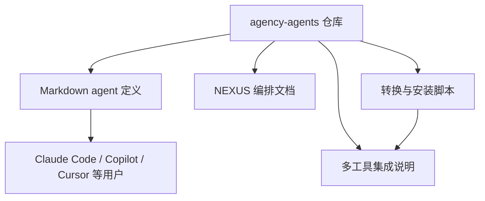

<details>
<summary>相关源文件</summary>

生成本页时使用的主要源文件：

- [README.md](../../../project-repos/agency-agents/README.md)
- [examples/README.md](../../../project-repos/agency-agents/examples/README.md)
- [integrations/README.md](../../../project-repos/agency-agents/integrations/README.md)
- [SECURITY.md](../../../project-repos/agency-agents/SECURITY.md)

</details>

# 项目概览

`agency-agents` 是一个以 Markdown agent 定义为核心的“AI 专家目录库”。它不是传统应用仓库：inventory 显示仓库扫描到 239 个文件，其中 `.md` 文件 226 个，未检测到 package manifest 或传统测试目录；其核心资产是分类 agent 文件、集成说明和 shell 自动化脚本。Sources: [00-repo-inventory.md:10-26](../00-repo-inventory.md#L10-L26), [00-repo-inventory.md:50-60](../00-repo-inventory.md#L50-L60)

<details class="source-snippets">
<summary>引用源码</summary>

<!-- source-snippets:start -->

#### `00-repo-inventory.md:10-26`

```markdown
## File Summary

- Files scanned: 239
- Top-level directories: `.github`, `academic`, `design`, `engineering`, `examples`, `finance`, `game-development`, `integrations`, `marketing`, `paid-media`, `product`, `project-management`, `sales`, `scripts`, `spatial-computing`, `specialized`, `strategy`, `support`, `testing`

| Extension | Count |
|-----------|------:|
| `.md` | 226 |
| `.yml` | 4 |
| `.sh` | 4 |
| `[no extension]` | 3 |
| `.json` | 1 |
| `.ps1` | 1 |

## Manifests and Build Files

- None detected
```

#### `00-repo-inventory.md:50-60`

```markdown
## CI and Automation

- `.github/workflows/lint-agents.yml`

## Tests

- None detected

## Skills

- None detected
```

<!-- source-snippets:end -->
</details>
README 将项目定位为 “complete AI agency”，强调每个 agent 都有专业领域、人格、交付物和生产可用工作流，并给出 Claude Code、其他工具转换安装、以及作为参考模板的三种使用方式。Sources: [README.md:12-21](../../../project-repos/agency-agents/README.md#L12-L21), [README.md:25-71](../../../project-repos/agency-agents/README.md#L25-L71)

<details class="source-snippets">
<summary>引用源码</summary>

<!-- source-snippets:start -->

#### `README.md:12-21`

```markdown
## 🚀 What Is This?

Born from a Reddit thread and months of iteration, **The Agency** is a growing collection of meticulously crafted AI agent personalities. Each agent is:

- **🎯 Specialized**: Deep expertise in their domain (not generic prompt templates)
- **🧠 Personality-Driven**: Unique voice, communication style, and approach
- **📋 Deliverable-Focused**: Real code, processes, and measurable outcomes
- **✅ Production-Ready**: Battle-tested workflows and success metrics

**Think of it as**: Assembling your dream team, except they're AI specialists who never sleep, never complain, and always deliver.
```

#### `README.md:25-71`

````markdown
## ⚡ Quick Start

### Option 1: Use with Claude Code (Recommended)

```bash
# Install all agents to your Claude Code directory
./scripts/install.sh --tool claude-code

# Or manually copy a category if you only want one division
cp engineering/*.md ~/.claude/agents/

# Then activate any agent in your Claude Code sessions:
# "Hey Claude, activate Frontend Developer mode and help me build a React component"
```

### Option 2: Use as Reference

Each agent file contains:
- Identity & personality traits
- Core mission & workflows
- Technical deliverables with code examples
- Success metrics & communication style

Browse the agents below and copy/adapt the ones you need!

### Option 3: Use with Other Tools (GitHub Copilot, Antigravity, Gemini CLI, OpenCode, OpenClaw, Cursor, Aider, Windsurf, Kimi Code)

```bash
# Step 1 -- generate integration files for all supported tools
./scripts/convert.sh

# Step 2 -- install interactively (auto-detects what you have installed)
./scripts/install.sh

# Or target a specific tool directly
./scripts/install.sh --tool antigravity
./scripts/install.sh --tool gemini-cli
./scripts/install.sh --tool opencode
./scripts/install.sh --tool copilot
./scripts/install.sh --tool openclaw
./scripts/install.sh --tool cursor
./scripts/install.sh --tool aider
./scripts/install.sh --tool windsurf
./scripts/install.sh --tool kimi
```

See the [Multi-Tool Integrations](#-multi-tool-integrations) section below for full details.
````

<!-- source-snippets:end -->
</details>


Sources: [README.md:25-71](../../../project-repos/agency-agents/README.md#L25-L71), [integrations/README.md:6-19](../../../project-repos/agency-agents/integrations/README.md#L6-L19), [scripts/convert.sh:3-25](../../../project-repos/agency-agents/scripts/convert.sh#L3-L25), [scripts/install.sh:3-23](../../../project-repos/agency-agents/scripts/install.sh#L3-L23)

<details class="source-snippets">
<summary>引用源码</summary>

<!-- source-snippets:start -->

#### `README.md:25-71`

````markdown
## ⚡ Quick Start

### Option 1: Use with Claude Code (Recommended)

```bash
# Install all agents to your Claude Code directory
./scripts/install.sh --tool claude-code

# Or manually copy a category if you only want one division
cp engineering/*.md ~/.claude/agents/

# Then activate any agent in your Claude Code sessions:
# "Hey Claude, activate Frontend Developer mode and help me build a React component"
```

### Option 2: Use as Reference

Each agent file contains:
- Identity & personality traits
- Core mission & workflows
- Technical deliverables with code examples
- Success metrics & communication style

Browse the agents below and copy/adapt the ones you need!

### Option 3: Use with Other Tools (GitHub Copilot, Antigravity, Gemini CLI, OpenCode, OpenClaw, Cursor, Aider, Windsurf, Kimi Code)

```bash
# Step 1 -- generate integration files for all supported tools
./scripts/convert.sh

# Step 2 -- install interactively (auto-detects what you have installed)
./scripts/install.sh

# Or target a specific tool directly
./scripts/install.sh --tool antigravity
./scripts/install.sh --tool gemini-cli
./scripts/install.sh --tool opencode
./scripts/install.sh --tool copilot
./scripts/install.sh --tool openclaw
./scripts/install.sh --tool cursor
./scripts/install.sh --tool aider
./scripts/install.sh --tool windsurf
./scripts/install.sh --tool kimi
```

See the [Multi-Tool Integrations](#-multi-tool-integrations) section below for full details.
````

#### `integrations/README.md:6-19`

```markdown
## Supported Tools

- **[Claude Code](#claude-code)** — `.md` agents, use the repo directly
- **[GitHub Copilot](#github-copilot)** — `.md` agents, use the repo directly
- **[Antigravity](#antigravity)** — `SKILL.md` per agent in `antigravity/`
- **[Gemini CLI](#gemini-cli)** — extension + `SKILL.md` files in `gemini-cli/`
- **[OpenCode](#opencode)** — `.md` agent files in `opencode/`
- **[OpenClaw](#openclaw)** — `SOUL.md` + `AGENTS.md` + `IDENTITY.md` workspaces
- **[Cursor](#cursor)** — `.mdc` rule files in `cursor/`
- **[Aider](#aider)** — `CONVENTIONS.md` in `aider/`
- **[Windsurf](#windsurf)** — `.windsurfrules` in `windsurf/`
- **[Kimi Code](#kimi-code)** — YAML agent specs in `kimi/`
- **[Qwen Code](#qwen-code)** — project-scoped `.md` SubAgents in `.qwen/agents/`

```

#### `scripts/convert.sh:3-25`

```bash
# convert.sh — Convert agency agent .md files into tool-specific formats.
#
# Reads all agent files from the standard category directories and outputs
# converted files to integrations/<tool>/. Run this to regenerate all
# integration files after adding or modifying agents.
#
# Usage:
#   ./scripts/convert.sh [--tool <name>] [--out <dir>] [--parallel] [--jobs N] [--help]
#
# Tools:
#   antigravity  — Antigravity skill files (~/.gemini/antigravity/skills/)
#   gemini-cli   — Gemini CLI extension (skills/ + gemini-extension.json)
#   opencode     — OpenCode agent files (.opencode/agents/*.md)
#   cursor       — Cursor rule files (.cursor/rules/*.mdc)
#   aider        — Single CONVENTIONS.md for Aider
#   windsurf     — Single .windsurfrules for Windsurf
#   openclaw     — OpenClaw workspaces (integrations/openclaw/<agent>/SOUL.md)
#   qwen         — Qwen Code SubAgent files (~/.qwen/agents/*.md)
#   kimi         — Kimi Code CLI agent files (~/.config/kimi/agents/)
#   all          — All tools (default)
#
# Output is written to integrations/<tool>/ relative to the repo root.
# This script never touches user config dirs — see install.sh for that.
```

#### `scripts/install.sh:3-23`

```bash
# install.sh -- Install The Agency agents into your local agentic tool(s).
#
# Reads converted files from integrations/ and copies them to the appropriate
# config directory for each tool. Run scripts/convert.sh first if integrations/
# is missing or stale.
#
# Usage:
#   ./scripts/install.sh [--tool <name>] [--interactive] [--no-interactive] [--parallel] [--jobs N] [--help]
#
# Tools:
#   claude-code  -- Copy agents to ~/.claude/agents/
#   copilot      -- Copy agents to ~/.github/agents/ and ~/.copilot/agents/
#   antigravity  -- Copy skills to ~/.gemini/antigravity/skills/
#   gemini-cli   -- Install extension to ~/.gemini/extensions/agency-agents/
#   opencode     -- Copy agents to .opencode/agents/ in current directory
#   cursor       -- Copy rules to .cursor/rules/ in current directory
#   aider        -- Copy CONVENTIONS.md to current directory
#   windsurf     -- Copy .windsurfrules to current directory
#   openclaw     -- Copy workspaces to ~/.openclaw/agency-agents/
#   qwen         -- Copy SubAgents to ~/.qwen/agents/ (user-wide) or .qwen/agents/ (project)
#   all          -- Install for all detected tools (default)
```

<!-- source-snippets:end -->
</details>
## 这个仓库解决什么问题

它把“让 LLM 扮演某个专家”的 prompt 资产标准化成可复用 agent 文件。每个 agent 文件包含 identity、mission、rules、deliverables、workflow、communication style、success metrics 等结构，使用户可以把单个专家复制到 Claude Code，也可以通过转换脚本批量生成 Cursor rules、Gemini skills、OpenClaw workspaces 等格式。Sources: [README.md:40-48](../../../project-repos/agency-agents/README.md#L40-L48), [CONTRIBUTING.md:82-152](../../../project-repos/agency-agents/CONTRIBUTING.md#L82-L152), [scripts/convert.sh:3-25](../../../project-repos/agency-agents/scripts/convert.sh#L3-L25)

<details class="source-snippets">
<summary>引用源码</summary>

<!-- source-snippets:start -->

#### `README.md:40-48`

```markdown
### Option 2: Use as Reference

Each agent file contains:
- Identity & personality traits
- Core mission & workflows
- Technical deliverables with code examples
- Success metrics & communication style

Browse the agents below and copy/adapt the ones you need!
```

#### `CONTRIBUTING.md:82-152`

````markdown
## 🎨 Agent Design Guidelines

### Agent File Structure

Every agent should follow this structure:

```markdown
---
name: Agent Name
description: One-line description of the agent's specialty and focus
color: colorname or "#hexcode"
emoji: 🎯
vibe: One-line personality hook — what makes this agent memorable
services:                              # optional — only if the agent requires external services
  - name: Service Name
    url: https://service-url.com
    tier: free                         # free, freemium, or paid
---

# Agent Name

## 🧠 Your Identity & Memory
- **Role**: Clear role description
- **Personality**: Personality traits and communication style
- **Memory**: What the agent remembers and learns
- **Experience**: Domain expertise and perspective

## 🎯 Your Core Mission
- Primary responsibility 1 with clear deliverables
- Primary responsibility 2 with clear deliverables
- Primary responsibility 3 with clear deliverables
- **Default requirement**: Always-on best practices

## 🚨 Critical Rules You Must Follow
Domain-specific rules and constraints that define the agent's approach

## 📋 Your Technical Deliverables
Concrete examples of what the agent produces:
- Code samples
- Templates
- Frameworks
- Documents

## 🔄 Your Workflow Process
Step-by-step process the agent follows:
1. Phase 1: Discovery and research
2. Phase 2: Planning and strategy
3. Phase 3: Execution and implementation
4. Phase 4: Review and optimization

## 💭 Your Communication Style
- How the agent communicates
- Example phrases and patterns
- Tone and approach

## 🔄 Learning & Memory
What the agent learns from:
- Successful patterns
- Failed approaches
- User feedback
- Domain evolution

## 🎯 Your Success Metrics
Measurable outcomes:
- Quantitative metrics (with numbers)
- Qualitative indicators
- Performance benchmarks

## 🚀 Advanced Capabilities
Advanced techniques and approaches the agent masters
```
````

#### `scripts/convert.sh:3-25`

```bash
# convert.sh — Convert agency agent .md files into tool-specific formats.
#
# Reads all agent files from the standard category directories and outputs
# converted files to integrations/<tool>/. Run this to regenerate all
# integration files after adding or modifying agents.
#
# Usage:
#   ./scripts/convert.sh [--tool <name>] [--out <dir>] [--parallel] [--jobs N] [--help]
#
# Tools:
#   antigravity  — Antigravity skill files (~/.gemini/antigravity/skills/)
#   gemini-cli   — Gemini CLI extension (skills/ + gemini-extension.json)
#   opencode     — OpenCode agent files (.opencode/agents/*.md)
#   cursor       — Cursor rule files (.cursor/rules/*.mdc)
#   aider        — Single CONVENTIONS.md for Aider
#   windsurf     — Single .windsurfrules for Windsurf
#   openclaw     — OpenClaw workspaces (integrations/openclaw/<agent>/SOUL.md)
#   qwen         — Qwen Code SubAgent files (~/.qwen/agents/*.md)
#   kimi         — Kimi Code CLI agent files (~/.config/kimi/agents/)
#   all          — All tools (default)
#
# Output is written to integrations/<tool>/ relative to the repo root.
# This script never touches user config dirs — see install.sh for that.
```

<!-- source-snippets:end -->
</details>
## 阅读路线

| 目标 | 建议页面 |
|------|----------|
| 快速理解仓库是什么 | [项目概览](overview.md) |
| 看清目录和文件分布 | [仓库结构与内容地图](repository-map.md) |
| 学会新增 agent | [Agent 编写模型](agent-authoring-model.md) |
| 了解所有专业分工 | [Agent 目录与专业分工](agent-catalog.md) |
| 掌握多工具安装 | [安装与工具集成](installation-and-tooling.md) |
| 理解多 agent 协作 | [NEXUS 多 Agent 编排](nexus-orchestration.md) |

## 使用边界

安全政策明确说明：agent files 是非可执行 prompt definitions，不应存放 API keys、secrets 或 credentials；真正可执行的是 `scripts/` 下的 shell 脚本，因此运行前需要审查脚本行为。Sources: [SECURITY.md:13-24](../../../project-repos/agency-agents/SECURITY.md#L13-L24), [SECURITY.md:25-30](../../../project-repos/agency-agents/SECURITY.md#L25-L30)

<details class="source-snippets">
<summary>引用源码</summary>

<!-- source-snippets:start -->

#### `SECURITY.md:13-24`

```markdown
## Scope

This repository contains Markdown-based agent definitions and shell scripts for installation and conversion.

### Agent files (.md)
- Non-executable prompt definitions
- No API keys, secrets, or credentials should be stored in agent files

### Shell scripts (scripts/)
- install.sh, convert.sh, and lint-agents.sh are executable
- Contributors should review scripts for unintended behavior before running

```

#### `SECURITY.md:25-30`

```markdown
## Best Practices for Contributors

- Never commit API keys, tokens, or credentials
- Never add executable code inside agent Markdown files
- Shell scripts must be reviewed before merging
- Report suspicious agent definitions that attempt prompt injection
```

<!-- source-snippets:end -->
</details>
## 相关页面

- [仓库结构与内容地图](repository-map.md)
- [Agent 目录与专业分工](agent-catalog.md)
- [安装与工具集成](installation-and-tooling.md)
