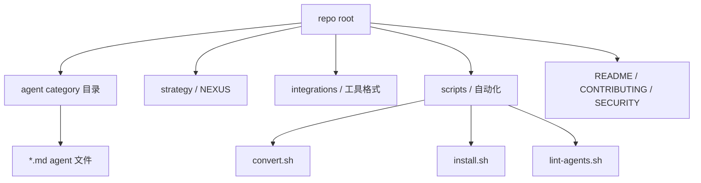

<details>
<summary>相关源文件</summary>

生成本页时使用的主要源文件：

- [README.md](../../../project-repos/agency-agents/README.md)
- [integrations/README.md](../../../project-repos/agency-agents/integrations/README.md)
- [scripts/install.sh](../../../project-repos/agency-agents/scripts/install.sh)
- [scripts/convert.sh](../../../project-repos/agency-agents/scripts/convert.sh)
- [scripts/lint-agents.sh](../../../project-repos/agency-agents/scripts/lint-agents.sh)

</details>

# 仓库结构与内容地图

仓库顶层目录按职能和分发能力组织：`engineering`、`design`、`marketing`、`testing` 等是 agent category；`strategy` 是 NEXUS 编排体系；`integrations` 放多工具说明和生成产物；`scripts` 放转换、安装、lint 和 i18n 自动化。Sources: [00-repo-inventory.md:10-22](../00-repo-inventory.md#L10-L22), [scripts/install.sh:106-110](../../../project-repos/agency-agents/scripts/install.sh#L106-L110), [scripts/convert.sh:64-67](../../../project-repos/agency-agents/scripts/convert.sh#L64-L67)

<details class="source-snippets">
<summary>引用源码</summary>

<!-- source-snippets:start -->

#### `00-repo-inventory.md:10-22`

```markdown
## File Summary

- Files scanned: 239
- Top-level directories: `.github`, `academic`, `design`, `engineering`, `examples`, `finance`, `game-development`, `integrations`, `marketing`, `paid-media`, `product`, `project-management`, `sales`, `scripts`, `spatial-computing`, `specialized`, `strategy`, `support`, `testing`

| Extension | Count |
|-----------|------:|
| `.md` | 226 |
| `.yml` | 4 |
| `.sh` | 4 |
| `[no extension]` | 3 |
| `.json` | 1 |
| `.ps1` | 1 |
```

#### `scripts/install.sh:106-110`

```bash
# Standard agent category directories (keep sorted, sync with convert.sh / lint-agents.sh)
AGENT_DIRS=(
  academic design engineering finance game-development marketing paid-media product project-management
  sales spatial-computing specialized strategy support testing
)
```

#### `scripts/convert.sh:64-67`

```bash
AGENT_DIRS=(
  academic design engineering finance game-development marketing paid-media product project-management
  sales spatial-computing specialized strategy support testing
)
```

<!-- source-snippets:end -->
</details>



Sources: [00-repo-inventory.md:12-18](../00-repo-inventory.md#L12-L18), [integrations/README.md:1-19](../../../project-repos/agency-agents/integrations/README.md#L1-L19), [scripts/install.sh:97-110](../../../project-repos/agency-agents/scripts/install.sh#L97-L110), [scripts/convert.sh:58-67](../../../project-repos/agency-agents/scripts/convert.sh#L58-L67)

<details class="source-snippets">
<summary>引用源码</summary>

<!-- source-snippets:start -->

#### `00-repo-inventory.md:12-18`

```markdown
- Files scanned: 239
- Top-level directories: `.github`, `academic`, `design`, `engineering`, `examples`, `finance`, `game-development`, `integrations`, `marketing`, `paid-media`, `product`, `project-management`, `sales`, `scripts`, `spatial-computing`, `specialized`, `strategy`, `support`, `testing`

| Extension | Count |
|-----------|------:|
| `.md` | 226 |
| `.yml` | 4 |
```

#### `integrations/README.md:1-19`

```markdown
# 🔌 Integrations

This directory contains The Agency integrations and converted formats for
supported agentic coding tools.

## Supported Tools

- **[Claude Code](#claude-code)** — `.md` agents, use the repo directly
- **[GitHub Copilot](#github-copilot)** — `.md` agents, use the repo directly
- **[Antigravity](#antigravity)** — `SKILL.md` per agent in `antigravity/`
- **[Gemini CLI](#gemini-cli)** — extension + `SKILL.md` files in `gemini-cli/`
- **[OpenCode](#opencode)** — `.md` agent files in `opencode/`
- **[OpenClaw](#openclaw)** — `SOUL.md` + `AGENTS.md` + `IDENTITY.md` workspaces
- **[Cursor](#cursor)** — `.mdc` rule files in `cursor/`
- **[Aider](#aider)** — `CONVENTIONS.md` in `aider/`
- **[Windsurf](#windsurf)** — `.windsurfrules` in `windsurf/`
- **[Kimi Code](#kimi-code)** — YAML agent specs in `kimi/`
- **[Qwen Code](#qwen-code)** — project-scoped `.md` SubAgents in `.qwen/agents/`

```

#### `scripts/install.sh:97-110`

```bash
# ---------------------------------------------------------------------------
# Paths
# ---------------------------------------------------------------------------
SCRIPT_DIR="$(cd "$(dirname "${BASH_SOURCE[0]}")" && pwd)"
REPO_ROOT="$(cd "$SCRIPT_DIR/.." && pwd)"
INTEGRATIONS="$REPO_ROOT/integrations"

ALL_TOOLS=(claude-code copilot antigravity gemini-cli opencode openclaw cursor aider windsurf qwen kimi)

# Standard agent category directories (keep sorted, sync with convert.sh / lint-agents.sh)
AGENT_DIRS=(
  academic design engineering finance game-development marketing paid-media product project-management
  sales spatial-computing specialized strategy support testing
)
```

#### `scripts/convert.sh:58-67`

```bash
# --- Paths ---
SCRIPT_DIR="$(cd "$(dirname "${BASH_SOURCE[0]}")" && pwd)"
REPO_ROOT="$(cd "$SCRIPT_DIR/.." && pwd)"
OUT_DIR="$REPO_ROOT/integrations"
TODAY="$(date +%Y-%m-%d)"

AGENT_DIRS=(
  academic design engineering finance game-development marketing paid-media product project-management
  sales spatial-computing specialized strategy support testing
)
```

<!-- source-snippets:end -->
</details>

## 目录角色

| 区域 | 作用 | 证据 |
|------|------|------|
| category 目录 | 存放源 agent Markdown | `AGENT_DIRS` 在安装、转换、lint 脚本中保持同步 |
| `integrations/` | 说明和承载转换后的工具格式 | 支持 Claude Code、Copilot、Antigravity、Gemini CLI、OpenCode、OpenClaw、Cursor、Aider、Windsurf、Kimi、Qwen |
| `strategy/` | 提供 NEXUS 七阶段多 agent 编排 playbook | Quickstart 列出 Full、Sprint、Micro 三种模式 |
| `scripts/` | 转换、安装、校验、本地化 | `convert.sh` 只写 integrations，`install.sh` 写入用户或项目工具目录 |

Sources: [integrations/README.md:6-19](../../../project-repos/agency-agents/integrations/README.md#L6-L19), [strategy/QUICKSTART.md:11-18](../../../project-repos/agency-agents/strategy/QUICKSTART.md#L11-L18), [scripts/convert.sh:3-25](../../../project-repos/agency-agents/scripts/convert.sh#L3-L25), [scripts/install.sh:9-23](../../../project-repos/agency-agents/scripts/install.sh#L9-L23)

<details class="source-snippets">
<summary>引用源码</summary>

<!-- source-snippets:start -->

#### `integrations/README.md:6-19`

```markdown
## Supported Tools

- **[Claude Code](#claude-code)** — `.md` agents, use the repo directly
- **[GitHub Copilot](#github-copilot)** — `.md` agents, use the repo directly
- **[Antigravity](#antigravity)** — `SKILL.md` per agent in `antigravity/`
- **[Gemini CLI](#gemini-cli)** — extension + `SKILL.md` files in `gemini-cli/`
- **[OpenCode](#opencode)** — `.md` agent files in `opencode/`
- **[OpenClaw](#openclaw)** — `SOUL.md` + `AGENTS.md` + `IDENTITY.md` workspaces
- **[Cursor](#cursor)** — `.mdc` rule files in `cursor/`
- **[Aider](#aider)** — `CONVENTIONS.md` in `aider/`
- **[Windsurf](#windsurf)** — `.windsurfrules` in `windsurf/`
- **[Kimi Code](#kimi-code)** — YAML agent specs in `kimi/`
- **[Qwen Code](#qwen-code)** — project-scoped `.md` SubAgents in `.qwen/agents/`

```

#### `strategy/QUICKSTART.md:11-18`

```markdown
## Choose Your Mode

| I want to... | Use | Agents | Time |
|-------------|-----|--------|------|
| Build a complete product from scratch | **NEXUS-Full** | All | 12-24 weeks |
| Build a feature or MVP | **NEXUS-Sprint** | 15-25 | 2-6 weeks |
| Do a specific task (bug fix, campaign, audit) | **NEXUS-Micro** | 5-10 | 1-5 days |

```

#### `scripts/convert.sh:3-25`

```bash
# convert.sh — Convert agency agent .md files into tool-specific formats.
#
# Reads all agent files from the standard category directories and outputs
# converted files to integrations/<tool>/. Run this to regenerate all
# integration files after adding or modifying agents.
#
# Usage:
#   ./scripts/convert.sh [--tool <name>] [--out <dir>] [--parallel] [--jobs N] [--help]
#
# Tools:
#   antigravity  — Antigravity skill files (~/.gemini/antigravity/skills/)
#   gemini-cli   — Gemini CLI extension (skills/ + gemini-extension.json)
#   opencode     — OpenCode agent files (.opencode/agents/*.md)
#   cursor       — Cursor rule files (.cursor/rules/*.mdc)
#   aider        — Single CONVENTIONS.md for Aider
#   windsurf     — Single .windsurfrules for Windsurf
#   openclaw     — OpenClaw workspaces (integrations/openclaw/<agent>/SOUL.md)
#   qwen         — Qwen Code SubAgent files (~/.qwen/agents/*.md)
#   kimi         — Kimi Code CLI agent files (~/.config/kimi/agents/)
#   all          — All tools (default)
#
# Output is written to integrations/<tool>/ relative to the repo root.
# This script never touches user config dirs — see install.sh for that.
```

#### `scripts/install.sh:9-23`

```bash
# Usage:
#   ./scripts/install.sh [--tool <name>] [--interactive] [--no-interactive] [--parallel] [--jobs N] [--help]
#
# Tools:
#   claude-code  -- Copy agents to ~/.claude/agents/
#   copilot      -- Copy agents to ~/.github/agents/ and ~/.copilot/agents/
#   antigravity  -- Copy skills to ~/.gemini/antigravity/skills/
#   gemini-cli   -- Install extension to ~/.gemini/extensions/agency-agents/
#   opencode     -- Copy agents to .opencode/agents/ in current directory
#   cursor       -- Copy rules to .cursor/rules/ in current directory
#   aider        -- Copy CONVENTIONS.md to current directory
#   windsurf     -- Copy .windsurfrules to current directory
#   openclaw     -- Copy workspaces to ~/.openclaw/agency-agents/
#   qwen         -- Copy SubAgents to ~/.qwen/agents/ (user-wide) or .qwen/agents/ (project)
#   all          -- Install for all detected tools (default)
```

<!-- source-snippets:end -->
</details>

## 文件类型说明

inventory 显示 `.md` 占绝大多数，且没有检测到传统 build manifest；因此本仓库的“源码”主要是 prompt 文档和 shell glue，而不是 TypeScript/Python 应用。Sources: [00-repo-inventory.md:15-26](../00-repo-inventory.md#L15-L26)

<details class="source-snippets">
<summary>引用源码</summary>

<!-- source-snippets:start -->

#### `00-repo-inventory.md:15-26`

```markdown
| Extension | Count |
|-----------|------:|
| `.md` | 226 |
| `.yml` | 4 |
| `.sh` | 4 |
| `[no extension]` | 3 |
| `.json` | 1 |
| `.ps1` | 1 |

## Manifests and Build Files

- None detected
```

<!-- source-snippets:end -->
</details>

## 相关页面

- [项目概览](overview.md)
- [Agent 目录与专业分工](agent-catalog.md)
- [转换流水线](conversion-pipeline.md)
