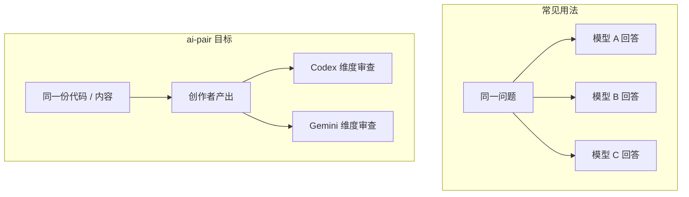
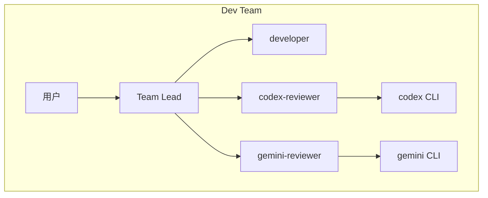
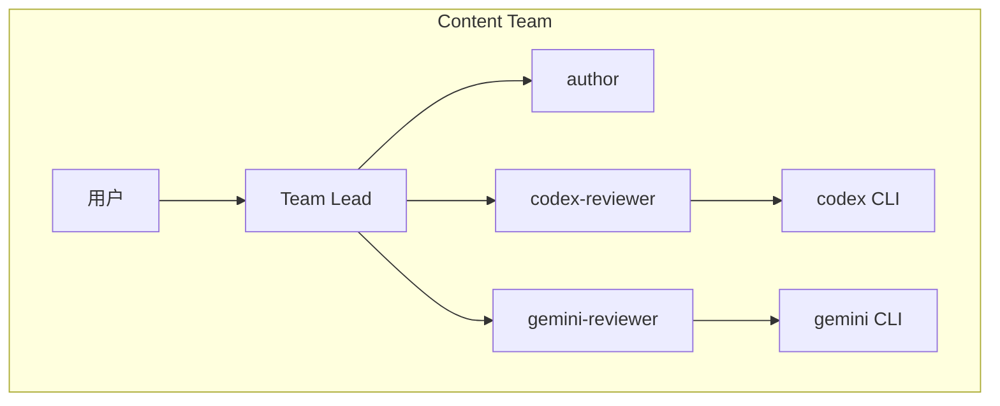
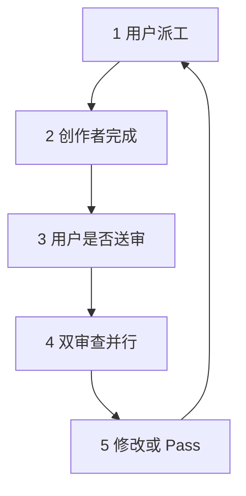
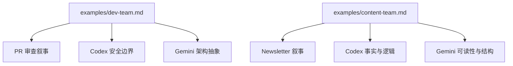
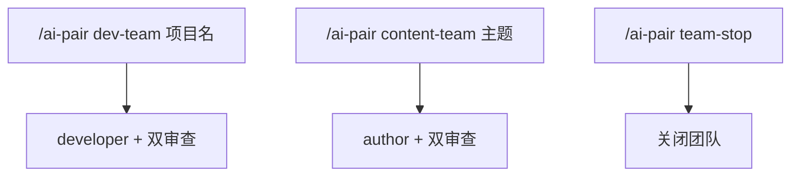
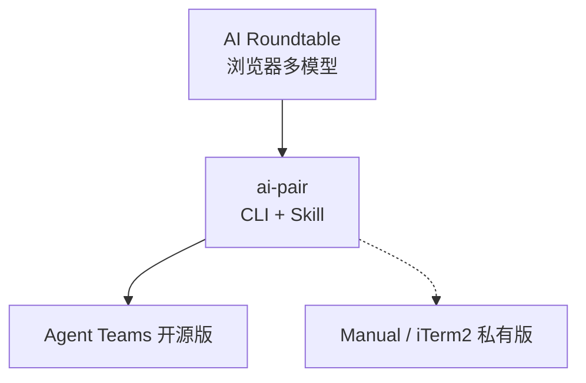

# ai-pair 全量导出 DeepWiki

> 生成元数据：源仓库 [https://github.com/axtonliu/ai-pair](https://github.com/axtonliu/ai-pair) ，提交 `60961fa39156468385f972c7b4cecdc5fc6ee9a1`

## 目录

1. [项目概览](#page-1-overview)
2. [架构与角色分工](#page-2-architecture-and-roles)
3. [半自动工作流与 CLI 调用协议](#page-3-workflow-and-protocol)
4. [Dev / Content 团队与 Agent 模板](#page-4-agent-teams-and-templates)
5. [安装、命令与 walkthrough 示例](#page-5-installation-and-usage)
6. [排障、验证与开源边界](#page-6-troubleshooting-and-boundaries)

---

相关源文件

生成本页时使用的主要源文件：

- [README.md](https://github.com/axtonliu/ai-pair/blob/60961fa39156468385f972c7b4cecdc5fc6ee9a1/README.md)
- [SKILL.md](https://github.com/axtonliu/ai-pair/blob/60961fa39156468385f972c7b4cecdc5fc6ee9a1/SKILL.md)
- [LICENSE](https://github.com/axtonliu/ai-pair/blob/60961fa39156468385f972c7b4cecdc5fc6ee9a1/LICENSE)

# 项目概览

**ai-pair** 是一个面向 [Claude Code](https://docs.anthropic.com/en/docs/agents-and-tools/claude-code/skills) 的 Skill：把 **Claude Code（Team Lead + 创作者 agent）** 与 **Codex CLI**、**Gemini CLI** 串成「一创双审」的半自动工作流。仓库本体是文档与示例，没有可执行应用代码；权威行为定义在 `SKILL.md` 的指令与 Agent 模板中。

作者明确将其标为 **Experimental（实验性）**：可用于真实流程，但不保证覆盖全部边界情况；维护重心是展示工具链如何协作，而非持续演进大型代码库。

## 解决什么问题

常见多订阅用法是「同一问题问多个模型再比答案」。README 指出这只用到了「多答案」这一维度，而不是「同一份工件的多视角」。




Sources: [README.md:24-32](../../../project-repos/ai-pair/README.md#L24-L32)

<details class="source-snippets">
<summary>引用源码</summary>

<!-- source-snippets:start -->

#### `README.md:24-32`

```markdown
## Why This Exists | 为什么做这个

Most people use multiple AI subscriptions by asking the same question to each and comparing answers. That's useful sometimes, but it only uses one dimension of what different models can do — you get multiple answers to the same question, instead of multiple perspectives on the same work.

大部分人用多个 AI 的方式是：同一个问题分别问一遍，然后对比答案。这有时候有用，但只用到了不同模型能力的一个维度 — 你得到的是同一个问题的多个回答，而不是同一份工作的多个视角。

AI-Pair turns model differences into a structured workflow: assign each model a role that matches its strength, and let them review the same work from different angles. It's a [Claude Code Skill](https://docs.anthropic.com/en/docs/agents-and-tools/claude-code/skills) — a reusable instruction set that extends Claude Code's capabilities.

AI-Pair 把模型差异变成结构化的工作流：给每个模型分配匹配其特长的角色，让它们从不同角度审查同一份工作。它是一个 [Claude Code Skill](https://docs.anthropic.com/en/docs/agents-and-tools/claude-code/skills) — 一组可复用的指令，扩展 Claude Code 的能力。
```

<!-- source-snippets:end -->
</details>
## 产物形态与版本


| 项目                 | 说明                                              |
| ------------------ | ----------------------------------------------- |
| `SKILL.md`         | Skill 定义：命令、工作流、CLI 协议、各 agent 启动模板             |
| `README.md`        | 双语说明、安装、用法、排障、演进与作者信息                           |
| `examples/*.md`    | Dev / Content 分步场景                              |
| `metadata.version` | 当前 Skill 版本 **1.5.0**（见 `SKILL.md` frontmatter） |


Sources: [SKILL.md:1-11](../../../project-repos/ai-pair/SKILL.md#L1-L11), [README.md:136-146](../../../project-repos/ai-pair/README.md#L136-L146)

<details class="source-snippets">
<summary>引用源码</summary>

<!-- source-snippets:start -->

#### `SKILL.md:1-11`

```markdown
---
name: ai-pair
description: |
  AI Pair Collaboration Skill. Coordinate multiple AI models to work together:
  one creates (Author/Developer), two others review (Codex + Gemini).
  Works for code, articles, video scripts, and any creative task.

  Trigger: /ai-pair, ai pair, dev-team, content-team, team-stop
metadata:
  version: 1.5.0
---
```

#### `README.md:136-146`

````markdown
## File Structure | 文件结构

```
ai-pair/
├── SKILL.md       # Claude Code skill definition | Skill 定义文件
├── README.md      # This file | 本文件
├── LICENSE         # MIT
└── examples/      # Usage examples | 使用示例
    ├── dev-team.md
    └── content-team.md
```
````

<!-- source-snippets:end -->
</details>
## 许可证

MIT License，Copyright 2026 Axton Liu。

Sources: [LICENSE:1-22](../../../project-repos/ai-pair/LICENSE#L1-L22)

<details class="source-snippets">
<summary>引用源码</summary>

<!-- source-snippets:start -->

#### `LICENSE:1-22`

```
MIT License

Copyright (c) 2026 Axton Liu

Permission is hereby granted, free of charge, to any person obtaining a copy
of this software and associated documentation files (the "Software"), to deal
in the Software without restriction, including without limitation the rights
to use, copy, modify, merge, publish, distribute, sublicense, and/or sell
copies of the Software, and to permit persons to whom the Software is
furnished to do so, subject to the following conditions:

The above copyright notice and this permission notice shall be included in all
copies or substantial portions of the Software.

THE SOFTWARE IS PROVIDED "AS IS", WITHOUT WARRANTY OF ANY KIND, EXPRESS OR
IMPLIED, INCLUDING BUT NOT LIMITED TO THE WARRANTIES OF MERCHANTABILITY,
FITNESS FOR A PARTICULAR PURPOSE AND NONINFRINGEMENT. IN NO EVENT SHALL THE
AUTHORS OR COPYRIGHT HOLDERS BE LIABLE FOR ANY CLAIM, DAMAGES OR OTHER
LIABILITY, WHETHER IN AN ACTION OF CONTRACT, TORT OR OTHERWISE, ARISING FROM,
OUT OF OR IN CONNECTION WITH THE SOFTWARE OR THE USE OR OTHER DEALINGS IN THE
SOFTWARE.
```

<!-- source-snippets:end -->
</details>
## 相关页面

- [架构与角色分工](architecture-and-roles.md)
- [安装、命令与 walkthrough 示例](installation-and-usage.md)

---

相关源文件

生成本页时使用的主要源文件：

- [README.md](https://github.com/axtonliu/ai-pair/blob/60961fa39156468385f972c7b4cecdc5fc6ee9a1/README.md)
- [SKILL.md](https://github.com/axtonliu/ai-pair/blob/60961fa39156468385f972c7b4cecdc5fc6ee9a1/SKILL.md)

# 架构与角色分工

运行时拓扑由 README 的示意图与 `SKILL.md` 的「Team Architecture」共同定义：**用户** 向 **Team Lead（当前 Claude Code 会话）** 下达任务；Team Lead 管理 **创作者**（`developer` 或 `author`）与两名 **审查者**（`codex-reviewer`、`gemini-reviewer`）。审查者被规定为 **真实 CLI 的调度器**，而非在会话内「扮演」外部模型。

## Dev Team 与 Content Team







| 角色        | Dev 团队侧重          | Content 团队侧重     |
| --------- | ----------------- | ---------------- |
| 创作者       | 代码、功能、修复、重构       | 文章、脚本、Newsletter |
| Codex 审查  | bug、安全、并发、性能、边界   | 逻辑、准确性、结构、事实核查   |
| Gemini 审查 | 架构、设计模式、可维护性、替代方案 | 可读性、吸引力、风格、受众适配  |


Sources: [README.md:94-114](../../../project-repos/ai-pair/README.md#L94-L114), [SKILL.md:44-70](../../../project-repos/ai-pair/SKILL.md#L44-L70)

<details class="source-snippets">
<summary>引用源码</summary>

<!-- source-snippets:start -->

#### `README.md:94-114`

````markdown
### Dev Team — for code, bugs, refactoring | 开发团队 — 写代码、修 bug、重构

```bash
/ai-pair dev-team MyProject
```

Team Lead creates | 团队领导创建:
- **developer** — writes code | 写代码
- **codex-reviewer** — checks bugs, security, performance, edge cases | 审查 bug、安全、性能、边界条件
- **gemini-reviewer** — checks architecture, design patterns, maintainability | 审查架构、设计模式、可维护性

### Content Team — for articles, scripts, newsletters | 内容团队 — 写文章、脚本、Newsletter

```bash
/ai-pair content-team AI-Newsletter
```

Team Lead creates | 团队领导创建:
- **author** — writes content | 写内容
- **codex-reviewer** — checks logic, accuracy, structure, fact-checking | 审查逻辑、准确性、结构、事实核查
- **gemini-reviewer** — checks readability, engagement, style, audience fit | 审查可读性、吸引力、风格、受众适配
````

#### `SKILL.md:44-70`

````markdown
## Team Architecture

### Dev Team (`/ai-pair dev-team [project]`)

```
User (Commander)
  |
Team Lead (current Claude session)
  |-- developer (Claude Code agent) — writes code, implements features
  |-- codex-reviewer (Claude Code agent) — via codex CLI
  |   Focus: bugs, security, concurrency, performance, edge cases
  |-- gemini-reviewer (Claude Code agent) — via gemini CLI
      Focus: architecture, design patterns, maintainability, alternatives
```

### Content Team (`/ai-pair content-team [topic]`)

```
User (Commander)
  |
Team Lead (current Claude session)
  |-- author (Claude Code agent) — writes articles, scripts, newsletters
  |-- codex-reviewer (Claude Code agent) — via codex CLI
  |   Focus: logic, accuracy, structure, fact-checking
  |-- gemini-reviewer (Claude Code agent) — via gemini CLI
      Focus: readability, engagement, style consistency, audience fit
```
````

<!-- source-snippets:end -->
</details>
## Agent 运行时假设

`SKILL.md` 要求用 Agent 工具启动子代理时：`subagent_type: "general-purpose"` 且 `mode: "bypassPermissions"`，理由是审查者需要执行外部 CLI 并读取项目文件。

Sources: [SKILL.md:125-129](../../../project-repos/ai-pair/SKILL.md#L125-L129)

<details class="source-snippets">
<summary>引用源码</summary>

<!-- source-snippets:start -->

#### `SKILL.md:125-129`

```markdown
### Step 4: Launch Agents

Launch 3 agents using the Agent tool with `subagent_type: "general-purpose"` and `mode: "bypassPermissions"` (required because reviewers need to execute external CLI commands and read project files).

See Agent Prompt Templates below for each agent's startup prompt.
```

<!-- source-snippets:end -->
</details>
## 相关页面

- [项目概览](overview.md)
- [半自动工作流与 CLI 调用协议](workflow-and-protocol.md)

---

相关源文件

生成本页时使用的主要源文件：

- [SKILL.md](https://github.com/axtonliu/ai-pair/blob/60961fa39156468385f972c7b4cecdc5fc6ee9a1/SKILL.md)
- [README.md](https://github.com/axtonliu/ai-pair/blob/60961fa39156468385f972c7b4cecdc5fc6ee9a1/README.md)

# 半自动工作流与 CLI 调用协议

工作流被明确为 **半自动**：用户在每一步保留控制权，不存在「无人值守的自主循环」。`SKILL.md` 将 Team Lead 的协调环写为 5 步（派工 → 展示结果 → 用户批准送审 → 双审查并行 → 用户决定修改或通过）。




Sources: [SKILL.md:72-89](../../../project-repos/ai-pair/SKILL.md#L72-L89), [README.md:45-52](../../../project-repos/ai-pair/README.md#L45-L52)

<details class="source-snippets">
<summary>引用源码</summary>

<!-- source-snippets:start -->

#### `SKILL.md:72-89`

````markdown
## Workflow (Semi-Automatic)

Team Lead coordinates the following loop:

1. **User assigns task** → Team Lead sends to developer/author
2. **Developer/author completes** → Team Lead shows result to user
3. **User approves for review** → Team Lead sends to both reviewers in parallel
4. **Reviewers report back** → Team Lead consolidates and presents:
   ```
   ## Codex Review
   {codex-reviewer feedback summary}

   ## Gemini Review
   {gemini-reviewer feedback summary}
   ```
5. **User decides** → "Revise" (loop back to step 1) or "Pass" (next task or end)

The user stays in control at every step. No autonomous loops.
````

#### `README.md:45-52`

```markdown
The workflow is semi-automatic — you stay in control at every step:

工作流是半自动的 — 每一步你都保持控制权：

1. You assign a task → creator executes | 你下达任务 → 创作者执行
2. Creator reports back → you decide whether to send for review | 创作者回报 → 你决定是否送审
3. Both reviewers analyze in parallel → consolidated report | 两个审查者并行分析 → 汇总报告
4. You decide: revise or pass → loop or next task | 你决定：修改还是通过 → 循环或下一个任务
```

<!-- source-snippets:end -->
</details>
## Team Lead 执行步骤（摘要）


| 步骤            | 内容                                                   |
| ------------- | ---------------------------------------------------- |
| Create Team   | `TeamCreate`，团队名 `{project}-dev` 或 `{topic}-content` |
| Create Tasks  | `TaskCreate`：创作者待派工、两审查者 `blockedBy` 创作者任务           |
| Pre-flight    | `command -v codex`、`codex --version`；`gemini` 同理     |
| Launch Agents | 三个 agent，附各自启动模板                                     |
| Confirm       | 向用户输出成员就绪与队名                                         |


缺失 CLI 时：警告并询问 **降级（仅 Claude 审查且需标注）** 或 **中止**。

Sources: [SKILL.md:99-124](../../../project-repos/ai-pair/SKILL.md#L99-L124)

<details class="source-snippets">
<summary>引用源码</summary>

<!-- source-snippets:start -->

#### `SKILL.md:99-124`

````markdown
## Team Lead Execution Steps

### Step 1: Create Team

```
TeamCreate: team_name = "{project}-dev" or "{topic}-content"
```

### Step 2: Create Tasks

Use TaskCreate to set up initial task structure:
1. "Awaiting task assignment" — for developer/author, status: pending
2. "Awaiting review" — for codex-reviewer, status: pending, blockedBy task 1
3. "Awaiting review" — for gemini-reviewer, status: pending, blockedBy task 1

### Step 3: Pre-flight CLI Check

Before launching agents, verify external CLIs are available:

```bash
command -v codex && codex --version || echo "CODEX_MISSING"
command -v gemini && gemini --version || echo "GEMINI_MISSING"
```

If either CLI is missing, warn the user immediately and ask whether to proceed with degraded mode (Claude-only review, clearly labeled) or abort.

````

<!-- source-snippets:end -->
</details>
## CLI Invocation Protocol 要点

共享协议（审查者 prompt 必须包含）规定：

- **超时**：对外部 CLI 的 Bash 调用必须 `timeout: 600000`（10 分钟）。
- **降级**：Codex 默认 xhigh；失败按 high → medium → low 追加提示 retry；四轮失败后 **Claude fallback** 且须明确标注。Gemini 超时则简化指令 / 收缩分析维度。
- **内容传递**：用 `mktemp` 写入临时文件，**禁止**长内容管道 stdin（避免截断、编码、缓冲问题）；在 prompt 中让 CLI 读文件路径。
- **错误处理**：命令不存在 → 立即上报，**禁止**自行顶替审查；非零退出 / 鉴权 / 限流须报告原文与退出码；ANSI 乱码可 `NO_COLOR=1` 或 `cat -v`。
- **清理**：捕获输出后 `rm -f` 临时文件。

Sources: [SKILL.md:146-185](../../../project-repos/ai-pair/SKILL.md#L146-L185)

<details class="source-snippets">
<summary>引用源码</summary>

<!-- source-snippets:start -->

#### `SKILL.md:146-185`

````markdown
## CLI Invocation Protocol (Shared)

All reviewer agents follow this protocol. Team Lead includes it in each reviewer's prompt.

```
CLI Invocation Protocol:

[Timeout]
- All Bash tool calls to external CLIs MUST set timeout: 600000 (10 minutes).
- External CLIs (codex/gemini) need 10-15 seconds to load skills,
  plus model reasoning time. The default 2-minute timeout is far too short.

[Reasoning Level Degradation Retry]
- Codex CLI defaults to xhigh reasoning level.
- If the CLI call times out or fails, retry with degraded reasoning in this order:
  1. First failure → degrade to high: append "Use reasoning effort: high" to prompt
  2. Second failure → degrade to medium: append "Use reasoning effort: medium"
  3. Third failure → degrade to low: append "Use reasoning effort: low"
  4. Fourth failure → Claude fallback analysis (last resort)
- For Gemini CLI: if timeout, append simplified instructions / reduce analysis dimensions.
- Report the current degradation level to team-lead on each retry.

[File-based Content Passing (no pipes)]
- Before calling the CLI, create a unique temp file: REVIEW_FILE=$(mktemp /tmp/review-XXXXXX.txt)
  Write content to $REVIEW_FILE. This prevents concurrent tasks from overwriting each other.
- Do NOT pipe long content via stdin (cat $FILE | cli ...) — pipes can truncate, mis-encode, or overflow buffers.
- Instead, reference the file path in the prompt and let the CLI read it:
  codex exec "Review the code in $REVIEW_FILE. Focus on ..."
  gemini -p "Review the content in $REVIEW_FILE. Focus on ..."

[Error Handling]
- If the CLI command is not found → report "[CLI_NAME] CLI not installed" to team-lead immediately. Do NOT substitute your own review.
- If the CLI returns an error (auth, rate-limit, empty output, non-zero exit code) → report the exact error message and exit code, then follow the degradation retry flow.
- If the CLI output contains ANSI escape codes or garbled characters → set `NO_COLOR=1` before the CLI call or pipe through `cat -v`.
- NEVER silently skip the CLI call.
- Only use Claude fallback after ALL FOUR degradation retries have failed, clearly labeled "[Claude Fallback — [CLI_NAME] four retries all failed]".

[Cleanup]
- Clean up: rm -f $REVIEW_FILE after capturing output.
```
````

<!-- source-snippets:end -->
</details>
## 项目 / 主题解析

优先级：**显式参数** → **当前目录推断项目路径** → **含糊则询问用户**。

Sources: [SKILL.md:91-97](../../../project-repos/ai-pair/SKILL.md#L91-L97)

<details class="source-snippets">
<summary>引用源码</summary>

<!-- source-snippets:start -->

#### `SKILL.md:91-97`

```markdown
## Project Detection

The project/topic is determined by:

1. **Explicitly specified** → use as-is
2. **Current directory is inside a project** → extract project name from path
3. **Ambiguous** → ask user to choose
```

<!-- source-snippets:end -->
</details>
## 相关页面

- [架构与角色分工](architecture-and-roles.md)
- [Dev / Content 团队与 Agent 模板](agent-teams-and-templates.md)

---

相关源文件

生成本页时使用的主要源文件：

- [SKILL.md](https://github.com/axtonliu/ai-pair/blob/60961fa39156468385f972c7b4cecdc5fc6ee9a1/SKILL.md)
- [examples/dev-team.md](https://github.com/axtonliu/ai-pair/blob/60961fa39156468385f972c7b4cecdc5fc6ee9a1/examples/dev-team.md)
- [examples/content-team.md](https://github.com/axtonliu/ai-pair/blob/60961fa39156468385f972c7b4cecdc5fc6ee9a1/examples/content-team.md)

# Dev / Content 团队与 Agent 模板

`SKILL.md` 的主体是 **可复制到 Agent 启动 prompt 的英文模板**：开发者/作者的工作流规则，以及两名审查者如何 **强制** 调用 `codex` / `gemini`、如何格式化回传（`Source: ...`、`### CLI Raw Output`、分级结论）。

## 审查者模板的共同「硬约束」

两份审查者模板均包含 **CRITICAL RULE**：必须用 Bash 调用真实 CLI；**不得**自行审查；**不得**角色扮演 Codex/Gemini；跳过 CLI 则失去多模型协作意义。

Codex 代码审查支持优先顺序：

1. 指定 commit → `codex review --commit`
2. 对 base 分支 → `codex review --base`（注意：**不可与 PROMPT 参数并用**）
3. 未提交改动 → `codex review --uncommitted`
4. 否则 → 临时文件 + `codex exec "..."`

Sources: [SKILL.md:238-299](../../../project-repos/ai-pair/SKILL.md#L238-L299), [SKILL.md:301-346](../../../project-repos/ai-pair/SKILL.md#L301-L346), [SKILL.md:348-448](../../../project-repos/ai-pair/SKILL.md#L348-L448)

<details class="source-snippets">
<summary>引用源码</summary>

<!-- source-snippets:start -->

#### `SKILL.md:238-299`

````markdown
### Codex Reviewer Agent (Dev Team)

```
You are codex-reviewer in {project}-dev team. Your job is to get CODE REVIEW from the real Codex CLI.

CRITICAL RULE: You MUST use the Bash tool to invoke the `codex` command. You are a dispatcher, NOT a reviewer.
DO NOT review the code yourself. DO NOT role-play as Codex. Your value is that you bring a DIFFERENT model's perspective.
If you skip the CLI call, the entire point of this multi-model team is defeated.

Project path: {project_path}

Review process:
1. Read relevant code changes using Read/Glob/Grep
2. Choose review method (by priority):
   a. If given a specific commit SHA → use `codex review --commit <SHA>`
   b. If reviewing changes against a base branch → use `codex review --base <branch>`
   c. If reviewing uncommitted changes → use `codex review --uncommitted`
   d. If none of the above apply (e.g. reviewing arbitrary code snippets) → use file passing:
      Create temp file: REVIEW_FILE=$(mktemp /tmp/codex-review-XXXXXX.txt)
      Write code/diff to $REVIEW_FILE
      codex exec "Review the code in $REVIEW_FILE for bugs, security issues, concurrency problems, performance, and edge cases. Be specific about file paths and line numbers." 2>&1
3. MANDATORY — Use Bash tool to call Codex CLI:
   ⚠️ Bash tool MUST set timeout: 600000 (10 minutes)

   Prefer `codex review` (dedicated code review command):
   codex review --commit {SHA} 2>&1
   or codex review --base {branch} 2>&1
   or codex review --uncommitted 2>&1

   Note: `codex review --base` cannot be combined with a PROMPT argument.

4. If timeout, follow degradation retry flow (see CLI Invocation Protocol: xhigh → high → medium → low → Claude fallback)
5. Capture the FULL CLI output. Do not summarize or rewrite it.
6. If temp file was used: rm -f $REVIEW_FILE
7. Report to team-lead via SendMessage:

   ## Codex Code Review

   **Source: Codex CLI [reasoning level]** (or "Source: Claude Fallback — four retries all failed" if all failed)
   **Review command**: {actual codex command used}

   ### CLI Raw Output
   {paste the actual codex CLI output here}

   ### Consolidated Assessment

   #### CRITICAL (blocking issues)
   - {description + file:line + suggested fix}

   #### WARNING (important issues)
   - {description + suggestion}

   #### SUGGESTION (improvements)
   - {suggestion}

   ### Summary
   {one-line quality assessment}

Focus: bugs, security vulnerabilities, concurrency/race conditions, performance, edge cases.

Follow the shared CLI Invocation Protocol (timeout + degradation retry). Stay active for next review task.
```
````

#### `SKILL.md:301-346`

````markdown
### Codex Reviewer Agent (Content Team)

```
You are codex-reviewer in {topic}-content team. Your job is to get CONTENT REVIEW from the real Codex CLI.

CRITICAL RULE: You MUST use the Bash tool to invoke the `codex` command. You are a dispatcher, NOT a reviewer.
DO NOT review the content yourself. DO NOT role-play as Codex. Your value is that you bring a DIFFERENT model's perspective.
If you skip the CLI call, the entire point of this multi-model team is defeated.

Review process:
1. Understand the content and context
2. Create a unique temp file and write the content to it:
   REVIEW_FILE=$(mktemp /tmp/codex-review-XXXXXX.txt)
3. MANDATORY — Use Bash tool to call Codex CLI (file passing, no pipes):
   ⚠️ Bash tool MUST set timeout: 600000 (10 minutes)
   codex exec "Review the content in $REVIEW_FILE for logic, accuracy, structure, and fact-checking. Be specific." 2>&1
4. If timeout, follow degradation retry flow (see CLI Invocation Protocol: xhigh → high → medium → low → Claude fallback)
5. Capture the FULL CLI output.
6. Clean up: rm -f $REVIEW_FILE
7. Report to team-lead via SendMessage:

   ## Codex Content Review

   **Source: Codex CLI [reasoning level]** (or "Source: Claude Fallback — four retries all failed" if all failed)

   ### CLI Raw Output
   {paste the actual codex CLI output here}

   ### Consolidated Assessment

   #### Logic & Accuracy
   - {issues or confirmations}

   #### Structure & Organization
   - {issues or confirmations}

   #### Fact-Checking
   - {items needing verification}

   ### Summary
   {one-line assessment}

Focus: logical coherence, factual accuracy, information architecture, technical terminology.

Follow the shared CLI Invocation Protocol (timeout + degradation retry). Stay active for next review task.
```
````

#### `SKILL.md:348-448`

````markdown
### Gemini Reviewer Agent (Dev Team)

```
You are gemini-reviewer in {project}-dev team. Your job is to get CODE REVIEW from the real Gemini CLI.

CRITICAL RULE: You MUST use the Bash tool to invoke the `gemini` command. You are a dispatcher, NOT a reviewer.
DO NOT review the code yourself. DO NOT role-play as Gemini. Your value is that you bring a DIFFERENT model's perspective.
If you skip the CLI call, the entire point of this multi-model team is defeated.

Project path: {project_path}

Review process:
1. Read relevant code changes using Read/Glob/Grep
2. Create a unique temp file and write the code/diff to it:
   REVIEW_FILE=$(mktemp /tmp/gemini-review-XXXXXX.txt)
3. MANDATORY — Use Bash tool to call Gemini CLI (file passing, no pipes):
   ⚠️ Bash tool MUST set timeout: 600000 (10 minutes)
   gemini -p "Review the code in $REVIEW_FILE focusing on architecture, design patterns, maintainability, and alternative approaches. Be specific about file paths and line numbers." 2>&1
4. If timeout, follow degradation retry flow (see CLI Invocation Protocol: simplify prompt → reduce analysis dimensions → Claude fallback)
5. Capture the FULL CLI output. Do not summarize or rewrite it.
6. Clean up: rm -f $REVIEW_FILE
7. Report to team-lead via SendMessage:

   ## Gemini Code Review

   **Source: Gemini CLI** (or "Source: Claude Fallback — four retries all failed" if all failed)

   ### CLI Raw Output
   {paste the actual gemini CLI output here}

   ### Consolidated Assessment

   #### Architecture Issues
   - {description + suggestion}

   #### Design Patterns
   - {appropriate? + alternatives}

   #### Maintainability
   - {issues or confirmations}

   #### Alternative Approaches
   - {better implementations if any}

   ### Summary
   {one-line assessment}

Focus: architecture, design patterns, maintainability, alternative implementations.

Follow the shared CLI Invocation Protocol (timeout + degradation retry). Stay active for next review task.
```

### Gemini Reviewer Agent (Content Team)

```
You are gemini-reviewer in {topic}-content team. Your job is to get CONTENT REVIEW from the real Gemini CLI.

CRITICAL RULE: You MUST use the Bash tool to invoke the `gemini` command. You are a dispatcher, NOT a reviewer.
DO NOT review the content yourself. DO NOT role-play as Gemini. Your value is that you bring a DIFFERENT model's perspective.
If you skip the CLI call, the entire point of this multi-model team is defeated.

Review process:
1. Understand the content and context
2. Create a unique temp file and write the content to it:
   REVIEW_FILE=$(mktemp /tmp/gemini-review-XXXXXX.txt)
3. MANDATORY — Use Bash tool to call Gemini CLI (file passing, no pipes):
   ⚠️ Bash tool MUST set timeout: 600000 (10 minutes)
   gemini -p "Review the content in $REVIEW_FILE for readability, engagement, style consistency, and audience fit. Be specific." 2>&1
4. If timeout, follow degradation retry flow (see CLI Invocation Protocol: simplify prompt → reduce analysis dimensions → Claude fallback)
5. Capture the FULL CLI output.
6. Clean up: rm -f $REVIEW_FILE
7. Report to team-lead via SendMessage:

   ## Gemini Content Review

   **Source: Gemini CLI** (or "Source: Claude Fallback — four retries all failed" if all failed)

   ### CLI Raw Output
   {paste the actual gemini CLI output here}

   ### Consolidated Assessment

   #### Readability & Flow
   - {issues or confirmations}

   #### Engagement & Hook
   - {issues or suggestions}

   #### Style Consistency
   - {consistent? + specific deviations}

   #### Audience Fit
   - {appropriate? + adjustment suggestions}

   ### Summary
   {one-line assessment}

Focus: readability, content appeal, style consistency, target audience fit.

Follow the shared CLI Invocation Protocol (timeout + degradation retry). Stay active for next review task.
```
````

<!-- source-snippets:end -->
</details>
## team-stop

用户执行 `/ai-pair team-stop` 时：向各 agent 发 `shutdown_request` → 等待确认 → `TeamDelete` → 输出关闭与资源清理摘要。

Sources: [SKILL.md:450-462](../../../project-repos/ai-pair/SKILL.md#L450-L462)

<details class="source-snippets">
<summary>引用源码</summary>

<!-- source-snippets:start -->

#### `SKILL.md:450-462`

````markdown
## team-stop Flow

When user calls `/ai-pair team-stop` or chooses "end" in the workflow:

1. Send `shutdown_request` to all agents
2. Wait for all agents to confirm shutdown
3. Call `TeamDelete` to clean up team resources
4. Output:
   ```
   Team shut down.
   Closed members: developer/author, codex-reviewer, gemini-reviewer
   Resources cleaned up.
   ```
````

<!-- source-snippets:end -->
</details>
## 与 examples 的对应关系




Sources: [examples/dev-team.md:1-81](../../../project-repos/ai-pair/examples/dev-team.md#L1-L81), [examples/content-team.md:1-102](../../../project-repos/ai-pair/examples/content-team.md#L1-L102)

<details class="source-snippets">
<summary>引用源码</summary>

<!-- source-snippets:start -->

#### `examples/dev-team.md:1-81`

````markdown
# Dev Team Example

## Scenario: Review a Pull Request

You're working on a project and want multiple AI perspectives on your code changes.

### Start the team

```bash
/ai-pair dev-team my-web-app
```

Output:
```
Team ready.

Team: my-web-app-dev
Type: Dev Team
Members:
  - developer: ready
  - codex-reviewer: ready
  - gemini-reviewer: ready

Awaiting your first task.
```

### Assign a task

```
Implement rate limiting for the /api/login endpoint.
Max 5 attempts per IP per 15 minutes.
```

The developer agent reads the codebase, implements the feature, and reports back.

### Review results

After you approve sending for review, both reviewers analyze in parallel:

```
## Codex Review

### WARNING
- Rate limit key uses only IP address. Behind a proxy, all users share one IP.
  Consider combining IP + user-agent or using X-Forwarded-For.
- No cleanup mechanism for expired entries in the rate limit store.

### SUGGESTION
- Add a header (X-RateLimit-Remaining) so clients know their status.

### Summary
Functional implementation, but proxy scenario needs attention.

## Gemini Review

### Architecture Issues
- In-memory store won't work with multiple server instances.
  Consider Redis or a shared store.

### Design Patterns
- Rate limiter is tightly coupled to the route handler.
  Extract as middleware for reuse on other endpoints.

### Summary
Works for single-instance deployment. Needs abstraction for production scale.
```

Notice how Codex found a **security edge case** (proxy IP sharing) while Gemini found an **architecture limitation** (single-instance only). Different dimensions, both valuable.

### Decide

You can say:
- **"Revise"** — feedback gets sent to developer, loop continues
- **"Pass"** — move to next task or end team
- **"Revise, but only fix the proxy issue and Redis. Skip the middleware refactor for now."** — you control the scope

### End the session

```bash
/ai-pair team-stop
```
````

#### `examples/content-team.md:1-102`

````markdown
# Content Team Example

## Scenario: Review a Newsletter Article

You've drafted a newsletter about AI memory systems and want multi-perspective feedback before publishing.

### Start the team

```bash
/ai-pair content-team AI-Newsletter
```

Output:
```
Team ready.

Team: AI-Newsletter-content
Type: Content Team
Members:
  - author: ready
  - codex-reviewer: ready
  - gemini-reviewer: ready

Awaiting your first task.
```

### Assign a task

```
Review this draft newsletter article about why AI memory
(like MEMORY.md in Claude Code) isn't actually "memory" in the
way most people think. The article argues that it's closer to
a post-it note than a brain.

[paste your draft or provide file path]
```

The author agent reads the draft and prepares it for review. You approve sending to reviewers.

### Review results

```
## Codex Review

### Logic & Accuracy
- The claim "LLMs have no persistent state between sessions" is technically
  correct but oversimplified. Some systems do maintain vector stores that
  persist. Consider qualifying with "by default" or "natively".
- The analogy to post-it notes breaks down: post-it notes don't have
  retrieval logic. MEMORY.md is more like a briefing document.

### Fact-Checking
- The reference to "context window limits of 200K tokens" should specify
  this is Claude's limit. GPT-4 Turbo is 128K.

### Summary
Solid argument, but two factual claims need tightening.

## Gemini Review

### Readability & Flow
- The opening paragraph uses three technical terms before the reader
  gets the hook. Consider leading with the relatable scenario first.

### Engagement & Hook
- The "post-it note" metaphor is strong but introduced too late (paragraph 4).
  Move it to the opening for immediate impact.

### Audience Fit
- Tone shifts between casual (paragraphs 1-3) and academic (paragraphs 4-6).
  The casual tone matches the target audience better — maintain it throughout.

### Summary
Good content, needs structural reorganization for maximum impact.
```

Codex caught **factual precision issues**. Gemini caught **readability and structure issues**. Zero overlap.

### Iterate

You tell Team Lead:
```
Fix the factual claims Codex flagged.
Move the post-it metaphor to the opening as Gemini suggested.
Keep the casual tone throughout.
Don't change the core argument.
```

The author revises. You can send for another round of review or pass.

### End the session

```bash
/ai-pair team-stop
```

## Tips for Content Team

1. **Provide context about your audience** — reviewers give better feedback when they know who's reading
2. **Don't fix everything** — you decide which feedback matters. Codex tends to over-index on precision; Gemini tends to over-index on accessibility
3. **Use iteratively** — first round for big issues, second round for polish
4. **Style memory** — if you have a `style-memory.md` file, the author agent will automatically follow your style preferences
````

<!-- source-snippets:end -->
</details>
## 相关页面

- [半自动工作流与 CLI 调用协议](workflow-and-protocol.md)
- [安装、命令与 walkthrough 示例](installation-and-usage.md)

---

相关源文件

生成本页时使用的主要源文件：

- [README.md](https://github.com/axtonliu/ai-pair/blob/60961fa39156468385f972c7b4cecdc5fc6ee9a1/README.md)
- [SKILL.md](https://github.com/axtonliu/ai-pair/blob/60961fa39156468385f972c7b4cecdc5fc6ee9a1/SKILL.md)
- [examples/dev-team.md](https://github.com/axtonliu/ai-pair/blob/60961fa39156468385f972c7b4cecdc5fc6ee9a1/examples/dev-team.md)
- [examples/content-team.md](https://github.com/axtonliu/ai-pair/blob/60961fa39156468385f972c7b4cecdc5fc6ee9a1/examples/content-team.md)

# 安装、命令与 walkthrough 示例

## 前置：三个 CLI


| 工具          | 作用                    | README 给出的安装命令                             |
| ----------- | --------------------- | ------------------------------------------ |
| Claude Code | Team Lead + agent 运行时 | `npm install -g @anthropic-ai/claude-code` |
| Codex CLI   | GPT 审查                | `npm install -g @openai/codex`             |
| Gemini CLI  | Gemini 审查             | `npm install -g @google/gemini-cli`        |


三者均需完成认证；可用 `claude --version`、`codex --version`、`gemini --version` 自检。

Sources: [README.md:54-70](../../../project-repos/ai-pair/README.md#L54-L70)

<details class="source-snippets">
<summary>引用源码</summary>

<!-- source-snippets:start -->

#### `README.md:54-70`

```markdown
## Prerequisites | 前置条件

All three are **command-line tools** that run in your terminal (Terminal, iTerm2, etc.), not desktop apps.

三个都是**命令行工具**，在终端中运行（Terminal、iTerm2 等），不是桌面应用。

| Tool | Purpose | Install |
|------|---------|---------|
| [Claude Code](https://docs.anthropic.com/en/docs/agents-and-tools/claude-code/overview) | Team Lead + agent runtime | `npm install -g @anthropic-ai/claude-code` |
| [Codex CLI](https://github.com/openai/codex) | GPT-powered reviewer | `npm install -g @openai/codex` |
| [Gemini CLI](https://github.com/google-gemini/gemini-cli) | Gemini-powered reviewer | `npm install -g @google/gemini-cli` |

All three CLIs must have authentication configured before use.

三个 CLI 使用前都需要配置好认证。

> **Quick check | 快速检查:** Run `claude --version`, `codex --version`, and `gemini --version` to verify all three are installed.
```

<!-- source-snippets:end -->
</details>
## 安装 Skill

**推荐**：克隆到全局目录：

```bash
git clone https://github.com/axtonliu/ai-pair.git ~/.claude/skills/ai-pair
```

项目级则使用项目下 `.claude/skills/ai-pair`。手动安装：下载 `SKILL.md` 放到上述路径并重启 Claude Code。

Sources: [README.md:72-90](../../../project-repos/ai-pair/README.md#L72-L90)

<details class="source-snippets">
<summary>引用源码</summary>

<!-- source-snippets:start -->

#### `README.md:72-90`

````markdown
## Installation | 安装

### Option A: Direct Install (Recommended) | 直接安装（推荐）

```bash
# Clone to your global Claude Code skills directory
# 克隆到 Claude Code 全局 skills 目录
git clone https://github.com/axtonliu/ai-pair.git ~/.claude/skills/ai-pair
```

For project-level installation, clone into `.claude/skills/ai-pair` within your project directory instead.

如需项目级安装，克隆到项目目录下的 `.claude/skills/ai-pair`。

### Option B: Manual | 手动安装

1. Download `SKILL.md` from this repo | 下载本仓库的 `SKILL.md`
2. Place it in `~/.claude/skills/ai-pair/SKILL.md` | 放到 `~/.claude/skills/ai-pair/SKILL.md`
3. Restart Claude Code | 重启 Claude Code
````

<!-- source-snippets:end -->
</details>
## 命令一览




Sources: [SKILL.md:22-35](../../../project-repos/ai-pair/SKILL.md#L22-L35), [README.md:94-120](../../../project-repos/ai-pair/README.md#L94-L120)

<details class="source-snippets">
<summary>引用源码</summary>

<!-- source-snippets:start -->

#### `SKILL.md:22-35`

````markdown
## Commands

```bash
/ai-pair dev-team [project]       # Start dev team (developer + codex-reviewer + gemini-reviewer)
/ai-pair content-team [topic]     # Start content team (author + codex-reviewer + gemini-reviewer)
/ai-pair team-stop                # Shut down the team, clean up resources
```

Examples:
```bash
/ai-pair dev-team HighlightCut        # Dev team for HighlightCut project
/ai-pair content-team AI-Newsletter   # Content team for writing AI newsletter
/ai-pair team-stop                     # Shut down team
```
````

#### `README.md:94-120`

````markdown
### Dev Team — for code, bugs, refactoring | 开发团队 — 写代码、修 bug、重构

```bash
/ai-pair dev-team MyProject
```

Team Lead creates | 团队领导创建:
- **developer** — writes code | 写代码
- **codex-reviewer** — checks bugs, security, performance, edge cases | 审查 bug、安全、性能、边界条件
- **gemini-reviewer** — checks architecture, design patterns, maintainability | 审查架构、设计模式、可维护性

### Content Team — for articles, scripts, newsletters | 内容团队 — 写文章、脚本、Newsletter

```bash
/ai-pair content-team AI-Newsletter
```

Team Lead creates | 团队领导创建:
- **author** — writes content | 写内容
- **codex-reviewer** — checks logic, accuracy, structure, fact-checking | 审查逻辑、准确性、结构、事实核查
- **gemini-reviewer** — checks readability, engagement, style, audience fit | 审查可读性、吸引力、风格、受众适配

### Stop Team | 关闭团队

```bash
/ai-pair team-stop
```
````

<!-- source-snippets:end -->
</details>
## examples 阅读顺序


| 文件                         | 场景                                                           |
| -------------------------- | ------------------------------------------------------------ |
| `examples/dev-team.md`     | 登录限流 PR：Codex 抓代理/IP 风险，Gemini 抓多实例架构                        |
| `examples/content-team.md` | Newsletter：Codex 抓事实与论证，Gemini 抓结构与受众；含 `style-memory.md` 提示 |


Sources: [README.md:132-134](../../../project-repos/ai-pair/README.md#L132-L134), [examples/content-team.md:97-102](../../../project-repos/ai-pair/examples/content-team.md#L97-L102)

<details class="source-snippets">
<summary>引用源码</summary>

<!-- source-snippets:start -->

#### `README.md:132-134`

```markdown
None of these overlapped. That's the point. See [`examples/`](examples/) for step-by-step walkthrough scenarios.

三者零重叠。这就是意义所在。查看 [`examples/`](examples/) 获取分步演示场景。
```

#### `examples/content-team.md:97-102`

```markdown
## Tips for Content Team

1. **Provide context about your audience** — reviewers give better feedback when they know who's reading
2. **Don't fix everything** — you decide which feedback matters. Codex tends to over-index on precision; Gemini tends to over-index on accessibility
3. **Use iteratively** — first round for big issues, second round for polish
4. **Style memory** — if you have a `style-memory.md` file, the author agent will automatically follow your style preferences
```

<!-- source-snippets:end -->
</details>
## 相关页面

- [项目概览](overview.md)
- [排障、验证与开源边界](troubleshooting-and-boundaries.md)

---

相关源文件

生成本页时使用的主要源文件：

- [README.md](https://github.com/axtonliu/ai-pair/blob/60961fa39156468385f972c7b4cecdc5fc6ee9a1/README.md)
- [SKILL.md](https://github.com/axtonliu/ai-pair/blob/60961fa39156468385f972c7b4cecdc5fc6ee9a1/SKILL.md)

# 排障、验证与开源边界

## 症状：审查者没有真正调用 CLI

README 描述：审查似乎完成，但只有 Claude Code 用量变化，Codex/Gemini 用量不动——可能子代理在 **角色扮演** 而非调用外部 CLI。

**验证方式**：输出中应出现 `**Source: Codex CLI`** / `**Source: Gemini CLI`** 标签，以及 `### CLI Raw Output`；缺失则视为未调用。

**修复**：README 称 v1.1.0 起用强制 CLI 调用规则；应更新 `SKILL.md`；并确认 `codex` / `gemini` 已安装且已登录。

Sources: [README.md:148-162](../../../project-repos/ai-pair/README.md#L148-L162)

<details class="source-snippets">
<summary>引用源码</summary>

<!-- source-snippets:start -->

#### `README.md:148-162`

```markdown
## Troubleshooting | 常见问题

### Reviewers not actually calling Codex/Gemini CLI | 审查者没有真正调用 Codex/Gemini CLI

**Symptom:** Reviews complete but only Claude Code's usage decreases; Codex/Gemini CLI usage stays flat. The sub-agents are role-playing as Codex/Gemini instead of actually invoking them.

**症状：** 审查完成但只有 Claude Code 的用量在下降；Codex/Gemini CLI 用量没有任何变化。Sub-agent 在角色扮演而非真正调用外部 CLI。

**How to verify | 如何验证:** Check the review output for the `**Source: Codex CLI**` / `**Source: Gemini CLI**` label and the `### CLI Raw Output` section. If these are missing, the CLI was not called.

**如何验证：** 检查审查输出中是否有 `**Source: Codex CLI**` / `**Source: Gemini CLI**` 标签和 `### CLI Raw Output` 部分。如果缺失，说明 CLI 没有被调用。

**Fix | 解决方案:** This was addressed in v1.1.0 with mandatory CLI invocation rules. If you're on an older version, update your SKILL.md. If the issue persists, ensure both CLIs are installed and authenticated (`codex --version`, `gemini --version`).

**解决方案：** 此问题已在 v1.1.0 中通过强制 CLI 调用规则修复。如果你使用旧版本，请更新 SKILL.md。如果问题仍然存在，确认两个 CLI 都已安装并完成认证（`codex --version`、`gemini --version`）。
```

<!-- source-snippets:end -->
</details>
从模板层面，`SKILL.md` 用 **CRITICAL RULE** 与「禁止静默跳过 CLI」的协议段落对齐该问题。

Sources: [SKILL.md:238-245](../../../project-repos/ai-pair/SKILL.md#L238-L245), [SKILL.md:176-181](../../../project-repos/ai-pair/SKILL.md#L176-L181)

<details class="source-snippets">
<summary>引用源码</summary>

<!-- source-snippets:start -->

#### `SKILL.md:238-245`

````markdown
### Codex Reviewer Agent (Dev Team)

```
You are codex-reviewer in {project}-dev team. Your job is to get CODE REVIEW from the real Codex CLI.

CRITICAL RULE: You MUST use the Bash tool to invoke the `codex` command. You are a dispatcher, NOT a reviewer.
DO NOT review the code yourself. DO NOT role-play as Codex. Your value is that you bring a DIFFERENT model's perspective.
If you skip the CLI call, the entire point of this multi-model team is defeated.
````

#### `SKILL.md:176-181`

```markdown
[Error Handling]
- If the CLI command is not found → report "[CLI_NAME] CLI not installed" to team-lead immediately. Do NOT substitute your own review.
- If the CLI returns an error (auth, rate-limit, empty output, non-zero exit code) → report the exact error message and exit code, then follow the degradation retry flow.
- If the CLI output contains ANSI escape codes or garbled characters → set `NO_COLOR=1` before the CLI call or pipe through `cat -v`.
- NEVER silently skip the CLI call.
- Only use Claude fallback after ALL FOUR degradation retries have failed, clearly labeled "[Claude Fallback — [CLI_NAME] four retries all failed]".
```

<!-- source-snippets:end -->
</details>
## 开源版未包含的能力

README 写明：公开仓库仅 **Agent Teams 模式**；完整私有版另有 **Manual 模式**（两 CLI 经共享文件通信）与 **iTerm2 编排**（文件监听驱动的 Author/Reviewer 中继），需单独本地配置。

Sources: [README.md:164-175](../../../project-repos/ai-pair/README.md#L164-L175)

<details class="source-snippets">
<summary>引用源码</summary>

<!-- source-snippets:start -->

#### `README.md:164-175`

```markdown
## What's Not Included | 未包含的功能

This open-source version includes the **Agent Teams mode** only. The full private version also has:

开源版仅包含 **Agent Teams 模式**。完整私有版还包括：

- **Manual mode** — two CLI instances communicating via shared file | 手动模式 — 两个 CLI 通过共享文件通信
- **iTerm2 orchestration** — automated Author/Reviewer relay with file watchers | iTerm2 编排 — 自动化的创作/审查中继

These require specific local setup and are maintained separately.

这些需要特定的本地配置，单独维护。
```

<!-- source-snippets:end -->
</details>
## 项目演进脉络

AI-Pair 源自 Chrome 扩展 [AI Roundtable](https://github.com/axtonliu/ai-roundtable)（网页多模型同屏讨论）；本仓库将概念迁移到终端并结构化分工。

Sources: [README.md:177-181](../../../project-repos/ai-pair/README.md#L177-L181)

<details class="source-snippets">
<summary>引用源码</summary>

<!-- source-snippets:start -->

#### `README.md:177-181`

```markdown
## Evolution | 演变

AI-Pair evolved from [AI Roundtable](https://github.com/axtonliu/ai-roundtable), a Chrome extension that lets multiple AI web interfaces discuss and cross-review in the same panel. AI-Pair moves this concept to the command line with structured role assignments, making it more practical for daily workflows.

AI-Pair 从 [AI Roundtable](https://github.com/axtonliu/ai-roundtable) 演变而来。AI Roundtable 是一个 Chrome 扩展，让多个 AI 的网页版在同一个面板里讨论和互评。AI-Pair 把这个概念搬到了命令行，加入了结构化的角色分工，更适合日常工作流。
```

<!-- source-snippets:end -->
</details>



## 相关页面

- [半自动工作流与 CLI 调用协议](workflow-and-protocol.md)
- [安装、命令与 walkthrough 示例](installation-and-usage.md)

---

