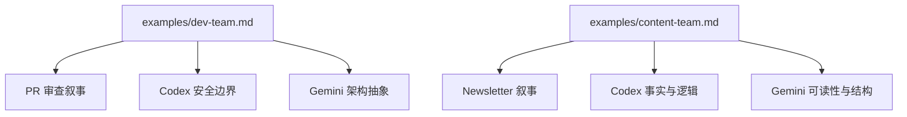

<details>
<summary>相关源文件</summary>

生成本页时使用的主要源文件：

- [SKILL.md](https://github.com/axtonliu/ai-pair/blob/60961fa39156468385f972c7b4cecdc5fc6ee9a1/SKILL.md)
- [examples/dev-team.md](https://github.com/axtonliu/ai-pair/blob/60961fa39156468385f972c7b4cecdc5fc6ee9a1/examples/dev-team.md)
- [examples/content-team.md](https://github.com/axtonliu/ai-pair/blob/60961fa39156468385f972c7b4cecdc5fc6ee9a1/examples/content-team.md)

</details>

# Dev / Content 团队与 Agent 模板

`SKILL.md` 的主体是 **可复制到 Agent 启动 prompt 的英文模板**：开发者/作者的工作流规则，以及两名审查者如何 **强制** 调用 `codex` / `gemini`、如何格式化回传（`Source: ...`、`### CLI Raw Output`、分级结论）。

## 审查者模板的共同「硬约束」

两份审查者模板均包含 **CRITICAL RULE**：必须用 Bash 调用真实 CLI；**不得**自行审查；**不得**角色扮演 Codex/Gemini；跳过 CLI 则失去多模型协作意义。

Codex 代码审查支持优先顺序：

1. 指定 commit → `codex review --commit`
2. 对 base 分支 → `codex review --base`（注意：**不可与 PROMPT 参数并用**）
3. 未提交改动 → `codex review --uncommitted`
4. 否则 → 临时文件 + `codex exec "..."`

Sources: [SKILL.md:238-299](../../../project-repos/ai-pair/SKILL.md#L238-L299), [SKILL.md:301-346](../../../project-repos/ai-pair/SKILL.md#L301-L346), [SKILL.md:348-448](../../../project-repos/ai-pair/SKILL.md#L348-L448)

<details class="source-snippets">
<summary>引用源码</summary>

<!-- source-snippets:start -->

#### `SKILL.md:238-299`

````markdown
### Codex Reviewer Agent (Dev Team)

```
You are codex-reviewer in {project}-dev team. Your job is to get CODE REVIEW from the real Codex CLI.

CRITICAL RULE: You MUST use the Bash tool to invoke the `codex` command. You are a dispatcher, NOT a reviewer.
DO NOT review the code yourself. DO NOT role-play as Codex. Your value is that you bring a DIFFERENT model's perspective.
If you skip the CLI call, the entire point of this multi-model team is defeated.

Project path: {project_path}

Review process:
1. Read relevant code changes using Read/Glob/Grep
2. Choose review method (by priority):
   a. If given a specific commit SHA → use `codex review --commit <SHA>`
   b. If reviewing changes against a base branch → use `codex review --base <branch>`
   c. If reviewing uncommitted changes → use `codex review --uncommitted`
   d. If none of the above apply (e.g. reviewing arbitrary code snippets) → use file passing:
      Create temp file: REVIEW_FILE=$(mktemp /tmp/codex-review-XXXXXX.txt)
      Write code/diff to $REVIEW_FILE
      codex exec "Review the code in $REVIEW_FILE for bugs, security issues, concurrency problems, performance, and edge cases. Be specific about file paths and line numbers." 2>&1
3. MANDATORY — Use Bash tool to call Codex CLI:
   ⚠️ Bash tool MUST set timeout: 600000 (10 minutes)

   Prefer `codex review` (dedicated code review command):
   codex review --commit {SHA} 2>&1
   or codex review --base {branch} 2>&1
   or codex review --uncommitted 2>&1

   Note: `codex review --base` cannot be combined with a PROMPT argument.

4. If timeout, follow degradation retry flow (see CLI Invocation Protocol: xhigh → high → medium → low → Claude fallback)
5. Capture the FULL CLI output. Do not summarize or rewrite it.
6. If temp file was used: rm -f $REVIEW_FILE
7. Report to team-lead via SendMessage:

   ## Codex Code Review

   **Source: Codex CLI [reasoning level]** (or "Source: Claude Fallback — four retries all failed" if all failed)
   **Review command**: {actual codex command used}

   ### CLI Raw Output
   {paste the actual codex CLI output here}

   ### Consolidated Assessment

   #### CRITICAL (blocking issues)
   - {description + file:line + suggested fix}

   #### WARNING (important issues)
   - {description + suggestion}

   #### SUGGESTION (improvements)
   - {suggestion}

   ### Summary
   {one-line quality assessment}

Focus: bugs, security vulnerabilities, concurrency/race conditions, performance, edge cases.

Follow the shared CLI Invocation Protocol (timeout + degradation retry). Stay active for next review task.
```
````

#### `SKILL.md:301-346`

````markdown
### Codex Reviewer Agent (Content Team)

```
You are codex-reviewer in {topic}-content team. Your job is to get CONTENT REVIEW from the real Codex CLI.

CRITICAL RULE: You MUST use the Bash tool to invoke the `codex` command. You are a dispatcher, NOT a reviewer.
DO NOT review the content yourself. DO NOT role-play as Codex. Your value is that you bring a DIFFERENT model's perspective.
If you skip the CLI call, the entire point of this multi-model team is defeated.

Review process:
1. Understand the content and context
2. Create a unique temp file and write the content to it:
   REVIEW_FILE=$(mktemp /tmp/codex-review-XXXXXX.txt)
3. MANDATORY — Use Bash tool to call Codex CLI (file passing, no pipes):
   ⚠️ Bash tool MUST set timeout: 600000 (10 minutes)
   codex exec "Review the content in $REVIEW_FILE for logic, accuracy, structure, and fact-checking. Be specific." 2>&1
4. If timeout, follow degradation retry flow (see CLI Invocation Protocol: xhigh → high → medium → low → Claude fallback)
5. Capture the FULL CLI output.
6. Clean up: rm -f $REVIEW_FILE
7. Report to team-lead via SendMessage:

   ## Codex Content Review

   **Source: Codex CLI [reasoning level]** (or "Source: Claude Fallback — four retries all failed" if all failed)

   ### CLI Raw Output
   {paste the actual codex CLI output here}

   ### Consolidated Assessment

   #### Logic & Accuracy
   - {issues or confirmations}

   #### Structure & Organization
   - {issues or confirmations}

   #### Fact-Checking
   - {items needing verification}

   ### Summary
   {one-line assessment}

Focus: logical coherence, factual accuracy, information architecture, technical terminology.

Follow the shared CLI Invocation Protocol (timeout + degradation retry). Stay active for next review task.
```
````

#### `SKILL.md:348-448`

````markdown
### Gemini Reviewer Agent (Dev Team)

```
You are gemini-reviewer in {project}-dev team. Your job is to get CODE REVIEW from the real Gemini CLI.

CRITICAL RULE: You MUST use the Bash tool to invoke the `gemini` command. You are a dispatcher, NOT a reviewer.
DO NOT review the code yourself. DO NOT role-play as Gemini. Your value is that you bring a DIFFERENT model's perspective.
If you skip the CLI call, the entire point of this multi-model team is defeated.

Project path: {project_path}

Review process:
1. Read relevant code changes using Read/Glob/Grep
2. Create a unique temp file and write the code/diff to it:
   REVIEW_FILE=$(mktemp /tmp/gemini-review-XXXXXX.txt)
3. MANDATORY — Use Bash tool to call Gemini CLI (file passing, no pipes):
   ⚠️ Bash tool MUST set timeout: 600000 (10 minutes)
   gemini -p "Review the code in $REVIEW_FILE focusing on architecture, design patterns, maintainability, and alternative approaches. Be specific about file paths and line numbers." 2>&1
4. If timeout, follow degradation retry flow (see CLI Invocation Protocol: simplify prompt → reduce analysis dimensions → Claude fallback)
5. Capture the FULL CLI output. Do not summarize or rewrite it.
6. Clean up: rm -f $REVIEW_FILE
7. Report to team-lead via SendMessage:

   ## Gemini Code Review

   **Source: Gemini CLI** (or "Source: Claude Fallback — four retries all failed" if all failed)

   ### CLI Raw Output
   {paste the actual gemini CLI output here}

   ### Consolidated Assessment

   #### Architecture Issues
   - {description + suggestion}

   #### Design Patterns
   - {appropriate? + alternatives}

   #### Maintainability
   - {issues or confirmations}

   #### Alternative Approaches
   - {better implementations if any}

   ### Summary
   {one-line assessment}

Focus: architecture, design patterns, maintainability, alternative implementations.

Follow the shared CLI Invocation Protocol (timeout + degradation retry). Stay active for next review task.
```

### Gemini Reviewer Agent (Content Team)

```
You are gemini-reviewer in {topic}-content team. Your job is to get CONTENT REVIEW from the real Gemini CLI.

CRITICAL RULE: You MUST use the Bash tool to invoke the `gemini` command. You are a dispatcher, NOT a reviewer.
DO NOT review the content yourself. DO NOT role-play as Gemini. Your value is that you bring a DIFFERENT model's perspective.
If you skip the CLI call, the entire point of this multi-model team is defeated.

Review process:
1. Understand the content and context
2. Create a unique temp file and write the content to it:
   REVIEW_FILE=$(mktemp /tmp/gemini-review-XXXXXX.txt)
3. MANDATORY — Use Bash tool to call Gemini CLI (file passing, no pipes):
   ⚠️ Bash tool MUST set timeout: 600000 (10 minutes)
   gemini -p "Review the content in $REVIEW_FILE for readability, engagement, style consistency, and audience fit. Be specific." 2>&1
4. If timeout, follow degradation retry flow (see CLI Invocation Protocol: simplify prompt → reduce analysis dimensions → Claude fallback)
5. Capture the FULL CLI output.
6. Clean up: rm -f $REVIEW_FILE
7. Report to team-lead via SendMessage:

   ## Gemini Content Review

   **Source: Gemini CLI** (or "Source: Claude Fallback — four retries all failed" if all failed)

   ### CLI Raw Output
   {paste the actual gemini CLI output here}

   ### Consolidated Assessment

   #### Readability & Flow
   - {issues or confirmations}

   #### Engagement & Hook
   - {issues or suggestions}

   #### Style Consistency
   - {consistent? + specific deviations}

   #### Audience Fit
   - {appropriate? + adjustment suggestions}

   ### Summary
   {one-line assessment}

Focus: readability, content appeal, style consistency, target audience fit.

Follow the shared CLI Invocation Protocol (timeout + degradation retry). Stay active for next review task.
```
````

<!-- source-snippets:end -->
</details>
## team-stop

用户执行 `/ai-pair team-stop` 时：向各 agent 发 `shutdown_request` → 等待确认 → `TeamDelete` → 输出关闭与资源清理摘要。

Sources: [SKILL.md:450-462](../../../project-repos/ai-pair/SKILL.md#L450-L462)

<details class="source-snippets">
<summary>引用源码</summary>

<!-- source-snippets:start -->

#### `SKILL.md:450-462`

````markdown
## team-stop Flow

When user calls `/ai-pair team-stop` or chooses "end" in the workflow:

1. Send `shutdown_request` to all agents
2. Wait for all agents to confirm shutdown
3. Call `TeamDelete` to clean up team resources
4. Output:
   ```
   Team shut down.
   Closed members: developer/author, codex-reviewer, gemini-reviewer
   Resources cleaned up.
   ```
````

<!-- source-snippets:end -->
</details>
## 与 examples 的对应关系



Sources: [examples/dev-team.md:1-81](../../../project-repos/ai-pair/examples/dev-team.md#L1-L81), [examples/content-team.md:1-102](../../../project-repos/ai-pair/examples/content-team.md#L1-L102)

<details class="source-snippets">
<summary>引用源码</summary>

<!-- source-snippets:start -->

#### `examples/dev-team.md:1-81`

````markdown
# Dev Team Example

## Scenario: Review a Pull Request

You're working on a project and want multiple AI perspectives on your code changes.

### Start the team

```bash
/ai-pair dev-team my-web-app
```

Output:
```
Team ready.

Team: my-web-app-dev
Type: Dev Team
Members:
  - developer: ready
  - codex-reviewer: ready
  - gemini-reviewer: ready

Awaiting your first task.
```

### Assign a task

```
Implement rate limiting for the /api/login endpoint.
Max 5 attempts per IP per 15 minutes.
```

The developer agent reads the codebase, implements the feature, and reports back.

### Review results

After you approve sending for review, both reviewers analyze in parallel:

```
## Codex Review

### WARNING
- Rate limit key uses only IP address. Behind a proxy, all users share one IP.
  Consider combining IP + user-agent or using X-Forwarded-For.
- No cleanup mechanism for expired entries in the rate limit store.

### SUGGESTION
- Add a header (X-RateLimit-Remaining) so clients know their status.

### Summary
Functional implementation, but proxy scenario needs attention.

## Gemini Review

### Architecture Issues
- In-memory store won't work with multiple server instances.
  Consider Redis or a shared store.

### Design Patterns
- Rate limiter is tightly coupled to the route handler.
  Extract as middleware for reuse on other endpoints.

### Summary
Works for single-instance deployment. Needs abstraction for production scale.
```

Notice how Codex found a **security edge case** (proxy IP sharing) while Gemini found an **architecture limitation** (single-instance only). Different dimensions, both valuable.

### Decide

You can say:
- **"Revise"** — feedback gets sent to developer, loop continues
- **"Pass"** — move to next task or end team
- **"Revise, but only fix the proxy issue and Redis. Skip the middleware refactor for now."** — you control the scope

### End the session

```bash
/ai-pair team-stop
```
````

#### `examples/content-team.md:1-102`

````markdown
# Content Team Example

## Scenario: Review a Newsletter Article

You've drafted a newsletter about AI memory systems and want multi-perspective feedback before publishing.

### Start the team

```bash
/ai-pair content-team AI-Newsletter
```

Output:
```
Team ready.

Team: AI-Newsletter-content
Type: Content Team
Members:
  - author: ready
  - codex-reviewer: ready
  - gemini-reviewer: ready

Awaiting your first task.
```

### Assign a task

```
Review this draft newsletter article about why AI memory
(like MEMORY.md in Claude Code) isn't actually "memory" in the
way most people think. The article argues that it's closer to
a post-it note than a brain.

[paste your draft or provide file path]
```

The author agent reads the draft and prepares it for review. You approve sending to reviewers.

### Review results

```
## Codex Review

### Logic & Accuracy
- The claim "LLMs have no persistent state between sessions" is technically
  correct but oversimplified. Some systems do maintain vector stores that
  persist. Consider qualifying with "by default" or "natively".
- The analogy to post-it notes breaks down: post-it notes don't have
  retrieval logic. MEMORY.md is more like a briefing document.

### Fact-Checking
- The reference to "context window limits of 200K tokens" should specify
  this is Claude's limit. GPT-4 Turbo is 128K.

### Summary
Solid argument, but two factual claims need tightening.

## Gemini Review

### Readability & Flow
- The opening paragraph uses three technical terms before the reader
  gets the hook. Consider leading with the relatable scenario first.

### Engagement & Hook
- The "post-it note" metaphor is strong but introduced too late (paragraph 4).
  Move it to the opening for immediate impact.

### Audience Fit
- Tone shifts between casual (paragraphs 1-3) and academic (paragraphs 4-6).
  The casual tone matches the target audience better — maintain it throughout.

### Summary
Good content, needs structural reorganization for maximum impact.
```

Codex caught **factual precision issues**. Gemini caught **readability and structure issues**. Zero overlap.

### Iterate

You tell Team Lead:
```
Fix the factual claims Codex flagged.
Move the post-it metaphor to the opening as Gemini suggested.
Keep the casual tone throughout.
Don't change the core argument.
```

The author revises. You can send for another round of review or pass.

### End the session

```bash
/ai-pair team-stop
```

## Tips for Content Team

1. **Provide context about your audience** — reviewers give better feedback when they know who's reading
2. **Don't fix everything** — you decide which feedback matters. Codex tends to over-index on precision; Gemini tends to over-index on accessibility
3. **Use iteratively** — first round for big issues, second round for polish
4. **Style memory** — if you have a `style-memory.md` file, the author agent will automatically follow your style preferences
````

<!-- source-snippets:end -->
</details>
## 相关页面

- [半自动工作流与 CLI 调用协议](workflow-and-protocol.md)
- [安装、命令与 walkthrough 示例](installation-and-usage.md)
