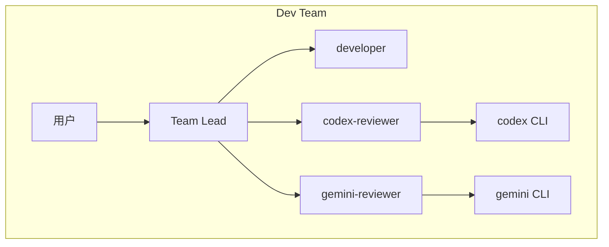
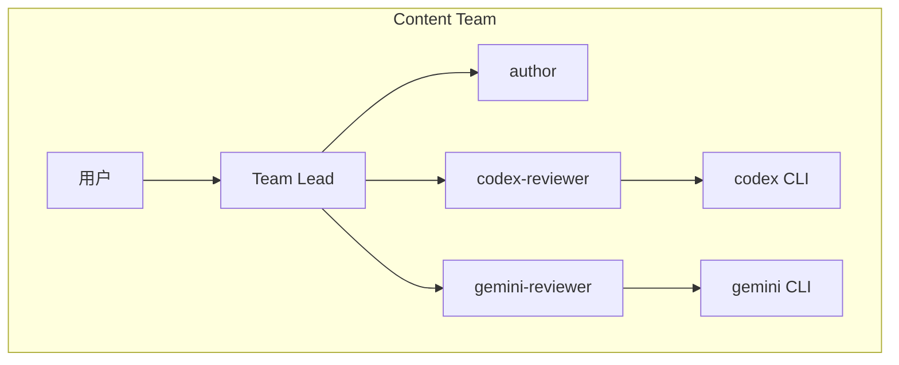

<details>
<summary>相关源文件</summary>

生成本页时使用的主要源文件：

- [README.md](https://github.com/axtonliu/ai-pair/blob/60961fa39156468385f972c7b4cecdc5fc6ee9a1/README.md)
- [SKILL.md](https://github.com/axtonliu/ai-pair/blob/60961fa39156468385f972c7b4cecdc5fc6ee9a1/SKILL.md)

</details>

# 架构与角色分工

运行时拓扑由 README 的示意图与 `SKILL.md` 的「Team Architecture」共同定义：**用户** 向 **Team Lead（当前 Claude Code 会话）** 下达任务；Team Lead 管理 **创作者**（`developer` 或 `author`）与两名 **审查者**（`codex-reviewer`、`gemini-reviewer`）。审查者被规定为 **真实 CLI 的调度器**，而非在会话内「扮演」外部模型。

## Dev Team 与 Content Team





| 角色 | Dev 团队侧重 | Content 团队侧重 |
|------|----------------|------------------|
| 创作者 | 代码、功能、修复、重构 | 文章、脚本、Newsletter |
| Codex 审查 | bug、安全、并发、性能、边界 | 逻辑、准确性、结构、事实核查 |
| Gemini 审查 | 架构、设计模式、可维护性、替代方案 | 可读性、吸引力、风格、受众适配 |

Sources: [README.md:94-114](../../../project-repos/ai-pair/README.md#L94-L114), [SKILL.md:44-70](../../../project-repos/ai-pair/SKILL.md#L44-L70)

<details class="source-snippets">
<summary>引用源码</summary>

<!-- source-snippets:start -->

#### `README.md:94-114`

````markdown
### Dev Team — for code, bugs, refactoring | 开发团队 — 写代码、修 bug、重构

```bash
/ai-pair dev-team MyProject
```

Team Lead creates | 团队领导创建:
- **developer** — writes code | 写代码
- **codex-reviewer** — checks bugs, security, performance, edge cases | 审查 bug、安全、性能、边界条件
- **gemini-reviewer** — checks architecture, design patterns, maintainability | 审查架构、设计模式、可维护性

### Content Team — for articles, scripts, newsletters | 内容团队 — 写文章、脚本、Newsletter

```bash
/ai-pair content-team AI-Newsletter
```

Team Lead creates | 团队领导创建:
- **author** — writes content | 写内容
- **codex-reviewer** — checks logic, accuracy, structure, fact-checking | 审查逻辑、准确性、结构、事实核查
- **gemini-reviewer** — checks readability, engagement, style, audience fit | 审查可读性、吸引力、风格、受众适配
````

#### `SKILL.md:44-70`

````markdown
## Team Architecture

### Dev Team (`/ai-pair dev-team [project]`)

```
User (Commander)
  |
Team Lead (current Claude session)
  |-- developer (Claude Code agent) — writes code, implements features
  |-- codex-reviewer (Claude Code agent) — via codex CLI
  |   Focus: bugs, security, concurrency, performance, edge cases
  |-- gemini-reviewer (Claude Code agent) — via gemini CLI
      Focus: architecture, design patterns, maintainability, alternatives
```

### Content Team (`/ai-pair content-team [topic]`)

```
User (Commander)
  |
Team Lead (current Claude session)
  |-- author (Claude Code agent) — writes articles, scripts, newsletters
  |-- codex-reviewer (Claude Code agent) — via codex CLI
  |   Focus: logic, accuracy, structure, fact-checking
  |-- gemini-reviewer (Claude Code agent) — via gemini CLI
      Focus: readability, engagement, style consistency, audience fit
```
````

<!-- source-snippets:end -->
</details>
## Agent 运行时假设

`SKILL.md` 要求用 Agent 工具启动子代理时：`subagent_type: "general-purpose"` 且 `mode: "bypassPermissions"`，理由是审查者需要执行外部 CLI 并读取项目文件。

Sources: [SKILL.md:125-129](../../../project-repos/ai-pair/SKILL.md#L125-L129)

<details class="source-snippets">
<summary>引用源码</summary>

<!-- source-snippets:start -->

#### `SKILL.md:125-129`

```markdown
### Step 4: Launch Agents

Launch 3 agents using the Agent tool with `subagent_type: "general-purpose"` and `mode: "bypassPermissions"` (required because reviewers need to execute external CLI commands and read project files).

See Agent Prompt Templates below for each agent's startup prompt.
```

<!-- source-snippets:end -->
</details>
## 相关页面

- [项目概览](overview.md)
- [半自动工作流与 CLI 调用协议](workflow-and-protocol.md)
