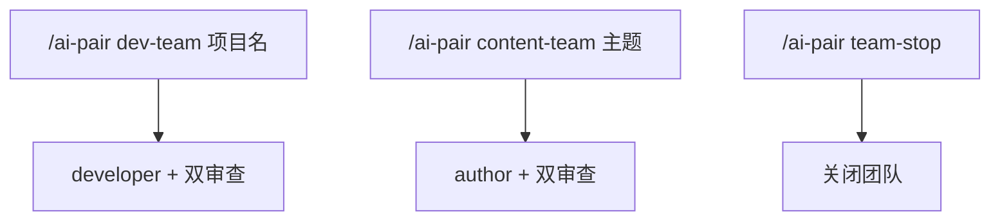

<details>
<summary>相关源文件</summary>

生成本页时使用的主要源文件：

- [README.md](https://github.com/axtonliu/ai-pair/blob/60961fa39156468385f972c7b4cecdc5fc6ee9a1/README.md)
- [SKILL.md](https://github.com/axtonliu/ai-pair/blob/60961fa39156468385f972c7b4cecdc5fc6ee9a1/SKILL.md)
- [examples/dev-team.md](https://github.com/axtonliu/ai-pair/blob/60961fa39156468385f972c7b4cecdc5fc6ee9a1/examples/dev-team.md)
- [examples/content-team.md](https://github.com/axtonliu/ai-pair/blob/60961fa39156468385f972c7b4cecdc5fc6ee9a1/examples/content-team.md)

</details>

# 安装、命令与 walkthrough 示例

## 前置：三个 CLI

| 工具 | 作用 | README 给出的安装命令 |
|------|------|------------------------|
| Claude Code | Team Lead + agent 运行时 | `npm install -g @anthropic-ai/claude-code` |
| Codex CLI | GPT 审查 | `npm install -g @openai/codex` |
| Gemini CLI | Gemini 审查 | `npm install -g @google/gemini-cli` |

三者均需完成认证；可用 `claude --version`、`codex --version`、`gemini --version` 自检。

Sources: [README.md:54-70](../../../project-repos/ai-pair/README.md#L54-L70)

<details class="source-snippets">
<summary>引用源码</summary>

<!-- source-snippets:start -->

#### `README.md:54-70`

```markdown
## Prerequisites | 前置条件

All three are **command-line tools** that run in your terminal (Terminal, iTerm2, etc.), not desktop apps.

三个都是**命令行工具**，在终端中运行（Terminal、iTerm2 等），不是桌面应用。

| Tool | Purpose | Install |
|------|---------|---------|
| [Claude Code](https://docs.anthropic.com/en/docs/agents-and-tools/claude-code/overview) | Team Lead + agent runtime | `npm install -g @anthropic-ai/claude-code` |
| [Codex CLI](https://github.com/openai/codex) | GPT-powered reviewer | `npm install -g @openai/codex` |
| [Gemini CLI](https://github.com/google-gemini/gemini-cli) | Gemini-powered reviewer | `npm install -g @google/gemini-cli` |

All three CLIs must have authentication configured before use.

三个 CLI 使用前都需要配置好认证。

> **Quick check | 快速检查:** Run `claude --version`, `codex --version`, and `gemini --version` to verify all three are installed.
```

<!-- source-snippets:end -->
</details>
## 安装 Skill

**推荐**：克隆到全局目录：

```bash
git clone https://github.com/axtonliu/ai-pair.git ~/.claude/skills/ai-pair
```

项目级则使用项目下 `.claude/skills/ai-pair`。手动安装：下载 `SKILL.md` 放到上述路径并重启 Claude Code。

Sources: [README.md:72-90](../../../project-repos/ai-pair/README.md#L72-L90)

<details class="source-snippets">
<summary>引用源码</summary>

<!-- source-snippets:start -->

#### `README.md:72-90`

````markdown
## Installation | 安装

### Option A: Direct Install (Recommended) | 直接安装（推荐）

```bash
# Clone to your global Claude Code skills directory
# 克隆到 Claude Code 全局 skills 目录
git clone https://github.com/axtonliu/ai-pair.git ~/.claude/skills/ai-pair
```

For project-level installation, clone into `.claude/skills/ai-pair` within your project directory instead.

如需项目级安装，克隆到项目目录下的 `.claude/skills/ai-pair`。

### Option B: Manual | 手动安装

1. Download `SKILL.md` from this repo | 下载本仓库的 `SKILL.md`
2. Place it in `~/.claude/skills/ai-pair/SKILL.md` | 放到 `~/.claude/skills/ai-pair/SKILL.md`
3. Restart Claude Code | 重启 Claude Code
````

<!-- source-snippets:end -->
</details>
## 命令一览



Sources: [SKILL.md:22-35](../../../project-repos/ai-pair/SKILL.md#L22-L35), [README.md:94-120](../../../project-repos/ai-pair/README.md#L94-L120)

<details class="source-snippets">
<summary>引用源码</summary>

<!-- source-snippets:start -->

#### `SKILL.md:22-35`

````markdown
## Commands

```bash
/ai-pair dev-team [project]       # Start dev team (developer + codex-reviewer + gemini-reviewer)
/ai-pair content-team [topic]     # Start content team (author + codex-reviewer + gemini-reviewer)
/ai-pair team-stop                # Shut down the team, clean up resources
```

Examples:
```bash
/ai-pair dev-team HighlightCut        # Dev team for HighlightCut project
/ai-pair content-team AI-Newsletter   # Content team for writing AI newsletter
/ai-pair team-stop                     # Shut down team
```
````

#### `README.md:94-120`

````markdown
### Dev Team — for code, bugs, refactoring | 开发团队 — 写代码、修 bug、重构

```bash
/ai-pair dev-team MyProject
```

Team Lead creates | 团队领导创建:
- **developer** — writes code | 写代码
- **codex-reviewer** — checks bugs, security, performance, edge cases | 审查 bug、安全、性能、边界条件
- **gemini-reviewer** — checks architecture, design patterns, maintainability | 审查架构、设计模式、可维护性

### Content Team — for articles, scripts, newsletters | 内容团队 — 写文章、脚本、Newsletter

```bash
/ai-pair content-team AI-Newsletter
```

Team Lead creates | 团队领导创建:
- **author** — writes content | 写内容
- **codex-reviewer** — checks logic, accuracy, structure, fact-checking | 审查逻辑、准确性、结构、事实核查
- **gemini-reviewer** — checks readability, engagement, style, audience fit | 审查可读性、吸引力、风格、受众适配

### Stop Team | 关闭团队

```bash
/ai-pair team-stop
```
````

<!-- source-snippets:end -->
</details>
## examples 阅读顺序

| 文件 | 场景 |
|------|------|
| `examples/dev-team.md` | 登录限流 PR：Codex 抓代理/IP 风险，Gemini 抓多实例架构 |
| `examples/content-team.md` | Newsletter：Codex 抓事实与论证，Gemini 抓结构与受众；含 `style-memory.md` 提示 |

Sources: [README.md:132-134](../../../project-repos/ai-pair/README.md#L132-L134), [examples/content-team.md:97-102](../../../project-repos/ai-pair/examples/content-team.md#L97-L102)

<details class="source-snippets">
<summary>引用源码</summary>

<!-- source-snippets:start -->

#### `README.md:132-134`

```markdown
None of these overlapped. That's the point. See [`examples/`](examples/) for step-by-step walkthrough scenarios.

三者零重叠。这就是意义所在。查看 [`examples/`](examples/) 获取分步演示场景。
```

#### `examples/content-team.md:97-102`

```markdown
## Tips for Content Team

1. **Provide context about your audience** — reviewers give better feedback when they know who's reading
2. **Don't fix everything** — you decide which feedback matters. Codex tends to over-index on precision; Gemini tends to over-index on accessibility
3. **Use iteratively** — first round for big issues, second round for polish
4. **Style memory** — if you have a `style-memory.md` file, the author agent will automatically follow your style preferences
```

<!-- source-snippets:end -->
</details>
## 相关页面

- [项目概览](overview.md)
- [排障、验证与开源边界](troubleshooting-and-boundaries.md)
