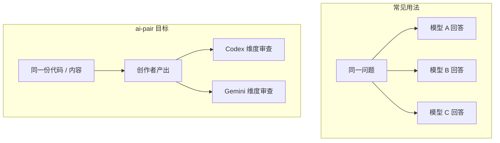

相关源文件

生成本页时使用的主要源文件：

- [README.md](https://github.com/axtonliu/ai-pair/blob/60961fa39156468385f972c7b4cecdc5fc6ee9a1/README.md)
- [SKILL.md](https://github.com/axtonliu/ai-pair/blob/60961fa39156468385f972c7b4cecdc5fc6ee9a1/SKILL.md)
- [LICENSE](https://github.com/axtonliu/ai-pair/blob/60961fa39156468385f972c7b4cecdc5fc6ee9a1/LICENSE)


# 项目概览

**ai-pair** 是一个面向 [Claude Code](https://docs.anthropic.com/en/docs/agents-and-tools/claude-code/skills) 的 Skill：把 **Claude Code（Team Lead + 创作者 agent）** 与 **Codex CLI**、**Gemini CLI** 串成「一创双审」的半自动工作流。仓库本体是文档与示例，没有可执行应用代码；权威行为定义在 `SKILL.md` 的指令与 Agent 模板中。

作者明确将其标为 **Experimental（实验性）**：可用于真实流程，但不保证覆盖全部边界情况；维护重心是展示工具链如何协作，而非持续演进大型代码库。

## 解决什么问题

常见多订阅用法是「同一问题问多个模型再比答案」。README 指出这只用到了「多答案」这一维度，而不是「同一份工件的多视角」。




Sources: [README.md:24-32](../../../project-repos/ai-pair/README.md#L24-L32)

<details class="source-snippets">
<summary>引用源码</summary>

<!-- source-snippets:start -->

#### `README.md:24-32`

```markdown
## Why This Exists | 为什么做这个

Most people use multiple AI subscriptions by asking the same question to each and comparing answers. That's useful sometimes, but it only uses one dimension of what different models can do — you get multiple answers to the same question, instead of multiple perspectives on the same work.

大部分人用多个 AI 的方式是：同一个问题分别问一遍，然后对比答案。这有时候有用，但只用到了不同模型能力的一个维度 — 你得到的是同一个问题的多个回答，而不是同一份工作的多个视角。

AI-Pair turns model differences into a structured workflow: assign each model a role that matches its strength, and let them review the same work from different angles. It's a [Claude Code Skill](https://docs.anthropic.com/en/docs/agents-and-tools/claude-code/skills) — a reusable instruction set that extends Claude Code's capabilities.

AI-Pair 把模型差异变成结构化的工作流：给每个模型分配匹配其特长的角色，让它们从不同角度审查同一份工作。它是一个 [Claude Code Skill](https://docs.anthropic.com/en/docs/agents-and-tools/claude-code/skills) — 一组可复用的指令，扩展 Claude Code 的能力。
```

<!-- source-snippets:end -->
</details>

## 产物形态与版本


| 项目                 | 说明                                              |
| ------------------ | ----------------------------------------------- |
| `SKILL.md`         | Skill 定义：命令、工作流、CLI 协议、各 agent 启动模板             |
| `README.md`        | 双语说明、安装、用法、排障、演进与作者信息                           |
| `examples/*.md`    | Dev / Content 分步场景                              |
| `metadata.version` | 当前 Skill 版本 **1.5.0**（见 `SKILL.md` frontmatter） |


Sources: [SKILL.md:1-11](../../../project-repos/ai-pair/SKILL.md#L1-L11), [README.md:136-146](../../../project-repos/ai-pair/README.md#L136-L146)

<details class="source-snippets">
<summary>引用源码</summary>

<!-- source-snippets:start -->

#### `SKILL.md:1-11`

```markdown
---
name: ai-pair
description: |
  AI Pair Collaboration Skill. Coordinate multiple AI models to work together:
  one creates (Author/Developer), two others review (Codex + Gemini).
  Works for code, articles, video scripts, and any creative task.

  Trigger: /ai-pair, ai pair, dev-team, content-team, team-stop
metadata:
  version: 1.5.0
---
```

#### `README.md:136-146`

````markdown
## File Structure | 文件结构

```
ai-pair/
├── SKILL.md       # Claude Code skill definition | Skill 定义文件
├── README.md      # This file | 本文件
├── LICENSE         # MIT
└── examples/      # Usage examples | 使用示例
    ├── dev-team.md
    └── content-team.md
```
````

<!-- source-snippets:end -->
</details>

## 许可证

MIT License，Copyright 2026 Axton Liu。

Sources: [LICENSE:1-22](../../../project-repos/ai-pair/LICENSE#L1-L22)

<details class="source-snippets">
<summary>引用源码</summary>

<!-- source-snippets:start -->

#### `LICENSE:1-22`

```
MIT License

Copyright (c) 2026 Axton Liu

Permission is hereby granted, free of charge, to any person obtaining a copy
of this software and associated documentation files (the "Software"), to deal
in the Software without restriction, including without limitation the rights
to use, copy, modify, merge, publish, distribute, sublicense, and/or sell
copies of the Software, and to permit persons to whom the Software is
furnished to do so, subject to the following conditions:

The above copyright notice and this permission notice shall be included in all
copies or substantial portions of the Software.

THE SOFTWARE IS PROVIDED "AS IS", WITHOUT WARRANTY OF ANY KIND, EXPRESS OR
IMPLIED, INCLUDING BUT NOT LIMITED TO THE WARRANTIES OF MERCHANTABILITY,
FITNESS FOR A PARTICULAR PURPOSE AND NONINFRINGEMENT. IN NO EVENT SHALL THE
AUTHORS OR COPYRIGHT HOLDERS BE LIABLE FOR ANY CLAIM, DAMAGES OR OTHER
LIABILITY, WHETHER IN AN ACTION OF CONTRACT, TORT OR OTHERWISE, ARISING FROM,
OUT OF OR IN CONNECTION WITH THE SOFTWARE OR THE USE OR OTHER DEALINGS IN THE
SOFTWARE.
```

<!-- source-snippets:end -->
</details>

## 相关页面

- [架构与角色分工](architecture-and-roles.md)
- [安装、命令与 walkthrough 示例](installation-and-usage.md)

