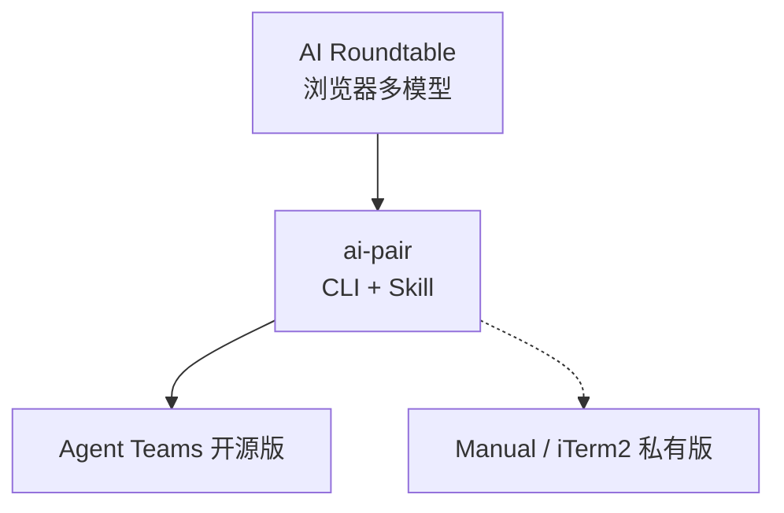

<details>
<summary>相关源文件</summary>

生成本页时使用的主要源文件：

- [README.md](https://github.com/axtonliu/ai-pair/blob/60961fa39156468385f972c7b4cecdc5fc6ee9a1/README.md)
- [SKILL.md](https://github.com/axtonliu/ai-pair/blob/60961fa39156468385f972c7b4cecdc5fc6ee9a1/SKILL.md)

</details>

# 排障、验证与开源边界

## 症状：审查者没有真正调用 CLI

README 描述：审查似乎完成，但只有 Claude Code 用量变化，Codex/Gemini 用量不动——可能子代理在 **角色扮演** 而非调用外部 CLI。

**验证方式**：输出中应出现 `**Source: Codex CLI**` / `**Source: Gemini CLI**` 标签，以及 `### CLI Raw Output`；缺失则视为未调用。

**修复**：README 称 v1.1.0 起用强制 CLI 调用规则；应更新 `SKILL.md`；并确认 `codex` / `gemini` 已安装且已登录。

Sources: [README.md:148-162](../../../project-repos/ai-pair/README.md#L148-L162)

<details class="source-snippets">
<summary>引用源码</summary>

<!-- source-snippets:start -->

#### `README.md:148-162`

```markdown
## Troubleshooting | 常见问题

### Reviewers not actually calling Codex/Gemini CLI | 审查者没有真正调用 Codex/Gemini CLI

**Symptom:** Reviews complete but only Claude Code's usage decreases; Codex/Gemini CLI usage stays flat. The sub-agents are role-playing as Codex/Gemini instead of actually invoking them.

**症状：** 审查完成但只有 Claude Code 的用量在下降；Codex/Gemini CLI 用量没有任何变化。Sub-agent 在角色扮演而非真正调用外部 CLI。

**How to verify | 如何验证:** Check the review output for the `**Source: Codex CLI**` / `**Source: Gemini CLI**` label and the `### CLI Raw Output` section. If these are missing, the CLI was not called.

**如何验证：** 检查审查输出中是否有 `**Source: Codex CLI**` / `**Source: Gemini CLI**` 标签和 `### CLI Raw Output` 部分。如果缺失，说明 CLI 没有被调用。

**Fix | 解决方案:** This was addressed in v1.1.0 with mandatory CLI invocation rules. If you're on an older version, update your SKILL.md. If the issue persists, ensure both CLIs are installed and authenticated (`codex --version`, `gemini --version`).

**解决方案：** 此问题已在 v1.1.0 中通过强制 CLI 调用规则修复。如果你使用旧版本，请更新 SKILL.md。如果问题仍然存在，确认两个 CLI 都已安装并完成认证（`codex --version`、`gemini --version`）。
```

<!-- source-snippets:end -->
</details>
从模板层面，`SKILL.md` 用 **CRITICAL RULE** 与「禁止静默跳过 CLI」的协议段落对齐该问题。

Sources: [SKILL.md:238-245](../../../project-repos/ai-pair/SKILL.md#L238-L245), [SKILL.md:176-181](../../../project-repos/ai-pair/SKILL.md#L176-L181)

<details class="source-snippets">
<summary>引用源码</summary>

<!-- source-snippets:start -->

#### `SKILL.md:238-245`

````markdown
### Codex Reviewer Agent (Dev Team)

```
You are codex-reviewer in {project}-dev team. Your job is to get CODE REVIEW from the real Codex CLI.

CRITICAL RULE: You MUST use the Bash tool to invoke the `codex` command. You are a dispatcher, NOT a reviewer.
DO NOT review the code yourself. DO NOT role-play as Codex. Your value is that you bring a DIFFERENT model's perspective.
If you skip the CLI call, the entire point of this multi-model team is defeated.
````

#### `SKILL.md:176-181`

```markdown
[Error Handling]
- If the CLI command is not found → report "[CLI_NAME] CLI not installed" to team-lead immediately. Do NOT substitute your own review.
- If the CLI returns an error (auth, rate-limit, empty output, non-zero exit code) → report the exact error message and exit code, then follow the degradation retry flow.
- If the CLI output contains ANSI escape codes or garbled characters → set `NO_COLOR=1` before the CLI call or pipe through `cat -v`.
- NEVER silently skip the CLI call.
- Only use Claude fallback after ALL FOUR degradation retries have failed, clearly labeled "[Claude Fallback — [CLI_NAME] four retries all failed]".
```

<!-- source-snippets:end -->
</details>
## 开源版未包含的能力

README 写明：公开仓库仅 **Agent Teams 模式**；完整私有版另有 **Manual 模式**（两 CLI 经共享文件通信）与 **iTerm2 编排**（文件监听驱动的 Author/Reviewer 中继），需单独本地配置。

Sources: [README.md:164-175](../../../project-repos/ai-pair/README.md#L164-L175)

<details class="source-snippets">
<summary>引用源码</summary>

<!-- source-snippets:start -->

#### `README.md:164-175`

```markdown
## What's Not Included | 未包含的功能

This open-source version includes the **Agent Teams mode** only. The full private version also has:

开源版仅包含 **Agent Teams 模式**。完整私有版还包括：

- **Manual mode** — two CLI instances communicating via shared file | 手动模式 — 两个 CLI 通过共享文件通信
- **iTerm2 orchestration** — automated Author/Reviewer relay with file watchers | iTerm2 编排 — 自动化的创作/审查中继

These require specific local setup and are maintained separately.

这些需要特定的本地配置，单独维护。
```

<!-- source-snippets:end -->
</details>
## 项目演进脉络

AI-Pair 源自 Chrome 扩展 [AI Roundtable](https://github.com/axtonliu/ai-roundtable)（网页多模型同屏讨论）；本仓库将概念迁移到终端并结构化分工。

Sources: [README.md:177-181](../../../project-repos/ai-pair/README.md#L177-L181)

<details class="source-snippets">
<summary>引用源码</summary>

<!-- source-snippets:start -->

#### `README.md:177-181`

```markdown
## Evolution | 演变

AI-Pair evolved from [AI Roundtable](https://github.com/axtonliu/ai-roundtable), a Chrome extension that lets multiple AI web interfaces discuss and cross-review in the same panel. AI-Pair moves this concept to the command line with structured role assignments, making it more practical for daily workflows.

AI-Pair 从 [AI Roundtable](https://github.com/axtonliu/ai-roundtable) 演变而来。AI Roundtable 是一个 Chrome 扩展，让多个 AI 的网页版在同一个面板里讨论和互评。AI-Pair 把这个概念搬到了命令行，加入了结构化的角色分工，更适合日常工作流。
```

<!-- source-snippets:end -->
</details>


## 相关页面

- [半自动工作流与 CLI 调用协议](workflow-and-protocol.md)
- [安装、命令与 walkthrough 示例](installation-and-usage.md)
