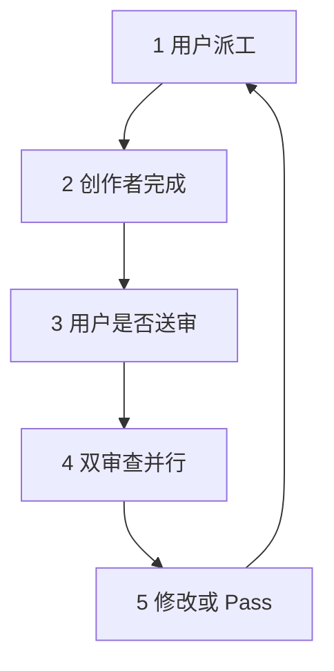

<details>
<summary>相关源文件</summary>

生成本页时使用的主要源文件：

- [SKILL.md](https://github.com/axtonliu/ai-pair/blob/60961fa39156468385f972c7b4cecdc5fc6ee9a1/SKILL.md)
- [README.md](https://github.com/axtonliu/ai-pair/blob/60961fa39156468385f972c7b4cecdc5fc6ee9a1/README.md)

</details>

# 半自动工作流与 CLI 调用协议

工作流被明确为 **半自动**：用户在每一步保留控制权，不存在「无人值守的自主循环」。`SKILL.md` 将 Team Lead 的协调环写为 5 步（派工 → 展示结果 → 用户批准送审 → 双审查并行 → 用户决定修改或通过）。



Sources: [SKILL.md:72-89](../../../project-repos/ai-pair/SKILL.md#L72-L89), [README.md:45-52](../../../project-repos/ai-pair/README.md#L45-L52)

<details class="source-snippets">
<summary>引用源码</summary>

<!-- source-snippets:start -->

#### `SKILL.md:72-89`

````markdown
## Workflow (Semi-Automatic)

Team Lead coordinates the following loop:

1. **User assigns task** → Team Lead sends to developer/author
2. **Developer/author completes** → Team Lead shows result to user
3. **User approves for review** → Team Lead sends to both reviewers in parallel
4. **Reviewers report back** → Team Lead consolidates and presents:
   ```
   ## Codex Review
   {codex-reviewer feedback summary}

   ## Gemini Review
   {gemini-reviewer feedback summary}
   ```
5. **User decides** → "Revise" (loop back to step 1) or "Pass" (next task or end)

The user stays in control at every step. No autonomous loops.
````

#### `README.md:45-52`

```markdown
The workflow is semi-automatic — you stay in control at every step:

工作流是半自动的 — 每一步你都保持控制权：

1. You assign a task → creator executes | 你下达任务 → 创作者执行
2. Creator reports back → you decide whether to send for review | 创作者回报 → 你决定是否送审
3. Both reviewers analyze in parallel → consolidated report | 两个审查者并行分析 → 汇总报告
4. You decide: revise or pass → loop or next task | 你决定：修改还是通过 → 循环或下一个任务
```

<!-- source-snippets:end -->
</details>
## Team Lead 执行步骤（摘要）

| 步骤 | 内容 |
|------|------|
| Create Team | `TeamCreate`，团队名 `{project}-dev` 或 `{topic}-content` |
| Create Tasks | `TaskCreate`：创作者待派工、两审查者 `blockedBy` 创作者任务 |
| Pre-flight | `command -v codex`、`codex --version`；`gemini` 同理 |
| Launch Agents | 三个 agent，附各自启动模板 |
| Confirm | 向用户输出成员就绪与队名 |

缺失 CLI 时：警告并询问 **降级（仅 Claude 审查且需标注）** 或 **中止**。

Sources: [SKILL.md:99-124](../../../project-repos/ai-pair/SKILL.md#L99-L124)

<details class="source-snippets">
<summary>引用源码</summary>

<!-- source-snippets:start -->

#### `SKILL.md:99-124`

````markdown
## Team Lead Execution Steps

### Step 1: Create Team

```
TeamCreate: team_name = "{project}-dev" or "{topic}-content"
```

### Step 2: Create Tasks

Use TaskCreate to set up initial task structure:
1. "Awaiting task assignment" — for developer/author, status: pending
2. "Awaiting review" — for codex-reviewer, status: pending, blockedBy task 1
3. "Awaiting review" — for gemini-reviewer, status: pending, blockedBy task 1

### Step 3: Pre-flight CLI Check

Before launching agents, verify external CLIs are available:

```bash
command -v codex && codex --version || echo "CODEX_MISSING"
command -v gemini && gemini --version || echo "GEMINI_MISSING"
```

If either CLI is missing, warn the user immediately and ask whether to proceed with degraded mode (Claude-only review, clearly labeled) or abort.

````

<!-- source-snippets:end -->
</details>
## CLI Invocation Protocol 要点

共享协议（审查者 prompt 必须包含）规定：

- **超时**：对外部 CLI 的 Bash 调用必须 `timeout: 600000`（10 分钟）。
- **降级**：Codex 默认 xhigh；失败按 high → medium → low 追加提示 retry；四轮失败后 **Claude fallback** 且须明确标注。Gemini 超时则简化指令 / 收缩分析维度。
- **内容传递**：用 `mktemp` 写入临时文件，**禁止**长内容管道 stdin（避免截断、编码、缓冲问题）；在 prompt 中让 CLI 读文件路径。
- **错误处理**：命令不存在 → 立即上报，**禁止**自行顶替审查；非零退出 / 鉴权 / 限流须报告原文与退出码；ANSI 乱码可 `NO_COLOR=1` 或 `cat -v`。
- **清理**：捕获输出后 `rm -f` 临时文件。

Sources: [SKILL.md:146-185](../../../project-repos/ai-pair/SKILL.md#L146-L185)

<details class="source-snippets">
<summary>引用源码</summary>

<!-- source-snippets:start -->

#### `SKILL.md:146-185`

````markdown
## CLI Invocation Protocol (Shared)

All reviewer agents follow this protocol. Team Lead includes it in each reviewer's prompt.

```
CLI Invocation Protocol:

[Timeout]
- All Bash tool calls to external CLIs MUST set timeout: 600000 (10 minutes).
- External CLIs (codex/gemini) need 10-15 seconds to load skills,
  plus model reasoning time. The default 2-minute timeout is far too short.

[Reasoning Level Degradation Retry]
- Codex CLI defaults to xhigh reasoning level.
- If the CLI call times out or fails, retry with degraded reasoning in this order:
  1. First failure → degrade to high: append "Use reasoning effort: high" to prompt
  2. Second failure → degrade to medium: append "Use reasoning effort: medium"
  3. Third failure → degrade to low: append "Use reasoning effort: low"
  4. Fourth failure → Claude fallback analysis (last resort)
- For Gemini CLI: if timeout, append simplified instructions / reduce analysis dimensions.
- Report the current degradation level to team-lead on each retry.

[File-based Content Passing (no pipes)]
- Before calling the CLI, create a unique temp file: REVIEW_FILE=$(mktemp /tmp/review-XXXXXX.txt)
  Write content to $REVIEW_FILE. This prevents concurrent tasks from overwriting each other.
- Do NOT pipe long content via stdin (cat $FILE | cli ...) — pipes can truncate, mis-encode, or overflow buffers.
- Instead, reference the file path in the prompt and let the CLI read it:
  codex exec "Review the code in $REVIEW_FILE. Focus on ..."
  gemini -p "Review the content in $REVIEW_FILE. Focus on ..."

[Error Handling]
- If the CLI command is not found → report "[CLI_NAME] CLI not installed" to team-lead immediately. Do NOT substitute your own review.
- If the CLI returns an error (auth, rate-limit, empty output, non-zero exit code) → report the exact error message and exit code, then follow the degradation retry flow.
- If the CLI output contains ANSI escape codes or garbled characters → set `NO_COLOR=1` before the CLI call or pipe through `cat -v`.
- NEVER silently skip the CLI call.
- Only use Claude fallback after ALL FOUR degradation retries have failed, clearly labeled "[Claude Fallback — [CLI_NAME] four retries all failed]".

[Cleanup]
- Clean up: rm -f $REVIEW_FILE after capturing output.
```
````

<!-- source-snippets:end -->
</details>
## 项目 / 主题解析

优先级：**显式参数** → **当前目录推断项目路径** → **含糊则询问用户**。

Sources: [SKILL.md:91-97](../../../project-repos/ai-pair/SKILL.md#L91-L97)

<details class="source-snippets">
<summary>引用源码</summary>

<!-- source-snippets:start -->

#### `SKILL.md:91-97`

```markdown
## Project Detection

The project/topic is determined by:

1. **Explicitly specified** → use as-is
2. **Current directory is inside a project** → extract project name from path
3. **Ambiguous** → ask user to choose
```

<!-- source-snippets:end -->
</details>
## 相关页面

- [架构与角色分工](architecture-and-roles.md)
- [Dev / Content 团队与 Agent 模板](agent-teams-and-templates.md)
