# awesome-design-md DeepWiki 全站导出

> 源仓库: `https://github.com/voltagent/awesome-design-md`
> Commit: `3883984baf05226208a5dae15730a3593548b808`
> 生成时间: 2026-05-23

---

<details>
<summary>相关源文件</summary>

生成本页时使用的主要源文件：

- [README.md](../../../project-repos/awesome-design-md/README.md)
- [LICENSE](../../../project-repos/awesome-design-md/LICENSE)
- [CONTRIBUTING.md](../../../project-repos/awesome-design-md/CONTRIBUTING.md)

</details>

# 项目概览

AI 编码代理已经能读懂 `AGENTS.md` 里的构建约定，却在 UI 层几乎总是「随机发挥」——同一套 prompt 今天像 Tailwind 默认模板，明天像 Material Dashboard。Google Stitch 在 2025 年提出的 **DESIGN.md** 概念，用一份纯 Markdown 设计系统文档补上这块空白：代理读它，就知道按钮该多圆、主色该多深、标题该用什么字重。

**awesome-design-md** 是 VoltAgent 维护的精选库：从 71 个真实网站（Vercel、Linear、Stripe、Notion……）提取视觉语言，写成可直接复制到项目根目录的 `DESIGN.md`。没有 Figma 导出、没有 JSON schema、没有专用 CLI——Markdown 正是 LLM 最擅长消费的格式。

## 项目故事

**痛点**：「照着 XX 官网风格做一个 landing page」是高频需求，但 Figma token、Tailwind preset、或截图喂给多模态模型，要么链路长、要么不可复现。

**核心思路**：把「看起来像 XX」降维成一份结构化文本——颜色语义名 + hex、字体层级表、组件 chrome 描述、Do's and Don'ts。代理在生成 JSX/CSS 时引用 `{colors.primary}` 而非自由发挥 `#3b82f6`。

**与 AGENTS.md 的分工**：

| 文件 | 读者 | 定义什么 |
|------|------|----------|
| `AGENTS.md` | 编码代理 | 怎么构建项目（测试、lint、目录约定） |
| `DESIGN.md` | 设计/编码代理 | 项目应该长什么样、感觉如何 |

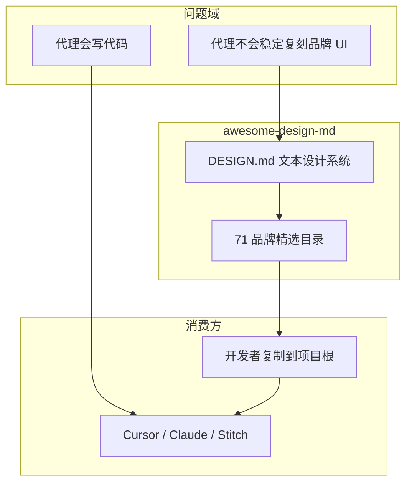

Sources: [README.md:31-42](../../../project-repos/awesome-design-md/README.md#L31-L42)

<details class="source-snippets">
<summary>引用源码</summary>

<!-- source-snippets:start -->

#### `README.md:31-42`

```markdown
## What is DESIGN.md?

[DESIGN.md](https://stitch.withgoogle.com/docs/design-md/overview/) is a new concept introduced by Google Stitch. A plain-text design system document that AI agents read to generate consistent UI.

It's just a markdown file. No Figma exports, no JSON schemas, no special tooling. Drop it into your project root and any AI coding agent or Google Stitch instantly understands how your UI should look. Markdown is the format LLMs read best, so there's nothing to parse or configure.

| File | Who reads it | What it defines |
|------|-------------|-----------------|
| `AGENTS.md` | Coding agents | How to build the project |
| `DESIGN.md` | Design agents | How the project should look and feel |

**This repo provides ready-to-use DESIGN.md files** extracted from real websites. 
```

<!-- source-snippets:end -->
</details>

## 能力全景

- **即拷即用**：复制 `design-md/stripe/DESIGN.md` 到项目根，对代理说「按 DESIGN.md 做结账页」——三步完成，README 明确写死这条路径。
- **71 品牌 × 9 大主题**：从 AI 平台（Claude、Mistral）到豪华汽车（Ferrari、Lamborghini），覆盖开发者工具、Fintech、电商、媒体等场景。
- **双轨文档结构**：每份文件前半是 YAML token（机器可读），后半是 Markdown 叙事（人类/代理共读的设计 rationale）。
- **Stitch 格式对齐**：章节骨架遵循 [Google Stitch DESIGN.md 规范](https://stitch.withgoogle.com/docs/design-md/overview/)，并扩展 Responsive、Agent Prompt Guide 等节。
- **getdesign.md 分发面**：Git 仓库存 Markdown 源；预览 HTML、暗色 catalog、付费优先请求走 getdesign.md 站点。

## 架构鸟瞰

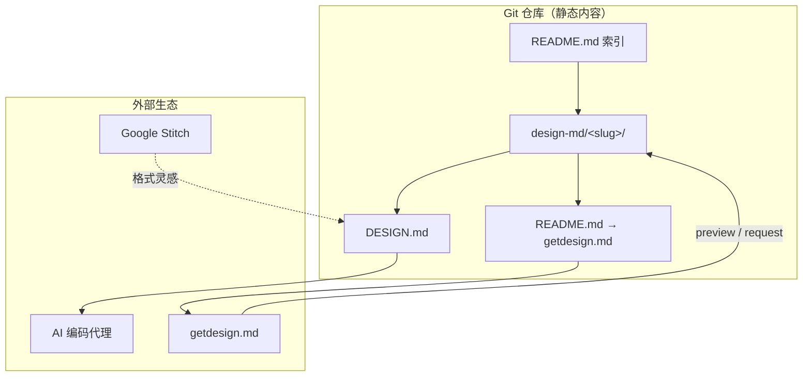

Sources: [README.md:153-181](../../../project-repos/awesome-design-md/README.md#L153-L181), [README.md:44-46](../../../project-repos/awesome-design-md/README.md#L44-L46)

<details class="source-snippets">
<summary>引用源码</summary>

<!-- source-snippets:start -->

#### `README.md:153-181`

```markdown
## What's Inside Each DESIGN.md

Every file follows the [Stitch DESIGN.md format](https://stitch.withgoogle.com/docs/design-md/format/) with extended sections:

| # | Section | What it captures |
|---|---------|-----------------|
| 1 | Visual Theme & Atmosphere | Mood, density, design philosophy |
| 2 | Color Palette & Roles | Semantic name + hex + functional role |
| 3 | Typography Rules | Font families, full hierarchy table |
| 4 | Component Stylings | Buttons, cards, inputs, navigation with states |
| 5 | Layout Principles | Spacing scale, grid, whitespace philosophy |
| 6 | Depth & Elevation | Shadow system, surface hierarchy |
| 7 | Do's and Don'ts | Design guardrails and anti-patterns |
| 8 | Responsive Behavior | Breakpoints, touch targets, collapsing strategy |
| 9 | Agent Prompt Guide | Quick color reference, ready-to-use prompts |

Each site includes:

| File | Purpose |
|------|---------|
| `DESIGN.md` | The design system (what agents read) |
| `preview.html` | Visual catalog showing color swatches, type scale, buttons, cards |
| `preview-dark.html` | Same catalog with dark surfaces |

### How to Use


1. Copy a site's `DESIGN.md` into your project root
2. Tell your AI agent to use it.
```

#### `README.md:44-46`

```markdown
## Request a DESIGN.md

You can [request a DESIGN.md](https://getdesign.md/request) for specific website, including private requests delivered exclusively to you.
```

<!-- source-snippets:end -->
</details>

## 技术栈与规模

这不是传统「有 CI、有 package.json」的应用仓库——**147 个 tracked 文件、143 个 Markdown、零构建 manifest**。维护成本集中在内容质量而非编译链路。

| 指标 | 数值 |
|------|------|
| 品牌子目录 | 71 |
| DESIGN.md 文件 | 71 |
| 顶层目录 | `.github`、`design-md` |
| 许可证 | MIT（含视觉身份免责声明） |

Sources: [00-repo-inventory.md](../00-repo-inventory.md), [LICENSE:1-21](../../../project-repos/awesome-design-md/LICENSE#L1-L21)

<details class="source-snippets">
<summary>引用源码</summary>

<!-- source-snippets:start -->

#### `00-repo-inventory.md`

```markdown
# 00 - 仓库盘点

## Source

- Path: `/Users/bytedance/workspace/workspace-local-task/deepwiki/project-repos/awesome-design-md`
- Remote: `https://github.com/voltagent/awesome-design-md.git`
- Branch: `main`
- Commit: `3883984baf05226208a5dae15730a3593548b808`

## File Summary

- Files scanned: 147
- Top-level directories: `.github`, `design-md`

| Extension | Count |
|-----------|------:|
| `.md` | 143 |
| `.yml` | 2 |
| `[no extension]` | 2 |

## Manifests and Build Files

- None detected

## Documentation

- `CONTRIBUTING.md`
- `README.md`
- `design-md/airbnb/README.md`
- `design-md/airtable/README.md`
- `design-md/apple/README.md`
- `design-md/binance/README.md`
- `design-md/bmw-m/README.md`
- `design-md/bmw/README.md`
- `design-md/bugatti/README.md`
- `design-md/cal/README.md`
- `design-md/claude/README.md`
- `design-md/clay/README.md`
- `design-md/clickhouse/README.md`
- `design-md/cohere/README.md`
- `design-md/coinbase/README.md`
- `design-md/composio/README.md`
- `design-md/cursor/README.md`
- `design-md/elevenlabs/README.md`
- `design-md/expo/README.md`
- `design-md/ferrari/README.md`
- `design-md/figma/README.md`
- `design-md/framer/README.md`
- `design-md/hashicorp/README.md`
- `design-md/ibm/README.md`
- `design-md/intercom/README.md`
- `design-md/kraken/README.md`
- `design-md/lamborghini/README.md`
- `design-md/linear.app/README.md`
- `design-md/lovable/README.md`
- `design-md/mastercard/README.md`
- `design-md/meta/README.md`
- `design-md/minimax/README.md`
- `design-md/mintlify/README.md`
- `design-md/miro/README.md`
- `design-md/mistral.ai/README.md`
- `design-md/mongodb/README.md`
- `design-md/nike/README.md`
- `design-md/notion/README.md`
- `design-md/nvidia/README.md`
- `design-md/ollama/README.md`
- `design-md/opencode.ai/README.md`
- `design-md/pinterest/README.md`
- `design-md/playstation/README.md`
- `design-md/posthog/README.md`
- `design-md/raycast/README.md`
- `design-md/renault/README.md`
- `design-md/replicate/README.md`
- `design-md/resend/README.md`
- `design-md/revolut/README.md`
- `design-md/runwayml/README.md`
- `design-md/sanity/README.md`
- `design-md/sentry/README.md`
- `design-md/shopify/README.md`
- `design-md/spacex/README.md`
- `design-md/spotify/README.md`
- `design-md/starbucks/README.md`
- `design-md/stripe/README.md`
- `design-md/supabase/README.md`
- `design-md/superhuman/README.md`
- `design-md/tesla/README.md`
- `design-md/theverge/README.md`
- `design-md/together.ai/README.md`
- `design-md/uber/README.md`
- `design-md/vercel/README.md`
- `design-md/vodafone/README.md`
- `design-md/voltagent/README.md`
- `design-md/warp/README.md`
- `design-md/webflow/README.md`
- `design-md/wired/README.md`
- `design-md/wise/README.md`
- `design-md/x.ai/README.md`
- `design-md/zapier/README.md`

## CI and Automation

- None detected

## Tests

- None detected

## Skills

- None detected
```

#### `LICENSE:1-21`

```
MIT License

Copyright (c) 2026 VoltAgent

Permission is hereby granted, free of charge, to any person obtaining a copy
of this software and associated documentation files (the "Software"), to deal
in the Software without restriction, including without limitation the rights
to use, copy, modify, merge, publish, distribute, sublicense, and/or sell
copies of the Software, and to permit persons to whom the Software is
furnished to do so, subject to the following conditions:

The above copyright notice and this permission notice shall be included in all
copies or substantial portions of the Software.

THE SOFTWARE IS PROVIDED "AS IS", WITHOUT WARRANTY OF ANY KIND, EXPRESS OR
IMPLIED, INCLUDING BUT NOT LIMITED TO THE WARRANTIES OF MERCHANTABILITY,
FITNESS FOR A PARTICULAR PURPOSE AND NONINFRINGEMENT. IN NO EVENT SHALL THE
AUTHORS OR COPYRIGHT HOLDERS BE LIABLE FOR ANY CLAIM, DAMAGES OR OTHER
LIABILITY, WHETHER IN AN ACTION OF CONTRACT, TORT OR OTHERWISE, ARISING FROM,
OUT OF OR IN CONNECTION WITH THE SOFTWARE OR THE USE OR OTHER DEALINGS IN THE
SOFTWARE.
```

<!-- source-snippets:end -->
</details>

## 阅读路线

**只想快速用起来** → [代理消费工作流](agent-consumption.md) → 选品牌 → 复制 `DESIGN.md`。

**要理解文件内部 schema** → [DESIGN.md 文档格式](design-md-format.md) → [Token 与组件模型](token-component-model.md)。

**要挑品牌或对比风格** → [品牌目录与分类](brand-catalog.md) → [品牌档案深度对比](brand-profile-examples.md)。

**维护者 / 法务关注** → [贡献与治理](contributing-governance.md)。

## 相关页面

- [目录与仓库结构](catalog-architecture.md) — `design-md/` 子目录约定
- [DESIGN.md 文档格式](design-md-format.md) — YAML + Markdown 双轨
- [代理消费工作流](agent-consumption.md) — 复制与提示词模式

---

<details>
<summary>相关源文件</summary>

生成本页时使用的主要源文件：

- [README.md](../../../project-repos/awesome-design-md/README.md)
- [design-md/vercel/README.md](../../../project-repos/awesome-design-md/design-md/vercel/README.md)
- [design-md/voltagent/README.md](../../../project-repos/awesome-design-md/design-md/voltagent/README.md)
- [.gitignore](../../../project-repos/awesome-design-md/.gitignore)

</details>

# 目录与仓库结构

整个仓库是一个**扁平静态内容库**：没有 monorepo、没有代码生成脚本、没有 CI workflow。所有「架构」都体现在目录命名和内容重复模式上——每个品牌占一个 slug 子目录，内部文件角色固定。

## 顶层布局

```text
awesome-design-md/
├── README.md              # 人类入口：概念 + 分类索引 + 使用说明
├── CONTRIBUTING.md        # 治理规则
├── LICENSE
├── .github/               # Issue 模板 + Funding
└── design-md/             # 全部品牌档案（71 个子目录）
```

`.gitignore` 仅忽略 OS 垃圾文件（`.DS_Store`），没有构建产物目录——因为仓库本身不产出编译物。

Sources: [gitignore:1-2](../../../project-repos/awesome-design-md/gitignore#L1-L2)

<details class="source-snippets">
<summary>引用源码</summary>

<!-- source-snippets:start -->

#### `gitignore:1-2`

> 未找到引用文件：`gitignore`

<!-- source-snippets:end -->
</details>

## 品牌子目录约定

每个品牌在 `design-md/<slug>/` 下占独立命名空间。slug 通常等于域名主干：

| slug 示例 | 对应品牌 | 命名特点 |
|-----------|----------|----------|
| `linear.app` | Linear | 保留完整域名 |
| `mistral.ai` | Mistral AI | 含 TLD |
| `bmw-m` | BMW M | 连字符区分子品牌 |
| `theverge` | The Verge | 域名简化 |

**标准文件角色**：

| 文件 | 角色 |
|------|------|
| `DESIGN.md` | 主产物：YAML frontmatter + Markdown 设计叙事 |
| `README.md` | 短指针：链到 getdesign.md 预览与下载 |

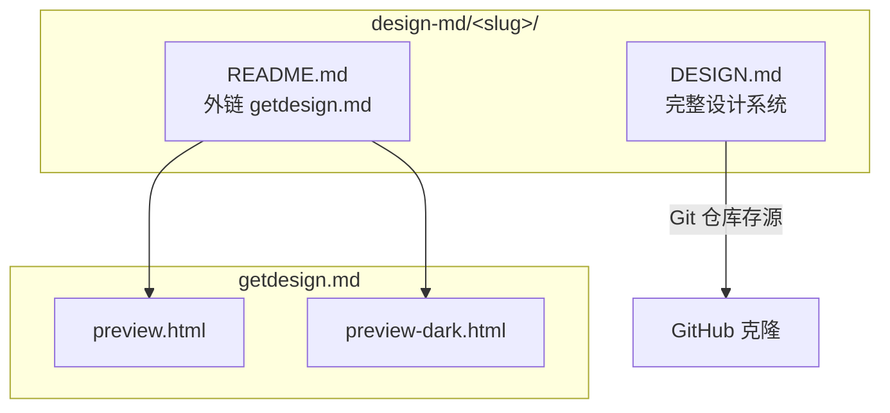

Sources: [design-md/vercel/README.md:1-5](../../../project-repos/awesome-design-md/design-md/vercel/README.md#L1-L5), [README.md:169-175](../../../project-repos/awesome-design-md/README.md#L169-L175)

<details class="source-snippets">
<summary>引用源码</summary>

<!-- source-snippets:start -->

#### `design-md/vercel/README.md:1-5`

```markdown
# Vercel Inspired Design System Analysis

Design system details have been moved to: https://getdesign.md/vercel/design-md

You can also view previews, dark mode examples, and download options on getdesign.md.
```

#### `README.md:169-175`

```markdown
Each site includes:

| File | Purpose |
|------|---------|
| `DESIGN.md` | The design system (what agents read) |
| `preview.html` | Visual catalog showing color swatches, type scale, buttons, cards |
| `preview-dark.html` | Same catalog with dark surfaces |
```

<!-- source-snippets:end -->
</details>

## README 与 getdesign.md 的分工

一个容易误读的点：根 `README.md` 写「每站含 `preview.html` / `preview-dark.html`」，但 **Git 树里当前只有 Markdown**。预览 HTML 托管在 getdesign.md；子目录 `README.md` 统一把读者导向 `https://getdesign.md/<slug>/design-md`。

这是刻意的**双轨分发**——Git 仓轻量、可 fork；getdesign.md 承载可视化 catalog 与商业请求（优先队列、私有定制）。

Sources: [README.md:169-175](../../../project-repos/awesome-design-md/README.md#L169-L175), [design-md/voltagent/README.md:1-5](../../../project-repos/awesome-design-md/design-md/voltagent/README.md#L1-L5)

<details class="source-snippets">
<summary>引用源码</summary>

<!-- source-snippets:start -->

#### `README.md:169-175`

```markdown
Each site includes:

| File | Purpose |
|------|---------|
| `DESIGN.md` | The design system (what agents read) |
| `preview.html` | Visual catalog showing color swatches, type scale, buttons, cards |
| `preview-dark.html` | Same catalog with dark surfaces |
```

#### `design-md/voltagent/README.md:1-5`

```markdown
# VoltAgent Inspired Design System Analysis

Design system details have been moved to: https://getdesign.md/voltagent/design-md

You can also view previews, dark mode examples, and download options on getdesign.md.
```

<!-- source-snippets:end -->
</details>

## 静态内容模型

仓库没有：

- `package.json` / `pyproject.toml`
- GitHub Actions workflow
- 生成脚本或 linter

所有「版本」即 Git commit。品牌条目之间**零代码依赖**——加一个新品牌 = 加一个新子目录，不影响其他 slug。

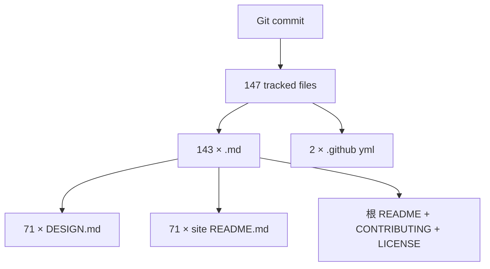

Sources: [00-repo-inventory.md](../00-repo-inventory.md)

<details class="source-snippets">
<summary>引用源码</summary>

<!-- source-snippets:start -->

#### `00-repo-inventory.md`

```markdown
# 00 - 仓库盘点

## Source

- Path: `/Users/bytedance/workspace/workspace-local-task/deepwiki/project-repos/awesome-design-md`
- Remote: `https://github.com/voltagent/awesome-design-md.git`
- Branch: `main`
- Commit: `3883984baf05226208a5dae15730a3593548b808`

## File Summary

- Files scanned: 147
- Top-level directories: `.github`, `design-md`

| Extension | Count |
|-----------|------:|
| `.md` | 143 |
| `.yml` | 2 |
| `[no extension]` | 2 |

## Manifests and Build Files

- None detected

## Documentation

- `CONTRIBUTING.md`
- `README.md`
- `design-md/airbnb/README.md`
- `design-md/airtable/README.md`
- `design-md/apple/README.md`
- `design-md/binance/README.md`
- `design-md/bmw-m/README.md`
- `design-md/bmw/README.md`
- `design-md/bugatti/README.md`
- `design-md/cal/README.md`
- `design-md/claude/README.md`
- `design-md/clay/README.md`
- `design-md/clickhouse/README.md`
- `design-md/cohere/README.md`
- `design-md/coinbase/README.md`
- `design-md/composio/README.md`
- `design-md/cursor/README.md`
- `design-md/elevenlabs/README.md`
- `design-md/expo/README.md`
- `design-md/ferrari/README.md`
- `design-md/figma/README.md`
- `design-md/framer/README.md`
- `design-md/hashicorp/README.md`
- `design-md/ibm/README.md`
- `design-md/intercom/README.md`
- `design-md/kraken/README.md`
- `design-md/lamborghini/README.md`
- `design-md/linear.app/README.md`
- `design-md/lovable/README.md`
- `design-md/mastercard/README.md`
- `design-md/meta/README.md`
- `design-md/minimax/README.md`
- `design-md/mintlify/README.md`
- `design-md/miro/README.md`
- `design-md/mistral.ai/README.md`
- `design-md/mongodb/README.md`
- `design-md/nike/README.md`
- `design-md/notion/README.md`
- `design-md/nvidia/README.md`
- `design-md/ollama/README.md`
- `design-md/opencode.ai/README.md`
- `design-md/pinterest/README.md`
- `design-md/playstation/README.md`
- `design-md/posthog/README.md`
- `design-md/raycast/README.md`
- `design-md/renault/README.md`
- `design-md/replicate/README.md`
- `design-md/resend/README.md`
- `design-md/revolut/README.md`
- `design-md/runwayml/README.md`
- `design-md/sanity/README.md`
- `design-md/sentry/README.md`
- `design-md/shopify/README.md`
- `design-md/spacex/README.md`
- `design-md/spotify/README.md`
- `design-md/starbucks/README.md`
- `design-md/stripe/README.md`
- `design-md/supabase/README.md`
- `design-md/superhuman/README.md`
- `design-md/tesla/README.md`
- `design-md/theverge/README.md`
- `design-md/together.ai/README.md`
- `design-md/uber/README.md`
- `design-md/vercel/README.md`
- `design-md/vodafone/README.md`
- `design-md/voltagent/README.md`
- `design-md/warp/README.md`
- `design-md/webflow/README.md`
- `design-md/wired/README.md`
- `design-md/wise/README.md`
- `design-md/x.ai/README.md`
- `design-md/zapier/README.md`

## CI and Automation

- None detected

## Tests

- None detected

## Skills

- None detected
```

<!-- source-snippets:end -->
</details>

## 设计洞察

**为什么不用 JSON/YAML 单文件仓库？** Markdown 叙事层承载 Do's and Don'ts、品牌语气、渐变使用边界——这些是代理做 UI 决策时最缺、JSON token 最难表达的部分。YAML frontmatter 只承担「可引用 token」，长 prose 留在 `---` 之后。

**为什么 slug 目录互不引用？** 每个 `DESIGN.md` 是自包含快照，代理只需复制单文件。跨品牌 theme 混用是消费者侧行为，库本身不做继承链。

## 相关页面

- [项目概览](overview.md) — DESIGN.md 概念与定位
- [品牌目录与分类](brand-catalog.md) — 71 品牌分类索引
- [分发与 getdesign.md 生态](distribution-ecosystem.md) — 预览与请求流程

---

<details>
<summary>相关源文件</summary>

生成本页时使用的主要源文件：

- [README.md](../../../project-repos/awesome-design-md/README.md)
- [design-md/vercel/DESIGN.md](../../../project-repos/awesome-design-md/design-md/vercel/DESIGN.md)
- [design-md/notion/DESIGN.md](../../../project-repos/awesome-design-md/design-md/notion/DESIGN.md)

</details>

# DESIGN.md 文档格式

每份 `DESIGN.md` 采用 **YAML 机器层 + Markdown 叙事层** 的双轨结构：前半段是可解析的设计 token，后半段是面向代理的设计 rationale。这种 split 让同一份文件同时服务「精确引用 hex/字号」和「理解为什么不能用第七种 accent 色」两种读法。

## 文件骨架

```text
---
version: alpha
name: Brand-Inspired-design-analysis
description: …
colors: { … }
typography: { … }
rounded: { … }
spacing: { … }
components: { … }
---

## Overview
## Colors
## Typography
…（叙事章节）
```

YAML 块以 `---` 包裹，紧跟其后的 `##` 标题进入人类/代理共读区。

Sources: [design-md/vercel/DESIGN.md:1-4](../../../project-repos/awesome-design-md/design-md/vercel/DESIGN.md#L1-L4), [design-md/vercel/DESIGN.md:390-393](../../../project-repos/awesome-design-md/design-md/vercel/DESIGN.md#L390-L393)

<details class="source-snippets">
<summary>引用源码</summary>

<!-- source-snippets:start -->

#### `design-md/vercel/DESIGN.md:1-4`

```markdown
---
version: alpha
name: Vercel-Inspired-design-analysis
description: An inspired interpretation of Vercel's design language — a developer-platform brand whose surface is a stark black-and-ink duet on near-white canvas, broken at hero scale by a multi-color mesh gradient (cyan / blue / magenta / amber) that acts as the entire decorative system, paired with a custom geometric sans for headlines and a monospaced caption face for technical labels.
```

#### `design-md/vercel/DESIGN.md:390-393`

```markdown
---


## Overview
```

<!-- source-snippets:end -->
</details>

## Stitch 标准章节 vs 本库扩展

根 README 列出 9 个标准节（Visual Theme、Color Palette、Typography、Component Stylings、Layout、Depth、Do's and Don'ts、Responsive、Agent Prompt Guide）。实际文件章节标题略有演化：

| README 承诺节 | 典型文件中的标题 | 覆盖情况 |
|---------------|------------------|----------|
| Visual Theme & Atmosphere | `## Overview` | 全部 |
| Color Palette & Roles | `## Colors` | 全部 |
| Typography Rules | `## Typography` | 全部 |
| Component Stylings | `## Components` | 全部 |
| Layout Principles | `## Layout` | 几乎全部 |
| Depth & Elevation | `## Elevation & Depth` | 大部分 |
| Do's and Don'ts | `## Do's and Don'ts` | 大部分 |
| Responsive Behavior | `## Responsive Behavior` | 多数较新条目 |
| Agent Prompt Guide | `## 9. Agent Prompt Guide` 或类似 | 部分条目 |

Vercel 档案到 `## Do's and Don'ts` 为止（718 行），未含 Responsive / Agent Prompt——说明库内存在**代际格式差异**，较新品牌（Notion、Stripe、Slack）更完整。

Sources: [README.md:153-167](../../../project-repos/awesome-design-md/README.md#L153-L167), [design-md/vercel/DESIGN.md:718-737](../../../project-repos/awesome-design-md/design-md/vercel/DESIGN.md#L718-L737)

<details class="source-snippets">
<summary>引用源码</summary>

<!-- source-snippets:start -->

#### `README.md:153-167`

```markdown
## What's Inside Each DESIGN.md

Every file follows the [Stitch DESIGN.md format](https://stitch.withgoogle.com/docs/design-md/format/) with extended sections:

| # | Section | What it captures |
|---|---------|-----------------|
| 1 | Visual Theme & Atmosphere | Mood, density, design philosophy |
| 2 | Color Palette & Roles | Semantic name + hex + functional role |
| 3 | Typography Rules | Font families, full hierarchy table |
| 4 | Component Stylings | Buttons, cards, inputs, navigation with states |
| 5 | Layout Principles | Spacing scale, grid, whitespace philosophy |
| 6 | Depth & Elevation | Shadow system, surface hierarchy |
| 7 | Do's and Don'ts | Design guardrails and anti-patterns |
| 8 | Responsive Behavior | Breakpoints, touch targets, collapsing strategy |
| 9 | Agent Prompt Guide | Quick color reference, ready-to-use prompts |
```

#### `design-md/vercel/DESIGN.md:718-737`

```markdown
## Do's and Don'ts

### Do
- Reserve `{colors.primary}` (`#171717`) for primary CTAs across the page. Black ink IS the conversion target.
- Use `{rounded.pill}` 100 px for every marketing-scale CTA and `{rounded.sm}` 6 px for nav-scale buttons. The two pill scales coexist deliberately.
- Set every headline in `{typography.display-*}` weight 600, sentence-case, often period-terminated. Aggressive negative tracking is part of the voice.
- Use the brand mesh gradient as atmospheric decoration at hero scale only — never miniaturise it to an icon, never reduce to a single colour.
- Layer stacked shadows (multiple small offsets with inset hairline) rather than single heavy drops. The brand's elevation is calmer than Material.
- Cycle page surfaces in `{colors.canvas-soft}` → `{colors.canvas}` → `{colors.primary}` polarity-flipped bands; the dark band IS the depth cue.
- Set every code block and technical eyebrow in `{typography.code}` / `{typography.caption-mono}`. Mono is the voice of the platform.

### Don't
- Don't introduce a sixth accent colour. The brand operates with ink + gray + the four-pair gradient palette; new accents flatten the voice.
- Don't render headlines in all-caps. Sentence-case + negative tracking is non-negotiable.
- Don't drop a single heavy drop-shadow on cards. The brand's elevation is built from stacked small offsets + inset hairline rings.
- Don't render the brand gradient at icon scale or in a single-colour reduced form. The gradient lives at hero scale only.
- Don't promote the geometric sans to weight 700. The brand's display ceiling is 600.
- Don't pair the marketing 100-px pill CTA shape with the 6-px nav radius on the same screen — pick a scale and stay there.
- Don't set body paragraphs in the mono face. The mono is for code + technical labels only.
```

<!-- source-snippets:end -->
</details>

## YAML 元数据字段

| 字段 | 用途 | 示例 |
|------|------|------|
| `version` | 格式版本标记 | `alpha` |
| `name` | 内部分析名称 | `Vercel-Inspired-design-analysis` |
| `description` | 一段话设计气质摘要 | 多句 prose，描述 canvas/gradient/type voice |
| `colors` | 语义色 token → hex | `primary: "#171717"` |
| `typography` | 层级 token → 字体指标 | `display-xl.fontSize: 48px` |
| `rounded` | 圆角 scale | `pill: 100px` |
| `spacing` | 间距 scale | `section: 192px` |
| `components` | 组件 chrome 定义 | `button-primary.backgroundColor: "{colors.primary}"` |

`description` 字段本身是一段高质量 design brief——Often 比 Overview 第一节更压缩，适合代理快速扫描气质。

Sources: [design-md/vercel/DESIGN.md:1-4](../../../project-repos/awesome-design-md/design-md/vercel/DESIGN.md#L1-L4), [design-md/voltagent/DESIGN.md:1-4](../../../project-repos/awesome-design-md/design-md/voltagent/DESIGN.md#L1-L4)

<details class="source-snippets">
<summary>引用源码</summary>

<!-- source-snippets:start -->

#### `design-md/vercel/DESIGN.md:1-4`

```markdown
---
version: alpha
name: Vercel-Inspired-design-analysis
description: An inspired interpretation of Vercel's design language — a developer-platform brand whose surface is a stark black-and-ink duet on near-white canvas, broken at hero scale by a multi-color mesh gradient (cyan / blue / magenta / amber) that acts as the entire decorative system, paired with a custom geometric sans for headlines and a monospaced caption face for technical labels.
```

#### `design-md/voltagent/DESIGN.md:1-4`

```markdown
---
version: alpha
name: Voltagent-Inspired-design-analysis
description: An inspired interpretation of Voltagent's design language — a developer-focused AI agent engineering platform whose surface is an unrelenting near-black canvas broken only by a single electric-green brand accent, code-editor mockups inside the hero, and a precise grid of dark feature cards that read like a documentation site dressed as marketing.
```

<!-- source-snippets:end -->
</details>

## Markdown 叙事层写法

叙事章节用 `{colors.primary}`、`{typography.display-xl}` **回指 YAML token**，形成闭环：代理读 prose 时看到的语义名，可直接在 YAML 查 hex。

典型模式：

- **Overview**：品牌 posture（developer platform / luxury automotive / editorial media）
- **Colors**：按 Brand & Accent / Surface / Text / Semantic 分组，每项带 hex 和功能角色
- **Typography**：字体族说明 + 完整 hierarchy 表格
- **Components**：按 Buttons / Cards / Navigation 分块，描述 state 与 chrome
- **Do's and Don'ts**：硬约束列表——代理最容易违反的规则显式写出

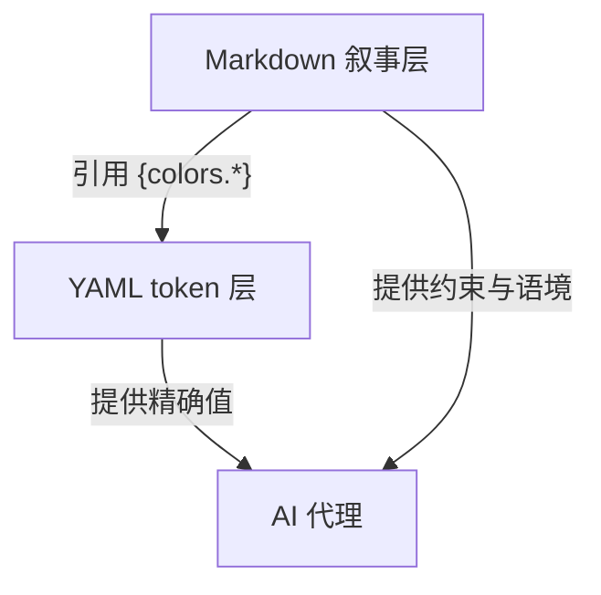

Sources: [design-md/vercel/DESIGN.md:409-447](../../../project-repos/awesome-design-md/design-md/vercel/DESIGN.md#L409-L447), [design-md/vercel/DESIGN.md:718-737](../../../project-repos/awesome-design-md/design-md/vercel/DESIGN.md#L718-L737)

<details class="source-snippets">
<summary>引用源码</summary>

<!-- source-snippets:start -->

#### `design-md/vercel/DESIGN.md:409-447`

```markdown
## Colors

### Brand & Accent
- **Ink** (`{colors.primary}` — `#171717`): The single primary CTA color. Black-near-pure ink that carries every Sign Up pill, every footer CTA, the dark-band polarity-flip. Used as text color throughout the page on light surfaces. (Resolved from `--ds-gray-1000`.)
- **Cyan** (`{colors.cyan}` — `#50e3c2`): A signature mint-cyan used in the brand gradient and inside Geist-system spotlight tokens. Visible inside the hero gradient stops.
- **Highlight Pink** (`{colors.highlight-pink}` — `#ff0080`): The brand's highlight magenta, used as the high-saturation stop in the preview-gradient pair.
- **Violet** (`{colors.violet}` — `#7928ca`): The deep purple used as the start of the preview-gradient and inside developer-console highlights.
- **Link Blue** (`{colors.link}` — `#0070f3`): The brand's primary link color and the legacy `--geist-success` semantic.

### Surface
- **Canvas** (`{colors.canvas}` — `#ffffff`): The pure-white card / dialog / modal surface.
- **Canvas Soft** (`{colors.canvas-soft}` — `#fafafa`): The default page background — 98 % white. Almost every section sits on this tone.
- **Canvas Soft 2** (`{colors.canvas-soft-2}` — `#f5f5f5`): A slightly deeper inset surface for "code editor inner background", template-card hover states, and dropdown menus.
- **Hairline** (`{colors.hairline}` — `#ebebeb`): 1 px dividers — table rows, card borders, input borders.
- **Hairline Strong** (`{colors.hairline-strong}` — `#a1a1a1`): The 500-level gray, used as the slightly-stronger divider on light bands and as the deemphasised text color.

### Text
- **Ink** (`{colors.ink}` — `#171717`): Every heading and body paragraph on light surfaces.
- **Body** (`{colors.body}` — `#4d4d4d`): Secondary text — sub-headings, body captions, nav-link inactive text, footer column body.
- **Mute** (`{colors.mute}` — `#888888`): Lowest-priority text — placeholder text, fine print, low-key labels.
- **On Primary** (`{colors.on-primary}` — `#ffffff`): All text on `{colors.primary}` surfaces.

### Semantic
- **Success / Link** (`{colors.success}` — `#0070f3`): The brand's legacy success indicator doubles as the primary link color. Visible underline-on-hover for inline body links.
- **Link Deep** (`{colors.link-deep}` — `#0761d1`): The pressed / visited tone for inline links.
- **Link Bg Soft** (`{colors.link-bg-soft}` — `#d3e5ff`): Soft pastel blue fill for "what's new" pill banners and informational badges.
- **Error** (`{colors.error}` — `#ee0000`): Validation red for destructive actions and form errors.
- **Error Soft** (`{colors.error-soft}` — `#f7d4d6`): Soft pastel red for destructive-state backgrounds.
- **Error Deep** (`{colors.error-deep}` — `#c50000`): Pressed / deep destructive state.
- **Warning** (`{colors.warning}` — `#f5a623`): Caution / pending status indicator.
- **Warning Soft** (`{colors.warning-soft}` — `#ffefcf`) / **Warning Deep** (`{colors.warning-deep}` — `#ab570a`): Background + pressed variants.

### Brand Gradient
The brand's signature decoration is a three-pair gradient stack:
- **Develop** (`{colors.gradient-develop-start}` `#007cf0` → `{colors.gradient-develop-end}` `#00dfd8`) — the blue-to-teal pair used to mark the "deploy" / "develop" rhythm.
- **Preview** (`{colors.gradient-preview-start}` `#7928ca` → `{colors.gradient-preview-end}` `#ff0080`) — the violet-to-pink pair used for "preview" surfaces.
- **Ship** (`{colors.gradient-ship-start}` `#ff4d4d` → `{colors.gradient-ship-end}` `#f9cb28`) — the coral-to-amber pair used for "ship" surfaces.

The three pairs collapse into a single multi-color mesh gradient when used as the hero atmospheric backdrop. Treat the gradient as one unified object — do not crop down to a single colour, do not reorder the stops, and do not miniaturise. Used at hero scale only.
```

#### `design-md/vercel/DESIGN.md:718-737`

```markdown
## Do's and Don'ts

### Do
- Reserve `{colors.primary}` (`#171717`) for primary CTAs across the page. Black ink IS the conversion target.
- Use `{rounded.pill}` 100 px for every marketing-scale CTA and `{rounded.sm}` 6 px for nav-scale buttons. The two pill scales coexist deliberately.
- Set every headline in `{typography.display-*}` weight 600, sentence-case, often period-terminated. Aggressive negative tracking is part of the voice.
- Use the brand mesh gradient as atmospheric decoration at hero scale only — never miniaturise it to an icon, never reduce to a single colour.
- Layer stacked shadows (multiple small offsets with inset hairline) rather than single heavy drops. The brand's elevation is calmer than Material.
- Cycle page surfaces in `{colors.canvas-soft}` → `{colors.canvas}` → `{colors.primary}` polarity-flipped bands; the dark band IS the depth cue.
- Set every code block and technical eyebrow in `{typography.code}` / `{typography.caption-mono}`. Mono is the voice of the platform.

### Don't
- Don't introduce a sixth accent colour. The brand operates with ink + gray + the four-pair gradient palette; new accents flatten the voice.
- Don't render headlines in all-caps. Sentence-case + negative tracking is non-negotiable.
- Don't drop a single heavy drop-shadow on cards. The brand's elevation is built from stacked small offsets + inset hairline rings.
- Don't render the brand gradient at icon scale or in a single-colour reduced form. The gradient lives at hero scale only.
- Don't promote the geometric sans to weight 700. The brand's display ceiling is 600.
- Don't pair the marketing 100-px pill CTA shape with the 6-px nav radius on the same screen — pick a scale and stay there.
- Don't set body paragraphs in the mono face. The mono is for code + technical labels only.
```

<!-- source-snippets:end -->
</details>

## 格式演进洞察

**`version: alpha`** 出现在所有抽检文件——说明格式仍在迭代，消费者不应假设 JSON schema 稳定。

**组件区的 `ex-*` 前缀块**（如 `ex-pricing-tier`、`ex-modal-card`）是「示例组件」：注释写明 auto-derived / illustrative，把营销站 chrome 映射到通用 UI 模式（定价卡、模态框、空状态），方便代理迁移到 SaaS 场景。

Sources: [design-md/vercel/DESIGN.md:329-388](../../../project-repos/awesome-design-md/design-md/vercel/DESIGN.md#L329-L388)

<details class="source-snippets">
<summary>引用源码</summary>

<!-- source-snippets:start -->

#### `design-md/vercel/DESIGN.md:329-388`

```markdown
  # ─── Examples (illustrative) — auto-derived; resolve any TO_FILL markers below ───
  ex-pricing-tier:
    description: "Default tier card. Mirrors pricing-card chrome on canvas-soft surface with a hairline border."
    backgroundColor: "{colors.canvas-soft}"
    textColor: "{colors.ink}"
    borderColor: "{colors.hairline}"
    rounded: "{rounded.lg}"
    padding: "{spacing.xl}"
  ex-pricing-tier-featured:
    description: "Featured tier — polarity-flipped to ink primary with white text and white CTA."
    backgroundColor: "{colors.ink}"
    textColor: "{colors.on-primary}"
    rounded: "{rounded.lg}"
    padding: "{spacing.xl}"
  ex-product-selector:
    description: "What's Included summary card — repurposed for the brand's GPU / inference / Pro feature tiers."
    backgroundColor: "{colors.canvas-soft}"
    rounded: "{rounded.md}"
    padding: "{spacing.lg}"
  ex-cart-drawer:
    description: "Subscription summary — line items per add-on (NOT a literal e-commerce cart)."
    backgroundColor: "{colors.canvas}"
    rounded: "{rounded.md}"
    padding: "{spacing.lg}"
    item-divider: "{colors.hairline}"
  ex-app-shell-row:
    description: "Sidebar nav row. Active state uses brand primary as a left-edge indicator bar."
    backgroundColor: "{colors.canvas}"
    activeIndicator: "{colors.primary}"
    rounded: "{rounded.sm}"
    padding: "{spacing.xs} {spacing.sm}"
  ex-data-table-cell:
    description: "Mirrors the brand's table chrome. Header uses caption-mono uppercase mono; body uses body-sm."
    headerBackground: "{colors.canvas-soft}"
    headerTypography: "{typography.caption-mono}"
    bodyTypography: "{typography.body-sm}"
    cellPadding: "{spacing.xs} {spacing.sm}"
    rowBorder: "{colors.hairline}"
  ex-auth-form-card:
    description: "Sign-in / sign-up card. Mirrors card-marketing-large chrome with form-input primitives inside."
    backgroundColor: "{colors.canvas-soft}"
    rounded: "{rounded.lg}"
    padding: "{spacing.xl}"
  ex-modal-card:
    description: "Modal dialog surface — same chrome as card-marketing-large with Level 5 modal shadow."
    backgroundColor: "{colors.canvas}"
    rounded: "{rounded.lg}"
    padding: "{spacing.xl}"
  ex-empty-state-card:
    description: "Empty-state illustration frame. Generous padding on canvas-soft."
    backgroundColor: "{colors.canvas-soft}"
    rounded: "{rounded.lg}"
    padding: "{spacing.3xl}"
    captionTypography: "{typography.body-md}"
  ex-toast:
    description: "Toast notification surface — flat-cornered card-marketing chrome with Level 4 shadow."
    backgroundColor: "{colors.canvas}"
    rounded: "{rounded.md}"
    padding: "{spacing.sm} {spacing.md}"
    typography: "{typography.body-sm}"
```

<!-- source-snippets:end -->
</details>

## 相关页面

- [Token 与组件模型](token-component-model.md) — `{colors.*}` 引用语法细节
- [品牌档案深度对比](brand-profile-examples.md) — 三份档案的风格差异
- [代理消费工作流](agent-consumption.md) — 代理如何读整份文件

---

<details>
<summary>相关源文件</summary>

生成本页时使用的主要源文件：

- [design-md/vercel/DESIGN.md](../../../project-repos/awesome-design-md/design-md/vercel/DESIGN.md)
- [design-md/voltagent/DESIGN.md](../../../project-repos/awesome-design-md/design-md/voltagent/DESIGN.md)
- [design-md/stripe/DESIGN.md](../../../project-repos/awesome-design-md/design-md/stripe/DESIGN.md)

</details>

# Token 与组件模型

YAML frontmatter 里的 token 系统是整个库的「机器接口」。理解 `{colors.primary}` 如何在 `components` 块里级联引用，是代理把 DESIGN.md 转成 Tailwind/CSS 变量的关键。

## Token 命名空间

四类 scale 构成完整设计变量表：

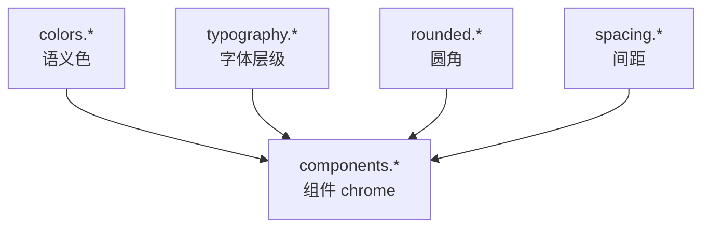

Sources: [design-md/vercel/DESIGN.md:6-147](../../../project-repos/awesome-design-md/design-md/vercel/DESIGN.md#L6-L147)

<details class="source-snippets">
<summary>引用源码</summary>

<!-- source-snippets:start -->

#### `design-md/vercel/DESIGN.md:6-147`

```markdown
colors:
  primary: "#171717"
  on-primary: "#ffffff"
  ink: "#171717"
  body: "#4d4d4d"
  mute: "#888888"
  hairline: "#ebebeb"
  hairline-strong: "#a1a1a1"
  canvas: "#ffffff"
  canvas-soft: "#fafafa"
  canvas-soft-2: "#f5f5f5"
  link: "#0070f3"
  link-deep: "#0761d1"
  link-bg-soft: "#d3e5ff"
  success: "#0070f3"
  error: "#ee0000"
  error-soft: "#f7d4d6"
  error-deep: "#c50000"
  warning: "#f5a623"
  warning-soft: "#ffefcf"
  warning-deep: "#ab570a"
  violet: "#7928ca"
  violet-soft: "#d8ccf1"
  violet-deep: "#4c2889"
  cyan: "#50e3c2"
  cyan-soft: "#aaffec"
  cyan-deep: "#29bc9b"
  highlight-pink: "#ff0080"
  highlight-magenta: "#eb367f"
  gradient-develop-start: "#007cf0"
  gradient-develop-end: "#00dfd8"
  gradient-preview-start: "#7928ca"
  gradient-preview-end: "#ff0080"
  gradient-ship-start: "#ff4d4d"
  gradient-ship-end: "#f9cb28"
  selection-bg: "#171717"
  selection-fg: "#f2f2f2"

typography:
  display-xl:
    fontFamily: Geist, Inter, system-ui, -apple-system, sans-serif
    fontSize: 48px
    fontWeight: 600
    lineHeight: 48px
    letterSpacing: -2.4px
  display-lg:
    fontFamily: Geist, Inter, system-ui, -apple-system, sans-serif
    fontSize: 32px
    fontWeight: 600
    lineHeight: 40px
    letterSpacing: -1.28px
  display-md:
    fontFamily: Geist, Inter, system-ui, -apple-system, sans-serif
    fontSize: 24px
    fontWeight: 600
    lineHeight: 32px
    letterSpacing: -0.96px
  display-sm:
    fontFamily: Geist, Inter, system-ui, -apple-system, sans-serif
    fontSize: 20px
    fontWeight: 600
    lineHeight: 28px
    letterSpacing: -0.6px
  body-lg:
    fontFamily: Geist, Inter, system-ui, -apple-system, sans-serif
    fontSize: 18px
    fontWeight: 400
    lineHeight: 28px
    letterSpacing: 0px
  body-md:
    fontFamily: Geist, Inter, system-ui, -apple-system, sans-serif
    fontSize: 16px
    fontWeight: 400
    lineHeight: 24px
  body-md-strong:
    fontFamily: Geist, Inter, system-ui, -apple-system, sans-serif
    fontSize: 16px
    fontWeight: 500
    lineHeight: 24px
  body-sm:
    fontFamily: Geist, Inter, system-ui, -apple-system, sans-serif
    fontSize: 14px
    fontWeight: 400
    lineHeight: 20px
    letterSpacing: -0.28px
  body-sm-strong:
    fontFamily: Geist, Inter, system-ui, -apple-system, sans-serif
    fontSize: 14px
    fontWeight: 500
    lineHeight: 20px
    letterSpacing: -0.28px
  caption:
    fontFamily: Geist, Inter, system-ui, -apple-system, sans-serif
    fontSize: 12px
    fontWeight: 400
    lineHeight: 16px
  caption-mono:
    fontFamily: Geist Mono, ui-monospace, SFMono-Regular, Menlo, Monaco, monospace
    fontSize: 12px
    fontWeight: 400
    lineHeight: 16px
  code:
    fontFamily: Geist Mono, ui-monospace, SFMono-Regular, Menlo, Monaco, monospace
    fontSize: 13px
    fontWeight: 400
    lineHeight: 20px
  button-md:
    fontFamily: Geist, Inter, system-ui, -apple-system, sans-serif
    fontSize: 14px
    fontWeight: 500
    lineHeight: 20px
  button-lg:
    fontFamily: Geist, Inter, system-ui, -apple-system, sans-serif
    fontSize: 16px
    fontWeight: 500
    lineHeight: 24px

rounded:
  none: 0px
  xs: 4px
... snippet truncated ...
```

<!-- source-snippets:end -->
</details>

## colors 语义模型

颜色不按 Tailwind `gray-500` 编号，而用**角色名**：

| 角色类 | 典型 key | 用途 |
|--------|----------|------|
| 品牌主色 | `primary`, `primary-soft` | CTA、强调条 |
| 画布 | `canvas`, `canvas-soft` | 页面背景层级 |
| 文本 | `ink`, `body`, `mute` | 标题 / 正文 / 弱化 |
| 分割 | `hairline`, `hairline-strong` | 边框、表格线 |
| 语义 | `error`, `warning`, `success` | 表单与状态 |
| 渐变 | `gradient-*-start/end` | 品牌装饰（Vercel 三色对） |

Vercel 用 `#171717` ink 作 primary CTA；Voltagent 用 `#00d992` emerald 作 primary——**同一 key 名、完全不同的品牌决策**，代理必须读具体 hex 而非假设 `primary` = 蓝。

Sources: [design-md/vercel/DESIGN.md:6-42](../../../project-repos/awesome-design-md/design-md/vercel/DESIGN.md#L6-L42), [design-md/voltagent/DESIGN.md:6-19](../../../project-repos/awesome-design-md/design-md/voltagent/DESIGN.md#L6-L19)

<details class="source-snippets">
<summary>引用源码</summary>

<!-- source-snippets:start -->

#### `design-md/vercel/DESIGN.md:6-42`

```markdown
colors:
  primary: "#171717"
  on-primary: "#ffffff"
  ink: "#171717"
  body: "#4d4d4d"
  mute: "#888888"
  hairline: "#ebebeb"
  hairline-strong: "#a1a1a1"
  canvas: "#ffffff"
  canvas-soft: "#fafafa"
  canvas-soft-2: "#f5f5f5"
  link: "#0070f3"
  link-deep: "#0761d1"
  link-bg-soft: "#d3e5ff"
  success: "#0070f3"
  error: "#ee0000"
  error-soft: "#f7d4d6"
  error-deep: "#c50000"
  warning: "#f5a623"
  warning-soft: "#ffefcf"
  warning-deep: "#ab570a"
  violet: "#7928ca"
  violet-soft: "#d8ccf1"
  violet-deep: "#4c2889"
  cyan: "#50e3c2"
  cyan-soft: "#aaffec"
  cyan-deep: "#29bc9b"
  highlight-pink: "#ff0080"
  highlight-magenta: "#eb367f"
  gradient-develop-start: "#007cf0"
  gradient-develop-end: "#00dfd8"
  gradient-preview-start: "#7928ca"
  gradient-preview-end: "#ff0080"
  gradient-ship-start: "#ff4d4d"
  gradient-ship-end: "#f9cb28"
  selection-bg: "#171717"
  selection-fg: "#f2f2f2"
```

#### `design-md/voltagent/DESIGN.md:6-19`

```markdown
colors:
  primary: "#00d992"
  primary-soft: "#2fd6a1"
  primary-deep: "#10b981"
  on-primary: "#101010"
  ink: "#f2f2f2"
  ink-strong: "#ffffff"
  body: "#bdbdbd"
  mute: "#8b949e"
  hairline: "#3d3a39"
  hairline-soft: "#b8b3b0"
  canvas: "#101010"
  canvas-soft: "#1a1a1a"
  canvas-text-soft: "#f5f6f7"
```

<!-- source-snippets:end -->
</details>

## typography 层级

每个 typography token 是扁平对象，字段固定：

```yaml
display-xl:
  fontFamily: Geist, Inter, system-ui, …
  fontSize: 48px
  fontWeight: 600
  lineHeight: 48px
  letterSpacing: -2.4px
```

**关键差异点**（跨品牌对比）：

- Vercel：display 用 weight **600**，负 tracking 激进（-2.4px @ 48px）
- Voltagent：hero display-xl 用 weight **400** @ 60px——「文档语气」而非 shouty marketing
- 专用 eyebrow token（`eyebrow-mono`）在 Voltagent 带 `letterSpacing: 2.52px` 大写标签

Sources: [design-md/vercel/DESIGN.md:44-121](../../../project-repos/awesome-design-md/design-md/vercel/DESIGN.md#L44-L121), [design-md/voltagent/DESIGN.md:21-106](../../../project-repos/awesome-design-md/design-md/voltagent/DESIGN.md#L21-L106)

<details class="source-snippets">
<summary>引用源码</summary>

<!-- source-snippets:start -->

#### `design-md/vercel/DESIGN.md:44-121`

```markdown
typography:
  display-xl:
    fontFamily: Geist, Inter, system-ui, -apple-system, sans-serif
    fontSize: 48px
    fontWeight: 600
    lineHeight: 48px
    letterSpacing: -2.4px
  display-lg:
    fontFamily: Geist, Inter, system-ui, -apple-system, sans-serif
    fontSize: 32px
    fontWeight: 600
    lineHeight: 40px
    letterSpacing: -1.28px
  display-md:
    fontFamily: Geist, Inter, system-ui, -apple-system, sans-serif
    fontSize: 24px
    fontWeight: 600
    lineHeight: 32px
    letterSpacing: -0.96px
  display-sm:
    fontFamily: Geist, Inter, system-ui, -apple-system, sans-serif
    fontSize: 20px
    fontWeight: 600
    lineHeight: 28px
    letterSpacing: -0.6px
  body-lg:
    fontFamily: Geist, Inter, system-ui, -apple-system, sans-serif
    fontSize: 18px
    fontWeight: 400
    lineHeight: 28px
    letterSpacing: 0px
  body-md:
    fontFamily: Geist, Inter, system-ui, -apple-system, sans-serif
    fontSize: 16px
    fontWeight: 400
    lineHeight: 24px
  body-md-strong:
    fontFamily: Geist, Inter, system-ui, -apple-system, sans-serif
    fontSize: 16px
    fontWeight: 500
    lineHeight: 24px
  body-sm:
    fontFamily: Geist, Inter, system-ui, -apple-system, sans-serif
    fontSize: 14px
    fontWeight: 400
    lineHeight: 20px
    letterSpacing: -0.28px
  body-sm-strong:
    fontFamily: Geist, Inter, system-ui, -apple-system, sans-serif
    fontSize: 14px
    fontWeight: 500
    lineHeight: 20px
    letterSpacing: -0.28px
  caption:
    fontFamily: Geist, Inter, system-ui, -apple-system, sans-serif
    fontSize: 12px
    fontWeight: 400
    lineHeight: 16px
  caption-mono:
    fontFamily: Geist Mono, ui-monospace, SFMono-Regular, Menlo, Monaco, monospace
    fontSize: 12px
    fontWeight: 400
    lineHeight: 16px
  code:
    fontFamily: Geist Mono, ui-monospace, SFMono-Regular, Menlo, Monaco, monospace
    fontSize: 13px
    fontWeight: 400
    lineHeight: 20px
  button-md:
    fontFamily: Geist, Inter, system-ui, -apple-system, sans-serif
    fontSize: 14px
    fontWeight: 500
    lineHeight: 20px
  button-lg:
    fontFamily: Geist, Inter, system-ui, -apple-system, sans-serif
    fontSize: 16px
    fontWeight: 500
    lineHeight: 24px
```

#### `design-md/voltagent/DESIGN.md:21-106`

```markdown
typography:
  display-xl:
    fontFamily: Inter, system-ui, -apple-system, Segoe UI, Roboto, sans-serif
    fontSize: 60px
    fontWeight: 400
    lineHeight: 60px
    letterSpacing: -0.65px
  display-lg:
    fontFamily: Inter, system-ui, -apple-system, Segoe UI, Roboto, sans-serif
    fontSize: 36px
    fontWeight: 400
    lineHeight: 40px
    letterSpacing: -0.9px
  display-md:
    fontFamily: Inter, system-ui, -apple-system, Segoe UI, Roboto, sans-serif
    fontSize: 24px
    fontWeight: 700
    lineHeight: 32px
    letterSpacing: -0.6px
  display-sm:
    fontFamily: Inter, system-ui, -apple-system, Segoe UI, Roboto, sans-serif
    fontSize: 20px
    fontWeight: 600
    lineHeight: 28px
  eyebrow-mono:
    fontFamily: Inter, system-ui, -apple-system, sans-serif
    fontSize: 14px
    fontWeight: 600
    lineHeight: 20px
    letterSpacing: 2.52px
  eyebrow-uppercase:
    fontFamily: Inter, system-ui, -apple-system, sans-serif
    fontSize: 18px
    fontWeight: 600
    lineHeight: 28px
    letterSpacing: 0.45px
  body-lg:
    fontFamily: Inter, system-ui, -apple-system, sans-serif
    fontSize: 18px
    fontWeight: 400
    lineHeight: 28px
  body-md:
    fontFamily: Inter, system-ui, -apple-system, sans-serif
    fontSize: 16px
    fontWeight: 400
    lineHeight: 26px
  body-md-strong:
    fontFamily: Inter, system-ui, -apple-system, sans-serif
    fontSize: 16px
    fontWeight: 600
    lineHeight: 24px
  body-sm:
    fontFamily: Inter, system-ui, -apple-system, sans-serif
    fontSize: 14px
    fontWeight: 400
    lineHeight: 20px
  body-sm-strong:
    fontFamily: Inter, system-ui, -apple-system, sans-serif
    fontSize: 14px
    fontWeight: 600
    lineHeight: 23px
  caption:
    fontFamily: Inter, system-ui, -apple-system, sans-serif
    fontSize: 12px
    fontWeight: 400
    lineHeight: 16px
  caption-strong:
    fontFamily: Inter, system-ui, -apple-system, sans-serif
    fontSize: 12px
    fontWeight: 500
    lineHeight: 16px
  code:
    fontFamily: SFMono-Regular, Menlo, Monaco, Consolas, Liberation Mono, monospace
    fontSize: 13px
    fontWeight: 400
    lineHeight: 18px
  code-strong:
    fontFamily: SFMono-Regular, Menlo, Monaco, Consolas, monospace
    fontSize: 13px
    fontWeight: 550
    lineHeight: 16px
  button-md:
    fontFamily: Inter, system-ui, -apple-system, sans-serif
    fontSize: 16px
    fontWeight: 600
    lineHeight: 24px
```

<!-- source-snippets:end -->
</details>

## components 引用语法

组件定义值用 **`"{colors.primary}"`** 字符串包裹 token 路径，支持嵌套引用：

```yaml
button-primary:
  backgroundColor: "{colors.primary}"
  textColor: "{colors.on-primary}"
  typography: "{typography.button-lg}"
  rounded: "{rounded.pill}"
  padding: "0px {spacing.sm}"
```

这种 indirection 让改 primary hex 时组件区自动一致——代理生成 CSS 变量时可 1:1 映射为 `--color-primary: #171717`。

Sources: [design-md/vercel/DESIGN.md:182-193](../../../project-repos/awesome-design-md/design-md/vercel/DESIGN.md#L182-L193)

<details class="source-snippets">
<summary>引用源码</summary>

<!-- source-snippets:start -->

#### `design-md/vercel/DESIGN.md:182-193`

```markdown
  button-primary:
    backgroundColor: "{colors.primary}"
    textColor: "{colors.on-primary}"
    typography: "{typography.button-lg}"
    rounded: "{rounded.pill}"
    padding: "0px {spacing.sm}"
  button-secondary:
    backgroundColor: "{colors.canvas}"
    textColor: "{colors.ink}"
    typography: "{typography.button-lg}"
    rounded: "{rounded.pill}"
    padding: "0px {spacing.sm}"
```

<!-- source-snippets:end -->
</details>

## 组件 taxonomy

Vercel 档案 `components` 块涵盖 30+ 命名组件，分几类：

| 类别 | 示例 key | 说明 |
|------|----------|------|
| 导航 | `nav-bar`, `nav-link`, `nav-cta-signup` | 含多种 CTA 变体 |
| 按钮 | `button-primary`, `button-secondary`, `tab-ghost` | 营销 pill vs 应用方角共存 |
| 卡片 | `card-marketing`, `pricing-card-featured` | 含 polarity-flip 特色层 |
| 表单 | `form-input`, `form-input-lg` | 高度 token 化 |
| 布局 band | `hero-band`, `feature-mesh-band` | 段落级 surface |
| 示例 | `ex-pricing-tier`, `ex-modal-card` | 跨场景迁移模板 |

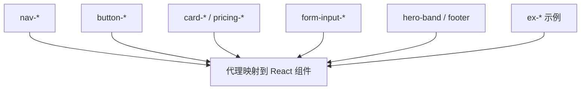

Sources: [design-md/vercel/DESIGN.md:148-327](../../../project-repos/awesome-design-md/design-md/vercel/DESIGN.md#L148-L327)

<details class="source-snippets">
<summary>引用源码</summary>

<!-- source-snippets:start -->

#### `design-md/vercel/DESIGN.md:148-327`

```markdown
components:
  nav-bar:
    backgroundColor: "{colors.canvas}"
    textColor: "{colors.ink}"
    typography: "{typography.body-sm}"
    height: 64px
    padding: "{spacing.sm} {spacing.lg}"
  nav-link:
    textColor: "{colors.body}"
    typography: "{typography.body-sm}"
    rounded: "{rounded.full}"
    padding: "{spacing.xs} {spacing.sm}"
  nav-cta-signup:
    backgroundColor: "{colors.primary}"
    textColor: "{colors.on-primary}"
    typography: "{typography.body-sm-strong}"
    rounded: "{rounded.sm}"
    padding: "0px {spacing.xs}"
    height: 28px
  nav-cta-login:
    backgroundColor: "{colors.canvas}"
    textColor: "{colors.ink}"
    typography: "{typography.body-sm-strong}"
    rounded: "{rounded.sm}"
    padding: "0px {spacing.xs}"
    height: 28px
  nav-cta-ask-ai:
    backgroundColor: "{colors.canvas}"
    textColor: "{colors.ink}"
    borderColor: "{colors.hairline}"
    typography: "{typography.body-sm-strong}"
    rounded: "{rounded.sm}"
    padding: "0px {spacing.xs}"
    height: 28px
  button-primary:
    backgroundColor: "{colors.primary}"
    textColor: "{colors.on-primary}"
    typography: "{typography.button-lg}"
    rounded: "{rounded.pill}"
    padding: "0px {spacing.sm}"
  button-secondary:
    backgroundColor: "{colors.canvas}"
    textColor: "{colors.ink}"
    typography: "{typography.button-lg}"
    rounded: "{rounded.pill}"
    padding: "0px {spacing.sm}"
  button-primary-sm:
    backgroundColor: "{colors.primary}"
    textColor: "{colors.on-primary}"
    typography: "{typography.button-md}"
    rounded: "{rounded.pill}"
    padding: "0px {spacing.xs}"
  button-secondary-sm:
    backgroundColor: "{colors.canvas}"
    textColor: "{colors.ink}"
    typography: "{typography.button-md}"
    rounded: "{rounded.pill}"
    padding: "0px {spacing.xs}"
  tab-ghost:
    backgroundColor: "{colors.canvas}"
    textColor: "{colors.ink}"
    typography: "{typography.body-sm}"
    rounded: "{rounded.pill-sm}"
    padding: "0px {spacing.md}"
  icon-button-circular:
    backgroundColor: "{colors.canvas}"
    textColor: "{colors.ink}"
    borderColor: "{colors.hairline}"
    rounded: "{rounded.full}"
  card-marketing:
    backgroundColor: "{colors.canvas}"
    textColor: "{colors.ink}"
    typography: "{typography.body-md}"
    rounded: "{rounded.md}"
    padding: "{spacing.lg}"
  card-marketing-large:
    backgroundColor: "{colors.canvas}"
    textColor: "{colors.ink}"
    typography: "{typography.body-md}"
    rounded: "{rounded.lg}"
    padding: "{spacing.xl}"
  card-soft:
    backgroundColor: "{colors.canvas-soft}"
    textColor: "{colors.ink}"
    typography: "{typography.body-md}"
    rounded: "{rounded.md}"
    padding: "{spacing.lg}"
  template-card:
    backgroundColor: "{colors.canvas}"
    textColor: "{colors.ink}"
    typography: "{typography.body-md}"
    rounded: "{rounded.md}"
    padding: "{spacing.md}"
  code-editor-mockup:
    backgroundColor: "{colors.primary}"
    textColor: "{colors.on-primary}"
    typography: "{typography.code}"
    rounded: "{rounded.md}"
    padding: "{spacing.lg}"
  form-input:
    backgroundColor: "{colors.canvas}"
    textColor: "{colors.ink}"
    borderColor: "{colors.hairline}"
    typography: "{typography.body-sm}"
    rounded: "{rounded.sm}"
    padding: "0px {spacing.sm}"
    height: 40px
  form-input-sm:
    backgroundColor: "{colors.canvas}"
    textColor: "{colors.ink}"
    borderColor: "{colors.hairline}"
    typography: "{typography.body-sm}"
    rounded: "{rounded.sm}"
    padding: "0px {spacing.sm}"
    height: 32px
  form-input-lg:
    backgroundColor: "{colors.canvas}"
    textColor: "{colors.ink}"
    borderColor: "{colors.hairline}"
    typography: "{typography.body-md}"
... snippet truncated ...
```

<!-- source-snippets:end -->
</details>

## ex- 示例组件模式

`ex-*` 条目带 `description` 字段解释映射意图，例如 `ex-pricing-tier-featured` 描述 polarity-flip 到 ink primary。注释块 `# ─── Examples (illustrative) ───` 把「从官网提取的 chrome」和「通用 SaaS 模式」分开——维护者可以扩展 ex- 而不改核心 nav/button token。

Sources: [design-md/vercel/DESIGN.md:329-388](../../../project-repos/awesome-design-md/design-md/vercel/DESIGN.md#L329-L388)

<details class="source-snippets">
<summary>引用源码</summary>

<!-- source-snippets:start -->

#### `design-md/vercel/DESIGN.md:329-388`

```markdown
  # ─── Examples (illustrative) — auto-derived; resolve any TO_FILL markers below ───
  ex-pricing-tier:
    description: "Default tier card. Mirrors pricing-card chrome on canvas-soft surface with a hairline border."
    backgroundColor: "{colors.canvas-soft}"
    textColor: "{colors.ink}"
    borderColor: "{colors.hairline}"
    rounded: "{rounded.lg}"
    padding: "{spacing.xl}"
  ex-pricing-tier-featured:
    description: "Featured tier — polarity-flipped to ink primary with white text and white CTA."
    backgroundColor: "{colors.ink}"
    textColor: "{colors.on-primary}"
    rounded: "{rounded.lg}"
    padding: "{spacing.xl}"
  ex-product-selector:
    description: "What's Included summary card — repurposed for the brand's GPU / inference / Pro feature tiers."
    backgroundColor: "{colors.canvas-soft}"
    rounded: "{rounded.md}"
    padding: "{spacing.lg}"
  ex-cart-drawer:
    description: "Subscription summary — line items per add-on (NOT a literal e-commerce cart)."
    backgroundColor: "{colors.canvas}"
    rounded: "{rounded.md}"
    padding: "{spacing.lg}"
    item-divider: "{colors.hairline}"
  ex-app-shell-row:
    description: "Sidebar nav row. Active state uses brand primary as a left-edge indicator bar."
    backgroundColor: "{colors.canvas}"
    activeIndicator: "{colors.primary}"
    rounded: "{rounded.sm}"
    padding: "{spacing.xs} {spacing.sm}"
  ex-data-table-cell:
    description: "Mirrors the brand's table chrome. Header uses caption-mono uppercase mono; body uses body-sm."
    headerBackground: "{colors.canvas-soft}"
    headerTypography: "{typography.caption-mono}"
    bodyTypography: "{typography.body-sm}"
    cellPadding: "{spacing.xs} {spacing.sm}"
    rowBorder: "{colors.hairline}"
  ex-auth-form-card:
    description: "Sign-in / sign-up card. Mirrors card-marketing-large chrome with form-input primitives inside."
    backgroundColor: "{colors.canvas-soft}"
    rounded: "{rounded.lg}"
    padding: "{spacing.xl}"
  ex-modal-card:
    description: "Modal dialog surface — same chrome as card-marketing-large with Level 5 modal shadow."
    backgroundColor: "{colors.canvas}"
    rounded: "{rounded.lg}"
    padding: "{spacing.xl}"
  ex-empty-state-card:
    description: "Empty-state illustration frame. Generous padding on canvas-soft."
    backgroundColor: "{colors.canvas-soft}"
    rounded: "{rounded.lg}"
    padding: "{spacing.3xl}"
    captionTypography: "{typography.body-md}"
  ex-toast:
    description: "Toast notification surface — flat-cornered card-marketing chrome with Level 4 shadow."
    backgroundColor: "{colors.canvas}"
    rounded: "{rounded.md}"
    padding: "{spacing.sm} {spacing.md}"
    typography: "{typography.body-sm}"
```

<!-- source-snippets:end -->
</details>

## 实现映射建议

代理把 DESIGN.md 落地时的可靠顺序：

1. 从 YAML 导出 CSS variables（colors + spacing + rounded）
2. 用 typography 表生成 `@layer utilities` 或 Tailwind `theme.extend.fontSize`
3. 按 `components` key 建 React 组件，props 默认读 token 变量
4. 读 Do's and Don'ts 做 lint 规则（如 Vercel：禁止 headline all-caps）

Sources: [design-md/vercel/DESIGN.md:718-737](../../../project-repos/awesome-design-md/design-md/vercel/DESIGN.md#L718-L737)

<details class="source-snippets">
<summary>引用源码</summary>

<!-- source-snippets:start -->

#### `design-md/vercel/DESIGN.md:718-737`

```markdown
## Do's and Don'ts

### Do
- Reserve `{colors.primary}` (`#171717`) for primary CTAs across the page. Black ink IS the conversion target.
- Use `{rounded.pill}` 100 px for every marketing-scale CTA and `{rounded.sm}` 6 px for nav-scale buttons. The two pill scales coexist deliberately.
- Set every headline in `{typography.display-*}` weight 600, sentence-case, often period-terminated. Aggressive negative tracking is part of the voice.
- Use the brand mesh gradient as atmospheric decoration at hero scale only — never miniaturise it to an icon, never reduce to a single colour.
- Layer stacked shadows (multiple small offsets with inset hairline) rather than single heavy drops. The brand's elevation is calmer than Material.
- Cycle page surfaces in `{colors.canvas-soft}` → `{colors.canvas}` → `{colors.primary}` polarity-flipped bands; the dark band IS the depth cue.
- Set every code block and technical eyebrow in `{typography.code}` / `{typography.caption-mono}`. Mono is the voice of the platform.

### Don't
- Don't introduce a sixth accent colour. The brand operates with ink + gray + the four-pair gradient palette; new accents flatten the voice.
- Don't render headlines in all-caps. Sentence-case + negative tracking is non-negotiable.
- Don't drop a single heavy drop-shadow on cards. The brand's elevation is built from stacked small offsets + inset hairline rings.
- Don't render the brand gradient at icon scale or in a single-colour reduced form. The gradient lives at hero scale only.
- Don't promote the geometric sans to weight 700. The brand's display ceiling is 600.
- Don't pair the marketing 100-px pill CTA shape with the 6-px nav radius on the same screen — pick a scale and stay there.
- Don't set body paragraphs in the mono face. The mono is for code + technical labels only.
```

<!-- source-snippets:end -->
</details>

## 相关页面

- [DESIGN.md 文档格式](design-md-format.md) — 双轨结构总览
- [品牌档案深度对比](brand-profile-examples.md) — 三品牌 token 差异
- [代理消费工作流](agent-consumption.md) — 提示代理按 token 生成

---

<details>
<summary>相关源文件</summary>

生成本页时使用的主要源文件：

- [README.md](../../../project-repos/awesome-design-md/README.md)
- [design-md/linear.app/DESIGN.md](../../../project-repos/awesome-design-md/design-md/linear.app/DESIGN.md)
- [design-md/stripe/DESIGN.md](../../../project-repos/awesome-design-md/design-md/stripe/DESIGN.md)

</details>

# 品牌目录与分类

根 `README.md` 的 Collection 区块是这份库的**权威分类索引**：71 个品牌按业务场景分成 9 组，每组条目带一句话气质描述和 getdesign.md 外链。Git 目录 `design-md/<slug>/` 与 README 列表一一对应。

## 规模概览

| 指标 | 数量 |
|------|------|
| `design-md/` 子目录 | 71 |
| `DESIGN.md` 文件 | 71 |
| README 分类组 | 9 |
| Badge 计数（README shield） | 73（含未在 inventory 完全对齐的计数差） |

Inventory 扫描 147 文件、143 Markdown——几乎全部是品牌文档与索引。

Sources: [README.md:18-19](../../../project-repos/awesome-design-md/README.md#L18-L19), [00-repo-inventory.md](../00-repo-inventory.md)

<details class="source-snippets">
<summary>引用源码</summary>

<!-- source-snippets:start -->

#### `README.md:18-19`

```markdown
[](https://awesome.re)

```

#### `00-repo-inventory.md`

```markdown
# 00 - 仓库盘点

## Source

- Path: `/Users/bytedance/workspace/workspace-local-task/deepwiki/project-repos/awesome-design-md`
- Remote: `https://github.com/voltagent/awesome-design-md.git`
- Branch: `main`
- Commit: `3883984baf05226208a5dae15730a3593548b808`

## File Summary

- Files scanned: 147
- Top-level directories: `.github`, `design-md`

| Extension | Count |
|-----------|------:|
| `.md` | 143 |
| `.yml` | 2 |
| `[no extension]` | 2 |

## Manifests and Build Files

- None detected

## Documentation

- `CONTRIBUTING.md`
- `README.md`
- `design-md/airbnb/README.md`
- `design-md/airtable/README.md`
- `design-md/apple/README.md`
- `design-md/binance/README.md`
- `design-md/bmw-m/README.md`
- `design-md/bmw/README.md`
- `design-md/bugatti/README.md`
- `design-md/cal/README.md`
- `design-md/claude/README.md`
- `design-md/clay/README.md`
- `design-md/clickhouse/README.md`
- `design-md/cohere/README.md`
- `design-md/coinbase/README.md`
- `design-md/composio/README.md`
- `design-md/cursor/README.md`
- `design-md/elevenlabs/README.md`
- `design-md/expo/README.md`
- `design-md/ferrari/README.md`
- `design-md/figma/README.md`
- `design-md/framer/README.md`
- `design-md/hashicorp/README.md`
- `design-md/ibm/README.md`
- `design-md/intercom/README.md`
- `design-md/kraken/README.md`
- `design-md/lamborghini/README.md`
- `design-md/linear.app/README.md`
- `design-md/lovable/README.md`
- `design-md/mastercard/README.md`
- `design-md/meta/README.md`
- `design-md/minimax/README.md`
- `design-md/mintlify/README.md`
- `design-md/miro/README.md`
- `design-md/mistral.ai/README.md`
- `design-md/mongodb/README.md`
- `design-md/nike/README.md`
- `design-md/notion/README.md`
- `design-md/nvidia/README.md`
- `design-md/ollama/README.md`
- `design-md/opencode.ai/README.md`
- `design-md/pinterest/README.md`
- `design-md/playstation/README.md`
- `design-md/posthog/README.md`
- `design-md/raycast/README.md`
- `design-md/renault/README.md`
- `design-md/replicate/README.md`
- `design-md/resend/README.md`
- `design-md/revolut/README.md`
- `design-md/runwayml/README.md`
- `design-md/sanity/README.md`
- `design-md/sentry/README.md`
- `design-md/shopify/README.md`
- `design-md/spacex/README.md`
- `design-md/spotify/README.md`
- `design-md/starbucks/README.md`
- `design-md/stripe/README.md`
- `design-md/supabase/README.md`
- `design-md/superhuman/README.md`
- `design-md/tesla/README.md`
- `design-md/theverge/README.md`
- `design-md/together.ai/README.md`
- `design-md/uber/README.md`
- `design-md/vercel/README.md`
- `design-md/vodafone/README.md`
- `design-md/voltagent/README.md`
- `design-md/warp/README.md`
- `design-md/webflow/README.md`
- `design-md/wired/README.md`
- `design-md/wise/README.md`
- `design-md/x.ai/README.md`
- `design-md/zapier/README.md`

## CI and Automation

- None detected

## Tests

- None detected

## Skills

- None detected
```

<!-- source-snippets:end -->
</details>

## 九大主题分类

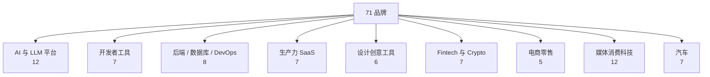

Sources: [README.md:54-150](../../../project-repos/awesome-design-md/README.md#L54-L150)

<details class="source-snippets">
<summary>引用源码</summary>

<!-- source-snippets:start -->

#### `README.md:54-150`

```markdown
### AI & LLM Platforms

- [**Claude**](https://getdesign.md/claude/design-md) - Anthropic's AI assistant. Warm terracotta accent, clean editorial layout
- [**Cohere**](https://getdesign.md/cohere/design-md) - Enterprise AI platform. Vibrant gradients, data-rich dashboard aesthetic
- [**ElevenLabs**](https://getdesign.md/elevenlabs/design-md) - AI voice platform. Dark cinematic UI, audio-waveform aesthetics
- [**Minimax**](https://getdesign.md/minimax/design-md) - AI model provider. Bold dark interface with neon accents
- [**Mistral AI**](https://getdesign.md/mistral.ai/design-md) - Open-weight LLM provider. French-engineered minimalism, purple-toned
- [**Ollama**](https://getdesign.md/ollama/design-md) - Run LLMs locally. Terminal-first, monochrome simplicity
- [**OpenCode AI**](https://getdesign.md/opencode.ai/design-md) - AI coding platform. Developer-centric dark theme
- [**Replicate**](https://getdesign.md/replicate/design-md) - Run ML models via API. Clean white canvas, code-forward
- [**Runway**](https://getdesign.md/runwayml/design-md) - AI creative-tools platform with an editorial film-festival aesthetic — cinematic dark heroes, paper-white reading bands, single proprietary sans, and pure black pill CTAs.
- [**Together AI**](https://getdesign.md/together.ai/design-md) - Open-source AI infrastructure. Technical, blueprint-style design
- [**VoltAgent**](https://getdesign.md/voltagent/design-md) - AI agent framework. Void-black canvas, emerald accent, terminal-native
- [**xAI**](https://getdesign.md/x.ai/design-md) - Elon Musk's AI lab. Stark monochrome, futuristic minimalism

### Developer Tools & IDEs

- [**Cursor**](https://getdesign.md/cursor/design-md) - AI-first code editor. Sleek dark interface, gradient accents
- [**Expo**](https://getdesign.md/expo/design-md) - React Native platform. Dark theme, tight letter-spacing, code-centric
- [**Lovable**](https://getdesign.md/lovable/design-md) - AI full-stack builder. Playful gradients, friendly dev aesthetic
- [**Raycast**](https://getdesign.md/raycast/design-md) - Productivity launcher. Sleek dark chrome, vibrant gradient accents
- [**Superhuman**](https://getdesign.md/superhuman/design-md) - Fast email client. Premium dark UI, keyboard-first, purple glow
- [**Vercel**](https://getdesign.md/vercel/design-md) - Frontend deployment platform. Black and white precision, Geist font
- [**Warp**](https://getdesign.md/warp/design-md) - Modern terminal. Dark IDE-like interface, block-based command UI

### Backend, Database & DevOps

- [**ClickHouse**](https://getdesign.md/clickhouse/design-md) - Fast analytics database. Yellow-accented, technical documentation style
- [**Composio**](https://getdesign.md/composio/design-md) - Tool integration platform. Modern dark with colorful integration icons
- [**HashiCorp**](https://getdesign.md/hashicorp/design-md) - Infrastructure automation. Enterprise-clean, black and white
- [**MongoDB**](https://getdesign.md/mongodb/design-md) - Document database. Green leaf branding, developer documentation focus
- [**PostHog**](https://getdesign.md/posthog/design-md) - Product analytics. Playful hedgehog branding, developer-friendly dark UI
- [**Sanity**](https://getdesign.md/sanity/design-md) - Headless content platform with a dark-first editorial marketing surface — 112px display type, IBM Plex Mono technical eyebrows, and a single coral-red accent reserved for the highest-priority CTA.
- [**Sentry**](https://getdesign.md/sentry/design-md) - Error monitoring. Dark dashboard, data-dense, pink-purple accent
- [**Supabase**](https://getdesign.md/supabase/design-md) - Open-source Firebase alternative. Dark emerald theme, code-first

### Productivity & SaaS

- [**Cal.com**](https://getdesign.md/cal/design-md) - Open-source scheduling. Clean neutral UI, developer-oriented simplicity
- [**Intercom**](https://getdesign.md/intercom/design-md) - Customer messaging. Friendly blue palette, conversational UI patterns
- [**Linear**](https://getdesign.md/linear.app/design-md) - Project management for engineers. Ultra-minimal, precise, purple accent
- [**Mintlify**](https://getdesign.md/mintlify/design-md) - Documentation platform. Clean, green-accented, reading-optimized
- [**Notion**](https://getdesign.md/notion/design-md) - All-in-one workspace. Warm minimalism, serif headings, soft surfaces
- [**Resend**](https://getdesign.md/resend/design-md) - Email API for developers. Minimal dark theme, monospace accents
- [**Zapier**](https://getdesign.md/zapier/design-md) - Automation platform. Warm orange, friendly illustration-driven

### Design & Creative Tools

- [**Airtable**](https://getdesign.md/airtable/design-md) - Spreadsheet-database hybrid. Colorful, friendly, structured data aesthetic
- [**Clay**](https://getdesign.md/clay/design-md) - Creative agency. Organic shapes, soft gradients, art-directed layout
- [**Figma**](https://getdesign.md/figma/design-md) - Collaborative design tool. Vibrant multi-color, playful yet professional
- [**Framer**](https://getdesign.md/framer/design-md) - Website builder. Bold black and blue, motion-first, design-forward
- [**Miro**](https://getdesign.md/miro/design-md) - Visual collaboration. Bright yellow accent, infinite canvas aesthetic
- [**Webflow**](https://getdesign.md/webflow/design-md) - Visual web builder. Blue-accented, polished marketing site aesthetic

### Fintech & Crypto

- [**Binance**](https://getdesign.md/binance/design-md) - Crypto exchange. Bold Binance Yellow on monochrome, trading-floor urgency
- [**Coinbase**](https://getdesign.md/coinbase/design-md) - Crypto exchange. Clean blue identity, trust-focused, institutional feel
- [**Kraken**](https://getdesign.md/kraken/design-md) - Crypto trading platform. Purple-accented dark UI, data-dense dashboards
- [**Mastercard**](https://getdesign.md/mastercard/design-md) - Global payments network. Warm cream canvas, orbital pill shapes, editorial warmth
- [**Revolut**](https://getdesign.md/revolut/design-md) - Digital banking. Sleek dark interface, gradient cards, fintech precision
- [**Stripe**](https://getdesign.md/stripe/design-md) - Payment infrastructure. Signature purple gradients, weight-300 elegance
- [**Wise**](https://getdesign.md/wise/design-md) - International money transfer. Bright green accent, friendly and clear

### E-commerce & Retail

- [**Airbnb**](https://getdesign.md/airbnb/design-md) - Travel marketplace. Warm coral accent, photography-driven, rounded UI
- [**Meta**](https://getdesign.md/meta/design-md) - Tech retail store. Photography-first, binary light/dark surfaces, Meta Blue CTAs
- [**Nike**](https://getdesign.md/nike/design-md) - Athletic retail. Monochrome UI, massive uppercase Futura, full-bleed photography
- [**Shopify**](https://getdesign.md/shopify/design-md) - E-commerce platform. Dark-first cinematic, neon green accent, ultra-light display type
- [**Starbucks**](https://getdesign.md/starbucks/design-md) - Coffee retail flagship. Four-tier earth-green system, warm cream canvas, proprietary SoDoSans typography

### Media & Consumer Tech

- [**Apple**](https://getdesign.md/apple/design-md) - Consumer electronics. Premium white space, SF Pro, cinematic imagery
- [**HP**](https://getdesign.md/hp/design-md) - PC and printer maker. Pure white canvas, HP Electric Blue signal CTA, geometric Forma DJR Micro, blue chevron decorations
- [**IBM**](https://getdesign.md/ibm/design-md) - Enterprise technology. Carbon design system, structured blue palette
- [**NVIDIA**](https://getdesign.md/nvidia/design-md) - GPU computing. Green-black energy, technical power aesthetic
- [**Pinterest**](https://getdesign.md/pinterest/design-md) - Visual discovery platform. Red accent, masonry grid, image-first
- [**PlayStation**](https://getdesign.md/playstation/design-md) - Gaming console retail. Three-surface channel layout, cyan hover-scale interaction
- [**SpaceX**](https://getdesign.md/spacex/design-md) - Space technology. Stark black and white, full-bleed imagery, futuristic
- [**Spotify**](https://getdesign.md/spotify/design-md) - Music streaming. Vibrant green on dark, bold type, album-art-driven
- [**The Verge**](https://getdesign.md/theverge/design-md) - Tech editorial media. Acid-mint and ultraviolet accents, Manuka display type
- [**Uber**](https://getdesign.md/uber/design-md) - Mobility platform. Bold black and white, tight type, urban energy
- [**Vodafone**](https://getdesign.md/vodafone/design-md) - Global telecom brand. Monumental uppercase display, Vodafone Red chapter bands
- [**WIRED**](https://getdesign.md/wired/design-md) - Tech magazine. Paper-white broadsheet density, custom serif, ink-blue links

### Automotive

- [**BMW**](https://getdesign.md/bmw/design-md) - Luxury automotive. Dark premium surfaces, precise German engineering aesthetic
- [**BMW M**](https://getdesign.md/bmw-m/design-md) - Performance automotive. Motorsport-inspired contrast, M color accents, precision-driven layout
- [**Bugatti**](https://getdesign.md/bugatti/design-md) - Luxury hypercar. Cinema-black canvas, monochrome austerity, monumental display type
- [**Ferrari**](https://getdesign.md/ferrari/design-md) - Luxury automotive. Chiaroscuro black-white editorial, Ferrari Red with extreme sparseness
- [**Lamborghini**](https://getdesign.md/lamborghini/design-md) - Luxury automotive. True black cathedral, gold accent, LamboType custom Neo-Grotesk
- [**Renault**](https://getdesign.md/renault/design-md) - French automotive. Vivid aurora gradients, NouvelR proprietary typeface, zero-radius buttons
- [**Tesla**](https://getdesign.md/tesla/design-md) - Electric vehicles. Radical subtraction, cinematic full-viewport photography, Universal Sans
```

<!-- source-snippets:end -->
</details>

## 分类明细

### AI 与 LLM 平台（12）

Claude、Cohere、ElevenLabs、Minimax、Mistral AI、Ollama、OpenCode AI、Replicate、Runway、Together AI、VoltAgent、xAI。

**气质跨度**：Ollama 的 terminal-first monochrome ↔ ElevenLabs 的 cinematic dark ↔ Cohere 的 data-rich gradient dashboard。

### 开发者工具与 IDE（7）

Cursor、Expo、Lovable、Raycast、Superhuman、Vercel、Warp。

**共性**：dark-first 或 high-contrast developer aesthetic；多数强调 monospace + gradient accent。

### 后端、Database 与 DevOps（8）

ClickHouse、Composio、HashiCorp、MongoDB、PostHog、Sanity、Sentry、Supabase。

**共性**：文档/仪表盘混合；yellow-green-pink 等品牌色强绑定。

### 生产力与 SaaS（7）

Cal.com、Intercom、Linear、Mintlify、Notion、Resend、Zapier。

**Linear / Notion** 是「极简工程审美」与「warm minimalism」两极代表。

### 设计创意工具（6）

Airtable、Clay、Figma、Framer、Miro、Webflow。

### Fintech 与 Crypto（7）

Binance、Coinbase、Kraken、Mastercard、Revolut、Stripe、Wise。

Stripe 的 purple gradient + weight-300 是 fintech 类常被引用的基准。

### 电商与零售（5）

Airbnb、Meta、Nike、Shopify、Starbucks。

### 媒体与消费科技（12）

Apple、HP、IBM、NVIDIA、Pinterest、PlayStation、SpaceX、Spotify、The Verge、Uber、Vodafone、WIRED。

### 汽车（7）

BMW、BMW M、Bugatti、Ferrari、Lamborghini、Renault、Tesla。

**luxury automotive** 子集共享 cinema-black + monumental display type 模式。

Sources: [README.md:54-150](../../../project-repos/awesome-design-md/README.md#L54-L150)

<details class="source-snippets">
<summary>引用源码</summary>

<!-- source-snippets:start -->

#### `README.md:54-150`

```markdown
### AI & LLM Platforms

- [**Claude**](https://getdesign.md/claude/design-md) - Anthropic's AI assistant. Warm terracotta accent, clean editorial layout
- [**Cohere**](https://getdesign.md/cohere/design-md) - Enterprise AI platform. Vibrant gradients, data-rich dashboard aesthetic
- [**ElevenLabs**](https://getdesign.md/elevenlabs/design-md) - AI voice platform. Dark cinematic UI, audio-waveform aesthetics
- [**Minimax**](https://getdesign.md/minimax/design-md) - AI model provider. Bold dark interface with neon accents
- [**Mistral AI**](https://getdesign.md/mistral.ai/design-md) - Open-weight LLM provider. French-engineered minimalism, purple-toned
- [**Ollama**](https://getdesign.md/ollama/design-md) - Run LLMs locally. Terminal-first, monochrome simplicity
- [**OpenCode AI**](https://getdesign.md/opencode.ai/design-md) - AI coding platform. Developer-centric dark theme
- [**Replicate**](https://getdesign.md/replicate/design-md) - Run ML models via API. Clean white canvas, code-forward
- [**Runway**](https://getdesign.md/runwayml/design-md) - AI creative-tools platform with an editorial film-festival aesthetic — cinematic dark heroes, paper-white reading bands, single proprietary sans, and pure black pill CTAs.
- [**Together AI**](https://getdesign.md/together.ai/design-md) - Open-source AI infrastructure. Technical, blueprint-style design
- [**VoltAgent**](https://getdesign.md/voltagent/design-md) - AI agent framework. Void-black canvas, emerald accent, terminal-native
- [**xAI**](https://getdesign.md/x.ai/design-md) - Elon Musk's AI lab. Stark monochrome, futuristic minimalism

### Developer Tools & IDEs

- [**Cursor**](https://getdesign.md/cursor/design-md) - AI-first code editor. Sleek dark interface, gradient accents
- [**Expo**](https://getdesign.md/expo/design-md) - React Native platform. Dark theme, tight letter-spacing, code-centric
- [**Lovable**](https://getdesign.md/lovable/design-md) - AI full-stack builder. Playful gradients, friendly dev aesthetic
- [**Raycast**](https://getdesign.md/raycast/design-md) - Productivity launcher. Sleek dark chrome, vibrant gradient accents
- [**Superhuman**](https://getdesign.md/superhuman/design-md) - Fast email client. Premium dark UI, keyboard-first, purple glow
- [**Vercel**](https://getdesign.md/vercel/design-md) - Frontend deployment platform. Black and white precision, Geist font
- [**Warp**](https://getdesign.md/warp/design-md) - Modern terminal. Dark IDE-like interface, block-based command UI

### Backend, Database & DevOps

- [**ClickHouse**](https://getdesign.md/clickhouse/design-md) - Fast analytics database. Yellow-accented, technical documentation style
- [**Composio**](https://getdesign.md/composio/design-md) - Tool integration platform. Modern dark with colorful integration icons
- [**HashiCorp**](https://getdesign.md/hashicorp/design-md) - Infrastructure automation. Enterprise-clean, black and white
- [**MongoDB**](https://getdesign.md/mongodb/design-md) - Document database. Green leaf branding, developer documentation focus
- [**PostHog**](https://getdesign.md/posthog/design-md) - Product analytics. Playful hedgehog branding, developer-friendly dark UI
- [**Sanity**](https://getdesign.md/sanity/design-md) - Headless content platform with a dark-first editorial marketing surface — 112px display type, IBM Plex Mono technical eyebrows, and a single coral-red accent reserved for the highest-priority CTA.
- [**Sentry**](https://getdesign.md/sentry/design-md) - Error monitoring. Dark dashboard, data-dense, pink-purple accent
- [**Supabase**](https://getdesign.md/supabase/design-md) - Open-source Firebase alternative. Dark emerald theme, code-first

### Productivity & SaaS

- [**Cal.com**](https://getdesign.md/cal/design-md) - Open-source scheduling. Clean neutral UI, developer-oriented simplicity
- [**Intercom**](https://getdesign.md/intercom/design-md) - Customer messaging. Friendly blue palette, conversational UI patterns
- [**Linear**](https://getdesign.md/linear.app/design-md) - Project management for engineers. Ultra-minimal, precise, purple accent
- [**Mintlify**](https://getdesign.md/mintlify/design-md) - Documentation platform. Clean, green-accented, reading-optimized
- [**Notion**](https://getdesign.md/notion/design-md) - All-in-one workspace. Warm minimalism, serif headings, soft surfaces
- [**Resend**](https://getdesign.md/resend/design-md) - Email API for developers. Minimal dark theme, monospace accents
- [**Zapier**](https://getdesign.md/zapier/design-md) - Automation platform. Warm orange, friendly illustration-driven

### Design & Creative Tools

- [**Airtable**](https://getdesign.md/airtable/design-md) - Spreadsheet-database hybrid. Colorful, friendly, structured data aesthetic
- [**Clay**](https://getdesign.md/clay/design-md) - Creative agency. Organic shapes, soft gradients, art-directed layout
- [**Figma**](https://getdesign.md/figma/design-md) - Collaborative design tool. Vibrant multi-color, playful yet professional
- [**Framer**](https://getdesign.md/framer/design-md) - Website builder. Bold black and blue, motion-first, design-forward
- [**Miro**](https://getdesign.md/miro/design-md) - Visual collaboration. Bright yellow accent, infinite canvas aesthetic
- [**Webflow**](https://getdesign.md/webflow/design-md) - Visual web builder. Blue-accented, polished marketing site aesthetic

### Fintech & Crypto

- [**Binance**](https://getdesign.md/binance/design-md) - Crypto exchange. Bold Binance Yellow on monochrome, trading-floor urgency
- [**Coinbase**](https://getdesign.md/coinbase/design-md) - Crypto exchange. Clean blue identity, trust-focused, institutional feel
- [**Kraken**](https://getdesign.md/kraken/design-md) - Crypto trading platform. Purple-accented dark UI, data-dense dashboards
- [**Mastercard**](https://getdesign.md/mastercard/design-md) - Global payments network. Warm cream canvas, orbital pill shapes, editorial warmth
- [**Revolut**](https://getdesign.md/revolut/design-md) - Digital banking. Sleek dark interface, gradient cards, fintech precision
- [**Stripe**](https://getdesign.md/stripe/design-md) - Payment infrastructure. Signature purple gradients, weight-300 elegance
- [**Wise**](https://getdesign.md/wise/design-md) - International money transfer. Bright green accent, friendly and clear

### E-commerce & Retail

- [**Airbnb**](https://getdesign.md/airbnb/design-md) - Travel marketplace. Warm coral accent, photography-driven, rounded UI
- [**Meta**](https://getdesign.md/meta/design-md) - Tech retail store. Photography-first, binary light/dark surfaces, Meta Blue CTAs
- [**Nike**](https://getdesign.md/nike/design-md) - Athletic retail. Monochrome UI, massive uppercase Futura, full-bleed photography
- [**Shopify**](https://getdesign.md/shopify/design-md) - E-commerce platform. Dark-first cinematic, neon green accent, ultra-light display type
- [**Starbucks**](https://getdesign.md/starbucks/design-md) - Coffee retail flagship. Four-tier earth-green system, warm cream canvas, proprietary SoDoSans typography

### Media & Consumer Tech

- [**Apple**](https://getdesign.md/apple/design-md) - Consumer electronics. Premium white space, SF Pro, cinematic imagery
- [**HP**](https://getdesign.md/hp/design-md) - PC and printer maker. Pure white canvas, HP Electric Blue signal CTA, geometric Forma DJR Micro, blue chevron decorations
- [**IBM**](https://getdesign.md/ibm/design-md) - Enterprise technology. Carbon design system, structured blue palette
- [**NVIDIA**](https://getdesign.md/nvidia/design-md) - GPU computing. Green-black energy, technical power aesthetic
- [**Pinterest**](https://getdesign.md/pinterest/design-md) - Visual discovery platform. Red accent, masonry grid, image-first
- [**PlayStation**](https://getdesign.md/playstation/design-md) - Gaming console retail. Three-surface channel layout, cyan hover-scale interaction
- [**SpaceX**](https://getdesign.md/spacex/design-md) - Space technology. Stark black and white, full-bleed imagery, futuristic
- [**Spotify**](https://getdesign.md/spotify/design-md) - Music streaming. Vibrant green on dark, bold type, album-art-driven
- [**The Verge**](https://getdesign.md/theverge/design-md) - Tech editorial media. Acid-mint and ultraviolet accents, Manuka display type
- [**Uber**](https://getdesign.md/uber/design-md) - Mobility platform. Bold black and white, tight type, urban energy
- [**Vodafone**](https://getdesign.md/vodafone/design-md) - Global telecom brand. Monumental uppercase display, Vodafone Red chapter bands
- [**WIRED**](https://getdesign.md/wired/design-md) - Tech magazine. Paper-white broadsheet density, custom serif, ink-blue links

### Automotive

- [**BMW**](https://getdesign.md/bmw/design-md) - Luxury automotive. Dark premium surfaces, precise German engineering aesthetic
- [**BMW M**](https://getdesign.md/bmw-m/design-md) - Performance automotive. Motorsport-inspired contrast, M color accents, precision-driven layout
- [**Bugatti**](https://getdesign.md/bugatti/design-md) - Luxury hypercar. Cinema-black canvas, monochrome austerity, monumental display type
- [**Ferrari**](https://getdesign.md/ferrari/design-md) - Luxury automotive. Chiaroscuro black-white editorial, Ferrari Red with extreme sparseness
- [**Lamborghini**](https://getdesign.md/lamborghini/design-md) - Luxury automotive. True black cathedral, gold accent, LamboType custom Neo-Grotesk
- [**Renault**](https://getdesign.md/renault/design-md) - French automotive. Vivid aurora gradients, NouvelR proprietary typeface, zero-radius buttons
- [**Tesla**](https://getdesign.md/tesla/design-md) - Electric vehicles. Radical subtraction, cinematic full-viewport photography, Universal Sans
```

<!-- source-snippets:end -->
</details>

## slug 与选型指南

| 你的场景 | 推荐起步 slug | 理由 |
|----------|---------------|------|
| Developer landing + dark | `vercel`, `voltagent`, `supabase` | 完整 token + Do's/Don'ts |
| 极简 B2B SaaS | `linear.app`, `resend` | 低密度、精确 spacing |
| Warm productivity | `notion`, `cal` | 暖色 surface、serif 标题 |
| Fintech trust | `stripe`, `wise` | 渐变与 institutional tone |
| Editorial / media | `wired`, `theverge` | 排版驱动、非典型 dev UI |
| 暗色 AI 产品 | `elevenlabs`, `cursor` | cinematic / IDE hybrid |

Sources: [README.md:56-67](../../../project-repos/awesome-design-md/README.md#L56-L67), [README.md:90-98](../../../project-repos/awesome-design-md/README.md#L90-L98)

<details class="source-snippets">
<summary>引用源码</summary>

<!-- source-snippets:start -->

#### `README.md:56-67`

```markdown
- [**Claude**](https://getdesign.md/claude/design-md) - Anthropic's AI assistant. Warm terracotta accent, clean editorial layout
- [**Cohere**](https://getdesign.md/cohere/design-md) - Enterprise AI platform. Vibrant gradients, data-rich dashboard aesthetic
- [**ElevenLabs**](https://getdesign.md/elevenlabs/design-md) - AI voice platform. Dark cinematic UI, audio-waveform aesthetics
- [**Minimax**](https://getdesign.md/minimax/design-md) - AI model provider. Bold dark interface with neon accents
- [**Mistral AI**](https://getdesign.md/mistral.ai/design-md) - Open-weight LLM provider. French-engineered minimalism, purple-toned
- [**Ollama**](https://getdesign.md/ollama/design-md) - Run LLMs locally. Terminal-first, monochrome simplicity
- [**OpenCode AI**](https://getdesign.md/opencode.ai/design-md) - AI coding platform. Developer-centric dark theme
- [**Replicate**](https://getdesign.md/replicate/design-md) - Run ML models via API. Clean white canvas, code-forward
- [**Runway**](https://getdesign.md/runwayml/design-md) - AI creative-tools platform with an editorial film-festival aesthetic — cinematic dark heroes, paper-white reading bands, single proprietary sans, and pure black pill CTAs.
- [**Together AI**](https://getdesign.md/together.ai/design-md) - Open-source AI infrastructure. Technical, blueprint-style design
- [**VoltAgent**](https://getdesign.md/voltagent/design-md) - AI agent framework. Void-black canvas, emerald accent, terminal-native
- [**xAI**](https://getdesign.md/x.ai/design-md) - Elon Musk's AI lab. Stark monochrome, futuristic minimalism
```

#### `README.md:90-98`

```markdown
### Productivity & SaaS

- [**Cal.com**](https://getdesign.md/cal/design-md) - Open-source scheduling. Clean neutral UI, developer-oriented simplicity
- [**Intercom**](https://getdesign.md/intercom/design-md) - Customer messaging. Friendly blue palette, conversational UI patterns
- [**Linear**](https://getdesign.md/linear.app/design-md) - Project management for engineers. Ultra-minimal, precise, purple accent
- [**Mintlify**](https://getdesign.md/mintlify/design-md) - Documentation platform. Clean, green-accented, reading-optimized
- [**Notion**](https://getdesign.md/notion/design-md) - All-in-one workspace. Warm minimalism, serif headings, soft surfaces
- [**Resend**](https://getdesign.md/resend/design-md) - Email API for developers. Minimal dark theme, monospace accents
- [**Zapier**](https://getdesign.md/zapier/design-md) - Automation platform. Warm orange, friendly illustration-driven
```

<!-- source-snippets:end -->
</details>

## 列表维护方式

README Collection 是**手工策展列表**——不是脚本从 `design-md/` glob 生成。新增品牌 = 新子目录 + README 对应段落 + badge 计数更新。这保证每条有一行 human-written 气质摘要，而非自动生成目录。

Sources: [README.md:52-150](../../../project-repos/awesome-design-md/README.md#L52-L150)

<details class="source-snippets">
<summary>引用源码</summary>

<!-- source-snippets:start -->

#### `README.md:52-150`

```markdown
## Collection

### AI & LLM Platforms

- [**Claude**](https://getdesign.md/claude/design-md) - Anthropic's AI assistant. Warm terracotta accent, clean editorial layout
- [**Cohere**](https://getdesign.md/cohere/design-md) - Enterprise AI platform. Vibrant gradients, data-rich dashboard aesthetic
- [**ElevenLabs**](https://getdesign.md/elevenlabs/design-md) - AI voice platform. Dark cinematic UI, audio-waveform aesthetics
- [**Minimax**](https://getdesign.md/minimax/design-md) - AI model provider. Bold dark interface with neon accents
- [**Mistral AI**](https://getdesign.md/mistral.ai/design-md) - Open-weight LLM provider. French-engineered minimalism, purple-toned
- [**Ollama**](https://getdesign.md/ollama/design-md) - Run LLMs locally. Terminal-first, monochrome simplicity
- [**OpenCode AI**](https://getdesign.md/opencode.ai/design-md) - AI coding platform. Developer-centric dark theme
- [**Replicate**](https://getdesign.md/replicate/design-md) - Run ML models via API. Clean white canvas, code-forward
- [**Runway**](https://getdesign.md/runwayml/design-md) - AI creative-tools platform with an editorial film-festival aesthetic — cinematic dark heroes, paper-white reading bands, single proprietary sans, and pure black pill CTAs.
- [**Together AI**](https://getdesign.md/together.ai/design-md) - Open-source AI infrastructure. Technical, blueprint-style design
- [**VoltAgent**](https://getdesign.md/voltagent/design-md) - AI agent framework. Void-black canvas, emerald accent, terminal-native
- [**xAI**](https://getdesign.md/x.ai/design-md) - Elon Musk's AI lab. Stark monochrome, futuristic minimalism

### Developer Tools & IDEs

- [**Cursor**](https://getdesign.md/cursor/design-md) - AI-first code editor. Sleek dark interface, gradient accents
- [**Expo**](https://getdesign.md/expo/design-md) - React Native platform. Dark theme, tight letter-spacing, code-centric
- [**Lovable**](https://getdesign.md/lovable/design-md) - AI full-stack builder. Playful gradients, friendly dev aesthetic
- [**Raycast**](https://getdesign.md/raycast/design-md) - Productivity launcher. Sleek dark chrome, vibrant gradient accents
- [**Superhuman**](https://getdesign.md/superhuman/design-md) - Fast email client. Premium dark UI, keyboard-first, purple glow
- [**Vercel**](https://getdesign.md/vercel/design-md) - Frontend deployment platform. Black and white precision, Geist font
- [**Warp**](https://getdesign.md/warp/design-md) - Modern terminal. Dark IDE-like interface, block-based command UI

### Backend, Database & DevOps

- [**ClickHouse**](https://getdesign.md/clickhouse/design-md) - Fast analytics database. Yellow-accented, technical documentation style
- [**Composio**](https://getdesign.md/composio/design-md) - Tool integration platform. Modern dark with colorful integration icons
- [**HashiCorp**](https://getdesign.md/hashicorp/design-md) - Infrastructure automation. Enterprise-clean, black and white
- [**MongoDB**](https://getdesign.md/mongodb/design-md) - Document database. Green leaf branding, developer documentation focus
- [**PostHog**](https://getdesign.md/posthog/design-md) - Product analytics. Playful hedgehog branding, developer-friendly dark UI
- [**Sanity**](https://getdesign.md/sanity/design-md) - Headless content platform with a dark-first editorial marketing surface — 112px display type, IBM Plex Mono technical eyebrows, and a single coral-red accent reserved for the highest-priority CTA.
- [**Sentry**](https://getdesign.md/sentry/design-md) - Error monitoring. Dark dashboard, data-dense, pink-purple accent
- [**Supabase**](https://getdesign.md/supabase/design-md) - Open-source Firebase alternative. Dark emerald theme, code-first

### Productivity & SaaS

- [**Cal.com**](https://getdesign.md/cal/design-md) - Open-source scheduling. Clean neutral UI, developer-oriented simplicity
- [**Intercom**](https://getdesign.md/intercom/design-md) - Customer messaging. Friendly blue palette, conversational UI patterns
- [**Linear**](https://getdesign.md/linear.app/design-md) - Project management for engineers. Ultra-minimal, precise, purple accent
- [**Mintlify**](https://getdesign.md/mintlify/design-md) - Documentation platform. Clean, green-accented, reading-optimized
- [**Notion**](https://getdesign.md/notion/design-md) - All-in-one workspace. Warm minimalism, serif headings, soft surfaces
- [**Resend**](https://getdesign.md/resend/design-md) - Email API for developers. Minimal dark theme, monospace accents
- [**Zapier**](https://getdesign.md/zapier/design-md) - Automation platform. Warm orange, friendly illustration-driven

### Design & Creative Tools

- [**Airtable**](https://getdesign.md/airtable/design-md) - Spreadsheet-database hybrid. Colorful, friendly, structured data aesthetic
- [**Clay**](https://getdesign.md/clay/design-md) - Creative agency. Organic shapes, soft gradients, art-directed layout
- [**Figma**](https://getdesign.md/figma/design-md) - Collaborative design tool. Vibrant multi-color, playful yet professional
- [**Framer**](https://getdesign.md/framer/design-md) - Website builder. Bold black and blue, motion-first, design-forward
- [**Miro**](https://getdesign.md/miro/design-md) - Visual collaboration. Bright yellow accent, infinite canvas aesthetic
- [**Webflow**](https://getdesign.md/webflow/design-md) - Visual web builder. Blue-accented, polished marketing site aesthetic

### Fintech & Crypto

- [**Binance**](https://getdesign.md/binance/design-md) - Crypto exchange. Bold Binance Yellow on monochrome, trading-floor urgency
- [**Coinbase**](https://getdesign.md/coinbase/design-md) - Crypto exchange. Clean blue identity, trust-focused, institutional feel
- [**Kraken**](https://getdesign.md/kraken/design-md) - Crypto trading platform. Purple-accented dark UI, data-dense dashboards
- [**Mastercard**](https://getdesign.md/mastercard/design-md) - Global payments network. Warm cream canvas, orbital pill shapes, editorial warmth
- [**Revolut**](https://getdesign.md/revolut/design-md) - Digital banking. Sleek dark interface, gradient cards, fintech precision
- [**Stripe**](https://getdesign.md/stripe/design-md) - Payment infrastructure. Signature purple gradients, weight-300 elegance
- [**Wise**](https://getdesign.md/wise/design-md) - International money transfer. Bright green accent, friendly and clear

### E-commerce & Retail

- [**Airbnb**](https://getdesign.md/airbnb/design-md) - Travel marketplace. Warm coral accent, photography-driven, rounded UI
- [**Meta**](https://getdesign.md/meta/design-md) - Tech retail store. Photography-first, binary light/dark surfaces, Meta Blue CTAs
- [**Nike**](https://getdesign.md/nike/design-md) - Athletic retail. Monochrome UI, massive uppercase Futura, full-bleed photography
- [**Shopify**](https://getdesign.md/shopify/design-md) - E-commerce platform. Dark-first cinematic, neon green accent, ultra-light display type
- [**Starbucks**](https://getdesign.md/starbucks/design-md) - Coffee retail flagship. Four-tier earth-green system, warm cream canvas, proprietary SoDoSans typography

### Media & Consumer Tech

- [**Apple**](https://getdesign.md/apple/design-md) - Consumer electronics. Premium white space, SF Pro, cinematic imagery
- [**HP**](https://getdesign.md/hp/design-md) - PC and printer maker. Pure white canvas, HP Electric Blue signal CTA, geometric Forma DJR Micro, blue chevron decorations
- [**IBM**](https://getdesign.md/ibm/design-md) - Enterprise technology. Carbon design system, structured blue palette
- [**NVIDIA**](https://getdesign.md/nvidia/design-md) - GPU computing. Green-black energy, technical power aesthetic
- [**Pinterest**](https://getdesign.md/pinterest/design-md) - Visual discovery platform. Red accent, masonry grid, image-first
- [**PlayStation**](https://getdesign.md/playstation/design-md) - Gaming console retail. Three-surface channel layout, cyan hover-scale interaction
- [**SpaceX**](https://getdesign.md/spacex/design-md) - Space technology. Stark black and white, full-bleed imagery, futuristic
- [**Spotify**](https://getdesign.md/spotify/design-md) - Music streaming. Vibrant green on dark, bold type, album-art-driven
- [**The Verge**](https://getdesign.md/theverge/design-md) - Tech editorial media. Acid-mint and ultraviolet accents, Manuka display type
- [**Uber**](https://getdesign.md/uber/design-md) - Mobility platform. Bold black and white, tight type, urban energy
- [**Vodafone**](https://getdesign.md/vodafone/design-md) - Global telecom brand. Monumental uppercase display, Vodafone Red chapter bands
- [**WIRED**](https://getdesign.md/wired/design-md) - Tech magazine. Paper-white broadsheet density, custom serif, ink-blue links

### Automotive

- [**BMW**](https://getdesign.md/bmw/design-md) - Luxury automotive. Dark premium surfaces, precise German engineering aesthetic
- [**BMW M**](https://getdesign.md/bmw-m/design-md) - Performance automotive. Motorsport-inspired contrast, M color accents, precision-driven layout
- [**Bugatti**](https://getdesign.md/bugatti/design-md) - Luxury hypercar. Cinema-black canvas, monochrome austerity, monumental display type
- [**Ferrari**](https://getdesign.md/ferrari/design-md) - Luxury automotive. Chiaroscuro black-white editorial, Ferrari Red with extreme sparseness
- [**Lamborghini**](https://getdesign.md/lamborghini/design-md) - Luxury automotive. True black cathedral, gold accent, LamboType custom Neo-Grotesk
- [**Renault**](https://getdesign.md/renault/design-md) - French automotive. Vivid aurora gradients, NouvelR proprietary typeface, zero-radius buttons
- [**Tesla**](https://getdesign.md/tesla/design-md) - Electric vehicles. Radical subtraction, cinematic full-viewport photography, Universal Sans
```

<!-- source-snippets:end -->
</details>

## 相关页面

- [目录与仓库结构](catalog-architecture.md) — slug 目录约定
- [品牌档案深度对比](brand-profile-examples.md) — 具体档案对照
- [分发与 getdesign.md 生态](distribution-ecosystem.md) — 在线预览入口

---

<details>
<summary>相关源文件</summary>

生成本页时使用的主要源文件：

- [design-md/vercel/DESIGN.md](../../../project-repos/awesome-design-md/design-md/vercel/DESIGN.md)
- [design-md/voltagent/DESIGN.md](../../../project-repos/awesome-design-md/design-md/voltagent/DESIGN.md)
- [design-md/notion/DESIGN.md](../../../project-repos/awesome-design-md/design-md/notion/DESIGN.md)

</details>

# 品牌档案深度对比

三份档案代表库内三种典型「设计 posture」：**light developer platform（Vercel）**、**dark agent engineering（Voltagent）**、**warm workspace minimalism（Notion）**。对照它们的颜色策略、字体决策和组件 chrome，比浏览 71 份列表更能建立选型直觉。

## 一句话气质

| 品牌 | description 摘要 | 设计 posture |
|------|------------------|--------------|
| Vercel | stark black-and-ink duet + mesh gradient decoration | 工程师营销页：白底、ink CTA、gradient 仅 hero |
| Voltagent | near-black canvas + electric-green accent + code mockups in hero | 文档站式 marketing：dark 全程、mono 技术声 |
| Notion | warm minimalism, serif headings, soft surfaces | 生产力工具：暖灰 surface、低 contrast 友好 |

Sources: [design-md/vercel/DESIGN.md:1-4](../../../project-repos/awesome-design-md/design-md/vercel/DESIGN.md#L1-L4), [design-md/voltagent/DESIGN.md:1-4](../../../project-repos/awesome-design-md/design-md/voltagent/DESIGN.md#L1-L4), [design-md/notion/DESIGN.md:1-4](../../../project-repos/awesome-design-md/design-md/notion/DESIGN.md#L1-L4)

<details class="source-snippets">
<summary>引用源码</summary>

<!-- source-snippets:start -->

#### `design-md/vercel/DESIGN.md:1-4`

```markdown
---
version: alpha
name: Vercel-Inspired-design-analysis
description: An inspired interpretation of Vercel's design language — a developer-platform brand whose surface is a stark black-and-ink duet on near-white canvas, broken at hero scale by a multi-color mesh gradient (cyan / blue / magenta / amber) that acts as the entire decorative system, paired with a custom geometric sans for headlines and a monospaced caption face for technical labels.
```

#### `design-md/voltagent/DESIGN.md:1-4`

```markdown
---
version: alpha
name: Voltagent-Inspired-design-analysis
description: An inspired interpretation of Voltagent's design language — a developer-focused AI agent engineering platform whose surface is an unrelenting near-black canvas broken only by a single electric-green brand accent, code-editor mockups inside the hero, and a precise grid of dark feature cards that read like a documentation site dressed as marketing.
```

#### `design-md/notion/DESIGN.md:1-4`

```markdown
---
version: alpha
name: Notion-design-analysis
description: Notion presents itself as the all-in-one workspace through a confident, illustration-rich brand voice — anchored by a deep navy hero band ({colors.brand-navy}) decorated with brand-colored sticky-note dots and mesh wire illustrations, a signature purple pill primary CTA ({colors.primary}), and a rich palette of pastel-tinted feature cards that echo the colorful database properties of the live product. The system uses a Notion-Sans (Inter-based) typeface across every UI surface, anchors a 4-tier pricing comparison (Free / Plus / Business / Enterprise), and presents the live workspace UI mockup directly inside the hero band. Coverage spans homepage, Enterprise, Product AI, Product Agents, Startups, and Pricing surfaces.
```

<!-- source-snippets:end -->
</details>

## Primary 色策略

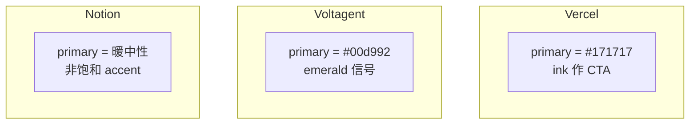

- **Vercel**：`primary` 即 near-black ink——conversion target 与 body text 同色阶，靠 pill shape 和 size 区分 CTA。
- **Voltagent**：green on `#101010` canvas；`on-primary` 反而是 near-black `#101010`（绿底黑字 inverted logic）。
- **Notion**：accent 克制，靠 serif display + soft canvas 层级建立品牌，而非高饱和 primary。

Sources: [design-md/vercel/DESIGN.md:6-14](../../../project-repos/awesome-design-md/design-md/vercel/DESIGN.md#L6-L14), [design-md/voltagent/DESIGN.md:6-19](../../../project-repos/awesome-design-md/design-md/voltagent/DESIGN.md#L6-L19)

<details class="source-snippets">
<summary>引用源码</summary>

<!-- source-snippets:start -->

#### `design-md/vercel/DESIGN.md:6-14`

```markdown
colors:
  primary: "#171717"
  on-primary: "#ffffff"
  ink: "#171717"
  body: "#4d4d4d"
  mute: "#888888"
  hairline: "#ebebeb"
  hairline-strong: "#a1a1a1"
  canvas: "#ffffff"
```

#### `design-md/voltagent/DESIGN.md:6-19`

```markdown
colors:
  primary: "#00d992"
  primary-soft: "#2fd6a1"
  primary-deep: "#10b981"
  on-primary: "#101010"
  ink: "#f2f2f2"
  ink-strong: "#ffffff"
  body: "#bdbdbd"
  mute: "#8b949e"
  hairline: "#3d3a39"
  hairline-soft: "#b8b3b0"
  canvas: "#101010"
  canvas-soft: "#1a1a1a"
  canvas-text-soft: "#f5f6f7"
```

<!-- source-snippets:end -->
</details>

## 字体与 Display 权重

| 维度 | Vercel | Voltagent | Notion |
|------|--------|-----------|--------|
| 主 sans | Geist | Inter | 品牌 sans + serif 标题 |
| Hero size | 48px / w600 | 60px / w400 | 更大 display、偏 editorial |
| Tracking | 激进负值 (-2.4px) | 适度负值 | serif 标题正 tracking |
| Mono 用途 | Geist Mono 技术眉 | SF Mono 命令片段 | 较少强调 terminal |

**Insight**：Voltagent 故意用 **400 weight @ 60px** 对抗「AI 营销必 bold」的 cliché——读 DESIGN.md Overview 时会看到 rationale 写「calming counter to AI marketing's tendency to shout」。

Sources: [design-md/voltagent/DESIGN.md:348-351](../../../project-repos/awesome-design-md/design-md/voltagent/DESIGN.md#L348-L351), [design-md/vercel/DESIGN.md:451-455](../../../project-repos/awesome-design-md/design-md/vercel/DESIGN.md#L451-L455)

<details class="source-snippets">
<summary>引用源码</summary>

<!-- source-snippets:start -->

#### `design-md/voltagent/DESIGN.md:348-351`

```markdown
### Principles
- **Inter regular at 60 px display** is the brand's calming counter to AI marketing's tendency to shout. The light tracking and modest weight read like documentation.
- **Two-face contrast carries the technical voice.** Inter for narrative; SF Mono for anything that could be typed at a terminal.
- **Uppercase eyebrow with tracking is the brand's signature label style.** `2.52 px` at 14 px is the documented value.
```

#### `design-md/vercel/DESIGN.md:451-455`

```markdown
### Font Family
Two custom faces carry the entire system:

1. **A custom geometric sans** (extracted as `Geist`) for every display, body, button, link, and label. Weights 400 / 500 / 600 are the working set; the face never appears in 700 or heavier. Display sizes are tracked aggressively negative (`-2.4 px` at 48 px hero, `-1.28 px` at 32 px section); body stays at neutral or slightly-negative tracking.
2. **A custom monospaced face** (extracted as `Geist Mono`) for terminal mockups, code blocks, and small mono-caption labels — anything that wants to signal "technical." Weight 400 only at 12 – 13 px. Tracking neutral.
```

<!-- source-snippets:end -->
</details>

## 装饰系统

- **Vercel**：唯一装饰是 **multi-stop mesh gradient**（develop/preview/ship 三色对），严格限制 hero scale；Do's 明确禁止 icon-scale gradient。
- **Voltagent**：几乎无 gradient；depth 来自 hairline border on dark cards +  occasional green divider band。
- **Notion**：soft surface 层级 + 插画/图标留白；摄影非主路径。

Sources: [design-md/vercel/DESIGN.md:441-447](../../../project-repos/awesome-design-md/design-md/vercel/DESIGN.md#L441-L447), [design-md/vercel/DESIGN.md:729-733](../../../project-repos/awesome-design-md/design-md/vercel/DESIGN.md#L729-L733)

<details class="source-snippets">
<summary>引用源码</summary>

<!-- source-snippets:start -->

#### `design-md/vercel/DESIGN.md:441-447`

```markdown
### Brand Gradient
The brand's signature decoration is a three-pair gradient stack:
- **Develop** (`{colors.gradient-develop-start}` `#007cf0` → `{colors.gradient-develop-end}` `#00dfd8`) — the blue-to-teal pair used to mark the "deploy" / "develop" rhythm.
- **Preview** (`{colors.gradient-preview-start}` `#7928ca` → `{colors.gradient-preview-end}` `#ff0080`) — the violet-to-pink pair used for "preview" surfaces.
- **Ship** (`{colors.gradient-ship-start}` `#ff4d4d` → `{colors.gradient-ship-end}` `#f9cb28`) — the coral-to-amber pair used for "ship" surfaces.

The three pairs collapse into a single multi-color mesh gradient when used as the hero atmospheric backdrop. Treat the gradient as one unified object — do not crop down to a single colour, do not reorder the stops, and do not miniaturise. Used at hero scale only.
```

#### `design-md/vercel/DESIGN.md:729-733`

```markdown
### Don't
- Don't introduce a sixth accent colour. The brand operates with ink + gray + the four-pair gradient palette; new accents flatten the voice.
- Don't render headlines in all-caps. Sentence-case + negative tracking is non-negotiable.
- Don't drop a single heavy drop-shadow on cards. The brand's elevation is built from stacked small offsets + inset hairline rings.
- Don't render the brand gradient at icon scale or in a single-colour reduced form. The gradient lives at hero scale only.
```

<!-- source-snippets:end -->
</details>

## 圆角与按钮 scale

Vercel 共存 **100px marketing pill** 与 **6px nav button**——Do's 警告不要在同一屏混用两种 scale。Voltagent 统一 **6px (`rounded.sm`)** 方角按钮。Notion 偏 **soft rounded** 卡片与 larger touch-friendly control。

Sources: [design-md/vercel/DESIGN.md:721-735](../../../project-repos/awesome-design-md/design-md/vercel/DESIGN.md#L721-L735), [design-md/voltagent/DESIGN.md:108-114](../../../project-repos/awesome-design-md/design-md/voltagent/DESIGN.md#L108-L114)

<details class="source-snippets">
<summary>引用源码</summary>

<!-- source-snippets:start -->

#### `design-md/vercel/DESIGN.md:721-735`

```markdown
- Reserve `{colors.primary}` (`#171717`) for primary CTAs across the page. Black ink IS the conversion target.
- Use `{rounded.pill}` 100 px for every marketing-scale CTA and `{rounded.sm}` 6 px for nav-scale buttons. The two pill scales coexist deliberately.
- Set every headline in `{typography.display-*}` weight 600, sentence-case, often period-terminated. Aggressive negative tracking is part of the voice.
- Use the brand mesh gradient as atmospheric decoration at hero scale only — never miniaturise it to an icon, never reduce to a single colour.
- Layer stacked shadows (multiple small offsets with inset hairline) rather than single heavy drops. The brand's elevation is calmer than Material.
- Cycle page surfaces in `{colors.canvas-soft}` → `{colors.canvas}` → `{colors.primary}` polarity-flipped bands; the dark band IS the depth cue.
- Set every code block and technical eyebrow in `{typography.code}` / `{typography.caption-mono}`. Mono is the voice of the platform.

### Don't
- Don't introduce a sixth accent colour. The brand operates with ink + gray + the four-pair gradient palette; new accents flatten the voice.
- Don't render headlines in all-caps. Sentence-case + negative tracking is non-negotiable.
- Don't drop a single heavy drop-shadow on cards. The brand's elevation is built from stacked small offsets + inset hairline rings.
- Don't render the brand gradient at icon scale or in a single-colour reduced form. The gradient lives at hero scale only.
- Don't promote the geometric sans to weight 700. The brand's display ceiling is 600.
- Don't pair the marketing 100-px pill CTA shape with the 6-px nav radius on the same screen — pick a scale and stay there.
```

#### `design-md/voltagent/DESIGN.md:108-114`

```markdown
rounded:
  none: 0px
  xs: 4px
  sm: 6px
  md: 8px
  pill: 9999px
  full: 9999px
```

<!-- source-snippets:end -->
</details>

## 文件体量与完整度

| 档案 | 约行数 | Responsive / Agent Guide |
|------|--------|----------------------------|
| Vercel | ~737 | 无（止于 Do's and Don'ts） |
| Voltagent | ~522 | 含 Layout breakpoints 表 |
| Notion | ~800+ | 含 Responsive + Agent Prompt Guide |

选档案时：要 **最完整 Do's/Don'ts** 看 Vercel；要 **dark dev product** 看 Voltagent；要 **warm SaaS** 看 Notion。

Sources: [design-md/vercel/DESIGN.md:718-737](../../../project-repos/awesome-design-md/design-md/vercel/DESIGN.md#L718-L737), [design-md/voltagent/DESIGN.md:369-383](../../../project-repos/awesome-design-md/design-md/voltagent/DESIGN.md#L369-L383)

<details class="source-snippets">
<summary>引用源码</summary>

<!-- source-snippets:start -->

#### `design-md/vercel/DESIGN.md:718-737`

```markdown
## Do's and Don'ts

### Do
- Reserve `{colors.primary}` (`#171717`) for primary CTAs across the page. Black ink IS the conversion target.
- Use `{rounded.pill}` 100 px for every marketing-scale CTA and `{rounded.sm}` 6 px for nav-scale buttons. The two pill scales coexist deliberately.
- Set every headline in `{typography.display-*}` weight 600, sentence-case, often period-terminated. Aggressive negative tracking is part of the voice.
- Use the brand mesh gradient as atmospheric decoration at hero scale only — never miniaturise it to an icon, never reduce to a single colour.
- Layer stacked shadows (multiple small offsets with inset hairline) rather than single heavy drops. The brand's elevation is calmer than Material.
- Cycle page surfaces in `{colors.canvas-soft}` → `{colors.canvas}` → `{colors.primary}` polarity-flipped bands; the dark band IS the depth cue.
- Set every code block and technical eyebrow in `{typography.code}` / `{typography.caption-mono}`. Mono is the voice of the platform.

### Don't
- Don't introduce a sixth accent colour. The brand operates with ink + gray + the four-pair gradient palette; new accents flatten the voice.
- Don't render headlines in all-caps. Sentence-case + negative tracking is non-negotiable.
- Don't drop a single heavy drop-shadow on cards. The brand's elevation is built from stacked small offsets + inset hairline rings.
- Don't render the brand gradient at icon scale or in a single-colour reduced form. The gradient lives at hero scale only.
- Don't promote the geometric sans to weight 700. The brand's display ceiling is 600.
- Don't pair the marketing 100-px pill CTA shape with the 6-px nav radius on the same screen — pick a scale and stay there.
- Don't set body paragraphs in the mono face. The mono is for code + technical labels only.
```

#### `design-md/voltagent/DESIGN.md:369-383`

```markdown
### Responsive Strategy

#### Breakpoints

| Name | Width | Key Changes |
|---|---|---|
| Mobile | < 768px | Hero 60→32 px; cards 1-up; nav hamburger. |
| Tablet | 768–1023px | Cards 2-up; nav stays horizontal. |
| Desktop | ≥ 1024px | Full 3-up card grids. |

#### Touch Targets
Buttons render at ~44 px tall (12 px vertical padding + 24 px line-height). Meet WCAG AAA at all breakpoints.

#### Collapsing Strategy
Nav collapses to hamburger at mobile; the menu overlay keeps the same green CTA pinned at the bottom. Feature-card grids drop to 1-up; hero typography scales fluidly.
```

<!-- source-snippets:end -->
</details>

## 代理选型决策树

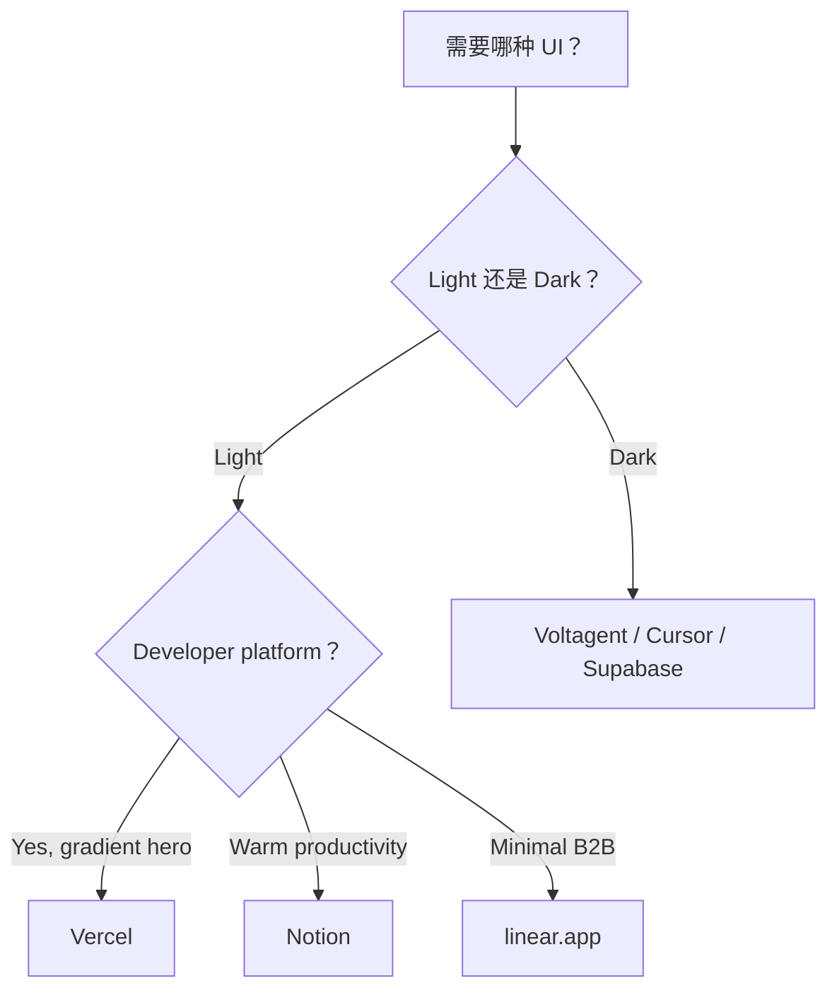

## 相关页面

- [品牌目录与分类](brand-catalog.md) — 全库分类
- [Token 与组件模型](token-component-model.md) — token 引用语法
- [代理消费工作流](agent-consumption.md) — 复制与 prompt

---

<details>
<summary>相关源文件</summary>

生成本页时使用的主要源文件：

- [README.md](../../../project-repos/awesome-design-md/README.md)
- [design-md/vercel/DESIGN.md](../../../project-repos/awesome-design-md/design-md/vercel/DESIGN.md)
- [design-md/sanity/DESIGN.md](../../../project-repos/awesome-design-md/design-md/sanity/DESIGN.md)

</details>

# 代理消费工作流

库的价值在「被代理读到并执行」——不是躺在 GitHub 当 reference。工作流极其短：复制单文件、声明约束、让代理在生成 UI 时引用 token 而非自由发挥。

## 三步使用法

README 写死的流程：

1. 从 `design-md/<slug>/` 复制 `DESIGN.md` 到**项目根目录**
2. 对 AI agent 声明使用它（自然语言即可）
3. 描述要建的页面/组件

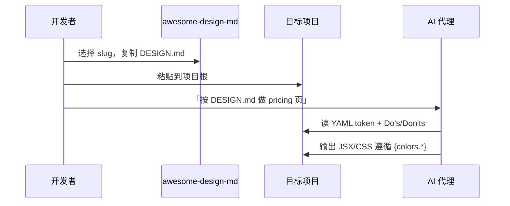

Sources: [README.md:177-181](../../../project-repos/awesome-design-md/README.md#L177-L181)

<details class="source-snippets">
<summary>引用源码</summary>

<!-- source-snippets:start -->

#### `README.md:177-181`

```markdown
### How to Use


1. Copy a site's `DESIGN.md` into your project root
2. Tell your AI agent to use it.
```

<!-- source-snippets:end -->
</details>

## 与 AGENTS.md 协同

若项目已有 `AGENTS.md`（构建/测试约定），**DESIGN.md 与之并列**，不互相替代：

| 场景 | AGENTS.md 管 | DESIGN.md 管 |
|------|--------------|--------------|
| 跑测试 | `pnpm test` | — |
| 组件库选型 | 可能指定 React + Tailwind | 颜色/圆角/字体层级 |
| PR 规范 | conventional commits | — |
| Landing 视觉 | — | primary hex、pill CTA、禁止 seventh accent |

代理 system prompt 或 Cursor rules 可同时 `@AGENTS.md` + `@DESIGN.md`；冲突时 **DESIGN.md 优先视觉决策**，AGENTS.md 优先工程约束。

Sources: [README.md:37-40](../../../project-repos/awesome-design-md/README.md#L37-L40)

<details class="source-snippets">
<summary>引用源码</summary>

<!-- source-snippets:start -->

#### `README.md:37-40`

```markdown
| File | Who reads it | What it defines |
|------|-------------|-----------------|
| `AGENTS.md` | Coding agents | How to build the project |
| `DESIGN.md` | Design agents | How the project should look and feel |
```

<!-- source-snippets:end -->
</details>

## 有效提示词模式

**模式 A — 整页生成**

> 阅读项目根目录 DESIGN.md。用 Next.js + Tailwind 实现 pricing 页。严格使用 `{colors.primary}` 作 CTA，遵守 Do's and Don'ts 里关于 gradient 尺度的规则。

**模式 B — 组件级**

> 按 DESIGN.md 的 `button-primary` 和 `card-feature` token 实现 FeatureGrid 组件，不要引入 DESIGN.md 未列出的 accent 色。

**模式 C — 风格迁移**

> 当前页面太像默认 shadcn。对照 DESIGN.md 的 Typography 表调整 display-xl 字重与 letter-spacing，并对照 Colors 节修正 surface 层级。

部分较新档案含 **`Agent Prompt Guide`** 节（如 Sanity、Starbucks）——内含现成 color quick reference 和 copy-paste prompt 片段，可直接作为模式 A 的起点。

Sources: [README.md:167-168](../../../project-repos/awesome-design-md/README.md#L167-L168)

<details class="source-snippets">
<summary>引用源码</summary>

<!-- source-snippets:start -->

#### `README.md:167-168`

```markdown
| 9 | Agent Prompt Guide | Quick color reference, ready-to-use prompts |

```

<!-- source-snippets:end -->
</details>

## 代理读取顺序建议

1. YAML `description` — 10 秒建立气质
2. `## Overview` — 理解 brand posture
3. `## Do's and Don'ts` — 硬约束（防最常见翻车）
4. `colors` + `typography` YAML — 导出变量
5. `components` — 映射 React 组件
6. `## Responsive Behavior`（若有）— 断点策略

跳过 README 里的 marketing 一句话——直接读 DESIGN.md 原文更深。

Sources: [design-md/vercel/DESIGN.md:393-407](../../../project-repos/awesome-design-md/design-md/vercel/DESIGN.md#L393-L407), [design-md/vercel/DESIGN.md:718-737](../../../project-repos/awesome-design-md/design-md/vercel/DESIGN.md#L718-L737)

<details class="source-snippets">
<summary>引用源码</summary>

<!-- source-snippets:start -->

#### `design-md/vercel/DESIGN.md:393-407`

```markdown
## Overview

Vercel is a developer-platform brand — the page is a deployment dashboard's marketing surface, written for engineers who already know the syntax. It earns that posture with one of the cleanest stark systems on the web: near-white `{colors.canvas-soft}` body background, ink-near-black `{colors.ink}` text, a 200-step gray scale that gives every divider, border, and disabled state its own deliberate step. The only place the brand introduces colour at marketing scale is the multi-stop mesh gradient (`{colors.gradient-develop-start}` → `{colors.gradient-preview-end}` → `{colors.gradient-ship-start}` → cyan / magenta / amber) that floats in atmospheric backdrops, never miniaturised to a swatch. That gradient is the entire decoration system.

Type is the second decisive voice. The brand's own custom geometric sans (Geist) carries display, body, button — everything narrative — at weight 600 for display, 500 for buttons, 400 for body. A matching monospaced face (Geist Mono) carries technical labels: terminal mockups, code blocks, sometimes filename captions. Headlines are sentence-case with aggressive negative letter-spacing (`-2.4px` at 48 px hero) — the brand never letter-spaces positively, never goes uppercase outside of mono labels.

Surfaces use a four-step ladder: `{colors.canvas}` (pure white for cards), `{colors.canvas-soft}` 98% (the page body), `{colors.canvas-soft-2}` 95% (occasional inset region), `{colors.primary}` (the deep ink-near-black used as the polarity-flipped band when a section needs the dark mode treatment). Shadows are exceptionally subtle — every elevated card carries a stacked shadow built from `0px 1px 1px #00000005` + `0px 2px 2px #0000000a` + an inset border. Cards never float on heavy drop-shadow; they sit on the page held by hairline + soft glow.

**Key Characteristics:**
- A single black-ink primary CTA `{colors.primary}` carries every conversion target, paired with white-on-white `button-secondary` for the secondary action. The brand uses 100 px pill shape for marketing CTAs and a tight 6 px square shape for in-app nav buttons.
- A multi-stop mesh gradient (cyan-blue-magenta-amber) is the only decorative chrome — used at hero scale and inside feature-band atmospheric backdrops. It is the brand.
- Every section eyebrow and small label uses the monospace face `{typography.caption-mono}` or `{typography.code}`; everything else is in the geometric sans.
- Subtle stacked-shadow elevation — three offsets layered with 4-12 % black opacity — never a single heavy drop-shadow.
- A complete 100–1000 gray + blue + red + amber + green + teal + purple + pink colour scale exists as a system token set, but the marketing surface uses only the `100`, `1000`, and `700`-level tones; the rest stay in the design-system tokens for in-product surfaces.
- An "Active CPU" pricing rhythm: `pricing-card` lays out 3-up on the pricing page with `pricing-card-featured` (Pro tier) polarity-flipped to `{colors.primary}` against white-card siblings.
```

#### `design-md/vercel/DESIGN.md:718-737`

```markdown
## Do's and Don'ts

### Do
- Reserve `{colors.primary}` (`#171717`) for primary CTAs across the page. Black ink IS the conversion target.
- Use `{rounded.pill}` 100 px for every marketing-scale CTA and `{rounded.sm}` 6 px for nav-scale buttons. The two pill scales coexist deliberately.
- Set every headline in `{typography.display-*}` weight 600, sentence-case, often period-terminated. Aggressive negative tracking is part of the voice.
- Use the brand mesh gradient as atmospheric decoration at hero scale only — never miniaturise it to an icon, never reduce to a single colour.
- Layer stacked shadows (multiple small offsets with inset hairline) rather than single heavy drops. The brand's elevation is calmer than Material.
- Cycle page surfaces in `{colors.canvas-soft}` → `{colors.canvas}` → `{colors.primary}` polarity-flipped bands; the dark band IS the depth cue.
- Set every code block and technical eyebrow in `{typography.code}` / `{typography.caption-mono}`. Mono is the voice of the platform.

### Don't
- Don't introduce a sixth accent colour. The brand operates with ink + gray + the four-pair gradient palette; new accents flatten the voice.
- Don't render headlines in all-caps. Sentence-case + negative tracking is non-negotiable.
- Don't drop a single heavy drop-shadow on cards. The brand's elevation is built from stacked small offsets + inset hairline rings.
- Don't render the brand gradient at icon scale or in a single-colour reduced form. The gradient lives at hero scale only.
- Don't promote the geometric sans to weight 700. The brand's display ceiling is 600.
- Don't pair the marketing 100-px pill CTA shape with the 6-px nav radius on the same screen — pick a scale and stay there.
- Don't set body paragraphs in the mono face. The mono is for code + technical labels only.
```

<!-- source-snippets:end -->
</details>

## Google Stitch 关系

DESIGN.md 概念源自 [Google Stitch](https://stitch.withgoogle.com/docs/design-md/overview/)。Stitch 侧 agent 同样消费该格式生 UI；本库提供**现成品牌实现**，可：

- 复制到 Stitch 工作流参考
- 与 `@google/stitch-sdk` / stitch-design-cli 等工具链并列使用（工具管 API，DESIGN.md 管视觉）

Sources: [README.md:31-35](../../../project-repos/awesome-design-md/README.md#L31-L35)

<details class="source-snippets">
<summary>引用源码</summary>

<!-- source-snippets:start -->

#### `README.md:31-35`

```markdown
## What is DESIGN.md?

[DESIGN.md](https://stitch.withgoogle.com/docs/design-md/overview/) is a new concept introduced by Google Stitch. A plain-text design system document that AI agents read to generate consistent UI.

It's just a markdown file. No Figma exports, no JSON schemas, no special tooling. Drop it into your project root and any AI coding agent or Google Stitch instantly understands how your UI should look. Markdown is the format LLMs read best, so there's nothing to parse or configure.
```

<!-- source-snippets:end -->
</details>

## 常见失败模式

| 失败 | 原因 | 修复 |
|------|------|------|
| 页面像 generic Tailwind | 代理没读 Do's/Don'ts | prompt 显式引用禁止项 |
| 七色 accent 乱入 | 忽略「don't introduce sixth accent」类规则 | 先让代理列出将用的 colors key |
| 圆角混用 | Vercel 类档案 marketing pill + nav sm 共存 | 指定「本页只用 marketing scale」 |
| 暗色/亮色搞反 | 未读 canvas token | 强调 `{colors.canvas}` 默认值 |

Sources: [design-md/vercel/DESIGN.md:729-735](../../../project-repos/awesome-design-md/design-md/vercel/DESIGN.md#L729-L735)

<details class="source-snippets">
<summary>引用源码</summary>

<!-- source-snippets:start -->

#### `design-md/vercel/DESIGN.md:729-735`

```markdown
### Don't
- Don't introduce a sixth accent colour. The brand operates with ink + gray + the four-pair gradient palette; new accents flatten the voice.
- Don't render headlines in all-caps. Sentence-case + negative tracking is non-negotiable.
- Don't drop a single heavy drop-shadow on cards. The brand's elevation is built from stacked small offsets + inset hairline rings.
- Don't render the brand gradient at icon scale or in a single-colour reduced form. The gradient lives at hero scale only.
- Don't promote the geometric sans to weight 700. The brand's display ceiling is 600.
- Don't pair the marketing 100-px pill CTA shape with the 6-px nav radius on the same screen — pick a scale and stay there.
```

<!-- source-snippets:end -->
</details>

## 相关页面

- [项目概览](overview.md) — DESIGN.md 概念
- [Token 与组件模型](token-component-model.md) — token 映射
- [分发与 getdesign.md 生态](distribution-ecosystem.md) — 在线挑选品牌

---

<details>
<summary>相关源文件</summary>

生成本页时使用的主要源文件：

- [README.md](../../../project-repos/awesome-design-md/README.md)
- [.github/ISSUE_TEMPLATE/design-md-request.yml](../../../project-repos/awesome-design-md/.github/ISSUE_TEMPLATE/design-md-request.yml)
- [design-md/vercel/README.md](../../../project-repos/awesome-design-md/design-md/vercel/README.md)

</details>

# 分发与 getdesign.md 生态

Git 仓库不是唯一入口。**getdesign.md** 承担可视化预览、暗色 catalog、付费优先队列和私有定制交付——Git 侧保持 Markdown 源文件的轻量与可 fork 性。

## 双轨分发模型

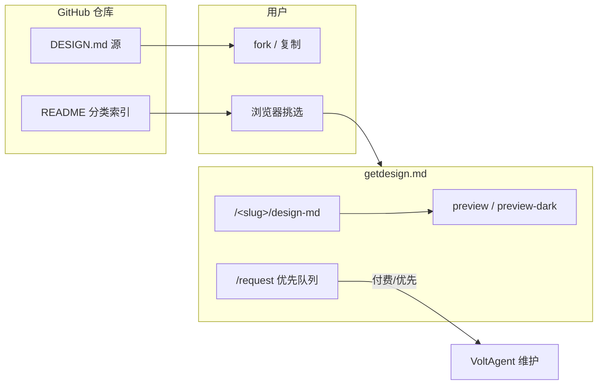

Sources: [README.md:44-46](../../../project-repos/awesome-design-md/README.md#L44-L46), [design-md/vercel/README.md:1-5](../../../project-repos/awesome-design-md/design-md/vercel/README.md#L1-L5)

<details class="source-snippets">
<summary>引用源码</summary>

<!-- source-snippets:start -->

#### `README.md:44-46`

```markdown
## Request a DESIGN.md

You can [request a DESIGN.md](https://getdesign.md/request) for specific website, including private requests delivered exclusively to you.
```

#### `design-md/vercel/README.md:1-5`

```markdown
# Vercel Inspired Design System Analysis

Design system details have been moved to: https://getdesign.md/vercel/design-md

You can also view previews, dark mode examples, and download options on getdesign.md.
```

<!-- source-snippets:end -->
</details>

## getdesign.md 链接约定

根 README 每个品牌条目链到 `https://getdesign.md/<slug>/design-md`（slug 与 `design-md/` 子目录一致）。子目录 `README.md` 重复同一链接并说明 preview、dark mode、download 在 getdesign.md 提供。

**Git 树 vs README 承诺**：根 README 写每站含 `preview.html` / `preview-dark.html`，当前 clone **不含 HTML 文件**——预览资产在 getdesign.md CDN/站点，不在本 repo。

Sources: [README.md:56-57](../../../project-repos/awesome-design-md/README.md#L56-L57), [README.md:169-175](../../../project-repos/awesome-design-md/README.md#L169-L175)

<details class="source-snippets">
<summary>引用源码</summary>

<!-- source-snippets:start -->

#### `README.md:56-57`

```markdown
- [**Claude**](https://getdesign.md/claude/design-md) - Anthropic's AI assistant. Warm terracotta accent, clean editorial layout
- [**Cohere**](https://getdesign.md/cohere/design-md) - Enterprise AI platform. Vibrant gradients, data-rich dashboard aesthetic
```

#### `README.md:169-175`

```markdown
Each site includes:

| File | Purpose |
|------|---------|
| `DESIGN.md` | The design system (what agents read) |
| `preview.html` | Visual catalog showing color swatches, type scale, buttons, cards |
| `preview-dark.html` | Same catalog with dark surfaces |
```

<!-- source-snippets:end -->
</details>

## 请求新 DESIGN.md

两条路径：

### 1. GitHub Issue（免费、排队）

`.github/ISSUE_TEMPLATE/design-md-request.yml` 收集：

- Website URL（必填）
- Delivery Email（必填）
- Priority 下拉：是否走 getdesign.md 付费优先
- Additional Details（可选）

维护方带宽有限；模板明确指向 [getdesign.md/request](https://getdesign.md/request) 做 same-day 优先。

Sources: [github/ISSUE_TEMPLATE/design-md-request.yml:1-45](../../../project-repos/awesome-design-md/.github/ISSUE_TEMPLATE/design-md-request.yml#L1-L45)

<details class="source-snippets">
<summary>引用源码</summary>

<!-- source-snippets:start -->

#### `github/ISSUE_TEMPLATE/design-md-request.yml:1-45`

```yaml
name: Design MD Request
description: Request a DESIGN.md generated from a website
title: "DESIGN.md request"
labels: ["design-md"]

body:
  - type: markdown
    attributes:
      value: |
        Fill out the form below to request a DESIGN.md generation for your website.
  - type: input
    id: website
    attributes:
      label: Website URL
      description: The website you want us to generate DESIGN.md for
      placeholder: https://example.com
    validations:
      required: true

  - type: input
    id: email
    attributes:
      label: Delivery Email
      description: Email address where we should send the generated DESIGN.md
      placeholder: you@example.com
    validations:
      required: true

  - type: dropdown
    id: priority
    attributes:
      label: Do you want to prioritize your DESIGN.md generation request?
      description: We have limited bandwidth across our open-source projects. For same-day delivery, you can prioritize your request at [getdesign.md/request](https://getdesign.md/request).
      options:
        - "No"
        - "Yes, I'll prioritize at getdesign.md/request"
    validations:
      required: true

  - type: textarea
    id: details
    attributes:
      label: Additional Details (optional)
      description: Anything else you'd like us to know about this request
    validations:
```

<!-- source-snippets:end -->
</details>

### 2. getdesign.md/request（付费优先）

README「Request a DESIGN.md」节：可请求特定网站，含**私有请求**（exclusive delivery）。

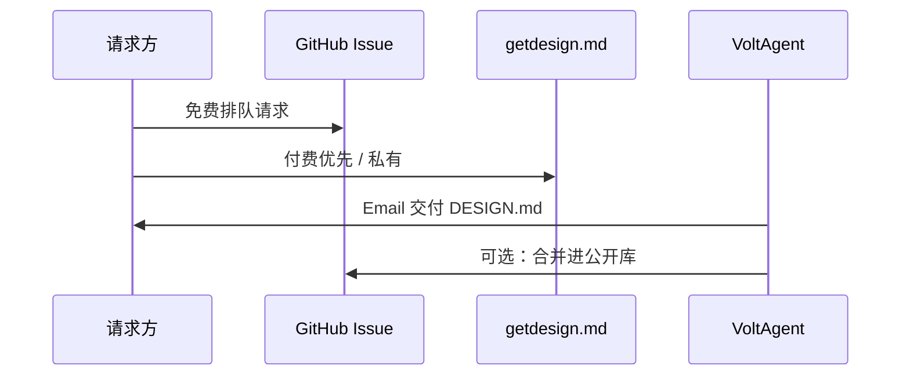

Sources: [README.md:44-46](../../../project-repos/awesome-design-md/README.md#L44-L46), [README.md:33-34](../../../project-repos/awesome-design-md/README.md#L33-L34)

<details class="source-snippets">
<summary>引用源码</summary>

<!-- source-snippets:start -->

#### `README.md:44-46`

```markdown
## Request a DESIGN.md

You can [request a DESIGN.md](https://getdesign.md/request) for specific website, including private requests delivered exclusively to you.
```

#### `README.md:33-34`

```markdown
[DESIGN.md](https://stitch.withgoogle.com/docs/design-md/overview/) is a new concept introduced by Google Stitch. A plain-text design system document that AI agents read to generate consistent UI.

```

<!-- source-snippets:end -->
</details>

## 赞助与曝光

README Sponsors 节：赞助 logo 出现在 README 与 getdesign.md（「1M+ view」定位）。Funding 通过 `.github/FUNDING.yml` 配置 GitHub Sponsors 等链接。

Sources: [README.md:48-50](../../../project-repos/awesome-design-md/README.md#L48-L50), [github/FUNDING.yml](../../../project-repos/awesome-design-md/.github/FUNDING.yml)

<details class="source-snippets">
<summary>引用源码</summary>

<!-- source-snippets:start -->

#### `README.md:48-50`

```markdown
## Sponsors ❤️

Become a Sponsor [1M+ view] — your logo here and get listed on [getdesign.md](https://getdesign.md/)
```

#### `github/FUNDING.yml`

```yaml
# These are supported funding model platforms

github: voltagent

```

<!-- source-snippets:end -->
</details>

## VoltAgent 品牌关联

仓库归属 VoltAgent org；Collection 含 **VoltAgent** 自有品牌档案（void-black + emerald）。Discord badge 链到 `s.voltagent.dev/discord`——社区反馈与请求的主通道之一。

Sources: [README.md:21](../../../project-repos/awesome-design-md/README.md:21), [README.md:66](../../../project-repos/awesome-design-md/README.md:66)

<details class="source-snippets">
<summary>引用源码</summary>

<!-- source-snippets:start -->

#### `README.md:21`

> 未找到引用文件：`README.md:21`

#### `README.md:66`

> 未找到引用文件：`README.md:66`

<!-- source-snippets:end -->
</details>

## 相关页面

- [目录与仓库结构](catalog-architecture.md) — Git 侧文件布局
- [代理消费工作流](agent-consumption.md) — 复制使用
- [贡献与治理](contributing-governance.md) — 为何不接受公开 PR 新品牌

---

<details>
<summary>相关源文件</summary>

生成本页时使用的主要源文件：

- [CONTRIBUTING.md](../../../project-repos/awesome-design-md/CONTRIBUTING.md)
- [LICENSE](../../../project-repos/awesome-design-md/LICENSE)
- [.github/FUNDING.yml](../../../project-repos/awesome-design-md/.github/FUNDING.yml)

</details>

# 贡献与治理

这是一个**策展型（curated）**开源库：质量与法律风险由 VoltAgent 集中把控，社区参与面被刻意收窄——能改现有条目，不能随意新增品牌档案。

## 贡献路径

CONTRIBUTING 只列一条有效路径：**改进已有 DESIGN.md**。

流程：

1. **先开 Issue** 描述变更、等 maintainer 反馈
2. 对照 live site 检查 hex、token、描述
3. 修改 `design-md/<slug>/DESIGN.md`
4. 若 token 影响展示，同步更新 preview（在 getdesign.md 侧；CONTRIBUTING 仍写 preview.html 义务）
5. 开 PR 附 before/after 理由

Sources: [CONTRIBUTING.md:9-18](../../../project-repos/awesome-design-md/CONTRIBUTING.md#L9-L18)

<details class="source-snippets">
<summary>引用源码</summary>

<!-- source-snippets:start -->

#### `CONTRIBUTING.md:9-18`

```markdown
### Improve an Existing DESIGN.md

If you notice issues with an existing file:

1. **Open an issue first** to describe what you'd like to change and get feedback from maintainers
2. Open the site's `DESIGN.md`
3. Compare against the live site
4. Fix incorrect hex values, missing tokens, or weak descriptions
5. Update the `preview.html` and `preview-dark.html` if your changes affect displayed tokens
6. Open a PR with before/after rationale
```

<!-- source-snippets:end -->
</details>

## 硬边界：不接受新 DESIGN.md PR

CONTRIBUTING 第 21 行明确：

> We cannot accept DESIGN.md pull requests to maintain the quality of the existing collection.

**原因推断（从文件结构反推）**：

- 每份档案是从 live site 提取 CSS 值的 labor-intensive 工作
- 视觉身份版权/商标风险需 maintainer 统一 disclaimer
- 新品牌走 Issue / getdesign.md 付费队列，保证风格一致

Sources: [CONTRIBUTING.md:21](../../../project-repos/awesome-design-md/CONTRIBUTING.md:21)

<details class="source-snippets">
<summary>引用源码</summary>

<!-- source-snippets:start -->

#### `CONTRIBUTING.md:21`

> 未找到引用文件：`CONTRIBUTING.md:21`

<!-- source-snippets:end -->
</details>

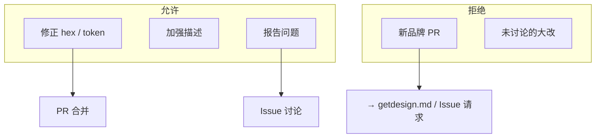

## 法律与免责声明

MIT License 覆盖仓库代码与文档文本，但 LICENSE 末尾附加 **design extraction disclaimer**：

- DESIGN.md 按「as is」提供，无 warranty
- token 代表**公开可见的 CSS 值**提取
- **不声称拥有**任何网站视觉 identity
- 目的是帮助 AI agent 生成 consistent UI

使用者将 DESIGN.md 用于商业产品时，仍需自行评估商标/品牌合规——库不提供法律保证。

Sources: [LICENSE:1-21](../../../project-repos/awesome-design-md/LICENSE#L1-L21)

<details class="source-snippets">
<summary>引用源码</summary>

<!-- source-snippets:start -->

#### `LICENSE:1-21`

```
MIT License

Copyright (c) 2026 VoltAgent

Permission is hereby granted, free of charge, to any person obtaining a copy
of this software and associated documentation files (the "Software"), to deal
in the Software without restriction, including without limitation the rights
to use, copy, modify, merge, publish, distribute, sublicense, and/or sell
copies of the Software, and to permit persons to whom the Software is
furnished to do so, subject to the following conditions:

The above copyright notice and this permission notice shall be included in all
copies or substantial portions of the Software.

THE SOFTWARE IS PROVIDED "AS IS", WITHOUT WARRANTY OF ANY KIND, EXPRESS OR
IMPLIED, INCLUDING BUT NOT LIMITED TO THE WARRANTIES OF MERCHANTABILITY,
FITNESS FOR A PARTICULAR PURPOSE AND NONINFRINGEMENT. IN NO EVENT SHALL THE
AUTHORS OR COPYRIGHT HOLDERS BE LIABLE FOR ANY CLAIM, DAMAGES OR OTHER
LIABILITY, WHETHER IN AN ACTION OF CONTRACT, TORT OR OTHERWISE, ARISING FROM,
OUT OF OR IN CONNECTION WITH THE SOFTWARE OR THE USE OR OTHER DEALINGS IN THE
SOFTWARE.
```

<!-- source-snippets:end -->
</details>

## Issue 模板治理

`design-md-request.yml` 是**需求 intake**，不是贡献 PR 的替代——它把新品牌请求导入 maintainer 队列，与 CONTRIBUTING 的「no new PR」策略一致。

Sources: [github/ISSUE_TEMPLATE/design-md-request.yml:1-6](../../../project-repos/awesome-design-md/.github/ISSUE_TEMPLATE/design-md-request.yml#L1-L6)

<details class="source-snippets">
<summary>引用源码</summary>

<!-- source-snippets:start -->

#### `github/ISSUE_TEMPLATE/design-md-request.yml:1-6`

```yaml
name: Design MD Request
description: Request a DESIGN.md generated from a website
title: "DESIGN.md request"
labels: ["design-md"]

body:
```

<!-- source-snippets:end -->
</details>

## 质量门槛（implicit）

虽无 automated CI，maintainer 隐含标准可从现有档案归纳：

- YAML token 与 Markdown prose 交叉引用一致
- Do's and Don'ts 含可执行的禁止项（非空话）
- Overview 解释 **why** 而非罗列 hex
- 较新条目含 Responsive + Agent Prompt Guide

改进 PR 应对照 live site 而非其他 DESIGN.md 抄袭。

Sources: [design-md/vercel/DESIGN.md:718-737](../../../project-repos/awesome-design-md/design-md/vercel/DESIGN.md#L718-L737)

<details class="source-snippets">
<summary>引用源码</summary>

<!-- source-snippets:start -->

#### `design-md/vercel/DESIGN.md:718-737`

```markdown
## Do's and Don'ts

### Do
- Reserve `{colors.primary}` (`#171717`) for primary CTAs across the page. Black ink IS the conversion target.
- Use `{rounded.pill}` 100 px for every marketing-scale CTA and `{rounded.sm}` 6 px for nav-scale buttons. The two pill scales coexist deliberately.
- Set every headline in `{typography.display-*}` weight 600, sentence-case, often period-terminated. Aggressive negative tracking is part of the voice.
- Use the brand mesh gradient as atmospheric decoration at hero scale only — never miniaturise it to an icon, never reduce to a single colour.
- Layer stacked shadows (multiple small offsets with inset hairline) rather than single heavy drops. The brand's elevation is calmer than Material.
- Cycle page surfaces in `{colors.canvas-soft}` → `{colors.canvas}` → `{colors.primary}` polarity-flipped bands; the dark band IS the depth cue.
- Set every code block and technical eyebrow in `{typography.code}` / `{typography.caption-mono}`. Mono is the voice of the platform.

### Don't
- Don't introduce a sixth accent colour. The brand operates with ink + gray + the four-pair gradient palette; new accents flatten the voice.
- Don't render headlines in all-caps. Sentence-case + negative tracking is non-negotiable.
- Don't drop a single heavy drop-shadow on cards. The brand's elevation is built from stacked small offsets + inset hairline rings.
- Don't render the brand gradient at icon scale or in a single-colour reduced form. The gradient lives at hero scale only.
- Don't promote the geometric sans to weight 700. The brand's display ceiling is 600.
- Don't pair the marketing 100-px pill CTA shape with the 6-px nav radius on the same screen — pick a scale and stay there.
- Don't set body paragraphs in the mono face. The mono is for code + technical labels only.
```

<!-- source-snippets:end -->
</details>

## 相关页面

- [分发与 getdesign.md 生态](distribution-ecosystem.md) — 新品牌请求入口
- [项目概览](overview.md) — 仓库定位
- [品牌目录与分类](brand-catalog.md) — 现有 71 品牌范围

