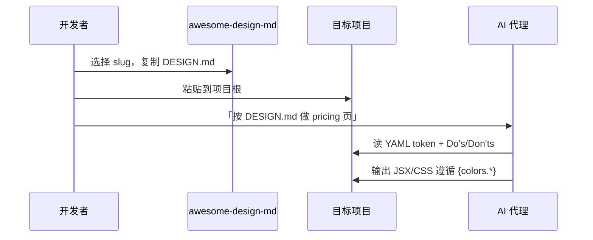

<details>
<summary>相关源文件</summary>

生成本页时使用的主要源文件：

- [README.md](../../../project-repos/awesome-design-md/README.md)
- [design-md/vercel/DESIGN.md](../../../project-repos/awesome-design-md/design-md/vercel/DESIGN.md)
- [design-md/sanity/DESIGN.md](../../../project-repos/awesome-design-md/design-md/sanity/DESIGN.md)

</details>

# 代理消费工作流

库的价值在「被代理读到并执行」——不是躺在 GitHub 当 reference。工作流极其短：复制单文件、声明约束、让代理在生成 UI 时引用 token 而非自由发挥。

## 三步使用法

README 写死的流程：

1. 从 `design-md/<slug>/` 复制 `DESIGN.md` 到**项目根目录**
2. 对 AI agent 声明使用它（自然语言即可）
3. 描述要建的页面/组件



Sources: [README.md:177-181](../../../project-repos/awesome-design-md/README.md#L177-L181)

<details class="source-snippets">
<summary>引用源码</summary>

<!-- source-snippets:start -->

#### `README.md:177-181`

```markdown
### How to Use


1. Copy a site's `DESIGN.md` into your project root
2. Tell your AI agent to use it.
```

<!-- source-snippets:end -->
</details>

## 与 AGENTS.md 协同

若项目已有 `AGENTS.md`（构建/测试约定），**DESIGN.md 与之并列**，不互相替代：

| 场景 | AGENTS.md 管 | DESIGN.md 管 |
|------|--------------|--------------|
| 跑测试 | `pnpm test` | — |
| 组件库选型 | 可能指定 React + Tailwind | 颜色/圆角/字体层级 |
| PR 规范 | conventional commits | — |
| Landing 视觉 | — | primary hex、pill CTA、禁止 seventh accent |

代理 system prompt 或 Cursor rules 可同时 `@AGENTS.md` + `@DESIGN.md`；冲突时 **DESIGN.md 优先视觉决策**，AGENTS.md 优先工程约束。

Sources: [README.md:37-40](../../../project-repos/awesome-design-md/README.md#L37-L40)

<details class="source-snippets">
<summary>引用源码</summary>

<!-- source-snippets:start -->

#### `README.md:37-40`

```markdown
| File | Who reads it | What it defines |
|------|-------------|-----------------|
| `AGENTS.md` | Coding agents | How to build the project |
| `DESIGN.md` | Design agents | How the project should look and feel |
```

<!-- source-snippets:end -->
</details>

## 有效提示词模式

**模式 A — 整页生成**

> 阅读项目根目录 DESIGN.md。用 Next.js + Tailwind 实现 pricing 页。严格使用 `{colors.primary}` 作 CTA，遵守 Do's and Don'ts 里关于 gradient 尺度的规则。

**模式 B — 组件级**

> 按 DESIGN.md 的 `button-primary` 和 `card-feature` token 实现 FeatureGrid 组件，不要引入 DESIGN.md 未列出的 accent 色。

**模式 C — 风格迁移**

> 当前页面太像默认 shadcn。对照 DESIGN.md 的 Typography 表调整 display-xl 字重与 letter-spacing，并对照 Colors 节修正 surface 层级。

部分较新档案含 **`Agent Prompt Guide`** 节（如 Sanity、Starbucks）——内含现成 color quick reference 和 copy-paste prompt 片段，可直接作为模式 A 的起点。

Sources: [README.md:167-168](../../../project-repos/awesome-design-md/README.md#L167-L168)

<details class="source-snippets">
<summary>引用源码</summary>

<!-- source-snippets:start -->

#### `README.md:167-168`

```markdown
| 9 | Agent Prompt Guide | Quick color reference, ready-to-use prompts |

```

<!-- source-snippets:end -->
</details>

## 代理读取顺序建议

1. YAML `description` — 10 秒建立气质
2. `## Overview` — 理解 brand posture
3. `## Do's and Don'ts` — 硬约束（防最常见翻车）
4. `colors` + `typography` YAML — 导出变量
5. `components` — 映射 React 组件
6. `## Responsive Behavior`（若有）— 断点策略

跳过 README 里的 marketing 一句话——直接读 DESIGN.md 原文更深。

Sources: [design-md/vercel/DESIGN.md:393-407](../../../project-repos/awesome-design-md/design-md/vercel/DESIGN.md#L393-L407), [design-md/vercel/DESIGN.md:718-737](../../../project-repos/awesome-design-md/design-md/vercel/DESIGN.md#L718-L737)

<details class="source-snippets">
<summary>引用源码</summary>

<!-- source-snippets:start -->

#### `design-md/vercel/DESIGN.md:393-407`

```markdown
## Overview

Vercel is a developer-platform brand — the page is a deployment dashboard's marketing surface, written for engineers who already know the syntax. It earns that posture with one of the cleanest stark systems on the web: near-white `{colors.canvas-soft}` body background, ink-near-black `{colors.ink}` text, a 200-step gray scale that gives every divider, border, and disabled state its own deliberate step. The only place the brand introduces colour at marketing scale is the multi-stop mesh gradient (`{colors.gradient-develop-start}` → `{colors.gradient-preview-end}` → `{colors.gradient-ship-start}` → cyan / magenta / amber) that floats in atmospheric backdrops, never miniaturised to a swatch. That gradient is the entire decoration system.

Type is the second decisive voice. The brand's own custom geometric sans (Geist) carries display, body, button — everything narrative — at weight 600 for display, 500 for buttons, 400 for body. A matching monospaced face (Geist Mono) carries technical labels: terminal mockups, code blocks, sometimes filename captions. Headlines are sentence-case with aggressive negative letter-spacing (`-2.4px` at 48 px hero) — the brand never letter-spaces positively, never goes uppercase outside of mono labels.

Surfaces use a four-step ladder: `{colors.canvas}` (pure white for cards), `{colors.canvas-soft}` 98% (the page body), `{colors.canvas-soft-2}` 95% (occasional inset region), `{colors.primary}` (the deep ink-near-black used as the polarity-flipped band when a section needs the dark mode treatment). Shadows are exceptionally subtle — every elevated card carries a stacked shadow built from `0px 1px 1px #00000005` + `0px 2px 2px #0000000a` + an inset border. Cards never float on heavy drop-shadow; they sit on the page held by hairline + soft glow.

**Key Characteristics:**
- A single black-ink primary CTA `{colors.primary}` carries every conversion target, paired with white-on-white `button-secondary` for the secondary action. The brand uses 100 px pill shape for marketing CTAs and a tight 6 px square shape for in-app nav buttons.
- A multi-stop mesh gradient (cyan-blue-magenta-amber) is the only decorative chrome — used at hero scale and inside feature-band atmospheric backdrops. It is the brand.
- Every section eyebrow and small label uses the monospace face `{typography.caption-mono}` or `{typography.code}`; everything else is in the geometric sans.
- Subtle stacked-shadow elevation — three offsets layered with 4-12 % black opacity — never a single heavy drop-shadow.
- A complete 100–1000 gray + blue + red + amber + green + teal + purple + pink colour scale exists as a system token set, but the marketing surface uses only the `100`, `1000`, and `700`-level tones; the rest stay in the design-system tokens for in-product surfaces.
- An "Active CPU" pricing rhythm: `pricing-card` lays out 3-up on the pricing page with `pricing-card-featured` (Pro tier) polarity-flipped to `{colors.primary}` against white-card siblings.
```

#### `design-md/vercel/DESIGN.md:718-737`

```markdown
## Do's and Don'ts

### Do
- Reserve `{colors.primary}` (`#171717`) for primary CTAs across the page. Black ink IS the conversion target.
- Use `{rounded.pill}` 100 px for every marketing-scale CTA and `{rounded.sm}` 6 px for nav-scale buttons. The two pill scales coexist deliberately.
- Set every headline in `{typography.display-*}` weight 600, sentence-case, often period-terminated. Aggressive negative tracking is part of the voice.
- Use the brand mesh gradient as atmospheric decoration at hero scale only — never miniaturise it to an icon, never reduce to a single colour.
- Layer stacked shadows (multiple small offsets with inset hairline) rather than single heavy drops. The brand's elevation is calmer than Material.
- Cycle page surfaces in `{colors.canvas-soft}` → `{colors.canvas}` → `{colors.primary}` polarity-flipped bands; the dark band IS the depth cue.
- Set every code block and technical eyebrow in `{typography.code}` / `{typography.caption-mono}`. Mono is the voice of the platform.

### Don't
- Don't introduce a sixth accent colour. The brand operates with ink + gray + the four-pair gradient palette; new accents flatten the voice.
- Don't render headlines in all-caps. Sentence-case + negative tracking is non-negotiable.
- Don't drop a single heavy drop-shadow on cards. The brand's elevation is built from stacked small offsets + inset hairline rings.
- Don't render the brand gradient at icon scale or in a single-colour reduced form. The gradient lives at hero scale only.
- Don't promote the geometric sans to weight 700. The brand's display ceiling is 600.
- Don't pair the marketing 100-px pill CTA shape with the 6-px nav radius on the same screen — pick a scale and stay there.
- Don't set body paragraphs in the mono face. The mono is for code + technical labels only.
```

<!-- source-snippets:end -->
</details>

## Google Stitch 关系

DESIGN.md 概念源自 [Google Stitch](https://stitch.withgoogle.com/docs/design-md/overview/)。Stitch 侧 agent 同样消费该格式生 UI；本库提供**现成品牌实现**，可：

- 复制到 Stitch 工作流参考
- 与 `@google/stitch-sdk` / stitch-design-cli 等工具链并列使用（工具管 API，DESIGN.md 管视觉）

Sources: [README.md:31-35](../../../project-repos/awesome-design-md/README.md#L31-L35)

<details class="source-snippets">
<summary>引用源码</summary>

<!-- source-snippets:start -->

#### `README.md:31-35`

```markdown
## What is DESIGN.md?

[DESIGN.md](https://stitch.withgoogle.com/docs/design-md/overview/) is a new concept introduced by Google Stitch. A plain-text design system document that AI agents read to generate consistent UI.

It's just a markdown file. No Figma exports, no JSON schemas, no special tooling. Drop it into your project root and any AI coding agent or Google Stitch instantly understands how your UI should look. Markdown is the format LLMs read best, so there's nothing to parse or configure.
```

<!-- source-snippets:end -->
</details>

## 常见失败模式

| 失败 | 原因 | 修复 |
|------|------|------|
| 页面像 generic Tailwind | 代理没读 Do's/Don'ts | prompt 显式引用禁止项 |
| 七色 accent 乱入 | 忽略「don't introduce sixth accent」类规则 | 先让代理列出将用的 colors key |
| 圆角混用 | Vercel 类档案 marketing pill + nav sm 共存 | 指定「本页只用 marketing scale」 |
| 暗色/亮色搞反 | 未读 canvas token | 强调 `{colors.canvas}` 默认值 |

Sources: [design-md/vercel/DESIGN.md:729-735](../../../project-repos/awesome-design-md/design-md/vercel/DESIGN.md#L729-L735)

<details class="source-snippets">
<summary>引用源码</summary>

<!-- source-snippets:start -->

#### `design-md/vercel/DESIGN.md:729-735`

```markdown
### Don't
- Don't introduce a sixth accent colour. The brand operates with ink + gray + the four-pair gradient palette; new accents flatten the voice.
- Don't render headlines in all-caps. Sentence-case + negative tracking is non-negotiable.
- Don't drop a single heavy drop-shadow on cards. The brand's elevation is built from stacked small offsets + inset hairline rings.
- Don't render the brand gradient at icon scale or in a single-colour reduced form. The gradient lives at hero scale only.
- Don't promote the geometric sans to weight 700. The brand's display ceiling is 600.
- Don't pair the marketing 100-px pill CTA shape with the 6-px nav radius on the same screen — pick a scale and stay there.
```

<!-- source-snippets:end -->
</details>

## 相关页面

- [项目概览](overview.md) — DESIGN.md 概念
- [Token 与组件模型](token-component-model.md) — token 映射
- [分发与 getdesign.md 生态](distribution-ecosystem.md) — 在线挑选品牌
