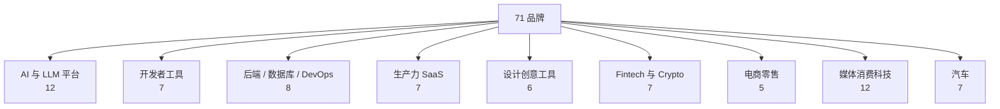

<details>
<summary>相关源文件</summary>

生成本页时使用的主要源文件：

- [README.md](../../../project-repos/awesome-design-md/README.md)
- [design-md/linear.app/DESIGN.md](../../../project-repos/awesome-design-md/design-md/linear.app/DESIGN.md)
- [design-md/stripe/DESIGN.md](../../../project-repos/awesome-design-md/design-md/stripe/DESIGN.md)

</details>

# 品牌目录与分类

根 `README.md` 的 Collection 区块是这份库的**权威分类索引**：71 个品牌按业务场景分成 9 组，每组条目带一句话气质描述和 getdesign.md 外链。Git 目录 `design-md/<slug>/` 与 README 列表一一对应。

## 规模概览

| 指标 | 数量 |
|------|------|
| `design-md/` 子目录 | 71 |
| `DESIGN.md` 文件 | 71 |
| README 分类组 | 9 |
| Badge 计数（README shield） | 73（含未在 inventory 完全对齐的计数差） |

Inventory 扫描 147 文件、143 Markdown——几乎全部是品牌文档与索引。

Sources: [README.md:18-19](../../../project-repos/awesome-design-md/README.md#L18-L19), [00-repo-inventory.md](../00-repo-inventory.md)

<details class="source-snippets">
<summary>引用源码</summary>

<!-- source-snippets:start -->

#### `README.md:18-19`

```markdown
[](https://awesome.re)

```

#### `00-repo-inventory.md`

```markdown
# 00 - 仓库盘点

## Source

- Path: `/Users/bytedance/workspace/workspace-local-task/deepwiki/project-repos/awesome-design-md`
- Remote: `https://github.com/voltagent/awesome-design-md.git`
- Branch: `main`
- Commit: `3883984baf05226208a5dae15730a3593548b808`

## File Summary

- Files scanned: 147
- Top-level directories: `.github`, `design-md`

| Extension | Count |
|-----------|------:|
| `.md` | 143 |
| `.yml` | 2 |
| `[no extension]` | 2 |

## Manifests and Build Files

- None detected

## Documentation

- `CONTRIBUTING.md`
- `README.md`
- `design-md/airbnb/README.md`
- `design-md/airtable/README.md`
- `design-md/apple/README.md`
- `design-md/binance/README.md`
- `design-md/bmw-m/README.md`
- `design-md/bmw/README.md`
- `design-md/bugatti/README.md`
- `design-md/cal/README.md`
- `design-md/claude/README.md`
- `design-md/clay/README.md`
- `design-md/clickhouse/README.md`
- `design-md/cohere/README.md`
- `design-md/coinbase/README.md`
- `design-md/composio/README.md`
- `design-md/cursor/README.md`
- `design-md/elevenlabs/README.md`
- `design-md/expo/README.md`
- `design-md/ferrari/README.md`
- `design-md/figma/README.md`
- `design-md/framer/README.md`
- `design-md/hashicorp/README.md`
- `design-md/ibm/README.md`
- `design-md/intercom/README.md`
- `design-md/kraken/README.md`
- `design-md/lamborghini/README.md`
- `design-md/linear.app/README.md`
- `design-md/lovable/README.md`
- `design-md/mastercard/README.md`
- `design-md/meta/README.md`
- `design-md/minimax/README.md`
- `design-md/mintlify/README.md`
- `design-md/miro/README.md`
- `design-md/mistral.ai/README.md`
- `design-md/mongodb/README.md`
- `design-md/nike/README.md`
- `design-md/notion/README.md`
- `design-md/nvidia/README.md`
- `design-md/ollama/README.md`
- `design-md/opencode.ai/README.md`
- `design-md/pinterest/README.md`
- `design-md/playstation/README.md`
- `design-md/posthog/README.md`
- `design-md/raycast/README.md`
- `design-md/renault/README.md`
- `design-md/replicate/README.md`
- `design-md/resend/README.md`
- `design-md/revolut/README.md`
- `design-md/runwayml/README.md`
- `design-md/sanity/README.md`
- `design-md/sentry/README.md`
- `design-md/shopify/README.md`
- `design-md/spacex/README.md`
- `design-md/spotify/README.md`
- `design-md/starbucks/README.md`
- `design-md/stripe/README.md`
- `design-md/supabase/README.md`
- `design-md/superhuman/README.md`
- `design-md/tesla/README.md`
- `design-md/theverge/README.md`
- `design-md/together.ai/README.md`
- `design-md/uber/README.md`
- `design-md/vercel/README.md`
- `design-md/vodafone/README.md`
- `design-md/voltagent/README.md`
- `design-md/warp/README.md`
- `design-md/webflow/README.md`
- `design-md/wired/README.md`
- `design-md/wise/README.md`
- `design-md/x.ai/README.md`
- `design-md/zapier/README.md`

## CI and Automation

- None detected

## Tests

- None detected

## Skills

- None detected
```

<!-- source-snippets:end -->
</details>

## 九大主题分类



Sources: [README.md:54-150](../../../project-repos/awesome-design-md/README.md#L54-L150)

<details class="source-snippets">
<summary>引用源码</summary>

<!-- source-snippets:start -->

#### `README.md:54-150`

```markdown
### AI & LLM Platforms

- [**Claude**](https://getdesign.md/claude/design-md) - Anthropic's AI assistant. Warm terracotta accent, clean editorial layout
- [**Cohere**](https://getdesign.md/cohere/design-md) - Enterprise AI platform. Vibrant gradients, data-rich dashboard aesthetic
- [**ElevenLabs**](https://getdesign.md/elevenlabs/design-md) - AI voice platform. Dark cinematic UI, audio-waveform aesthetics
- [**Minimax**](https://getdesign.md/minimax/design-md) - AI model provider. Bold dark interface with neon accents
- [**Mistral AI**](https://getdesign.md/mistral.ai/design-md) - Open-weight LLM provider. French-engineered minimalism, purple-toned
- [**Ollama**](https://getdesign.md/ollama/design-md) - Run LLMs locally. Terminal-first, monochrome simplicity
- [**OpenCode AI**](https://getdesign.md/opencode.ai/design-md) - AI coding platform. Developer-centric dark theme
- [**Replicate**](https://getdesign.md/replicate/design-md) - Run ML models via API. Clean white canvas, code-forward
- [**Runway**](https://getdesign.md/runwayml/design-md) - AI creative-tools platform with an editorial film-festival aesthetic — cinematic dark heroes, paper-white reading bands, single proprietary sans, and pure black pill CTAs.
- [**Together AI**](https://getdesign.md/together.ai/design-md) - Open-source AI infrastructure. Technical, blueprint-style design
- [**VoltAgent**](https://getdesign.md/voltagent/design-md) - AI agent framework. Void-black canvas, emerald accent, terminal-native
- [**xAI**](https://getdesign.md/x.ai/design-md) - Elon Musk's AI lab. Stark monochrome, futuristic minimalism

### Developer Tools & IDEs

- [**Cursor**](https://getdesign.md/cursor/design-md) - AI-first code editor. Sleek dark interface, gradient accents
- [**Expo**](https://getdesign.md/expo/design-md) - React Native platform. Dark theme, tight letter-spacing, code-centric
- [**Lovable**](https://getdesign.md/lovable/design-md) - AI full-stack builder. Playful gradients, friendly dev aesthetic
- [**Raycast**](https://getdesign.md/raycast/design-md) - Productivity launcher. Sleek dark chrome, vibrant gradient accents
- [**Superhuman**](https://getdesign.md/superhuman/design-md) - Fast email client. Premium dark UI, keyboard-first, purple glow
- [**Vercel**](https://getdesign.md/vercel/design-md) - Frontend deployment platform. Black and white precision, Geist font
- [**Warp**](https://getdesign.md/warp/design-md) - Modern terminal. Dark IDE-like interface, block-based command UI

### Backend, Database & DevOps

- [**ClickHouse**](https://getdesign.md/clickhouse/design-md) - Fast analytics database. Yellow-accented, technical documentation style
- [**Composio**](https://getdesign.md/composio/design-md) - Tool integration platform. Modern dark with colorful integration icons
- [**HashiCorp**](https://getdesign.md/hashicorp/design-md) - Infrastructure automation. Enterprise-clean, black and white
- [**MongoDB**](https://getdesign.md/mongodb/design-md) - Document database. Green leaf branding, developer documentation focus
- [**PostHog**](https://getdesign.md/posthog/design-md) - Product analytics. Playful hedgehog branding, developer-friendly dark UI
- [**Sanity**](https://getdesign.md/sanity/design-md) - Headless content platform with a dark-first editorial marketing surface — 112px display type, IBM Plex Mono technical eyebrows, and a single coral-red accent reserved for the highest-priority CTA.
- [**Sentry**](https://getdesign.md/sentry/design-md) - Error monitoring. Dark dashboard, data-dense, pink-purple accent
- [**Supabase**](https://getdesign.md/supabase/design-md) - Open-source Firebase alternative. Dark emerald theme, code-first

### Productivity & SaaS

- [**Cal.com**](https://getdesign.md/cal/design-md) - Open-source scheduling. Clean neutral UI, developer-oriented simplicity
- [**Intercom**](https://getdesign.md/intercom/design-md) - Customer messaging. Friendly blue palette, conversational UI patterns
- [**Linear**](https://getdesign.md/linear.app/design-md) - Project management for engineers. Ultra-minimal, precise, purple accent
- [**Mintlify**](https://getdesign.md/mintlify/design-md) - Documentation platform. Clean, green-accented, reading-optimized
- [**Notion**](https://getdesign.md/notion/design-md) - All-in-one workspace. Warm minimalism, serif headings, soft surfaces
- [**Resend**](https://getdesign.md/resend/design-md) - Email API for developers. Minimal dark theme, monospace accents
- [**Zapier**](https://getdesign.md/zapier/design-md) - Automation platform. Warm orange, friendly illustration-driven

### Design & Creative Tools

- [**Airtable**](https://getdesign.md/airtable/design-md) - Spreadsheet-database hybrid. Colorful, friendly, structured data aesthetic
- [**Clay**](https://getdesign.md/clay/design-md) - Creative agency. Organic shapes, soft gradients, art-directed layout
- [**Figma**](https://getdesign.md/figma/design-md) - Collaborative design tool. Vibrant multi-color, playful yet professional
- [**Framer**](https://getdesign.md/framer/design-md) - Website builder. Bold black and blue, motion-first, design-forward
- [**Miro**](https://getdesign.md/miro/design-md) - Visual collaboration. Bright yellow accent, infinite canvas aesthetic
- [**Webflow**](https://getdesign.md/webflow/design-md) - Visual web builder. Blue-accented, polished marketing site aesthetic

### Fintech & Crypto

- [**Binance**](https://getdesign.md/binance/design-md) - Crypto exchange. Bold Binance Yellow on monochrome, trading-floor urgency
- [**Coinbase**](https://getdesign.md/coinbase/design-md) - Crypto exchange. Clean blue identity, trust-focused, institutional feel
- [**Kraken**](https://getdesign.md/kraken/design-md) - Crypto trading platform. Purple-accented dark UI, data-dense dashboards
- [**Mastercard**](https://getdesign.md/mastercard/design-md) - Global payments network. Warm cream canvas, orbital pill shapes, editorial warmth
- [**Revolut**](https://getdesign.md/revolut/design-md) - Digital banking. Sleek dark interface, gradient cards, fintech precision
- [**Stripe**](https://getdesign.md/stripe/design-md) - Payment infrastructure. Signature purple gradients, weight-300 elegance
- [**Wise**](https://getdesign.md/wise/design-md) - International money transfer. Bright green accent, friendly and clear

### E-commerce & Retail

- [**Airbnb**](https://getdesign.md/airbnb/design-md) - Travel marketplace. Warm coral accent, photography-driven, rounded UI
- [**Meta**](https://getdesign.md/meta/design-md) - Tech retail store. Photography-first, binary light/dark surfaces, Meta Blue CTAs
- [**Nike**](https://getdesign.md/nike/design-md) - Athletic retail. Monochrome UI, massive uppercase Futura, full-bleed photography
- [**Shopify**](https://getdesign.md/shopify/design-md) - E-commerce platform. Dark-first cinematic, neon green accent, ultra-light display type
- [**Starbucks**](https://getdesign.md/starbucks/design-md) - Coffee retail flagship. Four-tier earth-green system, warm cream canvas, proprietary SoDoSans typography

### Media & Consumer Tech

- [**Apple**](https://getdesign.md/apple/design-md) - Consumer electronics. Premium white space, SF Pro, cinematic imagery
- [**HP**](https://getdesign.md/hp/design-md) - PC and printer maker. Pure white canvas, HP Electric Blue signal CTA, geometric Forma DJR Micro, blue chevron decorations
- [**IBM**](https://getdesign.md/ibm/design-md) - Enterprise technology. Carbon design system, structured blue palette
- [**NVIDIA**](https://getdesign.md/nvidia/design-md) - GPU computing. Green-black energy, technical power aesthetic
- [**Pinterest**](https://getdesign.md/pinterest/design-md) - Visual discovery platform. Red accent, masonry grid, image-first
- [**PlayStation**](https://getdesign.md/playstation/design-md) - Gaming console retail. Three-surface channel layout, cyan hover-scale interaction
- [**SpaceX**](https://getdesign.md/spacex/design-md) - Space technology. Stark black and white, full-bleed imagery, futuristic
- [**Spotify**](https://getdesign.md/spotify/design-md) - Music streaming. Vibrant green on dark, bold type, album-art-driven
- [**The Verge**](https://getdesign.md/theverge/design-md) - Tech editorial media. Acid-mint and ultraviolet accents, Manuka display type
- [**Uber**](https://getdesign.md/uber/design-md) - Mobility platform. Bold black and white, tight type, urban energy
- [**Vodafone**](https://getdesign.md/vodafone/design-md) - Global telecom brand. Monumental uppercase display, Vodafone Red chapter bands
- [**WIRED**](https://getdesign.md/wired/design-md) - Tech magazine. Paper-white broadsheet density, custom serif, ink-blue links

### Automotive

- [**BMW**](https://getdesign.md/bmw/design-md) - Luxury automotive. Dark premium surfaces, precise German engineering aesthetic
- [**BMW M**](https://getdesign.md/bmw-m/design-md) - Performance automotive. Motorsport-inspired contrast, M color accents, precision-driven layout
- [**Bugatti**](https://getdesign.md/bugatti/design-md) - Luxury hypercar. Cinema-black canvas, monochrome austerity, monumental display type
- [**Ferrari**](https://getdesign.md/ferrari/design-md) - Luxury automotive. Chiaroscuro black-white editorial, Ferrari Red with extreme sparseness
- [**Lamborghini**](https://getdesign.md/lamborghini/design-md) - Luxury automotive. True black cathedral, gold accent, LamboType custom Neo-Grotesk
- [**Renault**](https://getdesign.md/renault/design-md) - French automotive. Vivid aurora gradients, NouvelR proprietary typeface, zero-radius buttons
- [**Tesla**](https://getdesign.md/tesla/design-md) - Electric vehicles. Radical subtraction, cinematic full-viewport photography, Universal Sans
```

<!-- source-snippets:end -->
</details>

## 分类明细

### AI 与 LLM 平台（12）

Claude、Cohere、ElevenLabs、Minimax、Mistral AI、Ollama、OpenCode AI、Replicate、Runway、Together AI、VoltAgent、xAI。

**气质跨度**：Ollama 的 terminal-first monochrome ↔ ElevenLabs 的 cinematic dark ↔ Cohere 的 data-rich gradient dashboard。

### 开发者工具与 IDE（7）

Cursor、Expo、Lovable、Raycast、Superhuman、Vercel、Warp。

**共性**：dark-first 或 high-contrast developer aesthetic；多数强调 monospace + gradient accent。

### 后端、Database 与 DevOps（8）

ClickHouse、Composio、HashiCorp、MongoDB、PostHog、Sanity、Sentry、Supabase。

**共性**：文档/仪表盘混合；yellow-green-pink 等品牌色强绑定。

### 生产力与 SaaS（7）

Cal.com、Intercom、Linear、Mintlify、Notion、Resend、Zapier。

**Linear / Notion** 是「极简工程审美」与「warm minimalism」两极代表。

### 设计创意工具（6）

Airtable、Clay、Figma、Framer、Miro、Webflow。

### Fintech 与 Crypto（7）

Binance、Coinbase、Kraken、Mastercard、Revolut、Stripe、Wise。

Stripe 的 purple gradient + weight-300 是 fintech 类常被引用的基准。

### 电商与零售（5）

Airbnb、Meta、Nike、Shopify、Starbucks。

### 媒体与消费科技（12）

Apple、HP、IBM、NVIDIA、Pinterest、PlayStation、SpaceX、Spotify、The Verge、Uber、Vodafone、WIRED。

### 汽车（7）

BMW、BMW M、Bugatti、Ferrari、Lamborghini、Renault、Tesla。

**luxury automotive** 子集共享 cinema-black + monumental display type 模式。

Sources: [README.md:54-150](../../../project-repos/awesome-design-md/README.md#L54-L150)

<details class="source-snippets">
<summary>引用源码</summary>

<!-- source-snippets:start -->

#### `README.md:54-150`

```markdown
### AI & LLM Platforms

- [**Claude**](https://getdesign.md/claude/design-md) - Anthropic's AI assistant. Warm terracotta accent, clean editorial layout
- [**Cohere**](https://getdesign.md/cohere/design-md) - Enterprise AI platform. Vibrant gradients, data-rich dashboard aesthetic
- [**ElevenLabs**](https://getdesign.md/elevenlabs/design-md) - AI voice platform. Dark cinematic UI, audio-waveform aesthetics
- [**Minimax**](https://getdesign.md/minimax/design-md) - AI model provider. Bold dark interface with neon accents
- [**Mistral AI**](https://getdesign.md/mistral.ai/design-md) - Open-weight LLM provider. French-engineered minimalism, purple-toned
- [**Ollama**](https://getdesign.md/ollama/design-md) - Run LLMs locally. Terminal-first, monochrome simplicity
- [**OpenCode AI**](https://getdesign.md/opencode.ai/design-md) - AI coding platform. Developer-centric dark theme
- [**Replicate**](https://getdesign.md/replicate/design-md) - Run ML models via API. Clean white canvas, code-forward
- [**Runway**](https://getdesign.md/runwayml/design-md) - AI creative-tools platform with an editorial film-festival aesthetic — cinematic dark heroes, paper-white reading bands, single proprietary sans, and pure black pill CTAs.
- [**Together AI**](https://getdesign.md/together.ai/design-md) - Open-source AI infrastructure. Technical, blueprint-style design
- [**VoltAgent**](https://getdesign.md/voltagent/design-md) - AI agent framework. Void-black canvas, emerald accent, terminal-native
- [**xAI**](https://getdesign.md/x.ai/design-md) - Elon Musk's AI lab. Stark monochrome, futuristic minimalism

### Developer Tools & IDEs

- [**Cursor**](https://getdesign.md/cursor/design-md) - AI-first code editor. Sleek dark interface, gradient accents
- [**Expo**](https://getdesign.md/expo/design-md) - React Native platform. Dark theme, tight letter-spacing, code-centric
- [**Lovable**](https://getdesign.md/lovable/design-md) - AI full-stack builder. Playful gradients, friendly dev aesthetic
- [**Raycast**](https://getdesign.md/raycast/design-md) - Productivity launcher. Sleek dark chrome, vibrant gradient accents
- [**Superhuman**](https://getdesign.md/superhuman/design-md) - Fast email client. Premium dark UI, keyboard-first, purple glow
- [**Vercel**](https://getdesign.md/vercel/design-md) - Frontend deployment platform. Black and white precision, Geist font
- [**Warp**](https://getdesign.md/warp/design-md) - Modern terminal. Dark IDE-like interface, block-based command UI

### Backend, Database & DevOps

- [**ClickHouse**](https://getdesign.md/clickhouse/design-md) - Fast analytics database. Yellow-accented, technical documentation style
- [**Composio**](https://getdesign.md/composio/design-md) - Tool integration platform. Modern dark with colorful integration icons
- [**HashiCorp**](https://getdesign.md/hashicorp/design-md) - Infrastructure automation. Enterprise-clean, black and white
- [**MongoDB**](https://getdesign.md/mongodb/design-md) - Document database. Green leaf branding, developer documentation focus
- [**PostHog**](https://getdesign.md/posthog/design-md) - Product analytics. Playful hedgehog branding, developer-friendly dark UI
- [**Sanity**](https://getdesign.md/sanity/design-md) - Headless content platform with a dark-first editorial marketing surface — 112px display type, IBM Plex Mono technical eyebrows, and a single coral-red accent reserved for the highest-priority CTA.
- [**Sentry**](https://getdesign.md/sentry/design-md) - Error monitoring. Dark dashboard, data-dense, pink-purple accent
- [**Supabase**](https://getdesign.md/supabase/design-md) - Open-source Firebase alternative. Dark emerald theme, code-first

### Productivity & SaaS

- [**Cal.com**](https://getdesign.md/cal/design-md) - Open-source scheduling. Clean neutral UI, developer-oriented simplicity
- [**Intercom**](https://getdesign.md/intercom/design-md) - Customer messaging. Friendly blue palette, conversational UI patterns
- [**Linear**](https://getdesign.md/linear.app/design-md) - Project management for engineers. Ultra-minimal, precise, purple accent
- [**Mintlify**](https://getdesign.md/mintlify/design-md) - Documentation platform. Clean, green-accented, reading-optimized
- [**Notion**](https://getdesign.md/notion/design-md) - All-in-one workspace. Warm minimalism, serif headings, soft surfaces
- [**Resend**](https://getdesign.md/resend/design-md) - Email API for developers. Minimal dark theme, monospace accents
- [**Zapier**](https://getdesign.md/zapier/design-md) - Automation platform. Warm orange, friendly illustration-driven

### Design & Creative Tools

- [**Airtable**](https://getdesign.md/airtable/design-md) - Spreadsheet-database hybrid. Colorful, friendly, structured data aesthetic
- [**Clay**](https://getdesign.md/clay/design-md) - Creative agency. Organic shapes, soft gradients, art-directed layout
- [**Figma**](https://getdesign.md/figma/design-md) - Collaborative design tool. Vibrant multi-color, playful yet professional
- [**Framer**](https://getdesign.md/framer/design-md) - Website builder. Bold black and blue, motion-first, design-forward
- [**Miro**](https://getdesign.md/miro/design-md) - Visual collaboration. Bright yellow accent, infinite canvas aesthetic
- [**Webflow**](https://getdesign.md/webflow/design-md) - Visual web builder. Blue-accented, polished marketing site aesthetic

### Fintech & Crypto

- [**Binance**](https://getdesign.md/binance/design-md) - Crypto exchange. Bold Binance Yellow on monochrome, trading-floor urgency
- [**Coinbase**](https://getdesign.md/coinbase/design-md) - Crypto exchange. Clean blue identity, trust-focused, institutional feel
- [**Kraken**](https://getdesign.md/kraken/design-md) - Crypto trading platform. Purple-accented dark UI, data-dense dashboards
- [**Mastercard**](https://getdesign.md/mastercard/design-md) - Global payments network. Warm cream canvas, orbital pill shapes, editorial warmth
- [**Revolut**](https://getdesign.md/revolut/design-md) - Digital banking. Sleek dark interface, gradient cards, fintech precision
- [**Stripe**](https://getdesign.md/stripe/design-md) - Payment infrastructure. Signature purple gradients, weight-300 elegance
- [**Wise**](https://getdesign.md/wise/design-md) - International money transfer. Bright green accent, friendly and clear

### E-commerce & Retail

- [**Airbnb**](https://getdesign.md/airbnb/design-md) - Travel marketplace. Warm coral accent, photography-driven, rounded UI
- [**Meta**](https://getdesign.md/meta/design-md) - Tech retail store. Photography-first, binary light/dark surfaces, Meta Blue CTAs
- [**Nike**](https://getdesign.md/nike/design-md) - Athletic retail. Monochrome UI, massive uppercase Futura, full-bleed photography
- [**Shopify**](https://getdesign.md/shopify/design-md) - E-commerce platform. Dark-first cinematic, neon green accent, ultra-light display type
- [**Starbucks**](https://getdesign.md/starbucks/design-md) - Coffee retail flagship. Four-tier earth-green system, warm cream canvas, proprietary SoDoSans typography

### Media & Consumer Tech

- [**Apple**](https://getdesign.md/apple/design-md) - Consumer electronics. Premium white space, SF Pro, cinematic imagery
- [**HP**](https://getdesign.md/hp/design-md) - PC and printer maker. Pure white canvas, HP Electric Blue signal CTA, geometric Forma DJR Micro, blue chevron decorations
- [**IBM**](https://getdesign.md/ibm/design-md) - Enterprise technology. Carbon design system, structured blue palette
- [**NVIDIA**](https://getdesign.md/nvidia/design-md) - GPU computing. Green-black energy, technical power aesthetic
- [**Pinterest**](https://getdesign.md/pinterest/design-md) - Visual discovery platform. Red accent, masonry grid, image-first
- [**PlayStation**](https://getdesign.md/playstation/design-md) - Gaming console retail. Three-surface channel layout, cyan hover-scale interaction
- [**SpaceX**](https://getdesign.md/spacex/design-md) - Space technology. Stark black and white, full-bleed imagery, futuristic
- [**Spotify**](https://getdesign.md/spotify/design-md) - Music streaming. Vibrant green on dark, bold type, album-art-driven
- [**The Verge**](https://getdesign.md/theverge/design-md) - Tech editorial media. Acid-mint and ultraviolet accents, Manuka display type
- [**Uber**](https://getdesign.md/uber/design-md) - Mobility platform. Bold black and white, tight type, urban energy
- [**Vodafone**](https://getdesign.md/vodafone/design-md) - Global telecom brand. Monumental uppercase display, Vodafone Red chapter bands
- [**WIRED**](https://getdesign.md/wired/design-md) - Tech magazine. Paper-white broadsheet density, custom serif, ink-blue links

### Automotive

- [**BMW**](https://getdesign.md/bmw/design-md) - Luxury automotive. Dark premium surfaces, precise German engineering aesthetic
- [**BMW M**](https://getdesign.md/bmw-m/design-md) - Performance automotive. Motorsport-inspired contrast, M color accents, precision-driven layout
- [**Bugatti**](https://getdesign.md/bugatti/design-md) - Luxury hypercar. Cinema-black canvas, monochrome austerity, monumental display type
- [**Ferrari**](https://getdesign.md/ferrari/design-md) - Luxury automotive. Chiaroscuro black-white editorial, Ferrari Red with extreme sparseness
- [**Lamborghini**](https://getdesign.md/lamborghini/design-md) - Luxury automotive. True black cathedral, gold accent, LamboType custom Neo-Grotesk
- [**Renault**](https://getdesign.md/renault/design-md) - French automotive. Vivid aurora gradients, NouvelR proprietary typeface, zero-radius buttons
- [**Tesla**](https://getdesign.md/tesla/design-md) - Electric vehicles. Radical subtraction, cinematic full-viewport photography, Universal Sans
```

<!-- source-snippets:end -->
</details>

## slug 与选型指南

| 你的场景 | 推荐起步 slug | 理由 |
|----------|---------------|------|
| Developer landing + dark | `vercel`, `voltagent`, `supabase` | 完整 token + Do's/Don'ts |
| 极简 B2B SaaS | `linear.app`, `resend` | 低密度、精确 spacing |
| Warm productivity | `notion`, `cal` | 暖色 surface、serif 标题 |
| Fintech trust | `stripe`, `wise` | 渐变与 institutional tone |
| Editorial / media | `wired`, `theverge` | 排版驱动、非典型 dev UI |
| 暗色 AI 产品 | `elevenlabs`, `cursor` | cinematic / IDE hybrid |

Sources: [README.md:56-67](../../../project-repos/awesome-design-md/README.md#L56-L67), [README.md:90-98](../../../project-repos/awesome-design-md/README.md#L90-L98)

<details class="source-snippets">
<summary>引用源码</summary>

<!-- source-snippets:start -->

#### `README.md:56-67`

```markdown
- [**Claude**](https://getdesign.md/claude/design-md) - Anthropic's AI assistant. Warm terracotta accent, clean editorial layout
- [**Cohere**](https://getdesign.md/cohere/design-md) - Enterprise AI platform. Vibrant gradients, data-rich dashboard aesthetic
- [**ElevenLabs**](https://getdesign.md/elevenlabs/design-md) - AI voice platform. Dark cinematic UI, audio-waveform aesthetics
- [**Minimax**](https://getdesign.md/minimax/design-md) - AI model provider. Bold dark interface with neon accents
- [**Mistral AI**](https://getdesign.md/mistral.ai/design-md) - Open-weight LLM provider. French-engineered minimalism, purple-toned
- [**Ollama**](https://getdesign.md/ollama/design-md) - Run LLMs locally. Terminal-first, monochrome simplicity
- [**OpenCode AI**](https://getdesign.md/opencode.ai/design-md) - AI coding platform. Developer-centric dark theme
- [**Replicate**](https://getdesign.md/replicate/design-md) - Run ML models via API. Clean white canvas, code-forward
- [**Runway**](https://getdesign.md/runwayml/design-md) - AI creative-tools platform with an editorial film-festival aesthetic — cinematic dark heroes, paper-white reading bands, single proprietary sans, and pure black pill CTAs.
- [**Together AI**](https://getdesign.md/together.ai/design-md) - Open-source AI infrastructure. Technical, blueprint-style design
- [**VoltAgent**](https://getdesign.md/voltagent/design-md) - AI agent framework. Void-black canvas, emerald accent, terminal-native
- [**xAI**](https://getdesign.md/x.ai/design-md) - Elon Musk's AI lab. Stark monochrome, futuristic minimalism
```

#### `README.md:90-98`

```markdown
### Productivity & SaaS

- [**Cal.com**](https://getdesign.md/cal/design-md) - Open-source scheduling. Clean neutral UI, developer-oriented simplicity
- [**Intercom**](https://getdesign.md/intercom/design-md) - Customer messaging. Friendly blue palette, conversational UI patterns
- [**Linear**](https://getdesign.md/linear.app/design-md) - Project management for engineers. Ultra-minimal, precise, purple accent
- [**Mintlify**](https://getdesign.md/mintlify/design-md) - Documentation platform. Clean, green-accented, reading-optimized
- [**Notion**](https://getdesign.md/notion/design-md) - All-in-one workspace. Warm minimalism, serif headings, soft surfaces
- [**Resend**](https://getdesign.md/resend/design-md) - Email API for developers. Minimal dark theme, monospace accents
- [**Zapier**](https://getdesign.md/zapier/design-md) - Automation platform. Warm orange, friendly illustration-driven
```

<!-- source-snippets:end -->
</details>

## 列表维护方式

README Collection 是**手工策展列表**——不是脚本从 `design-md/` glob 生成。新增品牌 = 新子目录 + README 对应段落 + badge 计数更新。这保证每条有一行 human-written 气质摘要，而非自动生成目录。

Sources: [README.md:52-150](../../../project-repos/awesome-design-md/README.md#L52-L150)

<details class="source-snippets">
<summary>引用源码</summary>

<!-- source-snippets:start -->

#### `README.md:52-150`

```markdown
## Collection

### AI & LLM Platforms

- [**Claude**](https://getdesign.md/claude/design-md) - Anthropic's AI assistant. Warm terracotta accent, clean editorial layout
- [**Cohere**](https://getdesign.md/cohere/design-md) - Enterprise AI platform. Vibrant gradients, data-rich dashboard aesthetic
- [**ElevenLabs**](https://getdesign.md/elevenlabs/design-md) - AI voice platform. Dark cinematic UI, audio-waveform aesthetics
- [**Minimax**](https://getdesign.md/minimax/design-md) - AI model provider. Bold dark interface with neon accents
- [**Mistral AI**](https://getdesign.md/mistral.ai/design-md) - Open-weight LLM provider. French-engineered minimalism, purple-toned
- [**Ollama**](https://getdesign.md/ollama/design-md) - Run LLMs locally. Terminal-first, monochrome simplicity
- [**OpenCode AI**](https://getdesign.md/opencode.ai/design-md) - AI coding platform. Developer-centric dark theme
- [**Replicate**](https://getdesign.md/replicate/design-md) - Run ML models via API. Clean white canvas, code-forward
- [**Runway**](https://getdesign.md/runwayml/design-md) - AI creative-tools platform with an editorial film-festival aesthetic — cinematic dark heroes, paper-white reading bands, single proprietary sans, and pure black pill CTAs.
- [**Together AI**](https://getdesign.md/together.ai/design-md) - Open-source AI infrastructure. Technical, blueprint-style design
- [**VoltAgent**](https://getdesign.md/voltagent/design-md) - AI agent framework. Void-black canvas, emerald accent, terminal-native
- [**xAI**](https://getdesign.md/x.ai/design-md) - Elon Musk's AI lab. Stark monochrome, futuristic minimalism

### Developer Tools & IDEs

- [**Cursor**](https://getdesign.md/cursor/design-md) - AI-first code editor. Sleek dark interface, gradient accents
- [**Expo**](https://getdesign.md/expo/design-md) - React Native platform. Dark theme, tight letter-spacing, code-centric
- [**Lovable**](https://getdesign.md/lovable/design-md) - AI full-stack builder. Playful gradients, friendly dev aesthetic
- [**Raycast**](https://getdesign.md/raycast/design-md) - Productivity launcher. Sleek dark chrome, vibrant gradient accents
- [**Superhuman**](https://getdesign.md/superhuman/design-md) - Fast email client. Premium dark UI, keyboard-first, purple glow
- [**Vercel**](https://getdesign.md/vercel/design-md) - Frontend deployment platform. Black and white precision, Geist font
- [**Warp**](https://getdesign.md/warp/design-md) - Modern terminal. Dark IDE-like interface, block-based command UI

### Backend, Database & DevOps

- [**ClickHouse**](https://getdesign.md/clickhouse/design-md) - Fast analytics database. Yellow-accented, technical documentation style
- [**Composio**](https://getdesign.md/composio/design-md) - Tool integration platform. Modern dark with colorful integration icons
- [**HashiCorp**](https://getdesign.md/hashicorp/design-md) - Infrastructure automation. Enterprise-clean, black and white
- [**MongoDB**](https://getdesign.md/mongodb/design-md) - Document database. Green leaf branding, developer documentation focus
- [**PostHog**](https://getdesign.md/posthog/design-md) - Product analytics. Playful hedgehog branding, developer-friendly dark UI
- [**Sanity**](https://getdesign.md/sanity/design-md) - Headless content platform with a dark-first editorial marketing surface — 112px display type, IBM Plex Mono technical eyebrows, and a single coral-red accent reserved for the highest-priority CTA.
- [**Sentry**](https://getdesign.md/sentry/design-md) - Error monitoring. Dark dashboard, data-dense, pink-purple accent
- [**Supabase**](https://getdesign.md/supabase/design-md) - Open-source Firebase alternative. Dark emerald theme, code-first

### Productivity & SaaS

- [**Cal.com**](https://getdesign.md/cal/design-md) - Open-source scheduling. Clean neutral UI, developer-oriented simplicity
- [**Intercom**](https://getdesign.md/intercom/design-md) - Customer messaging. Friendly blue palette, conversational UI patterns
- [**Linear**](https://getdesign.md/linear.app/design-md) - Project management for engineers. Ultra-minimal, precise, purple accent
- [**Mintlify**](https://getdesign.md/mintlify/design-md) - Documentation platform. Clean, green-accented, reading-optimized
- [**Notion**](https://getdesign.md/notion/design-md) - All-in-one workspace. Warm minimalism, serif headings, soft surfaces
- [**Resend**](https://getdesign.md/resend/design-md) - Email API for developers. Minimal dark theme, monospace accents
- [**Zapier**](https://getdesign.md/zapier/design-md) - Automation platform. Warm orange, friendly illustration-driven

### Design & Creative Tools

- [**Airtable**](https://getdesign.md/airtable/design-md) - Spreadsheet-database hybrid. Colorful, friendly, structured data aesthetic
- [**Clay**](https://getdesign.md/clay/design-md) - Creative agency. Organic shapes, soft gradients, art-directed layout
- [**Figma**](https://getdesign.md/figma/design-md) - Collaborative design tool. Vibrant multi-color, playful yet professional
- [**Framer**](https://getdesign.md/framer/design-md) - Website builder. Bold black and blue, motion-first, design-forward
- [**Miro**](https://getdesign.md/miro/design-md) - Visual collaboration. Bright yellow accent, infinite canvas aesthetic
- [**Webflow**](https://getdesign.md/webflow/design-md) - Visual web builder. Blue-accented, polished marketing site aesthetic

### Fintech & Crypto

- [**Binance**](https://getdesign.md/binance/design-md) - Crypto exchange. Bold Binance Yellow on monochrome, trading-floor urgency
- [**Coinbase**](https://getdesign.md/coinbase/design-md) - Crypto exchange. Clean blue identity, trust-focused, institutional feel
- [**Kraken**](https://getdesign.md/kraken/design-md) - Crypto trading platform. Purple-accented dark UI, data-dense dashboards
- [**Mastercard**](https://getdesign.md/mastercard/design-md) - Global payments network. Warm cream canvas, orbital pill shapes, editorial warmth
- [**Revolut**](https://getdesign.md/revolut/design-md) - Digital banking. Sleek dark interface, gradient cards, fintech precision
- [**Stripe**](https://getdesign.md/stripe/design-md) - Payment infrastructure. Signature purple gradients, weight-300 elegance
- [**Wise**](https://getdesign.md/wise/design-md) - International money transfer. Bright green accent, friendly and clear

### E-commerce & Retail

- [**Airbnb**](https://getdesign.md/airbnb/design-md) - Travel marketplace. Warm coral accent, photography-driven, rounded UI
- [**Meta**](https://getdesign.md/meta/design-md) - Tech retail store. Photography-first, binary light/dark surfaces, Meta Blue CTAs
- [**Nike**](https://getdesign.md/nike/design-md) - Athletic retail. Monochrome UI, massive uppercase Futura, full-bleed photography
- [**Shopify**](https://getdesign.md/shopify/design-md) - E-commerce platform. Dark-first cinematic, neon green accent, ultra-light display type
- [**Starbucks**](https://getdesign.md/starbucks/design-md) - Coffee retail flagship. Four-tier earth-green system, warm cream canvas, proprietary SoDoSans typography

### Media & Consumer Tech

- [**Apple**](https://getdesign.md/apple/design-md) - Consumer electronics. Premium white space, SF Pro, cinematic imagery
- [**HP**](https://getdesign.md/hp/design-md) - PC and printer maker. Pure white canvas, HP Electric Blue signal CTA, geometric Forma DJR Micro, blue chevron decorations
- [**IBM**](https://getdesign.md/ibm/design-md) - Enterprise technology. Carbon design system, structured blue palette
- [**NVIDIA**](https://getdesign.md/nvidia/design-md) - GPU computing. Green-black energy, technical power aesthetic
- [**Pinterest**](https://getdesign.md/pinterest/design-md) - Visual discovery platform. Red accent, masonry grid, image-first
- [**PlayStation**](https://getdesign.md/playstation/design-md) - Gaming console retail. Three-surface channel layout, cyan hover-scale interaction
- [**SpaceX**](https://getdesign.md/spacex/design-md) - Space technology. Stark black and white, full-bleed imagery, futuristic
- [**Spotify**](https://getdesign.md/spotify/design-md) - Music streaming. Vibrant green on dark, bold type, album-art-driven
- [**The Verge**](https://getdesign.md/theverge/design-md) - Tech editorial media. Acid-mint and ultraviolet accents, Manuka display type
- [**Uber**](https://getdesign.md/uber/design-md) - Mobility platform. Bold black and white, tight type, urban energy
- [**Vodafone**](https://getdesign.md/vodafone/design-md) - Global telecom brand. Monumental uppercase display, Vodafone Red chapter bands
- [**WIRED**](https://getdesign.md/wired/design-md) - Tech magazine. Paper-white broadsheet density, custom serif, ink-blue links

### Automotive

- [**BMW**](https://getdesign.md/bmw/design-md) - Luxury automotive. Dark premium surfaces, precise German engineering aesthetic
- [**BMW M**](https://getdesign.md/bmw-m/design-md) - Performance automotive. Motorsport-inspired contrast, M color accents, precision-driven layout
- [**Bugatti**](https://getdesign.md/bugatti/design-md) - Luxury hypercar. Cinema-black canvas, monochrome austerity, monumental display type
- [**Ferrari**](https://getdesign.md/ferrari/design-md) - Luxury automotive. Chiaroscuro black-white editorial, Ferrari Red with extreme sparseness
- [**Lamborghini**](https://getdesign.md/lamborghini/design-md) - Luxury automotive. True black cathedral, gold accent, LamboType custom Neo-Grotesk
- [**Renault**](https://getdesign.md/renault/design-md) - French automotive. Vivid aurora gradients, NouvelR proprietary typeface, zero-radius buttons
- [**Tesla**](https://getdesign.md/tesla/design-md) - Electric vehicles. Radical subtraction, cinematic full-viewport photography, Universal Sans
```

<!-- source-snippets:end -->
</details>

## 相关页面

- [目录与仓库结构](catalog-architecture.md) — slug 目录约定
- [品牌档案深度对比](brand-profile-examples.md) — 具体档案对照
- [分发与 getdesign.md 生态](distribution-ecosystem.md) — 在线预览入口
