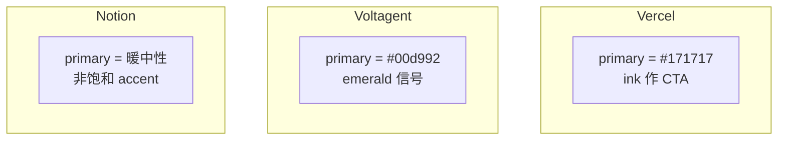
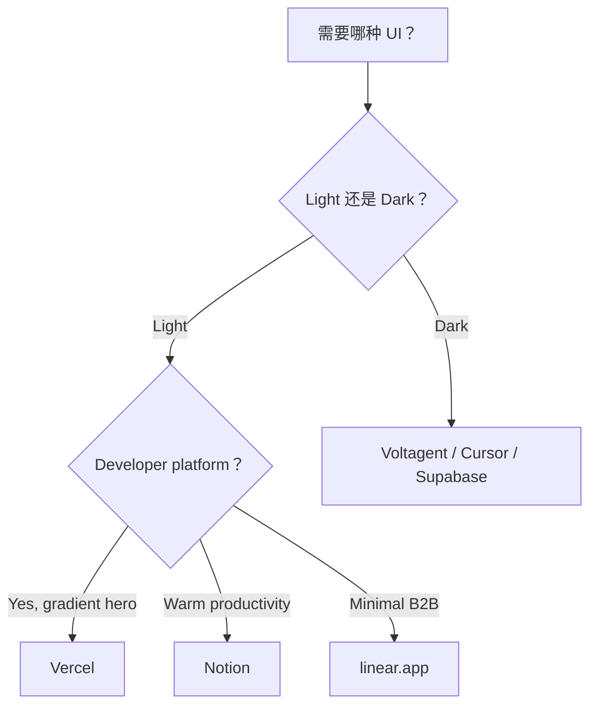

<details>
<summary>相关源文件</summary>

生成本页时使用的主要源文件：

- [design-md/vercel/DESIGN.md](../../../project-repos/awesome-design-md/design-md/vercel/DESIGN.md)
- [design-md/voltagent/DESIGN.md](../../../project-repos/awesome-design-md/design-md/voltagent/DESIGN.md)
- [design-md/notion/DESIGN.md](../../../project-repos/awesome-design-md/design-md/notion/DESIGN.md)

</details>

# 品牌档案深度对比

三份档案代表库内三种典型「设计 posture」：**light developer platform（Vercel）**、**dark agent engineering（Voltagent）**、**warm workspace minimalism（Notion）**。对照它们的颜色策略、字体决策和组件 chrome，比浏览 71 份列表更能建立选型直觉。

## 一句话气质

| 品牌 | description 摘要 | 设计 posture |
|------|------------------|--------------|
| Vercel | stark black-and-ink duet + mesh gradient decoration | 工程师营销页：白底、ink CTA、gradient 仅 hero |
| Voltagent | near-black canvas + electric-green accent + code mockups in hero | 文档站式 marketing：dark 全程、mono 技术声 |
| Notion | warm minimalism, serif headings, soft surfaces | 生产力工具：暖灰 surface、低 contrast 友好 |

Sources: [design-md/vercel/DESIGN.md:1-4](../../../project-repos/awesome-design-md/design-md/vercel/DESIGN.md#L1-L4), [design-md/voltagent/DESIGN.md:1-4](../../../project-repos/awesome-design-md/design-md/voltagent/DESIGN.md#L1-L4), [design-md/notion/DESIGN.md:1-4](../../../project-repos/awesome-design-md/design-md/notion/DESIGN.md#L1-L4)

<details class="source-snippets">
<summary>引用源码</summary>

<!-- source-snippets:start -->

#### `design-md/vercel/DESIGN.md:1-4`

```markdown
---
version: alpha
name: Vercel-Inspired-design-analysis
description: An inspired interpretation of Vercel's design language — a developer-platform brand whose surface is a stark black-and-ink duet on near-white canvas, broken at hero scale by a multi-color mesh gradient (cyan / blue / magenta / amber) that acts as the entire decorative system, paired with a custom geometric sans for headlines and a monospaced caption face for technical labels.
```

#### `design-md/voltagent/DESIGN.md:1-4`

```markdown
---
version: alpha
name: Voltagent-Inspired-design-analysis
description: An inspired interpretation of Voltagent's design language — a developer-focused AI agent engineering platform whose surface is an unrelenting near-black canvas broken only by a single electric-green brand accent, code-editor mockups inside the hero, and a precise grid of dark feature cards that read like a documentation site dressed as marketing.
```

#### `design-md/notion/DESIGN.md:1-4`

```markdown
---
version: alpha
name: Notion-design-analysis
description: Notion presents itself as the all-in-one workspace through a confident, illustration-rich brand voice — anchored by a deep navy hero band ({colors.brand-navy}) decorated with brand-colored sticky-note dots and mesh wire illustrations, a signature purple pill primary CTA ({colors.primary}), and a rich palette of pastel-tinted feature cards that echo the colorful database properties of the live product. The system uses a Notion-Sans (Inter-based) typeface across every UI surface, anchors a 4-tier pricing comparison (Free / Plus / Business / Enterprise), and presents the live workspace UI mockup directly inside the hero band. Coverage spans homepage, Enterprise, Product AI, Product Agents, Startups, and Pricing surfaces.
```

<!-- source-snippets:end -->
</details>

## Primary 色策略



- **Vercel**：`primary` 即 near-black ink——conversion target 与 body text 同色阶，靠 pill shape 和 size 区分 CTA。
- **Voltagent**：green on `#101010` canvas；`on-primary` 反而是 near-black `#101010`（绿底黑字 inverted logic）。
- **Notion**：accent 克制，靠 serif display + soft canvas 层级建立品牌，而非高饱和 primary。

Sources: [design-md/vercel/DESIGN.md:6-14](../../../project-repos/awesome-design-md/design-md/vercel/DESIGN.md#L6-L14), [design-md/voltagent/DESIGN.md:6-19](../../../project-repos/awesome-design-md/design-md/voltagent/DESIGN.md#L6-L19)

<details class="source-snippets">
<summary>引用源码</summary>

<!-- source-snippets:start -->

#### `design-md/vercel/DESIGN.md:6-14`

```markdown
colors:
  primary: "#171717"
  on-primary: "#ffffff"
  ink: "#171717"
  body: "#4d4d4d"
  mute: "#888888"
  hairline: "#ebebeb"
  hairline-strong: "#a1a1a1"
  canvas: "#ffffff"
```

#### `design-md/voltagent/DESIGN.md:6-19`

```markdown
colors:
  primary: "#00d992"
  primary-soft: "#2fd6a1"
  primary-deep: "#10b981"
  on-primary: "#101010"
  ink: "#f2f2f2"
  ink-strong: "#ffffff"
  body: "#bdbdbd"
  mute: "#8b949e"
  hairline: "#3d3a39"
  hairline-soft: "#b8b3b0"
  canvas: "#101010"
  canvas-soft: "#1a1a1a"
  canvas-text-soft: "#f5f6f7"
```

<!-- source-snippets:end -->
</details>

## 字体与 Display 权重

| 维度 | Vercel | Voltagent | Notion |
|------|--------|-----------|--------|
| 主 sans | Geist | Inter | 品牌 sans + serif 标题 |
| Hero size | 48px / w600 | 60px / w400 | 更大 display、偏 editorial |
| Tracking | 激进负值 (-2.4px) | 适度负值 | serif 标题正 tracking |
| Mono 用途 | Geist Mono 技术眉 | SF Mono 命令片段 | 较少强调 terminal |

**Insight**：Voltagent 故意用 **400 weight @ 60px** 对抗「AI 营销必 bold」的 cliché——读 DESIGN.md Overview 时会看到 rationale 写「calming counter to AI marketing's tendency to shout」。

Sources: [design-md/voltagent/DESIGN.md:348-351](../../../project-repos/awesome-design-md/design-md/voltagent/DESIGN.md#L348-L351), [design-md/vercel/DESIGN.md:451-455](../../../project-repos/awesome-design-md/design-md/vercel/DESIGN.md#L451-L455)

<details class="source-snippets">
<summary>引用源码</summary>

<!-- source-snippets:start -->

#### `design-md/voltagent/DESIGN.md:348-351`

```markdown
### Principles
- **Inter regular at 60 px display** is the brand's calming counter to AI marketing's tendency to shout. The light tracking and modest weight read like documentation.
- **Two-face contrast carries the technical voice.** Inter for narrative; SF Mono for anything that could be typed at a terminal.
- **Uppercase eyebrow with tracking is the brand's signature label style.** `2.52 px` at 14 px is the documented value.
```

#### `design-md/vercel/DESIGN.md:451-455`

```markdown
### Font Family
Two custom faces carry the entire system:

1. **A custom geometric sans** (extracted as `Geist`) for every display, body, button, link, and label. Weights 400 / 500 / 600 are the working set; the face never appears in 700 or heavier. Display sizes are tracked aggressively negative (`-2.4 px` at 48 px hero, `-1.28 px` at 32 px section); body stays at neutral or slightly-negative tracking.
2. **A custom monospaced face** (extracted as `Geist Mono`) for terminal mockups, code blocks, and small mono-caption labels — anything that wants to signal "technical." Weight 400 only at 12 – 13 px. Tracking neutral.
```

<!-- source-snippets:end -->
</details>

## 装饰系统

- **Vercel**：唯一装饰是 **multi-stop mesh gradient**（develop/preview/ship 三色对），严格限制 hero scale；Do's 明确禁止 icon-scale gradient。
- **Voltagent**：几乎无 gradient；depth 来自 hairline border on dark cards +  occasional green divider band。
- **Notion**：soft surface 层级 + 插画/图标留白；摄影非主路径。

Sources: [design-md/vercel/DESIGN.md:441-447](../../../project-repos/awesome-design-md/design-md/vercel/DESIGN.md#L441-L447), [design-md/vercel/DESIGN.md:729-733](../../../project-repos/awesome-design-md/design-md/vercel/DESIGN.md#L729-L733)

<details class="source-snippets">
<summary>引用源码</summary>

<!-- source-snippets:start -->

#### `design-md/vercel/DESIGN.md:441-447`

```markdown
### Brand Gradient
The brand's signature decoration is a three-pair gradient stack:
- **Develop** (`{colors.gradient-develop-start}` `#007cf0` → `{colors.gradient-develop-end}` `#00dfd8`) — the blue-to-teal pair used to mark the "deploy" / "develop" rhythm.
- **Preview** (`{colors.gradient-preview-start}` `#7928ca` → `{colors.gradient-preview-end}` `#ff0080`) — the violet-to-pink pair used for "preview" surfaces.
- **Ship** (`{colors.gradient-ship-start}` `#ff4d4d` → `{colors.gradient-ship-end}` `#f9cb28`) — the coral-to-amber pair used for "ship" surfaces.

The three pairs collapse into a single multi-color mesh gradient when used as the hero atmospheric backdrop. Treat the gradient as one unified object — do not crop down to a single colour, do not reorder the stops, and do not miniaturise. Used at hero scale only.
```

#### `design-md/vercel/DESIGN.md:729-733`

```markdown
### Don't
- Don't introduce a sixth accent colour. The brand operates with ink + gray + the four-pair gradient palette; new accents flatten the voice.
- Don't render headlines in all-caps. Sentence-case + negative tracking is non-negotiable.
- Don't drop a single heavy drop-shadow on cards. The brand's elevation is built from stacked small offsets + inset hairline rings.
- Don't render the brand gradient at icon scale or in a single-colour reduced form. The gradient lives at hero scale only.
```

<!-- source-snippets:end -->
</details>

## 圆角与按钮 scale

Vercel 共存 **100px marketing pill** 与 **6px nav button**——Do's 警告不要在同一屏混用两种 scale。Voltagent 统一 **6px (`rounded.sm`)** 方角按钮。Notion 偏 **soft rounded** 卡片与 larger touch-friendly control。

Sources: [design-md/vercel/DESIGN.md:721-735](../../../project-repos/awesome-design-md/design-md/vercel/DESIGN.md#L721-L735), [design-md/voltagent/DESIGN.md:108-114](../../../project-repos/awesome-design-md/design-md/voltagent/DESIGN.md#L108-L114)

<details class="source-snippets">
<summary>引用源码</summary>

<!-- source-snippets:start -->

#### `design-md/vercel/DESIGN.md:721-735`

```markdown
- Reserve `{colors.primary}` (`#171717`) for primary CTAs across the page. Black ink IS the conversion target.
- Use `{rounded.pill}` 100 px for every marketing-scale CTA and `{rounded.sm}` 6 px for nav-scale buttons. The two pill scales coexist deliberately.
- Set every headline in `{typography.display-*}` weight 600, sentence-case, often period-terminated. Aggressive negative tracking is part of the voice.
- Use the brand mesh gradient as atmospheric decoration at hero scale only — never miniaturise it to an icon, never reduce to a single colour.
- Layer stacked shadows (multiple small offsets with inset hairline) rather than single heavy drops. The brand's elevation is calmer than Material.
- Cycle page surfaces in `{colors.canvas-soft}` → `{colors.canvas}` → `{colors.primary}` polarity-flipped bands; the dark band IS the depth cue.
- Set every code block and technical eyebrow in `{typography.code}` / `{typography.caption-mono}`. Mono is the voice of the platform.

### Don't
- Don't introduce a sixth accent colour. The brand operates with ink + gray + the four-pair gradient palette; new accents flatten the voice.
- Don't render headlines in all-caps. Sentence-case + negative tracking is non-negotiable.
- Don't drop a single heavy drop-shadow on cards. The brand's elevation is built from stacked small offsets + inset hairline rings.
- Don't render the brand gradient at icon scale or in a single-colour reduced form. The gradient lives at hero scale only.
- Don't promote the geometric sans to weight 700. The brand's display ceiling is 600.
- Don't pair the marketing 100-px pill CTA shape with the 6-px nav radius on the same screen — pick a scale and stay there.
```

#### `design-md/voltagent/DESIGN.md:108-114`

```markdown
rounded:
  none: 0px
  xs: 4px
  sm: 6px
  md: 8px
  pill: 9999px
  full: 9999px
```

<!-- source-snippets:end -->
</details>

## 文件体量与完整度

| 档案 | 约行数 | Responsive / Agent Guide |
|------|--------|----------------------------|
| Vercel | ~737 | 无（止于 Do's and Don'ts） |
| Voltagent | ~522 | 含 Layout breakpoints 表 |
| Notion | ~800+ | 含 Responsive + Agent Prompt Guide |

选档案时：要 **最完整 Do's/Don'ts** 看 Vercel；要 **dark dev product** 看 Voltagent；要 **warm SaaS** 看 Notion。

Sources: [design-md/vercel/DESIGN.md:718-737](../../../project-repos/awesome-design-md/design-md/vercel/DESIGN.md#L718-L737), [design-md/voltagent/DESIGN.md:369-383](../../../project-repos/awesome-design-md/design-md/voltagent/DESIGN.md#L369-L383)

<details class="source-snippets">
<summary>引用源码</summary>

<!-- source-snippets:start -->

#### `design-md/vercel/DESIGN.md:718-737`

```markdown
## Do's and Don'ts

### Do
- Reserve `{colors.primary}` (`#171717`) for primary CTAs across the page. Black ink IS the conversion target.
- Use `{rounded.pill}` 100 px for every marketing-scale CTA and `{rounded.sm}` 6 px for nav-scale buttons. The two pill scales coexist deliberately.
- Set every headline in `{typography.display-*}` weight 600, sentence-case, often period-terminated. Aggressive negative tracking is part of the voice.
- Use the brand mesh gradient as atmospheric decoration at hero scale only — never miniaturise it to an icon, never reduce to a single colour.
- Layer stacked shadows (multiple small offsets with inset hairline) rather than single heavy drops. The brand's elevation is calmer than Material.
- Cycle page surfaces in `{colors.canvas-soft}` → `{colors.canvas}` → `{colors.primary}` polarity-flipped bands; the dark band IS the depth cue.
- Set every code block and technical eyebrow in `{typography.code}` / `{typography.caption-mono}`. Mono is the voice of the platform.

### Don't
- Don't introduce a sixth accent colour. The brand operates with ink + gray + the four-pair gradient palette; new accents flatten the voice.
- Don't render headlines in all-caps. Sentence-case + negative tracking is non-negotiable.
- Don't drop a single heavy drop-shadow on cards. The brand's elevation is built from stacked small offsets + inset hairline rings.
- Don't render the brand gradient at icon scale or in a single-colour reduced form. The gradient lives at hero scale only.
- Don't promote the geometric sans to weight 700. The brand's display ceiling is 600.
- Don't pair the marketing 100-px pill CTA shape with the 6-px nav radius on the same screen — pick a scale and stay there.
- Don't set body paragraphs in the mono face. The mono is for code + technical labels only.
```

#### `design-md/voltagent/DESIGN.md:369-383`

```markdown
### Responsive Strategy

#### Breakpoints

| Name | Width | Key Changes |
|---|---|---|
| Mobile | < 768px | Hero 60→32 px; cards 1-up; nav hamburger. |
| Tablet | 768–1023px | Cards 2-up; nav stays horizontal. |
| Desktop | ≥ 1024px | Full 3-up card grids. |

#### Touch Targets
Buttons render at ~44 px tall (12 px vertical padding + 24 px line-height). Meet WCAG AAA at all breakpoints.

#### Collapsing Strategy
Nav collapses to hamburger at mobile; the menu overlay keeps the same green CTA pinned at the bottom. Feature-card grids drop to 1-up; hero typography scales fluidly.
```

<!-- source-snippets:end -->
</details>

## 代理选型决策树



## 相关页面

- [品牌目录与分类](brand-catalog.md) — 全库分类
- [Token 与组件模型](token-component-model.md) — token 引用语法
- [代理消费工作流](agent-consumption.md) — 复制与 prompt
