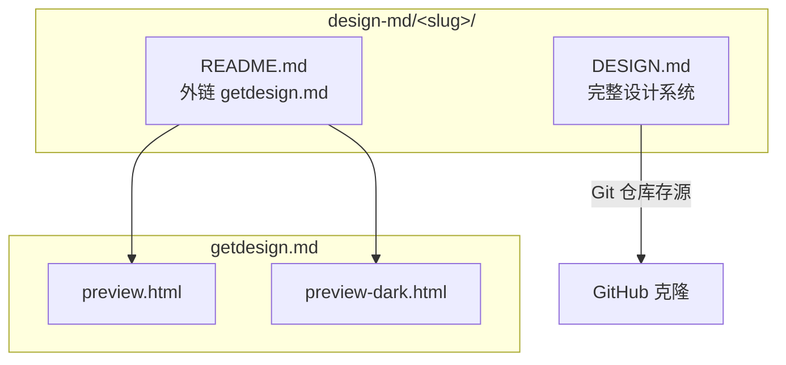
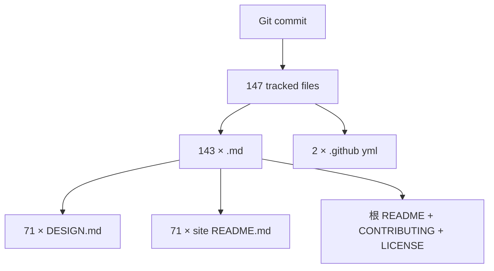

<details>
<summary>相关源文件</summary>

生成本页时使用的主要源文件：

- [README.md](../../../project-repos/awesome-design-md/README.md)
- [design-md/vercel/README.md](../../../project-repos/awesome-design-md/design-md/vercel/README.md)
- [design-md/voltagent/README.md](../../../project-repos/awesome-design-md/design-md/voltagent/README.md)
- [.gitignore](../../../project-repos/awesome-design-md/.gitignore)

</details>

# 目录与仓库结构

整个仓库是一个**扁平静态内容库**：没有 monorepo、没有代码生成脚本、没有 CI workflow。所有「架构」都体现在目录命名和内容重复模式上——每个品牌占一个 slug 子目录，内部文件角色固定。

## 顶层布局

```text
awesome-design-md/
├── README.md              # 人类入口：概念 + 分类索引 + 使用说明
├── CONTRIBUTING.md        # 治理规则
├── LICENSE
├── .github/               # Issue 模板 + Funding
└── design-md/             # 全部品牌档案（71 个子目录）
```

`.gitignore` 仅忽略 OS 垃圾文件（`.DS_Store`），没有构建产物目录——因为仓库本身不产出编译物。

Sources: [gitignore:1-2](../../../project-repos/awesome-design-md/gitignore#L1-L2)

<details class="source-snippets">
<summary>引用源码</summary>

<!-- source-snippets:start -->

#### `gitignore:1-2`

> 未找到引用文件：`gitignore`

<!-- source-snippets:end -->
</details>

## 品牌子目录约定

每个品牌在 `design-md/<slug>/` 下占独立命名空间。slug 通常等于域名主干：

| slug 示例 | 对应品牌 | 命名特点 |
|-----------|----------|----------|
| `linear.app` | Linear | 保留完整域名 |
| `mistral.ai` | Mistral AI | 含 TLD |
| `bmw-m` | BMW M | 连字符区分子品牌 |
| `theverge` | The Verge | 域名简化 |

**标准文件角色**：

| 文件 | 角色 |
|------|------|
| `DESIGN.md` | 主产物：YAML frontmatter + Markdown 设计叙事 |
| `README.md` | 短指针：链到 getdesign.md 预览与下载 |



Sources: [design-md/vercel/README.md:1-5](../../../project-repos/awesome-design-md/design-md/vercel/README.md#L1-L5), [README.md:169-175](../../../project-repos/awesome-design-md/README.md#L169-L175)

<details class="source-snippets">
<summary>引用源码</summary>

<!-- source-snippets:start -->

#### `design-md/vercel/README.md:1-5`

```markdown
# Vercel Inspired Design System Analysis

Design system details have been moved to: https://getdesign.md/vercel/design-md

You can also view previews, dark mode examples, and download options on getdesign.md.
```

#### `README.md:169-175`

```markdown
Each site includes:

| File | Purpose |
|------|---------|
| `DESIGN.md` | The design system (what agents read) |
| `preview.html` | Visual catalog showing color swatches, type scale, buttons, cards |
| `preview-dark.html` | Same catalog with dark surfaces |
```

<!-- source-snippets:end -->
</details>

## README 与 getdesign.md 的分工

一个容易误读的点：根 `README.md` 写「每站含 `preview.html` / `preview-dark.html`」，但 **Git 树里当前只有 Markdown**。预览 HTML 托管在 getdesign.md；子目录 `README.md` 统一把读者导向 `https://getdesign.md/<slug>/design-md`。

这是刻意的**双轨分发**——Git 仓轻量、可 fork；getdesign.md 承载可视化 catalog 与商业请求（优先队列、私有定制）。

Sources: [README.md:169-175](../../../project-repos/awesome-design-md/README.md#L169-L175), [design-md/voltagent/README.md:1-5](../../../project-repos/awesome-design-md/design-md/voltagent/README.md#L1-L5)

<details class="source-snippets">
<summary>引用源码</summary>

<!-- source-snippets:start -->

#### `README.md:169-175`

```markdown
Each site includes:

| File | Purpose |
|------|---------|
| `DESIGN.md` | The design system (what agents read) |
| `preview.html` | Visual catalog showing color swatches, type scale, buttons, cards |
| `preview-dark.html` | Same catalog with dark surfaces |
```

#### `design-md/voltagent/README.md:1-5`

```markdown
# VoltAgent Inspired Design System Analysis

Design system details have been moved to: https://getdesign.md/voltagent/design-md

You can also view previews, dark mode examples, and download options on getdesign.md.
```

<!-- source-snippets:end -->
</details>

## 静态内容模型

仓库没有：

- `package.json` / `pyproject.toml`
- GitHub Actions workflow
- 生成脚本或 linter

所有「版本」即 Git commit。品牌条目之间**零代码依赖**——加一个新品牌 = 加一个新子目录，不影响其他 slug。



Sources: [00-repo-inventory.md](../00-repo-inventory.md)

<details class="source-snippets">
<summary>引用源码</summary>

<!-- source-snippets:start -->

#### `00-repo-inventory.md`

```markdown
# 00 - 仓库盘点

## Source

- Path: `/Users/bytedance/workspace/workspace-local-task/deepwiki/project-repos/awesome-design-md`
- Remote: `https://github.com/voltagent/awesome-design-md.git`
- Branch: `main`
- Commit: `3883984baf05226208a5dae15730a3593548b808`

## File Summary

- Files scanned: 147
- Top-level directories: `.github`, `design-md`

| Extension | Count |
|-----------|------:|
| `.md` | 143 |
| `.yml` | 2 |
| `[no extension]` | 2 |

## Manifests and Build Files

- None detected

## Documentation

- `CONTRIBUTING.md`
- `README.md`
- `design-md/airbnb/README.md`
- `design-md/airtable/README.md`
- `design-md/apple/README.md`
- `design-md/binance/README.md`
- `design-md/bmw-m/README.md`
- `design-md/bmw/README.md`
- `design-md/bugatti/README.md`
- `design-md/cal/README.md`
- `design-md/claude/README.md`
- `design-md/clay/README.md`
- `design-md/clickhouse/README.md`
- `design-md/cohere/README.md`
- `design-md/coinbase/README.md`
- `design-md/composio/README.md`
- `design-md/cursor/README.md`
- `design-md/elevenlabs/README.md`
- `design-md/expo/README.md`
- `design-md/ferrari/README.md`
- `design-md/figma/README.md`
- `design-md/framer/README.md`
- `design-md/hashicorp/README.md`
- `design-md/ibm/README.md`
- `design-md/intercom/README.md`
- `design-md/kraken/README.md`
- `design-md/lamborghini/README.md`
- `design-md/linear.app/README.md`
- `design-md/lovable/README.md`
- `design-md/mastercard/README.md`
- `design-md/meta/README.md`
- `design-md/minimax/README.md`
- `design-md/mintlify/README.md`
- `design-md/miro/README.md`
- `design-md/mistral.ai/README.md`
- `design-md/mongodb/README.md`
- `design-md/nike/README.md`
- `design-md/notion/README.md`
- `design-md/nvidia/README.md`
- `design-md/ollama/README.md`
- `design-md/opencode.ai/README.md`
- `design-md/pinterest/README.md`
- `design-md/playstation/README.md`
- `design-md/posthog/README.md`
- `design-md/raycast/README.md`
- `design-md/renault/README.md`
- `design-md/replicate/README.md`
- `design-md/resend/README.md`
- `design-md/revolut/README.md`
- `design-md/runwayml/README.md`
- `design-md/sanity/README.md`
- `design-md/sentry/README.md`
- `design-md/shopify/README.md`
- `design-md/spacex/README.md`
- `design-md/spotify/README.md`
- `design-md/starbucks/README.md`
- `design-md/stripe/README.md`
- `design-md/supabase/README.md`
- `design-md/superhuman/README.md`
- `design-md/tesla/README.md`
- `design-md/theverge/README.md`
- `design-md/together.ai/README.md`
- `design-md/uber/README.md`
- `design-md/vercel/README.md`
- `design-md/vodafone/README.md`
- `design-md/voltagent/README.md`
- `design-md/warp/README.md`
- `design-md/webflow/README.md`
- `design-md/wired/README.md`
- `design-md/wise/README.md`
- `design-md/x.ai/README.md`
- `design-md/zapier/README.md`

## CI and Automation

- None detected

## Tests

- None detected

## Skills

- None detected
```

<!-- source-snippets:end -->
</details>

## 设计洞察

**为什么不用 JSON/YAML 单文件仓库？** Markdown 叙事层承载 Do's and Don'ts、品牌语气、渐变使用边界——这些是代理做 UI 决策时最缺、JSON token 最难表达的部分。YAML frontmatter 只承担「可引用 token」，长 prose 留在 `---` 之后。

**为什么 slug 目录互不引用？** 每个 `DESIGN.md` 是自包含快照，代理只需复制单文件。跨品牌 theme 混用是消费者侧行为，库本身不做继承链。

## 相关页面

- [项目概览](overview.md) — DESIGN.md 概念与定位
- [品牌目录与分类](brand-catalog.md) — 71 品牌分类索引
- [分发与 getdesign.md 生态](distribution-ecosystem.md) — 预览与请求流程
