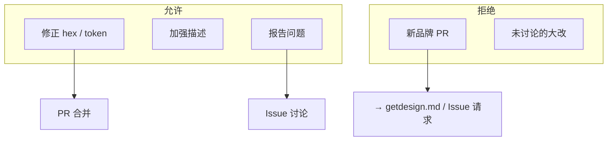

<details>
<summary>相关源文件</summary>

生成本页时使用的主要源文件：

- [CONTRIBUTING.md](../../../project-repos/awesome-design-md/CONTRIBUTING.md)
- [LICENSE](../../../project-repos/awesome-design-md/LICENSE)
- [.github/FUNDING.yml](../../../project-repos/awesome-design-md/.github/FUNDING.yml)

</details>

# 贡献与治理

这是一个**策展型（curated）**开源库：质量与法律风险由 VoltAgent 集中把控，社区参与面被刻意收窄——能改现有条目，不能随意新增品牌档案。

## 贡献路径

CONTRIBUTING 只列一条有效路径：**改进已有 DESIGN.md**。

流程：

1. **先开 Issue** 描述变更、等 maintainer 反馈
2. 对照 live site 检查 hex、token、描述
3. 修改 `design-md/<slug>/DESIGN.md`
4. 若 token 影响展示，同步更新 preview（在 getdesign.md 侧；CONTRIBUTING 仍写 preview.html 义务）
5. 开 PR 附 before/after 理由

Sources: [CONTRIBUTING.md:9-18](../../../project-repos/awesome-design-md/CONTRIBUTING.md#L9-L18)

<details class="source-snippets">
<summary>引用源码</summary>

<!-- source-snippets:start -->

#### `CONTRIBUTING.md:9-18`

```markdown
### Improve an Existing DESIGN.md

If you notice issues with an existing file:

1. **Open an issue first** to describe what you'd like to change and get feedback from maintainers
2. Open the site's `DESIGN.md`
3. Compare against the live site
4. Fix incorrect hex values, missing tokens, or weak descriptions
5. Update the `preview.html` and `preview-dark.html` if your changes affect displayed tokens
6. Open a PR with before/after rationale
```

<!-- source-snippets:end -->
</details>

## 硬边界：不接受新 DESIGN.md PR

CONTRIBUTING 第 21 行明确：

> We cannot accept DESIGN.md pull requests to maintain the quality of the existing collection.

**原因推断（从文件结构反推）**：

- 每份档案是从 live site 提取 CSS 值的 labor-intensive 工作
- 视觉身份版权/商标风险需 maintainer 统一 disclaimer
- 新品牌走 Issue / getdesign.md 付费队列，保证风格一致

Sources: [CONTRIBUTING.md:21](../../../project-repos/awesome-design-md/CONTRIBUTING.md:21)

<details class="source-snippets">
<summary>引用源码</summary>

<!-- source-snippets:start -->

#### `CONTRIBUTING.md:21`

> 未找到引用文件：`CONTRIBUTING.md:21`

<!-- source-snippets:end -->
</details>



## 法律与免责声明

MIT License 覆盖仓库代码与文档文本，但 LICENSE 末尾附加 **design extraction disclaimer**：

- DESIGN.md 按「as is」提供，无 warranty
- token 代表**公开可见的 CSS 值**提取
- **不声称拥有**任何网站视觉 identity
- 目的是帮助 AI agent 生成 consistent UI

使用者将 DESIGN.md 用于商业产品时，仍需自行评估商标/品牌合规——库不提供法律保证。

Sources: [LICENSE:1-21](../../../project-repos/awesome-design-md/LICENSE#L1-L21)

<details class="source-snippets">
<summary>引用源码</summary>

<!-- source-snippets:start -->

#### `LICENSE:1-21`

```
MIT License

Copyright (c) 2026 VoltAgent

Permission is hereby granted, free of charge, to any person obtaining a copy
of this software and associated documentation files (the "Software"), to deal
in the Software without restriction, including without limitation the rights
to use, copy, modify, merge, publish, distribute, sublicense, and/or sell
copies of the Software, and to permit persons to whom the Software is
furnished to do so, subject to the following conditions:

The above copyright notice and this permission notice shall be included in all
copies or substantial portions of the Software.

THE SOFTWARE IS PROVIDED "AS IS", WITHOUT WARRANTY OF ANY KIND, EXPRESS OR
IMPLIED, INCLUDING BUT NOT LIMITED TO THE WARRANTIES OF MERCHANTABILITY,
FITNESS FOR A PARTICULAR PURPOSE AND NONINFRINGEMENT. IN NO EVENT SHALL THE
AUTHORS OR COPYRIGHT HOLDERS BE LIABLE FOR ANY CLAIM, DAMAGES OR OTHER
LIABILITY, WHETHER IN AN ACTION OF CONTRACT, TORT OR OTHERWISE, ARISING FROM,
OUT OF OR IN CONNECTION WITH THE SOFTWARE OR THE USE OR OTHER DEALINGS IN THE
SOFTWARE.
```

<!-- source-snippets:end -->
</details>

## Issue 模板治理

`design-md-request.yml` 是**需求 intake**，不是贡献 PR 的替代——它把新品牌请求导入 maintainer 队列，与 CONTRIBUTING 的「no new PR」策略一致。

Sources: [github/ISSUE_TEMPLATE/design-md-request.yml:1-6](../../../project-repos/awesome-design-md/.github/ISSUE_TEMPLATE/design-md-request.yml#L1-L6)

<details class="source-snippets">
<summary>引用源码</summary>

<!-- source-snippets:start -->

#### `github/ISSUE_TEMPLATE/design-md-request.yml:1-6`

```yaml
name: Design MD Request
description: Request a DESIGN.md generated from a website
title: "DESIGN.md request"
labels: ["design-md"]

body:
```

<!-- source-snippets:end -->
</details>

## 质量门槛（implicit）

虽无 automated CI，maintainer 隐含标准可从现有档案归纳：

- YAML token 与 Markdown prose 交叉引用一致
- Do's and Don'ts 含可执行的禁止项（非空话）
- Overview 解释 **why** 而非罗列 hex
- 较新条目含 Responsive + Agent Prompt Guide

改进 PR 应对照 live site 而非其他 DESIGN.md 抄袭。

Sources: [design-md/vercel/DESIGN.md:718-737](../../../project-repos/awesome-design-md/design-md/vercel/DESIGN.md#L718-L737)

<details class="source-snippets">
<summary>引用源码</summary>

<!-- source-snippets:start -->

#### `design-md/vercel/DESIGN.md:718-737`

```markdown
## Do's and Don'ts

### Do
- Reserve `{colors.primary}` (`#171717`) for primary CTAs across the page. Black ink IS the conversion target.
- Use `{rounded.pill}` 100 px for every marketing-scale CTA and `{rounded.sm}` 6 px for nav-scale buttons. The two pill scales coexist deliberately.
- Set every headline in `{typography.display-*}` weight 600, sentence-case, often period-terminated. Aggressive negative tracking is part of the voice.
- Use the brand mesh gradient as atmospheric decoration at hero scale only — never miniaturise it to an icon, never reduce to a single colour.
- Layer stacked shadows (multiple small offsets with inset hairline) rather than single heavy drops. The brand's elevation is calmer than Material.
- Cycle page surfaces in `{colors.canvas-soft}` → `{colors.canvas}` → `{colors.primary}` polarity-flipped bands; the dark band IS the depth cue.
- Set every code block and technical eyebrow in `{typography.code}` / `{typography.caption-mono}`. Mono is the voice of the platform.

### Don't
- Don't introduce a sixth accent colour. The brand operates with ink + gray + the four-pair gradient palette; new accents flatten the voice.
- Don't render headlines in all-caps. Sentence-case + negative tracking is non-negotiable.
- Don't drop a single heavy drop-shadow on cards. The brand's elevation is built from stacked small offsets + inset hairline rings.
- Don't render the brand gradient at icon scale or in a single-colour reduced form. The gradient lives at hero scale only.
- Don't promote the geometric sans to weight 700. The brand's display ceiling is 600.
- Don't pair the marketing 100-px pill CTA shape with the 6-px nav radius on the same screen — pick a scale and stay there.
- Don't set body paragraphs in the mono face. The mono is for code + technical labels only.
```

<!-- source-snippets:end -->
</details>

## 相关页面

- [分发与 getdesign.md 生态](distribution-ecosystem.md) — 新品牌请求入口
- [项目概览](overview.md) — 仓库定位
- [品牌目录与分类](brand-catalog.md) — 现有 71 品牌范围
