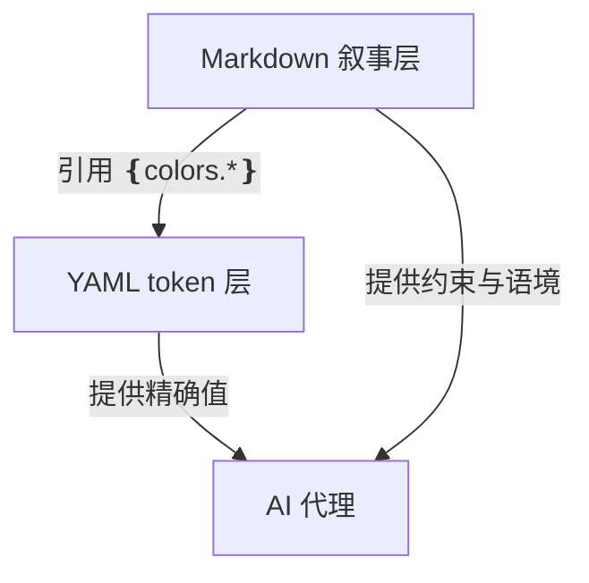

<details>
<summary>相关源文件</summary>

生成本页时使用的主要源文件：

- [README.md](../../../project-repos/awesome-design-md/README.md)
- [design-md/vercel/DESIGN.md](../../../project-repos/awesome-design-md/design-md/vercel/DESIGN.md)
- [design-md/notion/DESIGN.md](../../../project-repos/awesome-design-md/design-md/notion/DESIGN.md)

</details>

# DESIGN.md 文档格式

每份 `DESIGN.md` 采用 **YAML 机器层 + Markdown 叙事层** 的双轨结构：前半段是可解析的设计 token，后半段是面向代理的设计 rationale。这种 split 让同一份文件同时服务「精确引用 hex/字号」和「理解为什么不能用第七种 accent 色」两种读法。

## 文件骨架

```text
---
version: alpha
name: Brand-Inspired-design-analysis
description: …
colors: { … }
typography: { … }
rounded: { … }
spacing: { … }
components: { … }
---

## Overview
## Colors
## Typography
…（叙事章节）
```

YAML 块以 `---` 包裹，紧跟其后的 `##` 标题进入人类/代理共读区。

Sources: [design-md/vercel/DESIGN.md:1-4](../../../project-repos/awesome-design-md/design-md/vercel/DESIGN.md#L1-L4), [design-md/vercel/DESIGN.md:390-393](../../../project-repos/awesome-design-md/design-md/vercel/DESIGN.md#L390-L393)

<details class="source-snippets">
<summary>引用源码</summary>

<!-- source-snippets:start -->

#### `design-md/vercel/DESIGN.md:1-4`

```markdown
---
version: alpha
name: Vercel-Inspired-design-analysis
description: An inspired interpretation of Vercel's design language — a developer-platform brand whose surface is a stark black-and-ink duet on near-white canvas, broken at hero scale by a multi-color mesh gradient (cyan / blue / magenta / amber) that acts as the entire decorative system, paired with a custom geometric sans for headlines and a monospaced caption face for technical labels.
```

#### `design-md/vercel/DESIGN.md:390-393`

```markdown
---


## Overview
```

<!-- source-snippets:end -->
</details>

## Stitch 标准章节 vs 本库扩展

根 README 列出 9 个标准节（Visual Theme、Color Palette、Typography、Component Stylings、Layout、Depth、Do's and Don'ts、Responsive、Agent Prompt Guide）。实际文件章节标题略有演化：

| README 承诺节 | 典型文件中的标题 | 覆盖情况 |
|---------------|------------------|----------|
| Visual Theme & Atmosphere | `## Overview` | 全部 |
| Color Palette & Roles | `## Colors` | 全部 |
| Typography Rules | `## Typography` | 全部 |
| Component Stylings | `## Components` | 全部 |
| Layout Principles | `## Layout` | 几乎全部 |
| Depth & Elevation | `## Elevation & Depth` | 大部分 |
| Do's and Don'ts | `## Do's and Don'ts` | 大部分 |
| Responsive Behavior | `## Responsive Behavior` | 多数较新条目 |
| Agent Prompt Guide | `## 9. Agent Prompt Guide` 或类似 | 部分条目 |

Vercel 档案到 `## Do's and Don'ts` 为止（718 行），未含 Responsive / Agent Prompt——说明库内存在**代际格式差异**，较新品牌（Notion、Stripe、Slack）更完整。

Sources: [README.md:153-167](../../../project-repos/awesome-design-md/README.md#L153-L167), [design-md/vercel/DESIGN.md:718-737](../../../project-repos/awesome-design-md/design-md/vercel/DESIGN.md#L718-L737)

<details class="source-snippets">
<summary>引用源码</summary>

<!-- source-snippets:start -->

#### `README.md:153-167`

```markdown
## What's Inside Each DESIGN.md

Every file follows the [Stitch DESIGN.md format](https://stitch.withgoogle.com/docs/design-md/format/) with extended sections:

| # | Section | What it captures |
|---|---------|-----------------|
| 1 | Visual Theme & Atmosphere | Mood, density, design philosophy |
| 2 | Color Palette & Roles | Semantic name + hex + functional role |
| 3 | Typography Rules | Font families, full hierarchy table |
| 4 | Component Stylings | Buttons, cards, inputs, navigation with states |
| 5 | Layout Principles | Spacing scale, grid, whitespace philosophy |
| 6 | Depth & Elevation | Shadow system, surface hierarchy |
| 7 | Do's and Don'ts | Design guardrails and anti-patterns |
| 8 | Responsive Behavior | Breakpoints, touch targets, collapsing strategy |
| 9 | Agent Prompt Guide | Quick color reference, ready-to-use prompts |
```

#### `design-md/vercel/DESIGN.md:718-737`

```markdown
## Do's and Don'ts

### Do
- Reserve `{colors.primary}` (`#171717`) for primary CTAs across the page. Black ink IS the conversion target.
- Use `{rounded.pill}` 100 px for every marketing-scale CTA and `{rounded.sm}` 6 px for nav-scale buttons. The two pill scales coexist deliberately.
- Set every headline in `{typography.display-*}` weight 600, sentence-case, often period-terminated. Aggressive negative tracking is part of the voice.
- Use the brand mesh gradient as atmospheric decoration at hero scale only — never miniaturise it to an icon, never reduce to a single colour.
- Layer stacked shadows (multiple small offsets with inset hairline) rather than single heavy drops. The brand's elevation is calmer than Material.
- Cycle page surfaces in `{colors.canvas-soft}` → `{colors.canvas}` → `{colors.primary}` polarity-flipped bands; the dark band IS the depth cue.
- Set every code block and technical eyebrow in `{typography.code}` / `{typography.caption-mono}`. Mono is the voice of the platform.

### Don't
- Don't introduce a sixth accent colour. The brand operates with ink + gray + the four-pair gradient palette; new accents flatten the voice.
- Don't render headlines in all-caps. Sentence-case + negative tracking is non-negotiable.
- Don't drop a single heavy drop-shadow on cards. The brand's elevation is built from stacked small offsets + inset hairline rings.
- Don't render the brand gradient at icon scale or in a single-colour reduced form. The gradient lives at hero scale only.
- Don't promote the geometric sans to weight 700. The brand's display ceiling is 600.
- Don't pair the marketing 100-px pill CTA shape with the 6-px nav radius on the same screen — pick a scale and stay there.
- Don't set body paragraphs in the mono face. The mono is for code + technical labels only.
```

<!-- source-snippets:end -->
</details>

## YAML 元数据字段

| 字段 | 用途 | 示例 |
|------|------|------|
| `version` | 格式版本标记 | `alpha` |
| `name` | 内部分析名称 | `Vercel-Inspired-design-analysis` |
| `description` | 一段话设计气质摘要 | 多句 prose，描述 canvas/gradient/type voice |
| `colors` | 语义色 token → hex | `primary: "#171717"` |
| `typography` | 层级 token → 字体指标 | `display-xl.fontSize: 48px` |
| `rounded` | 圆角 scale | `pill: 100px` |
| `spacing` | 间距 scale | `section: 192px` |
| `components` | 组件 chrome 定义 | `button-primary.backgroundColor: "{colors.primary}"` |

`description` 字段本身是一段高质量 design brief——Often 比 Overview 第一节更压缩，适合代理快速扫描气质。

Sources: [design-md/vercel/DESIGN.md:1-4](../../../project-repos/awesome-design-md/design-md/vercel/DESIGN.md#L1-L4), [design-md/voltagent/DESIGN.md:1-4](../../../project-repos/awesome-design-md/design-md/voltagent/DESIGN.md#L1-L4)

<details class="source-snippets">
<summary>引用源码</summary>

<!-- source-snippets:start -->

#### `design-md/vercel/DESIGN.md:1-4`

```markdown
---
version: alpha
name: Vercel-Inspired-design-analysis
description: An inspired interpretation of Vercel's design language — a developer-platform brand whose surface is a stark black-and-ink duet on near-white canvas, broken at hero scale by a multi-color mesh gradient (cyan / blue / magenta / amber) that acts as the entire decorative system, paired with a custom geometric sans for headlines and a monospaced caption face for technical labels.
```

#### `design-md/voltagent/DESIGN.md:1-4`

```markdown
---
version: alpha
name: Voltagent-Inspired-design-analysis
description: An inspired interpretation of Voltagent's design language — a developer-focused AI agent engineering platform whose surface is an unrelenting near-black canvas broken only by a single electric-green brand accent, code-editor mockups inside the hero, and a precise grid of dark feature cards that read like a documentation site dressed as marketing.
```

<!-- source-snippets:end -->
</details>

## Markdown 叙事层写法

叙事章节用 `{colors.primary}`、`{typography.display-xl}` **回指 YAML token**，形成闭环：代理读 prose 时看到的语义名，可直接在 YAML 查 hex。

典型模式：

- **Overview**：品牌 posture（developer platform / luxury automotive / editorial media）
- **Colors**：按 Brand & Accent / Surface / Text / Semantic 分组，每项带 hex 和功能角色
- **Typography**：字体族说明 + 完整 hierarchy 表格
- **Components**：按 Buttons / Cards / Navigation 分块，描述 state 与 chrome
- **Do's and Don'ts**：硬约束列表——代理最容易违反的规则显式写出



Sources: [design-md/vercel/DESIGN.md:409-447](../../../project-repos/awesome-design-md/design-md/vercel/DESIGN.md#L409-L447), [design-md/vercel/DESIGN.md:718-737](../../../project-repos/awesome-design-md/design-md/vercel/DESIGN.md#L718-L737)

<details class="source-snippets">
<summary>引用源码</summary>

<!-- source-snippets:start -->

#### `design-md/vercel/DESIGN.md:409-447`

```markdown
## Colors

### Brand & Accent
- **Ink** (`{colors.primary}` — `#171717`): The single primary CTA color. Black-near-pure ink that carries every Sign Up pill, every footer CTA, the dark-band polarity-flip. Used as text color throughout the page on light surfaces. (Resolved from `--ds-gray-1000`.)
- **Cyan** (`{colors.cyan}` — `#50e3c2`): A signature mint-cyan used in the brand gradient and inside Geist-system spotlight tokens. Visible inside the hero gradient stops.
- **Highlight Pink** (`{colors.highlight-pink}` — `#ff0080`): The brand's highlight magenta, used as the high-saturation stop in the preview-gradient pair.
- **Violet** (`{colors.violet}` — `#7928ca`): The deep purple used as the start of the preview-gradient and inside developer-console highlights.
- **Link Blue** (`{colors.link}` — `#0070f3`): The brand's primary link color and the legacy `--geist-success` semantic.

### Surface
- **Canvas** (`{colors.canvas}` — `#ffffff`): The pure-white card / dialog / modal surface.
- **Canvas Soft** (`{colors.canvas-soft}` — `#fafafa`): The default page background — 98 % white. Almost every section sits on this tone.
- **Canvas Soft 2** (`{colors.canvas-soft-2}` — `#f5f5f5`): A slightly deeper inset surface for "code editor inner background", template-card hover states, and dropdown menus.
- **Hairline** (`{colors.hairline}` — `#ebebeb`): 1 px dividers — table rows, card borders, input borders.
- **Hairline Strong** (`{colors.hairline-strong}` — `#a1a1a1`): The 500-level gray, used as the slightly-stronger divider on light bands and as the deemphasised text color.

### Text
- **Ink** (`{colors.ink}` — `#171717`): Every heading and body paragraph on light surfaces.
- **Body** (`{colors.body}` — `#4d4d4d`): Secondary text — sub-headings, body captions, nav-link inactive text, footer column body.
- **Mute** (`{colors.mute}` — `#888888`): Lowest-priority text — placeholder text, fine print, low-key labels.
- **On Primary** (`{colors.on-primary}` — `#ffffff`): All text on `{colors.primary}` surfaces.

### Semantic
- **Success / Link** (`{colors.success}` — `#0070f3`): The brand's legacy success indicator doubles as the primary link color. Visible underline-on-hover for inline body links.
- **Link Deep** (`{colors.link-deep}` — `#0761d1`): The pressed / visited tone for inline links.
- **Link Bg Soft** (`{colors.link-bg-soft}` — `#d3e5ff`): Soft pastel blue fill for "what's new" pill banners and informational badges.
- **Error** (`{colors.error}` — `#ee0000`): Validation red for destructive actions and form errors.
- **Error Soft** (`{colors.error-soft}` — `#f7d4d6`): Soft pastel red for destructive-state backgrounds.
- **Error Deep** (`{colors.error-deep}` — `#c50000`): Pressed / deep destructive state.
- **Warning** (`{colors.warning}` — `#f5a623`): Caution / pending status indicator.
- **Warning Soft** (`{colors.warning-soft}` — `#ffefcf`) / **Warning Deep** (`{colors.warning-deep}` — `#ab570a`): Background + pressed variants.

### Brand Gradient
The brand's signature decoration is a three-pair gradient stack:
- **Develop** (`{colors.gradient-develop-start}` `#007cf0` → `{colors.gradient-develop-end}` `#00dfd8`) — the blue-to-teal pair used to mark the "deploy" / "develop" rhythm.
- **Preview** (`{colors.gradient-preview-start}` `#7928ca` → `{colors.gradient-preview-end}` `#ff0080`) — the violet-to-pink pair used for "preview" surfaces.
- **Ship** (`{colors.gradient-ship-start}` `#ff4d4d` → `{colors.gradient-ship-end}` `#f9cb28`) — the coral-to-amber pair used for "ship" surfaces.

The three pairs collapse into a single multi-color mesh gradient when used as the hero atmospheric backdrop. Treat the gradient as one unified object — do not crop down to a single colour, do not reorder the stops, and do not miniaturise. Used at hero scale only.
```

#### `design-md/vercel/DESIGN.md:718-737`

```markdown
## Do's and Don'ts

### Do
- Reserve `{colors.primary}` (`#171717`) for primary CTAs across the page. Black ink IS the conversion target.
- Use `{rounded.pill}` 100 px for every marketing-scale CTA and `{rounded.sm}` 6 px for nav-scale buttons. The two pill scales coexist deliberately.
- Set every headline in `{typography.display-*}` weight 600, sentence-case, often period-terminated. Aggressive negative tracking is part of the voice.
- Use the brand mesh gradient as atmospheric decoration at hero scale only — never miniaturise it to an icon, never reduce to a single colour.
- Layer stacked shadows (multiple small offsets with inset hairline) rather than single heavy drops. The brand's elevation is calmer than Material.
- Cycle page surfaces in `{colors.canvas-soft}` → `{colors.canvas}` → `{colors.primary}` polarity-flipped bands; the dark band IS the depth cue.
- Set every code block and technical eyebrow in `{typography.code}` / `{typography.caption-mono}`. Mono is the voice of the platform.

### Don't
- Don't introduce a sixth accent colour. The brand operates with ink + gray + the four-pair gradient palette; new accents flatten the voice.
- Don't render headlines in all-caps. Sentence-case + negative tracking is non-negotiable.
- Don't drop a single heavy drop-shadow on cards. The brand's elevation is built from stacked small offsets + inset hairline rings.
- Don't render the brand gradient at icon scale or in a single-colour reduced form. The gradient lives at hero scale only.
- Don't promote the geometric sans to weight 700. The brand's display ceiling is 600.
- Don't pair the marketing 100-px pill CTA shape with the 6-px nav radius on the same screen — pick a scale and stay there.
- Don't set body paragraphs in the mono face. The mono is for code + technical labels only.
```

<!-- source-snippets:end -->
</details>

## 格式演进洞察

**`version: alpha`** 出现在所有抽检文件——说明格式仍在迭代，消费者不应假设 JSON schema 稳定。

**组件区的 `ex-*` 前缀块**（如 `ex-pricing-tier`、`ex-modal-card`）是「示例组件」：注释写明 auto-derived / illustrative，把营销站 chrome 映射到通用 UI 模式（定价卡、模态框、空状态），方便代理迁移到 SaaS 场景。

Sources: [design-md/vercel/DESIGN.md:329-388](../../../project-repos/awesome-design-md/design-md/vercel/DESIGN.md#L329-L388)

<details class="source-snippets">
<summary>引用源码</summary>

<!-- source-snippets:start -->

#### `design-md/vercel/DESIGN.md:329-388`

```markdown
  # ─── Examples (illustrative) — auto-derived; resolve any TO_FILL markers below ───
  ex-pricing-tier:
    description: "Default tier card. Mirrors pricing-card chrome on canvas-soft surface with a hairline border."
    backgroundColor: "{colors.canvas-soft}"
    textColor: "{colors.ink}"
    borderColor: "{colors.hairline}"
    rounded: "{rounded.lg}"
    padding: "{spacing.xl}"
  ex-pricing-tier-featured:
    description: "Featured tier — polarity-flipped to ink primary with white text and white CTA."
    backgroundColor: "{colors.ink}"
    textColor: "{colors.on-primary}"
    rounded: "{rounded.lg}"
    padding: "{spacing.xl}"
  ex-product-selector:
    description: "What's Included summary card — repurposed for the brand's GPU / inference / Pro feature tiers."
    backgroundColor: "{colors.canvas-soft}"
    rounded: "{rounded.md}"
    padding: "{spacing.lg}"
  ex-cart-drawer:
    description: "Subscription summary — line items per add-on (NOT a literal e-commerce cart)."
    backgroundColor: "{colors.canvas}"
    rounded: "{rounded.md}"
    padding: "{spacing.lg}"
    item-divider: "{colors.hairline}"
  ex-app-shell-row:
    description: "Sidebar nav row. Active state uses brand primary as a left-edge indicator bar."
    backgroundColor: "{colors.canvas}"
    activeIndicator: "{colors.primary}"
    rounded: "{rounded.sm}"
    padding: "{spacing.xs} {spacing.sm}"
  ex-data-table-cell:
    description: "Mirrors the brand's table chrome. Header uses caption-mono uppercase mono; body uses body-sm."
    headerBackground: "{colors.canvas-soft}"
    headerTypography: "{typography.caption-mono}"
    bodyTypography: "{typography.body-sm}"
    cellPadding: "{spacing.xs} {spacing.sm}"
    rowBorder: "{colors.hairline}"
  ex-auth-form-card:
    description: "Sign-in / sign-up card. Mirrors card-marketing-large chrome with form-input primitives inside."
    backgroundColor: "{colors.canvas-soft}"
    rounded: "{rounded.lg}"
    padding: "{spacing.xl}"
  ex-modal-card:
    description: "Modal dialog surface — same chrome as card-marketing-large with Level 5 modal shadow."
    backgroundColor: "{colors.canvas}"
    rounded: "{rounded.lg}"
    padding: "{spacing.xl}"
  ex-empty-state-card:
    description: "Empty-state illustration frame. Generous padding on canvas-soft."
    backgroundColor: "{colors.canvas-soft}"
    rounded: "{rounded.lg}"
    padding: "{spacing.3xl}"
    captionTypography: "{typography.body-md}"
  ex-toast:
    description: "Toast notification surface — flat-cornered card-marketing chrome with Level 4 shadow."
    backgroundColor: "{colors.canvas}"
    rounded: "{rounded.md}"
    padding: "{spacing.sm} {spacing.md}"
    typography: "{typography.body-sm}"
```

<!-- source-snippets:end -->
</details>

## 相关页面

- [Token 与组件模型](token-component-model.md) — `{colors.*}` 引用语法细节
- [品牌档案深度对比](brand-profile-examples.md) — 三份档案的风格差异
- [代理消费工作流](agent-consumption.md) — 代理如何读整份文件
