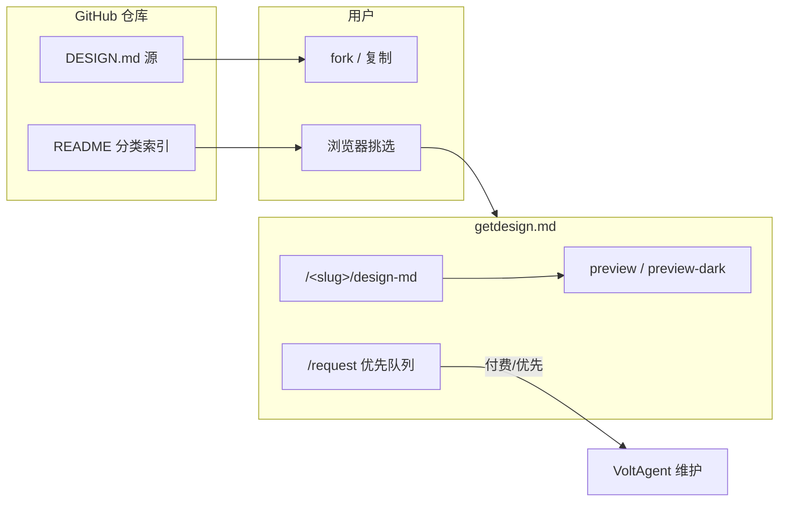
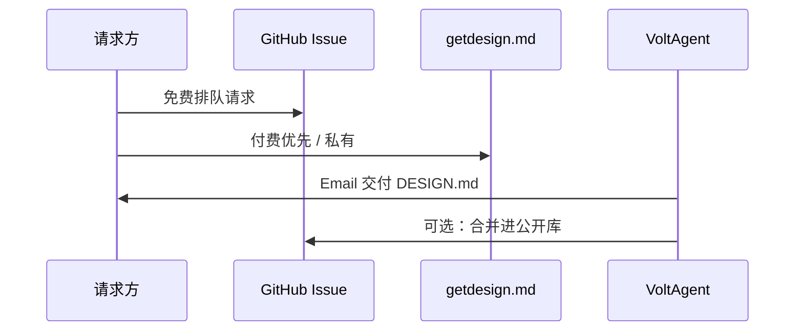

<details>
<summary>相关源文件</summary>

生成本页时使用的主要源文件：

- [README.md](../../../project-repos/awesome-design-md/README.md)
- [.github/ISSUE_TEMPLATE/design-md-request.yml](../../../project-repos/awesome-design-md/.github/ISSUE_TEMPLATE/design-md-request.yml)
- [design-md/vercel/README.md](../../../project-repos/awesome-design-md/design-md/vercel/README.md)

</details>

# 分发与 getdesign.md 生态

Git 仓库不是唯一入口。**getdesign.md** 承担可视化预览、暗色 catalog、付费优先队列和私有定制交付——Git 侧保持 Markdown 源文件的轻量与可 fork 性。

## 双轨分发模型



Sources: [README.md:44-46](../../../project-repos/awesome-design-md/README.md#L44-L46), [design-md/vercel/README.md:1-5](../../../project-repos/awesome-design-md/design-md/vercel/README.md#L1-L5)

<details class="source-snippets">
<summary>引用源码</summary>

<!-- source-snippets:start -->

#### `README.md:44-46`

```markdown
## Request a DESIGN.md

You can [request a DESIGN.md](https://getdesign.md/request) for specific website, including private requests delivered exclusively to you.
```

#### `design-md/vercel/README.md:1-5`

```markdown
# Vercel Inspired Design System Analysis

Design system details have been moved to: https://getdesign.md/vercel/design-md

You can also view previews, dark mode examples, and download options on getdesign.md.
```

<!-- source-snippets:end -->
</details>

## getdesign.md 链接约定

根 README 每个品牌条目链到 `https://getdesign.md/<slug>/design-md`（slug 与 `design-md/` 子目录一致）。子目录 `README.md` 重复同一链接并说明 preview、dark mode、download 在 getdesign.md 提供。

**Git 树 vs README 承诺**：根 README 写每站含 `preview.html` / `preview-dark.html`，当前 clone **不含 HTML 文件**——预览资产在 getdesign.md CDN/站点，不在本 repo。

Sources: [README.md:56-57](../../../project-repos/awesome-design-md/README.md#L56-L57), [README.md:169-175](../../../project-repos/awesome-design-md/README.md#L169-L175)

<details class="source-snippets">
<summary>引用源码</summary>

<!-- source-snippets:start -->

#### `README.md:56-57`

```markdown
- [**Claude**](https://getdesign.md/claude/design-md) - Anthropic's AI assistant. Warm terracotta accent, clean editorial layout
- [**Cohere**](https://getdesign.md/cohere/design-md) - Enterprise AI platform. Vibrant gradients, data-rich dashboard aesthetic
```

#### `README.md:169-175`

```markdown
Each site includes:

| File | Purpose |
|------|---------|
| `DESIGN.md` | The design system (what agents read) |
| `preview.html` | Visual catalog showing color swatches, type scale, buttons, cards |
| `preview-dark.html` | Same catalog with dark surfaces |
```

<!-- source-snippets:end -->
</details>

## 请求新 DESIGN.md

两条路径：

### 1. GitHub Issue（免费、排队）

`.github/ISSUE_TEMPLATE/design-md-request.yml` 收集：

- Website URL（必填）
- Delivery Email（必填）
- Priority 下拉：是否走 getdesign.md 付费优先
- Additional Details（可选）

维护方带宽有限；模板明确指向 [getdesign.md/request](https://getdesign.md/request) 做 same-day 优先。

Sources: [github/ISSUE_TEMPLATE/design-md-request.yml:1-45](../../../project-repos/awesome-design-md/.github/ISSUE_TEMPLATE/design-md-request.yml#L1-L45)

<details class="source-snippets">
<summary>引用源码</summary>

<!-- source-snippets:start -->

#### `github/ISSUE_TEMPLATE/design-md-request.yml:1-45`

```yaml
name: Design MD Request
description: Request a DESIGN.md generated from a website
title: "DESIGN.md request"
labels: ["design-md"]

body:
  - type: markdown
    attributes:
      value: |
        Fill out the form below to request a DESIGN.md generation for your website.
  - type: input
    id: website
    attributes:
      label: Website URL
      description: The website you want us to generate DESIGN.md for
      placeholder: https://example.com
    validations:
      required: true

  - type: input
    id: email
    attributes:
      label: Delivery Email
      description: Email address where we should send the generated DESIGN.md
      placeholder: you@example.com
    validations:
      required: true

  - type: dropdown
    id: priority
    attributes:
      label: Do you want to prioritize your DESIGN.md generation request?
      description: We have limited bandwidth across our open-source projects. For same-day delivery, you can prioritize your request at [getdesign.md/request](https://getdesign.md/request).
      options:
        - "No"
        - "Yes, I'll prioritize at getdesign.md/request"
    validations:
      required: true

  - type: textarea
    id: details
    attributes:
      label: Additional Details (optional)
      description: Anything else you'd like us to know about this request
    validations:
```

<!-- source-snippets:end -->
</details>

### 2. getdesign.md/request（付费优先）

README「Request a DESIGN.md」节：可请求特定网站，含**私有请求**（exclusive delivery）。



Sources: [README.md:44-46](../../../project-repos/awesome-design-md/README.md#L44-L46), [README.md:33-34](../../../project-repos/awesome-design-md/README.md#L33-L34)

<details class="source-snippets">
<summary>引用源码</summary>

<!-- source-snippets:start -->

#### `README.md:44-46`

```markdown
## Request a DESIGN.md

You can [request a DESIGN.md](https://getdesign.md/request) for specific website, including private requests delivered exclusively to you.
```

#### `README.md:33-34`

```markdown
[DESIGN.md](https://stitch.withgoogle.com/docs/design-md/overview/) is a new concept introduced by Google Stitch. A plain-text design system document that AI agents read to generate consistent UI.

```

<!-- source-snippets:end -->
</details>

## 赞助与曝光

README Sponsors 节：赞助 logo 出现在 README 与 getdesign.md（「1M+ view」定位）。Funding 通过 `.github/FUNDING.yml` 配置 GitHub Sponsors 等链接。

Sources: [README.md:48-50](../../../project-repos/awesome-design-md/README.md#L48-L50), [github/FUNDING.yml](../../../project-repos/awesome-design-md/.github/FUNDING.yml)

<details class="source-snippets">
<summary>引用源码</summary>

<!-- source-snippets:start -->

#### `README.md:48-50`

```markdown
## Sponsors ❤️

Become a Sponsor [1M+ view] — your logo here and get listed on [getdesign.md](https://getdesign.md/)
```

#### `github/FUNDING.yml`

```yaml
# These are supported funding model platforms

github: voltagent

```

<!-- source-snippets:end -->
</details>

## VoltAgent 品牌关联

仓库归属 VoltAgent org；Collection 含 **VoltAgent** 自有品牌档案（void-black + emerald）。Discord badge 链到 `s.voltagent.dev/discord`——社区反馈与请求的主通道之一。

Sources: [README.md:21](../../../project-repos/awesome-design-md/README.md:21), [README.md:66](../../../project-repos/awesome-design-md/README.md:66)

<details class="source-snippets">
<summary>引用源码</summary>

<!-- source-snippets:start -->

#### `README.md:21`

> 未找到引用文件：`README.md:21`

#### `README.md:66`

> 未找到引用文件：`README.md:66`

<!-- source-snippets:end -->
</details>

## 相关页面

- [目录与仓库结构](catalog-architecture.md) — Git 侧文件布局
- [代理消费工作流](agent-consumption.md) — 复制使用
- [贡献与治理](contributing-governance.md) — 为何不接受公开 PR 新品牌
