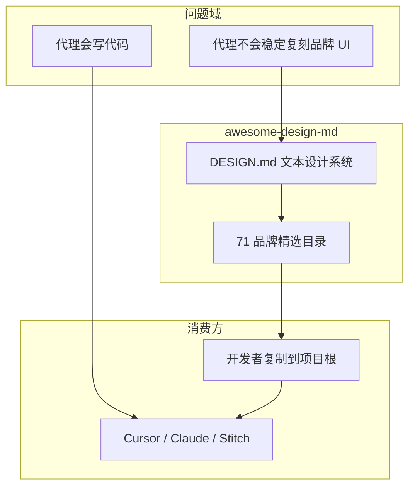
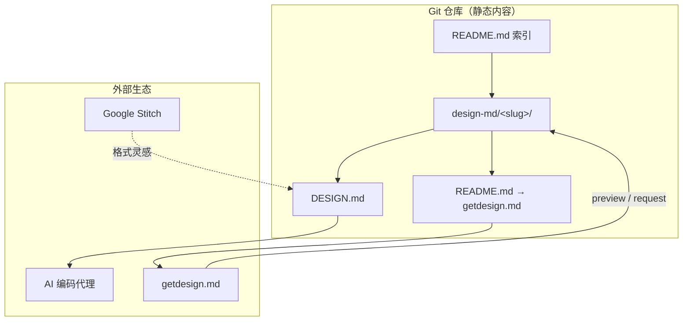

<details>
<summary>相关源文件</summary>

生成本页时使用的主要源文件：

- [README.md](../../../project-repos/awesome-design-md/README.md)
- [LICENSE](../../../project-repos/awesome-design-md/LICENSE)
- [CONTRIBUTING.md](../../../project-repos/awesome-design-md/CONTRIBUTING.md)

</details>

# 项目概览

AI 编码代理已经能读懂 `AGENTS.md` 里的构建约定，却在 UI 层几乎总是「随机发挥」——同一套 prompt 今天像 Tailwind 默认模板，明天像 Material Dashboard。Google Stitch 在 2025 年提出的 **DESIGN.md** 概念，用一份纯 Markdown 设计系统文档补上这块空白：代理读它，就知道按钮该多圆、主色该多深、标题该用什么字重。

**awesome-design-md** 是 VoltAgent 维护的精选库：从 71 个真实网站（Vercel、Linear、Stripe、Notion……）提取视觉语言，写成可直接复制到项目根目录的 `DESIGN.md`。没有 Figma 导出、没有 JSON schema、没有专用 CLI——Markdown 正是 LLM 最擅长消费的格式。

## 项目故事

**痛点**：「照着 XX 官网风格做一个 landing page」是高频需求，但 Figma token、Tailwind preset、或截图喂给多模态模型，要么链路长、要么不可复现。

**核心思路**：把「看起来像 XX」降维成一份结构化文本——颜色语义名 + hex、字体层级表、组件 chrome 描述、Do's and Don'ts。代理在生成 JSX/CSS 时引用 `{colors.primary}` 而非自由发挥 `#3b82f6`。

**与 AGENTS.md 的分工**：

| 文件 | 读者 | 定义什么 |
|------|------|----------|
| `AGENTS.md` | 编码代理 | 怎么构建项目（测试、lint、目录约定） |
| `DESIGN.md` | 设计/编码代理 | 项目应该长什么样、感觉如何 |



Sources: [README.md:31-42](../../../project-repos/awesome-design-md/README.md#L31-L42)

<details class="source-snippets">
<summary>引用源码</summary>

<!-- source-snippets:start -->

#### `README.md:31-42`

```markdown
## What is DESIGN.md?

[DESIGN.md](https://stitch.withgoogle.com/docs/design-md/overview/) is a new concept introduced by Google Stitch. A plain-text design system document that AI agents read to generate consistent UI.

It's just a markdown file. No Figma exports, no JSON schemas, no special tooling. Drop it into your project root and any AI coding agent or Google Stitch instantly understands how your UI should look. Markdown is the format LLMs read best, so there's nothing to parse or configure.

| File | Who reads it | What it defines |
|------|-------------|-----------------|
| `AGENTS.md` | Coding agents | How to build the project |
| `DESIGN.md` | Design agents | How the project should look and feel |

**This repo provides ready-to-use DESIGN.md files** extracted from real websites. 
```

<!-- source-snippets:end -->
</details>

## 能力全景

- **即拷即用**：复制 `design-md/stripe/DESIGN.md` 到项目根，对代理说「按 DESIGN.md 做结账页」——三步完成，README 明确写死这条路径。
- **71 品牌 × 9 大主题**：从 AI 平台（Claude、Mistral）到豪华汽车（Ferrari、Lamborghini），覆盖开发者工具、Fintech、电商、媒体等场景。
- **双轨文档结构**：每份文件前半是 YAML token（机器可读），后半是 Markdown 叙事（人类/代理共读的设计 rationale）。
- **Stitch 格式对齐**：章节骨架遵循 [Google Stitch DESIGN.md 规范](https://stitch.withgoogle.com/docs/design-md/overview/)，并扩展 Responsive、Agent Prompt Guide 等节。
- **getdesign.md 分发面**：Git 仓库存 Markdown 源；预览 HTML、暗色 catalog、付费优先请求走 getdesign.md 站点。

## 架构鸟瞰



Sources: [README.md:153-181](../../../project-repos/awesome-design-md/README.md#L153-L181), [README.md:44-46](../../../project-repos/awesome-design-md/README.md#L44-L46)

<details class="source-snippets">
<summary>引用源码</summary>

<!-- source-snippets:start -->

#### `README.md:153-181`

```markdown
## What's Inside Each DESIGN.md

Every file follows the [Stitch DESIGN.md format](https://stitch.withgoogle.com/docs/design-md/format/) with extended sections:

| # | Section | What it captures |
|---|---------|-----------------|
| 1 | Visual Theme & Atmosphere | Mood, density, design philosophy |
| 2 | Color Palette & Roles | Semantic name + hex + functional role |
| 3 | Typography Rules | Font families, full hierarchy table |
| 4 | Component Stylings | Buttons, cards, inputs, navigation with states |
| 5 | Layout Principles | Spacing scale, grid, whitespace philosophy |
| 6 | Depth & Elevation | Shadow system, surface hierarchy |
| 7 | Do's and Don'ts | Design guardrails and anti-patterns |
| 8 | Responsive Behavior | Breakpoints, touch targets, collapsing strategy |
| 9 | Agent Prompt Guide | Quick color reference, ready-to-use prompts |

Each site includes:

| File | Purpose |
|------|---------|
| `DESIGN.md` | The design system (what agents read) |
| `preview.html` | Visual catalog showing color swatches, type scale, buttons, cards |
| `preview-dark.html` | Same catalog with dark surfaces |

### How to Use


1. Copy a site's `DESIGN.md` into your project root
2. Tell your AI agent to use it.
```

#### `README.md:44-46`

```markdown
## Request a DESIGN.md

You can [request a DESIGN.md](https://getdesign.md/request) for specific website, including private requests delivered exclusively to you.
```

<!-- source-snippets:end -->
</details>

## 技术栈与规模

这不是传统「有 CI、有 package.json」的应用仓库——**147 个 tracked 文件、143 个 Markdown、零构建 manifest**。维护成本集中在内容质量而非编译链路。

| 指标 | 数值 |
|------|------|
| 品牌子目录 | 71 |
| DESIGN.md 文件 | 71 |
| 顶层目录 | `.github`、`design-md` |
| 许可证 | MIT（含视觉身份免责声明） |

Sources: [00-repo-inventory.md](../00-repo-inventory.md), [LICENSE:1-21](../../../project-repos/awesome-design-md/LICENSE#L1-L21)

<details class="source-snippets">
<summary>引用源码</summary>

<!-- source-snippets:start -->

#### `00-repo-inventory.md`

```markdown
# 00 - 仓库盘点

## Source

- Path: `/Users/bytedance/workspace/workspace-local-task/deepwiki/project-repos/awesome-design-md`
- Remote: `https://github.com/voltagent/awesome-design-md.git`
- Branch: `main`
- Commit: `3883984baf05226208a5dae15730a3593548b808`

## File Summary

- Files scanned: 147
- Top-level directories: `.github`, `design-md`

| Extension | Count |
|-----------|------:|
| `.md` | 143 |
| `.yml` | 2 |
| `[no extension]` | 2 |

## Manifests and Build Files

- None detected

## Documentation

- `CONTRIBUTING.md`
- `README.md`
- `design-md/airbnb/README.md`
- `design-md/airtable/README.md`
- `design-md/apple/README.md`
- `design-md/binance/README.md`
- `design-md/bmw-m/README.md`
- `design-md/bmw/README.md`
- `design-md/bugatti/README.md`
- `design-md/cal/README.md`
- `design-md/claude/README.md`
- `design-md/clay/README.md`
- `design-md/clickhouse/README.md`
- `design-md/cohere/README.md`
- `design-md/coinbase/README.md`
- `design-md/composio/README.md`
- `design-md/cursor/README.md`
- `design-md/elevenlabs/README.md`
- `design-md/expo/README.md`
- `design-md/ferrari/README.md`
- `design-md/figma/README.md`
- `design-md/framer/README.md`
- `design-md/hashicorp/README.md`
- `design-md/ibm/README.md`
- `design-md/intercom/README.md`
- `design-md/kraken/README.md`
- `design-md/lamborghini/README.md`
- `design-md/linear.app/README.md`
- `design-md/lovable/README.md`
- `design-md/mastercard/README.md`
- `design-md/meta/README.md`
- `design-md/minimax/README.md`
- `design-md/mintlify/README.md`
- `design-md/miro/README.md`
- `design-md/mistral.ai/README.md`
- `design-md/mongodb/README.md`
- `design-md/nike/README.md`
- `design-md/notion/README.md`
- `design-md/nvidia/README.md`
- `design-md/ollama/README.md`
- `design-md/opencode.ai/README.md`
- `design-md/pinterest/README.md`
- `design-md/playstation/README.md`
- `design-md/posthog/README.md`
- `design-md/raycast/README.md`
- `design-md/renault/README.md`
- `design-md/replicate/README.md`
- `design-md/resend/README.md`
- `design-md/revolut/README.md`
- `design-md/runwayml/README.md`
- `design-md/sanity/README.md`
- `design-md/sentry/README.md`
- `design-md/shopify/README.md`
- `design-md/spacex/README.md`
- `design-md/spotify/README.md`
- `design-md/starbucks/README.md`
- `design-md/stripe/README.md`
- `design-md/supabase/README.md`
- `design-md/superhuman/README.md`
- `design-md/tesla/README.md`
- `design-md/theverge/README.md`
- `design-md/together.ai/README.md`
- `design-md/uber/README.md`
- `design-md/vercel/README.md`
- `design-md/vodafone/README.md`
- `design-md/voltagent/README.md`
- `design-md/warp/README.md`
- `design-md/webflow/README.md`
- `design-md/wired/README.md`
- `design-md/wise/README.md`
- `design-md/x.ai/README.md`
- `design-md/zapier/README.md`

## CI and Automation

- None detected

## Tests

- None detected

## Skills

- None detected
```

#### `LICENSE:1-21`

```
MIT License

Copyright (c) 2026 VoltAgent

Permission is hereby granted, free of charge, to any person obtaining a copy
of this software and associated documentation files (the "Software"), to deal
in the Software without restriction, including without limitation the rights
to use, copy, modify, merge, publish, distribute, sublicense, and/or sell
copies of the Software, and to permit persons to whom the Software is
furnished to do so, subject to the following conditions:

The above copyright notice and this permission notice shall be included in all
copies or substantial portions of the Software.

THE SOFTWARE IS PROVIDED "AS IS", WITHOUT WARRANTY OF ANY KIND, EXPRESS OR
IMPLIED, INCLUDING BUT NOT LIMITED TO THE WARRANTIES OF MERCHANTABILITY,
FITNESS FOR A PARTICULAR PURPOSE AND NONINFRINGEMENT. IN NO EVENT SHALL THE
AUTHORS OR COPYRIGHT HOLDERS BE LIABLE FOR ANY CLAIM, DAMAGES OR OTHER
LIABILITY, WHETHER IN AN ACTION OF CONTRACT, TORT OR OTHERWISE, ARISING FROM,
OUT OF OR IN CONNECTION WITH THE SOFTWARE OR THE USE OR OTHER DEALINGS IN THE
SOFTWARE.
```

<!-- source-snippets:end -->
</details>

## 阅读路线

**只想快速用起来** → [代理消费工作流](agent-consumption.md) → 选品牌 → 复制 `DESIGN.md`。

**要理解文件内部 schema** → [DESIGN.md 文档格式](design-md-format.md) → [Token 与组件模型](token-component-model.md)。

**要挑品牌或对比风格** → [品牌目录与分类](brand-catalog.md) → [品牌档案深度对比](brand-profile-examples.md)。

**维护者 / 法务关注** → [贡献与治理](contributing-governance.md)。

## 相关页面

- [目录与仓库结构](catalog-architecture.md) — `design-md/` 子目录约定
- [DESIGN.md 文档格式](design-md-format.md) — YAML + Markdown 双轨
- [代理消费工作流](agent-consumption.md) — 复制与提示词模式
