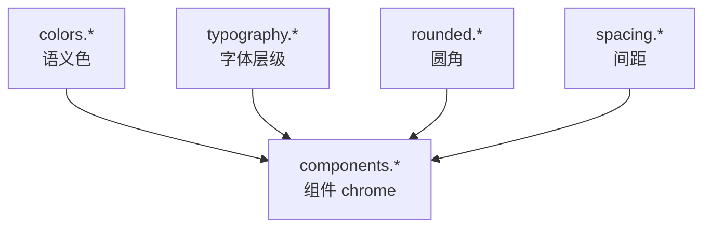
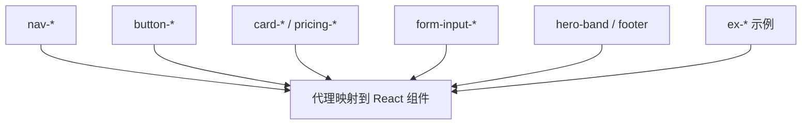

<details>
<summary>相关源文件</summary>

生成本页时使用的主要源文件：

- [design-md/vercel/DESIGN.md](../../../project-repos/awesome-design-md/design-md/vercel/DESIGN.md)
- [design-md/voltagent/DESIGN.md](../../../project-repos/awesome-design-md/design-md/voltagent/DESIGN.md)
- [design-md/stripe/DESIGN.md](../../../project-repos/awesome-design-md/design-md/stripe/DESIGN.md)

</details>

# Token 与组件模型

YAML frontmatter 里的 token 系统是整个库的「机器接口」。理解 `{colors.primary}` 如何在 `components` 块里级联引用，是代理把 DESIGN.md 转成 Tailwind/CSS 变量的关键。

## Token 命名空间

四类 scale 构成完整设计变量表：



Sources: [design-md/vercel/DESIGN.md:6-147](../../../project-repos/awesome-design-md/design-md/vercel/DESIGN.md#L6-L147)

<details class="source-snippets">
<summary>引用源码</summary>

<!-- source-snippets:start -->

#### `design-md/vercel/DESIGN.md:6-147`

```markdown
colors:
  primary: "#171717"
  on-primary: "#ffffff"
  ink: "#171717"
  body: "#4d4d4d"
  mute: "#888888"
  hairline: "#ebebeb"
  hairline-strong: "#a1a1a1"
  canvas: "#ffffff"
  canvas-soft: "#fafafa"
  canvas-soft-2: "#f5f5f5"
  link: "#0070f3"
  link-deep: "#0761d1"
  link-bg-soft: "#d3e5ff"
  success: "#0070f3"
  error: "#ee0000"
  error-soft: "#f7d4d6"
  error-deep: "#c50000"
  warning: "#f5a623"
  warning-soft: "#ffefcf"
  warning-deep: "#ab570a"
  violet: "#7928ca"
  violet-soft: "#d8ccf1"
  violet-deep: "#4c2889"
  cyan: "#50e3c2"
  cyan-soft: "#aaffec"
  cyan-deep: "#29bc9b"
  highlight-pink: "#ff0080"
  highlight-magenta: "#eb367f"
  gradient-develop-start: "#007cf0"
  gradient-develop-end: "#00dfd8"
  gradient-preview-start: "#7928ca"
  gradient-preview-end: "#ff0080"
  gradient-ship-start: "#ff4d4d"
  gradient-ship-end: "#f9cb28"
  selection-bg: "#171717"
  selection-fg: "#f2f2f2"

typography:
  display-xl:
    fontFamily: Geist, Inter, system-ui, -apple-system, sans-serif
    fontSize: 48px
    fontWeight: 600
    lineHeight: 48px
    letterSpacing: -2.4px
  display-lg:
    fontFamily: Geist, Inter, system-ui, -apple-system, sans-serif
    fontSize: 32px
    fontWeight: 600
    lineHeight: 40px
    letterSpacing: -1.28px
  display-md:
    fontFamily: Geist, Inter, system-ui, -apple-system, sans-serif
    fontSize: 24px
    fontWeight: 600
    lineHeight: 32px
    letterSpacing: -0.96px
  display-sm:
    fontFamily: Geist, Inter, system-ui, -apple-system, sans-serif
    fontSize: 20px
    fontWeight: 600
    lineHeight: 28px
    letterSpacing: -0.6px
  body-lg:
    fontFamily: Geist, Inter, system-ui, -apple-system, sans-serif
    fontSize: 18px
    fontWeight: 400
    lineHeight: 28px
    letterSpacing: 0px
  body-md:
    fontFamily: Geist, Inter, system-ui, -apple-system, sans-serif
    fontSize: 16px
    fontWeight: 400
    lineHeight: 24px
  body-md-strong:
    fontFamily: Geist, Inter, system-ui, -apple-system, sans-serif
    fontSize: 16px
    fontWeight: 500
    lineHeight: 24px
  body-sm:
    fontFamily: Geist, Inter, system-ui, -apple-system, sans-serif
    fontSize: 14px
    fontWeight: 400
    lineHeight: 20px
    letterSpacing: -0.28px
  body-sm-strong:
    fontFamily: Geist, Inter, system-ui, -apple-system, sans-serif
    fontSize: 14px
    fontWeight: 500
    lineHeight: 20px
    letterSpacing: -0.28px
  caption:
    fontFamily: Geist, Inter, system-ui, -apple-system, sans-serif
    fontSize: 12px
    fontWeight: 400
    lineHeight: 16px
  caption-mono:
    fontFamily: Geist Mono, ui-monospace, SFMono-Regular, Menlo, Monaco, monospace
    fontSize: 12px
    fontWeight: 400
    lineHeight: 16px
  code:
    fontFamily: Geist Mono, ui-monospace, SFMono-Regular, Menlo, Monaco, monospace
    fontSize: 13px
    fontWeight: 400
    lineHeight: 20px
  button-md:
    fontFamily: Geist, Inter, system-ui, -apple-system, sans-serif
    fontSize: 14px
    fontWeight: 500
    lineHeight: 20px
  button-lg:
    fontFamily: Geist, Inter, system-ui, -apple-system, sans-serif
    fontSize: 16px
    fontWeight: 500
    lineHeight: 24px

rounded:
  none: 0px
  xs: 4px
... snippet truncated ...
```

<!-- source-snippets:end -->
</details>

## colors 语义模型

颜色不按 Tailwind `gray-500` 编号，而用**角色名**：

| 角色类 | 典型 key | 用途 |
|--------|----------|------|
| 品牌主色 | `primary`, `primary-soft` | CTA、强调条 |
| 画布 | `canvas`, `canvas-soft` | 页面背景层级 |
| 文本 | `ink`, `body`, `mute` | 标题 / 正文 / 弱化 |
| 分割 | `hairline`, `hairline-strong` | 边框、表格线 |
| 语义 | `error`, `warning`, `success` | 表单与状态 |
| 渐变 | `gradient-*-start/end` | 品牌装饰（Vercel 三色对） |

Vercel 用 `#171717` ink 作 primary CTA；Voltagent 用 `#00d992` emerald 作 primary——**同一 key 名、完全不同的品牌决策**，代理必须读具体 hex 而非假设 `primary` = 蓝。

Sources: [design-md/vercel/DESIGN.md:6-42](../../../project-repos/awesome-design-md/design-md/vercel/DESIGN.md#L6-L42), [design-md/voltagent/DESIGN.md:6-19](../../../project-repos/awesome-design-md/design-md/voltagent/DESIGN.md#L6-L19)

<details class="source-snippets">
<summary>引用源码</summary>

<!-- source-snippets:start -->

#### `design-md/vercel/DESIGN.md:6-42`

```markdown
colors:
  primary: "#171717"
  on-primary: "#ffffff"
  ink: "#171717"
  body: "#4d4d4d"
  mute: "#888888"
  hairline: "#ebebeb"
  hairline-strong: "#a1a1a1"
  canvas: "#ffffff"
  canvas-soft: "#fafafa"
  canvas-soft-2: "#f5f5f5"
  link: "#0070f3"
  link-deep: "#0761d1"
  link-bg-soft: "#d3e5ff"
  success: "#0070f3"
  error: "#ee0000"
  error-soft: "#f7d4d6"
  error-deep: "#c50000"
  warning: "#f5a623"
  warning-soft: "#ffefcf"
  warning-deep: "#ab570a"
  violet: "#7928ca"
  violet-soft: "#d8ccf1"
  violet-deep: "#4c2889"
  cyan: "#50e3c2"
  cyan-soft: "#aaffec"
  cyan-deep: "#29bc9b"
  highlight-pink: "#ff0080"
  highlight-magenta: "#eb367f"
  gradient-develop-start: "#007cf0"
  gradient-develop-end: "#00dfd8"
  gradient-preview-start: "#7928ca"
  gradient-preview-end: "#ff0080"
  gradient-ship-start: "#ff4d4d"
  gradient-ship-end: "#f9cb28"
  selection-bg: "#171717"
  selection-fg: "#f2f2f2"
```

#### `design-md/voltagent/DESIGN.md:6-19`

```markdown
colors:
  primary: "#00d992"
  primary-soft: "#2fd6a1"
  primary-deep: "#10b981"
  on-primary: "#101010"
  ink: "#f2f2f2"
  ink-strong: "#ffffff"
  body: "#bdbdbd"
  mute: "#8b949e"
  hairline: "#3d3a39"
  hairline-soft: "#b8b3b0"
  canvas: "#101010"
  canvas-soft: "#1a1a1a"
  canvas-text-soft: "#f5f6f7"
```

<!-- source-snippets:end -->
</details>

## typography 层级

每个 typography token 是扁平对象，字段固定：

```yaml
display-xl:
  fontFamily: Geist, Inter, system-ui, …
  fontSize: 48px
  fontWeight: 600
  lineHeight: 48px
  letterSpacing: -2.4px
```

**关键差异点**（跨品牌对比）：

- Vercel：display 用 weight **600**，负 tracking 激进（-2.4px @ 48px）
- Voltagent：hero display-xl 用 weight **400** @ 60px——「文档语气」而非 shouty marketing
- 专用 eyebrow token（`eyebrow-mono`）在 Voltagent 带 `letterSpacing: 2.52px` 大写标签

Sources: [design-md/vercel/DESIGN.md:44-121](../../../project-repos/awesome-design-md/design-md/vercel/DESIGN.md#L44-L121), [design-md/voltagent/DESIGN.md:21-106](../../../project-repos/awesome-design-md/design-md/voltagent/DESIGN.md#L21-L106)

<details class="source-snippets">
<summary>引用源码</summary>

<!-- source-snippets:start -->

#### `design-md/vercel/DESIGN.md:44-121`

```markdown
typography:
  display-xl:
    fontFamily: Geist, Inter, system-ui, -apple-system, sans-serif
    fontSize: 48px
    fontWeight: 600
    lineHeight: 48px
    letterSpacing: -2.4px
  display-lg:
    fontFamily: Geist, Inter, system-ui, -apple-system, sans-serif
    fontSize: 32px
    fontWeight: 600
    lineHeight: 40px
    letterSpacing: -1.28px
  display-md:
    fontFamily: Geist, Inter, system-ui, -apple-system, sans-serif
    fontSize: 24px
    fontWeight: 600
    lineHeight: 32px
    letterSpacing: -0.96px
  display-sm:
    fontFamily: Geist, Inter, system-ui, -apple-system, sans-serif
    fontSize: 20px
    fontWeight: 600
    lineHeight: 28px
    letterSpacing: -0.6px
  body-lg:
    fontFamily: Geist, Inter, system-ui, -apple-system, sans-serif
    fontSize: 18px
    fontWeight: 400
    lineHeight: 28px
    letterSpacing: 0px
  body-md:
    fontFamily: Geist, Inter, system-ui, -apple-system, sans-serif
    fontSize: 16px
    fontWeight: 400
    lineHeight: 24px
  body-md-strong:
    fontFamily: Geist, Inter, system-ui, -apple-system, sans-serif
    fontSize: 16px
    fontWeight: 500
    lineHeight: 24px
  body-sm:
    fontFamily: Geist, Inter, system-ui, -apple-system, sans-serif
    fontSize: 14px
    fontWeight: 400
    lineHeight: 20px
    letterSpacing: -0.28px
  body-sm-strong:
    fontFamily: Geist, Inter, system-ui, -apple-system, sans-serif
    fontSize: 14px
    fontWeight: 500
    lineHeight: 20px
    letterSpacing: -0.28px
  caption:
    fontFamily: Geist, Inter, system-ui, -apple-system, sans-serif
    fontSize: 12px
    fontWeight: 400
    lineHeight: 16px
  caption-mono:
    fontFamily: Geist Mono, ui-monospace, SFMono-Regular, Menlo, Monaco, monospace
    fontSize: 12px
    fontWeight: 400
    lineHeight: 16px
  code:
    fontFamily: Geist Mono, ui-monospace, SFMono-Regular, Menlo, Monaco, monospace
    fontSize: 13px
    fontWeight: 400
    lineHeight: 20px
  button-md:
    fontFamily: Geist, Inter, system-ui, -apple-system, sans-serif
    fontSize: 14px
    fontWeight: 500
    lineHeight: 20px
  button-lg:
    fontFamily: Geist, Inter, system-ui, -apple-system, sans-serif
    fontSize: 16px
    fontWeight: 500
    lineHeight: 24px
```

#### `design-md/voltagent/DESIGN.md:21-106`

```markdown
typography:
  display-xl:
    fontFamily: Inter, system-ui, -apple-system, Segoe UI, Roboto, sans-serif
    fontSize: 60px
    fontWeight: 400
    lineHeight: 60px
    letterSpacing: -0.65px
  display-lg:
    fontFamily: Inter, system-ui, -apple-system, Segoe UI, Roboto, sans-serif
    fontSize: 36px
    fontWeight: 400
    lineHeight: 40px
    letterSpacing: -0.9px
  display-md:
    fontFamily: Inter, system-ui, -apple-system, Segoe UI, Roboto, sans-serif
    fontSize: 24px
    fontWeight: 700
    lineHeight: 32px
    letterSpacing: -0.6px
  display-sm:
    fontFamily: Inter, system-ui, -apple-system, Segoe UI, Roboto, sans-serif
    fontSize: 20px
    fontWeight: 600
    lineHeight: 28px
  eyebrow-mono:
    fontFamily: Inter, system-ui, -apple-system, sans-serif
    fontSize: 14px
    fontWeight: 600
    lineHeight: 20px
    letterSpacing: 2.52px
  eyebrow-uppercase:
    fontFamily: Inter, system-ui, -apple-system, sans-serif
    fontSize: 18px
    fontWeight: 600
    lineHeight: 28px
    letterSpacing: 0.45px
  body-lg:
    fontFamily: Inter, system-ui, -apple-system, sans-serif
    fontSize: 18px
    fontWeight: 400
    lineHeight: 28px
  body-md:
    fontFamily: Inter, system-ui, -apple-system, sans-serif
    fontSize: 16px
    fontWeight: 400
    lineHeight: 26px
  body-md-strong:
    fontFamily: Inter, system-ui, -apple-system, sans-serif
    fontSize: 16px
    fontWeight: 600
    lineHeight: 24px
  body-sm:
    fontFamily: Inter, system-ui, -apple-system, sans-serif
    fontSize: 14px
    fontWeight: 400
    lineHeight: 20px
  body-sm-strong:
    fontFamily: Inter, system-ui, -apple-system, sans-serif
    fontSize: 14px
    fontWeight: 600
    lineHeight: 23px
  caption:
    fontFamily: Inter, system-ui, -apple-system, sans-serif
    fontSize: 12px
    fontWeight: 400
    lineHeight: 16px
  caption-strong:
    fontFamily: Inter, system-ui, -apple-system, sans-serif
    fontSize: 12px
    fontWeight: 500
    lineHeight: 16px
  code:
    fontFamily: SFMono-Regular, Menlo, Monaco, Consolas, Liberation Mono, monospace
    fontSize: 13px
    fontWeight: 400
    lineHeight: 18px
  code-strong:
    fontFamily: SFMono-Regular, Menlo, Monaco, Consolas, monospace
    fontSize: 13px
    fontWeight: 550
    lineHeight: 16px
  button-md:
    fontFamily: Inter, system-ui, -apple-system, sans-serif
    fontSize: 16px
    fontWeight: 600
    lineHeight: 24px
```

<!-- source-snippets:end -->
</details>

## components 引用语法

组件定义值用 **`"{colors.primary}"`** 字符串包裹 token 路径，支持嵌套引用：

```yaml
button-primary:
  backgroundColor: "{colors.primary}"
  textColor: "{colors.on-primary}"
  typography: "{typography.button-lg}"
  rounded: "{rounded.pill}"
  padding: "0px {spacing.sm}"
```

这种 indirection 让改 primary hex 时组件区自动一致——代理生成 CSS 变量时可 1:1 映射为 `--color-primary: #171717`。

Sources: [design-md/vercel/DESIGN.md:182-193](../../../project-repos/awesome-design-md/design-md/vercel/DESIGN.md#L182-L193)

<details class="source-snippets">
<summary>引用源码</summary>

<!-- source-snippets:start -->

#### `design-md/vercel/DESIGN.md:182-193`

```markdown
  button-primary:
    backgroundColor: "{colors.primary}"
    textColor: "{colors.on-primary}"
    typography: "{typography.button-lg}"
    rounded: "{rounded.pill}"
    padding: "0px {spacing.sm}"
  button-secondary:
    backgroundColor: "{colors.canvas}"
    textColor: "{colors.ink}"
    typography: "{typography.button-lg}"
    rounded: "{rounded.pill}"
    padding: "0px {spacing.sm}"
```

<!-- source-snippets:end -->
</details>

## 组件 taxonomy

Vercel 档案 `components` 块涵盖 30+ 命名组件，分几类：

| 类别 | 示例 key | 说明 |
|------|----------|------|
| 导航 | `nav-bar`, `nav-link`, `nav-cta-signup` | 含多种 CTA 变体 |
| 按钮 | `button-primary`, `button-secondary`, `tab-ghost` | 营销 pill vs 应用方角共存 |
| 卡片 | `card-marketing`, `pricing-card-featured` | 含 polarity-flip 特色层 |
| 表单 | `form-input`, `form-input-lg` | 高度 token 化 |
| 布局 band | `hero-band`, `feature-mesh-band` | 段落级 surface |
| 示例 | `ex-pricing-tier`, `ex-modal-card` | 跨场景迁移模板 |



Sources: [design-md/vercel/DESIGN.md:148-327](../../../project-repos/awesome-design-md/design-md/vercel/DESIGN.md#L148-L327)

<details class="source-snippets">
<summary>引用源码</summary>

<!-- source-snippets:start -->

#### `design-md/vercel/DESIGN.md:148-327`

```markdown
components:
  nav-bar:
    backgroundColor: "{colors.canvas}"
    textColor: "{colors.ink}"
    typography: "{typography.body-sm}"
    height: 64px
    padding: "{spacing.sm} {spacing.lg}"
  nav-link:
    textColor: "{colors.body}"
    typography: "{typography.body-sm}"
    rounded: "{rounded.full}"
    padding: "{spacing.xs} {spacing.sm}"
  nav-cta-signup:
    backgroundColor: "{colors.primary}"
    textColor: "{colors.on-primary}"
    typography: "{typography.body-sm-strong}"
    rounded: "{rounded.sm}"
    padding: "0px {spacing.xs}"
    height: 28px
  nav-cta-login:
    backgroundColor: "{colors.canvas}"
    textColor: "{colors.ink}"
    typography: "{typography.body-sm-strong}"
    rounded: "{rounded.sm}"
    padding: "0px {spacing.xs}"
    height: 28px
  nav-cta-ask-ai:
    backgroundColor: "{colors.canvas}"
    textColor: "{colors.ink}"
    borderColor: "{colors.hairline}"
    typography: "{typography.body-sm-strong}"
    rounded: "{rounded.sm}"
    padding: "0px {spacing.xs}"
    height: 28px
  button-primary:
    backgroundColor: "{colors.primary}"
    textColor: "{colors.on-primary}"
    typography: "{typography.button-lg}"
    rounded: "{rounded.pill}"
    padding: "0px {spacing.sm}"
  button-secondary:
    backgroundColor: "{colors.canvas}"
    textColor: "{colors.ink}"
    typography: "{typography.button-lg}"
    rounded: "{rounded.pill}"
    padding: "0px {spacing.sm}"
  button-primary-sm:
    backgroundColor: "{colors.primary}"
    textColor: "{colors.on-primary}"
    typography: "{typography.button-md}"
    rounded: "{rounded.pill}"
    padding: "0px {spacing.xs}"
  button-secondary-sm:
    backgroundColor: "{colors.canvas}"
    textColor: "{colors.ink}"
    typography: "{typography.button-md}"
    rounded: "{rounded.pill}"
    padding: "0px {spacing.xs}"
  tab-ghost:
    backgroundColor: "{colors.canvas}"
    textColor: "{colors.ink}"
    typography: "{typography.body-sm}"
    rounded: "{rounded.pill-sm}"
    padding: "0px {spacing.md}"
  icon-button-circular:
    backgroundColor: "{colors.canvas}"
    textColor: "{colors.ink}"
    borderColor: "{colors.hairline}"
    rounded: "{rounded.full}"
  card-marketing:
    backgroundColor: "{colors.canvas}"
    textColor: "{colors.ink}"
    typography: "{typography.body-md}"
    rounded: "{rounded.md}"
    padding: "{spacing.lg}"
  card-marketing-large:
    backgroundColor: "{colors.canvas}"
    textColor: "{colors.ink}"
    typography: "{typography.body-md}"
    rounded: "{rounded.lg}"
    padding: "{spacing.xl}"
  card-soft:
    backgroundColor: "{colors.canvas-soft}"
    textColor: "{colors.ink}"
    typography: "{typography.body-md}"
    rounded: "{rounded.md}"
    padding: "{spacing.lg}"
  template-card:
    backgroundColor: "{colors.canvas}"
    textColor: "{colors.ink}"
    typography: "{typography.body-md}"
    rounded: "{rounded.md}"
    padding: "{spacing.md}"
  code-editor-mockup:
    backgroundColor: "{colors.primary}"
    textColor: "{colors.on-primary}"
    typography: "{typography.code}"
    rounded: "{rounded.md}"
    padding: "{spacing.lg}"
  form-input:
    backgroundColor: "{colors.canvas}"
    textColor: "{colors.ink}"
    borderColor: "{colors.hairline}"
    typography: "{typography.body-sm}"
    rounded: "{rounded.sm}"
    padding: "0px {spacing.sm}"
    height: 40px
  form-input-sm:
    backgroundColor: "{colors.canvas}"
    textColor: "{colors.ink}"
    borderColor: "{colors.hairline}"
    typography: "{typography.body-sm}"
    rounded: "{rounded.sm}"
    padding: "0px {spacing.sm}"
    height: 32px
  form-input-lg:
    backgroundColor: "{colors.canvas}"
    textColor: "{colors.ink}"
    borderColor: "{colors.hairline}"
    typography: "{typography.body-md}"
... snippet truncated ...
```

<!-- source-snippets:end -->
</details>

## ex- 示例组件模式

`ex-*` 条目带 `description` 字段解释映射意图，例如 `ex-pricing-tier-featured` 描述 polarity-flip 到 ink primary。注释块 `# ─── Examples (illustrative) ───` 把「从官网提取的 chrome」和「通用 SaaS 模式」分开——维护者可以扩展 ex- 而不改核心 nav/button token。

Sources: [design-md/vercel/DESIGN.md:329-388](../../../project-repos/awesome-design-md/design-md/vercel/DESIGN.md#L329-L388)

<details class="source-snippets">
<summary>引用源码</summary>

<!-- source-snippets:start -->

#### `design-md/vercel/DESIGN.md:329-388`

```markdown
  # ─── Examples (illustrative) — auto-derived; resolve any TO_FILL markers below ───
  ex-pricing-tier:
    description: "Default tier card. Mirrors pricing-card chrome on canvas-soft surface with a hairline border."
    backgroundColor: "{colors.canvas-soft}"
    textColor: "{colors.ink}"
    borderColor: "{colors.hairline}"
    rounded: "{rounded.lg}"
    padding: "{spacing.xl}"
  ex-pricing-tier-featured:
    description: "Featured tier — polarity-flipped to ink primary with white text and white CTA."
    backgroundColor: "{colors.ink}"
    textColor: "{colors.on-primary}"
    rounded: "{rounded.lg}"
    padding: "{spacing.xl}"
  ex-product-selector:
    description: "What's Included summary card — repurposed for the brand's GPU / inference / Pro feature tiers."
    backgroundColor: "{colors.canvas-soft}"
    rounded: "{rounded.md}"
    padding: "{spacing.lg}"
  ex-cart-drawer:
    description: "Subscription summary — line items per add-on (NOT a literal e-commerce cart)."
    backgroundColor: "{colors.canvas}"
    rounded: "{rounded.md}"
    padding: "{spacing.lg}"
    item-divider: "{colors.hairline}"
  ex-app-shell-row:
    description: "Sidebar nav row. Active state uses brand primary as a left-edge indicator bar."
    backgroundColor: "{colors.canvas}"
    activeIndicator: "{colors.primary}"
    rounded: "{rounded.sm}"
    padding: "{spacing.xs} {spacing.sm}"
  ex-data-table-cell:
    description: "Mirrors the brand's table chrome. Header uses caption-mono uppercase mono; body uses body-sm."
    headerBackground: "{colors.canvas-soft}"
    headerTypography: "{typography.caption-mono}"
    bodyTypography: "{typography.body-sm}"
    cellPadding: "{spacing.xs} {spacing.sm}"
    rowBorder: "{colors.hairline}"
  ex-auth-form-card:
    description: "Sign-in / sign-up card. Mirrors card-marketing-large chrome with form-input primitives inside."
    backgroundColor: "{colors.canvas-soft}"
    rounded: "{rounded.lg}"
    padding: "{spacing.xl}"
  ex-modal-card:
    description: "Modal dialog surface — same chrome as card-marketing-large with Level 5 modal shadow."
    backgroundColor: "{colors.canvas}"
    rounded: "{rounded.lg}"
    padding: "{spacing.xl}"
  ex-empty-state-card:
    description: "Empty-state illustration frame. Generous padding on canvas-soft."
    backgroundColor: "{colors.canvas-soft}"
    rounded: "{rounded.lg}"
    padding: "{spacing.3xl}"
    captionTypography: "{typography.body-md}"
  ex-toast:
    description: "Toast notification surface — flat-cornered card-marketing chrome with Level 4 shadow."
    backgroundColor: "{colors.canvas}"
    rounded: "{rounded.md}"
    padding: "{spacing.sm} {spacing.md}"
    typography: "{typography.body-sm}"
```

<!-- source-snippets:end -->
</details>

## 实现映射建议

代理把 DESIGN.md 落地时的可靠顺序：

1. 从 YAML 导出 CSS variables（colors + spacing + rounded）
2. 用 typography 表生成 `@layer utilities` 或 Tailwind `theme.extend.fontSize`
3. 按 `components` key 建 React 组件，props 默认读 token 变量
4. 读 Do's and Don'ts 做 lint 规则（如 Vercel：禁止 headline all-caps）

Sources: [design-md/vercel/DESIGN.md:718-737](../../../project-repos/awesome-design-md/design-md/vercel/DESIGN.md#L718-L737)

<details class="source-snippets">
<summary>引用源码</summary>

<!-- source-snippets:start -->

#### `design-md/vercel/DESIGN.md:718-737`

```markdown
## Do's and Don'ts

### Do
- Reserve `{colors.primary}` (`#171717`) for primary CTAs across the page. Black ink IS the conversion target.
- Use `{rounded.pill}` 100 px for every marketing-scale CTA and `{rounded.sm}` 6 px for nav-scale buttons. The two pill scales coexist deliberately.
- Set every headline in `{typography.display-*}` weight 600, sentence-case, often period-terminated. Aggressive negative tracking is part of the voice.
- Use the brand mesh gradient as atmospheric decoration at hero scale only — never miniaturise it to an icon, never reduce to a single colour.
- Layer stacked shadows (multiple small offsets with inset hairline) rather than single heavy drops. The brand's elevation is calmer than Material.
- Cycle page surfaces in `{colors.canvas-soft}` → `{colors.canvas}` → `{colors.primary}` polarity-flipped bands; the dark band IS the depth cue.
- Set every code block and technical eyebrow in `{typography.code}` / `{typography.caption-mono}`. Mono is the voice of the platform.

### Don't
- Don't introduce a sixth accent colour. The brand operates with ink + gray + the four-pair gradient palette; new accents flatten the voice.
- Don't render headlines in all-caps. Sentence-case + negative tracking is non-negotiable.
- Don't drop a single heavy drop-shadow on cards. The brand's elevation is built from stacked small offsets + inset hairline rings.
- Don't render the brand gradient at icon scale or in a single-colour reduced form. The gradient lives at hero scale only.
- Don't promote the geometric sans to weight 700. The brand's display ceiling is 600.
- Don't pair the marketing 100-px pill CTA shape with the 6-px nav radius on the same screen — pick a scale and stay there.
- Don't set body paragraphs in the mono face. The mono is for code + technical labels only.
```

<!-- source-snippets:end -->
</details>

## 相关页面

- [DESIGN.md 文档格式](design-md-format.md) — 双轨结构总览
- [品牌档案深度对比](brand-profile-examples.md) — 三品牌 token 差异
- [代理消费工作流](agent-consumption.md) — 提示代理按 token 生成
